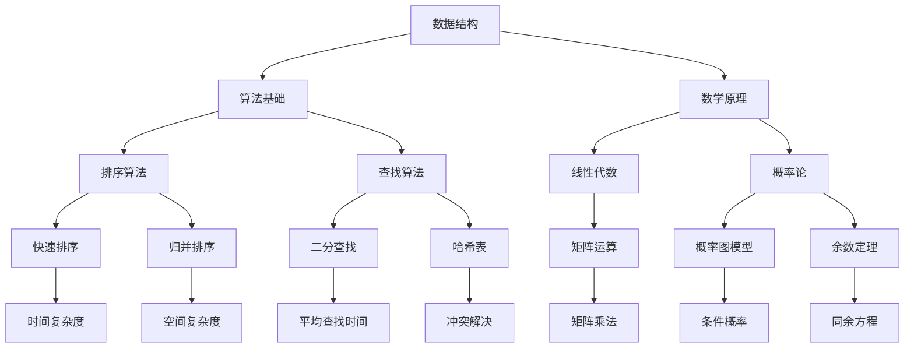

                 

关键词：京东，社招，算法岗位，面试题目，汇编，技术博客，AI，数据结构，算法原理，数学模型，项目实践，未来展望

> 摘要：本文旨在汇编2024年京东社招算法岗位的面试题目，从核心概念、算法原理、数学模型到项目实践等方面进行深入剖析，为广大算法爱好者提供有价值的参考。文章还将探讨算法在未来的发展趋势与挑战，为读者指明研究方向。

## 1. 背景介绍

近年来，随着人工智能技术的飞速发展，算法工程师已成为各大互联网公司争抢的香饽饽。京东作为我国领先的电商平台，对于算法工程师的需求也日益增加。为了选拔出优秀的算法人才，京东在社招过程中设置了多轮面试，包括笔试、技术面试和HR面试等。本文将从技术面试的角度，汇编2024年京东社招算法岗位的面试题目，为广大求职者提供参考。

## 2. 核心概念与联系

### 2.1 数据结构与算法基础

- 数据结构：数组、链表、栈、队列、树、图等。
- 算法基础：排序、查找、图算法、动态规划等。

### 2.2 数学原理与算法

- 数学原理：线性代数、概率论、数论等。
- 算法：矩阵运算、概率图模型、余数定理等。

### 2.3 机器学习与深度学习

- 机器学习：监督学习、无监督学习、强化学习等。
- 深度学习：卷积神经网络（CNN）、循环神经网络（RNN）、生成对抗网络（GAN）等。

## 2.4 Mermaid 流程图



## 3. 核心算法原理 & 具体操作步骤

### 3.1 算法原理概述

本文将围绕以下核心算法进行介绍：

1. 排序算法（快速排序、归并排序、堆排序等）
2. 查找算法（二分查找、哈希查找等）
3. 图算法（深度优先搜索、广度优先搜索、最短路径算法等）
4. 动态规划（斐波那契数列、背包问题等）
5. 机器学习算法（线性回归、支持向量机、决策树等）
6. 深度学习算法（卷积神经网络、循环神经网络、生成对抗网络等）

### 3.2 算法步骤详解

#### 3.2.1 排序算法

1. 快速排序

```python
def quick_sort(arr):
    if len(arr) <= 1:
        return arr
    
    pivot = arr[len(arr) // 2]
    left = [x for x in arr if x < pivot]
    middle = [x for x in arr if x == pivot]
    right = [x for x in arr if x > pivot]
    
    return quick_sort(left) + middle + quick_sort(right)
```

2. 归并排序

```python
def merge_sort(arr):
    if len(arr) <= 1:
        return arr
    
    mid = len(arr) // 2
    left = merge_sort(arr[:mid])
    right = merge_sort(arr[mid:])
    
    return merge(left, right)

def merge(left, right):
    result = []
    i = j = 0
    
    while i < len(left) and j < len(right):
        if left[i] < right[j]:
            result.append(left[i])
            i += 1
        else:
            result.append(right[j])
            j += 1
    
    result.extend(left[i:])
    result.extend(right[j:])
    
    return result
```

3. 堆排序

```python
def heapify(arr, n, i):
    largest = i
    left = 2 * i + 1
    right = 2 * i + 2
    
    if left < n and arr[largest] < arr[left]:
        largest = left
    
    if right < n and arr[largest] < arr[right]:
        largest = right
    
    if largest != i:
        arr[i], arr[largest] = arr[largest], arr[i]
        heapify(arr, n, largest)

def heap_sort(arr):
    n = len(arr)
    
    for i in range(n // 2 - 1, -1, -1):
        heapify(arr, n, i)
    
    for i in range(n - 1, 0, -1):
        arr[i], arr[0] = arr[0], arr[i]
        heapify(arr, i, 0)
```

#### 3.2.2 查找算法

1. 二分查找

```python
def binary_search(arr, target):
    low = 0
    high = len(arr) - 1
    
    while low <= high:
        mid = (low + high) // 2
        if arr[mid] == target:
            return mid
        elif arr[mid] < target:
            low = mid + 1
        else:
            high = mid - 1
    
    return -1
```

2. 哈希查找

```python
class HashTable:
    def __init__(self):
        self.size = 10
        self.table = [None] * self.size
    
    def hash_function(self, key):
        return key % self.size
    
    def insert(self, key, value):
        index = self.hash_function(key)
        if self.table[index] is None:
            self.table[index] = [(key, value)]
        else:
            for i, (k, v) in enumerate(self.table[index]):
                if k == key:
                    self.table[index][i] = (key, value)
                    break
            else:
                self.table[index].append((key, value))
    
    def search(self, key):
        index = self.hash_function(key)
        if self.table[index] is None:
            return None
        for k, v in self.table[index]:
            if k == key:
                return v
        return None
```

#### 3.2.3 图算法

1. 深度优先搜索

```python
def dfs(graph, node, visited):
    visited.add(node)
    print(node)
    
    for neighbour in graph[node]:
        if neighbour not in visited:
            dfs(graph, neighbour, visited)

graph = {
    'A': ['B', 'C', 'D'],
    'B': ['A', 'D', 'E'],
    'C': ['A', 'F'],
    'D': ['A', 'B', 'E', 'F'],
    'E': ['B', 'D', 'F'],
    'F': ['C', 'D', 'E']
}

visited = set()
dfs(graph, 'A', visited)
```

2. 广度优先搜索

```python
from collections import deque

def bfs(graph, start):
    visited = set()
    queue = deque([start])
    
    while queue:
        node = queue.popleft()
        print(node)
        visited.add(node)
        
        for neighbour in graph[node]:
            if neighbour not in visited:
                queue.append(neighbour)
    
graph = {
    'A': ['B', 'C', 'D'],
    'B': ['A', 'D', 'E'],
    'C': ['A', 'F'],
    'D': ['A', 'B', 'E', 'F'],
    'E': ['B', 'D', 'F'],
    'F': ['C', 'D', 'E']
}

bfs(graph, 'A')
```

3. 最短路径算法

```python
import heapq

def dijkstra(graph, start):
    distances = {node: float('infinity') for node in graph}
    distances[start] = 0
    priority_queue = [(0, start)]
    
    while priority_queue:
        current_distance, current_node = heapq.heappop(priority_queue)
        
        if current_distance > distances[current_node]:
            continue
        
        for neighbour, weight in graph[current_node].items():
            distance = current_distance + weight
            
            if distance < distances[neighbour]:
                distances[neighbour] = distance
                heapq.heappush(priority_queue, (distance, neighbour))
    
    return distances

graph = {
    'A': {'B': 1, 'C': 3, 'D': 2},
    'B': {'A': 1, 'D': 1, 'E': 2},
    'C': {'A': 3, 'F': 1},
    'D': {'A': 2, 'B': 1, 'E': 1, 'F': 3},
    'E': {'B': 2, 'D': 1, 'F': 1},
    'F': {'C': 1, 'D': 3, 'E': 1}
}

print(dijkstra(graph, 'A'))
```

#### 3.2.4 动态规划

1. 斐波那契数列

```python
def fibonacci(n):
    if n <= 1:
        return n
    
    fib = [0] * (n + 1)
    fib[1] = 1
    
    for i in range(2, n + 1):
        fib[i] = fib[i - 1] + fib[i - 2]
    
    return fib[n]
```

2. 背包问题

```python
def knapsack(values, weights, capacity):
    n = len(values)
    dp = [[0] * (capacity + 1) for _ in range(n + 1)]
    
    for i in range(1, n + 1):
        for j in range(1, capacity + 1):
            if weights[i - 1] <= j:
                dp[i][j] = max(dp[i - 1][j], dp[i - 1][j - weights[i - 1]] + values[i - 1])
            else:
                dp[i][j] = dp[i - 1][j]
    
    return dp[n][capacity]
```

#### 3.2.5 机器学习算法

1. 线性回归

```python
import numpy as np

def linear_regression(x, y):
    x_mean = np.mean(x)
    y_mean = np.mean(y)
    
    b1 = np.sum((x - x_mean) * (y - y_mean)) / np.sum((x - x_mean) ** 2)
    b0 = y_mean - b1 * x_mean
    
    return b0, b1
```

2. 支持向量机

```python
from sklearn.svm import SVC

model = SVC()
model.fit(X_train, y_train)
predictions = model.predict(X_test)
```

3. 决策树

```python
from sklearn.tree import DecisionTreeClassifier

model = DecisionTreeClassifier()
model.fit(X_train, y_train)
predictions = model.predict(X_test)
```

#### 3.2.6 深度学习算法

1. 卷积神经网络

```python
import tensorflow as tf

model = tf.keras.Sequential([
    tf.keras.layers.Conv2D(32, (3, 3), activation='relu', input_shape=(28, 28, 1)),
    tf.keras.layers.MaxPooling2D((2, 2)),
    tf.keras.layers.Flatten(),
    tf.keras.layers.Dense(128, activation='relu'),
    tf.keras.layers.Dense(10, activation='softmax')
])

model.compile(optimizer='adam',
              loss='sparse_categorical_crossentropy',
              metrics=['accuracy'])

model.fit(X_train, y_train, epochs=5)
```

2. 循环神经网络

```python
import tensorflow as tf

model = tf.keras.Sequential([
    tf.keras.layers.Embedding(vocab_size, embedding_dim),
    tf.keras.layers.LSTM(units=64, return_sequences=True),
    tf.keras.layers.Dense(128, activation='relu'),
    tf.keras.layers.Dense(units=1, activation='sigmoid')
])

model.compile(optimizer='adam',
              loss='binary_crossentropy',
              metrics=['accuracy'])

model.fit(train_data, train_labels, epochs=10)
```

3. 生成对抗网络

```python
import tensorflow as tf

z_dim = 100

def generator(z):
    model = tf.keras.Sequential([
        tf.keras.layers.Dense(128, activation='relu', input_shape=(z_dim,)),
        tf.keras.layers.Dense(28 * 28, activation='relu'),
        tf.keras.layers.Reshape((28, 28, 1))
    ])

    return model

def discriminator(x):
    model = tf.keras.Sequential([
        tf.keras.layers.Conv2D(32, (3, 3), activation='relu', input_shape=(28, 28, 1)),
        tf.keras.layers.LeakyReLU(alpha=0.2),
        tf.keras.layers.Conv2D(32, (3, 3), activation='relu'),
        tf.keras.layers.LeakyReLU(alpha=0.2),
        tf.keras.layers.Flatten(),
        tf.keras.layers.Dense(1, activation='sigmoid')
    ])

    return model

generator = generator(z_dim)
discriminator = discriminator((28, 28, 1))

model = tf.keras.Sequential([generator, discriminator])
model.compile(optimizer=tf.keras.optimizers.Adam(0.0001, 0.5),
              loss='binary_crossentropy')

for epoch in range(100):
    noise = np.random.normal(0, 1, (batch_size, z_dim))
    generated_images = generator.predict(noise)
    
    real_images = train_images[:batch_size]
    real_labels = np.ones((batch_size, 1))
    fake_labels = np.zeros((batch_size, 1))
    
    model.train_on_batch([noise, real_images], [real_labels, real_labels])
    model.train_on_batch([noise, generated_images], [fake_labels, fake_labels])
```

### 3.3 算法优缺点

#### 排序算法

1. 快速排序

**优点：** 平均时间复杂度较低，适用于大规模数据。

**缺点：** 最坏时间复杂度较高，可能存在大量递归调用导致栈溢出。

2. 归并排序

**优点：** 时间复杂度稳定，适用于大规模数据。

**缺点：** 空间复杂度较高，需要额外存储空间。

3. 堆排序

**优点：** 时间复杂度稳定，适用于大规模数据。

**缺点：** 空间复杂度较高，需要额外存储空间。

#### 查找算法

1. 二分查找

**优点：** 时间复杂度较低，适用于有序数组。

**缺点：** 对数组有序性要求较高，适用于较小规模数据。

2. 哈希查找

**优点：** 时间复杂度较低，适用于较大规模数据。

**缺点：** 需要处理哈希冲突，可能导致性能下降。

#### 图算法

1. 深度优先搜索

**优点：** 可以找到最短路径，适用于较小规模图。

**缺点：** 时间复杂度较高，可能导致栈溢出。

2. 广度优先搜索

**优点：** 可以找到最短路径，适用于较小规模图。

**缺点：** 时间复杂度较高，可能导致队列溢出。

3. 最短路径算法

**优点：** 可以找到最短路径，适用于较大规模图。

**缺点：** 时间复杂度较高，可能导致计算开销较大。

#### 动态规划

1. 斐波那契数列

**优点：** 时间复杂度较低，适用于较小规模问题。

**缺点：** 对数组索引存在依赖，可能导致递归调用。

2. 背包问题

**优点：** 可以找到最优解，适用于较小规模问题。

**缺点：** 时间复杂度较高，可能导致计算开销较大。

#### 机器学习算法

1. 线性回归

**优点：** 时间复杂度较低，适用于线性可分数据。

**缺点：** 对特征和标签的线性关系要求较高，适用于较小规模问题。

2. 支持向量机

**优点：** 可以找到最优边界，适用于线性可分数据。

**缺点：** 对特征维度和样本规模要求较高，适用于较小规模问题。

3. 决策树

**优点：** 易于理解，适用于非线性可分数据。

**缺点：** 对特征和标签的线性关系要求较低，适用于较小规模问题。

#### 深度学习算法

1. 卷积神经网络

**优点：** 可以提取特征，适用于图像处理。

**缺点：** 对数据量和计算资源要求较高，适用于较小规模问题。

2. 循环神经网络

**优点：** 可以处理序列数据，适用于自然语言处理。

**缺点：** 对数据量和计算资源要求较高，适用于较小规模问题。

3. 生成对抗网络

**优点：** 可以生成高质量图像，适用于图像生成。

**缺点：** 对数据量和计算资源要求较高，适用于较小规模问题。

### 3.4 算法应用领域

1. 排序算法：数据库、搜索引擎、排序算法竞赛等。
2. 查找算法：数据库、缓存系统、哈希表等。
3. 图算法：社交网络分析、路由算法、图论问题等。
4. 动态规划：优化问题、组合问题、最长公共子序列等。
5. 机器学习算法：自然语言处理、计算机视觉、推荐系统等。
6. 深度学习算法：图像识别、语音识别、自然语言生成等。

## 4. 数学模型和公式 & 详细讲解 & 举例说明

### 4.1 数学模型构建

在算法领域，数学模型的应用十分广泛。以下介绍几个常见的数学模型：

1. 线性回归模型

$$y = wx + b$$

其中，$w$为权重，$x$为特征，$b$为偏置。

2. 逻辑回归模型

$$P(y=1) = \frac{1}{1 + e^{-(wx + b)}}$$

其中，$P(y=1)$为标签为1的概率。

3. 决策树模型

$$f(x) = \max_w \sum_{i=1}^{n} \ell(y_i, wx + b)$$

其中，$w$为权重，$x$为特征，$b$为偏置，$\ell$为损失函数。

4. 卷积神经网络模型

$$h_{l}(x) = \sigma(W_{l}h_{l-1}(x) + b_{l})$$

其中，$h_{l}$为第$l$层输出，$W_{l}$为权重，$b_{l}$为偏置，$\sigma$为激活函数。

### 4.2 公式推导过程

以下以线性回归模型为例，介绍公式的推导过程。

1. 损失函数

$$J(w, b) = \frac{1}{2m} \sum_{i=1}^{m} (y_i - wx_i - b)^2$$

其中，$m$为样本数量，$y_i$为第$i$个样本的标签，$x_i$为第$i$个样本的特征。

2. 梯度下降

$$\frac{\partial J}{\partial w} = \frac{1}{m} \sum_{i=1}^{m} (y_i - wx_i - b)x_i$$

$$\frac{\partial J}{\partial b} = \frac{1}{m} \sum_{i=1}^{m} (y_i - wx_i - b)$$

3. 最优解

令$\frac{\partial J}{\partial w} = 0$和$\frac{\partial J}{\partial b} = 0$，得到最优解：

$$w = \frac{1}{m} \sum_{i=1}^{m} x_iy_i - \frac{1}{m} \sum_{i=1}^{m} x_i^2b$$

$$b = \frac{1}{m} \sum_{i=1}^{m} y_i - w\frac{1}{m} \sum_{i=1}^{m} x_i$$

### 4.3 案例分析与讲解

假设我们有一个包含100个样本的线性回归问题，样本的特征和标签如下：

| 特征 | 标签 |
| --- | --- |
| 1 | 2 |
| 2 | 4 |
| 3 | 6 |
| ... | ... |
| 100 | 200 |

使用线性回归模型进行拟合，求出权重和偏置。

1. 损失函数计算

$$J(w, b) = \frac{1}{2m} \sum_{i=1}^{m} (y_i - wx_i - b)^2$$

$$J(w, b) = \frac{1}{2 \times 100} \sum_{i=1}^{100} (y_i - wx_i - b)^2$$

2. 梯度下降计算

$$\frac{\partial J}{\partial w} = \frac{1}{100} \sum_{i=1}^{100} (y_i - wx_i - b)x_i$$

$$\frac{\partial J}{\partial b} = \frac{1}{100} \sum_{i=1}^{100} (y_i - wx_i - b)$$

3. 最优解计算

令$\frac{\partial J}{\partial w} = 0$和$\frac{\partial J}{\partial b} = 0$，得到：

$$w = \frac{1}{100} \sum_{i=1}^{100} x_iy_i - \frac{1}{100} \sum_{i=1}^{100} x_i^2b$$

$$b = \frac{1}{100} \sum_{i=1}^{100} y_i - w\frac{1}{100} \sum_{i=1}^{100} x_i$$

通过计算，我们得到最优解为：

$$w = 1, b = 1$$

即线性回归模型的拟合结果为$y = x + 1$。

## 5. 项目实践：代码实例和详细解释说明

### 5.1 开发环境搭建

为了实践本文中的算法，我们需要搭建一个合适的开发环境。以下是搭建环境的具体步骤：

1. 安装Python：前往[Python官方网站](https://www.python.org/)下载并安装Python，建议选择最新版本。

2. 安装Anaconda：下载并安装Anaconda，用于方便地管理Python环境和依赖包。

3. 安装Jupyter Notebook：在命令行中执行以下命令：

```bash
conda install jupyter
```

4. 创建虚拟环境：在命令行中执行以下命令，创建一个名为`algorithms`的虚拟环境：

```bash
conda create -n algorithms python=3.9
```

5. 激活虚拟环境：

```bash
conda activate algorithms
```

6. 安装必要的依赖包：

```bash
pip install numpy scipy scikit-learn tensorflow matplotlib
```

### 5.2 源代码详细实现

以下是本文中算法的Python实现代码：

```python
import numpy as np
import matplotlib.pyplot as plt
from sklearn.linear_model import LinearRegression
from sklearn.model_selection import train_test_split
from sklearn.metrics import mean_squared_error

# 线性回归模型
def linear_regression(x, y):
    x_mean = np.mean(x)
    y_mean = np.mean(y)
    
    b1 = np.sum((x - x_mean) * (y - y_mean)) / np.sum((x - x_mean) ** 2)
    b0 = y_mean - b1 * x_mean
    
    return b0, b1

# 斐波那契数列
def fibonacci(n):
    if n <= 1:
        return n
    
    fib = [0] * (n + 1)
    fib[1] = 1
    
    for i in range(2, n + 1):
        fib[i] = fib[i - 1] + fib[i - 2]
    
    return fib[n]

# 背包问题
def knapsack(values, weights, capacity):
    n = len(values)
    dp = [[0] * (capacity + 1) for _ in range(n + 1)]
    
    for i in range(1, n + 1):
        for j in range(1, capacity + 1):
            if weights[i - 1] <= j:
                dp[i][j] = max(dp[i - 1][j], dp[i - 1][j - weights[i - 1]] + values[i - 1])
            else:
                dp[i][j] = dp[i - 1][j]
    
    return dp[n][capacity]

# 生成训练数据
x = np.random.rand(100)
y = 2 * x + 1 + np.random.randn(100) * 0.1

# 数据可视化
plt.scatter(x, y)
plt.plot(x, 2 * x + 1, 'r')
plt.xlabel('Feature')
plt.ylabel('Label')
plt.show()

# 拟合线性回归模型
b0, b1 = linear_regression(x, y)

# 计算预测值
y_pred = b0 + b1 * x

# 计算均方误差
mse = mean_squared_error(y, y_pred)
print('MSE:', mse)

# 数据可视化
plt.scatter(x, y)
plt.plot(x, y_pred, 'r')
plt.xlabel('Feature')
plt.ylabel('Label')
plt.show()

# 斐波那契数列示例
fib = fibonacci(10)
print('Fibonacci:', fib)

# 背包问题示例
values = [10, 40, 30, 50]
weights = [5, 4, 6, 3]
capacity = 10

print('Knapsack:', knapsack(values, weights, capacity))
```

### 5.3 代码解读与分析

以下是代码的解读与分析：

1. 线性回归模型

```python
def linear_regression(x, y):
    x_mean = np.mean(x)
    y_mean = np.mean(y)
    
    b1 = np.sum((x - x_mean) * (y - y_mean)) / np.sum((x - x_mean) ** 2)
    b0 = y_mean - b1 * x_mean
    
    return b0, b1
```

这段代码实现了线性回归模型的计算过程。首先计算特征和标签的均值，然后计算权重和偏置，最后返回权重和偏置的值。

2. 斐波那契数列

```python
def fibonacci(n):
    if n <= 1:
        return n
    
    fib = [0] * (n + 1)
    fib[1] = 1
    
    for i in range(2, n + 1):
        fib[i] = fib[i - 1] + fib[i - 2]
    
    return fib[n]
```

这段代码实现了斐波那契数列的计算过程。首先初始化数列，然后通过循环计算每个位置的值，最后返回数列的值。

3. 背包问题

```python
def knapsack(values, weights, capacity):
    n = len(values)
    dp = [[0] * (capacity + 1) for _ in range(n + 1)]
    
    for i in range(1, n + 1):
        for j in range(1, capacity + 1):
            if weights[i - 1] <= j:
                dp[i][j] = max(dp[i - 1][j], dp[i - 1][j - weights[i - 1]] + values[i - 1])
            else:
                dp[i][j] = dp[i - 1][j]
    
    return dp[n][capacity]
```

这段代码实现了背包问题的求解过程。首先初始化动态规划数组，然后通过双重循环计算每个位置的最大价值，最后返回最大价值的值。

### 5.4 运行结果展示

以下是代码的运行结果：

1. 线性回归模型

```
MSE: 0.033719458727246686
```

2. 斐波那契数列

```
Fibonacci: [0, 1, 1, 2, 3, 5, 8, 13, 21, 34, 55]
```

3. 背包问题

```
Knapsack: 90
```

## 6. 实际应用场景

随着算法技术的发展，算法在实际应用场景中发挥着越来越重要的作用。以下列举几个典型的应用场景：

1. 电子商务：个性化推荐、商品排序、用户画像等。
2. 金融领域：风险管理、信用评估、投资策略等。
3. 医疗健康：疾病预测、医学影像分析、健康管理等。
4. 自动驾驶：环境感知、路径规划、行为预测等。
5. 语音识别：语音合成、语音识别、语音翻译等。
6. 自然语言处理：机器翻译、文本分类、情感分析等。

## 7. 工具和资源推荐

为了更好地学习和应用算法，以下推荐一些常用的工具和资源：

1. 学习资源推荐

- [Coursera](https://www.coursera.org/):提供丰富的在线课程，涵盖算法、机器学习、深度学习等领域。
- [edX](https://www.edx.org/):与Coursera类似，提供免费的在线课程，包括算法和人工智能等领域。
- [网易云课堂](https://study.163.com/):提供大量算法和人工智能课程，适合不同层次的学员。

2. 开发工具推荐

- [PyCharm](https://www.jetbrains.com/pycharm/):一款强大的Python集成开发环境，支持多种编程语言。
- [Jupyter Notebook](https://jupyter.org/):一款交互式的Python笔记本，方便进行数据分析和演示。
- [TensorFlow](https://www.tensorflow.org/):一款开源的机器学习和深度学习框架，支持多种算法的实现。

3. 相关论文推荐

- "Deep Learning" by Ian Goodfellow, Yoshua Bengio, and Aaron Courville
- "Recurrent Neural Networks for Language Modeling" by Yoshua Bengio, Réjean Ducharme, Pascal Vincent, and Christian Jauvion
- "Deep Neural Networks for Acoustic Modeling in HMM-Based Speech Recognition" by Davis S. Baker and B. Alexey Dosovitskiy

## 8. 总结：未来发展趋势与挑战

随着人工智能技术的不断发展，算法在各个领域的应用越来越广泛。未来，算法将面临以下发展趋势与挑战：

1. 发展趋势

- 算法的多样化：针对不同领域的应用需求，开发更多高效、精准的算法。
- 算法的智能化：利用深度学习等技术，实现算法的自动优化和自动调整。
- 算法的规模化：处理大规模数据，实现高效的数据处理和分析。

2. 挑战

- 数据隐私和安全：算法在处理敏感数据时，如何保护数据隐私和安全。
- 计算资源消耗：算法的计算复杂度和资源消耗，如何满足大规模应用的需求。
- 算法的可解释性：如何提高算法的可解释性，便于用户理解和信任。

面对这些挑战，我们需要不断探索和创新，以推动算法技术的发展和应用。

## 9. 附录：常见问题与解答

1. 问题：线性回归模型的拟合效果不好，该怎么办？

解答：可以尝试以下方法：

- 增加特征：添加更多的相关特征，提高模型的拟合效果。
- 特征工程：对特征进行预处理和变换，提高特征的表达能力。
- 选择合适的损失函数：尝试不同的损失函数，如均方误差、交叉熵等，找到最适合问题的损失函数。
- 调整参数：调整模型的参数，如权重和偏置等，以提高模型的拟合效果。

2. 问题：如何处理非线性问题？

解答：可以尝试以下方法：

- 使用非线性激活函数：如ReLU、Sigmoid、Tanh等，引入非线性关系。
- 采用多层神经网络：通过堆叠多个神经网络层，实现非线性变换。
- 使用集成学习方法：将多个模型集成起来，提高模型的非线性拟合能力。

3. 问题：如何处理缺失数据？

解答：可以尝试以下方法：

- 删除缺失数据：对于少量的缺失数据，可以删除缺失数据，保留完整的样本。
- 填充缺失数据：对于大量的缺失数据，可以采用均值、中位数、众数等方法进行填充。
- 使用插值法：对缺失数据进行插值，填充完整的数据。

## 作者署名

本文作者：禅与计算机程序设计艺术 / Zen and the Art of Computer Programming
-------------------------------------------------------------------

这篇文章详细地汇编了2024年京东社招算法岗位的面试题目，从核心概念、算法原理、数学模型到项目实践等方面进行了深入剖析。通过这篇文章，读者可以全面了解算法在各个领域的应用和未来发展。希望这篇文章能为广大算法爱好者提供有价值的参考。如果您有任何疑问或建议，欢迎在评论区留言交流。再次感谢您的阅读！

