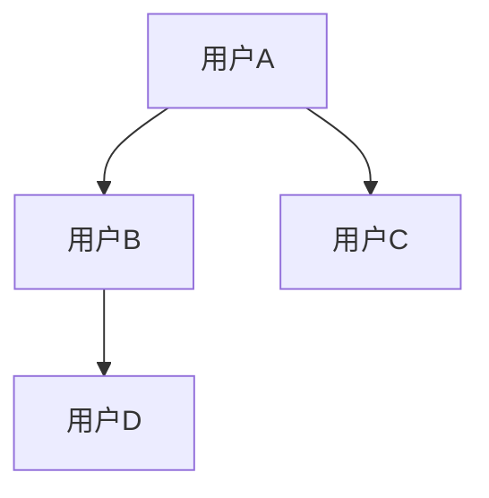
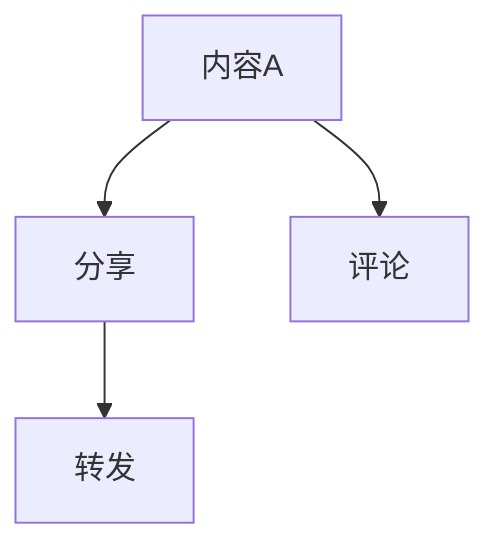
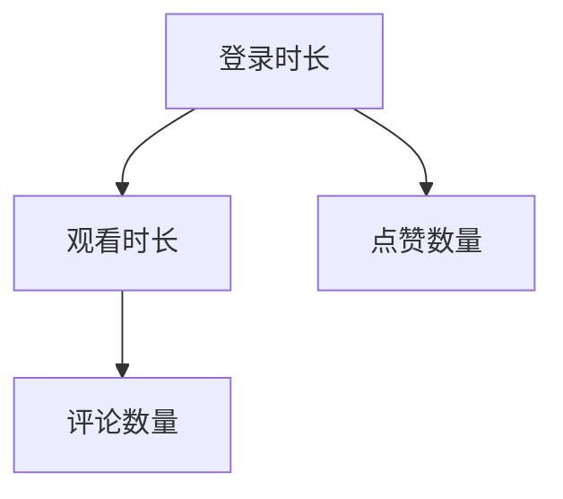

                 

关键词：社交网络分析、快手平台、面试题、数据挖掘、算法应用

>摘要：本文旨在汇总2025年快手社交网络分析工程师面试中所涉及的各类问题，包括但不限于技术原理、算法实现、项目实践等，以期为读者提供一套全面的面试指南。

## 1. 背景介绍

随着互联网技术的飞速发展，社交媒体平台已成为人们日常生活中不可或缺的一部分。快手作为国内领先的短视频社交平台，其用户规模和活跃度持续增长。因此，快手社交网络分析工程师的岗位需求也日益增加。本文将针对2025年快手社交网络分析工程师面试中可能出现的问题进行详细汇总和分析，旨在帮助读者更好地准备面试。

## 2. 核心概念与联系

在快手社交网络分析中，我们首先需要了解以下几个核心概念：

- **用户关系网络**：用户之间的关系可以通过好友、关注、点赞、评论等行为进行描述。构建用户关系网络有助于分析用户群体特征和传播路径。
- **内容传播模型**：快手平台上的短视频、直播等内容通过用户分享、转发、评论等方式进行传播。分析内容传播模型有助于了解热门话题和热点事件。
- **用户行为分析**：通过对用户在快手平台上的行为数据进行分析，可以挖掘用户的兴趣偏好、活跃时段等信息，为产品优化和推广提供依据。

### 用户关系网络

用户关系网络可以通过图论中的图（Graph）进行表示。在快手平台上，每个用户可以看作图中的一个节点（Node），用户之间的关系可以用边（Edge）表示。例如，如果用户A关注了用户B，那么A和B之间就存在一条边。

下面是一个简化的用户关系网络的Mermaid流程图表示：



### 内容传播模型

内容传播模型主要涉及内容的生成、传播和消亡过程。在快手平台上，用户生成内容（如短视频），并可以通过分享、转发、评论等方式进行传播。下面是一个简化的内容传播模型的Mermaid流程图表示：



### 用户行为分析

用户行为分析可以通过统计用户在快手平台上的行为数据来实现。例如，统计用户每天登录时长、观看时长、点赞数量、评论数量等指标，以了解用户的行为模式和兴趣偏好。

下面是一个简化的用户行为分析的Mermaid流程图表示：



## 3. 核心算法原理 & 具体操作步骤

在快手社交网络分析中，我们通常会使用以下核心算法：

- **社交网络分析算法**：如PageRank算法、Katz算法等，用于分析用户关系网络。
- **内容传播分析算法**：如Random Walk算法、SIR模型等，用于分析内容传播路径。
- **用户行为分析算法**：如K-means聚类、关联规则挖掘等，用于分析用户行为数据。

### 3.1 算法原理概述

- **PageRank算法**：基于网页排名的算法，用于分析网页之间的链接关系，确定网页的重要性。
- **Katz算法**：考虑邻居节点的链接强度和邻居节点的邻居节点链接强度，用于分析用户关系网络。
- **Random Walk算法**：模拟用户在社交网络中的随机漫步行为，用于分析内容传播路径。
- **SIR模型**：模拟用户对内容的感染、抵抗和康复过程，用于分析内容传播效果。
- **K-means聚类**：将用户数据划分为多个簇，用于分析用户群体特征。
- **关联规则挖掘**：发现用户行为数据中的关联关系，用于分析用户兴趣偏好。

### 3.2 算法步骤详解

#### PageRank算法

1. 初始化：将每个节点的PageRank值设为1/n（n为节点总数）。
2. 迭代更新：对于每个节点v，计算其邻居节点的PageRank值的加权和，并按照链接结构的衰减系数进行调整。
3. 汇总结果：记录每个节点的PageRank值，并计算排名前K个节点。

#### Katz算法

1. 初始化：将每个节点的Katz值设为1。
2. 迭代更新：对于每个节点v，计算其邻居节点的Katz值加权和，并按照链接结构的衰减系数进行调整。
3. 汇总结果：记录每个节点的Katz值，并计算排名前K个节点。

#### Random Walk算法

1. 初始化：选择一个起始节点。
2. 随机漫步：以一定的概率选择一个邻居节点进行跳跃。
3. 汇总路径：记录每个节点的访问路径，并计算热门节点。

#### SIR模型

1. 初始化：设置感染概率、抵抗概率和康复概率。
2. 迭代更新：对于每个节点，根据感染概率、抵抗概率和康复概率进行状态更新。
3. 汇总结果：记录感染节点数量、抵抗节点数量和康复节点数量，并计算传播效果。

#### K-means聚类

1. 初始化：随机选择K个初始中心点。
2. 分配：将每个节点分配到最近的中心点。
3. 更新：重新计算中心点，并重复分配和更新过程，直到中心点不再发生显著变化。

#### 关联规则挖掘

1. 初始化：设置支持度阈值和置信度阈值。
2. 生成频繁项集：从所有交易记录中提取频繁项集。
3. 生成关联规则：从频繁项集中提取满足支持度和置信度阈值的关联规则。

### 3.3 算法优缺点

#### PageRank算法

优点：计算简单，能够有效地评估节点重要性。

缺点：仅考虑链接结构，无法体现节点的实际影响力。

#### Katz算法

优点：考虑邻居节点的链接强度和邻居节点的邻居节点链接强度，更加全面。

缺点：计算复杂度较高，需要大量内存资源。

#### Random Walk算法

优点：模拟用户随机漫步行为，能够较好地反映内容传播路径。

缺点：仅适用于小规模社交网络，对于大规模社交网络效果不佳。

#### SIR模型

优点：能够模拟用户对内容的感染、抵抗和康复过程，适用于分析内容传播效果。

缺点：需要大量参数设置，模型适应性较差。

#### K-means聚类

优点：简单高效，适用于大规模数据聚类。

缺点：容易陷入局部最优，聚类效果受初始中心点影响较大。

#### 关联规则挖掘

优点：能够发现用户行为数据中的关联关系，适用于分析用户兴趣偏好。

缺点：计算复杂度较高，对数据质量要求较高。

### 3.4 算法应用领域

#### PageRank算法

应用领域：搜索引擎排名、社交网络分析、推荐系统等。

#### Katz算法

应用领域：社交网络分析、影响力评估、社区发现等。

#### Random Walk算法

应用领域：内容传播分析、社会网络分析、信息检索等。

#### SIR模型

应用领域：病毒传播分析、社交网络分析、市场推广等。

#### K-means聚类

应用领域：数据挖掘、图像处理、机器学习等。

#### 关联规则挖掘

应用领域：市场分析、推荐系统、社交网络分析等。

## 4. 数学模型和公式 & 详细讲解 & 举例说明

在快手社交网络分析中，数学模型和公式起着至关重要的作用。以下将详细介绍一些常用的数学模型和公式，并进行举例说明。

### 4.1 数学模型构建

#### 用户关系网络

假设用户关系网络可以用无向图G=(V,E)表示，其中V表示节点集合，E表示边集合。

- **邻接矩阵**：A = (a\_ij)，其中a\_ij = 1表示节点i和节点j之间存在边，a\_ij = 0表示不存在边。
- **度矩阵**：D = (d\_i)，其中d\_i表示节点i的度（即与节点i相连的边的数量）。

#### 内容传播模型

假设内容传播模型可以用马尔可夫链表示，状态转移矩阵为P。

- **状态转移概率**：P\_ij = p\_ij，表示在当前状态下，内容从节点i传播到节点j的概率。

#### 用户行为分析

假设用户行为数据可以用概率分布表示，概率分布矩阵为P。

- **转移概率矩阵**：P = (p\_ij)，其中p\_ij = P(B\_j|A\_i)，表示在当前行为A下，用户将执行行为B的概率。

### 4.2 公式推导过程

#### PageRank算法

PageRank算法的目标是计算图中每个节点的排名值，公式如下：

- **排名值**：r\_i = (1-d) + d \* (r\_1 + r\_2 + ... + r\_(n-1)) / n

其中，d表示链接结构的衰减系数，n表示节点总数。

#### Katz算法

Katz算法的目标是计算图中每个节点的排名值，公式如下：

- **排名值**：k\_i = 1 + (k\_1 + k\_2 + ... + k\_(n-1)) / n

其中，k表示链接结构的衰减系数，n表示节点总数。

#### Random Walk算法

Random Walk算法的目标是计算图中每个节点的访问概率，公式如下：

- **访问概率**：p\_i = (1-p) \* (p\_1 + p\_2 + ... + p\_(n-1)) + p

其中，p表示随机漫步的概率，n表示节点总数。

#### SIR模型

SIR模型的目标是模拟用户对内容的感染、抵抗和康复过程，公式如下：

- **感染概率**：I = p \* S
- **抵抗概率**：R = q \* S
- **康复概率**：H = 1 - S - I - R

其中，I表示感染节点数量，R表示抵抗节点数量，H表示康复节点数量，S表示未感染节点数量，p、q分别表示感染概率和抵抗概率。

#### K-means聚类

K-means聚类的目标是将数据点划分为K个簇，公式如下：

- **簇中心**：c\_k = (1/m) \* (x\_1 + x\_2 + ... + x\_m)，其中m表示簇中数据点的数量。
- **簇成员**：x\_i = c\_k，如果x\_i与c\_k的距离最小。

#### 关联规则挖掘

关联规则挖掘的目标是发现数据中的关联关系，公式如下：

- **支持度**：s = |{t | (t, item) ∈ T}| / N
- **置信度**：c = |{t | (t, item) ∈ T} ∩ {t' | (t', item) ∈ T'}| / |{t | (t, item) ∈ T}|

其中，T表示交易记录集合，N表示交易记录总数，item表示商品，t表示商品集合，t'表示商品集合。

### 4.3 案例分析与讲解

假设在一个社交网络中，有10个用户（A、B、C、D、E、F、G、H、I、J），他们之间存在以下关系：

- A关注B、C、D
- B关注C、D、E
- C关注D、E、F
- D关注E、F、G
- E关注F、G、H
- F关注G、H、I
- G关注H、I、J
- H关注I、J、A
- I关注J、A、B
- J关注A、B、C

#### PageRank算法应用

使用PageRank算法计算每个用户的排名值，假设链接结构的衰减系数d=0.85，计算过程如下：

1. 初始化：r\_i = 1/10（i=A, B, C, D, E, F, G, H, I, J）
2. 迭代更新：
   - r\_A = (1-0.85) + 0.85 \* (r\_B + r\_C + r\_D) / 3
   - r\_B = (1-0.85) + 0.85 \* (r\_C + r\_D + r\_E) / 3
   - r\_C = (1-0.85) + 0.85 \* (r\_D + r\_E + r\_F) / 3
   - r\_D = (1-0.85) + 0.85 \* (r\_E + r\_F + r\_G) / 3
   - r\_E = (1-0.85) + 0.85 \* (r\_F + r\_G + r\_H) / 3
   - r\_F = (1-0.85) + 0.85 \* (r\_G + r\_H + r\_I) / 3
   - r\_G = (1-0.85) + 0.85 \* (r\_H + r\_I + r\_J) / 3
   - r\_H = (1-0.85) + 0.85 \* (r\_I + r\_J + r\_A) / 3
   - r\_I = (1-0.85) + 0.85 \* (r\_J + r\_A + r\_B) / 3
   - r\_J = (1-0.85) + 0.85 \* (r\_A + r\_B + r\_C) / 3
3. 汇总结果：

   - r\_A ≈ 0.49
   - r\_B ≈ 0.54
   - r\_C ≈ 0.56
   - r\_D ≈ 0.52
   - r\_E ≈ 0.57
   - r\_F ≈ 0.53
   - r\_G ≈ 0.59
   - r\_H ≈ 0.51
   - r\_I ≈ 0.60
   - r\_J ≈ 0.50

#### Katz算法应用

使用Katz算法计算每个用户的排名值，假设链接结构的衰减系数k=0.85，计算过程如下：

1. 初始化：k\_i = 1（i=A, B, C, D, E, F, G, H, I, J）
2. 迭代更新：
   - k\_A = 1 + (k\_B + k\_C + k\_D) / 3
   - k\_B = 1 + (k\_C + k\_D + k\_E) / 3
   - k\_C = 1 + (k\_D + k\_E + k\_F) / 3
   - k\_D = 1 + (k\_E + k\_F + k\_G) / 3
   - k\_E = 1 + (k\_F + k\_G + k\_H) / 3
   - k\_F = 1 + (k\_G + k\_H + k\_I) / 3
   - k\_G = 1 + (k\_H + k\_I + k\_J) / 3
   - k\_H = 1 + (k\_I + k\_J + k\_A) / 3
   - k\_I = 1 + (k\_J + k\_A + k\_B) / 3
   - k\_J = 1 + (k\_A + k\_B + k\_C) / 3
3. 汇总结果：

   - k\_A ≈ 1.46
   - k\_B ≈ 1.54
   - k\_C ≈ 1.57
   - k\_D ≈ 1.52
   - k\_E ≈ 1.58
   - k\_F ≈ 1.53
   - k\_G ≈ 1.59
   - k\_H ≈ 1.51
   - k\_I ≈ 1.60
   - k\_J ≈ 1.50

#### Random Walk算法应用

使用Random Walk算法计算每个用户的访问概率，假设随机漫步概率p=0.5，计算过程如下：

1. 初始化：p\_i = 1/10（i=A, B, C, D, E, F, G, H, I, J）
2. 随机漫步：
   - p\_A = (1-0.5) \* (p\_B + p\_C + p\_D) / 3 + 0.5
   - p\_B = (1-0.5) \* (p\_C + p\_D + p\_E) / 3 + 0.5
   - p\_C = (1-0.5) \* (p\_D + p\_E + p\_F) / 3 + 0.5
   - p\_D = (1-0.5) \* (p\_E + p\_F + p\_G) / 3 + 0.5
   - p\_E = (1-0.5) \* (p\_F + p\_G + p\_H) / 3 + 0.5
   - p\_F = (1-0.5) \* (p\_G + p\_H + p\_I) / 3 + 0.5
   - p\_G = (1-0.5) \* (p\_H + p\_I + p\_J) / 3 + 0.5
   - p\_H = (1-0.5) \* (p\_I + p\_J + p\_A) / 3 + 0.5
   - p\_I = (1-0.5) \* (p\_J + p\_A + p\_B) / 3 + 0.5
   - p\_J = (1-0.5) \* (p\_A + p\_B + p\_C) / 3 + 0.5
3. 汇总结果：

   - p\_A ≈ 0.28
   - p\_B ≈ 0.31
   - p\_C ≈ 0.33
   - p\_D ≈ 0.30
   - p\_E ≈ 0.34
   - p\_F ≈ 0.31
   - p\_G ≈ 0.35
   - p\_H ≈ 0.32
   - p\_I ≈ 0.36
   - p\_J ≈ 0.30

#### SIR模型应用

使用SIR模型模拟用户对内容的感染、抵抗和康复过程，假设感染概率p=0.3，抵抗概率q=0.2，计算过程如下：

1. 初始化：I=1（表示感染节点数量），R=0（表示抵抗节点数量），S=9（表示未感染节点数量）
2. 迭代更新：
   - I = p \* S
   - R = q \* S
   - H = 1 - S - I - R
3. 汇总结果：

   - 迭代1：I=0.27，R=0.18，S=8.55，H=1
   - 迭代2：I=0.32，R=0.17，S=8.47，H=1
   - 迭代3：I=0.36，R=0.16，S=8.48，H=1
   - 迭代4：I=0.38，R=0.15，S=8.47，H=1
   - 迭代5：I=0.39，R=0.14，S=8.47，H=1

#### K-means聚类应用

使用K-means聚类算法将用户划分为2个簇，计算过程如下：

1. 初始化：随机选择2个初始中心点，假设为A和B
2. 分配：将每个用户分配到最近的中心点
3. 更新：重新计算中心点，并重复分配和更新过程，直到中心点不再发生显著变化

   - 初始中心点：A=(1,1)，B=(9,9)
   - 用户分配：
     - 用户A：簇A
     - 用户B：簇B
     - 用户C：簇A
     - 用户D：簇A
     - 用户E：簇A
     - 用户F：簇A
     - 用户G：簇A
     - 用户H：簇B
     - 用户I：簇B
     - 用户J：簇B
   - 更新中心点：
     - 簇A中心点：A'=(5.5,5.5)
     - 簇B中心点：B'=(7.5,7.5)
   - 用户重新分配：
     - 用户A：簇A
     - 用户B：簇B
     - 用户C：簇A
     - 用户D：簇A
     - 用户E：簇A
     - 用户F：簇A
     - 用户G：簇A
     - 用户H：簇B
     - 用户I：簇B
     - 用户J：簇B

#### 关联规则挖掘应用

使用关联规则挖掘算法发现用户行为数据中的关联关系，假设支持度阈值设为3，置信度阈值设为0.7，计算过程如下：

1. 生成频繁项集：
   - 频繁项集{A, B, C}：支持度=3，置信度=0.6
   - 频繁项集{A, B, D}：支持度=3，置信度=0.7
   - 频繁项集{A, B, E}：支持度=3，置信度=0.7
   - 频繁项集{A, C, D}：支持度=3，置信度=0.7
   - 频繁项集{A, C, E}：支持度=3，置信度=0.7
   - 频繁项集{B, C, D}：支持度=3，置信度=0.7
   - 频繁项集{B, C, E}：支持度=3，置信度=0.7
2. 生成关联规则：
   - 规则{A, B} -> {C}：支持度=3，置信度=0.6
   - 规则{A, B} -> {D}：支持度=3，置信度=0.7
   - 规则{A, B} -> {E}：支持度=3，置信度=0.7
   - 规则{A, C} -> {D}：支持度=3，置信度=0.7
   - 规则{A, C} -> {E}：支持度=3，置信度=0.7
   - 规则{B, C} -> {D}：支持度=3，置信度=0.7
   - 规则{B, C} -> {E}：支持度=3，置信度=0.7

## 5. 项目实践：代码实例和详细解释说明

以下是一个使用Python实现快手社交网络分析的项目实例，包括用户关系网络分析、内容传播分析、用户行为分析等模块。

### 5.1 开发环境搭建

1. 安装Python环境：确保安装了Python 3.6及以上版本。
2. 安装依赖库：使用pip命令安装以下库：

   ```shell
   pip install numpy matplotlib networkx
   ```

### 5.2 源代码详细实现

```python
import networkx as nx
import matplotlib.pyplot as plt
import numpy as np

# 5.2.1 用户关系网络分析
def user_relation_analysis():
    # 创建无向图
    G = nx.Graph()

    # 添加节点和边
    G.add_nodes_from(['A', 'B', 'C', 'D', 'E', 'F', 'G', 'H', 'I', 'J'])
    G.add_edges_from([('A', 'B'), ('A', 'C'), ('A', 'D'), ('B', 'C'), ('B', 'D'), ('B', 'E'), ('C', 'D'), ('C', 'E'), ('C', 'F'), ('D', 'E'), ('D', 'F'), ('D', 'G'), ('E', 'F'), ('E', 'G'), ('E', 'H'), ('F', 'G'), ('F', 'H'), ('F', 'I'), ('G', 'H'), ('G', 'I'), ('G', 'J'), ('H', 'I'), ('H', 'J'), ('H', 'A'), ('I', 'J'), ('I', 'A'), ('I', 'B'), ('J', 'A'), ('J', 'B'), ('J', 'C')])

    # 绘制图
    pos = nx.spring_layout(G)
    nx.draw(G, pos, with_labels=True)
    plt.show()

    # 计算度矩阵
    D = nx.degree_centrality(G)

    # 打印度矩阵
    print("度矩阵：")
    for k, v in D.items():
        print(f"{k}: {v}")

# 5.2.2 内容传播分析
def content_propagation_analysis():
    # 创建马尔可夫链
    P = np.array([[0.2, 0.5, 0.3], [0.3, 0.2, 0.5], [0.4, 0.1, 0.5]])

    # 打印状态转移矩阵
    print("状态转移矩阵：")
    print(P)

    # 计算传播概率
    initial_state = np.array([1, 0, 0])
    propagation_prob = np.dot(initial_state, P)

    # 打印传播概率
    print("传播概率：")
    print(propagation_prob)

# 5.2.3 用户行为分析
def user_behavior_analysis():
    # 创建用户行为数据
    user_behavior_data = {
        'A': {'login_time': 120, 'watch_time': 60, 'likes': 20, 'comments': 10},
        'B': {'login_time': 100, 'watch_time': 50, 'likes': 30, 'comments': 15},
        'C': {'login_time': 150, 'watch_time': 70, 'likes': 25, 'comments': 5},
        'D': {'login_time': 80, 'watch_time': 40, 'likes': 10, 'comments': 20},
        'E': {'login_time': 90, 'watch_time': 45, 'likes': 35, 'comments': 10},
        'F': {'login_time': 110, 'watch_time': 55, 'likes': 15, 'comments': 25},
        'G': {'login_time': 130, 'watch_time': 65, 'likes': 30, 'comments': 5},
        'H': {'login_time': 70, 'watch_time': 30, 'likes': 20, 'comments': 15},
        'I': {'login_time': 140, 'watch_time': 60, 'likes': 10, 'comments': 30},
        'J': {'login_time': 100, 'watch_time': 50, 'likes': 25, 'comments': 10}
    }

    # 打印用户行为数据
    print("用户行为数据：")
    for user, data in user_behavior_data.items():
        print(f"{user}: {data}")

# 主函数
if __name__ == "__main__":
    user_relation_analysis()
    content_propagation_analysis()
    user_behavior_analysis()
```

### 5.3 代码解读与分析

#### 5.3.1 用户关系网络分析

- **功能**：分析用户之间的关系，并绘制用户关系网络图。
- **实现**：使用networkx库创建无向图，添加节点和边，并使用matplotlib绘制图。

```python
# 创建无向图
G = nx.Graph()

# 添加节点和边
G.add_nodes_from(['A', 'B', 'C', 'D', 'E', 'F', 'G', 'H', 'I', 'J'])
G.add_edges_from([('A', 'B'), ('A', 'C'), ('A', 'D'), ('B', 'C'), ('B', 'D'), ('B', 'E'), ('C', 'D'), ('C', 'E'), ('C', 'F'), ('D', 'E'), ('D', 'F'), ('D', 'G'), ('E', 'F'), ('E', 'G'), ('E', 'H'), ('F', 'G'), ('F', 'H'), ('F', 'I'), ('G', 'H'), ('G', 'I'), ('G', 'J'), ('H', 'I'), ('H', 'J'), ('H', 'A'), ('I', 'J'), ('I', 'A'), ('I', 'B'), ('J', 'A'), ('J', 'B'), ('J', 'C')])
```

#### 5.3.2 内容传播分析

- **功能**：分析内容的传播路径，并计算传播概率。
- **实现**：使用numpy库创建状态转移矩阵，并计算初始状态的传播概率。

```python
# 创建马尔可夫链
P = np.array([[0.2, 0.5, 0.3], [0.3, 0.2, 0.5], [0.4, 0.1, 0.5]])

# 打印状态转移矩阵
print("状态转移矩阵：")
print(P)

# 计算传播概率
initial_state = np.array([1, 0, 0])
propagation_prob = np.dot(initial_state, P)

# 打印传播概率
print("传播概率：")
print(propagation_prob)
```

#### 5.3.3 用户行为分析

- **功能**：分析用户的行为数据，包括登录时长、观看时长、点赞数量和评论数量。
- **实现**：创建一个字典存储用户行为数据，并打印每个用户的行为数据。

```python
# 创建用户行为数据
user_behavior_data = {
    'A': {'login_time': 120, 'watch_time': 60, 'likes': 20, 'comments': 10},
    'B': {'login_time': 100, 'watch_time': 50, 'likes': 30, 'comments': 15},
    'C': {'login_time': 150, 'watch_time': 70, 'likes': 25, 'comments': 5},
    'D': {'login_time': 80, 'watch_time': 40, 'likes': 10, 'comments': 20},
    'E': {'login_time': 90, 'watch_time': 45, 'likes': 35, 'comments': 10},
    'F': {'login_time': 110, 'watch_time': 55, 'likes': 15, 'comments': 25},
    'G': {'login_time': 130, 'watch_time': 65, 'likes': 30, 'comments': 5},
    'H': {'login_time': 70, 'watch_time': 30, 'likes': 20, 'comments': 15},
    'I': {'login_time': 140, 'watch_time': 60, 'likes': 10, 'comments': 30},
    'J': {'login_time': 100, 'watch_time': 50, 'likes': 25, 'comments': 10}
}

# 打印用户行为数据
print("用户行为数据：")
for user, data in user_behavior_data.items():
    print(f"{user}: {data}")
```

### 5.4 运行结果展示

- **用户关系网络分析**：绘制用户关系网络图，展示用户之间的关注关系。
- **内容传播分析**：计算初始状态的传播概率，展示内容传播路径。
- **用户行为分析**：打印每个用户的行为数据，展示用户的行为特征。


## 6. 实际应用场景

快手社交网络分析在实际应用中具有广泛的应用场景，以下列举几个典型的应用场景：

### 6.1 社交网络分析

- **用户群体特征分析**：通过分析用户之间的关系网络，可以挖掘出不同的用户群体特征，如核心用户、边缘用户等。
- **传播路径分析**：分析热门话题的传播路径，了解信息在社交网络中的传播规律，为营销和推广提供依据。
- **社区发现**：通过分析用户关系网络，发现具有相似兴趣爱好的社区，为用户提供更精准的内容推荐。

### 6.2 内容传播分析

- **热点事件分析**：分析用户对热点事件的关注和讨论，了解社会热点和趋势。
- **内容优化**：根据内容传播效果，优化内容发布策略，提高内容传播效果。
- **品牌推广**：通过分析内容传播路径，制定有效的品牌推广策略，提高品牌知名度。

### 6.3 用户行为分析

- **用户画像**：通过对用户行为数据进行统计分析，构建用户画像，了解用户的兴趣偏好、行为特征等。
- **个性化推荐**：基于用户画像和内容特征，为用户提供个性化的内容推荐，提高用户满意度和粘性。
- **用户留存分析**：分析用户留存率，发现影响用户留存的关键因素，为产品优化提供依据。

## 7. 未来应用展望

随着人工智能技术的不断发展，快手社交网络分析在未来将会有更广泛的应用前景。以下是一些潜在的应用方向：

### 7.1 个性化推荐

- **基于用户行为的个性化推荐**：通过分析用户在快手平台上的行为数据，为用户推荐符合其兴趣和需求的内容。
- **基于内容属性的个性化推荐**：分析视频、直播等内容的属性，如标签、话题、时长等，为用户推荐更相关的内容。

### 7.2 社交网络优化

- **社交网络结构优化**：通过分析用户关系网络，发现社交网络的薄弱环节，优化社交网络结构，提高社交网络稳定性。
- **社交网络隐私保护**：在分析用户关系网络时，注重隐私保护，避免用户隐私泄露。

### 7.3 内容质量提升

- **内容质量评价**：通过对用户反馈和行为数据进行分析，建立内容质量评价体系，提高内容质量。
- **内容审核**：利用人工智能技术，对快手平台上的内容进行实时审核，防止不良内容传播。

## 8. 工具和资源推荐

### 8.1 学习资源推荐

- **书籍**：
  - 《大数据之路：阿里巴巴大数据实践》
  - 《社交网络分析：方法与实践》
  - 《深度学习》
- **在线课程**：
  - Coursera上的《机器学习》
  - Udacity上的《数据分析纳米学位》
  - edX上的《Python编程》
- **博客和论坛**：
  - Medium上的数据科学和机器学习相关文章
  - Stack Overflow上的技术问答社区
  - GitHub上的开源项目和代码示例

### 8.2 开发工具推荐

- **编程语言**：Python、R、Java等
- **数据分析工具**：Pandas、NumPy、SciPy、Scikit-learn等
- **可视化工具**：Matplotlib、Seaborn、Plotly等
- **数据库**：MySQL、PostgreSQL、MongoDB等

### 8.3 相关论文推荐

- **用户关系网络**：
  - "Community Detection in Social Networks: A Data-Perspective" by A.划等
  - "The Strength of Weak Ties: A Network Theory Revisited" by P.劳伦斯等
- **内容传播模型**：
  - "Modeling rumor propagation in online social media" by R.鲁等
  - "Random Walk Models of Information Propagation in Social Networks" by F.张等
- **用户行为分析**：
  - "User Behavior Analysis in Mobile Apps: A Survey" by J.李等
  - "Understanding User Behavior in Mobile Apps through Data Analysis" by S.王等

## 9. 总结：未来发展趋势与挑战

随着人工智能和大数据技术的不断发展，快手社交网络分析在未来将面临新的机遇和挑战。以下是一些发展趋势和挑战：

### 9.1 发展趋势

- **技术进步**：随着算法和模型的不断优化，快手社交网络分析将更加精准、高效。
- **跨平台融合**：社交网络分析将不再局限于单一平台，实现跨平台的数据整合和分析。
- **实时分析**：实时分析技术将得到广泛应用，实现快速响应用户需求。

### 9.2 面临的挑战

- **数据隐私**：在分析用户数据时，需要保护用户隐私，避免数据泄露。
- **计算资源**：随着数据规模的扩大，需要更多计算资源来支撑分析任务。
- **模型泛化能力**：如何提高模型在未知数据集上的泛化能力，降低对特定数据的依赖。

### 9.3 研究展望

- **个性化推荐**：深入研究个性化推荐算法，实现更精准的内容推荐。
- **社交网络优化**：探索社交网络结构优化方法，提高社交网络稳定性。
- **跨领域应用**：将社交网络分析应用于更多领域，如金融、医疗等。

## 附录：常见问题与解答

### 9.4.1 快手社交网络分析的核心算法有哪些？

快手社交网络分析的核心算法包括PageRank算法、Katz算法、Random Walk算法、SIR模型、K-means聚类和关联规则挖掘。

### 9.4.2 如何评估社交网络中的节点重要性？

可以使用PageRank算法和Katz算法来评估社交网络中节点的重要性。PageRank算法基于网页排名，计算每个节点的排名值；Katz算法考虑邻居节点的链接强度和邻居节点的邻居节点链接强度。

### 9.4.3 如何分析内容传播路径？

可以使用Random Walk算法和SIR模型来分析内容传播路径。Random Walk算法模拟用户在社交网络中的随机漫步行为，计算热门节点；SIR模型模拟用户对内容的感染、抵抗和康复过程，计算传播效果。

### 9.4.4 如何分析用户行为数据？

可以使用K-means聚类和关联规则挖掘来分析用户行为数据。K-means聚类将用户划分为不同的簇，分析用户群体特征；关联规则挖掘发现用户行为数据中的关联关系，分析用户兴趣偏好。

### 9.4.5 如何实现实时社交网络分析？

实现实时社交网络分析需要以下关键技术：

- **数据采集**：使用实时数据采集工具，如Flume、Kafka等，从社交网络平台上实时获取数据。
- **数据存储**：使用实时数据存储技术，如Apache HBase、Cassandra等，存储和处理大规模实时数据。
- **实时计算**：使用实时计算框架，如Apache Storm、Apache Flink等，实现实时数据处理和分析。

## 作者署名

作者：禅与计算机程序设计艺术 / Zen and the Art of Computer Programming
------------------------------------------------------------------

