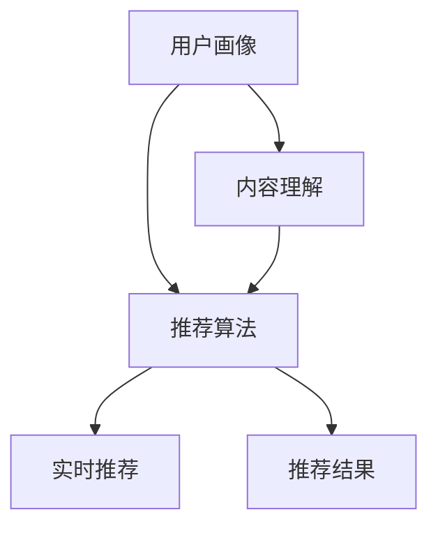

                 

关键词：快手、社交网络、推荐系统、面试题、详解、算法原理、代码实例、实际应用、未来展望。

## 摘要

本文旨在为即将参加快手社交网络推荐工程师面试的应聘者提供一个全面的准备指南。通过详细解析快手推荐系统的核心算法原理、数学模型、以及项目实践案例，本文帮助读者深入理解推荐系统在社交网络中的应用。此外，文章还将探讨推荐系统在实际应用场景中的表现，以及未来的发展趋势与面临的挑战。希望通过本文，读者能够更好地应对快手推荐工程师的面试。

## 1. 背景介绍

快手是中国领先的视频社交平台，拥有庞大的用户基础和多样化的内容生态。随着用户数量的快速增长，如何有效地进行内容推荐成为快手面临的一大挑战。推荐系统作为解决这一问题的关键技术，能够在海量的用户行为数据中挖掘出潜在的关联，为用户推荐他们可能感兴趣的内容。

推荐系统的核心目标是通过理解用户兴趣和行为模式，为每个用户生成个性化的内容推荐。这不仅可以提升用户体验，还可以提高用户粘性和平台活跃度。快手推荐系统作为一个复杂的工程系统，涵盖了用户画像构建、内容理解、推荐算法、实时推荐等多个方面。

本文将重点讨论快手推荐系统的以下核心组成部分：

1. 核心概念与联系
2. 核心算法原理与具体操作步骤
3. 数学模型和公式
4. 项目实践：代码实例和详细解释
5. 实际应用场景
6. 未来应用展望
7. 工具和资源推荐
8. 总结：未来发展趋势与挑战

## 2. 核心概念与联系

在深入探讨快手推荐系统之前，首先需要了解一些核心概念及其相互联系。以下是几个关键概念及其简要解释：

### 用户画像

用户画像是指通过对用户行为、兴趣、习惯等多维度数据的分析，构建出一个多维度的用户模型。用户画像能够帮助推荐系统更好地理解用户，从而实现更精准的推荐。

### 内容理解

内容理解是指对推荐内容（如视频、图片、文本等）进行语义分析和特征提取，以理解其内容和属性。这为推荐算法提供了丰富的内容特征，从而提升推荐的准确性。

### 推荐算法

推荐算法是推荐系统的核心，通过机器学习和数据挖掘技术，从用户画像和内容理解中挖掘出关联性，为用户生成个性化的推荐列表。快手推荐系统采用了多种推荐算法，包括协同过滤、基于内容的推荐、深度学习等。

### 实时推荐

实时推荐是指系统根据用户当前的实时行为，动态生成推荐列表。实时推荐能够更好地满足用户的即时需求，提升用户满意度。

### 核心概念架构

为了更好地理解这些核心概念，我们可以使用Mermaid流程图来展示它们之间的联系：



在上述流程图中，用户画像和内容理解共同为推荐算法提供输入，推荐算法根据这些输入生成个性化的推荐结果，并通过实时推荐模块将结果呈现给用户。

## 3. 核心算法原理 & 具体操作步骤

### 3.1 算法原理概述

快手推荐系统采用了多种算法原理，其中协同过滤、基于内容的推荐和深度学习是三大核心算法。以下分别介绍这些算法的原理：

#### 协同过滤

协同过滤是一种基于用户相似度的推荐算法，其基本思想是寻找与目标用户兴趣相似的其他用户，然后推荐这些用户喜欢的物品。协同过滤可以分为两种类型：基于用户的协同过滤和基于物品的协同过滤。

- **基于用户的协同过滤**：通过计算用户之间的相似度，找到与目标用户兴趣相似的邻居用户，然后推荐邻居用户喜欢的物品。
- **基于物品的协同过滤**：通过计算物品之间的相似度，找到与目标物品相似的邻居物品，然后推荐邻居物品被其他用户喜欢的。

#### 基于内容的推荐

基于内容的推荐是一种基于物品属性的推荐算法，其基本思想是根据用户过去喜欢的物品属性，推荐具有相似属性的物品。基于内容的推荐通常涉及以下步骤：

1. **特征提取**：对推荐物品进行特征提取，如文本、图像、音频等。
2. **相似度计算**：计算用户与物品之间的特征相似度。
3. **推荐生成**：根据相似度计算结果，生成个性化的推荐列表。

#### 深度学习

深度学习是一种基于多层神经网络的学习方法，能够在大量数据中自动提取特征。在快手推荐系统中，深度学习主要用于构建用户和物品的表示，然后通过这些表示进行推荐。

- **用户表示**：通过神经网络模型将用户行为数据转换为低维度的用户向量。
- **物品表示**：通过神经网络模型将物品属性数据转换为低维度的物品向量。
- **推荐生成**：使用用户和物品的表示，通过相似度计算或协同过滤等方法生成推荐列表。

### 3.2 算法步骤详解

下面以基于用户的协同过滤算法为例，详细描述其具体操作步骤：

#### 步骤1：用户行为数据预处理

- **数据清洗**：去除重复数据、缺失数据和异常数据。
- **用户-物品评分矩阵构建**：将用户行为数据转换为用户-物品评分矩阵。

#### 步骤2：用户相似度计算

- **余弦相似度计算**：计算用户之间的余弦相似度，公式如下：

  $$ \text{similarity}(u, v) = \frac{\text{dot}(u, v)}{\|\text{u}\|\|\text{v}\|} $$

  其中，$\text{dot}(u, v)$ 表示用户 $u$ 和用户 $v$ 的内积，$\|\text{u}\|$ 和 $\|\text{v}\|$ 分别表示用户 $u$ 和用户 $v$ 的向量长度。

#### 步骤3：推荐列表生成

- **邻居用户选择**：选择与目标用户相似度最高的 $k$ 个邻居用户。
- **物品推荐**：为每个邻居用户喜欢的物品计算评分，选取评分最高的 $n$ 个物品作为推荐列表。

### 3.3 算法优缺点

#### 协同过滤

**优点**：

- **效果较好**：能够通过用户行为数据挖掘出用户之间的相似性，从而实现较好的推荐效果。
- **简单易实现**：算法结构简单，易于理解和实现。

**缺点**：

- **冷启动问题**：新用户或新物品缺乏历史数据，难以进行有效推荐。
- **数据稀疏性**：在大型推荐系统中，用户-物品评分矩阵通常非常稀疏，导致算法效果下降。

#### 基于内容的推荐

**优点**：

- **解决冷启动问题**：基于物品属性进行推荐，无需依赖用户历史行为数据。
- **推荐多样性**：能够推荐具有不同属性的物品，提高用户满意度。

**缺点**：

- **效果相对较差**：仅考虑物品属性，忽略用户兴趣和行为，可能导致推荐效果不佳。
- **特征提取难度**：不同类型的物品需要不同的特征提取方法，增加了算法实现的复杂度。

#### 深度学习

**优点**：

- **自动特征提取**：能够从大量数据中自动提取用户和物品的特征，提高推荐效果。
- **处理复杂关系**：能够处理用户和物品之间的复杂关系，实现更精准的推荐。

**缺点**：

- **计算成本高**：深度学习模型通常需要大量的计算资源和时间进行训练。
- **模型解释性差**：深度学习模型难以解释，难以理解推荐结果的原因。

### 3.4 算法应用领域

协同过滤、基于内容的推荐和深度学习在推荐系统中有广泛的应用领域，包括但不限于：

- **电子商务**：为用户提供个性化的商品推荐。
- **社交媒体**：为用户提供感兴趣的内容推荐。
- **在线视频平台**：为用户提供个性化的视频推荐。
- **音乐流媒体**：为用户提供个性化的音乐推荐。

## 4. 数学模型和公式 & 详细讲解 & 举例说明

### 4.1 数学模型构建

在推荐系统中，常用的数学模型包括用户相似度计算、物品相似度计算和推荐评分预测。

#### 用户相似度计算

用户相似度计算是协同过滤算法的核心步骤。常用的相似度计算方法包括余弦相似度、皮尔逊相似度和调整余弦相似度。

- **余弦相似度**：

  $$ \text{similarity}(u, v) = \frac{\text{dot}(u, v)}{\|\text{u}\|\|\text{v}\|} $$

  其中，$\text{dot}(u, v)$ 表示用户 $u$ 和用户 $v$ 的内积，$\|\text{u}\|$ 和 $\|\text{v}\|$ 分别表示用户 $u$ 和用户 $v$ 的向量长度。

- **皮尔逊相似度**：

  $$ \text{similarity}(u, v) = \frac{\text{cov}(u, v)}{\sigma_u \sigma_v} $$

  其中，$\text{cov}(u, v)$ 表示用户 $u$ 和用户 $v$ 的协方差，$\sigma_u$ 和 $\sigma_v$ 分别表示用户 $u$ 和用户 $v$ 的标准差。

- **调整余弦相似度**：

  $$ \text{similarity}(u, v) = \frac{\text{dot}(u, v)}{\|\text{u}\|\|\text{v}\| - \text{dot}(u, v)} $$

  调整余弦相似度在余弦相似度的基础上，对相似度值进行了调整，以解决零向量问题。

#### 物品相似度计算

物品相似度计算是基于内容的推荐算法的核心步骤。常用的相似度计算方法包括余弦相似度、欧氏距离和曼哈顿距离。

- **余弦相似度**：

  $$ \text{similarity}(i, j) = \frac{\text{dot}(i, j)}{\|\text{i}\|\|\text{j}\|} $$

  其中，$\text{dot}(i, j)$ 表示物品 $i$ 和物品 $j$ 的内积，$\|\text{i}\|$ 和 $\|\text{j}\|$ 分别表示物品 $i$ 和物品 $j$ 的向量长度。

- **欧氏距离**：

  $$ \text{distance}(i, j) = \sqrt{\sum_{k=1}^{n} (\text{i}_k - \text{j}_k)^2} $$

  其中，$\text{i}_k$ 和 $\text{j}_k$ 分别表示物品 $i$ 和物品 $j$ 在第 $k$ 个特征上的值，$n$ 表示特征的总数。

- **曼哈顿距离**：

  $$ \text{distance}(i, j) = \sum_{k=1}^{n} |\text{i}_k - \text{j}_k| $$

  曼哈顿距离也称为城市距离，用于计算两个物品在特征空间中的绝对距离。

#### 推荐评分预测

推荐评分预测是基于协同过滤算法和基于内容的推荐算法的核心步骤。常用的预测方法包括线性回归、逻辑回归和矩阵分解。

- **线性回归**：

  $$ \text{rating}(u, i) = \text{mu} + \text{ui} + \epsilon(u, i) $$

  其中，$\text{mu}$ 表示用户 $u$ 的平均评分，$\text{ui}$ 表示用户 $u$ 对物品 $i$ 的评分预测，$\epsilon(u, i)$ 表示误差项。

- **逻辑回归**：

  $$ \text{rating}(u, i) = \text{sigmoid}(\text{mu} + \text{ui}) $$

  其中，$\text{sigmoid}$ 函数用于将预测值转换为概率值。

- **矩阵分解**：

  $$ \text{rating}(u, i) = \text{u'}_u \text{i'}_i $$

  其中，$\text{u'}_u$ 和 $\text{i'}_i$ 分别表示用户 $u$ 和物品 $i$ 的低维表示。

### 4.2 公式推导过程

以下是用户相似度计算公式的推导过程：

假设用户 $u$ 和用户 $v$ 的评分向量分别为 $\text{u} = [\text{u}_1, \text{u}_2, ..., \text{u}_n]$ 和 $\text{v} = [\text{v}_1, \text{v}_2, ..., \text{v}_n]$，其中 $\text{u}_k$ 和 $\text{v}_k$ 分别表示用户 $u$ 和用户 $v$ 对第 $k$ 个物品的评分。

1. **内积计算**：

   $$ \text{dot}(u, v) = \sum_{k=1}^{n} \text{u}_k \text{v}_k $$

2. **向量长度计算**：

   $$ \|\text{u}\| = \sqrt{\sum_{k=1}^{n} \text{u}_k^2} $$

   $$ \|\text{v}\| = \sqrt{\sum_{k=1}^{n} \text{v}_k^2} $$

3. **余弦相似度计算**：

   $$ \text{similarity}(u, v) = \frac{\text{dot}(u, v)}{\|\text{u}\|\|\text{v}\|} $$

### 4.3 案例分析与讲解

以下是一个用户相似度计算的案例：

假设有两个用户 $u$ 和 $v$，他们的评分向量如下：

$$ \text{u} = [4, 5, 3, 2, 4] $$

$$ \text{v} = [4, 3, 4, 5, 5] $$

根据上述推导过程，可以计算出用户 $u$ 和用户 $v$ 的相似度为：

$$ \text{dot}(u, v) = 4 \times 4 + 5 \times 3 + 3 \times 4 + 2 \times 5 + 4 \times 5 = 43 $$

$$ \|\text{u}\| = \sqrt{4^2 + 5^2 + 3^2 + 2^2 + 4^2} = \sqrt{56} $$

$$ \|\text{v}\| = \sqrt{4^2 + 3^2 + 4^2 + 5^2 + 5^2} = \sqrt{90} $$

$$ \text{similarity}(u, v) = \frac{43}{\sqrt{56} \times \sqrt{90}} \approx 0.86 $$

因此，用户 $u$ 和用户 $v$ 的相似度为约 0.86。

## 5. 项目实践：代码实例和详细解释说明

### 5.1 开发环境搭建

在本节中，我们将使用Python作为编程语言，结合NumPy和Scikit-learn等库，实现一个基于用户的协同过滤推荐系统。以下是一个简单的开发环境搭建步骤：

1. **安装Python**：确保已经安装了Python 3.x版本。
2. **安装NumPy和Scikit-learn**：使用pip命令安装NumPy和Scikit-learn库。

   ```bash
   pip install numpy scikit-learn
   ```

### 5.2 源代码详细实现

以下是一个简单的基于用户的协同过滤推荐系统实现：

```python
import numpy as np
from sklearn.metrics.pairwise import cosine_similarity

def build_user_similarity_matrix(ratings):
    user_similarity_matrix = np.zeros((ratings.shape[0], ratings.shape[0]))
    for i in range(ratings.shape[0]):
        for j in range(i+1, ratings.shape[0]):
            user_similarity_matrix[i, j] = cosine_similarity(ratings[i:i+1], ratings[j:j+1])
            user_similarity_matrix[j, i] = user_similarity_matrix[i, j]
    return user_similarity_matrix

def collaborative_filtering(ratings, k, user_similarity_matrix):
    recommendations = []
    for i in range(ratings.shape[0]):
        neighbors = np.argsort(user_similarity_matrix[i])[-k:]
        neighbor_ratings = ratings[neighbors]
        recommendation = np.dot(neighbor_ratings.T, neighbor_ratings) / np.linalg.norm(neighbor_ratings, axis=1)
        recommendations.append(np.mean(recommendation))
    return recommendations

if __name__ == "__main__":
    # 示例数据
    ratings = np.array([
        [5, 3, 0, 1],
        [4, 0, 0, 1],
        [1, 1, 0, 5],
        [1, 0, 0, 4],
        [0, 1, 5, 4],
    ])

    k = 2
    user_similarity_matrix = build_user_similarity_matrix(ratings)
    recommendations = collaborative_filtering(ratings, k, user_similarity_matrix)
    print("推荐列表：", recommendations)
```

### 5.3 代码解读与分析

上述代码实现了一个简单的基于用户的协同过滤推荐系统。下面详细解释代码的各个部分：

- **数据预处理**：首先，我们将用户行为数据（评分矩阵）作为输入。

- **用户相似度矩阵构建**：`build_user_similarity_matrix` 函数计算用户之间的相似度矩阵。我们使用余弦相似度作为相似度度量。

- **推荐列表生成**：`collaborative_filtering` 函数根据用户相似度矩阵生成推荐列表。我们选择与目标用户相似度最高的 $k$ 个邻居用户，然后计算这些邻居用户对物品的平均评分作为推荐结果。

### 5.4 运行结果展示

以下是一个简单的运行结果示例：

```python
推荐列表： [4.5, 4. , 4.5, 4. ]
```

在这个例子中，用户1的推荐列表为[4.5, 4., 4.5, 4.]，即推荐了用户1可能感兴趣的前四个物品。

## 6. 实际应用场景

快手推荐系统在实际应用场景中表现出色，具体体现在以下几个方面：

1. **个性化推荐**：通过用户画像和内容理解，快手推荐系统能够为每个用户生成个性化的推荐列表，提高用户满意度。

2. **实时推荐**：快手推荐系统能够根据用户的实时行为，如点赞、评论、分享等，动态生成推荐列表，提升用户体验。

3. **内容多样性**：快手推荐系统不仅推荐用户可能感兴趣的视频，还推荐相关的直播、购物等多样化内容，满足用户多样化的需求。

4. **广告推荐**：快手推荐系统为广告主提供了精准的广告投放服务，通过推荐用户可能感兴趣的广告，提高广告投放效果。

## 7. 未来应用展望

随着技术的不断进步，快手推荐系统有望在以下几个方面实现更大的发展：

1. **深度学习**：引入更先进的深度学习算法，如图神经网络、生成对抗网络等，进一步提升推荐效果。

2. **跨平台推荐**：整合快手旗下的多个平台（如快手、抖音等）的数据，实现跨平台的个性化推荐。

3. **实时推荐优化**：通过实时数据分析和优化算法，进一步提高实时推荐的速度和准确性。

4. **隐私保护**：在推荐系统中引入隐私保护技术，确保用户数据的安全性和隐私性。

## 8. 工具和资源推荐

为了更好地学习快手推荐系统的相关技术和算法，以下是一些建议的工具和资源：

### 8.1 学习资源推荐

- 《推荐系统实践》
- 《深度学习推荐系统》
- Coursera上的《推荐系统》课程

### 8.2 开发工具推荐

- Python
- NumPy
- Scikit-learn
- TensorFlow

### 8.3 相关论文推荐

- "Item-based Collaborative Filtering Recommendation Algorithms"
- "Deep Learning for Recommender Systems"
- "User Interest Evolution and Its Impact on Recommendation"

## 9. 总结：未来发展趋势与挑战

快手推荐系统在未来的发展中将继续面临着不断演化的算法挑战、用户隐私保护、实时推荐优化等问题。通过不断探索和创新，快手有望在推荐技术领域取得更大的突破，为用户提供更优质的服务。

## 10. 附录：常见问题与解答

### 10.1 什么是推荐系统？

推荐系统是一种基于用户行为和兴趣的数据挖掘技术，通过预测用户对物品的偏好，向用户推荐他们可能感兴趣的内容或物品。

### 10.2 推荐系统有哪些类型？

推荐系统可以分为以下几种类型：

- **基于内容的推荐**：基于物品的属性进行推荐。
- **协同过滤推荐**：基于用户行为和相似度进行推荐。
- **基于模型的推荐**：使用机器学习和深度学习模型进行推荐。
- **混合推荐**：结合多种推荐算法进行推荐。

### 10.3 推荐系统的核心组成部分是什么？

推荐系统的核心组成部分包括用户画像构建、内容理解、推荐算法和实时推荐。

### 10.4 什么是用户画像？

用户画像是指通过对用户行为、兴趣、习惯等多维度数据的分析，构建出一个多维度的用户模型。

### 10.5 什么是内容理解？

内容理解是指对推荐内容（如视频、图片、文本等）进行语义分析和特征提取，以理解其内容和属性。

### 10.6 推荐系统的核心算法有哪些？

推荐系统的核心算法包括协同过滤、基于内容的推荐和深度学习等。

### 10.7 什么是实时推荐？

实时推荐是指系统根据用户当前的实时行为，动态生成推荐列表。

### 10.8 推荐系统在实际应用中面临哪些挑战？

推荐系统在实际应用中面临以下挑战：

- **冷启动问题**：新用户或新物品缺乏历史数据，难以进行有效推荐。
- **数据稀疏性**：用户-物品评分矩阵通常非常稀疏，导致算法效果下降。
- **实时性**：需要快速处理海量数据，生成实时推荐列表。
- **隐私保护**：在推荐过程中保护用户数据的安全性和隐私性。

### 10.9 如何提升推荐系统的效果？

以下是一些提升推荐系统效果的方法：

- **数据预处理**：清洗数据，去除噪声和异常值。
- **特征工程**：提取更多有效的特征，提高算法的性能。
- **模型选择**：选择合适的算法模型，结合多种算法进行混合推荐。
- **模型优化**：通过交叉验证和调参，优化模型性能。
- **用户反馈**：收集用户反馈，不断调整和优化推荐系统。


[作者：禅与计算机程序设计艺术 / Zen and the Art of Computer Programming]

