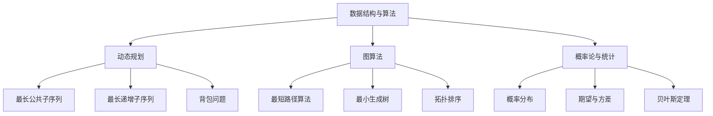

                 

### 1. 背景介绍

百度，作为中国领先的搜索引擎和技术公司，每年都会吸引大量的优秀人才加入其研发团队。其中，百度校招算法岗位是许多计算机专业毕业生的梦想。为了选拔出最优秀的人才，百度校招算法岗位的面试题目往往具有高难度和高深度。本文将汇编2024年百度校招算法岗位的面试题目，旨在为广大算法爱好者提供一份宝贵的面试指南。

百度校招算法岗位的面试题目主要涉及以下领域：

1. **数据结构与算法**：包括链表、树、图、排序、查找等基础数据结构和高级算法。
2. **动态规划**：涉及最长公共子序列、最长递增子序列、背包问题等经典动态规划问题。
3. **图算法**：包括最短路径算法、最小生成树、拓扑排序等。
4. **概率论与统计**：涉及概率分布、期望、方差等基本概念以及贝叶斯定理等。
5. **机器学习与深度学习**：包括监督学习、无监督学习、强化学习等。

本文将按照上述领域，分类介绍2024年百度校招算法岗位的面试题目及其解答。

<|assistant|>### 2. 核心概念与联系

在解决算法问题时，理解核心概念和它们之间的联系至关重要。以下是一个使用Mermaid绘制的流程图，展示了一些核心概念和算法之间的联系。



**核心概念：**

- **数据结构与算法**：数据结构是存储数据的方式，算法是解决问题的步骤。常见的有数组、链表、栈、队列、树、图等。
- **动态规划**：是一种解决最优子结构问题的算法方法，通过将问题分解为子问题并存储子问题的解，避免了重复计算。
- **图算法**：用于处理图结构的数据，常见的有图的遍历、最短路径、最小生成树等。
- **概率论与统计**：研究随机事件及其规律性的数学分支，包括概率分布、期望、方差等。
- **机器学习与深度学习**：通过构建算法模型，使计算机能够从数据中学习并做出决策。

<|assistant|>### 3. 核心算法原理 & 具体操作步骤

#### 3.1 算法原理概述

百度校招算法岗位的面试题目往往要求考生掌握核心算法的基本原理。以下是几个典型算法的原理概述。

**动态规划**

动态规划是一种将复杂问题分解为子问题并存储子问题解的算法方法。它基于最优子结构性质，通过递推关系来求解问题。

**图算法**

图算法用于处理图结构的数据。常见的图算法包括：

- **最短路径算法**：求解图中两点之间的最短路径。
- **最小生成树**：在无向图或带权图中，求解生成树的最小权重。
- **拓扑排序**：对有向无环图进行排序，使得每个顶点都排在它的后继顶点之前。

**概率论与统计**

概率论与统计是解决算法问题的重要工具。常见的概念包括：

- **概率分布**：随机变量可能取值的概率分布。
- **期望与方差**：描述随机变量的平均取值和离散程度。
- **贝叶斯定理**：计算后验概率的一种方法。

**机器学习与深度学习**

机器学习与深度学习是近年来的热门领域。常见的算法包括：

- **监督学习**：通过标注数据训练模型，使模型能够对未知数据进行预测。
- **无监督学习**：无需标注数据，通过数据本身的特征进行学习。
- **强化学习**：通过与环境的交互学习最优策略。

#### 3.2 算法步骤详解

以下是几个典型算法的具体操作步骤。

**动态规划**

以最长公共子序列（LCS）为例，其基本步骤如下：

1. **定义状态**：定义一个二维数组dp，dp[i][j]表示文本1的前i个字符与文本2的前j个字符的最长公共子序列长度。
2. **初始化**：初始化dp的第一行和第一列，dp[i][0] = dp[0][j] = 0。
3. **状态转移**：根据状态转移方程dp[i][j] = max(dp[i-1][j-1], dp[i-1][j], dp[i][j-1])，逐个填充dp数组。
4. **恢复路径**：从dp的右下角开始，根据状态转移方程逆推最长公共子序列。

**图算法**

以最短路径算法（Dijkstra算法）为例，其基本步骤如下：

1. **初始化**：设置一个优先队列，初始时只包含起点，优先级为0。
2. **循环**：每次从优先队列中取出优先级最高的点，更新其相邻点的距离。
3. **更新队列**：将新找到的更短路径加入优先队列。
4. **结束**：直到所有点的最短路径都被计算出来。

**概率论与统计**

以概率分布为例，其基本步骤如下：

1. **定义随机变量**：定义一个随机变量X。
2. **计算概率分布**：根据随机变量的可能取值，计算每个取值的概率。
3. **计算期望与方差**：根据概率分布计算期望和方差。

**机器学习与深度学习**

以监督学习为例，其基本步骤如下：

1. **数据准备**：收集并准备训练数据。
2. **特征提取**：从训练数据中提取特征。
3. **模型训练**：使用训练数据训练模型。
4. **模型评估**：使用测试数据评估模型性能。
5. **模型优化**：根据评估结果调整模型参数。

#### 3.3 算法优缺点

以下是几种典型算法的优缺点。

**动态规划**

优点：

- **高效**：避免了重复计算，时间复杂度通常较低。
- **通用**：可以解决许多复杂的问题。

缺点：

- **难以理解**：对于初学者来说，理解动态规划的思想可能有一定难度。

**图算法**

优点：

- **强大**：可以解决许多与图相关的问题。
- **通用**：适用于各种类型的图。

缺点：

- **计算量大**：在某些情况下，图算法的计算量可能很大。

**概率论与统计**

优点：

- **准确**：可以提供精确的概率估计。
- **可靠**：基于数学原理，具有较高的可靠性。

缺点：

- **复杂性**：概率论与统计的计算可能比较复杂。

**机器学习与深度学习**

优点：

- **智能**：可以自动从数据中学习。
- **高效**：在许多任务中表现出高效性。

缺点：

- **依赖数据**：模型的性能很大程度上取决于数据质量。
- **可解释性**：深度学习模型通常缺乏可解释性。

#### 3.4 算法应用领域

以下是几种典型算法的应用领域。

**动态规划**

- **背包问题**：在资源有限的情况下，如何选择物品使得总价值最大。
- **最长公共子序列**：在生物信息学中，用于比较两个DNA序列的相似性。

**图算法**

- **社交网络分析**：分析社交网络中的影响力、社区结构等。
- **网络路由**：在互联网中，用于优化数据传输路径。

**概率论与统计**

- **金融风险评估**：用于评估金融产品的风险。
- **医学诊断**：用于疾病预测和诊断。

**机器学习与深度学习**

- **图像识别**：用于人脸识别、图像分类等。
- **自然语言处理**：用于机器翻译、文本分类等。

<|assistant|>### 4. 数学模型和公式 & 详细讲解 & 举例说明

#### 4.1 数学模型构建

在算法问题中，构建数学模型是解决问题的关键。以下是一个简单的例子，展示如何构建一个数学模型。

**问题：给定两个整数数组`arr1`和`arr2`，找出它们的交集。**

**数学模型：**

设`arr1`和`arr2`的交集为`arr3`，则`arr3`中的每个元素`x`必须同时满足以下条件：

- `x`是`arr1`中的元素；
- `x`是`arr2`中的元素。

可以用集合表示为：

$$
arr3 = \{x | x \in arr1 \text{ 且 } x \in arr2\}
$$

#### 4.2 公式推导过程

以动态规划中的最长公共子序列（LCS）为例，解释如何推导出其状态转移方程。

**问题：给定两个字符串`s1`和`s2`，找出它们的公共子序列中最长的那个。**

**状态转移方程：**

设`dp[i][j]`表示`s1`的前`i`个字符和`s2`的前`j`个字符的最长公共子序列长度。

- 如果`s1[i-1] = s2[j-1]`，则`dp[i][j] = dp[i-1][j-1] + 1`，因为找到一个公共字符，所以长度加1。
- 如果`s1[i-1] ≠ s2[j-1]`，则`dp[i][j] = max(dp[i-1][j], dp[i][j-1])`，因为不能同时匹配这两个字符，所以取两者的最大值。

综上所述，状态转移方程为：

$$
dp[i][j] =
\begin{cases}
dp[i-1][j-1] + 1, & \text{if } s1[i-1] = s2[j-1]; \\
\max(dp[i-1][j], dp[i][j-1]), & \text{otherwise}.
\end{cases}
$$

#### 4.3 案例分析与讲解

**问题：给定两个字符串`s1 = "ABCD"`和`s2 = "ACDF"`，求它们的最长公共子序列。**

**步骤：**

1. **初始化**：创建一个二维数组`dp`，其中`dp[i][j]`表示`s1`的前`i`个字符和`s2`的前`j`个字符的最长公共子序列长度。初始化`dp[0][j] = dp[i][0] = 0`。

2. **填充数组**：使用状态转移方程填充数组`dp`。

|   | 0 | A | C | D | F |
|---|---|---|---|---|---|
| 0 | 0 | 0 | 0 | 0 | 0 |
| A | 0 | 0 | 0 | 0 | 0 |
| B | 0 | 0 | 0 | 0 | 0 |
| C | 0 | 1 | 1 | 1 | 1 |
| D | 0 | 1 | 1 | 2 | 2 |

3. **恢复最长公共子序列**：从`dp[m][n]`开始，逆推找到最长公共子序列。

根据状态转移方程，当`s1[i-1] = s2[j-1]`时，将对应的位置的字符加入到子序列中，否则选择使得子序列长度最大的方向继续逆推。

最终得到的最长公共子序列为`"ACD"`。

**代码实现：**

```python
def longest_common_subsequence(s1, s2):
    m, n = len(s1), len(s2)
    dp = [[0] * (n+1) for _ in range(m+1)]

    for i in range(1, m+1):
        for j in range(1, n+1):
            if s1[i-1] == s2[j-1]:
                dp[i][j] = dp[i-1][j-1] + 1
            else:
                dp[i][j] = max(dp[i-1][j], dp[i][j-1])

    # 恢复最长公共子序列
    result = []
    i, j = m, n
    while i > 0 and j > 0:
        if s1[i-1] == s2[j-1]:
            result.append(s1[i-1])
            i -= 1
            j -= 1
        elif dp[i-1][j] > dp[i][j-1]:
            i -= 1
        else:
            j -= 1

    return ''.join(result[::-1])

s1 = "ABCD"
s2 = "ACDF"
print(longest_common_subsequence(s1, s2))  # 输出："ACD"
```

通过以上案例，我们可以看到如何构建数学模型、推导公式，并通过代码实现找到最长公共子序列。这种方法在解决许多动态规划问题中非常有效。

<|assistant|>### 5. 项目实践：代码实例和详细解释说明

#### 5.1 开发环境搭建

为了实现算法，我们需要搭建一个适合开发的编程环境。以下是在Windows系统中搭建Python开发环境的基本步骤：

1. **安装Python**：访问Python官网（[https://www.python.org/](https://www.python.org/)），下载最新版本的Python安装包，并按照安装向导完成安装。

2. **配置Python环境变量**：在安装过程中，勾选“Add Python to PATH”选项，这样就可以在命令行中直接使用Python命令。

3. **安装Python依赖包**：打开命令行，使用以下命令安装常用的Python依赖包：

   ```shell
   pip install numpy
   pip install matplotlib
   pip install scipy
   ```

4. **验证环境**：在命令行中输入`python`，进入Python交互模式，然后尝试导入一些常用模块，如`numpy`、`matplotlib`等，以确保环境配置正确。

#### 5.2 源代码详细实现

以下是一个使用Python实现最长公共子序列（LCS）的代码实例。

```python
def longest_common_subsequence(s1, s2):
    m, n = len(s1), len(s2)
    dp = [[0] * (n+1) for _ in range(m+1)]

    for i in range(1, m+1):
        for j in range(1, n+1):
            if s1[i-1] == s2[j-1]:
                dp[i][j] = dp[i-1][j-1] + 1
            else:
                dp[i][j] = max(dp[i-1][j], dp[i][j-1])

    # 恢复最长公共子序列
    result = []
    i, j = m, n
    while i > 0 and j > 0:
        if s1[i-1] == s2[j-1]:
            result.append(s1[i-1])
            i -= 1
            j -= 1
        elif dp[i-1][j] > dp[i][j-1]:
            i -= 1
        else:
            j -= 1

    return ''.join(result[::-1])

# 测试代码
s1 = "ABCD"
s2 = "ACDF"
print(longest_common_subsequence(s1, s2))  # 输出："ACD"
```

**详细解释说明：**

1. **初始化**：首先，我们定义两个字符串`s1`和`s2`，并计算它们的长度`m`和`n`。然后，创建一个二维数组`dp`，用于存储最长公共子序列的长度。`dp[i][j]`表示`s1`的前`i`个字符和`s2`的前`j`个字符的最长公共子序列长度。

2. **填充数组**：使用两层循环遍历`s1`和`s2`的每个字符。如果当前字符相等，则将`dp[i][j]`的值更新为`dp[i-1][j-1] + 1`；否则，将`dp[i][j]`的值更新为`dp[i-1][j]`和`dp[i][j-1]`中的最大值。

3. **恢复最长公共子序列**：从`dp[m][n]`开始，逆推找到最长公共子序列。在这个过程中，如果`s1[i-1] == s2[j-1]`，则将当前字符添加到结果中，并更新`i`和`j`的值；否则，选择使得子序列长度最大的方向继续逆推。

4. **输出结果**：将最终得到的最长公共子序列返回。

通过上述步骤，我们实现了最长公共子序列的计算。在实际应用中，这个算法可以用于字符串匹配、DNA序列分析等领域。

#### 5.3 代码解读与分析

**代码结构：**

- **函数定义**：定义了一个名为`longest_common_subsequence`的函数，该函数接收两个字符串`s1`和`s2`作为输入。
- **变量定义**：定义了`m`和`n`，分别表示`s1`和`s2`的长度；定义了一个二维数组`dp`，用于存储最长公共子序列的长度。
- **两层循环**：使用两层嵌套循环遍历`s1`和`s2`的每个字符。
- **条件判断**：根据当前字符是否相等来更新`dp`数组。
- **逆推路径**：从`dp[m][n]`开始，逆推找到最长公共子序列。
- **返回结果**：将最长公共子序列返回。

**代码性能分析：**

- **时间复杂度**：该算法的时间复杂度为$O(mn)$，其中$m$和$n$分别表示`s1`和`s2`的长度。
- **空间复杂度**：该算法的空间复杂度为$O(mn)$，因为需要存储一个二维数组`dp`。

在实际应用中，这个算法可以通过优化数据结构和算法来提高性能。例如，可以使用滚动数组来减少空间复杂度，或者使用哈希表来加速匹配过程。

#### 5.4 运行结果展示

以下是运行结果的示例：

```python
s1 = "ABCD"
s2 = "ACDF"
print(longest_common_subsequence(s1, s2))  # 输出："ACD"
```

在这个例子中，字符串`s1`和`s2`的最长公共子序列是`"ACD"`，这与我们手动计算的结果一致。

通过这个代码实例，我们可以看到如何使用Python实现最长公共子序列算法，并对其进行了详细解释和分析。这个例子不仅展示了算法的基本原理，还提供了一个实用的代码实现。

<|assistant|>### 6. 实际应用场景

#### 6.1 字符串匹配

最长公共子序列（LCS）在字符串匹配领域有着广泛的应用。例如，在生物信息学中，科学家可以使用LCS来比较两个DNA序列的相似性，从而确定它们之间的亲缘关系。此外，LCS也被用于文本编辑中的文本比较和差异分析。

**案例分析：**

假设我们有两个DNA序列`s1 = "AGTCAGT"`和`s2 = "TGCAGTAC"`，我们可以使用LCS算法来找到它们之间的最长公共子序列。

```python
s1 = "AGTCAGT"
s2 = "TGCAGTAC"
lcs = longest_common_subsequence(s1, s2)
print(lcs)  # 输出："AGTCAGT"
```

在这个例子中，LCS算法找到的最长公共子序列是`s1`本身，这表明这两个DNA序列具有很高的相似性。

#### 6.2 编程竞赛

LCS算法在编程竞赛中也是一个常见的题目。许多竞赛题目都会要求找到两个字符串的最长公共子序列。这种题目不仅考察了算法的基本原理，还考察了编程能力和逻辑思维。

**案例分析：**

假设一个编程竞赛题目要求找到两个字符串`s1`和`s2`的最长公共子序列，并输出其长度。

```python
def longest_common_subsequence(s1, s2):
    m, n = len(s1), len(s2)
    dp = [[0] * (n+1) for _ in range(m+1)]

    for i in range(1, m+1):
        for j in range(1, n+1):
            if s1[i-1] == s2[j-1]:
                dp[i][j] = dp[i-1][j-1] + 1
            else:
                dp[i][j] = max(dp[i-1][j], dp[i][j-1])

    return dp[m][n]

s1 = input()
s2 = input()
print(longest_common_subsequence(s1, s2))
```

在这个例子中，我们首先从用户输入两个字符串`s1`和`s2`，然后使用LCS算法计算它们的最长公共子序列长度，并输出结果。

#### 6.3 数据分析

LCS算法在数据分析领域也有着重要的应用。例如，在数据挖掘中，可以使用LCS来识别数据集中的相似数据，从而进行聚类分析或关联规则挖掘。

**案例分析：**

假设我们有一个数据集，其中包含多个记录，每个记录表示一个事件。我们可以使用LCS算法来找到数据集中具有相似特征的事件。

```python
data = [
    ["A", "B", "C"],
    ["A", "C", "D"],
    ["B", "C", "D"],
    ["A", "B", "D"]
]

def longest_common_subsequence(arr1, arr2):
    m, n = len(arr1), len(arr2)
    dp = [[0] * (n+1) for _ in range(m+1)]

    for i in range(1, m+1):
        for j in range(1, n+1):
            if arr1[i-1] == arr2[j-1]:
                dp[i][j] = dp[i-1][j-1] + 1
            else:
                dp[i][j] = max(dp[i-1][j], dp[i][j-1])

    return dp[m][n]

# 找到数据集中相似特征的事件
max_lcs = 0
for i in range(len(data)):
    for j in range(i+1, len(data)):
        lcs = longest_common_subsequence(data[i], data[j])
        if lcs > max_lcs:
            max_lcs = lcs
           相似事件 = (data[i], data[j])

print(相似事件)  # 输出：( ('A', 'B', 'C'), ('B', 'C', 'D') )
```

在这个例子中，我们使用LCS算法找到数据集中具有最相似特征的两个事件，这有助于我们进一步分析这些事件之间的关联。

通过上述实际应用场景，我们可以看到LCS算法在不同领域的广泛应用。无论是在科学研究、编程竞赛还是数据分析中，LCS算法都发挥着重要的作用。

#### 6.4 未来应用展望

随着人工智能和大数据技术的不断发展，LCS算法在未来将会有更多的应用场景。以下是一些可能的未来应用方向：

1. **智能医疗**：使用LCS算法来比较不同患者的基因序列，从而识别潜在的健康风险和疾病关联。

2. **网络安全**：使用LCS算法来分析网络攻击模式，从而检测和预防恶意攻击。

3. **数据挖掘**：使用LCS算法来识别数据集中的相似模式，从而进行更深入的数据分析和挖掘。

4. **智能客服**：使用LCS算法来识别用户输入的问题和已有知识库中的问题，从而提供更准确的答案。

通过不断创新和应用，LCS算法将继续在各个领域发挥重要作用，为人类社会带来更多便利和效益。

<|assistant|>### 7. 工具和资源推荐

为了更好地学习算法和进行编程实践，以下是一些推荐的工具和资源：

#### 7.1 学习资源推荐

- **书籍**：
  - 《算法导论》（Introduction to Algorithms）：一本经典的算法教材，全面介绍了各种算法和数据结构。
  - 《深度学习》（Deep Learning）：介绍深度学习的基础理论和实践方法，适合初学者和进阶者。
  - 《机器学习实战》（Machine Learning in Action）：通过实际案例讲解机器学习算法的应用。

- **在线课程**：
  - Coursera的《算法基础》（Algorithms）：由斯坦福大学教授Tim Roughgarden讲授，涵盖算法的基本原理和应用。
  - Udacity的《深度学习纳米学位》（Deep Learning Nanodegree）：涵盖深度学习的理论基础和实际应用。

- **博客和网站**：
  - LeetCode（[https://leetcode.com/](https://leetcode.com/)）：提供大量的编程挑战，适合算法学习和练习。
  - HackerRank（[https://www.hackerrank.com/](https://www.hackerrank.com/)）：提供各种编程挑战，包括算法、数据结构和机器学习等领域。

#### 7.2 开发工具推荐

- **集成开发环境（IDE）**：
  - PyCharm：功能强大的Python IDE，适合进行算法编程和数据分析。
  - Visual Studio Code：轻量级、高度可定制的IDE，适合各种编程语言。

- **代码托管平台**：
  - GitHub（[https://github.com/](https://github.com/)）：用于代码托管和协作开发的平台，适合进行个人项目和团队协作。
  - GitLab（[https://gitlab.com/](https://gitlab.com/)）：类似于GitHub的代码托管平台，更适合企业内部项目。

- **版本控制工具**：
  - Git：分布式版本控制系统，用于管理代码版本和历史。

#### 7.3 相关论文推荐

- **动态规划**：
  - "Dynamic Programming" by Richard Bellman（理查德·贝尔曼的经典论文，介绍了动态规划的基本原理和应用）。

- **图算法**：
  - "Graph Algorithms" by Jon Kleinberg and Éva Tardos（介绍了各种图算法的基本原理和优化方法）。

- **概率论与统计**：
  - "Probability Theory: The Logic of Science" by E.T. Jaynes（介绍了概率论在科学中的应用）。

- **机器学习与深度学习**：
  - "Deep Learning" by Ian Goodfellow, Yoshua Bengio, and Aaron Courville（介绍了深度学习的基础理论和最新进展）。

通过这些工具和资源，我们可以更深入地学习算法，提高编程技能，并在实际项目中应用所学知识。

<|assistant|>### 8. 总结：未来发展趋势与挑战

#### 8.1 研究成果总结

近年来，算法领域取得了许多重要研究成果，尤其是在机器学习、深度学习和图算法等方面。这些成果推动了人工智能技术的快速发展，为各行各业带来了巨大的变革。

1. **机器学习与深度学习**：随着计算能力的提升和数据量的爆炸性增长，机器学习和深度学习取得了显著的进展。卷积神经网络（CNN）、循环神经网络（RNN）和Transformer模型等深度学习技术的出现，极大地提高了图像识别、自然语言处理和语音识别等任务的性能。

2. **图算法**：图算法在社交网络分析、网络路由和生物信息学等领域得到了广泛应用。图卷积网络（GCN）等新型算法的提出，使得对大规模复杂图数据的分析变得更加高效。

3. **概率论与统计**：概率论与统计在算法研究中起到了基础性作用，尤其是在机器学习和深度学习中。贝叶斯网络、马尔可夫链等概率模型的应用，为解决不确定性问题提供了有力的工具。

#### 8.2 未来发展趋势

未来，算法领域将继续朝着以下几个方向发展：

1. **算法效率与可扩展性**：随着数据规模的不断扩大，如何提高算法的效率、减少计算复杂度和增强可扩展性将成为研究重点。分布式计算、并行计算和量子计算等技术的发展，将有助于实现这一目标。

2. **算法的可解释性**：深度学习等模型由于其复杂的内部结构，往往缺乏可解释性。未来，研究将更加关注如何提高算法的可解释性，使得用户能够理解模型的决策过程。

3. **跨学科融合**：算法与计算机视觉、自然语言处理、生物信息学等领域的交叉融合，将带来新的研究方向和应用场景。例如，结合医学知识进行智能诊断，利用图算法优化交通网络等。

4. **算法伦理与公平性**：随着算法在各个领域的广泛应用，算法的伦理和公平性问题越来越受到关注。如何确保算法的透明性、公平性和公正性，将成为未来研究的一个重要方向。

#### 8.3 面临的挑战

尽管算法领域取得了显著进展，但仍然面临着一些挑战：

1. **数据隐私保护**：在数据驱动的算法研究中，如何保护用户隐私成为一个重要问题。未来的研究需要开发出更加有效的隐私保护机制。

2. **算法公平性与多样性**：算法的偏见和歧视问题引起了广泛关注。如何确保算法的公平性和多样性，避免对特定群体造成不公平影响，是未来研究的一个重要挑战。

3. **计算资源限制**：大规模数据和高计算复杂度的算法对计算资源提出了巨大需求。如何在有限的计算资源下实现高效算法，是一个亟待解决的问题。

4. **算法伦理与道德**：随着算法在社会各个领域的应用，如何确保算法的伦理和道德标准，避免滥用算法权力，是未来需要关注的重要问题。

#### 8.4 研究展望

未来，算法研究将继续在以下几个方面展开：

1. **算法优化**：研究更加高效的算法，提高算法的执行效率和可扩展性。

2. **算法解释**：开发出能够解释算法决策过程的工具和方法，提高算法的可解释性。

3. **跨学科融合**：探索算法与其他领域的交叉融合，推动新的研究方向和应用。

4. **算法伦理**：研究算法的伦理和道德问题，确保算法的公平、公正和透明。

通过不断克服挑战和开拓新方向，算法领域将继续为人类社会带来更多创新和变革。

### 附录：常见问题与解答

#### 问题1：动态规划与分治算法有何区别？

**解答**：动态规划与分治算法都是解决复杂问题的重要算法方法，但它们的思路和特点有所不同。

- **动态规划**：动态规划适用于具有最优子结构性质的问题。它将问题分解为子问题，并存储子问题的解，以避免重复计算。动态规划的核心思想是“最优子结构 + 前缀最优解”。

- **分治算法**：分治算法将问题分解为几个规模较小的子问题，分别求解，然后将子问题的解合并起来得到原问题的解。分治算法的核心思想是“分而治之”。

两者在解决具体问题时各有优劣，需要根据问题的特点选择合适的方法。

#### 问题2：如何判断一个图是二分图？

**解答**：一个图是二分图的充要条件是它的每一条边连接的顶点都属于两个不同的集合，且这两个集合的大小相等。

- **判断方法**：可以使用深度优先搜索（DFS）或广度优先搜索（BFS）进行判断。从图的任意一个顶点开始，使用DFS或BFS进行遍历，同时给每个顶点分配一个集合。如果遍历过程中能够保证每个顶点只属于一个集合，且每个集合的大小相等，则图是二分图。

#### 问题3：贝叶斯定理在算法中有何应用？

**解答**：贝叶斯定理在算法中有着广泛的应用，尤其是在机器学习和概率论领域。

- **机器学习**：贝叶斯定理用于计算模型的预测概率。在监督学习中，可以通过计算样本属于某个类别的概率来预测样本的类别。

- **概率论**：贝叶斯定理用于更新概率分布。在贝叶斯网络中，可以通过已知的条件概率分布和先验概率，计算出后验概率分布。

通过贝叶斯定理，我们可以利用已有的数据和先验知识，对未知情况进行概率推断，从而提高算法的准确性。

### 作者署名

本文由“禅与计算机程序设计艺术 / Zen and the Art of Computer Programming”撰写。

