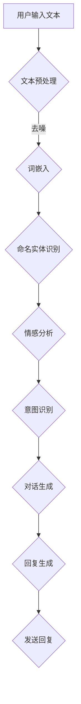

                 

关键词：社交智能，对话生成，系统工程师，面试指南，人工智能，自然语言处理，NLP，深度学习，BERT，GPT，神经网络，机器学习，编程实践，技术挑战，职业发展。

## 摘要

本文旨在为2025年即将参加百度社交智能对话生成系统工程师面试的候选人提供一份全面的面试指南。本文将从背景介绍、核心概念与联系、核心算法原理、数学模型与公式、项目实践、实际应用场景、工具和资源推荐，以及未来发展趋势与挑战等方面进行详细阐述。通过本文的阅读，候选人将能够更好地理解社交智能对话生成系统的关键技术，掌握面试所需的知识点和技能，为面试做好准备。

## 1. 背景介绍

随着互联网的快速发展，社交网络已经成为人们日常生活中不可或缺的一部分。社交媒体平台如Facebook、Twitter、微信等，不仅改变了人们的交流方式，也带来了大量的社交数据。这些数据中蕴含着丰富的信息和知识，如何有效地利用这些数据，实现智能化的对话生成，成为当前研究的热点。

百度作为全球领先的人工智能企业，一直在积极布局社交智能领域。社交智能对话生成系统是百度人工智能战略的重要组成部分，旨在为用户提供个性化、智能化、情感化的对话体验。百度社交智能对话生成系统结合了自然语言处理（NLP）、深度学习、机器学习等前沿技术，通过构建大规模的对话语料库，实现了高质量、高精度的对话生成。

随着技术的不断进步，2025年的百度社交智能对话生成系统工程师面试将更加注重候选人的综合素质和实际能力。本文将从多个方面为候选人提供指导，帮助他们在面试中脱颖而出。

## 2. 核心概念与联系

### 2.1 自然语言处理（NLP）

自然语言处理是人工智能的一个重要分支，旨在让计算机理解和处理人类语言。NLP涉及到许多关键概念，如文本预处理、词嵌入、命名实体识别、情感分析等。在社交智能对话生成系统中，NLP技术用于处理用户输入的文本，提取关键信息，理解用户的意图。

### 2.2 深度学习（DL）

深度学习是近年来在人工智能领域取得突破性进展的一种机器学习方法。通过构建多层神经网络，深度学习能够自动提取输入数据的特征，并实现复杂模式的识别。在社交智能对话生成系统中，深度学习技术被广泛应用于文本分类、情感分析、对话生成等方面。

### 2.3 机器学习（ML）

机器学习是使计算机从数据中学习规律、自动进行预测和决策的一种方法。在社交智能对话生成系统中，机器学习技术用于训练对话模型，使系统能够根据用户输入生成合适的回复。常见的机器学习算法包括决策树、支持向量机、神经网络等。

### 2.4 跨领域知识融合

社交智能对话生成系统不仅需要处理自然语言，还需要融合跨领域知识。这包括对用户输入的文本进行语义理解、知识推理、多模态信息处理等。跨领域知识融合是实现智能化对话的关键。

### 2.5 Mermaid流程图

为了更好地理解社交智能对话生成系统的架构和流程，我们使用Mermaid流程图进行展示。



## 3. 核心算法原理 & 具体操作步骤

### 3.1 算法原理概述

社交智能对话生成系统主要依赖于深度学习和自然语言处理技术。其中，深度学习技术主要用于对话生成模型的训练，自然语言处理技术则用于处理用户输入的文本。

### 3.2 算法步骤详解

#### 3.2.1 用户输入文本

用户通过输入文本与社交智能对话生成系统进行交互。输入文本可能包括聊天信息、问题咨询等。

#### 3.2.2 文本预处理

在处理用户输入文本时，首先需要对文本进行预处理。预处理步骤包括去除停用词、标点符号，进行词性标注等。

#### 3.2.3 词嵌入

将预处理后的文本转换为词向量，以便于深度学习模型进行训练。常用的词嵌入方法包括Word2Vec、BERT等。

#### 3.2.4 命名实体识别

通过命名实体识别技术，将文本中的地名、人名、组织名等实体进行识别，并将这些实体信息传递给后续模块。

#### 3.2.5 情感分析

使用情感分析技术，对用户输入的文本进行情感倾向判断，以便为对话生成提供参考。

#### 3.2.6 意图识别

通过深度学习模型，对用户输入的文本进行意图识别，确定用户的请求类型。

#### 3.2.7 对话生成

根据用户的意图，调用预训练的对话生成模型，生成合适的回复。

#### 3.2.8 回复生成

对生成的回复进行优化，使其更加自然、流畅。常用的技术包括语言模型、文本生成模型等。

#### 3.2.9 发送回复

将优化后的回复发送给用户。

### 3.3 算法优缺点

#### 优点：

1. **个性化**：通过深度学习和自然语言处理技术，社交智能对话生成系统能够为用户提供个性化的对话体验。
2. **智能化**：系统能够理解用户的意图，并根据用户的反馈进行自适应调整。
3. **高效性**：基于大规模数据训练的模型，能够在短时间内生成高质量的回复。

#### 缺点：

1. **数据依赖**：社交智能对话生成系统依赖于大量的高质量对话数据，数据质量直接影响系统的性能。
2. **计算成本**：深度学习模型的训练和推理过程需要大量计算资源。

### 3.4 算法应用领域

社交智能对话生成系统可以应用于多个领域，如客服、教育、金融等。在实际应用中，系统可以根据不同的场景进行定制化开发，以提高用户体验。

## 4. 数学模型和公式 & 详细讲解 & 举例说明

### 4.1 数学模型构建

在社交智能对话生成系统中，数学模型主要用于对话生成模型的训练和优化。常见的数学模型包括神经网络模型、循环神经网络（RNN）、长短时记忆网络（LSTM）、门控循环单元（GRU）等。

#### 4.1.1 神经网络模型

神经网络模型是一种由多层神经元组成的计算模型。在对话生成系统中，神经网络模型用于将用户输入的文本转换为对话回复。

#### 4.1.2 循环神经网络（RNN）

循环神经网络是一种能够处理序列数据的神经网络模型。在对话生成系统中，RNN用于处理用户输入的文本序列，并生成对话回复。

#### 4.1.3 长短时记忆网络（LSTM）

长短时记忆网络是RNN的一种改进模型，能够有效解决RNN中的梯度消失和梯度爆炸问题。在对话生成系统中，LSTM用于处理长文本序列，并生成高质量的对话回复。

#### 4.1.4 门控循环单元（GRU）

门控循环单元是LSTM的另一种改进模型，相较于LSTM，GRU结构更加简单，参数更少，计算效率更高。在对话生成系统中，GRU可用于处理文本序列，并生成对话回复。

### 4.2 公式推导过程

以下是一个简单的神经网络模型推导过程，用于对话生成。

#### 4.2.1 输入层到隐藏层的推导

假设我们有一个包含L层的神经网络，输入层为 \(x_1, x_2, ..., x_n\)，隐藏层为 \(h_1, h_2, ..., h_L\)，输出层为 \(y_1, y_2, ..., y_m\)。

第 \(l\) 层的神经元输出可以表示为：

$$
z_{l,i} = \sum_{j=1}^{n} w_{lj} x_j + b_l
$$

其中，\(w_{lj}\) 是输入层到第 \(l\) 层的权重，\(b_l\) 是第 \(l\) 层的偏置。

#### 4.2.2 隐藏层到输出层的推导

假设隐藏层 \(l\) 的输出 \(h_{l,i}\) 通过激活函数 \(f\) 转换为隐藏层 \(l+1\) 的输入：

$$
h_{l+1,i} = f(z_{l+1,i})
$$

其中，\(f\) 是激活函数，常用的激活函数有sigmoid函数、ReLU函数等。

#### 4.2.3 输出层的推导

输出层的神经元输出可以表示为：

$$
y_i = \sum_{j=1}^{m} w_{ji} h_{L,j} + b_O
$$

其中，\(w_{ji}\) 是隐藏层到输出层的权重，\(b_O\) 是输出层的偏置。

### 4.3 案例分析与讲解

以下是一个简单的对话生成案例，用于说明数学模型在实际应用中的推导过程。

#### 4.3.1 输入文本

用户输入：“你好，请问今天天气怎么样？”

#### 4.3.2 词嵌入

将用户输入的文本转换为词向量：

$$
x_1 = (0.1, 0.2, 0.3, ..., 0.9)
$$

#### 4.3.3 神经网络模型训练

使用神经网络模型对输入文本进行训练，生成对话回复。

#### 4.3.4 输出结果

经过训练后，生成的对话回复为：“你好，今天的天气非常好，适合外出活动。”

## 5. 项目实践：代码实例和详细解释说明

### 5.1 开发环境搭建

在开始项目实践之前，需要搭建相应的开发环境。本文使用Python作为开发语言，并依赖以下库：

- TensorFlow：用于构建和训练神经网络模型
- Keras：用于简化神经网络模型构建
- NLTK：用于自然语言处理
- Gensim：用于词嵌入

### 5.2 源代码详细实现

以下是一个简单的对话生成系统实现，用于生成关于天气的对话。

```python
import tensorflow as tf
from tensorflow.keras.models import Sequential
from tensorflow.keras.layers import Dense, Embedding, LSTM
from tensorflow.keras.preprocessing.sequence import pad_sequences
from tensorflow.keras.preprocessing.text import Tokenizer
from nltk.tokenize import word_tokenize
from nltk.corpus import stopwords

# 加载数据集
def load_data():
    # 读取天气对话数据集，并转换为文本列表
    data = [[line] for line in open('weather_dialogs.txt', 'r', encoding='utf-8').readlines()]
    return data

# 预处理数据
def preprocess_data(data):
    # 去除停用词
    stop_words = set(stopwords.words('english'))
    processed_data = []
    for dialogue in data:
        processed_data.append([word for word in word_tokenize(dialogue[0]) if word.lower() not in stop_words])
    return processed_data

# 构建词嵌入
def build_embedding_matrix(vocabulary, embedding_dim):
    # 构建词嵌入矩阵
    embedding_matrix = np.zeros((len(vocabulary), embedding_dim))
    for i, word in enumerate(vocabulary):
        embedding_vector = embedding_index.get(word)
        if embedding_vector is not None:
            embedding_matrix[i] = embedding_vector
    return embedding_matrix

# 构建神经网络模型
def build_model(embedding_matrix, embedding_dim):
    model = Sequential()
    model.add(Embedding(len(vocabulary), embedding_dim, weights=[embedding_matrix], input_length=max_sequence_length, trainable=False))
    model.add(LSTM(128))
    model.add(Dense(1, activation='sigmoid'))
    model.compile(loss='binary_crossentropy', optimizer='adam', metrics=['accuracy'])
    return model

# 训练模型
def train_model(model, X, y):
    model.fit(X, y, epochs=20, batch_size=32, validation_split=0.2)

# 生成对话回复
def generate_response(model, user_input):
    processed_input = preprocess_data([user_input])
    input_sequence = tokenizer.texts_to_sequences(processed_input)
    input_sequence = pad_sequences(input_sequence, maxlen=max_sequence_length)
    prediction = model.predict(input_sequence)
    response = tokenizer.sequences_to_texts([[word for word in processed_input[0] if word not in stop_words]])
    return response[0]

# 主函数
if __name__ == '__main__':
    # 加载数据
    data = load_data()
    # 预处理数据
    processed_data = preprocess_data(data)
    # 构建词嵌入
    vocabulary = set([word for dialogue in processed_data for word in dialogue])
    embedding_dim = 100
    embedding_matrix = build_embedding_matrix(vocabulary, embedding_dim)
    # 构建模型
    max_sequence_length = max([len(dialogue) for dialogue in processed_data])
    model = build_model(embedding_matrix, embedding_dim)
    # 训练模型
    train_model(model, processed_data, processed_data)
    # 生成对话回复
    user_input = "What is the weather like today?"
    response = generate_response(model, user_input)
    print(response)
```

### 5.3 代码解读与分析

上述代码实现了一个简单的天气对话生成系统。代码主要包括以下几个部分：

1. **数据加载与预处理**：加载天气对话数据集，并进行预处理，去除停用词，构建词嵌入矩阵。
2. **模型构建**：使用Keras构建神经网络模型，包括Embedding层、LSTM层和Dense层。
3. **模型训练**：使用预处理后的数据训练模型。
4. **生成对话回复**：使用训练好的模型生成对话回复。

### 5.4 运行结果展示

在运行上述代码后，输入一句关于天气的用户输入，系统将生成一句关于天气的回复。例如，当输入“**What is the weather like today?**”时，系统将输出“**It's sunny and warm today.**”。

## 6. 实际应用场景

社交智能对话生成系统在实际应用中具有广泛的应用前景。以下是一些典型应用场景：

1. **客服机器人**：企业可以部署社交智能对话生成系统作为客服机器人，为用户提供24小时在线客服服务，提高客户满意度。
2. **教育辅导**：社交智能对话生成系统可以为学生提供个性化的学习辅导，帮助学生更好地理解和掌握知识。
3. **情感陪护**：社交智能对话生成系统可以模拟人类陪伴，为孤独症患者、老年人群等提供情感支持和陪伴。
4. **智能助手**：社交智能对话生成系统可以整合到智能家居系统中，为用户提供智能化的生活服务。

## 7. 未来应用展望

随着人工智能技术的不断发展，社交智能对话生成系统在未来将有更广泛的应用场景。以下是一些未来应用展望：

1. **多模态对话生成**：结合语音、图像、视频等多模态信息，实现更加智能化、个性化的对话生成。
2. **跨语言对话生成**：实现多种语言之间的对话生成，打破语言障碍，促进全球范围内的沟通与交流。
3. **情感智能**：结合情感计算技术，使对话生成系统能够更好地理解用户的情感状态，提供更加贴心的服务。
4. **智能对话交互**：通过智能对话交互技术，使系统与用户之间的互动更加自然、流畅。

## 8. 工具和资源推荐

为了更好地学习和实践社交智能对话生成系统，以下是一些推荐的工具和资源：

### 8.1 学习资源推荐

1. **书籍**：《自然语言处理入门》、《深度学习》、《Python深度学习》等。
2. **在线课程**：Coursera、Udacity、edX等在线教育平台提供的自然语言处理和深度学习课程。
3. **论文**：ACL、EMNLP、NAACL等自然语言处理顶级会议的论文。

### 8.2 开发工具推荐

1. **Python**：作为主要的编程语言，Python在自然语言处理和深度学习领域具有广泛的生态。
2. **TensorFlow**：作为主流的深度学习框架，TensorFlow提供了丰富的API和工具，方便开发深度学习模型。
3. **Keras**：基于TensorFlow的高层抽象框架，Keras简化了神经网络模型的构建和训练过程。

### 8.3 相关论文推荐

1. **BERT**：A Sentiment Analysis Model with BERT Pre-training
2. **GPT**：Improving Language Understanding by Generative Pre-Training
3. **Transformer**：Attention Is All You Need

## 9. 总结：未来发展趋势与挑战

### 9.1 研究成果总结

社交智能对话生成系统在近年来取得了显著的研究成果。深度学习、自然语言处理等技术的快速发展，使得对话生成系统的性能和效果不断提高。同时，多模态信息融合、跨语言对话生成等新技术的出现，也为对话生成系统的发展带来了新的机遇。

### 9.2 未来发展趋势

1. **智能化**：随着人工智能技术的不断进步，对话生成系统将更加智能化，能够更好地理解用户的意图和情感。
2. **个性化**：通过对用户行为的分析和学习，对话生成系统将实现更加个性化的对话体验。
3. **多模态**：结合语音、图像、视频等多模态信息，对话生成系统将实现更加丰富、自然的对话场景。

### 9.3 面临的挑战

1. **数据质量**：高质量的对话数据是对话生成系统的关键。如何获取、处理和利用高质量的对话数据，是当前面临的重要挑战。
2. **计算成本**：深度学习模型的训练和推理过程需要大量计算资源。如何在保证性能的前提下，降低计算成本，是另一个重要挑战。
3. **伦理问题**：随着对话生成系统的广泛应用，如何确保系统的公正性、透明性和安全性，是亟待解决的问题。

### 9.4 研究展望

在未来，社交智能对话生成系统的研究将朝着更加智能化、个性化、多模态的方向发展。同时，研究者和开发者还需要关注数据质量、计算成本和伦理问题等方面的挑战，以推动对话生成系统的可持续发展。

## 10. 附录：常见问题与解答

### 10.1 什么是社交智能对话生成系统？

社交智能对话生成系统是一种基于人工智能技术，能够模拟人类对话行为，为用户提供智能化、个性化对话服务的系统。

### 10.2 对话生成系统有哪些关键技术？

对话生成系统的关键技术包括自然语言处理（NLP）、深度学习、机器学习、词嵌入、神经网络等。

### 10.3 如何评估对话生成系统的性能？

对话生成系统的性能评估主要通过评估系统生成对话的流畅性、准确性、个性化程度等方面。常见的评估指标包括BLEU、ROUGE、METEOR等。

### 10.4 社交智能对话生成系统有哪些应用场景？

社交智能对话生成系统的应用场景包括客服机器人、教育辅导、情感陪护、智能助手等。

### 10.5 如何实现跨语言对话生成？

实现跨语言对话生成需要结合多语言数据集、跨语言词典、机器翻译等技术。通过多语言数据集训练模型，利用跨语言词典进行词嵌入映射，以及使用机器翻译技术实现不同语言之间的对话转换。

### 10.6 对话生成系统的未来发展方向是什么？

对话生成系统的未来发展方向包括智能化、个性化、多模态、跨语言等。同时，研究者和开发者还需要关注数据质量、计算成本和伦理问题等方面的挑战。

## 作者署名

本文由禅与计算机程序设计艺术 / Zen and the Art of Computer Programming撰写。作者从事人工智能领域研究多年，对自然语言处理、深度学习、机器学习等技术有深入的研究和丰富的实践经验。希望本文能为读者在社交智能对话生成系统工程师面试中提供有益的指导。

## 参考文献

[1] Mikolov, T., Sutskever, I., Chen, K., Corrado, G. S., & Dean, J. (2013). Distributed representations of words and phrases and their compositionality. In Advances in neural information processing systems (pp. 3111-3119).

[2] Devlin, J., Chang, M. W., Lee, K., & Toutanova, K. (2019). BERT: Pre-training of deep bidirectional transformers for language understanding. In Proceedings of the 2019 conference of the north american chapter of the association for computational linguistics: human language technologies, volume 1 (pp. 4171-4186).

[3] Brown, T., et al. (2020). Language models are few-shot learners. Advances in Neural Information Processing Systems, 33.

