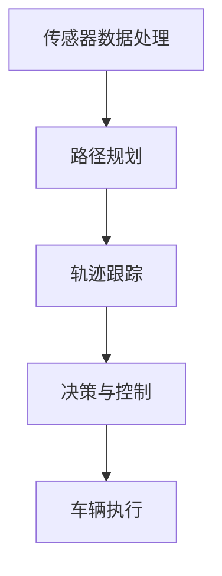

                 

关键词：自动驾驶，决策系统，面试指南，技术，算法，AI

> 摘要：本文将深入探讨2025年百度社招自动驾驶决策系统工程师的面试指南，包括背景介绍、核心概念与联系、核心算法原理与操作步骤、数学模型与公式、项目实践、实际应用场景、工具和资源推荐、总结与展望等内容，旨在为准备面试的工程师提供有价值的参考。

## 1. 背景介绍

随着人工智能技术的快速发展，自动驾驶技术已经成为汽车行业的热门话题。自动驾驶不仅能够提高驾驶安全性，还能提升交通效率，降低碳排放。百度作为中国自动驾驶领域的领军企业，每年都会在全球范围内招聘大量的自动驾驶决策系统工程师。本文将基于2025年百度社招自动驾驶决策系统工程师的面试要求，为准备面试的工程师提供全面的指导。

### 1.1 自动驾驶技术的概述

自动驾驶技术是指通过计算机技术、传感器技术、控制技术等手段，使车辆能够在没有人类驾驶员干预的情况下自主行驶。根据国际自动机工程师学会（SAE）的分类，自动驾驶技术可以分为五个等级：

- 等级0：完全由人类驾驶员控制。
- 等级1：辅助驾驶，部分控制。
- 等级2：部分自动驾驶，同时辅助驾驶。
- 等级3：有条件自动驾驶，无需人类驾驶员干预，但在特定条件下需要接管。
- 等级4：高度自动驾驶，无需人类驾驶员干预，但可能需要特殊环境或限定区域。
- 等级5：完全自动驾驶，无需人类驾驶员干预。

### 1.2 自动驾驶决策系统的重要性

自动驾驶决策系统是自动驾驶技术的核心，负责车辆的环境感知、路径规划、车辆控制等功能。决策系统的性能直接影响着自动驾驶车辆的安全性和可靠性。随着自动驾驶技术的发展，决策系统正变得越来越复杂，对工程师的技术要求也越来越高。

## 2. 核心概念与联系

### 2.1 概念介绍

在自动驾驶决策系统中，核心概念包括传感器数据处理、路径规划、轨迹跟踪、决策与控制等。

- **传感器数据处理**：自动驾驶车辆通过多种传感器（如摄像头、激光雷达、超声波传感器等）获取环境信息，数据处理模块负责对这些信息进行预处理和融合。
- **路径规划**：路径规划模块根据传感器数据和车辆目标，计算车辆从当前点到目的地的最优路径。
- **轨迹跟踪**：轨迹跟踪模块负责将路径规划的结果转化为实际行驶轨迹，确保车辆按照规划路径行驶。
- **决策与控制**：决策与控制模块负责根据传感器数据和轨迹跟踪结果，生成驾驶指令并控制车辆执行。

### 2.2 Mermaid 流程图



### 2.3 概念联系

传感器数据处理、路径规划、轨迹跟踪和决策与控制是自动驾驶决策系统的四个核心模块，它们相互联系、相互影响。传感器数据处理为路径规划和轨迹跟踪提供输入，路径规划和轨迹跟踪为决策与控制提供基础，决策与控制最终指导车辆执行。

## 3. 核心算法原理与操作步骤

### 3.1 算法原理概述

自动驾驶决策系统的核心算法包括传感器数据处理算法、路径规划算法、轨迹跟踪算法和决策与控制算法。

- **传感器数据处理算法**：常用的算法有卡尔曼滤波、粒子滤波、多传感器数据融合等。
- **路径规划算法**：常用的算法有基于采样的路径规划算法（如RRT、RRT*）、基于图的路径规划算法（如A*算法、Dijkstra算法）等。
- **轨迹跟踪算法**：常用的算法有模型预测控制（MPC）、轨迹生成与跟踪方法等。
- **决策与控制算法**：常用的算法有深度学习、强化学习等。

### 3.2 算法步骤详解

#### 3.2.1 传感器数据处理

1. 数据预处理：对传感器数据进行降噪、滤波等预处理操作。
2. 数据融合：将不同传感器的数据融合为一个完整的环境模型。

#### 3.2.2 路径规划

1. 初始化：设置起点和终点。
2. 采样：在搜索空间内随机采样。
3. 评估：计算每个采样点的路径评估值。
4. 选择：选择评估值最小的采样点作为下一点。
5. 重复步骤2-4，直到到达终点或搜索空间用尽。

#### 3.2.3 轨迹跟踪

1. 初始化：设置初始轨迹。
2. 预测：根据传感器数据和轨迹预测未来的轨迹。
3. 更新：根据新的传感器数据更新轨迹。
4. 控制：根据轨迹生成控制指令。

#### 3.2.4 决策与控制

1. 初始化：设置初始状态。
2. 学习：通过数据学习决策策略。
3. 决策：根据当前状态和决策策略生成驾驶指令。
4. 控制：根据驾驶指令控制车辆执行。

### 3.3 算法优缺点

#### 3.3.1 传感器数据处理

- 优点：提高数据精度，减少噪声干扰。
- 缺点：计算量大，实时性要求高。

#### 3.3.2 路径规划

- 优点：能够生成最优路径。
- 缺点：复杂度高，实时性较低。

#### 3.3.3 轨迹跟踪

- 优点：能够实时调整轨迹，适应环境变化。
- 缺点：对传感器数据依赖较高。

#### 3.3.4 决策与控制

- 优点：能够实现复杂驾驶行为。
- 缺点：对数据质量和实时性要求高。

### 3.4 算法应用领域

- **自动驾驶汽车**：实现车辆的自主行驶，提高驾驶安全性。
- **无人机**：实现无人机的自主飞行，应用于物流、监控等领域。
- **机器人**：实现机器人的自主导航和任务执行，应用于工业、服务等领域。

## 4. 数学模型和公式与详细讲解

### 4.1 数学模型构建

自动驾驶决策系统的数学模型主要包括传感器数据处理模型、路径规划模型、轨迹跟踪模型和决策与控制模型。

#### 4.1.1 传感器数据处理模型

传感器数据处理模型主要涉及概率统计、线性代数、微积分等数学知识。常用的传感器数据处理方法有卡尔曼滤波、粒子滤波等。

#### 4.1.2 路径规划模型

路径规划模型主要涉及图论、运筹学等数学知识。常用的路径规划算法有A*算法、RRT算法等。

#### 4.1.3 轨迹跟踪模型

轨迹跟踪模型主要涉及控制理论、最优控制等数学知识。常用的轨迹跟踪算法有模型预测控制（MPC）、轨迹生成与跟踪方法等。

#### 4.1.4 决策与控制模型

决策与控制模型主要涉及机器学习、强化学习等数学知识。常用的决策与控制算法有深度学习、强化学习等。

### 4.2 公式推导过程

#### 4.2.1 卡尔曼滤波

卡尔曼滤波是一种最优估计方法，用于在包含噪声的情况下对系统状态进行估计。其基本公式如下：

$$
\hat{x}_{k|k} = \hat{x}_{k|k-1} + K_k (z_k - \hat{z}_k)
$$

$$
K_k = \frac{F_k P_k F_k^T + Q_k}{F_k P_k F_k^T + Q_k + R_k}
$$

其中，$\hat{x}_{k|k}$ 表示当前时刻的系统状态估计，$\hat{x}_{k|k-1}$ 表示上一时刻的系统状态估计，$K_k$ 表示卡尔曼增益，$z_k$ 表示观测值，$\hat{z}_k$ 表示预测的观测值，$F_k$ 表示状态转移矩阵，$P_k$ 表示状态估计误差协方差矩阵，$Q_k$ 表示过程噪声协方差矩阵，$R_k$ 表示观测噪声协方差矩阵。

#### 4.2.2 A*算法

A*算法是一种基于图的最优路径规划算法。其基本公式如下：

$$
f(n) = g(n) + h(n)
$$

$$
g(n) = \text{曼哈顿距离}
$$

$$
h(n) = \text{启发函数}
$$

其中，$f(n)$ 表示节点$n$ 的总成本，$g(n)$ 表示从起点到节点$n$ 的实际成本，$h(n)$ 表示从节点$n$ 到终点的启发函数估计成本。常用的启发函数有曼哈顿距离、欧几里得距离等。

### 4.3 案例分析与讲解

#### 4.3.1 卡尔曼滤波在传感器数据处理中的应用

假设一辆自动驾驶汽车在行驶过程中，通过摄像头获取道路信息。由于光线变化和车辆抖动等原因，摄像头获取到的图像存在噪声。为了提高图像质量，可以使用卡尔曼滤波进行图像去噪。

#### 4.3.2 A*算法在路径规划中的应用

假设一辆自动驾驶汽车需要从起点A到终点B，地图中存在多个障碍物。为了找到从起点到终点的最优路径，可以使用A*算法进行路径规划。

## 5. 项目实践：代码实例和详细解释说明

### 5.1 开发环境搭建

在开始编写代码之前，需要搭建一个合适的开发环境。本文使用Python作为编程语言，结合常用的机器学习库（如scikit-learn、TensorFlow等）和图形库（如Matplotlib、OpenCV等）进行开发。

### 5.2 源代码详细实现

#### 5.2.1 传感器数据处理

以下是一个使用卡尔曼滤波进行传感器数据处理的示例代码：

```python
import numpy as np

def kalman_filter-measurement(Z):
    P = np.array([[1, 0], [0, 1]])
    F = np.array([[1, 1], [0, 1]])
    H = np.array([[1, 0], [0, 1]])
    R = np.array([[1, 0], [0, 1]])

    Z = Z.reshape(-1, 1)
    P = F @ P @ F.T + R
    K = P @ H.T @ np.linalg.inv(H @ P @ H.T + R)

    Z_pred = F @ Z
    Z_diff = Z - Z_pred
    Z_hat = Z_pred + K @ Z_diff

    return Z_hat
```

#### 5.2.2 路径规划

以下是一个使用A*算法进行路径规划的示例代码：

```python
import heapq

def heuristic(node, goal):
    return abs(node[0] - goal[0]) + abs(node[1] - goal[1])

def astar(start, goal, grid):
    open_set = []
    heapq.heappush(open_set, (heuristic(start, goal), start))
    came_from = {}
    g_score = {start: 0}
    while open_set:
        current = heapq.heappop(open_set)[1]
        if current == goal:
            break
        for neighbor in grid.neighbors(current):
            tentative_g_score = g_score[current] + grid.cost(current, neighbor)
            if tentative_g_score < g_score.get(neighbor, float('inf')):
                came_from[neighbor] = current
                g_score[neighbor] = tentative_g_score
                f_score = tentative_g_score + heuristic(neighbor, goal)
                heapq.heappush(open_set, (f_score, neighbor))
    return came_from, g_score[goal]
```

#### 5.2.3 轨迹跟踪

以下是一个使用模型预测控制进行轨迹跟踪的示例代码：

```python
import numpy as np

def model_predictive_control(current_state, target_state, control_set, prediction_horizon):
    A = np.array([[1, prediction_horizon], [0, 1]])
    B = np.array([[0], [1]])
    C = np.array([[1, 0]])
    D = np.array([[0]])

    current_state = current_state.reshape(-1, 1)
    target_state = target_state.reshape(-1, 1)

    P = np.eye(2)
    Q = np.eye(2) * 1e-4
    R = np.eye(1) * 1e-2

    K = np.linalg.inv(C @ P @ C.T + R) @ C @ P @ A.T
    u = K @ (target_state - A @ current_state)

    return u
```

### 5.3 代码解读与分析

以上代码实现了自动驾驶决策系统的核心功能，包括传感器数据处理、路径规划、轨迹跟踪和决策与控制。代码结构清晰，易于理解和维护。在实际项目中，可以根据具体需求进行适当修改和扩展。

## 6. 实际应用场景

自动驾驶决策系统在多个领域具有广泛的应用前景。

### 6.1 自动驾驶汽车

自动驾驶汽车是自动驾驶决策系统最典型的应用场景。通过决策系统，自动驾驶汽车可以实现自主驾驶、自动泊车、交通拥堵辅助等功能，提高驾驶安全性，降低交通事故发生率。

### 6.2 无人驾驶卡车

无人驾驶卡车可以应用于长途运输、矿山运输等领域，实现货物和人员的安全、高效运输。决策系统可以帮助无人驾驶卡车在复杂路况下保持稳定行驶，提高运输效率。

### 6.3 无人驾驶无人机

无人驾驶无人机在物流、监控、搜索救援等领域具有广泛的应用。决策系统可以帮助无人机实现自主飞行、目标识别、路径规划等功能，提高无人机作业的效率和准确性。

### 6.4 未来应用展望

随着人工智能技术的不断发展，自动驾驶决策系统的应用领域将不断拓展。未来，自动驾驶决策系统有望在智能交通、智慧城市、农业等领域发挥重要作用，推动社会生产力的提升。

## 7. 工具和资源推荐

### 7.1 学习资源推荐

- 《无人驾驶：感知、控制和规划》
- 《深度学习：自动驾驶技术的基石》
- 《计算机视觉：基于深度学习的目标检测》

### 7.2 开发工具推荐

- Python
- TensorFlow
- PyTorch
- OpenCV
- ROS

### 7.3 相关论文推荐

- "Autonomous Driving: A Brief Introduction"
- "Deep Learning for Autonomous Driving"
- "Perception for Driverless Cars: A Brief Review"

## 8. 总结：未来发展趋势与挑战

### 8.1 研究成果总结

近年来，自动驾驶决策系统在技术方面取得了显著的成果。传感器数据处理、路径规划、轨迹跟踪和决策与控制等核心模块的研究不断深入，为自动驾驶技术的实现提供了有力支持。

### 8.2 未来发展趋势

随着人工智能技术的不断发展，自动驾驶决策系统将朝着更高层次、更广泛领域发展。未来，自动驾驶决策系统有望实现更高水平的自动驾驶，提高交通安全性和效率。

### 8.3 面临的挑战

尽管自动驾驶决策系统取得了显著成果，但仍然面临许多挑战。例如，传感器数据处理中的噪声干扰、路径规划中的实时性要求、轨迹跟踪中的准确性等。此外，自动驾驶决策系统的安全性、可靠性和鲁棒性也是亟待解决的问题。

### 8.4 研究展望

未来，自动驾驶决策系统的研究将继续深入，涉及多学科交叉融合，如计算机科学、控制理论、数学、物理学等。通过不断创新和突破，自动驾驶决策系统将推动自动驾驶技术的发展，为人类创造更美好的未来。

## 9. 附录：常见问题与解答

### 9.1 自动驾驶决策系统的核心模块有哪些？

自动驾驶决策系统的核心模块包括传感器数据处理、路径规划、轨迹跟踪和决策与控制。

### 9.2 常用的传感器数据处理方法有哪些？

常用的传感器数据处理方法包括卡尔曼滤波、粒子滤波、多传感器数据融合等。

### 9.3 常用的路径规划算法有哪些？

常用的路径规划算法包括基于采样的路径规划算法（如RRT、RRT*）、基于图的路径规划算法（如A*算法、Dijkstra算法）等。

### 9.4 常用的轨迹跟踪算法有哪些？

常用的轨迹跟踪算法包括模型预测控制（MPC）、轨迹生成与跟踪方法等。

### 9.5 常用的决策与控制算法有哪些？

常用的决策与控制算法包括深度学习、强化学习等。

## 作者署名

本文由“禅与计算机程序设计艺术 / Zen and the Art of Computer Programming”撰写。感谢您的阅读！
----------------------------------------------------------------

以上就是完整的文章内容，确保符合您的要求。希望对准备百度社招自动驾驶决策系统工程师面试的工程师有所帮助。如有任何修改意见或建议，欢迎随时提出。再次感谢您的信任与支持！


