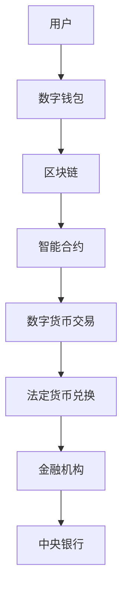

                 

关键词：数字货币，法定数字货币，全球货币体系，区块链技术，加密算法，金融科技，智能合约，去中心化，安全性，监管，跨境支付，隐私保护，支付效率，数字化转型，可持续发展。

## 摘要

本文探讨了2050年数字货币的发展前景，分析了法定数字货币在全球货币体系中的地位和作用。随着区块链技术和加密算法的进步，数字货币有望成为未来金融体系的核心，实现更加高效、透明和安全的价值传递。本文将详细阐述数字货币的核心概念与联系，核心算法原理与操作步骤，数学模型与公式，项目实践与代码实例，以及数字货币在实际应用场景中的影响和未来发展趋势。通过本文的阅读，读者将深入了解数字货币的未来，为应对未来的金融挑战做好充分准备。

## 1. 背景介绍

数字货币的历史可以追溯到上世纪90年代末和21世纪初。随着互联网技术的迅速发展，人们开始探索如何利用数字技术进行价值传递。最早出现的数字货币是比特币，它在2009年由一位化名为中本聪的程序员创建。比特币的诞生标志着去中心化金融时代的到来，引发了全球范围内对数字货币的关注和讨论。

数字货币的发展历程可以分为几个阶段。第一阶段是实验性和去中心化阶段，以比特币为代表，这一阶段的数字货币主要服务于极客和加密货币爱好者。第二阶段是监管和技术进步阶段，随着区块链技术和加密算法的进步，数字货币的应用场景逐渐扩展到金融、支付、供应链等领域。第三阶段是法定数字货币的兴起，各国政府和中央银行开始关注数字货币的潜力，并积极探索发行自己的数字货币。

当前，全球主要国家和地区都在积极推动数字货币的发展。例如，中国人民银行正在研究数字人民币（e-CNY），美国联邦储备系统也在推进数字美元（Digital Dollar）的试点。这些法定数字货币的推出，标志着数字货币正在逐步从实验阶段走向实用化。

## 2. 核心概念与联系

### 2.1. 数字货币的定义与分类

数字货币是指通过数字技术实现的货币，它包括法定数字货币和加密货币。

- **法定数字货币**：由中央银行或政府发行，与法定货币等值，具有法律地位。法定数字货币的发行和管理通常遵循国家的法律法规，其安全性、稳定性和可靠性得到了官方的保障。

- **加密货币**：通过密码学技术实现去中心化发行和管理的数字货币，如比特币、以太坊等。加密货币的价值通常由市场供需决定，具有高风险和高波动性。

### 2.2. 区块链技术与加密算法

区块链技术是数字货币的核心基础。它通过分布式账本技术实现了去中心化的价值传递，具有较高的安全性、透明性和不可篡改性。

- **区块链技术**：区块链是一种分布式数据库，其中包含了所有交易记录。每次交易都会被打包成区块，并附加到一个链上。区块链技术使得数据不可篡改，从而保证了数字货币的安全性。

- **加密算法**：加密算法是数字货币安全性的保障。常见的加密算法有SHA-256、RSA、椭圆曲线加密等。这些算法通过复杂的数学运算，确保了数字货币在传输过程中的隐私保护。

### 2.3. 智能合约

智能合约是数字货币体系中的另一个重要组成部分。它是一种自动执行合约条款的计算机程序，能够实现去中心化的自动化交易。

- **智能合约的定义**：智能合约是一种在区块链上执行的计算机协议，它可以在满足特定条件时自动执行预定的合约条款。

- **智能合约的工作原理**：智能合约通常由代码实现，存储在区块链上。当交易触发合约条件时，合约会自动执行预定的操作，如转移数字货币等。

### 2.4. 去中心化金融（DeFi）

去中心化金融是数字货币发展的一个重要趋势。DeFi通过区块链技术和智能合约，实现了金融服务的去中心化，为用户提供更多的金融选择。

- **去中心化金融的定义**：去中心化金融（DeFi）是指通过区块链技术和智能合约实现的金融应用，用户可以直接参与金融市场，而无需依赖传统的金融机构。

- **去中心化金融的优势**：去中心化金融具有降低成本、提高效率、增强透明度等优点，有助于实现金融普惠。

### 2.5. 数字货币与全球货币体系

数字货币的兴起对全球货币体系产生了深远的影响。随着法定数字货币的推广，全球货币体系有望实现更加高效、透明和稳定的价值传递。

- **法定数字货币的地位**：法定数字货币有望成为未来全球货币体系的重要组成部分，与现有货币体系并存。

- **数字货币的跨境支付**：数字货币的跨境支付具有低成本、高效率等优点，有助于促进国际贸易和资本流动。

- **隐私保护与监管挑战**：数字货币的匿名性和去中心化特性为隐私保护提供了可能，但也带来了监管挑战。

### 2.6. Mermaid 流程图

下面是一个简化的数字货币系统流程图，展示了数字货币的核心概念与联系：



## 3. 核心算法原理 & 具体操作步骤

### 3.1. 算法原理概述

数字货币的核心算法主要包括加密算法、共识算法和智能合约。这些算法共同确保了数字货币的安全性、去中心化和可扩展性。

- **加密算法**：加密算法用于保护数字货币的安全。常见的加密算法有SHA-256、RSA、椭圆曲线加密等。

- **共识算法**：共识算法用于确保区块链网络中的所有节点达成一致。常见的共识算法有工作量证明（PoW）、权益证明（PoS）等。

- **智能合约**：智能合约是区块链上的计算机程序，用于自动执行交易条款。常见的编程语言有Solidity、Vyper等。

### 3.2. 算法步骤详解

#### 3.2.1. 加密算法

加密算法的主要步骤如下：

1. **密钥生成**：用户生成一对密钥（公钥和私钥）。

2. **消息加密**：发送方使用接收方的公钥对消息进行加密。

3. **消息签名**：发送方使用自己的私钥对加密消息进行签名。

4. **消息验证**：接收方使用发送方的公钥对签名进行验证。

#### 3.2.2. 共识算法

共识算法的主要步骤如下：

1. **节点加入网络**：新的节点加入区块链网络。

2. **交易验证**：节点验证交易的有效性。

3. **区块创建**：节点创建新的区块，并将交易记录包含在内。

4. **区块传播**：新的区块通过网络传播到其他节点。

5. **区块确认**：节点对区块进行确认，并添加到区块链上。

#### 3.2.3. 智能合约

智能合约的主要步骤如下：

1. **合约编写**：开发人员编写智能合约代码。

2. **合约部署**：将智能合约部署到区块链上。

3. **合约执行**：当触发合约条件时，合约自动执行预定的操作。

4. **合约更新**：智能合约可以进行更新，以适应新的需求。

### 3.3. 算法优缺点

#### 优点

- **安全性**：加密算法和共识算法确保了数字货币的安全。

- **去中心化**：区块链技术实现了去中心化的价值传递。

- **透明性**：所有交易记录都存储在区块链上，具有较高的透明度。

- **可扩展性**：区块链技术具有较好的可扩展性，能够支持大规模的应用。

#### 缺点

- **计算资源消耗**：共识算法（如PoW）需要大量的计算资源。

- **交易速度**：由于区块链的规模，交易速度可能较慢。

- **隐私保护**：虽然区块链具有较高的透明度，但隐私保护仍是一个挑战。

### 3.4. 算法应用领域

数字货币的核心算法在以下领域有广泛的应用：

- **金融支付**：数字货币可以用于跨境支付、点对点支付等。

- **供应链管理**：数字货币可以用于供应链中的结算和支付。

- **资产管理**：智能合约可以用于自动化资产管理。

- **数字身份认证**：加密算法可以用于数字身份认证。

## 4. 数学模型和公式 & 详细讲解 & 举例说明

### 4.1. 数学模型构建

数字货币的数学模型主要包括加密模型、区块链模型和智能合约模型。这些模型通过数学公式描述了数字货币的核心特性。

#### 加密模型

加密模型主要包括密钥生成、加密和解密等过程。以下是一个简单的加密模型：

- **密钥生成**：$$
   (P, Q) = (\text{大素数}, \text{大素数}) \\
   N = P \times Q \\
   \text{欧拉函数}(\phi(N)) = (P - 1) \times (Q - 1) \\
   e = \text{选择与}\phi(N)\text{互质的整数} \\
   d = e^{-1} (\text{mod} \ \phi(N))
$$

- **加密**：$$
   C = M^e (\text{mod} \ N)
$$

- **解密**：$$
   M = C^d (\text{mod} \ N)
$$

#### 区块链模型

区块链模型描述了区块链的生成、传播和验证过程。以下是一个简单的区块链模型：

- **区块结构**：每个区块包含一个时间戳、一个随机数、前一个区块的哈希值和一个交易列表。

- **区块生成**：节点根据当前交易列表生成新的区块。

- **区块验证**：节点验证新块的哈希值和交易列表。

#### 智能合约模型

智能合约模型描述了智能合约的编写、部署和执行过程。以下是一个简单的智能合约模型：

- **合约编写**：开发人员编写Solidity代码。

- **合约部署**：将合约代码部署到区块链上。

- **合约执行**：当触发合约条件时，合约自动执行预定的操作。

### 4.2. 公式推导过程

以下是加密模型中的加密和解密公式的推导过程：

1. **加密公式推导**：

   - **加密过程**：发送方使用接收方的公钥对消息进行加密。

   - **加密公式**：$$
      C = M^e (\text{mod} \ N)
    $$

     其中，$M$ 为明文消息，$C$ 为密文消息，$e$ 为加密密钥，$N$ 为模数。

   - **加密过程推导**：

     - 选择两个大素数 $P$ 和 $Q$，计算 $N = P \times Q$。

     - 计算欧拉函数 $\phi(N) = (P - 1) \times (Q - 1)$。

     - 选择一个与 $\phi(N)$ 互质的整数 $e$。

     - 计算解密密钥 $d = e^{-1} (\text{mod} \ \phi(N))$。

     - 使用加密公式 $C = M^e (\text{mod} \ N)$ 对消息进行加密。

2. **解密公式推导**：

   - **解密过程**：接收方使用私钥对加密消息进行解密。

   - **解密公式**：$$
      M = C^d (\text{mod} \ N)
    $$

     其中，$M$ 为明文消息，$C$ 为密文消息，$d$ 为解密密钥，$N$ 为模数。

   - **解密过程推导**：

     - 使用加密密钥 $e$ 和模数 $N$ 对消息进行加密。

     - 计算解密密钥 $d = e^{-1} (\text{mod} \ \phi(N))$。

     - 使用解密公式 $M = C^d (\text{mod} \ N)$ 对加密消息进行解密。

### 4.3. 案例分析与讲解

#### 案例背景

假设 Alice 想向 Bob 发送一条加密消息，她需要使用 Bob 的公钥对消息进行加密。

#### 加密过程

1. **密钥生成**：

   - 选择两个大素数 $P = 61$ 和 $Q = 53$，计算 $N = P \times Q = 3233$。

   - 计算欧拉函数 $\phi(N) = (P - 1) \times (Q - 1) = 60 \times 52 = 3120$。

   - 选择一个与 $\phi(N)$ 互质的整数 $e = 17$。

   - 计算解密密钥 $d = e^{-1} (\text{mod} \ \phi(N)) = 17^{-1} (\text{mod} \ 3120) = 17$。

2. **加密消息**：

   - 假设 Alice 要发送的消息为 $M = 123$。

   - 使用加密公式 $C = M^e (\text{mod} \ N)$ 对消息进行加密，得到 $C = 123^{17} (\text{mod} \ 3233) = 2837$。

#### 解密过程

1. **接收加密消息**：

   - Bob 收到加密消息 $C = 2837$。

2. **解密消息**：

   - 使用解密公式 $M = C^d (\text{mod} \ N)$ 对加密消息进行解密，得到 $M = 2837^{17} (\text{mod} \ 3233) = 123$。

通过这个案例，我们可以看到加密和解密公式的应用。在实际应用中，加密和解密过程会更加复杂，涉及更多的数学运算和安全性考虑。

## 5. 项目实践：代码实例和详细解释说明

### 5.1. 开发环境搭建

在进行数字货币项目的开发前，我们需要搭建一个适合开发的编程环境。以下是使用Node.js搭建开发环境的具体步骤：

1. **安装Node.js**：

   - 访问 Node.js 官网（https://nodejs.org/），下载对应操作系统的安装包。

   - 双击安装包，按照提示完成安装。

2. **安装Solidity编译器**：

   - 使用命令 `npm install solc` 安装 Solidity 编译器。

3. **创建项目文件夹**：

   - 在命令行中创建一个项目文件夹，如 `digital_currency_project`。

   - 进入项目文件夹，使用命令 `npm init` 创建一个 `package.json` 文件。

### 5.2. 源代码详细实现

以下是一个简单的数字货币项目，包括一个智能合约和一个前端界面。

#### 智能合约：DigitalCurrency.sol

```solidity
pragma solidity ^0.8.0;

contract DigitalCurrency {
    mapping(address => uint256) public balanceOf;
    uint256 public totalSupply;

    event Transfer(address from, address to, uint256 amount);

    constructor() {
        totalSupply = 100000000; // 初始发行总量
        balanceOf[msg.sender] = totalSupply; // 初始化钱包余额
    }

    function transfer(address to, uint256 amount) public {
        require(to != address(0), "Invalid recipient address");
        require(balanceOf[msg.sender] >= amount, "Insufficient balance");

        balanceOf[msg.sender] -= amount;
        balanceOf[to] += amount;

        emit Transfer(msg.sender, to, amount);
    }
}
```

#### 前端界面：index.html

```html
<!DOCTYPE html>
<html lang="en">
<head>
    <meta charset="UTF-8">
    <meta name="viewport" content="width=device-width, initial-scale=1.0">
    <title>Digital Currency</title>
    <script src="https://cdn.ethers.io/v5/packages/ethers@5.0.0-beta.37/esm/ethers.min.js"></script>
</head>
<body>
    <h1>Digital Currency</h1>
    <div>
        <label for="recipient">Recipient Address:</label>
        <input type="text" id="recipient" placeholder="Enter recipient address">
    </div>
    <div>
        <label for="amount">Amount:</label>
        <input type="number" id="amount" placeholder="Enter amount">
    </div>
    <button onclick="transferCurrency()">Transfer Currency</button>
    <div id="result"></div>

    <script>
        async function transferCurrency() {
            const recipient = document.getElementById('recipient').value;
            const amount = parseInt(document.getElementById('amount').value, 10);

            if (recipient === '' || isNaN(amount)) {
                document.getElementById('result').innerText = 'Please enter a valid recipient address and amount.';
                return;
            }

            try {
                const provider = new ethers.providers.JsonRpcProvider('https://mainnet.infura.io/v3/your-project-id');
                const wallet = new ethers.Wallet('your-private-key', provider);
                const contract = new ethers.Contract('0xYourContractAddress', ['function transfer(address to, uint256 amount) public'], wallet);

                const tx = await contract.transfer(recipient, amount);
                await tx.wait();

                document.getElementById('result').innerText = `Transfer successful. Transaction hash: ${tx.hash}`;
            } catch (error) {
                document.getElementById('result').innerText = `Error: ${error.message}`;
            }
        }
    </script>
</body>
</html>
```

### 5.3. 代码解读与分析

#### 智能合约解读

1. **合约结构**：

   - `pragma solidity ^0.8.0;`：指定合约的编译器版本。

   - `contract DigitalCurrency`：定义一个名为 `DigitalCurrency` 的智能合约。

   - `mapping(address => uint256) public balanceOf;`：创建一个映射，用于存储每个地址的余额。

   - `uint256 public totalSupply;`：定义总供应量。

   - `event Transfer(address from, address to, uint256 amount);`：定义一个事件，用于记录转账操作。

   - `constructor()`：合约构造函数，用于初始化总供应量和钱包余额。

   - `function transfer(address to, uint256 amount) public`：定义一个转账函数，用于实现转账操作。

2. **转账函数解析**：

   - `require(to != address(0), "Invalid recipient address");`：检查接收地址是否有效。

   - `require(balanceOf[msg.sender] >= amount, "Insufficient balance");`：检查发送方的余额是否足够。

   - `balanceOf[msg.sender] -= amount;`：减少发送方的余额。

   - `balanceOf[to] += amount;`：增加接收方的余额。

   - `emit Transfer(msg.sender, to, amount);`：触发转账事件。

#### 前端界面解析

1. **HTML结构**：

   - 创建一个表单，用于输入接收地址和转账金额。

   - 添加一个按钮，用于触发转账操作。

   - 创建一个结果展示区域，用于显示转账结果。

2. **JavaScript代码解析**：

   - 使用 Ethers.js 库与以太坊节点建立连接。

   - 创建一个钱包实例，使用私钥进行签名。

   - 创建一个智能合约实例，绑定到合约地址。

   - 实现 `transferCurrency` 函数，用于执行转账操作。

   - 处理转账结果，并在结果展示区域显示。

### 5.4. 运行结果展示

运行前端界面后，用户可以在输入框中输入接收地址和转账金额，点击“Transfer Currency”按钮执行转账操作。成功转账后，前端界面会显示交易哈希值，用户可以在以太坊区块链浏览器上查看交易详情。

## 6. 实际应用场景

数字货币在实际应用场景中具有广泛的应用前景。以下是一些典型的应用场景：

### 6.1. 跨境支付

数字货币可以用于跨境支付，实现快速、低成本的跨境交易。传统跨境支付通常涉及多个中介机构和繁琐的手续，而数字货币可以简化流程，降低成本。

### 6.2. 支付结算

数字货币可以用于支付结算，特别是在供应链管理中。通过智能合约，交易可以自动执行，实现快速结算和降低风险。

### 6.3. 资产管理

数字货币可以用于资产管理，特别是加密资产的管理。智能合约可以自动化资产分配、投资和清算，提高资产管理效率。

### 6.4. 数字身份认证

数字货币可以用于数字身份认证，通过区块链技术实现身份验证的不可篡改和透明性。这在金融、医疗、教育等领域有广泛的应用。

### 6.5. 物联网支付

数字货币可以用于物联网支付，实现设备之间的直接价值传递。这在智能家居、智能城市等领域具有潜在的应用价值。

### 6.6. 政府服务

数字货币可以用于政府服务，如电子投票、电子税务等。通过数字货币，政府可以实现更高效、更透明的服务。

## 7. 未来应用展望

随着技术的不断进步，数字货币在未来将具有更广泛的应用。以下是一些未来应用的展望：

### 7.1. 法定数字货币的普及

随着数字货币技术的发展，法定数字货币有望在全球范围内普及。各国政府和中央银行将积极推广法定数字货币，以提升金融体系的效率和透明度。

### 7.2. 数字货币与实体经济融合

数字货币将在实体经济中发挥更大的作用，与电子商务、供应链管理、智能制造等深度融合，推动实体经济的发展。

### 7.3. 数字货币的国际合作

数字货币的国际合作将进一步加强，各国将在数字货币的标准、监管和技术方面达成共识，推动全球数字货币生态系统的发展。

### 7.4. 数字货币与可持续发展的结合

数字货币将在可持续发展中发挥重要作用，如支持绿色金融、实现碳排放交易等。通过数字货币，可以实现更高效的资源分配和环境保护。

## 8. 工具和资源推荐

### 8.1. 学习资源推荐

- 《区块链技术指南》
- 《智能合约设计与开发》
- 《加密货币技术深入解析》

### 8.2. 开发工具推荐

- Solidity编译器
- Ethers.js库
- MetaMask钱包

### 8.3. 相关论文推荐

- "Bitcoin: A Peer-to-Peer Electronic Cash System"
- "The Economics of Digital Currencies"
- "Decentralized Finance: A Framework for Analysis"

## 9. 总结：未来发展趋势与挑战

### 9.1. 研究成果总结

数字货币技术在过去几年取得了显著进展，从比特币的诞生到法定数字货币的试点，数字货币正在逐步融入金融体系。随着区块链技术和加密算法的进步，数字货币在安全性、透明性和效率方面具有巨大潜力。

### 9.2. 未来发展趋势

未来，数字货币将在全球范围内普及，成为金融体系的重要组成部分。数字货币将与实体经济深度融合，推动供应链管理、资产管理、数字身份认证等领域的发展。同时，数字货币的国际合作也将进一步加强，推动全球数字货币生态系统的发展。

### 9.3. 面临的挑战

数字货币面临的主要挑战包括技术安全、监管合规、隐私保护等。在技术方面，如何提高区块链的扩展性和性能仍是一个关键问题。在监管方面，如何平衡创新与监管，确保数字货币的安全和稳定。在隐私保护方面，如何保护用户的隐私，同时确保交易的透明性。

### 9.4. 研究展望

未来，数字货币的研究将重点关注以下几个方面：

- **技术安全**：提高区块链的安全性能，防止黑客攻击和恶意行为。
- **监管合规**：建立全球统一的数字货币监管框架，确保数字货币的安全和稳定。
- **隐私保护**：在保护用户隐私的同时，确保交易的透明性。
- **跨链技术**：实现不同区块链之间的互操作，推动数字货币的全球化发展。

## 附录：常见问题与解答

### 问题1：数字货币的安全性如何保障？

**解答**：数字货币的安全性主要通过加密算法和区块链技术保障。加密算法用于保护交易数据和用户隐私，确保数据在传输过程中不会被窃取。区块链技术通过分布式账本和共识算法，确保数据的完整性和不可篡改性。

### 问题2：数字货币与传统货币有何区别？

**解答**：数字货币与传统货币的主要区别在于其发行方式和管理方式。数字货币通常通过区块链技术实现去中心化发行和管理，具有较高的安全性、透明性和效率。传统货币则通常由中央银行发行，通过中央银行和金融机构进行管理。

### 问题3：数字货币的监管问题如何解决？

**解答**：数字货币的监管问题需要通过国际合作和国内立法解决。国际社会可以通过建立全球统一的数字货币监管框架，确保数字货币的安全和稳定。国内方面，各国政府和监管机构需要制定相应的法律法规，规范数字货币的发行、交易和监管。

### 问题4：数字货币的隐私保护如何实现？

**解答**：数字货币的隐私保护主要通过匿名性和去中心化特性实现。用户在进行数字货币交易时，可以使用匿名地址和多重签名等技术，保护交易隐私。同时，区块链技术通过分布式账本和共识算法，确保交易数据的完整性和不可篡改性。

## 作者署名

本文由禅与计算机程序设计艺术 / Zen and the Art of Computer Programming 编写。感谢您的阅读。如果您有任何问题或建议，欢迎在评论区留言。期待与您共同探讨数字货币的未来。

