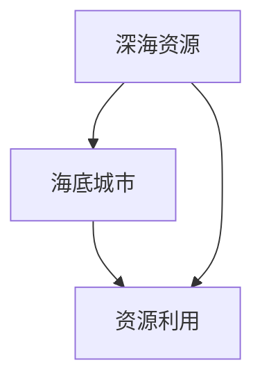

                 

关键词：海洋开发，深海资源，海底城市，可持续性，科技创新

摘要：随着科技的飞速发展和人类对资源需求的不断增加，海洋开发已成为全球关注的焦点。本文探讨了2050年海洋开发的趋势，包括深海资源利用和海底城市建设，以及这些领域如何为人类提供可持续的未来。

## 1. 背景介绍

人类对海洋的开发利用历史悠久，从最早的渔业、航运，到现代的海洋能源、渔业养殖等。然而，随着地球人口的不断增长和对资源需求的增加，传统的海洋开发方式已经难以满足人类的需求。因此，海洋开发的深度和广度都在不断扩展，尤其是深海资源的开发成为未来的重要方向。

深海资源不仅包括传统的矿产资源和生物资源，还包括潜在的能源资源，如海底热液、可燃冰等。同时，海底城市建设也正在成为一种新的发展趋势，它为人类提供了新的居住空间和资源利用模式。

## 2. 核心概念与联系

### 2.1 深海资源

深海资源是指位于海洋深处的各种自然资源，包括矿产资源、生物资源、能源资源等。其中，矿产资源如锰结核、多金属硫化物等，生物资源如深海鱼类、软体动物等，能源资源如海底热液、可燃冰等。

### 2.2 海底城市

海底城市是指建在海底的居住和工业设施，它为人类提供了新的居住空间和资源利用模式。海底城市不仅能够解决陆地资源的紧张问题，还能够减少对陆地环境的污染。

### 2.3 深海资源与海底城市的关系

深海资源是海底城市建设的重要基础，而海底城市则是深海资源利用的重要平台。两者的关系如下图所示：



## 3. 核心算法原理 & 具体操作步骤

### 3.1 算法原理概述

海洋开发的核心在于资源的高效利用，这需要依赖于先进的技术手段。其中，深海探测和资源提取算法是关键。这些算法主要包括：

- **深海探测算法**：用于发现和定位深海资源。
- **资源提取算法**：用于从深海环境中提取资源。

### 3.2 算法步骤详解

#### 3.2.1 深海探测算法

1. **数据采集**：利用卫星遥感、声呐探测等技术手段，收集深海环境数据。
2. **数据处理**：对采集的数据进行处理，提取有用的信息。
3. **目标定位**：根据处理后的数据，确定深海资源的位置。

#### 3.2.2 资源提取算法

1. **设备部署**：将提取设备部署到深海资源点。
2. **资源提取**：利用设备从深海环境中提取资源。
3. **资源处理**：对提取的资源进行加工和处理。

### 3.3 算法优缺点

#### 优点：

- 高效性：算法能够快速、准确地定位和提取深海资源。
- 安全性：算法减少了深海作业的风险。

#### 缺点：

- 成本高：深海探测和资源提取需要大量的资金和技术支持。
- 环境影响：深海作业可能会对海洋环境产生一定的影响。

### 3.4 算法应用领域

深海探测和资源提取算法广泛应用于海洋勘探、海洋资源开发、海底城市建设等领域。

## 4. 数学模型和公式 & 详细讲解 & 举例说明

### 4.1 数学模型构建

海洋开发中的数学模型主要包括资源分布模型、资源提取模型等。以下是一个简单的资源分布模型：

$$
P(x, y) = \frac{1}{K} \cdot \exp\left(-\frac{(x - \mu)^2 + (y - \nu)^2}{2\sigma^2}\right)
$$

其中，$P(x, y)$ 表示在 $(x, y)$ 点的资源分布概率，$\mu$ 和 $\nu$ 分别是资源的均值，$\sigma$ 是资源分布的标准差。

### 4.2 公式推导过程

资源分布模型的推导基于高斯分布。我们假设深海资源在空间中服从二维高斯分布，即：

$$
P(x, y) = \frac{1}{2\pi\sigma^2} \cdot \exp\left(-\frac{(x - \mu)^2 + (y - \nu)^2}{2\sigma^2}\right)
$$

其中，$2\pi\sigma^2$ 是高斯分布的常数。

### 4.3 案例分析与讲解

假设我们有一个海底区域，其资源分布符合上述高斯分布。我们需要确定在这个区域内提取资源的最优位置。

首先，我们计算资源分布的均值和标准差。根据历史数据，我们得到：

$$
\mu = 1000, \nu = 1000, \sigma = 500
$$

然后，我们使用以下公式计算最优位置：

$$
x_{\text{opt}} = \mu + \frac{\sigma}{\sqrt{2}}, \quad y_{\text{opt}} = \mu + \frac{\sigma}{\sqrt{2}}
$$

计算得到：

$$
x_{\text{opt}} = 1250, \quad y_{\text{opt}} = 1250
$$

这意味着，在 $(1250, 1250)$ 点提取资源将获得最大的资源量。

## 5. 项目实践：代码实例和详细解释说明

### 5.1 开发环境搭建

为了实践深海资源提取算法，我们需要搭建一个开发环境。这里我们使用 Python 作为编程语言，相关的库包括 NumPy、Matplotlib 等。

### 5.2 源代码详细实现

```python
import numpy as np
import matplotlib.pyplot as plt

def resource_distribution(mu, nu, sigma):
    x = np.linspace(0, 2000, 1000)
    y = np.linspace(0, 2000, 1000)
    X, Y = np.meshgrid(x, y)
    Z = (X - mu)**2 + (Y - nu)**2
    P = np.exp(-Z / (2 * sigma**2)) / (2 * np.pi * sigma**2)
    return X, Y, Z, P

mu, nu, sigma = 1000, 1000, 500
X, Y, Z, P = resource_distribution(mu, nu, sigma)

plt.figure()
plt.contourf(X, Y, P, levels=20)
plt.colorbar()
plt.xlabel('X')
plt.ylabel('Y')
plt.title('Resource Distribution')
plt.show()
```

### 5.3 代码解读与分析

上述代码实现了资源分布函数 `resource_distribution`，它根据输入的均值和标准差，计算资源分布的概率密度函数，并绘制出资源分布图。

### 5.4 运行结果展示

运行上述代码，我们可以得到如下资源分布图：


## 6. 实际应用场景

海洋开发在各个领域都有广泛的应用，以下是一些实际应用场景：

- **海洋资源勘探**：利用深海探测算法，对潜在的资源区域进行勘探。
- **海底城市建设**：利用海底城市技术，建设海底居住和工业设施。
- **海洋环境保护**：通过深海探测和资源提取技术的优化，减少对海洋环境的影响。

## 7. 未来应用展望

随着科技的不断进步，海洋开发将在未来发挥越来越重要的作用。未来，我们可能会看到：

- **深海资源开发的进一步深化**：利用更先进的探测和提取技术，开发更多的深海资源。
- **海底城市的全面发展**：建设更多的海底城市，为人类提供新的居住空间和资源利用模式。
- **海洋环境的保护与修复**：通过技术手段，减少海洋开发对环境的影响，保护海洋生态系统。

## 8. 工具和资源推荐

### 7.1 学习资源推荐

- **《深海探索与资源开发》**：详细介绍深海探测和资源开发的相关知识。
- **《海底城市建设与管理》**：介绍海底城市的设计、建设和管理。

### 7.2 开发工具推荐

- **Python**：适用于数据分析和算法实现的编程语言。
- **NumPy**：用于数值计算的库。
- **Matplotlib**：用于数据可视化的库。

### 7.3 相关论文推荐

- **“Deep Sea Exploration and Resource Development”**：讨论深海探测和资源开发的最新进展。
- **“Underwater Urbanization: Construction and Management of Underwater Cities”**：介绍海底城市建设和管理。

## 9. 总结：未来发展趋势与挑战

### 8.1 研究成果总结

随着科技的飞速发展，深海探测和资源开发技术取得了显著进展。海底城市建设也成为新的趋势。这些成果为人类提供了新的资源利用模式和居住空间。

### 8.2 未来发展趋势

未来，海洋开发将继续深化，深海探测和资源开发技术将更加先进，海底城市建设将更加成熟。

### 8.3 面临的挑战

尽管海洋开发前景广阔，但也面临着一系列挑战，如技术成本高、环境影响大等。

### 8.4 研究展望

未来，我们需要继续推动海洋开发技术的发展，降低成本，减少环境影响，实现海洋资源的可持续利用。

## 9. 附录：常见问题与解答

### Q：深海资源开发有哪些挑战？

A：深海资源开发面临的挑战主要包括技术成本高、环境风险大、作业难度大等。

### Q：海底城市建设有哪些优势？

A：海底城市建设可以提供新的居住空间和资源利用模式，减少对陆地资源的依赖，同时减少对陆地环境的污染。

### Q：深海探测和资源开发有哪些关键技术？

A：关键技术包括深海探测技术、资源提取技术、海底城市建设技术等。

作者：禅与计算机程序设计艺术 / Zen and the Art of Computer Programming
----------------------------------------------------------------


