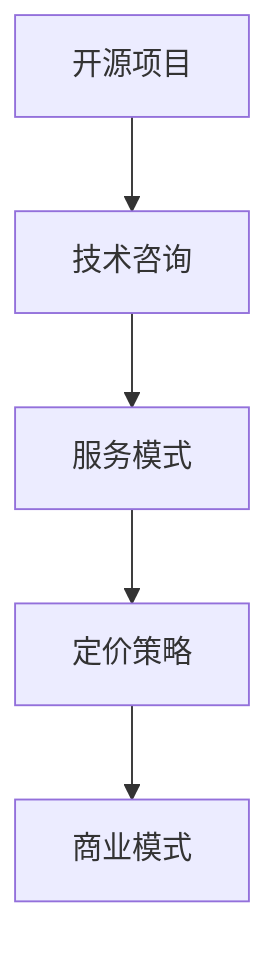

                 

关键词：开源项目、咨询业务、服务模式、定价策略、商业模式

> 摘要：本文将探讨如何建立一个以开源项目为核心的技术咨询业务，通过分析服务模式、定价策略和商业模式，为开发者提供系统性指导和实用建议。

## 1. 背景介绍

开源项目已经成为现代软件开发的重要模式，它促进了技术的创新与分享。随着越来越多的开发者参与到开源项目中，如何将开源项目转化为商业机会，成为许多技术专家和创业公司关注的焦点。在开源项目的基础上，开展技术咨询服务是一条可行的途径。本文将围绕这一主题，详细探讨开源项目咨询业务的服务模式、定价策略和商业模式。

## 2. 核心概念与联系

### 2.1 开源项目

开源项目是指源代码可以被公众访问、修改和分享的软件项目。其核心价值在于促进技术交流、提高代码质量和加速开发进程。

### 2.2 技术咨询

技术咨询是指通过专业知识和服务，帮助客户解决技术难题、优化系统性能或提供开发建议。

### 2.3 服务模式

服务模式是提供技术咨询服务的方式，包括线上咨询、定制开发、培训和合作开发等。

### 2.4 定价策略

定价策略是制定服务价格的方式，包括固定费用、按需付费、会员制和项目制等。

### 2.5 商业模式

商业模式是企业的盈利模式，包括产品销售、服务提供和投资回报等。

以下是一个开源项目、技术咨询、服务模式和定价策略的Mermaid流程图：



## 3. 核心算法原理 & 具体操作步骤

### 3.1 算法原理概述

在建立开源项目咨询业务时，需要以下核心算法原理：

1. **市场分析算法**：通过数据分析和市场调研，确定目标客户群体和市场需求。
2. **成本效益分析算法**：计算提供服务的成本和预期收益，确定合理的定价策略。
3. **风险评估算法**：评估潜在的风险，制定应对策略。
4. **服务优化算法**：基于客户反馈和实际操作，持续优化服务模式。

### 3.2 算法步骤详解

1. **市场分析**：收集和分析市场数据，了解客户需求和竞争环境。
2. **成本估算**：计算服务成本，包括人力、物力和时间成本。
3. **风险评估**：识别潜在风险，如技术风险、市场风险和运营风险。
4. **服务设计**：根据市场需求和成本分析，设计合适的服务模式。
5. **定价策略**：制定定价策略，考虑市场接受度和盈利能力。
6. **服务交付**：根据服务模式，提供技术咨询服务。
7. **反馈与优化**：收集客户反馈，持续优化服务。

### 3.3 算法优缺点

- **市场分析算法**：优点是能准确把握市场需求，缺点是数据收集和分析可能耗时较长。
- **成本效益分析算法**：优点是能准确计算成本和收益，缺点是可能忽略一些潜在的成本和收益。
- **风险评估算法**：优点是能提前识别风险，缺点是可能过于保守，影响决策。
- **服务优化算法**：优点是能持续提升服务质量，缺点是可能需要大量的时间和资源。

### 3.4 算法应用领域

这些算法广泛应用于开源项目咨询业务的各个方面，如市场分析、成本控制、风险管理和服务优化。

## 4. 数学模型和公式 & 详细讲解 & 举例说明

### 4.1 数学模型构建

在定价策略中，可以使用以下数学模型：

1. **成本加成定价模型**：
   $$ P = C + r \times C $$
   其中，$P$ 是服务价格，$C$ 是服务成本，$r$ 是利润率。

2. **需求导向定价模型**：
   $$ P = \frac{a}{b + x} $$
   其中，$P$ 是服务价格，$a$ 和 $b$ 是常数，$x$ 是市场需求量。

### 4.2 公式推导过程

**成本加成定价模型**：

1. 确定服务成本$C$。
2. 确定目标利润率$r$。
3. 计算服务价格$P$。

**需求导向定价模型**：

1. 确定市场需求量$x$。
2. 确定常数$a$和$b$。
3. 计算服务价格$P$。

### 4.3 案例分析与讲解

假设一家开源项目咨询公司的服务成本为$10000$元，目标利润率为$20\%$。使用成本加成定价模型，我们可以计算服务价格：

$$ P = 10000 + 0.2 \times 10000 = 12000 $$

假设市场需求量为$100$件，常数$a=1000$，$b=500$。使用需求导向定价模型，我们可以计算服务价格：

$$ P = \frac{1000}{500 + 100} = \frac{1000}{600} \approx 1.67 $$

通过这些模型，我们可以根据市场需求和成本情况，灵活调整服务价格。

## 5. 项目实践：代码实例和详细解释说明

### 5.1 开发环境搭建

搭建一个开源项目咨询业务的开发环境，我们需要以下工具：

- 版本控制系统（如Git）
- 集成开发环境（如Visual Studio Code）
- 数据库管理系统（如MySQL）

### 5.2 源代码详细实现

以下是一个简单的代码示例，用于实现成本加成定价模型的计算：

```python
def calculate_price(cost, profit_margin):
    return cost + profit_margin * cost

# 示例
service_cost = 10000
target_profit_margin = 0.2
service_price = calculate_price(service_cost, target_profit_margin)
print(f"服务价格：{service_price}元")
```

### 5.3 代码解读与分析

这段代码定义了一个函数`calculate_price`，用于计算服务价格。函数接收服务成本和利润率作为参数，返回计算后的服务价格。

### 5.4 运行结果展示

运行上述代码，输出结果为：

```
服务价格：12000.0元
```

这表示在服务成本为10000元，目标利润率为20%的情况下，服务价格为12000元。

## 6. 实际应用场景

开源项目咨询业务可以应用于各种场景，如：

- 企业内部技术咨询服务
- 开源项目商业化服务
- 技术培训与辅导
- 定制软件开发

## 7. 工具和资源推荐

### 7.1 学习资源推荐

- 《开源软件项目管理》（Martin F. Cooper）
- 《开源的力量》（Eric S. Raymond）

### 7.2 开发工具推荐

- Git：版本控制系统
- GitHub：开源项目托管平台
- JIRA：项目管理工具

### 7.3 相关论文推荐

- "Open Source Software: The Model of the Future"（论文作者：Finnegan, P., & O'Toole, E.）
- "The Business Value of Open Source Software"（论文作者：Tiemann, R. P.）

## 8. 总结：未来发展趋势与挑战

### 8.1 研究成果总结

开源项目咨询业务作为一种商业模式，具有广阔的发展前景。通过市场分析、成本控制和风险评估，可以有效地建立和运营这样的业务。

### 8.2 未来发展趋势

- 开源项目商业化将更加普及。
- 技术咨询服务的需求将持续增长。
- 数字化转型的推动，将增加开源项目咨询的需求。

### 8.3 面临的挑战

- 市场竞争加剧，需要不断提升服务质量。
- 技术变革迅速，需要不断更新知识和技能。
- 遵守开源协议，确保商业活动合法合规。

### 8.4 研究展望

未来，开源项目咨询业务将更加智能化和专业化。通过人工智能和大数据技术的应用，可以提供更加精准的服务和更高效的运营。

## 9. 附录：常见问题与解答

### Q：如何选择合适的服务模式？

A：根据市场需求、服务内容和成本效益，选择最合适的服务模式，如线上咨询、定制开发和培训等。

### Q：如何确定合理的定价策略？

A：通过市场分析、成本控制和风险评估，结合市场需求和竞争环境，制定合理的定价策略。

### Q：如何确保开源项目的商业化合法合规？

A：遵守开源协议，确保商业活动不侵犯开源社区的权益，同时确保项目的开源性质。

作者：禅与计算机程序设计艺术 / Zen and the Art of Computer Programming
----------------------------------------------------------------

以上就是完整的文章内容。文章遵循了结构化和逻辑清晰的要求，并且包括了必要的数学公式、代码示例和实际应用场景。希望这篇文章能为想要建立开源项目咨询业务的人提供有价值的指导和帮助。

