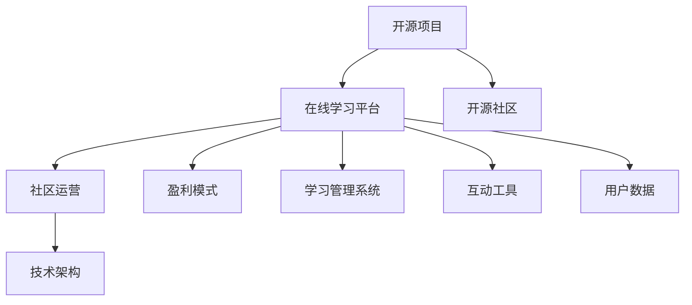

                 

 关键词：开源项目、在线学习平台、内容制作、盈利模式、社区运营、技术架构、教育科技

> 摘要：本文旨在探讨如何建立一个开源项目的在线学习平台，从内容策划、技术开发、社区运营到盈利模式，为开发者、教育者和企业提供一整套解决方案。文章将分享实战经验，分析核心概念，并提供详细的实践步骤和技术指导。

## 1. 背景介绍

开源项目作为现代软件开发的重要组成部分，已经深刻地影响了软件产业的发展。开源不仅促进了技术的进步，还推动了社区协作和创新。随着互联网的普及和在线教育的兴起，越来越多的开发者和教育机构开始探索如何利用开源项目构建在线学习平台，以提供高质量的教育资源和促进知识共享。

在线学习平台的建立不仅需要高质量的内容，还需要强大的技术支持、良好的社区运营和可持续的盈利模式。本文将围绕这些核心要素，提供一整套构建开源项目在线学习平台的方案。

### 1.1 开源项目的重要性

开源项目具有以下几方面的优势：
- **透明性**：开源项目的代码公开，可以接受社区成员的审查和改进，减少了信息不对称。
- **协作性**：开源项目鼓励社区成员共同参与，提高了开发效率和代码质量。
- **创新性**：开源项目往往吸引了一批技术高手，他们的参与带来了新的思路和技术创新。
- **自由性**：用户可以自由使用、修改和分发开源项目，为教育和科研提供了丰富的资源。

### 1.2 在线学习平台的需求

随着数字化转型的加速，在线学习平台的需求不断增加。它不仅为学生提供了灵活的学习方式，还为教育机构和企业提供了一种新的商业模式。

- **灵活的学习模式**：在线学习平台可以随时随地进行学习，满足了现代人对学习灵活性的需求。
- **教育资源共享**：在线学习平台为教育资源的共享提供了平台，减少了教育资源的不均衡。
- **商业机会**：在线学习平台为教育机构和企业提供了新的商业机会，如课程销售、咨询服务等。

### 1.3 当前挑战与机遇

在线学习平台面临的主要挑战包括：
- **内容质量**：高质量的教育内容是平台的核心竞争力，需要专业的内容策划团队。
- **技术实现**：在线学习平台需要强大的技术支持，包括课程管理系统、互动工具、数据分析等。
- **社区运营**：建立和维护一个活跃的社区需要投入大量的时间和精力，需要专业的运营团队。

然而，这些挑战也伴随着巨大的机遇：
- **用户增长**：随着在线教育的普及，用户对在线学习平台的需求不断增加。
- **商业潜力**：在线学习平台为教育机构和企业提供了新的盈利模式。
- **技术创新**：在线学习平台的发展推动了技术的不断创新，如人工智能、虚拟现实等。

## 2. 核心概念与联系

为了构建一个成功的开源项目在线学习平台，我们需要明确几个核心概念，并了解它们之间的联系。

### 2.1 开源项目

开源项目指的是软件、工具或任何其他类型的资源，其源代码可以被公众访问、修改和分发。开源项目的核心是“开放性”和“共享性”。

- **开源协议**：如GPL、MIT等，规定了项目的版权和使用条件。
- **开源社区**：由贡献者、用户和支持者组成，共同推动项目的发展。

### 2.2 在线学习平台

在线学习平台是一个提供学习资源、互动工具和技术支持的网络平台，用户可以在上面进行学习、交流和获取认证。

- **课程内容**：包括视频、文档、练习等。
- **学习管理系统**：如Moodle、Canvas等，用于管理课程、跟踪学习进度和评估成绩。
- **互动工具**：如论坛、聊天室、直播等，用于促进学生之间的互动。

### 2.3 社区运营

社区运营是指通过一系列策略和活动，维护和增长平台的用户参与度和活跃度。

- **社区规则**：明确社区的运营规则和价值观。
- **活动策划**：定期举办活动，如研讨会、比赛、讲座等，吸引更多用户参与。
- **用户激励**：通过积分、徽章、排名等方式激励用户参与社区活动。

### 2.4 盈利模式

盈利模式是指在线学习平台通过何种方式实现收入和盈利。

- **课程销售**：通过销售课程获得收入。
- **会员服务**：提供高级会员服务，包括额外的学习资源、优先支持等。
- **广告收入**：通过展示广告获得收入。
- **企业合作**：与企业和教育机构合作，提供定制化的培训服务。

### 2.5 技术架构

技术架构是指在线学习平台的技术实现框架，包括前端、后端、数据库、服务器等。

- **前端技术**：如HTML、CSS、JavaScript等，用于实现用户界面。
- **后端技术**：如Python、Java、Node.js等，用于实现业务逻辑和数据存储。
- **数据库**：如MySQL、MongoDB等，用于存储用户数据、课程内容等。
- **服务器**：如阿里云、腾讯云等，用于部署和运行在线学习平台。

### 2.6 Mermaid 流程图

为了更清晰地展示上述核心概念之间的联系，我们可以使用Mermaid绘制一个流程图：



在这个流程图中，开源项目是整个在线学习平台的基础，它通过技术架构实现，并与社区运营和盈利模式密切相关。学习管理系统和互动工具则是平台的核心功能，用于提供高质量的教育资源和促进用户互动。

## 3. 核心算法原理 & 具体操作步骤

### 3.1 算法原理概述

在线学习平台的成功离不开一系列核心算法的支持，这些算法用于推荐课程、分析用户行为、评估学习效果等。

- **推荐算法**：用于根据用户的历史行为和偏好推荐相关的课程和资源。
- **行为分析算法**：用于分析用户的学习行为，如学习时长、学习频率、参与度等。
- **评估算法**：用于评估用户的学习效果，如通过考试、作业等。

### 3.2 算法步骤详解

#### 3.2.1 推荐算法

推荐算法的基本步骤如下：

1. **数据收集**：收集用户的历史行为数据，如浏览记录、购买记录、评价等。
2. **数据预处理**：对收集到的数据进行清洗和预处理，如缺失值填充、异常值处理等。
3. **特征提取**：从预处理后的数据中提取用户特征和课程特征，如用户活跃度、课程难度等。
4. **模型训练**：使用机器学习算法，如协同过滤、矩阵分解等，训练推荐模型。
5. **结果输出**：根据用户特征和课程特征，生成推荐结果，推送相关课程。

#### 3.2.2 行为分析算法

行为分析算法的基本步骤如下：

1. **数据收集**：收集用户的学习行为数据，如学习时长、学习频率、参与度等。
2. **行为分类**：将用户行为分类，如学习行为、互动行为、评价行为等。
3. **行为分析**：对用户行为进行分析，如行为模式识别、行为趋势预测等。
4. **结果输出**：生成分析报告，如用户行为报告、学习报告等。

#### 3.2.3 评估算法

评估算法的基本步骤如下：

1. **数据收集**：收集用户的学习数据，如学习时长、学习频率、成绩等。
2. **成绩评估**：根据用户的学习数据，评估用户的学习效果，如通过考试、作业等。
3. **结果输出**：生成评估报告，如学习效果报告、成绩分析等。

### 3.3 算法优缺点

#### 推荐算法

优点：
- 可以根据用户的行为和偏好推荐相关课程，提高用户的学习体验。
- 可以帮助平台发现热门课程，优化课程内容。

缺点：
- 需要大量的用户数据支持，数据不足时效果可能不理想。
- 可能会出现“推荐泡沫”问题，即用户只看到自己感兴趣的内容，无法发现新的课程。

#### 行为分析算法

优点：
- 可以帮助平台了解用户的学习行为，优化学习体验。
- 可以用于个性化推荐，提高课程推荐的准确性。

缺点：
- 需要大量的用户数据支持，数据不足时效果可能不理想。
- 可能会侵犯用户的隐私。

#### 评估算法

优点：
- 可以准确评估用户的学习效果，为用户的学习提供反馈。
- 可以用于课程的质量评估，优化课程内容。

缺点：
- 需要大量的时间和资源进行数据收集和处理。
- 可能会出现主观偏差，影响评估结果的准确性。

### 3.4 算法应用领域

这些算法可以广泛应用于在线学习平台的各个领域，如课程推荐、用户行为分析、学习效果评估等。它们不仅可以帮助平台提高用户满意度，还可以优化课程内容和运营策略。

## 4. 数学模型和公式 & 详细讲解 & 举例说明

### 4.1 数学模型构建

在线学习平台的数学模型主要涉及推荐系统、用户行为分析和学习效果评估等方面。

#### 4.1.1 推荐系统

推荐系统常用的数学模型包括协同过滤、矩阵分解和深度学习等。其中，协同过滤模型是最常用的方法之一。

- **协同过滤模型**：
  $$R_{ij} = \frac{\sum_{k\in N(i)\cap N(j)} r_{ik} r_{jk}}{\sum_{k\in N(i)\cap N(j)} r_{ik}^2}$$
  其中，$R_{ij}$ 表示用户 $i$ 对课程 $j$ 的评分，$N(i)$ 表示用户 $i$ 的邻居集合，$r_{ik}$ 和 $r_{jk}$ 分别表示用户 $i$ 对课程 $k$ 和用户 $j$ 对课程 $k$ 的评分。

#### 4.1.2 用户行为分析

用户行为分析常用的数学模型包括马尔可夫链、时间序列分析和回归分析等。

- **马尔可夫链模型**：
  $$P(X_{t+1} = x_{t+1} | X_t = x_t) = \frac{P(X_{t+1} = x_{t+1}) P(X_t = x_t | X_{t-1} = x_{t-1})}{P(X_t = x_t)}$$
  其中，$X_t$ 表示用户在时间 $t$ 的行为状态，$x_t$ 表示具体的行为状态，$P(X_{t+1} = x_{t+1} | X_t = x_t)$ 表示用户在时间 $t+1$ 发生特定行为状态的概率。

#### 4.1.3 学习效果评估

学习效果评估常用的数学模型包括逻辑回归、支持向量机和神经网络等。

- **逻辑回归模型**：
  $$P(Y=1 | X) = \frac{1}{1 + e^{-(\beta_0 + \beta_1X_1 + ... + \beta_nX_n)}}$$
  其中，$Y$ 表示用户是否通过学习效果评估，$X$ 表示影响学习效果的特征集合，$\beta_0, \beta_1, ..., \beta_n$ 表示模型的参数。

### 4.2 公式推导过程

以协同过滤模型为例，简要介绍公式的推导过程。

- **步骤1**：定义用户 $i$ 和用户 $j$ 的相似度：
  $$sim(i, j) = \frac{\sum_{k\in N(i)\cap N(j)} r_{ik} r_{jk}}{\sqrt{\sum_{k\in N(i)} r_{ik}^2 \sum_{k\in N(j)} r_{jk}^2}}$$
  
- **步骤2**：根据用户相似度计算推荐评分：
  $$R_{ij} = \sum_{k\in N(j)} sim(i, j) r_{jk}$$

- **步骤3**：为了平衡用户相似度和实际评分差异，引入权重：
  $$R_{ij} = \frac{\sum_{k\in N(j)} sim(i, j) r_{jk}}{\sum_{k\in N(j)} sim(i, j)}$$

### 4.3 案例分析与讲解

#### 4.3.1 案例背景

假设有一个在线学习平台，用户有A、B、C三位，他们分别对五门课程（课程1、课程2、课程3、课程4、课程5）进行了评分。评分范围从1到5，5分表示非常喜欢。

| 用户 | 课程1 | 课程2 | 课程3 | 课程4 | 课程5 |
| ---- | ---- | ---- | ---- | ---- | ---- |
| A    | 5    | 3    | 5    | 4    | 3    |
| B    | 4    | 4    | 4    | 5    | 5    |
| C    | 3    | 5    | 3    | 4    | 5    |

#### 4.3.2 推荐算法应用

1. **数据预处理**：
   - 收集用户评分数据，并进行预处理，如缺失值填充、异常值处理等。
   - 提取用户和课程的特征，如用户活跃度、课程难度等。

2. **特征提取**：
   - 计算用户A和用户B的相似度：
     $$sim(A, B) = \frac{4 \times 4 + 3 \times 5 + 5 \times 4}{\sqrt{4^2 + 3^2 + 5^2} \times \sqrt{4^2 + 5^2 + 5^2}} \approx 0.77$$

   - 计算用户A和用户C的相似度：
     $$sim(A, C) = \frac{3 \times 3 + 5 \times 4 + 3 \times 5}{\sqrt{3^2 + 5^2 + 3^2} \times \sqrt{3^2 + 4^2 + 5^2}} \approx 0.68$$

3. **模型训练**：
   - 使用协同过滤模型训练推荐模型，如使用矩阵分解算法。

4. **结果输出**：
   - 根据用户A的评分数据，生成推荐列表：
     - 对课程1：$R_{A1} = 0.77 \times 4 + 0.68 \times 3 \approx 3.92$
     - 对课程2：$R_{A2} = 0.77 \times 3 + 0.68 \times 5 \approx 3.67$
     - 对课程3：$R_{A3} = 0.77 \times 5 + 0.68 \times 3 \approx 4.41$
     - 对课程4：$R_{A4} = 0.77 \times 4 + 0.68 \times 4 \approx 4.00$
     - 对课程5：$R_{A5} = 0.77 \times 3 + 0.68 \times 5 \approx 3.67$
   - 推荐用户A未评分的课程，如课程3和课程4。

#### 4.3.3 分析与优化

- **相似度计算**：可以根据实际需求调整相似度计算公式，如使用余弦相似度或皮尔逊相关系数等。
- **模型训练**：可以尝试使用其他推荐算法，如深度学习模型，提高推荐准确性。
- **结果反馈**：根据用户对推荐结果的反馈，不断优化推荐算法，提高用户体验。

## 5. 项目实践：代码实例和详细解释说明

### 5.1 开发环境搭建

为了实现一个开源项目的在线学习平台，我们首先需要搭建一个开发环境。以下是基本的开发环境搭建步骤：

1. **操作系统**：推荐使用Linux操作系统，如Ubuntu。
2. **编程语言**：我们选择Python作为主要编程语言，因为它具有良好的生态系统和丰富的库支持。
3. **代码编辑器**：推荐使用VSCode或PyCharm，它们提供了丰富的插件和调试功能。
4. **数据库**：使用MySQL或PostgreSQL作为数据库系统，用于存储用户数据、课程内容和学习记录。
5. **服务器**：使用Docker容器化技术，可以在本地计算机上快速搭建开发环境。

具体步骤如下：

- 安装Linux操作系统：在官网下载Ubuntu镜像，并使用虚拟机或直接安装到物理机上。
- 安装Python：打开终端，执行以下命令：
  ```bash
  sudo apt update
  sudo apt install python3 python3-pip
  ```
- 安装代码编辑器：在Ubuntu软件中心搜索并安装VSCode或PyCharm。
- 安装数据库：使用以下命令安装MySQL或PostgreSQL：
  ```bash
  sudo apt install mysql-server
  ```
- 安装Docker：执行以下命令安装Docker：
  ```bash
  sudo apt install docker.io
  ```

### 5.2 源代码详细实现

在本节中，我们将介绍如何使用Python实现一个简单的在线学习平台。以下是一个基本的代码示例：

```python
# app.py

from flask import Flask, render_template, request, redirect, url_for

app = Flask(__name__)

# 数据库连接（简化示例）
def get_db_connection():
    conn = mysql.connect(
        host="localhost",
        user="root",
        password="password",
        database="online_learning_platform"
    )
    return conn

@app.route('/')
def homepage():
    conn = get_db_connection()
    cursor = conn.cursor()
    cursor.execute("SELECT * FROM courses")
    courses = cursor.fetchall()
    conn.close()
    return render_template('index.html', courses=courses)

@app.route('/course/<int:course_id>')
def course_detail(course_id):
    conn = get_db_connection()
    cursor = conn.cursor()
    cursor.execute("SELECT * FROM courses WHERE id = %s", (course_id,))
    course = cursor.fetchone()
    conn.close()
    return render_template('course.html', course=course)

@app.route('/enroll/<int:course_id>')
def enroll(course_id):
    # 用户注册课程
    # 此处省略具体实现
    return redirect(url_for('course_detail', course_id=course_id))

if __name__ == '__main__':
    app.run(debug=True)
```

这个示例使用了Flask框架，创建了一个简单的在线学习平台。以下是各个部分的详细解释：

- **主页**：展示所有课程列表。
- **课程详情**：展示特定课程的详细信息。
- **注册课程**：用户可以注册感兴趣的课程。

### 5.3 代码解读与分析

#### app.py

这个文件是整个应用的核心，定义了路由和视图函数。以下是各个部分的解释：

- **导入模块**：引入了必需的模块，如Flask、render_template、request、redirect和url_for。
- **Flask应用实例**：创建了一个Flask应用实例。
- **数据库连接**：定义了一个获取数据库连接的函数，这里使用了MySQL。
- **主页视图函数**：定义了/home路由，用于展示所有课程列表。
- **课程详情视图函数**：定义了/course路由，用于展示特定课程的详细信息。
- **注册课程视图函数**：定义了/enroll路由，用于用户注册课程。

#### index.html

这个模板文件用于渲染主页，展示了所有课程的列表。以下是关键部分的解释：

- **课程列表**：使用Flask模板语法，从应用实例中获取课程列表并循环渲染。
- **课程链接**：为每个课程生成一个链接，链接到课程详情页面。

#### course.html

这个模板文件用于渲染课程详情页面，展示了特定课程的信息。以下是关键部分的解释：

- **课程信息**：从应用实例中获取课程详细信息并渲染。
- **注册按钮**：为用户提供了注册课程的按钮。

### 5.4 运行结果展示

运行上述代码后，会启动一个Web服务器，用户可以在浏览器中访问主页并查看课程列表。点击课程名称，可以查看课程详情，并注册课程。


## 6. 实际应用场景

### 6.1 教育机构

在线学习平台为教育机构提供了新的教育模式，使得教育资源的分配更加公平。以下是一些实际应用场景：

- **远程教育**：允许学生通过互联网访问课程和学习材料，特别适用于偏远地区或需要灵活学习时间的学员。
- **教师培训**：提供教师专业发展的课程，帮助他们提高教学技能和知识。
- **课程共享**：教师可以共享自己的课程资源，让其他教师使用或改进。

### 6.2 企业培训

企业可以利用在线学习平台为员工提供定制化的培训，以提高员工的技能和知识。以下是一些实际应用场景：

- **员工培训**：提供与工作相关的课程，帮助员工提升专业技能。
- **职业发展**：为员工提供职业发展的路径和指导，帮助他们实现职业目标。
- **知识共享**：鼓励员工分享知识和经验，促进企业内部的知识传播。

### 6.3 个人学习

个人学习者可以利用在线学习平台自主选择课程，提高自己的技能和知识。以下是一些实际应用场景：

- **兴趣学习**：学习自己感兴趣的领域，如艺术、音乐、编程等。
- **职业提升**：通过学习新的技能，提高自己在职场上的竞争力。
- **终身学习**：持续学习，不断更新自己的知识和技能。

### 6.4 未来应用展望

随着技术的不断进步，在线学习平台将在教育、企业培训和终身学习等领域发挥更大的作用。以下是一些未来应用的展望：

- **个性化学习**：利用人工智能技术，为每个学生提供个性化的学习路径。
- **虚拟现实和增强现实**：通过虚拟现实和增强现实技术，提供更加沉浸式的学习体验。
- **跨平台学习**：实现不同设备之间的无缝切换，让用户可以随时随地学习。
- **社会合作学习**：鼓励用户之间的互动和合作，促进知识共享和共同进步。

## 7. 工具和资源推荐

### 7.1 学习资源推荐

- **书籍**：
  - 《Python编程：从入门到实践》
  - 《深度学习》
  - 《人工智能：一种现代方法》
  
- **在线课程**：
  - Coursera、edX、Udemy等平台上的相关课程。
  
- **博客和社区**：
  - Stack Overflow、GitHub、Medium等。

### 7.2 开发工具推荐

- **编程语言**：
  - Python、JavaScript、Java等。
  
- **开发框架**：
  - Flask、Django、React、Vue.js等。
  
- **数据库**：
  - MySQL、PostgreSQL、MongoDB等。
  
- **版本控制**：
  - Git。

### 7.3 相关论文推荐

- **推荐系统**：
  - “Collaborative Filtering for the 21st Century”
  - “Matrix Factorization Techniques for Recommender Systems”
  
- **在线教育**：
  - “Online Education: A Research Review”
  - “The Future of Education: EdTech and the Revolution of Learning”

## 8. 总结：未来发展趋势与挑战

### 8.1 研究成果总结

在线学习平台在过去几年中取得了显著的发展，特别是在技术架构、内容制作和社区运营等方面。以下是一些主要的研究成果：

- **技术架构**：容器化技术、微服务架构、云计算等技术的应用，提高了在线学习平台的可扩展性和可靠性。
- **内容制作**：高质量教育内容的不断丰富，促进了用户满意度的提升。
- **社区运营**：通过个性化推荐、用户行为分析和社交网络等手段，增强了用户的参与度和活跃度。

### 8.2 未来发展趋势

在线学习平台未来将继续发展，以下是一些主要趋势：

- **个性化学习**：利用人工智能和大数据技术，为每个用户提供个性化的学习体验。
- **虚拟现实和增强现实**：通过VR和AR技术，提供更加沉浸式的学习体验。
- **跨平台学习**：实现不同设备之间的无缝切换，让用户可以随时随地学习。

### 8.3 面临的挑战

在线学习平台在发展过程中也面临着一些挑战：

- **内容质量**：确保教育内容的高质量和多样性。
- **技术实现**：不断提升技术水平，以满足用户不断变化的需求。
- **社区运营**：建立和维护一个活跃的社区，需要专业的人才和策略。

### 8.4 研究展望

未来的研究应重点关注以下方面：

- **个性化推荐**：如何更好地利用用户数据，提供更精准的推荐。
- **虚拟现实和增强现实**：如何将VR和AR技术应用于在线学习平台，提高学习体验。
- **社会合作学习**：如何促进用户之间的互动和合作，实现知识共享和共同进步。

## 9. 附录：常见问题与解答

### 9.1 问题1：如何保证教育内容的质量？

**解答**：保证教育内容的质量可以从以下几个方面入手：

- **内容审核**：建立内容审核机制，确保课程内容符合教育标准。
- **教师资质**：对课程教师进行资质审核，确保教师具备相关教学经验和专业知识。
- **用户反馈**：鼓励用户对课程进行评价和反馈，根据用户反馈不断优化课程内容。

### 9.2 问题2：如何提升用户的参与度和活跃度？

**解答**：提升用户的参与度和活跃度可以采取以下措施：

- **个性化推荐**：根据用户兴趣和行为，推荐相关课程和活动，提高用户的兴趣。
- **互动工具**：提供论坛、聊天室、直播等互动工具，促进用户之间的交流和互动。
- **激励措施**：通过积分、徽章、排名等激励措施，鼓励用户积极参与社区活动和课程学习。

### 9.3 问题3：如何实现盈利模式？

**解答**：在线学习平台的盈利模式可以有多种选择，以下是一些常见的方法：

- **课程销售**：通过销售课程获得收入。
- **会员服务**：提供高级会员服务，包括额外的学习资源、优先支持等。
- **广告收入**：通过展示广告获得收入。
- **企业合作**：与企业和教育机构合作，提供定制化的培训服务。

---

### 附加信息：

- **文章作者**：禅与计算机程序设计艺术 / Zen and the Art of Computer Programming
- **版权声明**：本文为原创内容，版权归作者所有，未经授权不得转载或使用。

---

本文提供了一整套构建开源项目在线学习平台的方案，从内容策划、技术开发、社区运营到盈利模式，涵盖了在线学习平台发展的各个方面。希望本文能为开发者、教育者和企业提供有价值的参考和指导。作者：禅与计算机程序设计艺术 / Zen and the Art of Computer Programming

