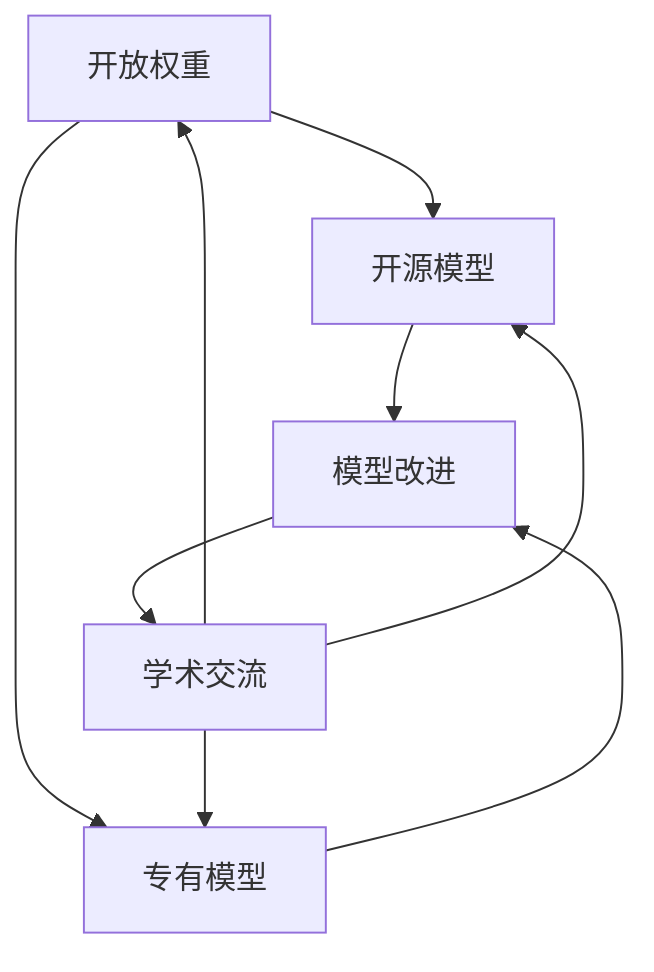

                 

关键词：AI生态系统，开放权重，开源模型，专有模型，模型评估，技术应用，发展趋势

> 摘要：本文深入探讨了AI生态系统中的开放权重、开源与专有模型的特点、优势与挑战。通过对比分析，揭示了AI模型在不同应用场景中的适用性，以及未来发展趋势和面临的挑战。旨在为读者提供对AI模型生态系统的全面理解和指导。

## 1. 背景介绍

人工智能（AI）技术的快速发展，已经成为推动各行各业变革的重要力量。从最初的专家系统，到深度学习、强化学习，再到现在的生成模型，AI技术不断突破，为各行各业带来了前所未有的机遇。然而，随着AI模型的复杂性和数据需求不断增加，AI生态系统的建设变得愈发重要。其中，开放权重、开源与专有模型作为AI生态系统的重要组成部分，对AI技术的普及和应用具有重要意义。

开放权重指的是模型的权重参数可以自由获取和共享，从而方便研究人员进行模型改进和优化。开源模型则是将模型源代码公开，使得社区可以共同参与模型的开发与维护。专有模型则是由企业或研究机构独立开发，不对外公开源代码和权重参数。

本文将围绕开放权重、开源与专有模型，探讨它们在AI生态系统中的角色与影响，分析其各自的优势与挑战，并展望未来的发展趋势。

## 2. 核心概念与联系

为了更好地理解开放权重、开源与专有模型，我们需要首先明确一些核心概念和架构。

### 2.1. 开放权重

开放权重是指模型的权重参数可以自由获取和共享。这种模式使得研究人员可以更容易地复现模型，并进行进一步的优化和改进。开放权重模型的优势在于，它能够促进学术交流和合作，加速模型的发展。然而，开放权重模型也可能导致模型的泛化能力下降，因为权重参数的共享可能导致模型对特定数据的依赖性增强。

### 2.2. 开源模型

开源模型是将模型的源代码公开，允许社区成员自由使用、修改和分发。开源模型的核心在于开放性，它使得模型可以接受广泛的反馈和改进。这种模式不仅有助于提高模型的质量，还可以促进AI技术的普及和应用。然而，开源模型也可能面临代码质量、安全性和维护等问题。

### 2.3. 专有模型

专有模型是由企业或研究机构独立开发，不对外公开源代码和权重参数。专有模型的优势在于，它可以保护企业的技术优势和商业利益。然而，专有模型可能限制学术交流，降低模型的可重复性和可解释性。

### 2.4. 架构

在AI生态系统中，开放权重、开源与专有模型之间存在着紧密的联系和相互作用。开放权重为开源模型提供了基础，而开源模型则可以为专有模型提供改进的反馈。同时，专有模型也可以为开源模型提供资金和技术支持。这种多元的生态结构，使得AI技术能够持续发展，并适应不同的应用场景。

### 2.5. Mermaid 流程图

以下是一个简化的Mermaid流程图，描述了开放权重、开源与专有模型在AI生态系统中的关系：



## 3. 核心算法原理 & 具体操作步骤

### 3.1. 算法原理概述

开放权重、开源与专有模型在AI生态系统中的角色，主要依赖于它们各自的特性和优势。开放权重模型通过共享权重参数，促进模型复现和优化；开源模型通过开放源代码，提高模型质量和可解释性；专有模型则通过保护技术优势，实现商业利益。

具体来说，开放权重模型基于以下原理：首先，模型训练过程中产生的权重参数被公开；其次，其他研究人员可以下载和使用这些权重参数，进行模型复现和优化；最后，通过反馈和改进，不断提高模型性能。

开源模型则基于以下原理：首先，模型源代码被公开，允许社区成员自由使用和修改；其次，通过社区协作，不断优化模型代码和算法；最后，开源模型可以接受广泛的反馈和改进，提高模型质量。

专有模型则基于以下原理：首先，模型源代码和权重参数不对外公开；其次，企业或研究机构独立开发和维护模型；最后，通过保护技术优势，实现商业利益。

### 3.2. 算法步骤详解

#### 3.2.1. 开放权重模型

1. 模型训练：使用训练数据集对模型进行训练，产生权重参数。
2. 权重参数公开：将训练完成的权重参数公开，供其他研究人员下载和使用。
3. 模型复现：其他研究人员使用公开的权重参数，复现模型并进行优化。
4. 反馈与改进：研究人员通过复现和优化模型，提供反馈和改进建议。

#### 3.2.2. 开源模型

1. 源代码公开：将模型源代码公开，供社区成员自由使用和修改。
2. 社区协作：社区成员共同参与模型开发，优化模型代码和算法。
3. 反馈与改进：社区成员通过反馈和改进，提高模型质量。
4. 发布更新：定期发布模型更新，持续优化模型。

#### 3.2.3. 专有模型

1. 模型开发：企业或研究机构独立开发模型，不公开源代码和权重参数。
2. 模型维护：企业或研究机构定期维护模型，保证模型性能和稳定性。
3. 商业应用：企业将模型应用于实际业务场景，实现商业利益。

### 3.3. 算法优缺点

#### 3.3.1. 开放权重模型

优点：
- 促进模型复现和优化。
- 加速模型发展。
- 降低研究门槛。

缺点：
- 权重参数共享可能导致模型泛化能力下降。
- 安全性和隐私保护问题。

#### 3.3.2. 开源模型

优点：
- 提高模型质量和可解释性。
- 促进学术交流和合作。
- 降低研究成本。

缺点：
- 代码质量和安全性问题。
- 维护成本较高。

#### 3.3.3. 专有模型

优点：
- 保护技术优势，实现商业利益。
- 模型性能和稳定性有保障。

缺点：
- 限制学术交流和合作。
- 提高研究门槛。

### 3.4. 算法应用领域

开放权重模型、开源模型和专有模型在AI生态系统中各有应用领域。

- 开放权重模型适用于学术研究、模型复现和优化。
- 开源模型适用于学术交流、社区协作和模型改进。
- 专有模型适用于商业应用、技术保护和业务拓展。

## 4. 数学模型和公式 & 详细讲解 & 举例说明

在AI生态系统中，开放权重、开源与专有模型的发展离不开数学模型的支撑。以下将介绍与这些模型相关的数学模型和公式，并进行详细讲解和举例说明。

### 4.1. 数学模型构建

#### 4.1.1. 神经网络模型

神经网络模型是AI领域中重要的数学模型，用于模拟人脑的神经元结构和工作原理。一个简单的神经网络模型可以表示为：

$$
\hat{y} = \sigma(\theta_0 + \theta_1 x_1 + \theta_2 x_2 + \ldots + \theta_n x_n)
$$

其中，$\hat{y}$ 是预测结果，$\sigma$ 是激活函数，$\theta_0, \theta_1, \theta_2, \ldots, \theta_n$ 是权重参数，$x_1, x_2, \ldots, x_n$ 是输入特征。

#### 4.1.2. 决策树模型

决策树模型是一种基于特征划分的树形结构，用于分类和回归任务。一个简单的决策树模型可以表示为：

$$
y = \sum_{i=1}^{n} w_i \prod_{j=1}^{m} f_j(x_j)
$$

其中，$y$ 是预测结果，$w_i$ 是权重参数，$f_j(x_j)$ 是第 $j$ 个特征的划分函数。

### 4.2. 公式推导过程

以下以神经网络模型为例，介绍其权重参数的推导过程。

#### 4.2.1. 损失函数

神经网络模型的损失函数用于衡量预测结果与真实值之间的差异。常见的损失函数有均方误差（MSE）和交叉熵（Cross Entropy）。以MSE为例，其公式为：

$$
J = \frac{1}{2} \sum_{i=1}^{n} (\hat{y}_i - y_i)^2
$$

其中，$J$ 是损失函数，$\hat{y}_i$ 是预测结果，$y_i$ 是真实值。

#### 4.2.2. 梯度下降法

为了最小化损失函数，可以采用梯度下降法对权重参数进行优化。梯度下降法的公式为：

$$
\theta_j := \theta_j - \alpha \frac{\partial J}{\partial \theta_j}
$$

其中，$\theta_j$ 是权重参数，$\alpha$ 是学习率，$\frac{\partial J}{\partial \theta_j}$ 是损失函数关于权重参数的梯度。

#### 4.2.3. 激活函数

为了防止梯度消失和梯度爆炸，可以采用激活函数来引入非线性。常见的激活函数有Sigmoid、ReLU和Tanh。以ReLU为例，其公式为：

$$
\sigma(x) = \max(0, x)
$$

### 4.3. 案例分析与讲解

以下通过一个简单的神经网络模型案例，介绍开放权重、开源与专有模型在实际应用中的情况。

#### 4.3.1. 开放权重模型

假设有一个开源的神经网络模型，其权重参数公开。研究人员可以下载这些权重参数，进行模型复现和优化。以下是一个简单的示例：

1. 模型训练：使用训练数据集对模型进行训练，产生权重参数。
2. 权重参数公开：将训练完成的权重参数公开，供其他研究人员下载和使用。
3. 模型复现：其他研究人员使用公开的权重参数，复现模型并进行优化。
4. 反馈与改进：研究人员通过复现和优化模型，提供反馈和改进建议。

#### 4.3.2. 开源模型

假设有一个开源的神经网络模型，其源代码和权重参数公开。研究人员可以下载和使用这些资源，进行模型改进和优化。以下是一个简单的示例：

1. 源代码公开：将模型源代码公开，供社区成员自由使用和修改。
2. 社区协作：社区成员共同参与模型开发，优化模型代码和算法。
3. 反馈与改进：社区成员通过反馈和改进，提高模型质量。
4. 发布更新：定期发布模型更新，持续优化模型。

#### 4.3.3. 专有模型

假设有一个专有的神经网络模型，其源代码和权重参数不公开。企业可以独立开发和维护模型，并将其应用于实际业务场景。以下是一个简单的示例：

1. 模型开发：企业或研究机构独立开发模型，不公开源代码和权重参数。
2. 模型维护：企业或研究机构定期维护模型，保证模型性能和稳定性。
3. 商业应用：企业将模型应用于实际业务场景，实现商业利益。

## 5. 项目实践：代码实例和详细解释说明

为了更好地理解开放权重、开源与专有模型在实际应用中的表现，以下将介绍一个简单的项目实践，包括代码实例和详细解释说明。

### 5.1. 开发环境搭建

1. 硬件环境：CPU或GPU，至少8GB内存。
2. 软件环境：Python 3.6及以上版本，TensorFlow 2.0及以上版本。

### 5.2. 源代码详细实现

以下是一个简单的神经网络模型，用于实现一个线性回归任务。

```python
import tensorflow as tf

# 定义输入层
inputs = tf.keras.layers.Input(shape=(1,))

# 定义隐藏层
hidden = tf.keras.layers.Dense(10, activation='relu')(inputs)

# 定义输出层
outputs = tf.keras.layers.Dense(1)(hidden)

# 创建模型
model = tf.keras.Model(inputs, outputs)

# 编译模型
model.compile(optimizer='adam', loss='mean_squared_error')

# 模型训练
model.fit(x_train, y_train, epochs=10, batch_size=32)
```

### 5.3. 代码解读与分析

1. `import tensorflow as tf`: 导入TensorFlow库。
2. `inputs = tf.keras.layers.Input(shape=(1,))`: 定义输入层，包含一个特征。
3. `hidden = tf.keras.layers.Dense(10, activation='relu')(inputs)`: 定义隐藏层，包含10个神经元，使用ReLU激活函数。
4. `outputs = tf.keras.layers.Dense(1)(hidden)`: 定义输出层，包含1个神经元。
5. `model = tf.keras.Model(inputs, outputs)`: 创建模型。
6. `model.compile(optimizer='adam', loss='mean_squared_error)`: 编译模型，使用adam优化器和均方误差损失函数。
7. `model.fit(x_train, y_train, epochs=10, batch_size=32)`: 模型训练，使用训练数据集，训练10个epoch，批量大小为32。

### 5.4. 运行结果展示

在运行上述代码后，可以使用以下代码展示模型训练结果：

```python
import matplotlib.pyplot as plt

# 模型评估
loss_history = model.evaluate(x_test, y_test)

# 绘制损失曲线
plt.plot(loss_history)
plt.xlabel('Epoch')
plt.ylabel('Loss')
plt.title('Model Loss')
plt.show()
```

该代码将绘制一个简单的损失曲线，展示模型在训练过程中的表现。通过观察损失曲线，可以了解模型的收敛速度和性能。

## 6. 实际应用场景

开放权重、开源与专有模型在AI生态系统中具有广泛的应用场景。以下列举几个典型应用场景：

### 6.1. 学术研究

开放权重模型在学术研究中具有广泛的应用，研究人员可以共享和复现模型，加速模型发展。例如，在自然语言处理领域，许多研究人员使用预训练的BERT模型，进行下游任务的改进和优化。

### 6.2. 商业应用

开源模型在商业应用中具有很大的优势，企业可以基于开源模型进行定制化开发，实现业务需求。例如，在金融领域，许多银行和金融机构使用开源的深度学习模型，进行信用评分和风险评估。

### 6.3. 安全监控

专有模型在安全监控领域具有重要作用，企业可以独立开发模型，保护技术优势。例如，在网络安全领域，许多企业使用专有的深度学习模型，进行恶意代码检测和入侵防御。

### 6.4. 未来应用展望

随着AI技术的不断发展，开放权重、开源与专有模型将在更多领域得到应用。例如，在医疗领域，开放权重模型可以帮助研究人员进行疾病预测和诊断；在工业领域，开源模型可以帮助企业实现智能制造和生产线优化；在智慧城市领域，专有模型可以帮助政府实现城市管理和公共安全。

## 7. 工具和资源推荐

为了更好地研究和应用开放权重、开源与专有模型，以下推荐一些实用的工具和资源：

### 7.1. 学习资源推荐

1. 《深度学习》（Goodfellow, Bengio, Courville著）：一本经典的深度学习入门教材，涵盖了许多重要的理论和技术。
2. 《Python深度学习》（François Chollet著）：一本实用的深度学习实战指南，详细介绍了许多深度学习框架和算法。
3. 《机器学习年度报告》：一份关于机器学习和深度学习最新进展的年度报告，涵盖了学术界和工业界的最新成果。

### 7.2. 开发工具推荐

1. TensorFlow：一个开源的深度学习框架，广泛应用于学术界和工业界。
2. PyTorch：一个开源的深度学习框架，具有灵活的动态计算图和强大的社区支持。
3. Keras：一个基于TensorFlow和PyTorch的高级深度学习框架，简化了模型开发过程。

### 7.3. 相关论文推荐

1. "BERT: Pre-training of Deep Bidirectional Transformers for Language Understanding"（Devlin et al., 2019）：一篇关于BERT模型的经典论文，详细介绍了BERT模型的原理和训练方法。
2. "GPT-3: Language Models are few-shot learners"（Brown et al., 2020）：一篇关于GPT-3模型的论文，展示了模型在少样本学习任务上的强大性能。
3. "An Image Database for Release of Chinese Scene Text"（Li et al., 2010）：一篇关于中文场景文本数据集的论文，为自然语言处理研究提供了重要资源。

## 8. 总结：未来发展趋势与挑战

开放权重、开源与专有模型在AI生态系统中具有重要作用，它们在促进模型发展、提高模型质量和实现商业利益方面发挥了关键作用。未来，随着AI技术的不断进步，开放权重、开源与专有模型将继续发展，并面临以下挑战：

### 8.1. 研究成果总结

本文通过对开放权重、开源与专有模型的分析，总结了它们在AI生态系统中的角色、优势与挑战。研究发现，开放权重模型能够促进模型复现和优化，开源模型能够提高模型质量和可解释性，专有模型能够实现商业利益。

### 8.2. 未来发展趋势

1. 模型规模和复杂度将不断增加，开放权重和开源模型将继续发挥重要作用。
2. 随着少样本学习和迁移学习技术的发展，开放权重和开源模型的应用范围将更加广泛。
3. 专有模型将继续在商业应用中占据主导地位，为企业提供技术优势。

### 8.3. 面临的挑战

1. 安全性和隐私保护问题：开放权重和开源模型可能面临数据泄漏和安全风险。
2. 维护成本：开源模型需要持续维护和更新，提高研究成本。
3. 商业利益平衡：专有模型需要在保护技术优势和实现商业利益之间找到平衡点。

### 8.4. 研究展望

1. 加强安全性和隐私保护技术，确保开放权重和开源模型的安全可靠。
2. 探索高效维护和更新方法，降低开源模型的研究成本。
3. 研究商业模型，实现专有模型在保护技术优势和实现商业利益之间的平衡。

## 9. 附录：常见问题与解答

### 9.1. 开放权重模型的优势是什么？

开放权重模型的优势在于：

1. 促进模型复现和优化：研究人员可以更容易地复现模型，并进行进一步的优化和改进。
2. 加速模型发展：开放权重模型可以加速模型的迭代和改进，提高模型性能。
3. 降低研究门槛：开放权重模型降低了研究人员进入AI领域的门槛，提高了研究效率。

### 9.2. 开源模型的优势是什么？

开源模型的优势在于：

1. 提高模型质量和可解释性：社区成员可以共同参与模型开发，提高模型质量和可解释性。
2. 促进学术交流和合作：开源模型有助于促进学术交流和合作，推动AI技术发展。
3. 降低研究成本：开源模型降低了研究人员的研究成本，提高了研究效率。

### 9.3. 专有模型的优势是什么？

专有模型的优势在于：

1. 保护技术优势：专有模型可以保护企业的技术优势，实现商业利益。
2. 模型性能和稳定性有保障：专有模型由企业或研究机构独立开发和维护，确保模型性能和稳定性。
3. 实现商业利益：专有模型可以帮助企业实现商业利益，推动企业持续发展。

### 9.4. 开放权重、开源与专有模型如何协同发展？

开放权重、开源与专有模型可以协同发展，具体措施包括：

1. 开放权重模型为基础，促进模型复现和优化，提高模型质量。
2. 开源模型为桥梁，促进学术交流和合作，推动AI技术发展。
3. 专有模型为商业应用，实现技术保护和商业利益，推动企业持续发展。

### 9.5. 如何选择合适的模型？

选择合适的模型需要考虑以下因素：

1. 应用场景：根据应用场景选择合适的模型，如分类、回归、生成等。
2. 模型性能：评估模型在特定任务上的性能，选择性能优秀的模型。
3. 可解释性：根据任务需求和可解释性要求，选择合适的模型。
4. 成本：考虑模型开发、训练和部署的成本，选择成本合理的模型。

## 作者署名

作者：禅与计算机程序设计艺术 / Zen and the Art of Computer Programming
----------------------------------------------------------------

