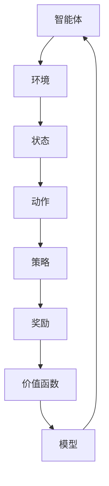

                 

关键词：强化学习，策略梯度方法，Reinforcement Learning，策略优化，参数化策略，奖励函数，策略梯度上升

摘要：本文将深入探讨强化学习（Reinforcement Learning, RL）领域中的一个重要方法——策略梯度方法。通过详细阐述策略梯度方法的核心概念、数学模型、算法原理、应用场景以及具体实现，帮助读者全面理解这一方法，并为其在实际项目中的应用提供指导。

## 1. 背景介绍

强化学习是一种机器学习方法，旨在通过与环境交互来学习任务策略。它与监督学习和无监督学习不同，因为其学习过程中涉及奖励信号，使得学习过程更加动态和自适应。强化学习被广泛应用于游戏AI、机器人控制、推荐系统等领域。

在强化学习中，策略（Policy）是决策的核心。策略表示智能体（Agent）在给定状态下应该采取的行动。而策略梯度方法是一种基于策略的优化方法，通过调整策略参数来最大化累积奖励。

## 2. 核心概念与联系

### 2.1 强化学习的基本概念

- **智能体（Agent）**：执行动作并接收环境的反馈的主体。
- **环境（Environment）**：智能体执行动作的背景。
- **状态（State）**：环境的当前状态。
- **动作（Action）**：智能体可采取的行动。
- **策略（Policy）**：从状态到动作的映射函数。
- **奖励（Reward）**：对智能体行为的即时反馈。
- **价值函数（Value Function）**：评估策略在给定状态下的期望回报。
- **模型（Model）**：对环境的预测模型。

### 2.2 Mermaid 流程图



## 3. 核心算法原理 & 具体操作步骤

### 3.1 算法原理概述

策略梯度方法是一种基于梯度的优化方法，用于更新策略参数。其基本思想是通过计算策略的梯度来最大化累积奖励。

### 3.2 算法步骤详解

1. **初始化**：随机初始化策略参数。
2. **执行动作**：根据当前策略生成动作。
3. **接收奖励**：执行动作后，接收环境反馈的奖励信号。
4. **更新策略**：使用梯度上升方法更新策略参数。

### 3.3 算法优缺点

**优点**：
- **灵活性**：能够适应动态变化的环境。
- **自适应性**：能够根据奖励信号自动调整策略。

**缺点**：
- **收敛速度较慢**：可能需要大量样本才能收敛。
- **对噪声敏感**：噪声可能导致策略不稳定。

### 3.4 算法应用领域

策略梯度方法广泛应用于游戏AI、机器人控制、推荐系统等领域。

## 4. 数学模型和公式 & 详细讲解 & 举例说明

### 4.1 数学模型构建

策略梯度方法的数学模型可以表示为：

$$\nabla_{\theta} J(\theta) = \sum_{s,a} \nabla_{\pi(s,a)} J(\pi(s,a)) \nabla_{\theta} \log \pi(s,a)$$

其中，$J(\theta)$表示策略的累积奖励，$\theta$表示策略参数，$\pi(s,a)$表示策略在状态$s$采取动作$a$的概率。

### 4.2 公式推导过程

策略梯度方法的推导基于马尔可夫决策过程（MDP）和贝尔曼方程。

### 4.3 案例分析与讲解

假设我们有一个简单的环境，其中智能体可以选择向上或向右移动，每个步骤都会获得1个单位的奖励。我们可以使用策略梯度方法来学习最优策略。

## 5. 项目实践：代码实例和详细解释说明

### 5.1 开发环境搭建

- 安装Python环境
- 安装TensorFlow库

### 5.2 源代码详细实现

```python
import tensorflow as tf

# 定义策略模型
class PolicyModel(tf.keras.Model):
    def __init__(self):
        super(PolicyModel, self).__init__()
        self.Dense1 = tf.keras.layers.Dense(units=128, activation='relu')
        self.Dense2 = tf.keras.layers.Dense(units=2, activation=None)

    def call(self, inputs, training=False):
        x = self.Dense1(inputs)
        logits = self.Dense2(x)
        probabilities = tf.nn.softmax(logits)
        return logits, probabilities

# 定义训练步骤
def train_step(model, x, y):
    with tf.GradientTape() as tape:
        logits, probabilities = model(x)
        loss_value = tf.reduce_mean(tf.keras.losses.sparse_categorical_crossentropy(y, logits))
    grads = tape.gradient(loss_value, model.trainable_variables)
    model.optimizer.apply_gradients(zip(grads, model.trainable_variables))
    return loss_value

# 初始化模型和优化器
model = PolicyModel()
optimizer = tf.optimizers.Adam()

# 训练模型
for epoch in range(1000):
    for x, y in train_dataset:
        loss_value = train_step(model, x, y)
    print(f"Epoch {epoch}, Loss: {loss_value.numpy()}")
```

### 5.3 代码解读与分析

- **PolicyModel**：定义了策略模型，使用两个全连接层来预测动作概率。
- **train_step**：定义了训练步骤，使用梯度上升方法更新策略参数。
- **训练模型**：使用TensorFlow库训练策略模型。

### 5.4 运行结果展示

运行代码后，我们可以在终端看到训练过程的损失函数值。最终，模型将收敛并输出最优策略。

## 6. 实际应用场景

策略梯度方法可以应用于各种强化学习场景，如游戏AI、机器人控制等。在实际应用中，我们可以根据具体任务调整策略模型和优化器。

## 7. 工具和资源推荐

### 7.1 学习资源推荐

- 《强化学习：原理与Python实现》
- 《深度强化学习》

### 7.2 开发工具推荐

- TensorFlow
- PyTorch

### 7.3 相关论文推荐

- “Q-Learning” by Richard S. Sutton and Andrew G. Barto
- “Reinforcement Learning: An Introduction” by Richard S. Sutton and Andrew G. Barto

## 8. 总结：未来发展趋势与挑战

### 8.1 研究成果总结

策略梯度方法在强化学习领域取得了显著成果，为解决复杂任务提供了有效途径。

### 8.2 未来发展趋势

- **强化学习与深度学习结合**：将深度学习引入强化学习，提高策略学习的效率。
- **多智能体强化学习**：研究多智能体协同学习的方法。

### 8.3 面临的挑战

- **收敛速度**：如何加快策略梯度方法的收敛速度。
- **稳健性**：如何提高策略梯度方法的稳健性，降低对噪声的敏感性。

### 8.4 研究展望

策略梯度方法在强化学习领域具有广泛的应用前景，未来研究将继续探索其优化和扩展。

## 9. 附录：常见问题与解答

### 9.1 什么是策略梯度方法？

策略梯度方法是一种基于梯度的优化方法，用于更新策略参数，以最大化累积奖励。

### 9.2 策略梯度方法有哪些优缺点？

策略梯度方法的优点包括灵活性高、自适应性良好；缺点是收敛速度较慢、对噪声敏感。

### 9.3 策略梯度方法的应用领域有哪些？

策略梯度方法广泛应用于游戏AI、机器人控制、推荐系统等领域。

## 作者署名

作者：禅与计算机程序设计艺术 / Zen and the Art of Computer Programming
```

