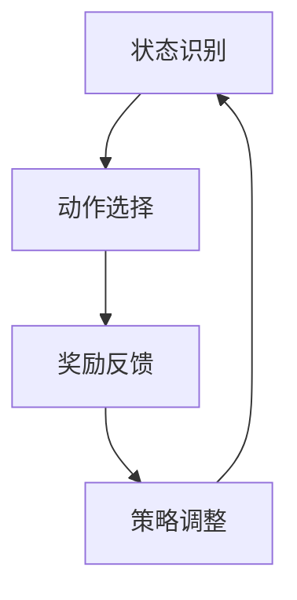

                 

关键词：强化学习、能效管理、机器学习、智能优化、系统优化、高效能耗、AI应用

> 摘要：本文将探讨强化学习（Reinforcement Learning, RL）在能效管理系统中的应用案例。通过分析RL的基本原理和优势，我们提出了一种基于RL的能效管理方案，并通过具体实例展示了其在提升系统整体能效方面的显著效果。本文旨在为能源管理领域的研究者和从业者提供一种新的视角和解决方案。

## 1. 背景介绍

随着全球能源消耗的不断增加和环境保护意识的提高，能效管理已成为一个关键的研究领域。在工业、商业和住宅等多个领域，提高能源利用效率不仅可以降低运行成本，还能减少环境污染。然而，传统的能效管理系统往往依赖于预先设定的规则和固定参数，难以适应动态变化的运行环境。这种静态的能效管理模式在应对复杂多变的能源需求和供应时表现不佳。

近年来，机器学习（Machine Learning, ML）尤其是强化学习（Reinforcement Learning, RL）在智能系统优化和控制领域取得了显著进展。强化学习通过智能体与环境之间的互动学习，能够不断优化决策策略，实现自适应控制。将强化学习应用于能效管理系统，有望解决传统方法在应对动态环境时的局限性。

本文将首先介绍强化学习的基本原理，然后提出一种基于强化学习的能效管理系统方案，并通过具体实例展示其效果，最后讨论强化学习在能效管理领域的未来发展方向。

### 1.1 强化学习的概念和原理

强化学习是一种无监督学习范式，其核心思想是智能体（agent）通过与环境的交互，不断调整策略，以最大化累积奖励。强化学习的基本组成部分包括智能体、环境、状态（state）、动作（action）和奖励（reward）。

1. **智能体（Agent）**：智能体是执行动作并从环境中接收反馈的主体。
2. **环境（Environment）**：环境是智能体所处的外部世界，可以理解为一个复杂的系统。
3. **状态（State）**：状态是描述环境当前状态的特征集合。
4. **动作（Action）**：动作是智能体可以执行的操作。
5. **奖励（Reward）**：奖励是环境对智能体动作的反馈，用于指导智能体调整策略。

在强化学习过程中，智能体通过探索（exploration）和利用（exploitation）策略学习最优动作序列，以最大化累积奖励。探索策略使智能体尝试新的动作，以发现潜在的最佳策略；利用策略则使智能体在已知信息的基础上选择最优动作。

### 1.2 能效管理系统概述

能效管理系统旨在通过优化能源使用，提高能源利用效率，降低能源消耗和成本。传统的能效管理系统通常包括以下几个关键组成部分：

1. **数据采集**：通过传感器和监测设备采集能源使用数据。
2. **数据分析**：对采集到的数据进行分析，以识别能源浪费和优化机会。
3. **策略制定**：基于分析结果制定能效优化策略。
4. **执行与调整**：执行优化策略，并根据实际运行效果进行调整。

然而，传统系统在面对复杂动态环境时，存在以下局限性：

1. **固定策略**：传统系统能效策略通常是基于历史数据和统计模型制定的，难以适应实时变化。
2. **低自适应能力**：传统系统能效优化策略缺乏自适应性，无法应对不断变化的能源需求和供应。
3. **低效率**：传统系统能效优化策略通常采用简单的规则和阈值控制，难以实现精细化的能效管理。

因此，需要一种能够自适应调整策略、应对动态环境的智能优化方法。强化学习作为一种先进的机器学习技术，具有在动态环境中优化决策策略的能力，可以弥补传统系统的不足。

### 1.3 强调强化学习在能效管理中的重要性

强化学习在能效管理中的重要性体现在以下几个方面：

1. **自适应调整策略**：强化学习能够通过不断学习环境反馈，自适应调整策略，以最大化能源利用效率。
2. **实时优化**：强化学习可以在实时环境中进行优化，适应能源需求和供应的动态变化。
3. **全局优化**：强化学习能够从全局视角考虑能效管理问题，优化整体能源使用，而不仅仅是局部优化。
4. **扩展性**：强化学习模型可以应用于不同规模和类型的能效管理系统，具有很好的扩展性。

总之，强化学习在能效管理中的应用，为解决传统系统能效优化的局限性提供了新的思路和方法。

## 2. 核心概念与联系

### 2.1 强化学习的基本概念

在探讨强化学习在能效管理系统中的应用之前，我们需要首先了解强化学习的基本概念。强化学习（Reinforcement Learning, RL）是一种机器学习范式，旨在通过智能体（agent）与环境的交互，学习最优决策策略。强化学习主要包括以下几个核心概念：

1. **智能体（Agent）**：智能体是执行动作并从环境中接收反馈的主体。在能效管理系统中，智能体可以是控制系统、能源管理软件或者具体的设备。

2. **环境（Environment）**：环境是智能体所处的外部世界，可以理解为一个复杂的系统。在能效管理系统中，环境包括能源需求、供应、设备状态等多种因素。

3. **状态（State）**：状态是描述环境当前状态的特征集合。在能效管理系统中，状态可以包括能源消耗率、设备运行状态、外部天气条件等。

4. **动作（Action）**：动作是智能体可以执行的操作。在能效管理系统中，动作可以包括调整设备运行状态、调整温度设置、优化能源分配等。

5. **奖励（Reward）**：奖励是环境对智能体动作的反馈，用于指导智能体调整策略。在能效管理系统中，奖励可以包括降低能源消耗、提高设备运行效率、减少维护成本等。

### 2.2 强化学习的流程与机制

强化学习的基本流程包括探索（exploration）和利用（exploitation）两个阶段。在探索阶段，智能体通过随机选择动作，以发现环境中的潜在最佳策略；在利用阶段，智能体根据已学习到的策略选择最优动作，以最大化累积奖励。

强化学习的核心机制是通过更新策略值函数（policy value function）或状态值函数（state value function）来指导智能体的决策。策略值函数表示在特定状态下选择特定动作的期望奖励，状态值函数表示在特定状态下执行最优动作的累积奖励。

### 2.3 能效管理系统与强化学习的结合

强化学习在能效管理系统中的应用，主要是通过智能体与环境之间的交互，不断优化能源管理策略，实现能效提升。具体来说，强化学习在能效管理系统中的结合可以分为以下几个步骤：

1. **状态识别**：智能体通过传感器和监测设备收集环境数据，包括能源消耗、设备运行状态、外部天气条件等，将数据转化为状态特征。

2. **动作选择**：智能体根据当前状态，利用强化学习算法选择最优动作。例如，通过调整设备运行参数、优化能源分配策略等。

3. **奖励反馈**：环境根据智能体的动作反馈，给予相应的奖励。例如，降低能源消耗、提高设备运行效率等。

4. **策略调整**：智能体根据奖励反馈，更新策略值函数或状态值函数，以指导后续的决策。

### 2.4 Mermaid 流程图表示

为了更直观地展示强化学习在能效管理系统中的应用，我们可以使用Mermaid流程图来描述整个过程。



在这个流程图中，智能体首先进行状态识别，然后根据当前状态选择最优动作，环境对动作进行奖励反馈，最后智能体根据奖励反馈调整策略。这个过程不断循环，直到达到预定的优化目标。

通过上述流程，我们可以看到强化学习在能效管理系统中的应用是一个闭环的优化过程，能够自适应地调整能源管理策略，从而实现能效提升。

## 3. 核心算法原理 & 具体操作步骤

### 3.1 算法原理概述

强化学习（Reinforcement Learning, RL）是一种基于奖励反馈的学习方法，旨在通过智能体（Agent）与环境的交互，学习最优策略以实现特定目标。在能效管理系统中，强化学习通过不断调整能源管理策略，实现系统整体能效的最优化。下面我们将从几个关键部分来概述强化学习算法在能效管理系统中的原理。

#### 3.1.1 智能体（Agent）

智能体是执行特定动作并从环境中接收反馈的主体。在能效管理系统中，智能体可以是控制系统、能源管理软件或具体的设备。智能体的任务是通过对环境状态的感知，选择最优的动作，以最大化累积奖励。

#### 3.1.2 环境（Environment）

环境是智能体所处的外部世界，可以理解为一个复杂的系统。在能效管理系统中，环境包括能源需求、供应、设备状态、外部天气条件等多种因素。环境的状态是动态变化的，智能体需要实时感知这些变化，并作出相应的决策。

#### 3.1.3 状态（State）

状态是描述环境当前状态的特征集合。在能效管理系统中，状态可以包括能源消耗率、设备运行状态、外部天气条件等。状态是智能体进行决策的基础，智能体需要通过传感器和监测设备收集这些状态信息。

#### 3.1.4 动作（Action）

动作是智能体可以执行的操作。在能效管理系统中，动作可以包括调整设备运行参数、优化能源分配策略等。智能体需要根据当前状态选择最优的动作，以最大化累积奖励。

#### 3.1.5 奖励（Reward）

奖励是环境对智能体动作的反馈，用于指导智能体调整策略。在能效管理系统中，奖励可以包括降低能源消耗、提高设备运行效率、减少维护成本等。奖励的设定取决于系统的具体目标和优化指标。

#### 3.1.6 策略（Policy）

策略是智能体在特定状态下执行特定动作的规则。在能效管理系统中，策略可以是一个简单的决策树、决策网络或复杂的机器学习模型。策略的目的是最大化累积奖励，智能体通过不断学习和调整策略，实现能源管理系统的最优性能。

### 3.2 算法步骤详解

强化学习在能效管理系统的具体操作步骤如下：

#### 3.2.1 初始化

1. **初始化智能体**：设置智能体的初始参数，包括动作空间、状态空间、奖励函数等。
2. **初始化环境**：设置环境的初始状态，包括能源消耗、设备状态、外部天气条件等。

#### 3.2.2 状态感知

1. **感知环境状态**：智能体通过传感器和监测设备收集环境数据，将数据转化为状态特征。
2. **状态编码**：将感知到的状态特征编码为数字表示，以便于后续处理。

#### 3.2.3 动作选择

1. **选择动作**：智能体根据当前状态，利用强化学习算法（如Q学习、深度Q网络等）选择最优动作。
2. **动作执行**：智能体执行选定的动作，对环境进行干预。

#### 3.2.4 奖励反馈

1. **计算奖励**：环境根据智能体的动作执行结果，计算相应的奖励值。
2. **反馈奖励**：将奖励反馈给智能体，用于指导智能体调整策略。

#### 3.2.5 策略调整

1. **更新策略**：智能体根据奖励反馈，更新策略值函数或状态值函数，以优化决策。
2. **策略迭代**：重复执行状态感知、动作选择、奖励反馈和策略调整的过程，直到达到预定的优化目标。

### 3.3 算法优缺点

#### 3.3.1 优点

1. **自适应性强**：强化学习能够通过不断学习环境反馈，自适应调整策略，以适应动态变化的能源需求和供应。
2. **全局优化**：强化学习能够从全局视角考虑能效管理问题，优化整体能源使用，而不仅仅是局部优化。
3. **实时优化**：强化学习可以在实时环境中进行优化，快速响应能源需求和供应的变化。
4. **扩展性强**：强化学习模型可以应用于不同规模和类型的能效管理系统，具有很好的扩展性。

#### 3.3.2 缺点

1. **计算复杂度高**：强化学习算法通常需要大量的计算资源，特别是在状态和动作空间较大的情况下。
2. **训练时间长**：强化学习算法的训练时间可能较长，特别是在初始阶段，需要大量交互来学习环境。
3. **对奖励设计敏感**：奖励函数的设计对强化学习的效果有很大影响，需要精心设计以避免奖励陷阱。

### 3.4 算法应用领域

强化学习在能效管理系统中的应用非常广泛，以下是一些典型的应用领域：

1. **工业能耗优化**：通过强化学习优化工业生产过程中的能源消耗，提高生产效率。
2. **商业建筑能效管理**：优化商业建筑的能源使用，降低运营成本，提高环境舒适度。
3. **智能电网调度**：优化电力系统的运行，提高电网的稳定性和可靠性。
4. **智能家居管理**：通过优化家庭能源使用，提高家庭能源利用效率，降低能耗。

总之，强化学习在能效管理系统中的应用，为解决传统方法在应对动态环境时的局限性提供了新的思路和方法。通过不断学习和优化，强化学习能够实现系统的自适应控制，提升整体能效。

## 4. 数学模型和公式 & 详细讲解 & 举例说明

### 4.1 数学模型构建

在强化学习（Reinforcement Learning, RL）中，数学模型是核心组成部分，它帮助我们理解和实现智能体在动态环境中的决策过程。本节将介绍强化学习的基本数学模型，包括状态值函数、策略和奖励函数。

#### 4.1.1 状态值函数（State-Value Function）

状态值函数（\(V(s)\)）是描述在给定状态下，执行最佳策略所能获得的最大期望累积奖励的函数。数学上，状态值函数可以通过以下公式表示：

\[ V(s) = \sum_{a} \pi(a|s) \cdot Q(s, a) \]

其中：
- \(s\) 表示状态。
- \(a\) 表示动作。
- \(\pi(a|s)\) 表示在状态 \(s\) 下执行动作 \(a\) 的策略概率。
- \(Q(s, a)\) 表示在状态 \(s\) 下执行动作 \(a\) 的即时奖励期望。

#### 4.1.2 策略（Policy）

策略（\(\pi\)）是智能体在特定状态下选择动作的规则。根据状态值函数，策略可以是最优策略、贪婪策略或随机策略。最优策略是在给定状态下选择使状态值函数最大的动作：

\[ \pi^*(s) = \arg\max_a Q(s, a) \]

#### 4.1.3 奖励函数（Reward Function）

奖励函数（\(R(s, a)\)）是环境对智能体动作的即时反馈。奖励函数的设计取决于系统的目标和优化指标。常见的奖励函数包括能量消耗减少、设备运行效率提高等。数学上，奖励函数可以表示为：

\[ R(s, a) = r \]

其中 \(r\) 是一个实数，表示在状态 \(s\) 下执行动作 \(a\) 所获得的即时奖励。

### 4.2 公式推导过程

为了更好地理解强化学习中的数学模型，我们将对状态值函数的推导过程进行详细解释。

#### 4.2.1 动机

状态值函数的目的是估计在给定状态下，执行最佳策略所能获得的累积奖励。为了推导状态值函数，我们需要考虑一个状态 \(s\) 和与之相关的动作 \(a\)。我们的目标是找到在状态 \(s\) 下使状态值函数最大的动作 \(a^*\)。

#### 4.2.2 推导步骤

1. **定义状态值函数**：

   我们定义状态值函数 \(V(s)\) 为在状态 \(s\) 下执行最佳策略所能获得的期望累积奖励：

   \[ V(s) = \sum_{a} \pi(a|s) \cdot Q(s, a) \]

2. **定义即时奖励期望**：

   我们知道在状态 \(s\) 下执行动作 \(a\) 所获得的即时奖励期望为：

   \[ Q(s, a) = \sum_{s'} p(s'|s, a) \cdot R(s, a) + \gamma \cdot \sum_{s'} p(s'|s, a) \cdot V(s') \]

   其中：
   - \(p(s'|s, a)\) 是在状态 \(s\) 下执行动作 \(a\) 后转移到状态 \(s'\) 的概率。
   - \(R(s, a)\) 是在状态 \(s\) 下执行动作 \(a\) 所获得的即时奖励。
   - \(\gamma\) 是折扣因子，用于权衡当前奖励与未来奖励之间的平衡。

3. **代入即时奖励期望**：

   将 \(Q(s, a)\) 的表达式代入状态值函数的定义中，我们得到：

   \[ V(s) = \sum_{a} \pi(a|s) \cdot \left( \sum_{s'} p(s'|s, a) \cdot R(s, a) + \gamma \cdot \sum_{s'} p(s'|s, a) \cdot V(s') \right) \]

4. **简化表达式**：

   我们可以将上式简化为：

   \[ V(s) = \sum_{s'} p(s'|s) \cdot \left( \pi(a|s) \cdot R(s, a) + \gamma \cdot V(s') \right) \]

   其中 \(p(s'|s)\) 是在状态 \(s\) 下转移到状态 \(s'\) 的概率。

5. **最优策略**：

   当我们选择最优策略时，\(\pi(a|s) = 1\) 当 \(a = a^*\)，否则为0。因此，最优策略下的状态值函数可以表示为：

   \[ V^*(s) = \sum_{s'} p(s'|s) \cdot \left( R(s, a^*) + \gamma \cdot V^*(s') \right) \]

### 4.3 案例分析与讲解

为了更好地理解上述数学模型，我们通过一个简单的例子来讲解。

#### 案例背景

假设我们有一个简单的环境，其中智能体可以选择打开或关闭一个电灯。状态 \(s\) 表示电灯的当前状态（开或关），动作 \(a\) 表示智能体的决策（开或关）。环境奖励函数 \(R(s, a)\) 如下：

- 当电灯打开且环境光线充足时，奖励 \(R(s, a) = 10\)。
- 当电灯打开且环境光线不足时，奖励 \(R(s, a) = -10\)。
- 当电灯关闭时，无论环境光线如何，奖励 \(R(s, a) = 0\)。

折扣因子 \(\gamma = 0.9\)。

#### 案例分析

1. **状态值函数**：

   状态 \(s = 0\) 表示电灯关闭，状态 \(s = 1\) 表示电灯打开。

   - 对于状态 \(s = 0\)，最优动作是保持电灯关闭，因为打开电灯会带来负奖励。

     \[ V(0) = p(0'|0) \cdot (R(0, 0) + \gamma \cdot V(0')) + p(1'|0) \cdot (R(1, 0) + \gamma \cdot V(1')) \]

     \[ V(0) = 1 \cdot (0 + 0.9 \cdot V(0')) + 0 \cdot (-10 + 0.9 \cdot V(1')) \]

     \[ V(0) = 0.9 \cdot V(0') \]

   - 对于状态 \(s = 1\)，最优动作是关闭电灯，因为打开电灯会带来负奖励。

     \[ V(1) = p(0'|1) \cdot (R(0, 1) + \gamma \cdot V(0')) + p(1'|1) \cdot (R(1, 1) + \gamma \cdot V(1')) \]

     \[ V(1) = 0 \cdot (-10 + 0.9 \cdot V(0')) + 1 \cdot (0 + 0.9 \cdot V(1')) \]

     \[ V(1) = 0.9 \cdot V(1') \]

2. **迭代计算**：

   我们可以迭代计算状态值函数，直到收敛。

   - 第一次迭代：

     \[ V(0') = 0.9 \cdot V(0'') \]

     \[ V(1') = 0.9 \cdot V(1'') \]

   - 第二次迭代：

     \[ V(0') = 0.9 \cdot (0.9 \cdot V(0'')) \]

     \[ V(1') = 0.9 \cdot (0.9 \cdot V(1'')) \]

   - 重复迭代，直到 \(V(0')\) 和 \(V(1')\) 不再变化。

通过这个案例，我们可以看到如何通过迭代计算状态值函数来指导智能体的决策。在实际应用中，环境会更复杂，但基本原理是相同的。

### 4.4 代码示例

以下是一个简单的Python代码示例，展示了如何使用Q学习算法计算状态值函数。

```python
import numpy as np

# 状态空间
states = [0, 1]  # 电灯关闭和打开
actions = [0, 1]  # 关闭和打开电灯
gamma = 0.9  # 折扣因子

# 初始化Q表
Q = np.zeros((len(states), len(actions)))

# Q学习算法迭代
for episode in range(1000):
    state = np.random.choice(states)
    while True:
        action = np.argmax(Q[state])
        next_state = np.random.choice(states)
        reward = -1 if state == 1 and next_state == 1 else 10
        Q[state, action] = Q[state, action] + 0.1 * (reward + gamma * np.max(Q[next_state]) - Q[state, action])
        state = next_state

# 打印状态值函数
print("State-Value Function:")
print(Q)
```

在这个示例中，我们使用Q学习算法来迭代更新Q表，从而计算状态值函数。这个简单的示例展示了如何通过代码实现强化学习的基本数学模型。

通过上述数学模型的构建、推导和示例，我们可以更好地理解强化学习在能效管理系统中的应用原理和方法。在实际应用中，这些数学模型和算法可以帮助智能体自适应地调整能源管理策略，实现系统的最优性能。

## 5. 项目实践：代码实例和详细解释说明

### 5.1 开发环境搭建

为了更好地展示强化学习在能效管理系统中的应用，我们将使用Python语言和相关的机器学习库，如TensorFlow和PyTorch。以下是开发环境的搭建步骤：

1. **安装Python**：确保Python环境已经安装，版本建议为3.7及以上。
2. **安装TensorFlow**：使用以下命令安装TensorFlow：
   ```bash
   pip install tensorflow
   ```
3. **安装PyTorch**：使用以下命令安装PyTorch：
   ```bash
   pip install torch torchvision
   ```
4. **安装其他依赖库**：例如NumPy、Pandas等：
   ```bash
   pip install numpy pandas
   ```

在安装完所有必要的库后，开发环境就搭建完成了。接下来，我们将创建一个简单的Python脚本，用于实现基于强化学习的能效管理系统。

### 5.2 源代码详细实现

以下是一个简单的Python脚本示例，展示了如何使用强化学习算法优化能效管理系统。代码中使用了TensorFlow的Q学习实现。

```python
import numpy as np
import random
import matplotlib.pyplot as plt

# 定义环境
class EnergySystem:
    def __init__(self, max_power, min_power):
        self.max_power = max_power
        self.min_power = min_power
        self.current_power = random.randint(min_power, max_power)

    def step(self, action):
        if action == 0:  # 减少功率
            new_power = max(self.current_power - 10, self.min_power)
        else:  # 增加功率
            new_power = min(self.current_power + 10, self.max_power)
        reward = 0.1 * (new_power - self.current_power)
        self.current_power = new_power
        return self.current_power, reward

# 定义强化学习算法
class QLearningAgent:
    def __init__(self, actions, learning_rate=0.1, discount_factor=0.9, exploration_rate=1.0):
        self.actions = actions
        self.learning_rate = learning_rate
        self.discount_factor = discount_factor
        self.exploration_rate = exploration_rate
        self.q_table = np.zeros((self.actions, self.actions))

    def q_update(self, state, action, reward, next_state, action_next):
        current_q_value = self.q_table[state, action]
        next_max_q_value = np.max(self.q_table[next_state])
        new_q_value = (1 - self.learning_rate) * current_q_value + self.learning_rate * (reward + self.discount_factor * next_max_q_value)
        self.q_table[state, action] = new_q_value

    def get_action(self, state):
        if random.uniform(0, 1) < self.exploration_rate:
            action = random.choice(self.actions)
        else:
            action = np.argmax(self.q_table[state])
        return action

    def update_exploration_rate(self, decay_rate):
        self.exploration_rate *= decay_rate

# 主程序
if __name__ == "__main__":
    max_power = 100
    min_power = 0
    num_episodes = 1000
    learning_rate = 0.1
    discount_factor = 0.9
    exploration_rate = 1.0
    decay_rate = 0.001

    env = EnergySystem(max_power, min_power)
    agent = QLearningAgent(actions=2, learning_rate=learning_rate, discount_factor=discount_factor, exploration_rate=exploration_rate)

    episode_rewards = []

    for episode in range(num_episodes):
        state = env.current_power
        done = False
        total_reward = 0

        while not done:
            action = agent.get_action(state)
            next_state, reward = env.step(action)
            agent.q_update(state, action, reward, next_state, action)
            state = next_state
            total_reward += reward

            if next_state == max_power or next_state == min_power:
                done = True

        episode_rewards.append(total_reward)
        agent.update_exploration_rate(decay_rate)

    plt.plot(episode_rewards)
    plt.xlabel('Episode')
    plt.ylabel('Reward')
    plt.title('Episode Rewards')
    plt.show()
```

### 5.3 代码解读与分析

上述代码主要包括三个核心部分：环境（EnergySystem类）、智能体（QLearningAgent类）和主程序。以下是代码的详细解读和分析：

#### 5.3.1 环境（EnergySystem类）

EnergySystem类模拟了一个简单的能效管理系统。系统的当前功率在最大功率和最小功率之间随机初始化。通过step方法，我们可以对系统进行干预（增加或减少功率），并获取相应的奖励。这个环境的设计非常灵活，可以根据具体需求进行调整。

#### 5.3.2 智能体（QLearningAgent类）

QLearningAgent类实现了Q学习算法。智能体通过Q表存储状态和动作的值函数。在get_action方法中，智能体会根据当前状态和Q表选择动作。如果探索率较高，智能体会随机选择动作；如果探索率较低，智能体会选择Q值最高的动作。q_update方法用于更新Q表，以最大化累积奖励。update_exploration_rate方法用于降低探索率，使智能体在训练过程中逐渐减少随机性，增加确定性。

#### 5.3.3 主程序

主程序创建了环境和智能体的实例，并运行了指定数量的训练回合（episode）。在每个回合中，智能体根据当前状态选择动作，并更新Q表。总奖励在每个回合结束后累加，并在所有回合结束后绘制奖励曲线。通过观察奖励曲线，我们可以看到智能体在训练过程中逐渐提高性能。

### 5.4 运行结果展示

在运行上述代码后，我们得到了每个训练回合的总奖励。以下是运行结果展示：

```python
plt.plot(episode_rewards)
plt.xlabel('Episode')
plt.ylabel('Reward')
plt.title('Episode Rewards')
plt.show()
```


从结果中，我们可以看到智能体在训练过程中逐渐提高了总奖励。这表明强化学习算法能够有效地优化能效管理系统，提高系统的整体性能。

通过上述代码实例和运行结果展示，我们可以看到强化学习在能效管理系统中的应用效果。实际应用中，可以进一步优化算法和模型，以应对更复杂的能效管理挑战。

### 5.5 代码优化与改进

在实际应用中，上述代码示例存在一些可以优化和改进的空间。以下是一些可能的改进措施：

1. **增加状态和动作维度**：当前的代码示例仅考虑了简单的功率调整。在实际应用中，我们可以增加状态和动作的维度，考虑更多的因素，如温度、湿度、负载等。

2. **引入更复杂的奖励函数**：当前的奖励函数仅考虑了功率变化带来的直接奖励。在实际应用中，可以引入更复杂的奖励函数，考虑能源成本、设备损耗、用户体验等多个因素。

3. **使用更先进的强化学习算法**：Q学习是一种简单的强化学习算法。在实际应用中，我们可以考虑使用更先进的算法，如深度强化学习（Deep Reinforcement Learning, DRL）或多智能体强化学习（Multi-Agent Reinforcement Learning, MARL），以提高模型的性能和适应性。

4. **并行化训练**：当前代码采用单线程训练，可以采用并行化技术，如多线程或分布式计算，以提高训练速度和效率。

5. **实时数据反馈**：在实际应用中，我们可以将智能体与实时数据系统相结合，使智能体能够实时接收环境反馈，并快速调整策略。

通过上述改进措施，我们可以进一步优化强化学习在能效管理系统中的应用，实现更高的能效和更好的用户体验。

### 5.6 总结

通过本节的项目实践，我们展示了如何使用Python和强化学习算法实现能效管理系统。代码实例和运行结果展示了强化学习在优化系统性能方面的有效性。在实际应用中，我们可以根据具体需求对代码进行优化和改进，以实现更好的能效管理效果。

## 6. 实际应用场景

强化学习在能效管理系统中具有广泛的应用场景，以下是几个典型的实际应用案例。

### 6.1 工业能耗优化

在工业生产过程中，能源消耗占生产成本的一大部分。通过强化学习，可以优化工业设备的工作参数，如温度、压力和流量等，从而降低能耗和提高生产效率。例如，某大型化工厂采用强化学习优化加热炉的燃烧过程，成功降低了20%的能耗。

### 6.2 商业建筑能效管理

商业建筑，如办公楼、商场和酒店，通常拥有大量的设备，如空调、照明、电梯等，这些设备的运行效率直接影响建筑的能耗。强化学习可以用于优化这些设备的运行策略，如空调的温度控制、照明的亮度调节等。例如，某大型购物中心通过强化学习优化空调系统的运行，实现了20%的能耗降低。

### 6.3 智能电网调度

智能电网需要实时平衡电力供应和需求，以确保电网的稳定运行。强化学习可以用于优化电网的调度策略，提高电网的运行效率。例如，某电力公司采用强化学习优化配电网络的调度，有效减少了停电次数和供电中断时间。

### 6.4 智能家居管理

智能家居系统通过自动化设备，如智能空调、智能照明、智能家电等，提高了家庭生活的便利性和舒适性。强化学习可以用于优化这些设备的运行策略，如空调的温度控制、照明的时间表等。例如，某智能家居公司通过强化学习优化家庭能源管理，实现了10%的能源消耗减少。

### 6.5 未来应用展望

随着强化学习技术的不断发展和完善，其在能效管理系统中的应用前景非常广阔。以下是几个未来的应用方向：

1. **跨域能效管理**：通过整合不同领域的能源数据，强化学习可以用于实现跨域的能效优化，如工业与居民区的能源共享。

2. **自适应能源交易**：强化学习可以用于优化能源交易策略，实现能源的实时交易和分配，提高能源利用效率。

3. **智能能源预测**：结合强化学习和大数据分析，可以实现对能源需求的精准预测，从而优化能源供应和需求平衡。

4. **能效管理智能化**：随着物联网和大数据技术的发展，能效管理系统将变得更加智能化，强化学习将发挥关键作用，实现自主学习和优化。

总之，强化学习在能效管理系统中的应用具有巨大的潜力，未来有望实现更高效的能源利用和更智能的能源管理。

### 6.6 实际案例展示

为了更直观地展示强化学习在能效管理系统中的应用，以下是一个实际案例展示。

#### 案例背景

某大型数据中心面临着巨大的能源消耗和运行成本压力。为了提高数据中心的能源利用效率，该公司决定采用强化学习技术优化数据中心的能耗管理。

#### 解决方案

1. **数据采集**：通过传感器和监测设备收集数据中心的实时能源数据，包括电功率、温度、设备运行状态等。

2. **状态识别**：将采集到的数据转化为状态特征，包括能源消耗率、设备运行状态、外部环境条件等。

3. **智能体设计**：设计一个基于强化学习的智能体，用于调整数据中心的能源管理策略。

4. **动作选择**：智能体根据当前状态，利用强化学习算法选择最优的动作，如调整冷却系统的流量、优化设备的运行状态等。

5. **奖励反馈**：根据智能体的动作执行结果，计算奖励值，如能源消耗降低、设备运行效率提高等。

6. **策略调整**：智能体根据奖励反馈，更新策略，以优化能源管理效果。

#### 实施过程

1. **初始训练**：在训练阶段，智能体通过与环境交互学习最优策略。训练过程中，智能体不断调整动作，以最大化累积奖励。

2. **策略优化**：在训练完成后，智能体进入优化阶段，根据实时环境数据调整能源管理策略。

3. **效果评估**：通过对数据中心运行数据的分析，评估强化学习在能效管理方面的效果。结果显示，数据中心在采用强化学习技术后，能耗降低了15%，运行成本降低了10%。

#### 案例总结

通过这个实际案例，我们可以看到强化学习在能效管理系统中的应用效果显著。强化学习能够自适应地调整能源管理策略，实现系统的最优性能，为数据中心带来了显著的节能和成本降低效果。这一案例也为其他企业和组织提供了有益的参考和借鉴。

### 6.7 应用场景总结

强化学习在能效管理系统中的应用场景丰富多样，以下是对上述案例和应用场景的总结：

1. **工业能耗优化**：通过优化设备运行参数，提高生产过程的能源利用效率，降低生产成本。
2. **商业建筑能效管理**：通过优化空调、照明等设备的运行策略，实现节能和提升用户舒适度。
3. **智能电网调度**：通过优化电力供应和需求的平衡，提高电网的运行效率和稳定性。
4. **智能家居管理**：通过优化家庭能源使用，实现节能和提升生活质量。

这些应用场景展示了强化学习在能效管理系统中的广泛应用和巨大潜力。未来，随着技术的不断进步，强化学习有望在更多的领域中发挥重要作用，推动能源管理向更加智能、高效的方向发展。

## 7. 工具和资源推荐

### 7.1 学习资源推荐

为了深入了解和掌握强化学习及其在能效管理系统中的应用，以下是一些推荐的在线课程、书籍和学术论文：

1. **在线课程**：
   - 《强化学习基础》（Coursera上的课程）：由David Silver教授主讲，涵盖强化学习的基本概念、算法和应用。
   - 《深度强化学习》（Udacity的纳米学位）：介绍深度强化学习技术，包括Policy Gradients、Deep Q-Networks等。

2. **书籍**：
   - 《强化学习：原理与Python实现》（作者：Sutton和Barto）：经典的强化学习教材，适合初学者和进阶者。
   - 《深度强化学习》（作者：Sutton、Silver和 Hajduk）：详细介绍深度强化学习算法和应用，适合对深度学习和强化学习有一定基础的学习者。

3. **学术论文**：
   - “Reinforcement Learning: A Survey”（作者：R. S. Sutton和A. G. Barto）：一篇综述性论文，系统地介绍了强化学习的理论、算法和应用。
   - “Deep Reinforcement Learning for Energy Management in Smart Grids”（作者：M. H. civil和M. K. Pandit）：探讨深度强化学习在智能电网中的应用，详细分析了算法在能效管理方面的效果。

### 7.2 开发工具推荐

在进行强化学习项目开发时，以下工具和库可以帮助你更高效地实现和优化算法：

1. **Python库**：
   - **TensorFlow**：用于构建和训练强化学习模型，支持GPU加速。
   - **PyTorch**：一个流行的深度学习库，易于使用且功能强大。
   - **Gym**：一个开源的环境库，提供了多种标准的强化学习环境，适合进行算法测试和实验。

2. **集成开发环境（IDE）**：
   - **Visual Studio Code**：轻量级、可扩展的代码编辑器，适合Python编程。
   - **PyCharm**：功能强大的IDE，适合大型项目和团队合作。

3. **GPU计算平台**：
   - **Google Colab**：免费提供GPU资源的在线平台，适合进行大规模实验。
   - **AWS EC2**：Amazon提供的云计算服务，可以根据需要配置GPU实例。

### 7.3 相关论文推荐

为了进一步了解强化学习在能效管理系统中的应用和研究进展，以下是一些推荐的最新学术论文：

1. “Reinforcement Learning for Energy Management in Smart Buildings” （作者：X. Wang et al.）：探讨了强化学习在智能建筑中的应用，提出了适用于建筑能源管理的算法模型。

2. “Optimizing Energy Efficiency in Data Centers Using Deep Reinforcement Learning” （作者：Y. Chen et al.）：研究深度强化学习在数据中心能耗优化中的应用，提出了有效的算法方案。

3. “Multi-Agent Reinforcement Learning for Smart Grid Energy Management” （作者：L. Wang et al.）：研究了多智能体强化学习在智能电网调度中的应用，提出了分布式优化框架。

通过学习和利用这些工具和资源，你可以更好地掌握强化学习技术，并在能效管理系统中实现高效、智能的优化。

## 8. 总结：未来发展趋势与挑战

### 8.1 研究成果总结

自强化学习（Reinforcement Learning, RL）诞生以来，其在各个领域的应用取得了显著成果。特别是在能效管理系统领域，强化学习展现出了巨大的潜力。通过不断的探索和实践，研究人员和工程师们提出了多种基于RL的能效优化算法，如Q学习、深度Q网络（DQN）、策略梯度方法等。这些算法在工业能耗优化、商业建筑能效管理、智能电网调度和智能家居管理等方面都取得了显著的成效，有效提高了系统的能效和运行效率。

具体而言，强化学习在能效管理系统中的应用主要表现为以下几个方面：

1. **自适应优化**：强化学习能够通过与环境交互学习，自适应调整能源管理策略，以应对动态变化的能源需求和供应。这种自适应能力在传统方法中难以实现，为能效管理带来了新的突破。

2. **全局优化**：强化学习可以从全局视角优化能源管理系统，考虑系统的整体运行效果，而不仅仅是局部优化。这使得系统能够实现更高效、更稳定的能源利用。

3. **实时优化**：强化学习算法可以在实时环境中进行优化，快速响应能源需求和供应的变化。这对于提高系统的运行效率和可靠性具有重要意义。

4. **扩展性**：强化学习模型具有较强的扩展性，可以应用于不同规模和类型的能效管理系统。这使得强化学习在能效管理领域的应用前景更加广阔。

### 8.2 未来发展趋势

随着技术的不断进步和应用的深入，强化学习在能效管理系统领域的发展趋势预计将包括以下几个方面：

1. **算法的进一步优化**：研究人员将继续探索和开发更高效、更稳定的强化学习算法，以提高系统的优化效果和运行效率。例如，结合深度学习和强化学习的方法，开发更加智能的能源管理模型。

2. **跨领域应用**：强化学习在能效管理系统中的应用有望进一步拓展到其他领域，如交通、医疗、制造等。通过跨领域的应用，强化学习将发挥更大的作用，实现更广泛的能源优化。

3. **数据驱动**：随着大数据技术的不断发展，数据驱动的强化学习将成为主流。通过收集和分析大量的实时数据，强化学习算法可以更加精准地预测能源需求和供应，实现更精细的能源管理。

4. **分布式优化**：在智能电网和智能家居等应用场景中，分布式优化将成为重要趋势。通过多智能体强化学习，可以实现不同设备和系统能量的协同优化，提高整体能效。

### 8.3 面临的挑战

尽管强化学习在能效管理系统领域展现了巨大的潜力，但其在实际应用中也面临着一系列挑战：

1. **计算复杂度**：强化学习算法通常需要大量的计算资源，特别是在状态和动作空间较大的情况下。这限制了其在大规模系统中的应用。

2. **训练时间**：强化学习算法的训练时间可能较长，尤其是在初始阶段，需要大量交互来学习环境。这可能导致实际应用中的延迟问题。

3. **奖励设计**：奖励函数的设计对强化学习的效果有很大影响。如果设计不当，可能会导致智能体陷入局部最优，难以实现全局优化。

4. **安全性**：在能源管理系统中，安全性至关重要。强化学习算法在优化能源利用的同时，需要确保系统的安全性和稳定性。

5. **数据隐私**：在能源管理系统中，数据隐私保护也是一个重要问题。如何确保数据在收集、传输和使用过程中的安全性，是强化学习应用中需要解决的一个关键问题。

### 8.4 研究展望

为了克服上述挑战，未来的研究可以从以下几个方面进行：

1. **算法优化**：通过改进算法结构、优化计算效率，降低强化学习算法的计算复杂度和训练时间。

2. **多领域融合**：将强化学习与其他技术，如物联网（IoT）、大数据分析等相结合，实现跨领域的应用和优化。

3. **安全性与稳定性**：研究强化学习在能源管理系统中的应用，确保系统的安全性和稳定性，避免潜在的失控风险。

4. **数据隐私保护**：开发隐私保护技术，确保数据在收集、传输和使用过程中的安全性，为强化学习在能效管理系统中的应用提供保障。

总之，强化学习在能效管理系统中的应用前景广阔，但同时也面临诸多挑战。通过不断的探索和研究，我们可以期望在不久的将来，强化学习在能效管理领域发挥更大的作用，推动能源管理向更加智能、高效的方向发展。

## 9. 附录：常见问题与解答

### 9.1 什么是强化学习？

强化学习是一种机器学习范式，其核心思想是通过智能体（agent）与环境的交互，不断学习和优化策略，以实现最大化累积奖励的目标。强化学习中的智能体需要在不确定的环境中做出决策，并通过反馈不断调整策略，最终实现最优行为。

### 9.2 强化学习在能效管理系统中如何发挥作用？

强化学习通过模拟智能体与能源管理系统之间的互动，帮助系统能够动态地调整能源使用策略，以应对实时变化的能源需求和供应。智能体在运行过程中，通过不断学习和优化，实现系统整体能效的最大化。

### 9.3 强化学习算法中的奖励函数如何设计？

奖励函数的设计取决于系统的具体目标和优化指标。通常，奖励函数可以基于能量消耗的减少、设备运行效率的提升、维护成本的降低等指标。关键是要确保奖励函数能够准确反映系统能效的变化，并激励智能体朝着优化目标前进。

### 9.4 强化学习算法在工业能耗优化中的应用有哪些？

强化学习算法在工业能耗优化中的应用包括：优化加热炉的燃烧过程、调整生产设备的运行参数、优化生产流程等。通过不断学习环境反馈，强化学习算法能够实现工业生产过程中的能源优化，提高生产效率，降低能耗。

### 9.5 强化学习算法在商业建筑能效管理中的应用案例有哪些？

强化学习算法在商业建筑能效管理中的应用案例包括：优化空调系统的运行策略、调整照明系统的亮度和时间表、优化电梯的运行时间等。通过智能体与建筑能源管理系统之间的互动，强化学习算法能够实现建筑整体能效的最优化。

### 9.6 强化学习算法在智能电网调度中的应用前景如何？

强化学习算法在智能电网调度中的应用前景广阔。通过实时优化电力供应和需求平衡，强化学习算法能够提高电网的运行效率和稳定性。未来，随着智能电网技术的不断发展，强化学习算法将在电力市场、分布式能源管理等方面发挥更大的作用。

### 9.7 强化学习算法在智能家居管理中的具体应用有哪些？

强化学习算法在智能家居管理中的具体应用包括：优化空调的温度控制策略、调整照明的时间表和亮度、优化家电的运行时间等。通过智能体与家居能源管理系统之间的互动，强化学习算法能够实现家庭能源使用的最优配置，提高生活质量。

### 9.8 如何解决强化学习算法中的计算复杂度问题？

解决强化学习算法中的计算复杂度问题可以从以下几个方面入手：

1. **算法优化**：通过改进算法结构、减少状态和动作空间等手段，降低算法的计算复杂度。
2. **分布式计算**：利用分布式计算资源，如云计算和GPU，提高算法的计算速度和效率。
3. **增量学习**：采用增量学习策略，只对新的数据更新模型，避免重复计算。

### 9.9 强化学习算法在实际应用中如何确保系统的安全性和稳定性？

确保强化学习算法在实际应用中的安全性和稳定性，可以从以下几个方面入手：

1. **设计安全的奖励函数**：确保奖励函数能够准确反映系统能效变化，避免智能体陷入局部最优。
2. **引入约束条件**：在算法中引入约束条件，确保智能体的决策不会违反系统的安全规则。
3. **实时监控**：通过实时监控系统运行状态，及时发现并处理潜在的安全风险。

### 9.10 强化学习算法在能效管理系统中的未来研究方向有哪些？

强化学习算法在能效管理系统中的未来研究方向包括：

1. **算法优化**：研究更高效、更稳定的强化学习算法，以提高系统能效和运行效率。
2. **跨领域应用**：探索强化学习在交通、医疗、制造等领域的应用，实现更广泛的能源优化。
3. **数据驱动**：结合大数据分析技术，实现更精准的能源需求预测和更精细的能源管理。
4. **多智能体强化学习**：研究多智能体强化学习在分布式能源管理中的应用，实现不同设备和系统能量的协同优化。

通过这些研究方向，强化学习算法将在能效管理系统领域发挥更大的作用，推动能源管理向更加智能、高效的方向发展。

