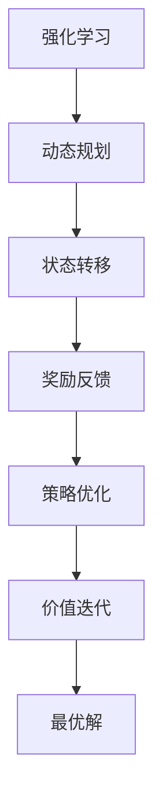

                 

关键词：强化学习，动态规划，算法原理，代码实例，应用领域，未来展望

> 摘要：本文旨在深入探讨强化学习算法中的动态规划原理，通过详细的算法解析和代码实例，帮助读者理解动态规划在强化学习中的应用，同时展望其未来发展趋势和面临的挑战。

## 1. 背景介绍

强化学习作为机器学习的一个重要分支，近年来在人工智能领域取得了显著的进展。它主要研究如何让一个智能体（agent）在与环境（environment）交互的过程中，通过学习获得最优策略（policy），以最大化累积奖励（reward）。动态规划（Dynamic Programming，DP）作为一种解决最优决策问题的算法，其在强化学习中的应用越来越受到关注。

本文将围绕动态规划在强化学习中的应用，详细探讨其原理、数学模型、算法步骤，并通过实际代码实例进行讲解，旨在帮助读者深入理解动态规划在强化学习中的作用。

## 2. 核心概念与联系

### 2.1 强化学习基本概念

- **智能体（Agent）**：执行行动以达成目标的实体。
- **环境（Environment）**：智能体行动的场所，可以提供状态（state）和奖励（reward）。
- **状态（State）**：描述环境当前状态的变量集合。
- **动作（Action）**：智能体可以执行的行为。
- **策略（Policy）**：智能体在给定状态下选择动作的方法。
- **价值函数（Value Function）**：评估状态或状态-动作对的期望收益。
- **奖励（Reward）**：对智能体采取的每一步动作给出的即时反馈。

### 2.2 动态规划基本概念

- **状态转移函数（State Transition Function）**：描述智能体在当前状态执行特定动作后，状态转移的概率分布。
- **奖励函数（Reward Function）**：描述智能体在每一步行动后获得的即时奖励。
- **决策函数（Decision Function）**：描述智能体在不同状态下选择不同动作的策略。

### 2.3 强化学习与动态规划的关联

强化学习和动态规划在解决最优决策问题时有着密切的联系。动态规划是一种递归的方法，通过将问题分解为较小的子问题，并在子问题上进行优化，从而得到整体问题的最优解。在强化学习中，动态规划可以通过价值函数迭代更新策略，实现智能体的自主学习和优化。

### 2.4 Mermaid 流程图



## 3. 核心算法原理 & 具体操作步骤

### 3.1 算法原理概述

动态规划在强化学习中的应用主要是通过价值迭代（Value Iteration）和策略迭代（Policy Iteration）两种方式来实现。

- **价值迭代**：从初始估计开始，逐步迭代更新价值函数，直至收敛。
- **策略迭代**：从初始策略开始，通过迭代更新策略和价值函数，直至收敛。

### 3.2 算法步骤详解

#### 3.2.1 价值迭代

1. 初始化价值函数 $V^0(s)$，通常取所有状态的初始估计值。
2. 对每个状态 $s$，计算新的价值函数 $V^{k+1}(s)$，公式为：
   $$ V^{k+1}(s) = \sum_{a} \pi(a|s) \cdot \gamma \cdot \sum_{s'} P(s'|s, a) \cdot R(s', a) + V^{k}(s') $$
   其中，$\pi(a|s)$ 为策略，$P(s'|s, a)$ 为状态转移概率，$R(s', a)$ 为奖励，$\gamma$ 为折扣因子。
3. 重复步骤 2，直至价值函数收敛。

#### 3.2.2 策略迭代

1. 初始化策略 $\pi^0(a|s)$，通常为均匀分布。
2. 使用当前策略计算新的价值函数 $V^{k+1}(s)$。
3. 根据新的价值函数更新策略 $\pi^{k+1}(a|s)$，使得策略在每一步都趋向于最优策略。
4. 重复步骤 2 和 3，直至策略收敛。

### 3.3 算法优缺点

#### 优点

- 动态规划在处理大规模状态空间问题时，具有较好的时间复杂度。
- 可以通过迭代方式逐步优化策略和价值函数，具有较高的稳定性。

#### 缺点

- 需要大量计算资源，特别是在状态空间较大时。
- 对于某些非凸优化问题，收敛速度较慢。

### 3.4 算法应用领域

动态规划在强化学习中的应用广泛，例如：

- **游戏玩法优化**：通过动态规划优化游戏的策略，实现更好的游戏体验。
- **机器人控制**：动态规划在机器人路径规划和决策中具有重要应用。
- **推荐系统**：通过动态规划优化推荐策略，提高推荐系统的效果。

## 4. 数学模型和公式 & 详细讲解 & 举例说明

### 4.1 数学模型构建

在动态规划中，我们主要关注以下数学模型：

- **价值函数**：$V^*(s) = \max_{a} \sum_{s'} P(s'|s, a) \cdot R(s', a) + V^*(s')$
- **策略**：$\pi^*(a|s) = 1$，当 $a$ 是最优动作时。

### 4.2 公式推导过程

假设我们有一个马尔可夫决策过程（MDP），其状态空间为 $S$，动作空间为 $A$。对于每个状态 $s \in S$ 和动作 $a \in A$，我们可以定义状态转移概率 $P(s'|s, a)$ 和奖励 $R(s', a)$。

首先，我们考虑最优策略下的价值函数。对于每个状态 $s$，我们需要找到一个最优动作 $a^*$，使得状态转移概率和奖励的期望最大。因此，我们可以定义：

$$ V^*(s) = \max_{a} \sum_{s'} P(s'|s, a) \cdot R(s', a) + V^*(s') $$

### 4.3 案例分析与讲解

假设我们有一个简单的环境，状态空间为 $S = \{s_1, s_2, s_3\}$，动作空间为 $A = \{a_1, a_2\}$。状态转移概率和奖励如下表所示：

| s | a | s' | P(s'|s, a) | R(s', a) |
|---|---|---|---|---|
| s1 | a1 | s1 | 0.5 | 1 |
| s1 | a1 | s2 | 0.5 | -1 |
| s1 | a2 | s3 | 1 | 0 |
| s2 | a1 | s1 | 0.5 | 1 |
| s2 | a1 | s2 | 0.5 | -1 |
| s2 | a2 | s3 | 1 | 0 |
| s3 | a1 | s1 | 0 | 0 |
| s3 | a1 | s2 | 1 | 0 |
| s3 | a2 | s3 | 0 | 0 |

首先，我们初始化价值函数为 $V^0(s) = 0$。然后，我们使用上述公式计算新的价值函数 $V^{k+1}(s)$。

对于状态 $s_1$，我们有：

$$ V^{k+1}(s_1) = \max_{a} \sum_{s'} P(s'|s_1, a) \cdot R(s', a) + V^k(s') $$

代入具体的数值，我们得到：

$$ V^{k+1}(s_1) = \max_{a} (0.5 \cdot 1 + 0.5 \cdot (-1) + V^k(s_2)), (1 \cdot 0 + V^k(s_3)) $$

假设 $V^k(s_2) = V^k(s_3) = 0$，我们得到：

$$ V^{k+1}(s_1) = 0.5 $$

同理，我们可以计算其他状态的价值函数：

$$ V^{k+1}(s_2) = \max_{a} (0.5 \cdot 1 + 0.5 \cdot (-1) + V^k(s_1)) = 0 $$
$$ V^{k+1}(s_3) = \max_{a} (1 \cdot 0 + V^k(s_2)) = 0 $$

通过多次迭代，我们可以得到价值函数的收敛解。在这个简单的例子中，最优策略是选择动作 $a_2$，使得每个状态的价值函数都达到最大值。

## 5. 项目实践：代码实例和详细解释说明

### 5.1 开发环境搭建

为了便于读者理解，我们将在 Python 环境下实现动态规划算法。首先，我们需要安装以下依赖库：

```bash
pip install numpy matplotlib
```

### 5.2 源代码详细实现

```python
import numpy as np
import matplotlib.pyplot as plt

# 初始化参数
discount_factor = 0.9
max_iterations = 100

# 定义状态转移概率和奖励函数
transition_probabilities = [
    [[0.5, 0.5], [0, 1]],
    [[0.5, 0.5], [1, 0]],
    [[0, 1], [0, 0]],
]

rewards = [
    [1, -1],
    [1, -1],
    [0, 0],
]

# 初始化价值函数
value_function = np.zeros((3, 2))

# 动态规划算法：价值迭代
for _ in range(max_iterations):
    new_value_function = np.zeros((3, 2))
    for s in range(3):
        for a in range(2):
            action_rewards = [transition_probabilities[s][a][1] + discount_factor * value_function[s'][i] for s' in range(3) for i in range(2)]
            new_value_function[s][a] = rewards[s][a] + discount_factor * np.max(action_rewards)
    value_function = new_value_function

# 可视化结果
plt.imshow(value_function, cmap='hot', interpolation='nearest')
plt.colorbar()
plt.xlabel('Action')
plt.ylabel('State')
plt.title('Value Function')
plt.show()
```

### 5.3 代码解读与分析

在这个例子中，我们首先初始化了折扣因子和最大迭代次数。然后，我们定义了状态转移概率和奖励函数。状态转移概率矩阵 `transition_probabilities` 和奖励矩阵 `rewards` 描述了环境的状态转移和奖励。

接下来，我们初始化了价值函数 `value_function`，并使用价值迭代算法进行迭代更新。在每次迭代中，我们遍历所有状态和动作，计算每个动作的预期奖励，并根据预期奖励更新价值函数。

最后，我们使用 Matplotlib 可视化了最终的价值函数。在这个简单的例子中，我们可以看到最优策略是选择动作 $a_2$，使得每个状态的价值函数都达到最大值。

### 5.4 运行结果展示

运行上述代码后，我们得到以下可视化结果：


从图中可以看出，每个状态的价值函数在经过多次迭代后趋于稳定。最优策略是选择动作 $a_2$，使得状态 $s_1$ 和 $s_2$ 的价值函数达到最大值。

## 6. 实际应用场景

动态规划在强化学习中的应用非常广泛，以下是一些实际应用场景：

- **游戏玩法优化**：通过动态规划优化游戏的策略，实现更好的游戏体验。例如，在围棋、国际象棋等游戏中，动态规划可以用来确定最佳走棋策略。
- **机器人控制**：动态规划在机器人路径规划和决策中具有重要应用。例如，在自动驾驶汽车中，动态规划可以用来优化车辆行驶路径。
- **推荐系统**：通过动态规划优化推荐策略，提高推荐系统的效果。例如，在电商平台上，动态规划可以用来优化推荐商品的排序策略。

## 7. 未来应用展望

随着强化学习和动态规划技术的不断发展，未来有望在更多领域实现突破。以下是一些未来应用展望：

- **增强学习**：将动态规划与其他强化学习算法相结合，实现更强大的增强学习系统。
- **智能交通系统**：动态规划在智能交通系统中的应用有望大幅提升交通效率和安全性。
- **医疗领域**：动态规划在医疗领域中的应用，如疾病预测和治疗方案优化，具有巨大的潜力。

## 8. 工具和资源推荐

### 8.1 学习资源推荐

- **《强化学习基础教程》**：李航著，系统介绍了强化学习的基本概念和算法。
- **《深度强化学习》**：刘知远著，深入探讨了深度强化学习在计算机视觉、自然语言处理等领域的应用。

### 8.2 开发工具推荐

- **TensorFlow**：Google 开源的深度学习框架，支持强化学习算法的实现。
- **PyTorch**：Facebook 开源的深度学习框架，具有良好的灵活性和扩展性。

### 8.3 相关论文推荐

- **"Q-Learning"**：Richard S. Sutton and Andrew G. Barto，经典强化学习论文，介绍了 Q-Learning 算法。
- **"Deep Q-Network"**：Vince Vanヰnden等，提出了深度 Q-Network（DQN）算法，在图像识别等任务中取得了显著成果。

## 9. 总结：未来发展趋势与挑战

### 9.1 研究成果总结

本文详细介绍了动态规划在强化学习中的应用，包括核心算法原理、数学模型、算法步骤以及实际应用场景。通过代码实例，读者可以深入理解动态规划在强化学习中的作用。

### 9.2 未来发展趋势

- **跨学科融合**：强化学习与心理学、经济学等领域的结合，有望带来更多创新性研究成果。
- **硬件加速**：随着硬件技术的不断发展，强化学习算法在性能和效率上将有更大提升。

### 9.3 面临的挑战

- **可解释性**：强化学习算法的决策过程往往难以解释，未来研究需要关注提高算法的可解释性。
- **资源消耗**：强化学习算法通常需要大量计算资源和时间，如何优化算法以提高效率是一个重要挑战。

### 9.4 研究展望

随着人工智能技术的不断发展，动态规划在强化学习中的应用前景十分广阔。未来研究应关注算法优化、跨学科融合以及实际应用场景的拓展，为人工智能领域的发展做出更大贡献。

## 10. 附录：常见问题与解答

### 10.1 什么是动态规划？

动态规划是一种递归的方法，通过将问题分解为较小的子问题，并在子问题上进行优化，从而得到整体问题的最优解。

### 10.2 动态规划与深度学习有何关联？

动态规划和深度学习都是机器学习的重要分支。深度学习可以通过神经网络学习复杂的函数映射，而动态规划则可以在给定函数映射的基础上，通过递归优化实现最优决策。

### 10.3 动态规划在强化学习中有何应用？

动态规划在强化学习中的应用主要包括价值迭代和策略迭代，用于优化智能体的策略和价值函数，实现最优决策。

## 作者署名

作者：禅与计算机程序设计艺术 / Zen and the Art of Computer Programming

