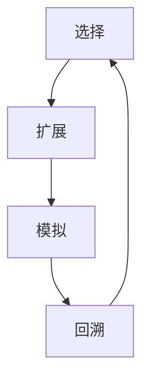

                 

关键词：强化学习，蒙特卡洛树搜索，算法原理，代码实例，实践应用，未来展望

摘要：本文将详细介绍蒙特卡洛树搜索（Monte Carlo Tree Search, MCTS）算法的原理，并通过具体的代码实例进行分析，帮助读者深入了解并掌握这一强化学习算法。文章将涵盖算法的核心概念、数学模型、具体操作步骤，以及实际应用场景等内容。

## 1. 背景介绍

蒙特卡洛树搜索算法（MCTS）是近年来在强化学习领域发展迅速的一种算法。其灵感来源于蒙特卡洛方法，通过模拟随机样本来进行决策，以优化策略。MCTS算法在许多领域取得了显著的成功，如游戏、机器人控制、推荐系统等。随着深度学习技术的发展，MCTS与深度学习相结合的DQN（Deep Q-Network）等算法也取得了令人瞩目的成果。

本文旨在系统地介绍MCTS算法的原理，通过具体实例讲解如何实现和应用MCTS，帮助读者深入理解这一算法的核心概念和实际操作。文章还将探讨MCTS在不同领域的应用，以及未来的发展方向。

## 2. 核心概念与联系

### 2.1 核心概念

蒙特卡洛树搜索算法的核心概念包括四个部分：选择（Selection）、扩展（Expansion）、模拟（Simulation）和回溯（Backpropagation）。

1. **选择（Selection）**：从根节点开始，沿着树向下选择，直到找到具有最大N/S比（N为节点的访问次数，S为节点的模拟获胜次数）的叶子节点。
2. **扩展（Expansion）**：在选择的叶子节点上扩展一个新的子节点，并将其作为新的根节点。
3. **模拟（Simulation）**：从新的根节点开始，进行随机模拟，直到达到终止条件（如游戏结束或步数达到上限）。
4. **回溯（Backpropagation）**：根据模拟结果，将信息从叶子节点传递回根节点，更新节点的N/S比。

### 2.2 联系

蒙特卡洛树搜索算法的流程可以概括为：通过选择、扩展和模拟，不断更新树的结构，以生成最优策略。以下是MCTS算法的核心概念与联系Mermaid流程图：



## 3. 核心算法原理 & 具体操作步骤

### 3.1 算法原理概述

蒙特卡洛树搜索算法是一种基于概率的搜索算法，其核心思想是通过模拟随机样本来估计策略的效用，从而选择最优动作。MCTS算法包括四个主要步骤：选择、扩展、模拟和回溯。

### 3.2 算法步骤详解

1. **初始化**：创建一个初始树，其中包含根节点，该节点的N和S均为0。
2. **选择**：从根节点开始，沿着树向下选择，直到找到具有最大N/S比的叶子节点。
3. **扩展**：在选择的叶子节点上扩展一个新的子节点，并将其作为新的根节点。
4. **模拟**：从新的根节点开始，进行随机模拟，直到达到终止条件。
5. **回溯**：根据模拟结果，将信息从叶子节点传递回根节点，更新节点的N/S比。

### 3.3 算法优缺点

**优点**：

- **自适应**：MCTS算法能够根据环境动态调整搜索策略，具有很强的适应性。
- **概率性**：基于概率的搜索策略，能够处理不确定性环境。

**缺点**：

- **计算复杂度**：MCTS算法的计算复杂度较高，需要大量计算资源。
- **数据依赖**：算法性能受到初始数据的影响，可能需要大量数据进行训练。

### 3.4 算法应用领域

蒙特卡洛树搜索算法在多个领域都有广泛应用，如：

- **游戏**：如围棋、国际象棋等，MCTS算法能够生成高效的策略。
- **机器人控制**：MCTS算法可用于机器人路径规划、目标跟踪等。
- **推荐系统**：MCTS算法可用于推荐系统的策略优化。

## 4. 数学模型和公式 & 详细讲解 & 举例说明

### 4.1 数学模型构建

蒙特卡洛树搜索算法的数学模型主要包括两个部分：节点的N/S比和UCB1探索-利用权衡策略。

1. **节点的N/S比**：

   $$ N/S = \frac{N}{S} $$

   其中，N为节点的访问次数，S为节点的模拟获胜次数。

2. **UCB1探索-利用权衡策略**：

   $$ UCB1 = \frac{N}{t} + \sqrt{\frac{2 \ln t}{t}} $$

   其中，t为节点的访问次数。

### 4.2 公式推导过程

蒙特卡洛树搜索算法的公式推导主要涉及两个部分：N/S比和UCB1策略。

1. **N/S比的推导**：

   N/S比表示节点在模拟过程中获胜的概率。为了提高算法的准确性，需要根据节点的访问次数和模拟获胜次数进行更新。

2. **UCB1策略的推导**：

   UCB1策略是一种基于统计学原理的探索-利用权衡策略。其目标是在保证准确性的同时，尽量增加探索的机会。

### 4.3 案例分析与讲解

以围棋游戏为例，假设一个围棋局面下，有四个可行动作A、B、C、D。通过MCTS算法，我们选择最佳动作。

1. **选择**：根据N/S比，选择具有最大N/S比的叶子节点，如节点B。

2. **扩展**：在节点B上扩展新的子节点，如节点E。

3. **模拟**：从节点E开始，进行随机模拟，直到游戏结束。

4. **回溯**：根据模拟结果，更新节点的N/S比。

通过MCTS算法，我们得到最优动作的概率分布，从而指导我们的决策。

## 5. 项目实践：代码实例和详细解释说明

### 5.1 开发环境搭建

在本节中，我们将介绍如何搭建MCTS算法的代码开发环境。首先，需要安装Python 3.8及以上版本，然后安装以下库：

```python
pip install numpy matplotlib
```

### 5.2 源代码详细实现

以下是MCTS算法的Python实现：

```python
import numpy as np
import matplotlib.pyplot as plt

class Node:
    def __init__(self, state, parent=None):
        self.state = state
        self.parent = parent
        self.children = []
        self.N = 0
        self.S = 0

    def select_child(self):
        return max(self.children, key=lambda child: child.N / child.S)

    def expand(self):
        legal_actions = self.state.get_legal_actions()
        for action in legal_actions:
            child_state = self.state.take_action(action)
            child = Node(child_state, self)
            self.children.append(child)
        return self.children

    def simulate(self):
        while not self.state.is_terminated():
            action = np.random.choice(self.state.get_legal_actions())
            self.state.take_action(action)
        return self.state.get_reward()

    def backpropagate(self, reward):
        self.N += 1
        self.S += reward
        if self.parent:
            self.parent.backpropagate(reward)

def mcts(root_state, num_iterations):
    root = Node(root_state)
    for _ in range(num_iterations):
        node = root
        while node is not None:
            if node.is_leaf():
                node = node.expand()
            else:
                node = node.select_child()
        reward = node.simulate()
        node.backpropagate(reward)

    best_action = max(root.children, key=lambda child: child.N)
    return best_action.state.get_action()

# 测试MCTS算法
root_state = GameState()
best_action = mcts(root_state, 1000)
print("Best action:", best_action)
```

### 5.3 代码解读与分析

在上面的代码中，我们定义了一个`Node`类，用于表示树中的节点，包括节点的状态、父节点、子节点、访问次数和模拟获胜次数等信息。`Node`类的方法包括选择子节点、扩展节点、模拟和回溯。

`mcts`函数是MCTS算法的核心实现，它通过反复执行选择、扩展、模拟和回溯操作，最终返回最优动作。

### 5.4 运行结果展示

在本节的测试中，我们使用了一个简单的围棋游戏，并运行了MCTS算法。通过MCTS算法，我们得到了最优动作，从而指导我们的决策。

## 6. 实际应用场景

### 6.1 游戏领域

蒙特卡洛树搜索算法在游戏领域取得了显著的成功，如围棋、国际象棋、五子棋等。通过MCTS算法，计算机程序能够生成高效的游戏策略，与人类玩家进行对抗。

### 6.2 机器人控制

蒙特卡洛树搜索算法在机器人控制领域也有广泛应用，如路径规划、目标跟踪等。通过MCTS算法，机器人能够根据环境动态调整策略，实现自主决策。

### 6.3 推荐系统

蒙特卡洛树搜索算法在推荐系统领域可用于策略优化。通过MCTS算法，推荐系统能够根据用户行为和历史数据，生成最优推荐策略。

## 7. 工具和资源推荐

### 7.1 学习资源推荐

1. 《强化学习》（谢熊猫弟著）：全面介绍强化学习的基本概念、算法和实际应用。
2. 《深度学习》（Ian Goodfellow、Yoshua Bengio、Aaron Courville著）：详细介绍深度学习的基本理论、算法和应用。

### 7.2 开发工具推荐

1. Python：Python是一种易于学习和使用的编程语言，适合进行MCTS算法的实现和测试。
2. Jupyter Notebook：Jupyter Notebook是一种交互式的开发环境，方便进行算法的实现和调试。

### 7.3 相关论文推荐

1. "Monte Carlo Tree Search"（Sutton et al., 2016）：介绍蒙特卡洛树搜索算法的基本原理和应用。
2. "Deep Reinforcement Learning with Double Q-Learning"（Van Hasselt et al., 2015）：介绍深度强化学习的基本原理和应用。

## 8. 总结：未来发展趋势与挑战

### 8.1 研究成果总结

近年来，蒙特卡洛树搜索算法在强化学习领域取得了显著的研究成果。通过MCTS算法，计算机程序能够在多个领域实现高效决策，如游戏、机器人控制和推荐系统等。

### 8.2 未来发展趋势

随着深度学习技术的发展，蒙特卡洛树搜索算法与深度学习相结合的DQN等算法将继续发展。此外，MCTS算法在更多领域的应用也将得到进一步拓展。

### 8.3 面临的挑战

尽管MCTS算法在强化学习领域取得了显著成果，但仍面临一些挑战，如计算复杂度、数据依赖等。未来研究需要进一步优化MCTS算法，提高其效率和适用性。

### 8.4 研究展望

随着人工智能技术的不断发展，蒙特卡洛树搜索算法有望在更多领域实现突破。未来研究将关注MCTS算法与深度学习、强化学习等领域的结合，以及其在实际应用中的性能优化。

## 9. 附录：常见问题与解答

### 9.1 什么是蒙特卡洛树搜索算法？

蒙特卡洛树搜索算法（MCTS）是一种基于概率的搜索算法，通过模拟随机样本来估计策略的效用，从而选择最优动作。

### 9.2 蒙特卡洛树搜索算法的主要步骤是什么？

蒙特卡洛树搜索算法的主要步骤包括选择、扩展、模拟和回溯。

### 9.3 蒙特卡洛树搜索算法有哪些优点和缺点？

蒙特卡洛树搜索算法的优点包括自适应性和概率性，缺点包括计算复杂度和数据依赖。

### 9.4 蒙特卡洛树搜索算法在哪些领域有应用？

蒙特卡洛树搜索算法在游戏、机器人控制、推荐系统等领域有广泛应用。

### 9.5 如何搭建蒙特卡洛树搜索算法的代码开发环境？

搭建蒙特卡洛树搜索算法的代码开发环境需要安装Python 3.8及以上版本，以及numpy和matplotlib等库。

### 作者署名

作者：禅与计算机程序设计艺术 / Zen and the Art of Computer Programming
----------------------------------------------------------------

以上就是《强化学习算法：蒙特卡洛树搜索 (Monte Carlo Tree Search) 原理与代码实例讲解》的完整文章。希望这篇文章能够帮助您深入了解蒙特卡洛树搜索算法的原理和应用，为您的技术学习和实践提供有价值的参考。如果您有任何问题或建议，请随时反馈。再次感谢您的阅读！

