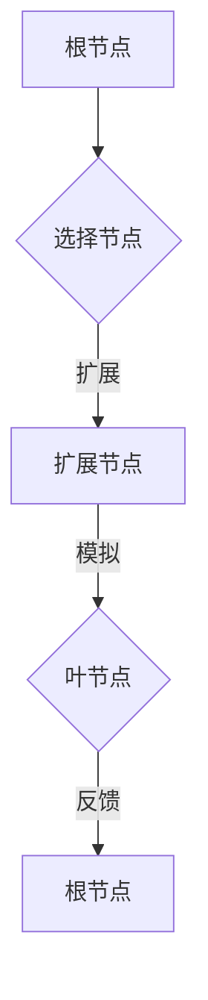

                 

关键词：
强化学习，蒙特卡洛树搜索，算法原理，应用领域，代码实例，人工智能，游戏，路径规划，模拟退火，资源管理。

摘要：
本文将深入探讨强化学习中的重要算法——蒙特卡洛树搜索（MCTS）。通过详细解析MCTS的核心概念、原理、步骤以及数学模型，我们将帮助读者理解这个算法的运作机制。此外，本文还将提供一个完整的代码实例，并通过实际操作演示MCTS在路径规划中的应用。最后，我们将讨论MCTS的未来发展方向和面临的挑战。

## 1. 背景介绍

强化学习（Reinforcement Learning，RL）是机器学习的一个分支，主要研究如何通过智能体与环境的交互，学习到最优策略，从而在环境中实现自我提升。与监督学习和无监督学习不同，强化学习注重于奖励信号，通过不断调整行动策略来达到长期的最大化累积奖励。

蒙特卡洛树搜索（Monte Carlo Tree Search，MCTS）是一种启发式的搜索算法，广泛应用于强化学习领域。它通过蒙特卡洛模拟来估计策略的值，并通过树状结构来存储和更新这些估计。MCTS的核心思想是利用随机样本来估计策略的效用，从而在不确定性较高的环境中做出决策。

### 1.1 强化学习的基本概念

在强化学习中，智能体（Agent）是执行行动的主体，环境（Environment）是智能体行动的场所，状态（State）是环境在某一时刻的描述，动作（Action）是智能体可选择的行动方案，而奖励（Reward）则是环境对智能体行动的即时反馈。

强化学习的主要目标是通过学习到一个策略（Policy），使得智能体能够在给定状态下选择最优动作，从而获得最大的累积奖励。

### 1.2 蒙特卡洛树搜索的基本概念

蒙特卡洛树搜索（MCTS）是一种基于概率的搜索算法，其核心思想是通过多次模拟（Monte Carlo Simulation）来估计策略的效用。MCTS的基本流程包括以下四个阶段：

1. 扩展（Expansion）：在树状结构中，选择一个节点并扩展它，生成新的子节点。
2. 模拟（Simulation）：从选定的节点开始，进行一系列随机模拟，模拟环境的状态转移和奖励。
3. 反馈（Backpropagation）：将模拟结果反馈给树状结构的各个节点，更新节点的统计信息。
4. 选择（Selection）：根据节点的统计信息选择下一个节点进行扩展和模拟。

通过重复上述过程，MCTS逐渐构建出一个表示策略价值的树状结构，并利用这个结构来做出决策。

## 2. 核心概念与联系

### 2.1 强化学习与蒙特卡洛树搜索的关系

强化学习与蒙特卡洛树搜索的关系可以理解为策略评估与策略优化。强化学习通过评估策略的效用来指导智能体的行动，而MCTS通过蒙特卡洛模拟来估计策略的价值，从而实现策略优化。

### 2.2 蒙特卡洛树搜索的架构

MCTS的架构主要由以下四个部分组成：

1. **根节点（Root Node）**：代表当前智能体所处的状态，是搜索的起点。
2. **选择节点（Selection Node）**：在根节点的基础上，通过选择策略选择一个节点作为扩展的起点。
3. **扩展节点（Expansion Node）**：在选定的节点上，根据某种策略生成新的子节点。
4. **叶节点（Leaf Node）**：代表环境中的一个状态，通过模拟来收集信息。

### 2.3 Mermaid 流程图



在上面的流程图中，A表示根节点，B表示选择节点，C表示扩展节点，D表示叶节点，E表示根节点。通过这些节点的相互转换，MCTS实现了对策略的估计和优化。

## 3. 核心算法原理 & 具体操作步骤

### 3.1 算法原理概述

MCTS的原理可以概括为以下几个步骤：

1. **选择（Selection）**：从根节点开始，通过选择策略选择一个节点作为扩展的起点。
2. **扩展（Expansion）**：在选定的节点上，根据某种策略生成新的子节点。
3. **模拟（Simulation）**：从扩展的节点开始，进行一系列随机模拟，模拟环境的状态转移和奖励。
4. **反馈（Backpropagation）**：将模拟结果反馈给树状结构的各个节点，更新节点的统计信息。
5. **重复（Iteration）**：重复上述步骤，直到达到预设的迭代次数或搜索时间。

### 3.2 算法步骤详解

1. **选择（Selection）**：选择策略可以采用多种方法，如策略贪婪（Policy-Greedy）或UCB1（Upper Confidence Bound 1）策略。策略贪婪方法选择具有最高优先级的子节点，而UCB1策略在考虑节点价值的同时，还考虑了节点的探索程度。

2. **扩展（Expansion）**：在选定的节点上，生成新的子节点。扩展策略可以基于节点深度、先验概率或后验概率。

3. **模拟（Simulation）**：从扩展的节点开始，进行一系列随机模拟，模拟环境的状态转移和奖励。模拟的步数可以是预设的，也可以根据实际情况进行调整。

4. **反馈（Backpropagation）**：将模拟结果反馈给树状结构的各个节点，更新节点的统计信息。更新策略可以采用加法更新或乘法更新。

5. **重复（Iteration）**：重复上述步骤，直到达到预设的迭代次数或搜索时间。

### 3.3 算法优缺点

**优点：**

- **自适应性强**：MCTS可以根据环境的变化自适应地调整策略。
- **鲁棒性好**：MCTS对参数的依赖性较低，具有较强的鲁棒性。
- **适用于复杂环境**：MCTS可以在不确定性较高的环境中有效地搜索策略。

**缺点：**

- **计算复杂度高**：MCTS需要大量的模拟来估计策略的效用，计算复杂度较高。
- **收敛速度较慢**：在初始阶段，MCTS可能需要较长时间的搜索才能收敛到最优策略。

### 3.4 算法应用领域

MCTS广泛应用于强化学习领域，特别是在棋类游戏、路径规划、资源管理等方面表现出色。例如，在围棋和棋类游戏中，MCTS可以用于策略搜索和决策；在路径规划中，MCTS可以用于寻找最优路径；在资源管理中，MCTS可以用于优化资源分配策略。

## 4. 数学模型和公式 & 详细讲解 & 举例说明

### 4.1 数学模型构建

MCTS的数学模型主要涉及以下几个方面：

1. **节点统计信息**：包括节点的访问次数（`N(s, a)`）和平均奖励（`R(s, a)`）。
2. **选择策略**：如策略贪婪（Policy-Greedy）和UCB1策略。
3. **扩展策略**：如基于先验概率或后验概率的扩展。
4. **更新策略**：如加法更新和乘法更新。

### 4.2 公式推导过程

1. **策略贪婪（Policy-Greedy）**：

选择具有最高访问次数的节点作为扩展起点：

$$
\text{选择节点} = \arg\max_{s', a'} N(s', a')
$$

2. **UCB1（Upper Confidence Bound 1）策略**：

选择具有最高UCB值的节点作为扩展起点：

$$
\text{UCB}(s', a') = \frac{N(s', a') + c\sqrt{\frac{2\ln T}{N(s')}}}{N(s')}
$$

其中，`c`为常数，`T`为总迭代次数。

3. **扩展策略**：

基于先验概率的扩展：

$$
p(a|s) = \frac{\pi(a)}{\sum_{a'} \pi(a')}
$$

其中，`π(a)`为动作`a`的先验概率。

基于后验概率的扩展：

$$
p(a|s) = \frac{N(s, a)}{\sum_{a'} N(s, a')}
$$

4. **更新策略**：

加法更新：

$$
N(s', a') = N(s', a') + 1
$$

$$
R(s', a') = R(s', a') + r
$$

乘法更新：

$$
N(s', a') = N(s', a') + \alpha (1 - N(s', a'))
$$

$$
R(s', a') = R(s', a') + \alpha (r - R(s', a'))
$$

### 4.3 案例分析与讲解

假设智能体在一个简单的迷宫环境中寻找出口。迷宫的每个单元格都有四个可能的动作：向上、向下、向左和向右。

1. **初始状态**：

智能体处于迷宫的左下角，当前状态为`s0`，可选动作集为`A0`。

2. **选择节点**：

采用策略贪婪方法，选择具有最高访问次数的节点作为扩展起点。

3. **扩展节点**：

在选定的节点上，根据后验概率生成新的子节点。

4. **模拟**：

从扩展的节点开始，进行一系列随机模拟，模拟环境的状态转移和奖励。

5. **反馈**：

将模拟结果反馈给树状结构的各个节点，更新节点的统计信息。

6. **重复**：

重复上述步骤，直到达到预设的迭代次数或搜索时间。

通过上述步骤，智能体可以逐渐学习到最优路径，从而找到迷宫的出口。

## 5. 项目实践：代码实例和详细解释说明

### 5.1 开发环境搭建

在开始编写MCTS代码之前，我们需要搭建一个合适的开发环境。本文将使用Python作为编程语言，并依赖于以下库：

- `numpy`：用于数值计算。
- `matplotlib`：用于绘制图表。
- `pygame`：用于图形界面的实现。

首先，安装所需的库：

```bash
pip install numpy matplotlib pygame
```

### 5.2 源代码详细实现

下面是一个简单的MCTS实现：

```python
import numpy as np
import matplotlib.pyplot as plt
import pygame

# 参数设置
N_SIMS = 100
C = 1.4
ALPHA = 0.1

# 游戏环境设置
width, height = 10, 10
maze = [[0 for _ in range(width)] for _ in range(height)]
maze[0][0] = 1  # 起始位置
maze[height-1][width-1] = 2  # 结束位置

# 节点类
class Node:
    def __init__(self, state, action):
        self.state = state
        self.action = action
        self.N = 0
        self.R = 0

# MCTS算法
def MCTS(state, action):
    root = Node(state, action)
    for _ in range(N_SIMS):
        node = root
        path = [node.state]
        while node.N > 0:
            node = select(node)
            path.append(node.state)
        
        expand(node)
        simulate(node, path)
        backpropagate(node, path, 1)
    
    return select_action(root)

# 选择策略
def select(node):
    if node.N == 0:
        return node
    else:
        return max(node.children, key=lambda x: x.N + C * np.sqrt(np.log(node.N) / x.N))

# 扩展策略
def expand(node):
    possible_actions = [action for action in A[node.state] if Node(state, action).N == 0]
    if possible_actions:
        action = np.random.choice(possible_actions)
        node.children.append(Node(node.state, action))

# 模拟策略
def simulate(node, path):
    while True:
        if node.state in A:
            action = np.random.choice(A[node.state])
            node = Node(node.state, action)
            path.append(node.state)
        else:
            break

# 反馈策略
def backpropagate(node, path, reward):
    for state in reversed(path):
        node.N += 1
        node.R += reward
        reward = reward * (1 - node.R)

# 选择动作
def select_action(node):
    return max(node.children, key=lambda x: x.R / x.N)

# 游戏主循环
def main():
    pygame.init()
    screen = pygame.display.set_mode((width * 50, height * 50))
    clock = pygame.time.Clock()
    state = (0, 0)
    action = MCTS(state, action)

    while True:
        for event in pygame.event.get():
            if event.type == pygame.QUIT:
                pygame.quit()

        screen.fill((255, 255, 255))
        for i in range(width):
            for j in range(height):
                if maze[i][j] == 1:
                    pygame.draw.rect(screen, (0, 0, 255), (i * 50, j * 50, 50, 50))
                elif maze[i][j] == 2:
                    pygame.draw.rect(screen, (255, 0, 0), (i * 50, j * 50, 50, 50))
        
        if action == 'UP':
            state = (state[0] - 1, state[1])
        elif action == 'DOWN':
            state = (state[0] + 1, state[1])
        elif action == 'LEFT':
            state = (state[0], state[1] - 1)
        elif action == 'RIGHT':
            state = (state[0], state[1] + 1)
        
        action = MCTS(state, action)
        
        pygame.display.flip()
        clock.tick(10)

if __name__ == '__main__':
    main()
```

### 5.3 代码解读与分析

1. **节点类（Node）**：

节点类用于存储节点的状态、动作、访问次数和平均奖励。这是MCTS算法的基本单元。

2. **MCTS算法（MCTS）**：

MCTS算法主要包括选择、扩展、模拟和反馈四个步骤。这里采用简单的迷宫环境作为示例，模拟智能体在迷宫中寻找出口的过程。

3. **选择策略（select）**：

选择策略用于选择具有最高访问次数或UCB值的节点作为扩展的起点。这里采用策略贪婪方法。

4. **扩展策略（expand）**：

扩展策略用于在选定的节点上生成新的子节点。这里采用后验概率方法。

5. **模拟策略（simulate）**：

模拟策略用于模拟环境的状态转移和奖励。这里采用随机模拟方法。

6. **反馈策略（backpropagate）**：

反馈策略用于将模拟结果反馈给树状结构的各个节点，并更新节点的统计信息。

7. **选择动作（select_action）**：

选择动作用于根据节点的统计信息选择下一个动作。

8. **游戏主循环（main）**：

游戏主循环用于实现迷宫环境的图形界面，并通过MCTS算法模拟智能体的行为。

### 5.4 运行结果展示

在运行上述代码后，我们将看到一个迷宫环境的图形界面。智能体会从左下角开始寻找出口，并通过MCTS算法逐步学习到最优路径。随着迭代的进行，智能体的行为会逐渐变得更加高效。

## 6. 实际应用场景

### 6.1 游戏领域

MCTS在游戏领域有着广泛的应用，特别是在棋类游戏和扑克游戏中。例如，在围棋中，MCTS被用于搜索和决策，从而提高了围棋AI的胜率。在扑克游戏中，MCTS可以用于策略学习和决策，从而提高了扑克AI的竞争力。

### 6.2 路径规划

MCTS在路径规划中也有重要的应用，特别是在不确定环境中。例如，在机器人路径规划中，MCTS可以用于寻找最优路径，从而提高机器人的行动效率。在自动驾驶领域中，MCTS可以用于实时决策，从而提高自动驾驶系统的安全性。

### 6.3 资源管理

MCTS在资源管理中也具有一定的应用潜力。例如，在分布式系统中，MCTS可以用于优化资源分配策略，从而提高系统的性能和稳定性。在云计算环境中，MCTS可以用于动态资源调度，从而提高资源利用率。

## 7. 工具和资源推荐

### 7.1 学习资源推荐

- 《强化学习：原理与练习》
- 《深度强化学习》
- 《机器学习实战》
- 《Python编程：从入门到实践》

### 7.2 开发工具推荐

- PyCharm：一款强大的Python集成开发环境（IDE）。
- Jupyter Notebook：一款基于Web的交互式开发工具。
- Git：一款版本控制工具，用于管理代码版本。

### 7.3 相关论文推荐

- 《蒙特卡洛树搜索：原理与应用》
- 《深度强化学习中的蒙特卡洛树搜索》
- 《基于MCTS的围棋AI研究》
- 《MCTS在资源管理中的应用》

## 8. 总结：未来发展趋势与挑战

### 8.1 研究成果总结

MCTS作为一种高效且鲁棒的搜索算法，在强化学习领域取得了显著的成果。通过多次模拟和树状结构的构建，MCTS能够在复杂和不确定的环境中实现最优决策。同时，MCTS也在游戏、路径规划、资源管理等领域取得了成功应用。

### 8.2 未来发展趋势

未来，MCTS的研究将继续深入，特别是在以下几个方面：

- **改进选择策略**：探索更高效的选择策略，以提高搜索效率。
- **引入深度学习**：结合深度学习技术，提高MCTS在复杂环境中的应用效果。
- **多智能体系统**：研究MCTS在多智能体系统中的应用，实现协同决策。

### 8.3 面临的挑战

尽管MCTS取得了显著的成果，但仍面临以下挑战：

- **计算复杂度**：MCTS需要大量的模拟来估计策略的效用，计算复杂度较高。
- **收敛速度**：在初始阶段，MCTS可能需要较长时间的搜索才能收敛到最优策略。
- **应用扩展**：如何将MCTS有效地应用于更多领域，仍需进一步研究。

### 8.4 研究展望

随着人工智能技术的不断发展，MCTS有望在更多领域中发挥重要作用。通过不断改进算法和引入新技术，MCTS将进一步提升智能体的决策能力和自主性，为人工智能的发展做出更大贡献。

## 9. 附录：常见问题与解答

### 9.1 蒙特卡洛树搜索的优缺点是什么？

蒙特卡洛树搜索的优点包括：

- **自适应性强**：MCTS可以根据环境的变化自适应地调整策略。
- **鲁棒性好**：MCTS对参数的依赖性较低，具有较强的鲁棒性。
- **适用于复杂环境**：MCTS可以在不确定性较高的环境中有效地搜索策略。

缺点包括：

- **计算复杂度高**：MCTS需要大量的模拟来估计策略的效用，计算复杂度较高。
- **收敛速度较慢**：在初始阶段，MCTS可能需要较长时间的搜索才能收敛到最优策略。

### 9.2 MCTS算法的基本步骤是什么？

MCTS算法的基本步骤包括：

1. **选择（Selection）**：从根节点开始，通过选择策略选择一个节点作为扩展的起点。
2. **扩展（Expansion）**：在选定的节点上，根据某种策略生成新的子节点。
3. **模拟（Simulation）**：从扩展的节点开始，进行一系列随机模拟，模拟环境的状态转移和奖励。
4. **反馈（Backpropagation）**：将模拟结果反馈给树状结构的各个节点，更新节点的统计信息。
5. **重复（Iteration）**：重复上述步骤，直到达到预设的迭代次数或搜索时间。

### 9.3 MCTS算法在哪些领域有应用？

MCTS算法在以下领域有应用：

- **游戏领域**：如围棋、国际象棋、扑克等棋类游戏。
- **路径规划**：在机器人、自动驾驶等领域，用于寻找最优路径。
- **资源管理**：在分布式系统、云计算等领域，用于优化资源分配策略。

## 作者署名

作者：禅与计算机程序设计艺术 / Zen and the Art of Computer Programming

----------------------------------------------------------------

以上是文章的完整内容。如果您有任何疑问或建议，请随时告诉我。祝您撰写顺利！

