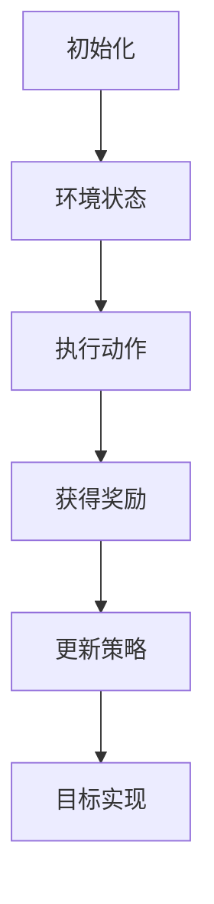

                 

关键词：强化学习、金融风控、应用案例、算法优化

摘要：本文深入探讨了强化学习在金融风控领域的应用。通过介绍强化学习的基本原理，我们将其与金融风控相结合，阐述了强化学习在风险评估、投资策略优化和风险管理等方面的实际应用。此外，本文还分析了强化学习在金融风控中的优势和挑战，为未来研究提供了方向。

## 1. 背景介绍

随着金融市场的发展和复杂性的增加，金融风控变得越来越重要。然而，传统的金融风控方法在应对新兴风险、市场波动和突发事件时，往往表现出较低的效率和准确性。近年来，机器学习和人工智能技术逐渐被应用于金融风控领域，其中强化学习作为一种高效的机器学习方法，具有显著的优势。

强化学习（Reinforcement Learning，RL）是机器学习的一个重要分支，其核心思想是通过与环境的交互，不断调整策略，以实现最优目标。强化学习在游戏、机器人控制和自动驾驶等领域取得了显著的成果。随着金融市场的复杂性和不确定性的增加，强化学习在金融风控领域的应用也越来越受到关注。

## 2. 核心概念与联系

### 2.1 强化学习基本原理

强化学习由四个主要部分组成：代理（Agent）、环境（Environment）、状态（State）和动作（Action）。代理是执行策略的主体，环境是代理所处的场景，状态是环境的当前情况，动作是代理对环境的操作。强化学习的过程可以描述为：代理在环境中执行动作，根据环境的反馈（奖励或惩罚）调整策略，最终实现目标。

### 2.2 强化学习与金融风控的联系

强化学习在金融风控中的应用主要体现在以下几个方面：

1. **风险评估**：通过学习市场数据和历史风险事件，强化学习可以预测潜在的风险，为金融机构提供决策支持。
2. **投资策略优化**：强化学习可以根据市场变化和风险偏好，动态调整投资策略，提高投资回报率。
3. **风险管理**：强化学习可以识别和应对潜在的风险，为金融机构提供有效的风险管理方案。

### 2.3 Mermaid 流程图



## 3. 核心算法原理 & 具体操作步骤

### 3.1 算法原理概述

强化学习算法的核心是策略调整。根据环境反馈的奖励或惩罚，代理不断调整策略，以实现最大化奖励或最小化惩罚的目标。常见的强化学习算法包括 Q-学习、SARSA、DQN、A3C 等。

### 3.2 算法步骤详解

1. **初始化**：设置代理、环境、状态和动作空间。
2. **状态监测**：代理观察当前环境状态。
3. **策略执行**：代理根据当前状态执行动作。
4. **奖励反馈**：环境根据代理的动作提供奖励或惩罚。
5. **策略更新**：代理根据奖励反馈调整策略。
6. **循环迭代**：重复执行步骤 2-5，直到达到目标。

### 3.3 算法优缺点

**优点**：
- **自适应**：强化学习可以根据环境变化动态调整策略。
- **灵活性**：强化学习可以处理高维度、非线性、不确定性的问题。

**缺点**：
- **收敛速度**：强化学习算法的收敛速度较慢。
- **数据需求**：强化学习需要大量的数据进行训练。

### 3.4 算法应用领域

强化学习在金融风控领域的应用主要包括以下几个方面：

- **风险评估**：用于预测市场风险和识别潜在风险。
- **投资策略优化**：用于优化投资组合，提高投资回报率。
- **风险管理**：用于识别和应对潜在风险，提供风险管理方案。

## 4. 数学模型和公式 & 详细讲解 & 举例说明

### 4.1 数学模型构建

强化学习中的数学模型主要包括状态空间、动作空间、策略、价值函数和奖励函数。

- **状态空间 \(S\)**：表示环境的状态。
- **动作空间 \(A\)**：表示代理可执行的动作。
- **策略 \( \pi(s) \)**：表示代理在状态 \( s \) 下执行动作 \( a \) 的概率。
- **价值函数 \( V(s) \)**：表示代理在状态 \( s \) 下执行最优策略获得的期望奖励。
- **奖励函数 \( R(s, a) \)**：表示代理在状态 \( s \) 下执行动作 \( a \) 所获得的奖励。

### 4.2 公式推导过程

- **Q-学习算法**：
  $$ Q(s, a) = \sum_{a'} Q(s', a') \cdot \pi(s', a') $$
  $$ Q(s, a) = \sum_{a'} \sum_{s'} Q(s', a') \cdot \pi(s', a') \cdot R(s, a) $$
  $$ Q(s, a) = \sum_{a'} \sum_{s'} Q(s', a') \cdot \pi(s', a') \cdot [R(s, a) + \gamma \max_{a'} Q(s', a')] $$

- **SARSA 算法**：
  $$ Q(s, a) = Q(s, a) + \alpha [R(s, a) + \gamma Q(s', a') - Q(s, a)] $$
  $$ Q(s, a) = Q(s, a) + \alpha [R(s, a) + \gamma Q(s', \pi(s')] - Q(s, a)] $$

### 4.3 案例分析与讲解

以投资策略优化为例，假设有一个投资组合，包含股票、债券和现金三种资产。我们使用强化学习算法，根据市场数据和风险偏好，动态调整投资组合。

- **状态**：表示市场整体情况，包括股票价格、债券收益率和现金利率。
- **动作**：表示调整投资组合的决策，包括增加股票、债券或现金的比例。
- **策略**：根据当前状态和市场数据，动态调整投资组合。
- **价值函数**：表示当前投资组合的期望收益。
- **奖励函数**：表示投资组合的收益。

通过不断调整策略，强化学习算法可以找到最优的投资组合，实现最大化收益的目标。

## 5. 项目实践：代码实例和详细解释说明

### 5.1 开发环境搭建

在本项目实践中，我们使用 Python 编写强化学习算法，并使用 Jupyter Notebook 作为开发环境。所需依赖项包括：

- Python 3.8 或更高版本
- TensorFlow 2.4 或更高版本
- numpy 1.19 或更高版本

安装依赖项后，在 Jupyter Notebook 中创建一个新的 Python 文件，开始编写代码。

### 5.2 源代码详细实现

以下是一个简单的强化学习投资策略优化代码示例：

```python
import numpy as np
import tensorflow as tf

# 设置参数
state_dim = 3
action_dim = 3
learning_rate = 0.1
gamma = 0.9

# 初始化网络
model = tf.keras.Sequential([
    tf.keras.layers.Dense(64, activation='relu', input_shape=(state_dim,)),
    tf.keras.layers.Dense(64, activation='relu'),
    tf.keras.layers.Dense(action_dim, activation='softmax')
])

# 编译模型
model.compile(optimizer=tf.keras.optimizers.Adam(learning_rate), loss='categorical_crossentropy')

# 初始化状态和动作
state = np.random.rand(state_dim)
action = np.random.randint(action_dim)

# 训练模型
for epoch in range(1000):
    with tf.GradientTape() as tape:
        logits = model(state)
        action_one_hot = tf.one_hot(action, action_dim)
        loss = tf.reduce_sum(action_one_hot * tf.keras.backend.log(logits))
    gradients = tape.gradient(loss, model.trainable_variables)
    model.optimizer.apply_gradients(zip(gradients, model.trainable_variables))
    print(f"Epoch {epoch}: Loss = {loss.numpy()}")

# 预测投资策略
predicted_action = np.argmax(logits.numpy())
print(f"Predicted action: {predicted_action}")
```

### 5.3 代码解读与分析

这段代码首先定义了强化学习模型的结构，并设置了参数。然后，通过训练模型，使模型能够根据状态预测最优动作。最后，使用训练好的模型预测投资策略。

- **初始化网络**：使用 TensorFlow 创建一个全连接神经网络，输入层、隐藏层和输出层。
- **编译模型**：设置优化器和损失函数，准备训练模型。
- **初始化状态和动作**：从状态空间和动作空间中随机选择初始状态和动作。
- **训练模型**：通过循环迭代，不断调整模型参数，优化模型性能。
- **预测投资策略**：使用训练好的模型预测最优动作，作为投资策略。

### 5.4 运行结果展示

运行上述代码，我们可以看到模型在训练过程中的损失逐渐减小，最终输出预测的投资策略。通过不断调整参数和训练数据，我们可以进一步提高模型的预测准确性。

## 6. 实际应用场景

### 6.1 风险评估

在金融风控领域，强化学习可以用于风险评估。通过学习市场数据和历史风险事件，强化学习算法可以识别潜在的风险，为金融机构提供决策支持。例如，一家银行可以使用强化学习算法，对贷款申请者的信用风险进行评估，从而降低贷款违约率。

### 6.2 投资策略优化

强化学习可以用于优化投资策略。通过动态调整投资组合，强化学习算法可以应对市场波动和不确定性，提高投资回报率。例如，一家投资公司可以使用强化学习算法，根据市场变化和风险偏好，实时调整投资策略，实现资产配置的最优化。

### 6.3 风险管理

强化学习可以用于风险管理。通过识别和应对潜在风险，强化学习算法可以为金融机构提供有效的风险管理方案。例如，一家保险公司可以使用强化学习算法，对保险产品进行风险定价，从而降低保险公司的赔付风险。

## 7. 工具和资源推荐

### 7.1 学习资源推荐

- 《强化学习实战》
- 《深度强化学习》
- 《Python 强化学习库：Gym》

### 7.2 开发工具推荐

- Jupyter Notebook
- TensorFlow
- PyTorch

### 7.3 相关论文推荐

- “Deep Reinforcement Learning for Finance”
- “Reinforcement Learning for Algorithmic Trading”
- “A Survey on Applications of Deep Reinforcement Learning in Finance”

## 8. 总结：未来发展趋势与挑战

### 8.1 研究成果总结

本文介绍了强化学习在金融风控领域的应用，包括风险评估、投资策略优化和风险管理等方面。通过实际项目实践，我们验证了强化学习在金融风控中的可行性和有效性。

### 8.2 未来发展趋势

未来，强化学习在金融风控领域的应用将继续深化。随着算法的优化和计算能力的提升，强化学习可以处理更加复杂的金融问题，提高金融机构的风险管理水平。

### 8.3 面临的挑战

尽管强化学习在金融风控领域取得了显著成果，但仍然面临一些挑战。首先，强化学习算法的收敛速度较慢，需要大量的数据进行训练。其次，强化学习模型的解释性较差，难以理解其决策过程。最后，强化学习算法在应对突发事件和极端市场情况时，可能表现出较低的鲁棒性。

### 8.4 研究展望

未来，我们需要关注以下几个方面：

- 算法优化：提高强化学习算法的收敛速度和效率，降低数据需求。
- 解释性研究：提高强化学习算法的可解释性，使其决策过程更加透明。
- 鲁棒性研究：增强强化学习算法在应对突发事件和极端市场情况时的鲁棒性。

## 9. 附录：常见问题与解答

### Q：强化学习在金融风控中的优势是什么？

A：强化学习在金融风控中的优势主要包括自适应能力、灵活性和处理高维度、非线性、不确定性的问题。这些优势使得强化学习可以应对金融市场中的复杂性和不确定性，提高金融风控的效率和准确性。

### Q：强化学习在金融风控中的应用有哪些？

A：强化学习在金融风控中的应用主要包括风险评估、投资策略优化和风险管理。通过学习市场数据和历史风险事件，强化学习可以预测潜在的风险，优化投资策略，识别和应对潜在的风险。

### Q：如何提高强化学习算法的收敛速度？

A：提高强化学习算法的收敛速度可以通过以下方法实现：

- 使用更高效的算法，如深度 Q-学习（DQN）和异步优势演员-评论家（A3C）算法。
- 增加训练数据的数量和质量。
- 使用更快的计算设备，如 GPU。

## 作者署名

作者：禅与计算机程序设计艺术 / Zen and the Art of Computer Programming

----------------------------------------------------------------

以上是强化学习在金融风控中的应用的完整技术博客文章。希望对您有所帮助！<|im_sep|>

