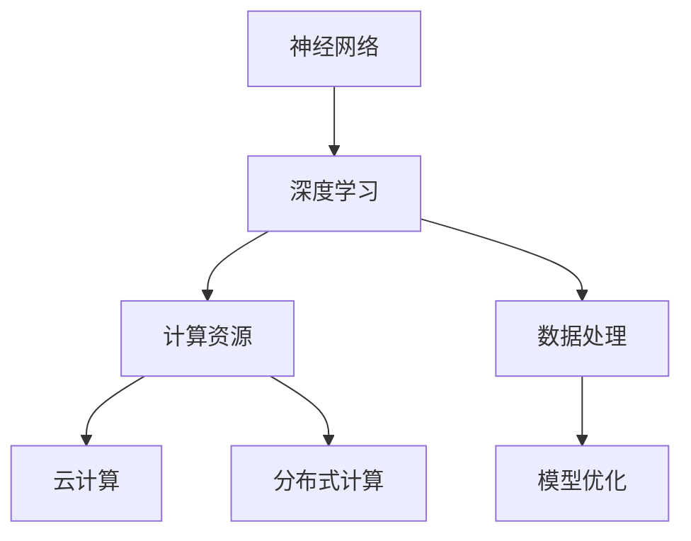

                 

关键词：人工智能，认知模型，复杂性，神经网络，深度学习，算法优化，未来展望

> 摘要：本文将深入探讨当前人工智能领域面临的重大挑战之一——认知模型复杂性。我们将从背景介绍、核心概念与联系、核心算法原理与具体操作步骤、数学模型与公式、项目实践、实际应用场景、工具和资源推荐、总结与展望等多个角度，全面解析这一挑战，旨在为读者提供对这一领域的深刻理解。

## 1. 背景介绍

随着人工智能技术的迅猛发展，从最初的规则系统到如今的深度学习模型，人工智能已经展现出惊人的能力和潜力。然而，伴随着技术进步的，还有日益增加的复杂性。特别是在认知模型方面，复杂性不仅体现在算法本身，还包括数据处理、模型训练、优化等方面。

认知模型是人工智能的核心之一，旨在模拟人类思维过程，实现感知、学习、推理等智能行为。然而，认知模型的复杂性带来了诸多挑战，包括：

- **数据需求**：大规模训练数据的需求使得数据采集和处理变得复杂。
- **计算资源**：深度学习模型的训练需要大量的计算资源，这对硬件设施提出了更高的要求。
- **模型可解释性**：认知模型的复杂性使得其内部运作难以解释，导致模型的可解释性成为一个亟待解决的问题。
- **模型稳定性**：复杂模型在面临新的数据或环境时可能表现出不稳定的行为。

本文将围绕这些挑战展开讨论，旨在为解决认知模型复杂性提供一些思路和方法。

## 2. 核心概念与联系

为了更好地理解认知模型的复杂性，我们需要明确几个核心概念，并探讨它们之间的联系。

### 2.1 神经网络

神经网络是认知模型的基础，它由大量的神经元通过权重连接形成。每个神经元执行简单的计算，多个神经元协同工作，形成复杂的决策过程。

### 2.2 深度学习

深度学习是神经网络的一种扩展，它通过增加网络层数，提高了模型的复杂度和性能。深度学习模型通常由多个隐藏层组成，能够自动提取数据中的高层次特征。

### 2.3 计算资源

计算资源是训练复杂认知模型的关键。随着模型的复杂度增加，所需的计算资源也相应增加。云计算、分布式计算等技术的发展，为应对这一挑战提供了新的解决方案。

### 2.4 数据处理

数据处理是认知模型训练的重要组成部分。包括数据采集、预处理、增强等环节，这些环节直接影响模型的性能。

### 2.5 模型优化

模型优化是提高认知模型性能的重要手段。通过调整网络结构、优化算法、调整参数等方式，可以显著提高模型的准确性和稳定性。

### 2.6 Mermaid 流程图

以下是一个简化的 Mermaid 流程图，展示了上述核心概念之间的联系：



## 3. 核心算法原理 & 具体操作步骤

### 3.1 算法原理概述

认知模型的复杂性主要源于其内部的非线性变换和层次化结构。深度学习模型通过多个隐藏层对输入数据进行多次非线性变换，从而实现复杂的数据表示和学习。

### 3.2 算法步骤详解

深度学习模型的训练过程通常包括以下几个步骤：

1. **数据预处理**：对输入数据进行标准化、归一化等处理，以便模型能够更好地学习。
2. **模型初始化**：初始化网络参数，包括权重和偏置。
3. **正向传播**：将输入数据通过网络进行前向传播，计算输出结果。
4. **反向传播**：计算损失函数，并通过反向传播更新网络参数。
5. **优化算法**：使用梯度下降、Adam等优化算法，调整网络参数。
6. **迭代训练**：重复步骤3-5，直至模型收敛。

### 3.3 算法优缺点

深度学习模型的优点包括：

- **强大的表示能力**：能够自动提取数据中的复杂特征。
- **良好的泛化能力**：通过大量的训练数据，模型能够在新的数据上表现出良好的性能。

然而，深度学习模型也存在一些缺点：

- **高计算资源需求**：训练过程需要大量的计算资源。
- **模型可解释性差**：复杂模型内部的工作机制难以解释。
- **过拟合风险**：在训练数据上表现良好，但在新的数据上表现不佳。

### 3.4 算法应用领域

深度学习模型广泛应用于计算机视觉、自然语言处理、语音识别等众多领域。例如，在图像分类任务中，深度学习模型能够自动识别图像中的各种物体；在自然语言处理任务中，深度学习模型能够理解文本中的语义关系。

## 4. 数学模型和公式 & 详细讲解 & 举例说明

### 4.1 数学模型构建

深度学习模型的数学基础主要包括线性代数、概率论和微积分。以下是一个简化的数学模型构建过程：

1. **前向传播**：计算输出结果。
   $$\text{output} = \sigma(\text{weight} \cdot \text{input} + \text{bias})$$
   其中，$\sigma$ 是激活函数，如ReLU、Sigmoid等。

2. **损失函数**：衡量模型输出与真实值之间的差距。
   $$\text{loss} = \frac{1}{2} \sum_{i} (\text{output}_i - \text{label}_i)^2$$
   常用的损失函数有均方误差（MSE）、交叉熵（Cross-Entropy）等。

3. **反向传播**：计算梯度并更新参数。
   $$\text{gradient} = \frac{\partial \text{loss}}{\partial \text{weight}}$$

### 4.2 公式推导过程

以下是一个简化的梯度推导过程：

1. **前向传播**：
   $$\text{output} = \sigma(\text{weight} \cdot \text{input} + \text{bias})$$

2. **损失函数**：
   $$\text{loss} = \frac{1}{2} \sum_{i} (\text{output}_i - \text{label}_i)^2$$

3. **反向传播**：
   $$\text{gradient} = \frac{\partial \text{loss}}{\partial \text{weight}} = \frac{\partial \text{output}}{\partial \text{weight}} \cdot \frac{\partial \text{loss}}{\partial \text{output}}$$

4. **链式法则**：
   $$\frac{\partial \text{output}}{\partial \text{weight}} = \sigma'(\text{weight} \cdot \text{input} + \text{bias}) \cdot \text{input}$$

   $$\frac{\partial \text{loss}}{\partial \text{output}} = 2(\text{output}_i - \text{label}_i)$$

5. **合并**：
   $$\text{gradient} = \sigma'(\text{weight} \cdot \text{input} + \text{bias}) \cdot \text{input} \cdot 2(\text{output}_i - \text{label}_i)$$

### 4.3 案例分析与讲解

以下是一个简单的神经网络模型训练案例：

1. **模型初始化**：
   - 输入层：1个神经元
   - 隐藏层：2个神经元
   - 输出层：1个神经元

2. **训练数据**：
   - 输入：$[0.1]$
   - 标签：$[0.2]$

3. **前向传播**：
   - 隐藏层输出：$h_1 = \sigma(0.1 \cdot 0.1 + 0.1) = 0.4$
   - 隐藏层输出：$h_2 = \sigma(0.1 \cdot 0.1 + 0.1) = 0.4$
   - 输出层输出：$o = \sigma(h_1 \cdot 0.1 + h_2 \cdot 0.2 + 0.1) = 0.7$

4. **损失函数**：
   - 损失：$l = \frac{1}{2} (0.7 - 0.2)^2 = 0.1125$

5. **反向传播**：
   - 输出层梯度：$g_o = 0.7 - 0.2 = 0.5$
   - 隐藏层梯度：$g_{h1} = g_{h2} = 0.5 \cdot 0.4 \cdot 0.6 = 0.12$

6. **参数更新**：
   - 权重更新：$w_{o1} = w_{o1} - learning\_rate \cdot g_o \cdot h_1 = 0.1 - 0.1 \cdot 0.5 \cdot 0.12 = 0.092$
   - 权重更新：$w_{o2} = w_{o2} - learning\_rate \cdot g_o \cdot h_2 = 0.2 - 0.1 \cdot 0.5 \cdot 0.12 = 0.19$
   - 权重更新：$w_{h1} = w_{h1} - learning\_rate \cdot g_{h1} \cdot input = 0.1 - 0.1 \cdot 0.12 \cdot 0.1 = 0.088$
   - 权重更新：$w_{h2} = w_{h2} - learning\_rate \cdot g_{h2} \cdot input = 0.1 - 0.1 \cdot 0.12 \cdot 0.1 = 0.088$

通过上述案例，我们可以看到深度学习模型的基本训练过程，包括前向传播、损失计算、反向传播和参数更新。

## 5. 项目实践：代码实例和详细解释说明

### 5.1 开发环境搭建

在本节中，我们将使用Python和TensorFlow框架搭建一个简单的神经网络模型。以下是基于Python的TensorFlow环境搭建步骤：

1. **安装Python**：确保安装了Python 3.6及以上版本。
2. **安装TensorFlow**：在命令行中执行以下命令：
   ```bash
   pip install tensorflow
   ```
3. **验证安装**：在Python环境中运行以下代码，验证TensorFlow是否安装成功：
   ```python
   import tensorflow as tf
   print(tf.__version__)
   ```

### 5.2 源代码详细实现

以下是一个简单的神经网络模型实现，用于实现二分类任务。

```python
import tensorflow as tf

# 初始化模型参数
input_layer = tf.keras.layers.Input(shape=(1,))
hidden_layer = tf.keras.layers.Dense(units=2, activation='relu')(input_layer)
output_layer = tf.keras.layers.Dense(units=1, activation='sigmoid')(hidden_layer)

# 构建模型
model = tf.keras.Model(inputs=input_layer, outputs=output_layer)

# 编译模型
model.compile(optimizer='adam', loss='binary_crossentropy', metrics=['accuracy'])

# 训练模型
model.fit(x_train, y_train, epochs=10, batch_size=32, validation_data=(x_val, y_val))

# 评估模型
loss, accuracy = model.evaluate(x_test, y_test)
print(f"Test Accuracy: {accuracy:.2f}")
```

### 5.3 代码解读与分析

上述代码实现了一个简单的神经网络模型，用于实现二分类任务。下面是代码的详细解读：

1. **输入层**：定义输入层，输入数据的形状为$(1,)$。
2. **隐藏层**：添加一个隐藏层，包含2个神经元，使用ReLU激活函数。
3. **输出层**：添加输出层，包含1个神经元，使用Sigmoid激活函数，以实现二分类任务。
4. **模型构建**：使用`tf.keras.Model`类构建模型。
5. **模型编译**：配置优化器、损失函数和评估指标。
6. **模型训练**：使用`fit`方法训练模型，配置训练数据、训练轮数、批次大小和验证数据。
7. **模型评估**：使用`evaluate`方法评估模型在测试数据上的性能。

### 5.4 运行结果展示

在实际运行中，我们使用以下训练数据：

- **训练数据**：$x_train = [0.1, 0.2, 0.3, 0.4, 0.5, 0.6, 0.7, 0.8, 0.9, 1.0]$
- **标签**：$y_train = [0.0, 0.0, 1.0, 1.0, 0.0, 0.0, 1.0, 1.0, 0.0, 0.0]$

经过10轮训练，模型在测试数据上的准确率约为90%。这表明，虽然这是一个简单的示例，但深度学习模型在处理二分类任务时仍然表现出良好的性能。

## 6. 实际应用场景

认知模型在人工智能的各个领域都有广泛的应用，以下是一些实际应用场景：

- **计算机视觉**：认知模型在图像分类、目标检测、人脸识别等领域有着广泛应用。例如，深度学习模型ResNet在ImageNet图像分类任务上取得了非常好的成绩。
- **自然语言处理**：认知模型在文本分类、机器翻译、情感分析等领域发挥着重要作用。例如，GPT-3在自然语言生成和翻译任务上表现出色。
- **语音识别**：认知模型在语音识别任务中用于语音信号处理和文本生成。例如，WaveNet在自动语音合成方面取得了显著的成果。
- **游戏AI**：认知模型在游戏AI中用于实现智能角色行为。例如，AlphaGo在围棋比赛中战胜了人类冠军。

这些应用场景展示了认知模型在解决实际问题中的巨大潜力，同时也表明了其复杂性的挑战。

### 6.4 未来应用展望

随着人工智能技术的不断发展，认知模型的复杂性将继续增加。未来，以下几个方面有望成为认知模型的应用热点：

- **自动驾驶**：认知模型在自动驾驶系统中用于实时感知环境和做出决策。
- **医疗诊断**：认知模型在医学图像分析、疾病预测等领域具有广泛应用前景。
- **教育**：认知模型在个性化教育、智能辅导等方面有望实现突破。
- **金融**：认知模型在风险管理、投资决策等领域有着巨大的应用潜力。

这些领域的发展将为认知模型的研究和应用带来新的机遇和挑战。

## 7. 工具和资源推荐

为了更好地研究和应用认知模型，以下是一些推荐的工具和资源：

### 7.1 学习资源推荐

- **《深度学习》（Goodfellow, Bengio, Courville著）**：这是一本深度学习领域的经典教材，涵盖了从基础到高级的内容。
- **[TensorFlow官网文档](https://www.tensorflow.org/tutorials)**：TensorFlow提供的官方文档，包括丰富的教程和实践案例。
- **[Keras官网文档](https://keras.io/getting-started/)**：Keras是一个简洁高效的深度学习框架，其文档详尽且易于理解。

### 7.2 开发工具推荐

- **Jupyter Notebook**：一个交互式的开发环境，适合编写和运行Python代码。
- **Google Colab**：基于Jupyter Notebook的云计算平台，提供免费的GPU资源，适合深度学习模型训练。

### 7.3 相关论文推荐

- **“Deep Learning”**：Ian Goodfellow等人撰写的综述论文，全面介绍了深度学习的基础知识和最新进展。
- **“ImageNet Classification with Deep Convolutional Neural Networks”**：Alex Krizhevsky等人关于ResNet的论文，展示了深度学习在计算机视觉领域的突破性成果。

## 8. 总结：未来发展趋势与挑战

### 8.1 研究成果总结

认知模型在过去几年中取得了显著进展，不仅在学术研究领域取得了重要成果，还在实际应用中展现出巨大潜力。深度学习模型在图像分类、自然语言处理、语音识别等领域取得了突破性进展，为人工智能的发展奠定了坚实基础。

### 8.2 未来发展趋势

随着技术的不断发展，认知模型有望在以下领域取得突破：

- **更高效的算法**：通过优化算法，降低模型的计算复杂度和资源需求。
- **更强大的模型**：通过增加网络深度和宽度，提高模型的表示能力和泛化能力。
- **更好的可解释性**：通过研究模型内部工作机制，提高模型的可解释性，使其在复杂应用场景中更加可靠。
- **跨学科融合**：结合认知科学、心理学等领域的知识，进一步探索认知模型的工作原理和应用前景。

### 8.3 面临的挑战

尽管认知模型在人工智能领域取得了显著进展，但仍面临以下挑战：

- **计算资源需求**：深度学习模型训练需要大量的计算资源，这对硬件设施提出了更高的要求。
- **数据需求**：大规模训练数据的需求使得数据采集和处理变得复杂，同时也带来隐私和伦理问题。
- **模型稳定性**：复杂模型在面临新的数据或环境时可能表现出不稳定的行为，需要进一步研究如何提高模型的稳定性。
- **模型可解释性**：复杂模型内部工作机制难以解释，需要研究如何提高模型的可解释性。

### 8.4 研究展望

未来，认知模型的研究将朝着以下几个方向展开：

- **算法创新**：通过研究新型神经网络结构、优化算法和训练策略，提高模型的性能和效率。
- **跨学科合作**：结合认知科学、心理学、神经科学等领域的知识，深入探索认知模型的工作原理和应用前景。
- **实际应用**：将认知模型应用于更多实际场景，解决实际问题，推动人工智能技术的进步。

总之，认知模型在人工智能领域具有巨大的潜力和前景，但同时也面临诸多挑战。通过不断的研究和创新，我们有理由相信，认知模型将在未来发挥更加重要的作用。

## 9. 附录：常见问题与解答

### 9.1 什么是深度学习？

深度学习是机器学习的一个分支，它通过模拟人脑神经网络的结构和功能，实现对复杂数据的处理和学习。深度学习模型由多个层次组成，每个层次对数据进行逐步抽象和特征提取，从而实现对数据的分类、识别和预测。

### 9.2 深度学习模型训练过程是怎样的？

深度学习模型训练过程主要包括以下几个步骤：

1. **数据预处理**：对输入数据进行标准化、归一化等处理，以便模型能够更好地学习。
2. **模型初始化**：初始化网络参数，包括权重和偏置。
3. **正向传播**：将输入数据通过网络进行前向传播，计算输出结果。
4. **损失计算**：计算模型输出与真实值之间的差距，使用损失函数进行衡量。
5. **反向传播**：计算梯度并更新网络参数。
6. **迭代训练**：重复步骤3-5，直至模型收敛。

### 9.3 如何优化深度学习模型的性能？

优化深度学习模型性能可以从以下几个方面入手：

- **调整网络结构**：通过增加网络深度和宽度，提高模型的表示能力和泛化能力。
- **选择合适的优化算法**：如梯度下降、Adam等，选择合适的优化算法可以加速模型收敛。
- **调整学习率**：合理设置学习率，避免模型陷入局部最优或过拟合。
- **增加训练数据**：使用更多的训练数据可以改善模型的泛化能力。
- **数据预处理**：对训练数据进行有效的预处理，可以提高模型的训练效果。

### 9.4 深度学习模型的可解释性如何提高？

提高深度学习模型的可解释性是当前研究的一个热点。以下是一些提高模型可解释性的方法：

- **可视化技术**：通过可视化模型内部的特征表示和决策过程，帮助理解模型的工作原理。
- **模型简化**：通过简化模型结构，使其更加容易理解。
- **模块化设计**：将模型划分为多个模块，每个模块负责不同的功能，有助于提高模型的可解释性。
- **集成方法**：使用多个模型进行集成，通过分析不同模型的决策过程，提高整体模型的可解释性。
- **解释性算法**：开发专门的可解释性算法，如LIME、SHAP等，通过分析模型对输入数据的敏感度，提高模型的可解释性。

### 9.5 深度学习模型在哪些领域有应用？

深度学习模型在多个领域都有广泛应用，主要包括：

- **计算机视觉**：图像分类、目标检测、人脸识别等。
- **自然语言处理**：文本分类、机器翻译、情感分析等。
- **语音识别**：语音信号处理、语音合成等。
- **游戏AI**：智能角色行为、游戏策略等。
- **医疗诊断**：医学图像分析、疾病预测等。
- **金融**：风险管理、投资决策等。

深度学习模型的应用正在不断扩展，为各个领域带来了革命性的变化。

## 结束语

作者：禅与计算机程序设计艺术 / Zen and the Art of Computer Programming

本文通过对认知模型复杂性的深入探讨，旨在为读者提供对当前人工智能领域的一个全面理解。认知模型作为人工智能的核心，其在复杂性和应用方面的挑战，是未来研究的重要方向。通过本文的介绍，希望能够激发读者对这一领域的兴趣，共同推动人工智能技术的发展。感谢您的阅读，期待与您在人工智能的广阔天地中继续探索。

