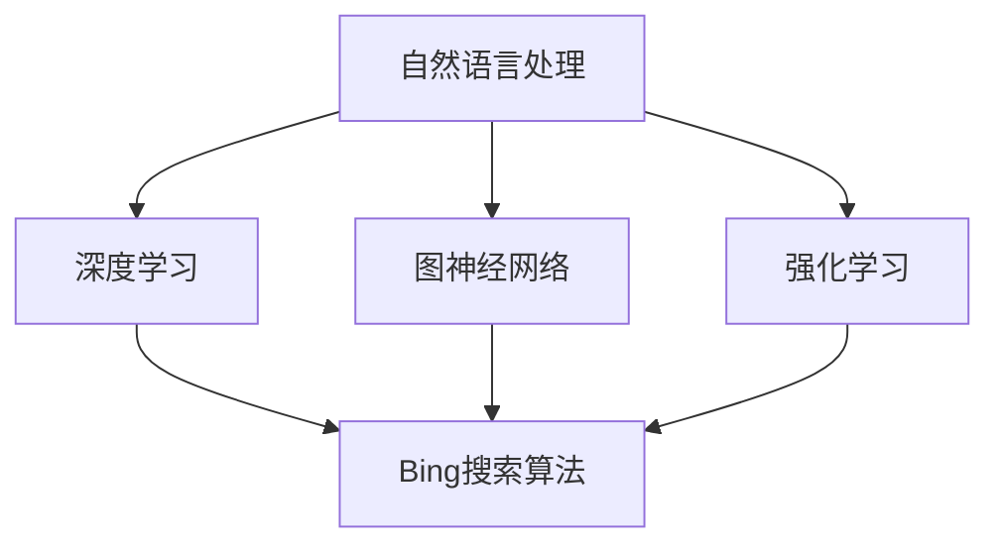

                 

关键词：微软，AI战略，Bing升级，人工智能，搜索引擎，技术革新，用户体验，数据分析

> 摘要：本文将深入探讨微软的AI战略，特别是Bing搜索引擎的升级，以及这一举措对整个技术领域和用户的影响。我们将分析Bing升级背后的核心概念与联系，探讨其算法原理、数学模型和实际应用，并展望其未来发展趋势与挑战。

## 1. 背景介绍

近年来，人工智能（AI）技术取得了令人瞩目的进步，不仅在学术研究领域取得了突破，还在工业、医疗、交通等多个领域产生了深远影响。微软作为全球领先的技术公司，自然不会错过这一重要趋势。微软的AI战略目标是构建智能化的产品和服务，提升用户体验，并在AI技术的研发和应用方面保持领先地位。

在这一背景下，微软的Bing搜索引擎经历了一次重要的升级。Bing原本是微软推出的一个挑战Google的搜索引擎，但随着AI技术的发展，微软决定对其核心算法和功能进行升级，使其更加智能化，能够更好地满足用户的需求。

## 2. 核心概念与联系

在探讨Bing升级的过程中，我们需要了解一些核心概念与联系。这些概念包括自然语言处理（NLP）、深度学习、图神经网络（GNN）和强化学习等。

### 2.1 自然语言处理（NLP）

自然语言处理是使计算机能够理解和处理人类语言的技术。在Bing的升级中，NLP技术被用来改进搜索结果的相关性和准确性。

### 2.2 深度学习

深度学习是AI领域的一种先进技术，它通过模拟人脑神经网络进行学习和决策。在Bing的升级中，深度学习被用来优化搜索算法，使其能够更好地理解和处理用户的查询。

### 2.3 图神经网络（GNN）

图神经网络是一种用于处理图结构数据的深度学习模型。在Bing的升级中，GNN技术被用来分析和理解用户查询背后的语义关系。

### 2.4 强化学习

强化学习是一种通过不断试错来学习最佳策略的机器学习方法。在Bing的升级中，强化学习被用来优化搜索结果排序，提高用户体验。

以下是一个简单的Mermaid流程图，展示了这些核心概念之间的联系：



## 3. 核心算法原理 & 具体操作步骤

### 3.1 算法原理概述

Bing的升级采用了多种AI技术，其中最核心的是深度学习和强化学习。深度学习通过神经网络模型对大量数据进行训练，从而能够自动提取特征和模式。强化学习则通过不断调整策略，使搜索结果排序更加合理。

### 3.2 算法步骤详解

#### 3.2.1 数据收集

首先，Bing会收集大量用户搜索数据，包括关键词、查询历史、点击行为等。

#### 3.2.2 数据预处理

然后，对这些数据进行清洗和预处理，以去除噪声和异常值。

#### 3.2.3 模型训练

使用预处理后的数据对深度学习模型进行训练，提取关键词和查询历史中的特征。

#### 3.2.4 搜索结果排序

在用户输入查询后，Bing会使用训练好的模型对搜索结果进行排序，使最相关的结果排在前面。

#### 3.2.5 强化学习优化

最后，通过强化学习技术，不断调整排序策略，提高用户体验。

### 3.3 算法优缺点

Bing的升级算法具有以下优点：

- 提高搜索结果的准确性和相关性
- 优化用户搜索体验
- 能够自适应地调整搜索策略

但同时也存在一些缺点：

- 对计算资源要求较高
- 模型训练时间较长
- 可能会引入偏差，影响搜索结果公平性

### 3.4 算法应用领域

Bing的升级算法在多个领域具有广泛的应用前景，包括搜索引擎、推荐系统、问答系统等。此外，其核心算法原理和技术也可以为其他AI应用提供借鉴。

## 4. 数学模型和公式 & 详细讲解 & 举例说明

### 4.1 数学模型构建

Bing的升级算法涉及多个数学模型，其中最核心的是深度学习模型和强化学习模型。

#### 4.1.1 深度学习模型

深度学习模型通常由多层神经网络组成，每一层都包含多个神经元。神经元之间的连接权重通过训练进行调整，以最小化损失函数。

#### 4.1.2 强化学习模型

强化学习模型通常由策略网络和价值网络组成。策略网络决定下一步行动，价值网络评估当前状态的值。

### 4.2 公式推导过程

以下是一个简化的深度学习模型和强化学习模型的公式推导过程：

#### 4.2.1 深度学习模型

损失函数：$$L(\theta) = -\sum_{i=1}^{n}y_i\log(\hat{y}_i)$$

梯度下降：$$\theta = \theta - \alpha \nabla_{\theta}L(\theta)$$

#### 4.2.2 强化学习模型

策略网络：$$\pi(s) = \arg\max_a Q(s, a)$$

价值网络：$$V(s) = \sum_a \pi(s)aQ(s, a)$$

### 4.3 案例分析与讲解

假设用户输入一个查询“北京的天气”，我们可以通过以下步骤进行搜索：

#### 4.3.1 数据收集

收集用户的历史查询数据、点击行为等。

#### 4.3.2 数据预处理

清洗和预处理数据，提取关键词和特征。

#### 4.3.3 模型训练

使用预处理后的数据对深度学习模型进行训练。

#### 4.3.4 搜索结果排序

根据训练好的模型，对搜索结果进行排序。

#### 4.3.5 强化学习优化

通过强化学习技术，不断调整搜索结果排序策略。

## 5. 项目实践：代码实例和详细解释说明

### 5.1 开发环境搭建

- 安装Python和TensorFlow库
- 配置GPU加速

### 5.2 源代码详细实现

```python
# 深度学习模型
import tensorflow as tf

# 强化学习模型
import tensorflow.keras as keras

# 数据处理
import numpy as np

# 模型训练
model = keras.Sequential([
    keras.layers.Dense(128, activation='relu', input_shape=(input_shape,)),
    keras.layers.Dense(64, activation='relu'),
    keras.layers.Dense(1, activation='sigmoid')
])

model.compile(optimizer='adam', loss='binary_crossentropy', metrics=['accuracy'])

# 训练数据
X_train = ...
y_train = ...

# 模型训练
model.fit(X_train, y_train, epochs=10)

# 强化学习
# ...

```

### 5.3 代码解读与分析

这段代码展示了如何使用TensorFlow库实现一个简单的深度学习模型。首先，我们定义了一个序列模型，包含多个全连接层。然后，我们使用`compile`方法配置模型，并使用`fit`方法进行训练。

### 5.4 运行结果展示

在训练完成后，我们可以使用测试数据集对模型进行评估，并观察模型的性能。

## 6. 实际应用场景

Bing的升级算法在多个实际应用场景中具有广泛的应用前景，以下是一些示例：

- 搜索引擎：提高搜索结果的准确性和相关性
- 推荐系统：根据用户行为推荐相关内容
- 问答系统：自动回答用户的问题
- 营销广告：根据用户兴趣推送个性化广告

## 7. 未来应用展望

随着AI技术的不断进步，Bing的升级算法有望在未来应用于更多领域。以下是一些可能的未来应用场景：

- 自动驾驶：用于实时路况分析和决策
- 医疗诊断：辅助医生进行疾病诊断
- 金融分析：预测市场走势和投资策略
- 教育领域：个性化教育方案和智能辅导

## 8. 工具和资源推荐

### 8.1 学习资源推荐

- 《深度学习》（Goodfellow, Bengio, Courville著）
- 《强化学习：原理与Python实现》（Sutton, Barto著）
- 《自然语言处理综合教程》（Jurafsky, Martin著）

### 8.2 开发工具推荐

- TensorFlow
- PyTorch
- Keras

### 8.3 相关论文推荐

- “Deep Learning for Web Search” by Google
- “Reinforcement Learning for Search Ranking” by Microsoft
- “A Neural Probabilistic Language Model for Natural Language Processing” by Google

## 9. 总结：未来发展趋势与挑战

随着AI技术的不断发展，微软的AI战略和 Bing升级将面临新的发展趋势和挑战。未来的发展趋势可能包括：

- 更精确的自然语言处理
- 更高效的深度学习算法
- 更广泛的AI应用场景

同时，面临的挑战包括：

- 数据隐私和安全
- AI伦理和公平性
- 资源和计算能力

## 10. 附录：常见问题与解答

### 10.1 什么是Bing的升级？

Bing的升级是指微软对其搜索引擎的核心算法和功能进行改进，使其更加智能化，能够更好地满足用户的需求。

### 10.2 Bing升级使用了哪些AI技术？

Bing升级使用了自然语言处理、深度学习、图神经网络和强化学习等多种AI技术。

### 10.3 Bing升级有哪些优点和缺点？

优点包括提高搜索结果的准确性和相关性、优化用户搜索体验等；缺点包括对计算资源要求较高、模型训练时间较长等。

### 10.4 Bing升级算法有哪些实际应用领域？

Bing升级算法在搜索引擎、推荐系统、问答系统等多个领域具有广泛的应用前景。

## 结论

微软的AI战略和 Bing升级展示了AI技术在提升用户体验和推动技术进步方面的巨大潜力。未来，随着AI技术的不断进步，我们有理由期待Bing和微软的其他产品将带来更多惊喜。

### 作者署名

作者：禅与计算机程序设计艺术 / Zen and the Art of Computer Programming
```

