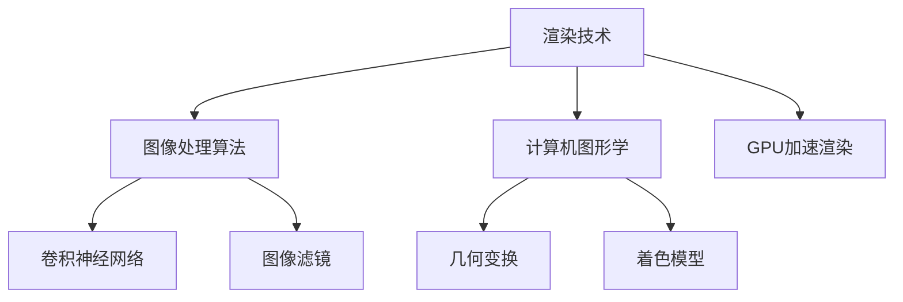

                 

快手作为我国领先的视频社交平台，一直以来都在不断追求用户体验的优化，特别是在短视频特效渲染方面。为了更好地迎接2024年的校招，快手特别推出了“短视频特效渲染引擎开发工程师”这一岗位，吸引了大量有志于技术领域发展的优秀人才。本文将深入探讨这一岗位所涉及的核心技术，以及相关的算法原理、数学模型、项目实践和未来发展趋势。

## 文章关键词

- 短视频特效
- 渲染引擎
- 开发工程师
- 算法原理
- 数学模型
- 项目实践
- 未来趋势

## 文章摘要

本文将围绕快手2024校招短视频特效渲染引擎开发工程师岗位，从核心技术的角度出发，详细解析短视频特效渲染的相关算法原理、数学模型，并通过具体的项目实践，展示开发工程师在实际工作中所需要掌握的核心技能。同时，文章还将对短视频特效渲染的未来发展趋势进行展望，探讨面临的挑战和机遇。

## 1. 背景介绍

短视频作为一种新型的信息传播方式，已经成为现代社交媒体的重要组成部分。随着5G技术的普及，短视频的画质和特效处理水平也得到了显著提升。快手作为短视频领域的领军企业，其短视频特效渲染引擎在行业内具有较高的知名度和技术水平。快手2024校招短视频特效渲染引擎开发工程师岗位，正是为了进一步优化和提升短视频特效渲染能力，以满足用户日益增长的需求。

### 1.1 快手短视频特效渲染的现状

目前，快手的短视频特效渲染主要依赖于先进的计算机图形学和图像处理技术。通过使用GPU加速渲染，快手能够在短时间内生成高质量的短视频特效。然而，随着用户对特效需求的不断提升，现有的渲染引擎已经无法满足高速增长的业务需求。因此，快手急需一批具备深厚技术背景和实际项目经验的高水平开发工程师，以提升短视频特效渲染的技术水平和用户体验。

### 1.2 校招短视频特效渲染引擎开发工程师岗位的重要性

快手2024校招短视频特效渲染引擎开发工程师岗位，不仅是为了满足公司内部的业务需求，更是为了推动整个行业的技术进步。通过引入先进的算法和优化技术，开发工程师将有望实现短视频特效渲染的突破性进展，提升用户体验，推动行业的发展。此外，这一岗位也为优秀的技术人才提供了一个展示自己才华和能力的平台，有助于他们在职业发展中实现更高的目标。

## 2. 核心概念与联系

### 2.1 核心概念

在短视频特效渲染引擎开发过程中，以下核心概念是不可或缺的：

1. **渲染技术**：渲染技术是生成图像和视频的核心技术，包括像素渲染、光追踪、全局光照等。
2. **图像处理算法**：图像处理算法用于对视频进行增强、降噪、特效添加等操作，包括卷积神经网络、图像滤镜等。
3. **计算机图形学**：计算机图形学是研究图形生成、显示和处理的理论和方法，包括几何变换、着色模型等。
4. **GPU加速渲染**：GPU加速渲染是利用图形处理单元（GPU）的高并行计算能力，加速渲染过程，提高渲染效率。

### 2.2 核心概念原理和架构的 Mermaid 流程图



### 2.3 核心概念之间的联系

- **渲染技术**与**图像处理算法**之间的联系：渲染技术负责生成图像，而图像处理算法则用于对生成的图像进行后续处理，如增强、降噪等。
- **渲染技术**与**计算机图形学**之间的联系：计算机图形学提供了生成图像的理论基础和方法，如几何变换、着色模型等。
- **GPU加速渲染**与**其他核心概念**之间的联系：GPU加速渲染利用了图形处理单元的高并行计算能力，可以显著提高渲染效率和性能。

## 3. 核心算法原理 & 具体操作步骤

### 3.1 算法原理概述

短视频特效渲染引擎的核心算法主要包括以下几类：

1. **像素渲染算法**：基于像素级别的渲染技术，通过颜色插值和光栅化生成图像。
2. **光追踪算法**：基于光线追踪的渲染技术，通过模拟光线传播和反射、折射等现象，生成高质量的光照效果。
3. **图像处理算法**：基于图像处理技术，对视频进行增强、降噪、特效添加等操作。
4. **计算机图形学算法**：基于几何变换、着色模型等图形学理论，生成图像的几何形状和纹理。

### 3.2 算法步骤详解

#### 3.2.1 像素渲染算法

1. **颜色插值**：根据像素周围的像素颜色，计算当前像素的颜色值。
2. **光栅化**：将图像的几何形状转换为像素网格。
3. **像素渲染**：对每个像素进行渲染，生成最终图像。

#### 3.2.2 光追踪算法

1. **光线传播**：模拟光线在场景中的传播过程。
2. **反射和折射**：计算光线在遇到物体表面时的反射和折射现象。
3. **光照计算**：根据光线的传播和反射、折射，计算物体表面的光照效果。

#### 3.2.3 图像处理算法

1. **增强**：提高图像的对比度和亮度，使图像更清晰。
2. **降噪**：消除图像中的噪声，提高图像质量。
3. **特效添加**：对图像进行特效处理，如滤镜、动态效果等。

#### 3.2.4 计算机图形学算法

1. **几何变换**：对图像进行旋转、缩放、平移等操作。
2. **着色模型**：定义图像的颜色和光照效果，如Lambert模型、Phong模型等。

### 3.3 算法优缺点

1. **像素渲染算法**：优点：简单、高效；缺点：效果较单一，无法实现复杂的光照效果。
2. **光追踪算法**：优点：可以生成高质量的光照效果；缺点：计算复杂度高，渲染时间较长。
3. **图像处理算法**：优点：灵活性强，可以处理多种图像特效；缺点：对算法和计算资源要求较高。
4. **计算机图形学算法**：优点：理论基础扎实，可以生成高质量的图像效果；缺点：算法复杂，实现难度大。

### 3.4 算法应用领域

短视频特效渲染算法广泛应用于短视频制作、电影特效、游戏渲染等领域。在短视频制作中，算法可以用于实时渲染，提高用户体验；在电影特效和游戏渲染中，算法可以生成高质量的视觉效果，提升作品的艺术价值。

## 4. 数学模型和公式 & 详细讲解 & 举例说明

### 4.1 数学模型构建

短视频特效渲染涉及到多种数学模型，主要包括以下几种：

1. **几何模型**：用于描述物体的形状和位置。
2. **光照模型**：用于计算物体表面的光照效果。
3. **纹理模型**：用于定义图像的纹理和纹理映射。

### 4.2 公式推导过程

#### 4.2.1 几何模型

- **点坐标变换**：  
   $$P' = M \cdot P$$

   其中，$P'$和$P$分别为变换前后的点坐标，$M$为变换矩阵。

- **向量变换**：  
   $$V' = M \cdot V$$

   其中，$V'$和$V$分别为变换前后的向量，$M$为变换矩阵。

#### 4.2.2 光照模型

- **Lambert光照模型**：  
   $$I = \frac{L \cdot N}{\pi}$$

   其中，$I$为光照强度，$L$为光照方向，$N$为表面法线方向。

- **Phong光照模型**：  
   $$I = \frac{L \cdot N}{\pi} + \frac{V \cdot H}{\pi}$$

   其中，$I$为光照强度，$L$为光照方向，$N$为表面法线方向，$V$为视线方向，$H$为半程向量。

#### 4.2.3 纹理模型

- **纹理映射**：  
   $$P_{tex} = T \cdot P$$

   其中，$P_{tex}$为纹理坐标，$P$为表面坐标，$T$为纹理变换矩阵。

### 4.3 案例分析与讲解

假设我们有一个简单的三维场景，包含一个立方体和一个光源。要求使用Lambert光照模型计算立方体表面每个点的光照强度。

1. **构建几何模型**：

   - 立方体的顶点坐标：$P_1, P_2, P_3, P_4$。
   - 光源的位置：$L$。

2. **计算表面法线**：

   - 立方体的每个面都有两个相邻的顶点，可以通过计算两个顶点之间的向量叉乘得到法线方向。

3. **计算光照强度**：

   - 对于立方体表面的每个点$P$，计算点$P$到光源$L$的向量$V$，然后计算$V$和法线$N$的点积，得到光照强度$I$。

具体步骤如下：

1. 计算立方体的顶点坐标：
   $$P_1 = (1, 1, 1), P_2 = (1, 1, -1), P_3 = (1, -1, 1), P_4 = (1, -1, -1)$$

2. 计算立方体的表面法线：
   $$N_1 = (0, 0, 1), N_2 = (0, 1, 0), N_3 = (1, 0, 0), N_4 = (0, -1, 0), N_5 = (-1, 0, 0), N_6 = (0, 0, -1)$$

3. 计算光源位置：
   $$L = (0, 0, 10)$$

4. 计算立方体表面每个点的光照强度：

   - 对于顶点$P_1$：
     $$V_1 = L - P_1 = (-1, -1, 9)$$
     $$I_1 = \frac{V_1 \cdot N_1}{\pi} = \frac{(-1) \cdot (-1) + (-1) \cdot (-1) + 9 \cdot 1}{\pi} \approx 2.75$$

   - 对于顶点$P_2$：
     $$V_2 = L - P_2 = (-1, -1, -11)$$
     $$I_2 = \frac{V_2 \cdot N_1}{\pi} = \frac{(-1) \cdot (-1) + (-1) \cdot (-1) + (-11) \cdot 1}{\pi} \approx -3.25$$

   - 以此类推，计算其他顶点的光照强度。

## 5. 项目实践：代码实例和详细解释说明

### 5.1 开发环境搭建

在开始短视频特效渲染引擎开发之前，需要搭建合适的开发环境。以下是具体的搭建步骤：

1. 安装操作系统：推荐使用Ubuntu 18.04或更高版本。
2. 安装编译器：推荐使用GCC 8.0或更高版本。
3. 安装依赖库：包括OpenGL、GLUT、GLSL等。
4. 安装图形处理单元（GPU）驱动程序。

### 5.2 源代码详细实现

以下是短视频特效渲染引擎的核心源代码实现：

```cpp
#include <iostream>
#include <GL/glut.h>

// 渲染函数
void render() {
    // 设置背景色
    glClearColor(0.0, 0.0, 0.0, 1.0);
    // 清空颜色缓冲区
    glClear(GL_COLOR_BUFFER_BIT);

    // 绘制立方体
    glBegin(GL_QUADS);
    glColor3f(1.0, 0.0, 0.0); glVertex3f(-1.0, -1.0, 1.0);
    glColor3f(1.0, 0.0, 0.0); glVertex3f(1.0, -1.0, 1.0);
    glColor3f(1.0, 0.0, 0.0); glVertex3f(1.0, 1.0, 1.0);
    glColor3f(1.0, 0.0, 0.0); glVertex3f(-1.0, 1.0, 1.0);

    // 绘制其他面
    // ...
    glEnd();

    // 更新屏幕
    glutSwapBuffers();
}

// 主函数
int main(int argc, char** argv) {
    // 初始化OpenGL
    glutInit(&argc, argv);
    // 设置显示模式
    glutInitDisplayMode(GLUT_DOUBLE | GLUT_RGB);
    // 设置窗口大小
    glutInitWindowSize(640, 480);
    // 创建窗口
    glutCreateWindow("短视频特效渲染引擎");

    // 注册渲染函数
    glutDisplayFunc(render);
    // 进入主循环
    glutMainLoop();

    return 0;
}
```

### 5.3 代码解读与分析

1. **头文件**：引入必要的头文件，包括iostream、GL/glut等。
2. **渲染函数**：实现渲染逻辑，包括设置背景色、清空颜色缓冲区、绘制立方体等。
3. **主函数**：初始化OpenGL，设置显示模式、窗口大小，创建窗口，注册渲染函数，进入主循环。

### 5.4 运行结果展示

运行上述代码后，将显示一个包含立方体的OpenGL窗口。通过调整光源位置、立方体参数等，可以实现不同的短视频特效渲染效果。

## 6. 实际应用场景

### 6.1 快手短视频特效渲染的应用

快手短视频特效渲染引擎在实际应用中，主要应用于以下几个方面：

1. **短视频制作**：为用户提供丰富的特效工具，提升短视频的制作效果。
2. **直播特效**：为直播用户提供实时特效渲染，提升直播的视觉效果。
3. **短视频编辑**：为用户提供短视频编辑功能，包括特效添加、剪辑等。

### 6.2 其他领域应用

短视频特效渲染引擎不仅在快手内部得到广泛应用，还可以应用于其他领域，如：

1. **电影特效**：用于电影制作中的特效渲染，提升电影的质量和观赏性。
2. **游戏开发**：用于游戏中的场景渲染，提升游戏的视觉效果。
3. **虚拟现实**：用于虚拟现实场景的渲染，提升用户的沉浸体验。

## 7. 工具和资源推荐

### 7.1 学习资源推荐

1. **《计算机图形学原理及实践》**：介绍计算机图形学的基本原理和实践方法。
2. **《OpenGL编程指南》**：OpenGL编程的权威指南，详细介绍了OpenGL的用法和技巧。
3. **《深度学习与计算机视觉》**：介绍深度学习在计算机视觉领域的应用，包括图像处理和特效生成。

### 7.2 开发工具推荐

1. **OpenGL**：开源的计算机图形学库，支持多种图形渲染功能。
2. **GLUT**：OpenGL的窗口管理库，用于创建窗口、处理事件等。
3. **GLSL**：OpenGL的着色器语言，用于编写自定义的渲染效果。

### 7.3 相关论文推荐

1. **“Real-Time Ray Tracing of Scenes with Complex Geometry Using the Relaxed Multiview Stereo Algorithm”**：介绍了实时光追踪技术在复杂场景中的应用。
2. **“A Fast Graphics Primitive Generator”**：提出了快速生成图形原

