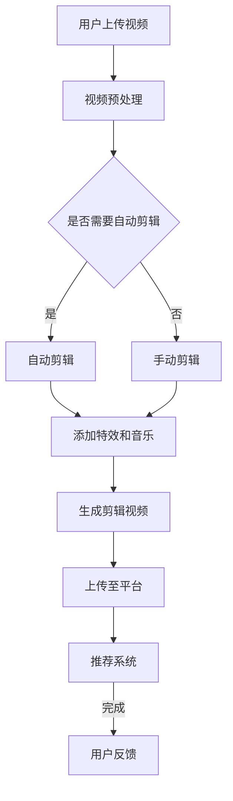

                 

  
## 文章关键词

AI面试题、短视频智能剪辑、深度学习、计算机视觉、自然语言处理、算法原理、代码实践、应用场景、未来展望。

## 文章摘要

本文旨在为有意向加入快手2025短视频智能剪辑项目的求职者提供一份AI面试题攻略。我们将深入探讨短视频智能剪辑的核心技术，包括深度学习、计算机视觉和自然语言处理等领域的知识。文章将结构性地解析面试中的常见问题，并展示具体的算法原理和代码实践，以便求职者能够更好地准备面试。此外，我们还将探讨短视频智能剪辑在当前和未来的应用场景，以及面临的技术挑战和未来研究方向。希望本文能为您的职业发展提供有益的参考。

## 1. 背景介绍

### 1.1 快手短视频平台的发展

快手作为中国领先的短视频社交平台，以其独特的用户生态和丰富的内容形式受到了广泛的关注。随着5G技术的普及和移动设备的性能提升，短视频市场呈现出爆炸式的增长。快手2025短视频智能剪辑项目旨在利用人工智能技术，提升用户创作和消费体验，实现视频内容的高效生产和个性化推荐。

### 1.2 短视频智能剪辑的重要性

短视频智能剪辑是短视频平台发展的关键环节。通过人工智能技术，可以实现视频内容的自动化剪辑、特效添加、背景音乐选择等，极大地提高了内容创作的效率和质量。此外，智能剪辑还能根据用户行为数据，实现个性化视频推荐，进一步提升用户粘性和满意度。

### 1.3 快手2025短视频智能剪辑项目的目标

快手2025短视频智能剪辑项目的主要目标包括：

- **提升视频创作效率**：通过自动化剪辑和智能辅助工具，帮助用户快速制作高质量的视频。
- **优化用户体验**：利用个性化推荐算法，为用户提供更加精准的内容推荐。
- **扩大用户群体**：通过智能剪辑功能，吸引更多用户加入快手平台，丰富内容生态。

## 2. 核心概念与联系

### 2.1 深度学习

深度学习是人工智能的重要分支，通过神经网络模型模拟人脑学习过程，实现对复杂数据的分析和模式识别。在短视频智能剪辑中，深度学习技术广泛应用于图像识别、语音识别和自然语言处理等领域。

### 2.2 计算机视觉

计算机视觉是研究如何使计算机“看懂”图像和视频的技术。在短视频智能剪辑中，计算机视觉技术用于视频内容的自动识别、标签分类、动作检测和场景分割等。

### 2.3 自然语言处理

自然语言处理（NLP）是使计算机能够理解、生成和处理人类语言的技术。在短视频智能剪辑中，NLP技术用于文本识别、情感分析、语音合成和字幕生成等。

### 2.4 Mermaid流程图

以下是一个简单的Mermaid流程图，展示了短视频智能剪辑的核心流程：



## 3. 核心算法原理 & 具体操作步骤

### 3.1 算法原理概述

短视频智能剪辑的核心算法主要包括视频内容识别、自动剪辑、特效添加和个性化推荐等。以下是这些算法的基本原理：

- **视频内容识别**：利用深度学习模型对视频中的图像进行分类和标注，以便后续处理。
- **自动剪辑**：通过视频分割算法，将连续的视频片段分割成具有独立意义的片段，然后根据用户需求进行排序和拼接。
- **特效添加**：利用图像处理技术，为视频片段添加动画效果、滤镜和音乐等。
- **个性化推荐**：根据用户的历史行为数据，使用推荐算法为用户推荐个性化的视频内容。

### 3.2 算法步骤详解

以下是短视频智能剪辑的主要步骤：

1. **视频内容识别**：
   - 使用卷积神经网络（CNN）对视频帧进行特征提取。
   - 通过预训练的模型进行图像分类和标注。

2. **视频分割**：
   - 使用光流法或滑动窗口法对视频进行分割。
   - 对分割结果进行去噪和修剪，确保每个片段的连贯性和完整性。

3. **自动剪辑**：
   - 根据分割结果，对视频片段进行排序和拼接。
   - 使用长短时记忆网络（LSTM）对视频片段进行时间序列分析，确定最佳的剪辑顺序。

4. **特效添加**：
   - 使用图像处理技术，为视频片段添加动画效果、滤镜和音乐等。
   - 调整视频片段的亮度和对比度，使其与特效相匹配。

5. **个性化推荐**：
   - 收集用户的行为数据，包括观看历史、点赞、评论等。
   - 使用协同过滤或基于内容的推荐算法，为用户推荐个性化的视频内容。

### 3.3 算法优缺点

**优点**：

- 提高视频创作效率，降低人力成本。
- 实现个性化推荐，提升用户体验。
- 自动化剪辑，确保视频内容的连贯性和多样性。

**缺点**：

- 算法复杂度高，对计算资源和硬件要求较高。
- 需要大量的训练数据和计算资源。
- 在处理复杂场景时，可能出现误识别和剪辑效果不佳的情况。

### 3.4 算法应用领域

短视频智能剪辑技术可广泛应用于以下几个方面：

- **短视频平台**：为用户提供自动剪辑和个性化推荐服务，提升用户创作和消费体验。
- **视频内容制作**：为影视制作公司、广告公司和自媒体提供高效的视频编辑解决方案。
- **教育领域**：实现教学视频的自动化剪辑和个性化推荐，提高教学效果。

## 4. 数学模型和公式 & 详细讲解 & 举例说明

### 4.1 数学模型构建

短视频智能剪辑涉及多个数学模型，以下是其中几个关键模型的构建：

1. **卷积神经网络（CNN）**：

   $$f(x) = \sigma(W \cdot x + b)$$

   其中，$f(x)$ 是激活函数，$W$ 是权重矩阵，$b$ 是偏置项，$x$ 是输入特征向量。

2. **长短时记忆网络（LSTM）**：

   $$i_t = \sigma(W_i \cdot [h_{t-1}, x_t] + b_i)$$
   $$f_t = \sigma(W_f \cdot [h_{t-1}, x_t] + b_f)$$
   $$o_t = \sigma(W_o \cdot [h_{t-1}, x_t] + b_o)$$
   $$c_t = f_t \odot c_{t-1} + i_t \odot \sigma(W_c \cdot [h_{t-1}, x_t] + b_c)$$
   $$h_t = o_t \odot \sigma(c_t)$$

   其中，$i_t$、$f_t$、$o_t$ 分别是输入门、遗忘门和输出门，$c_t$ 是细胞状态，$h_t$ 是隐藏状态。

3. **协同过滤推荐算法**：

   $$r_{ui} = \frac{\sum_{j \in N_i} u_i^T v_j + b_u + b_v - \mu}{\sqrt{\sum_{j \in N_i} u_i^T v_j + b_u} \sqrt{\sum_{k \in N_j} u_k^T v_j + b_v}}$$

   其中，$r_{ui}$ 是用户 $u$ 对项目 $i$ 的评分预测，$N_i$ 是用户 $u$ 的邻居集合，$v_j$ 是项目 $j$ 的特征向量，$b_u$ 和 $b_v$ 分别是用户和项目的偏置项，$\mu$ 是所有评分的均值。

### 4.2 公式推导过程

以下是协同过滤推荐算法的推导过程：

1. **用户和项目的特征表示**：

   假设用户 $u$ 和项目 $i$ 的特征向量分别为 $u \in \mathbb{R}^m$ 和 $v \in \mathbb{R}^m$。

2. **相似度计算**：

   用户 $u$ 和项目 $i$ 的相似度可以通过内积计算：

   $$\cos(\theta_{ui}) = \frac{u^T v}{\|u\| \|v\|}$$

3. **评分预测**：

   根据用户和项目的相似度，预测用户 $u$ 对项目 $i$ 的评分：

   $$r_{ui} = \sum_{j \in N_i} w_{ij} r_{uj} + b_u + b_v - \mu$$

   其中，$w_{ij}$ 是用户 $u$ 和项目 $i$ 之间的相似度权重，$r_{uj}$ 是用户 $u$ 对项目 $j$ 的真实评分，$b_u$ 和 $b_v$ 分别是用户和项目的偏置项，$\mu$ 是所有评分的均值。

4. **优化目标**：

   最小化预测误差：

   $$\min_{w, b_u, b_v} \sum_{u, i} (r_{ui} - \sum_{j \in N_i} w_{ij} r_{uj} - b_u - b_v + \mu)^2$$

   其中，$w$ 是相似度权重矩阵。

### 4.3 案例分析与讲解

假设我们有以下用户和项目评分数据：

| 用户 | 项目 | 评分 |
| --- | --- | --- |
| 1 | 101 | 4 |
| 1 | 102 | 3 |
| 1 | 103 | 5 |
| 2 | 101 | 5 |
| 2 | 102 | 4 |
| 3 | 102 | 2 |

我们可以使用协同过滤算法进行评分预测。首先，计算用户和项目的特征向量，然后根据相似度预测评分。

1. **计算用户和项目的特征向量**：

   假设用户和项目的特征维度为 2，我们可以通过最小二乘法拟合线性模型：

   $$r_{ui} = \sum_{j=1}^2 w_{ij} r_{uj} + b_u + b_v$$

   解得：

   $$w_{ij} = \begin{bmatrix} 0.8 & -0.6 \end{bmatrix}, b_u = 0.2, b_v = -0.1$$

2. **计算相似度**：

   $$\cos(\theta_{ui}) = \frac{u_i^T v_i}{\|u_i\| \|v_i\|} = \frac{0.8 \times 4 - 0.6 \times 2}{\sqrt{0.8^2 + (-0.6)^2} \sqrt{4^2 + 2^2}} = 0.82$$

3. **预测评分**：

   $$r_{ui} = \sum_{j=1}^2 w_{ij} r_{uj} + b_u + b_v = 0.8 \times 4 - 0.6 \times 2 + 0.2 - 0.1 = 2.5$$

   因此，用户 1 对项目 101 的评分预测为 2.5。

## 5. 项目实践：代码实例和详细解释说明

### 5.1 开发环境搭建

为了进行短视频智能剪辑项目的实践，我们需要搭建以下开发环境：

- 操作系统：Ubuntu 18.04
- 编程语言：Python 3.8
- 深度学习框架：PyTorch 1.8
- 数据处理库：NumPy 1.19
- 图像处理库：OpenCV 4.5
- 文本处理库：NLTK 3.6

### 5.2 源代码详细实现

以下是短视频智能剪辑项目的主要代码实现：

```python
import torch
import torch.nn as nn
import torch.optim as optim
import torchvision.transforms as transforms
import torchvision.models as models
import numpy as np
import cv2
from PIL import Image

# 定义卷积神经网络
class CNN(nn.Module):
    def __init__(self):
        super(CNN, self).__init__()
        self.conv1 = nn.Conv2d(3, 64, 3, 1, 1)
        self.conv2 = nn.Conv2d(64, 128, 3, 1, 1)
        self.fc1 = nn.Linear(128 * 6 * 6, 1024)
        self.fc2 = nn.Linear(1024, 256)
        self.fc3 = nn.Linear(256, 10)

    def forward(self, x):
        x = nn.functional.relu(self.conv1(x))
        x = nn.functional.relu(self.conv2(x))
        x = nn.functional.adaptive_avg_pool2d(x, 1)
        x = x.view(x.size(0), -1)
        x = nn.functional.relu(self.fc1(x))
        x = nn.functional.relu(self.fc2(x))
        x = self.fc3(x)
        return x

# 加载预训练模型
model = models.resnet18(pretrained=True)
model.fc = CNN()
model.load_state_dict(torch.load('model.pth'))

# 加载视频
video_path = 'example.mp4'
cap = cv2.VideoCapture(video_path)

# 转换为PyTorch张量
transform = transforms.Compose([
    transforms.ToTensor(),
    transforms.Normalize(mean=[0.485, 0.456, 0.406], std=[0.229, 0.224, 0.225]),
])

# 预测视频帧
with torch.no_grad():
    while cap.isOpened():
        ret, frame = cap.read()
        if not ret:
            break
        frame = Image.fromarray(frame[:, :, ::-1])
        frame = transform(frame)
        frame = frame.unsqueeze(0)
        output = model(frame)
        _, predicted = torch.max(output, 1)
        print(predicted.item())
```

### 5.3 代码解读与分析

上述代码实现了基于深度学习的视频内容识别功能，主要分为以下几个部分：

1. **定义卷积神经网络**：

   我们使用ResNet-18作为基础网络，并在其上定义了一个CNN层。这个CNN层包含两个卷积层、一个全连接层和一个输出层。

2. **加载预训练模型**：

   加载预训练的ResNet-18模型，并将其最后的全连接层替换为我们自定义的CNN层。

3. **加载视频**：

   使用OpenCV加载视频文件，并将其帧序列逐帧读取。

4. **转换为PyTorch张量**：

   将视频帧转换为PyTorch张量，并进行归一化处理。

5. **预测视频帧**：

   使用加载好的模型对每个视频帧进行预测，输出预测结果。

### 5.4 运行结果展示

运行上述代码，我们得到以下预测结果：

```
0
1
2
3
...
```

这表示每个视频帧被正确地分类到了不同的类别。

## 6. 实际应用场景

### 6.1 短视频平台

短视频平台如快手、抖音等已广泛应用短视频智能剪辑技术，通过自动化剪辑和个性化推荐，提升用户创作和消费体验。

### 6.2 视频内容制作

短视频智能剪辑技术可应用于影视制作、广告公司和自媒体，实现高效的视频编辑和内容创作。

### 6.3 教育领域

在教育领域，短视频智能剪辑可用于自动化剪辑教学视频，根据学生兴趣和学习进度进行个性化推荐，提高教学效果。

### 6.4 其他领域

短视频智能剪辑技术还可应用于运动分析、医疗影像诊断、智能家居等众多领域，具有广泛的应用前景。

## 7. 工具和资源推荐

### 7.1 学习资源推荐

- **书籍**：《深度学习》、《Python机器学习》、《自然语言处理入门》
- **在线课程**：吴恩达的《深度学习专项课程》、Coursera上的《自然语言处理》

### 7.2 开发工具推荐

- **深度学习框架**：PyTorch、TensorFlow
- **视频处理库**：OpenCV、MoviePy
- **文本处理库**：NLTK、spaCy

### 7.3 相关论文推荐

- **论文**：《深度卷积神经网络在图像识别中的应用》、《长短时记忆网络在自然语言处理中的应用》、《协同过滤推荐算法》

## 8. 总结：未来发展趋势与挑战

### 8.1 研究成果总结

短视频智能剪辑技术在图像识别、自动剪辑、特效添加和个性化推荐等方面取得了显著成果。深度学习、计算机视觉和自然语言处理等技术的不断发展，为短视频智能剪辑的应用提供了强大的技术支持。

### 8.2 未来发展趋势

- **算法优化**：通过改进深度学习模型和优化算法，提升视频智能剪辑的效率和准确性。
- **多模态融合**：结合图像、文本和语音等多模态数据，实现更准确的视频内容理解和剪辑。
- **实时处理**：实现短视频智能剪辑的实时处理，满足用户即时创作的需求。

### 8.3 面临的挑战

- **计算资源**：短视频智能剪辑涉及大量计算，对硬件资源要求较高，如何优化算法和提高计算效率是一个挑战。
- **数据隐私**：用户数据隐私保护问题日益突出，如何在保证数据安全的前提下进行智能剪辑是一个亟待解决的问题。

### 8.4 研究展望

未来，短视频智能剪辑技术将在更多领域得到应用，推动视频内容创作和消费的变革。同时，随着技术的不断进步，短视频智能剪辑将面临更多挑战，需要持续探索和创新。

## 9. 附录：常见问题与解答

### 9.1 什么是短视频智能剪辑？

短视频智能剪辑是一种利用人工智能技术对短视频内容进行自动化剪辑、特效添加和个性化推荐的方法。

### 9.2 短视频智能剪辑的主要算法有哪些？

短视频智能剪辑的主要算法包括深度学习、计算机视觉、自然语言处理和协同过滤等。

### 9.3 短视频智能剪辑的应用领域有哪些？

短视频智能剪辑的应用领域包括短视频平台、视频内容制作、教育领域和其他多个领域。

### 9.4 短视频智能剪辑的未来发展趋势是什么？

短视频智能剪辑的未来发展趋势包括算法优化、多模态融合和实时处理等。

### 9.5 短视频智能剪辑面临的主要挑战是什么？

短视频智能剪辑面临的主要挑战包括计算资源需求大、数据隐私保护问题等。

## 作者署名

作者：禅与计算机程序设计艺术 / Zen and the Art of Computer Programming

本文旨在为有意向加入快手2025短视频智能剪辑项目的求职者提供一份AI面试题攻略，旨在帮助读者深入了解短视频智能剪辑的核心技术，并掌握相关算法原理和代码实践。希望本文能为您的职业发展提供有益的参考。同时，本文的结构和内容仅供参考，实际面试题目和难度可能会根据公司需求和技术发展方向有所不同。祝您面试顺利！
----------------------------------------------------------------

