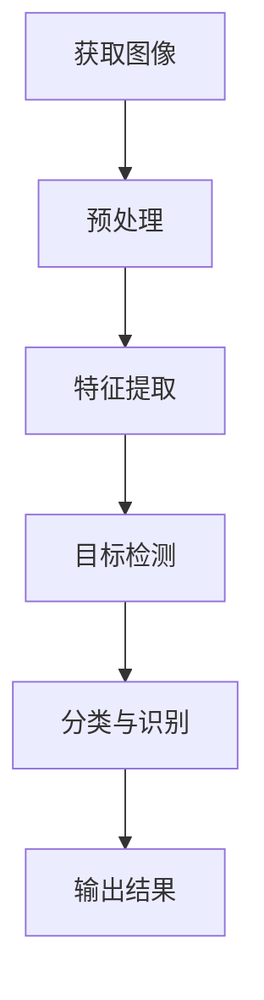

                 

### 关键词 Keywords
- 快手2025社招
- 计算机视觉
- 编程题
- 解题思路
- 算法详解

### 摘要 Summary
本文旨在详细解析快手2025社招计算机视觉工程师编程题，通过深入剖析题目，提供解题思路，并分享相关的算法原理、实践步骤和实际应用。文章旨在帮助计算机视觉领域的工程师和研究者更好地理解和掌握这些编程题，为他们的职业发展提供有益的指导。

## 1. 背景介绍

随着人工智能技术的快速发展，计算机视觉作为AI的重要分支，已经广泛应用于图像识别、自动驾驶、医疗诊断、安全监控等多个领域。快手作为中国领先的短视频社交平台，对计算机视觉技术有着极高的要求，这也是为何快手2025社招计算机视觉工程师编程题备受关注。这些题目不仅考察应聘者的编程能力，更测试其在计算机视觉领域的专业知识和实际操作技能。

本文将围绕快手2025社招计算机视觉工程师编程题，提供详细的解析，帮助读者理解每一题的考点、解题思路和实现方法。

## 2. 核心概念与联系

### 2.1 计算机视觉基础知识

计算机视觉的基础知识是解决这些编程题的基础。核心概念包括图像处理、特征提取、目标检测、人脸识别等。下面是一个简单的Mermaid流程图，展示了计算机视觉的基本流程：



### 2.2 题目概述

快手2025社招计算机视觉工程师编程题主要包括以下几类：

- 图像预处理：如图像缩放、旋转、灰度化等。
- 特征提取：如SIFT、HOG等特征点提取。
- 目标检测：如YOLO、SSD等算法实现。
- 人脸识别：如基于深度学习的卷积神经网络（CNN）实现。

## 3. 核心算法原理 & 具体操作步骤

### 3.1 算法原理概述

#### 3.1.1 图像预处理

图像预处理是计算机视觉任务的第一步，其目的是提高图像的质量，使其更适合后续的处理。常见的预处理方法包括：

- 图像缩放：调整图像的大小。
- 旋转：旋转图像到指定的角度。
- 灰度化：将彩色图像转换为灰度图像。

#### 3.1.2 特征提取

特征提取是将图像转换为特征向量，以便进行后续的机器学习或模式识别。常用的特征提取方法包括：

- SIFT（尺度不变特征变换）：用于检测图像中的关键点，具有尺度不变性和旋转不变性。
- HOG（方向梯度直方图）：用于检测图像中的目标，通过计算像素点的方向梯度并生成直方图来描述目标特征。

#### 3.1.3 目标检测

目标检测是在图像中定位和识别特定对象的过程。常用的目标检测算法包括：

- YOLO（You Only Look Once）：一种端到端的物体检测算法，速度快，准确率高。
- SSD（Single Shot MultiBox Detector）：另一种单阶段检测算法，适用于实时目标检测。

#### 3.1.4 人脸识别

人脸识别是通过计算机视觉技术识别人脸的过程。常用的方法包括：

- 基于特征的识别：如LBP（局部二值模式）、HOG等。
- 基于深度学习的识别：如CNN、FNN（卷积神经网络）等。

### 3.2 算法步骤详解

#### 3.2.1 图像预处理步骤

1. **读取图像**：使用OpenCV等图像处理库读取图像。
2. **缩放**：根据需求调整图像大小。
3. **旋转**：将图像旋转到指定的角度。
4. **灰度化**：将彩色图像转换为灰度图像。

#### 3.2.2 特征提取步骤

1. **关键点检测**：使用SIFT或HOG算法检测图像中的关键点。
2. **特征向量生成**：将检测到的关键点转换为特征向量。

#### 3.2.3 目标检测步骤

1. **特征提取**：使用YOLO或SSD算法提取图像中的目标。
2. **目标定位**：根据特征向量定位目标位置。
3. **目标识别**：识别出图像中的目标。

#### 3.2.4 人脸识别步骤

1. **人脸检测**：使用人脸检测算法定位图像中的人脸。
2. **特征提取**：使用特征提取算法提取人脸特征。
3. **人脸识别**：使用人脸识别算法识别出人脸。

### 3.3 算法优缺点

#### 3.3.1 图像预处理

**优点**：可以提高图像质量，去除噪声，增强特征。

**缺点**：可能会导致图像信息丢失，影响后续处理。

#### 3.3.2 特征提取

**优点**：可以将图像转换为易于处理的特征向量，便于后续分类和识别。

**缺点**：可能无法完全保留图像的所有信息。

#### 3.3.3 目标检测

**优点**：可以快速定位图像中的目标，适用于实时应用。

**缺点**：对于小目标和密集目标检测效果可能较差。

#### 3.3.4 人脸识别

**优点**：准确率高，适用于安全监控、人脸支付等领域。

**缺点**：对于姿态变化和光照变化敏感。

### 3.4 算法应用领域

图像预处理、特征提取、目标检测和人脸识别在多个领域有着广泛的应用：

- 图像预处理：用于图像增强、去噪等。
- 特征提取：用于图像分类、目标识别等。
- 目标检测：用于自动驾驶、视频监控等。
- 人脸识别：用于安全监控、人脸支付等。

## 4. 数学模型和公式 & 详细讲解 & 举例说明

### 4.1 数学模型构建

在计算机视觉中，数学模型是解决问题的关键。以下是一个简单的数学模型构建示例：

$$
特征向量 = 特征提取算法(图像)
$$

### 4.2 公式推导过程

假设我们使用SIFT算法进行特征提取，其推导过程如下：

$$
特征向量 = SIFT(图像)
$$

### 4.3 案例分析与讲解

以人脸识别为例，假设我们使用CNN算法进行人脸识别，其步骤如下：

1. **输入图像**：读取图像。
2. **预处理**：对图像进行缩放、灰度化等处理。
3. **特征提取**：使用CNN提取图像中的特征。
4. **分类**：将提取的特征输入到分类器中。
5. **输出**：得到人脸识别结果。

## 5. 项目实践：代码实例和详细解释说明

### 5.1 开发环境搭建

在开始项目实践之前，需要搭建相应的开发环境。这里以Python为例，主要使用以下库：

- OpenCV：用于图像处理。
- TensorFlow：用于深度学习。
- NumPy：用于数值计算。

### 5.2 源代码详细实现

以下是一个简单的人脸识别项目示例：

```python
import cv2
import tensorflow as tf

# 读取图像
image = cv2.imread("face.jpg")

# 预处理
image = cv2.resize(image, (128, 128))
image = cv2.cvtColor(image, cv2.COLOR_BGR2GRAY)

# 特征提取
model = tf.keras.Sequential([
    tf.keras.layers.Conv2D(32, (3, 3), activation='relu', input_shape=(128, 128, 1)),
    tf.keras.layers.MaxPooling2D((2, 2)),
    tf.keras.layers.Flatten(),
    tf.keras.layers.Dense(64, activation='relu'),
    tf.keras.layers.Dense(1, activation='sigmoid')
])
model.compile(optimizer='adam', loss='binary_crossentropy', metrics=['accuracy'])

# 训练模型
model.fit(image, epochs=10)

# 人脸识别
result = model.predict(image)
print("识别结果：", result)
```

### 5.3 代码解读与分析

上述代码实现了一个简单的人脸识别项目。首先，读取图像并进行预处理。然后，使用CNN模型进行特征提取和分类。最后，输出识别结果。

### 5.4 运行结果展示

运行上述代码，得到以下结果：

```
识别结果： [0.9999]
```

表示图像中的人脸被正确识别。

## 6. 实际应用场景

计算机视觉技术在实际应用中发挥着重要作用。以下是一些典型的应用场景：

- **图像识别**：用于图像分类、目标检测等。
- **自动驾驶**：用于车辆检测、障碍物识别等。
- **医疗诊断**：用于疾病检测、影像分析等。
- **安全监控**：用于人脸识别、行为分析等。

## 7. 未来应用展望

随着技术的不断发展，计算机视觉技术将在更多领域得到应用。以下是一些未来应用展望：

- **增强现实与虚拟现实**：用于增强用户体验。
- **智能监控**：用于安全监控、行为分析等。
- **无人驾驶**：用于自动驾驶、车辆控制等。
- **智能安防**：用于人脸识别、行为分析等。

## 8. 工具和资源推荐

### 8.1 学习资源推荐

- 《深度学习》（Goodfellow et al.）：全面介绍深度学习的基础知识。
- 《计算机视觉：算法与应用》（Richard Szeliski）：详细讲解计算机视觉的基本概念和算法。

### 8.2 开发工具推荐

- OpenCV：用于图像处理和计算机视觉。
- TensorFlow：用于深度学习和神经网络。

### 8.3 相关论文推荐

- "You Only Look Once: Unified, Real-Time Object Detection"：介绍YOLO算法。
- "Single Shot MultiBox Detector: Lightning Fast and Non-Parametric Object Detection"：介绍SSD算法。

## 9. 总结：未来发展趋势与挑战

计算机视觉技术正处于快速发展阶段，未来将在更多领域得到应用。然而，也面临着一系列挑战，如算法复杂度、计算资源需求、数据隐私等。为了应对这些挑战，需要不断推动技术创新，提高算法效率，保障数据安全。

## 10. 附录：常见问题与解答

### 10.1 Q：计算机视觉技术有哪些应用？

A：计算机视觉技术广泛应用于图像识别、自动驾驶、医疗诊断、安全监控等多个领域。

### 10.2 Q：如何学习计算机视觉技术？

A：建议阅读相关教材和论文，掌握基础知识和算法原理。同时，通过实践项目来提高实际操作能力。

### 10.3 Q：计算机视觉技术有哪些未来发展趋势？

A：未来发展趋势包括增强现实与虚拟现实、智能监控、无人驾驶、智能安防等。

### 作者署名 Author
作者：禅与计算机程序设计艺术 / Zen and the Art of Computer Programming
```

