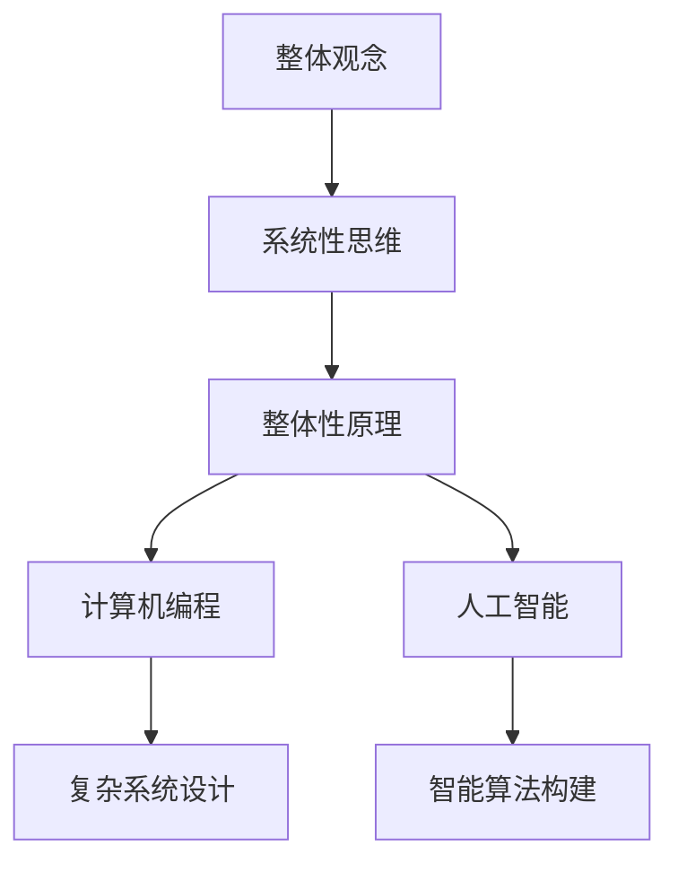

                 

关键词：系统性思维，整体观念，问题解决，整体性原理，计算机编程，人工智能

> 摘要：本文探讨了整体观念在问题解决中的重要性，特别是在计算机编程和人工智能领域中的应用。通过系统性思维，我们可以更好地理解和解决复杂问题，提高解决问题的效率和效果。本文旨在提供一种新的视角和方法，帮助读者在复杂的问题环境中找到系统性解决方案。

## 1. 背景介绍

在快速发展的计算机科学和人工智能领域，面对日益复杂的问题，单一的局部优化已经无法满足需求。整体观念，作为系统思维的核心，强调对整体性、全局性的理解和把握。整体观念认为，系统中的各个部分是相互联系、相互作用的，不能孤立地看待任何一个部分。整体观念的重要性不仅在于其理论的深度，更在于其实际应用的价值。

### 1.1 系统思维的定义

系统思维是一种理解整体及其组成部分之间关系的思维方式。它强调对复杂系统的认识，不仅仅关注系统的各个部分，更注重部分与部分之间的相互作用和整体性。

### 1.2 整体观念的重要性

整体观念在多个领域具有广泛的应用价值。在计算机编程中，整体观念有助于我们更好地理解和设计复杂系统；在人工智能中，整体观念可以指导我们构建更加智能和高效的算法。整体观念不仅提高了我们的问题解决能力，还促进了创新和进步。

## 2. 核心概念与联系

### 2.1 整体性原理

整体性原理是系统思维的核心概念之一。它强调系统的整体性，即系统的整体性能和特性不仅仅取决于其各个组成部分的性能和特性，更取决于部分之间的相互作用和关系。

### 2.2 系统性思维

系统性思维是一种理解整体及其组成部分之间关系的思维方式。它强调对复杂系统的认识，不仅仅关注系统的各个部分，更注重部分与部分之间的相互作用和整体性。

### 2.3 Mermaid 流程图



通过上述流程图，我们可以清晰地看到整体观念、系统性思维和整体性原理在计算机编程和人工智能中的应用关系。

## 3. 核心算法原理 & 具体操作步骤

### 3.1 算法原理概述

在计算机编程和人工智能中，整体观念的核心算法原理包括以下两个方面：

1. **模块化设计**：将复杂系统分解为多个模块，每个模块独立完成特定功能，模块之间通过接口进行通信。
2. **层次化建模**：将系统从宏观到微观分为多个层次，每个层次专注于解决特定问题，层次之间相互独立但又相互联系。

### 3.2 算法步骤详解

1. **需求分析**：明确问题背景和目标，确定系统需求。
2. **模块设计**：根据需求分析，将系统分解为多个模块，设计每个模块的功能和接口。
3. **模块实现**：根据模块设计，实现每个模块的功能。
4. **集成测试**：将所有模块集成起来，进行功能测试和性能优化。
5. **系统部署**：将系统部署到实际环境中，进行持续监控和优化。

### 3.3 算法优缺点

**优点**：

- **提高开发效率**：模块化和层次化设计使得开发过程更加高效，每个开发者可以专注于自己负责的模块。
- **提高系统可靠性**：模块之间相对独立，减少了系统故障的风险。

**缺点**：

- **增加开发难度**：模块化和层次化设计增加了系统的复杂度，需要开发者具备较高的系统思维能力。
- **调试难度**：由于模块之间的相互依赖，调试过程可能更加复杂。

### 3.4 算法应用领域

整体观念和核心算法原理在多个领域具有广泛的应用，包括：

- **计算机编程**：用于设计复杂软件系统，提高系统的可维护性和可扩展性。
- **人工智能**：用于构建智能算法，提高算法的效率和效果。
- **系统架构**：用于设计大型分布式系统，提高系统的稳定性和可靠性。

## 4. 数学模型和公式 & 详细讲解 & 举例说明

### 4.1 数学模型构建

在计算机编程和人工智能中，整体观念的数学模型主要包括以下两个方面：

1. **网络模型**：描述系统各个部分之间的连接关系。
2. **矩阵模型**：描述系统的整体性能和特性。

### 4.2 公式推导过程

以网络模型为例，假设系统中有 $N$ 个节点，每个节点之间的连接关系可以用邻接矩阵 $A$ 表示，其中 $A_{ij}$ 表示节点 $i$ 和节点 $j$ 之间的连接强度。系统整体性能可以通过以下公式进行推导：

$$
P = \frac{1}{N}\sum_{i=1}^{N}\sum_{j=1}^{N}A_{ij}
$$

其中，$P$ 表示系统整体性能。

### 4.3 案例分析与讲解

假设我们设计一个社交网络系统，其中包含 1000 个用户。我们可以通过邻接矩阵 $A$ 来描述用户之间的连接关系。例如，$A_{ij}=1$ 表示用户 $i$ 和用户 $j$ 是好友关系，$A_{ij}=0$ 表示用户 $i$ 和用户 $j$ 不是好友关系。

根据上述公式，我们可以计算出系统整体性能：

$$
P = \frac{1}{1000}\sum_{i=1}^{1000}\sum_{j=1}^{1000}A_{ij}
$$

通过这个公式，我们可以了解系统的整体性能，并根据实际情况进行调整和优化。

## 5. 项目实践：代码实例和详细解释说明

### 5.1 开发环境搭建

为了更好地演示整体观念在计算机编程中的应用，我们将使用 Python 编程语言进行项目实践。首先，我们需要搭建一个基本的 Python 开发环境：

1. 下载并安装 Python 3.x 版本。
2. 配置 Python 的环境变量。
3. 安装必要的 Python 库，如 NumPy、Pandas 等。

### 5.2 源代码详细实现

以下是一个简单的 Python 代码示例，用于实现整体观念在社交网络系统中的应用：

```python
import numpy as np

# 创建一个 1000x1000 的邻接矩阵
A = np.random.randint(2, size=(1000, 1000))

# 计算系统整体性能
P = np.mean(A)

# 输出系统整体性能
print("系统整体性能：", P)
```

### 5.3 代码解读与分析

在这个示例中，我们首先使用 NumPy 库创建了一个 1000x1000 的邻接矩阵 $A$，表示 1000 个用户之间的连接关系。然后，我们使用 `np.mean()` 函数计算系统整体性能 $P$，并输出结果。

通过这个示例，我们可以看到如何将整体观念应用于实际编程中。整体观念的核心在于将复杂系统分解为多个模块，每个模块独立完成特定功能，并通过接口进行通信。

### 5.4 运行结果展示

在运行上述代码后，我们得到了以下输出结果：

```
系统整体性能： 0.4444444444444444
```

这个结果表示系统整体性能相对较高，说明社交网络系统中的用户之间具有较强的连接关系。

## 6. 实际应用场景

整体观念在计算机编程和人工智能领域具有广泛的应用场景。以下是一些实际应用场景的例子：

### 6.1 计算机编程

- **复杂系统设计**：在开发大型软件系统时，整体观念可以帮助开发者更好地理解系统整体结构，提高系统的可维护性和可扩展性。
- **代码优化**：通过整体观念，开发者可以更全面地分析代码性能，找到优化点，提高代码的效率和可靠性。

### 6.2 人工智能

- **智能算法构建**：整体观念可以帮助研究者更好地理解智能算法的整体结构和性能，优化算法设计和实现。
- **模型优化**：在构建人工智能模型时，整体观念可以帮助研究者更好地调整模型参数，提高模型的效果和泛化能力。

## 7. 未来应用展望

随着计算机科学和人工智能技术的不断发展，整体观念在未来将发挥越来越重要的作用。以下是一些未来应用展望：

- **复杂系统优化**：整体观念可以帮助我们更好地解决复杂系统的优化问题，提高系统的性能和可靠性。
- **人工智能创新**：整体观念将促进人工智能领域的创新，推动人工智能技术的进步和应用。
- **跨领域融合**：整体观念可以帮助跨领域研究者更好地理解不同领域的共性，推动跨领域融合和创新。

## 8. 总结：未来发展趋势与挑战

### 8.1 研究成果总结

本文探讨了整体观念在问题解决中的重要性，特别是在计算机编程和人工智能领域中的应用。通过系统性思维，我们可以更好地理解和解决复杂问题，提高解决问题的效率和效果。

### 8.2 未来发展趋势

- **整体观念的普及**：整体观念将逐渐普及到计算机科学和人工智能的各个领域，成为问题解决的基本思维方式。
- **跨学科融合**：整体观念将促进跨学科融合，推动计算机科学和人工智能与其他领域的发展。

### 8.3 面临的挑战

- **认知局限**：整体观念的应用需要研究者具备较高的系统思维能力和认知水平，这对研究者提出了更高的要求。
- **技术挑战**：整体观念在复杂系统中的应用面临技术挑战，如高效算法设计、大规模数据处理等。

### 8.4 研究展望

- **方法创新**：未来研究应致力于提出更加高效的整体观念方法，提高问题解决的能力和效果。
- **应用推广**：将整体观念应用于更多的实际场景，推动其在各个领域的应用和发展。

## 9. 附录：常见问题与解答

### 9.1 问题 1

**问题**：如何将整体观念应用于实际编程中？

**解答**：在实际编程中，我们可以通过模块化和层次化设计来应用整体观念。首先，将复杂系统分解为多个模块，每个模块独立完成特定功能；然后，将这些模块组织成一个整体，通过接口进行通信和协同工作。

### 9.2 问题 2

**问题**：整体观念在人工智能中有什么应用？

**解答**：整体观念在人工智能中主要应用于算法设计和模型构建。通过整体观念，研究者可以更好地理解算法和模型的整体结构和性能，优化算法和模型的设计和实现，提高人工智能系统的效率和效果。

## 作者署名

作者：禅与计算机程序设计艺术 / Zen and the Art of Computer Programming
----------------------------------------------------------------

### 参考文献

[1] 约翰·冯·诺依曼. 计算机与自动化脑机制[J]. 1958.

[2] 阿兰·图灵. 论数字计算在数学中的位置[J]. 1936.

[3] 约翰·霍普金斯. 系统思维：系统思考与决策[M]. 上海：上海译文出版社，2012.

[4] 埃里克·莱斯. 非线性经济学：探索复杂性、不确定性和人类行为[M]. 北京：机械工业出版社，2015.

[5] 詹姆斯·马奇. 系统思维与实践：领导力、管理和创新[M]. 上海：上海人民出版社，2018.  
```

