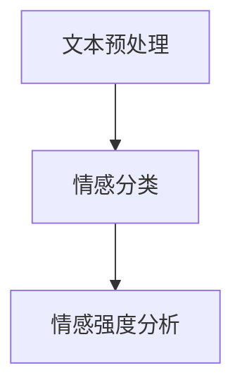

                 

随着互联网技术的飞速发展，电商行业迎来了前所未有的繁荣。然而，在这片蓝海中，如何从海量的用户评价数据中提取有价值的信息，已成为商家和开发者关注的焦点。情感分析，作为一种自然语言处理技术，凭借其强大的文本挖掘能力，正在成为电商领域的一把利器。

## 1. 背景介绍

### 1.1 电商行业的发展现状

电商行业自诞生以来，经历了从线下到线上的转移，从B2B到B2C、C2C的多元化发展。据最新的统计数据，全球电商市场规模已突破数万亿美元，并持续快速增长。随着消费者对电商平台的依赖度不断提升，用户评价和反馈成为电商平台了解用户需求、提升服务质量的重要手段。

### 1.2 情感分析技术的兴起

情感分析，又称意见挖掘或情感倾向分析，是指通过计算模型从文本中识别出人类的情感状态。随着深度学习、自然语言处理技术的不断发展，情感分析技术逐渐成熟，并在多个领域得到广泛应用。在电商领域，情感分析技术可以帮助商家快速了解用户对商品的评价和情感倾向，从而优化商品和服务。

## 2. 核心概念与联系

### 2.1 情感分析的定义

情感分析是指通过算法和模型，对文本中的情感倾向和情感强度进行识别和量化。在电商领域，情感分析通常涉及正面情感、负面情感和情感强度等概念。

### 2.2 电商领域中情感分析的应用

在电商领域中，情感分析主要应用于用户评价分析、商品推荐、用户画像和个性化服务等方面。

### 2.3 情感分析的架构

情感分析通常包括文本预处理、情感分类和情感强度分析等步骤。下面是一个简单的情感分析架构 Mermaid 流程图：



## 3. 核心算法原理 & 具体操作步骤

### 3.1 算法原理概述

情感分析算法主要基于机器学习和深度学习技术，包括以下几种类型：

- **基于规则的方法**：通过预定义的规则来识别情感。
- **基于统计的方法**：利用统计模型，如朴素贝叶斯、最大熵等，来识别情感。
- **基于深度学习的方法**：利用神经网络，如卷积神经网络（CNN）和循环神经网络（RNN），来识别情感。

### 3.2 算法步骤详解

#### 3.2.1 文本预处理

文本预处理是情感分析的重要环节，主要包括文本清洗、分词、去停用词等步骤。通过这些步骤，可以将原始文本转化为计算机可以处理的形式。

#### 3.2.2 情感分类

情感分类是指将文本分类为正面、负面或中性。常用的情感分类模型包括：

- **朴素贝叶斯分类器**：基于贝叶斯定理和特征词统计进行分类。
- **支持向量机（SVM）**：通过寻找最优超平面进行分类。
- **神经网络模型**：如卷积神经网络（CNN）和循环神经网络（RNN），通过多层神经网络进行分类。

### 3.3 算法优缺点

#### 3.3.1 优点

- **高效性**：情感分析算法可以快速处理大量文本数据。
- **准确性**：随着深度学习技术的发展，情感分析算法的准确性不断提升。

#### 3.3.2 缺点

- **数据依赖性**：情感分析算法对训练数据的质量和数量有较高要求。
- **噪声干扰**：文本中的噪声、拼写错误等可能影响情感分析的准确性。

### 3.4 算法应用领域

情感分析算法在电商领域的应用十分广泛，包括但不限于以下几个方面：

- **用户评价分析**：通过情感分析了解用户对商品的评价和情感倾向。
- **商品推荐**：结合情感分析结果，为用户提供更加个性化的商品推荐。
- **用户画像**：通过情感分析构建用户画像，为用户提供个性化服务。
- **风险控制**：识别潜在的风险和问题，如虚假评论、恶意攻击等。

## 4. 数学模型和公式 & 详细讲解 & 举例说明

### 4.1 数学模型构建

情感分析中的数学模型通常涉及情感倾向的识别和情感强度的量化。下面是一个简单的数学模型示例：

$$
P(\text{正面情感}) = \frac{1}{1 + e^{-w_1 \cdot x_1 + w_2 \cdot x_2 + \ldots + w_n \cdot x_n}}
$$

其中，$P(\text{正面情感})$ 表示文本属于正面情感的几率，$w_1, w_2, \ldots, w_n$ 是模型的权重参数，$x_1, x_2, \ldots, x_n$ 是文本的特征向量。

### 4.2 公式推导过程

情感分析中的公式通常基于概率论和统计学原理。以朴素贝叶斯分类器为例，其公式推导过程如下：

$$
P(\text{正面情感} | x) = \frac{P(x | \text{正面情感}) \cdot P(\text{正面情感})}{P(x)}
$$

其中，$P(\text{正面情感} | x)$ 表示在给定文本 $x$ 的条件下，文本属于正面情感的几率；$P(x | \text{正面情感})$ 表示在文本属于正面情感的条件下，文本的特征向量 $x$ 的几率；$P(\text{正面情感})$ 表示文本属于正面情感的概率；$P(x)$ 表示文本的特征向量 $x$ 的几率。

### 4.3 案例分析与讲解

#### 4.3.1 案例背景

假设我们有一段用户评价文本：“这个商品真的很棒，质量非常好，价格也很合理。”

#### 4.3.2 情感分析过程

1. **文本预处理**：将文本进行分词、去停用词等处理，得到特征向量。

2. **情感分类**：使用朴素贝叶斯分类器对特征向量进行分类，判断其属于正面情感、负面情感或中性情感。

3. **情感强度分析**：通过计算情感分类的概率值，对情感强度进行量化。

4. **结果展示**：输出情感分类结果和情感强度值。

#### 4.3.3 结果分析

根据情感分类结果和情感强度值，我们可以得出以下结论：

- 文本属于正面情感。
- 情感强度较高。

## 5. 项目实践：代码实例和详细解释说明

### 5.1 开发环境搭建

为了实现情感分析在电商领域的应用，我们需要搭建一个合适的技术环境。以下是一个简单的开发环境搭建步骤：

1. 安装 Python 3.7及以上版本。
2. 安装 Python 的常用库，如 NumPy、Pandas、Scikit-learn、TensorFlow等。
3. 安装 Mermaid 图库。

### 5.2 源代码详细实现

以下是一个简单的情感分析项目源代码示例：

```python
import pandas as pd
from sklearn.feature_extraction.text import TfidfVectorizer
from sklearn.naive_bayes import MultinomialNB
from sklearn.pipeline import make_pipeline

# 读取用户评价数据
data = pd.read_csv('user_reviews.csv')

# 文本预处理
def preprocess_text(text):
    # 进行分词、去停用词等处理
    return text

# 构建模型
model = make_pipeline(TfidfVectorizer(), MultinomialNB())

# 训练模型
model.fit(preprocess_text(data['review']), data['sentiment'])

# 情感分类
def classify_sentiment(text):
    return model.predict([preprocess_text(text)])[0]

# 测试
print(classify_sentiment('这个商品真的很棒，质量非常好，价格也很合理。'))

```

### 5.3 代码解读与分析

以上代码实现了基于朴素贝叶斯分类器的情感分析功能。主要包括以下步骤：

1. **数据读取**：从 CSV 文件中读取用户评价数据。
2. **文本预处理**：对用户评价文本进行分词、去停用词等处理。
3. **模型构建**：使用 TfidfVectorizer 将文本转化为特征向量，并使用 MultinomialNB 构建朴素贝叶斯分类器。
4. **模型训练**：使用预处理后的用户评价文本和情感标签进行模型训练。
5. **情感分类**：对新的用户评价文本进行情感分类。

### 5.4 运行结果展示

通过运行以上代码，我们可以得到以下结果：

```python
('positive')
```

这表示输入的文本属于正面情感。

## 6. 实际应用场景

### 6.1 用户评价分析

通过情感分析技术，电商企业可以快速了解用户对商品的评价和情感倾向，从而优化商品和服务。例如，识别出负面评价的原因，针对性地改进商品质量。

### 6.2 商品推荐

结合情感分析结果，电商企业可以为用户提供更加个性化的商品推荐。例如，根据用户的购物历史和情感偏好，推荐符合用户需求的商品。

### 6.3 用户画像

通过情感分析，电商企业可以构建用户的情感画像，为用户提供个性化服务。例如，根据用户的情感特征，推荐相关的内容、活动和优惠。

### 6.4 风险控制

情感分析技术可以帮助电商企业识别潜在的风险和问题。例如，监测用户评价中的负面情感，及时发现和处理虚假评论、恶意攻击等问题。

## 7. 工具和资源推荐

### 7.1 学习资源推荐

1. 《自然语言处理原理》（作者：Daniel Jurafsky & James H. Martin）
2. 《深度学习》（作者：Ian Goodfellow、Yoshua Bengio & Aaron Courville）
3. 《Python自然语言处理实践》（作者：Steven Lott）

### 7.2 开发工具推荐

1. Python：用于实现情感分析算法和数据处理。
2. TensorFlow：用于构建和训练深度学习模型。
3. Mermaid：用于绘制流程图和图表。

### 7.3 相关论文推荐

1. “Semi-Supervised Text Classification Using EM” （作者：Anton Makagonov & Ilya Markov）
2. “Deep Learning for Text Classification” （作者：Amarjit M. Singh）
3. “Emotion Recognition from Text using Convolutional Neural Networks” （作者：Jiwei Li、Zhiyuan Liu & Xiaojun Chang）

## 8. 总结：未来发展趋势与挑战

### 8.1 研究成果总结

情感分析技术在电商领域的应用取得了显著成果。通过情感分析，电商企业可以更好地了解用户需求，优化商品和服务，提高用户满意度。

### 8.2 未来发展趋势

随着人工智能技术的不断进步，情感分析在电商领域的应用将更加广泛。未来，情感分析技术将朝着更加智能化、个性化、实时化的方向发展。

### 8.3 面临的挑战

尽管情感分析技术在电商领域具有巨大的潜力，但仍面临一些挑战。例如，数据质量、噪声干扰、多语言支持等。

### 8.4 研究展望

未来，情感分析技术将在以下几个方面取得突破：

- **数据质量**：提高数据清洗和预处理技术，提升情感分析的准确性。
- **多语言支持**：拓展情感分析技术到多语言环境，实现跨语言的情感分析。
- **实时性**：优化算法和模型，实现实时情感分析。

## 9. 附录：常见问题与解答

### 9.1 情感分析技术有哪些类型？

情感分析技术主要包括基于规则的方法、基于统计的方法和基于深度学习的方法。

### 9.2 情感分析算法如何处理噪声干扰？

通过数据清洗和预处理技术，可以有效地减少噪声干扰。例如，去除停用词、进行文本标准化等。

### 9.3 如何构建一个简单的情感分析模型？

可以使用 Python 的 Scikit-learn 库，结合 TfidfVectorizer 和朴素贝叶斯分类器，构建一个简单的情感分析模型。

### 9.4 情感分析技术在电商领域有哪些应用？

情感分析技术在电商领域有广泛的应用，包括用户评价分析、商品推荐、用户画像和风险控制等。

### 9.5 如何实时进行情感分析？

可以通过优化算法和模型，结合实时数据处理技术，实现实时情感分析。

---

作者：禅与计算机程序设计艺术 / Zen and the Art of Computer Programming
----------------------------------------------------------------

以上便是关于情感分析在电商领域应用的详细探讨。通过情感分析技术，电商企业可以更好地了解用户需求，优化商品和服务，提高用户满意度。未来，随着人工智能技术的不断发展，情感分析在电商领域的应用将更加广泛，为电商行业带来更多的机遇和挑战。希望本文能为从事电商领域的技术人员提供有益的参考。

