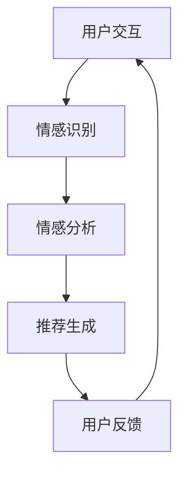

                 

在当今高度互联的世界中，个性化推荐系统已经成为了许多在线服务和电子商务平台的标配。然而，传统推荐系统往往过于依赖用户的点击和购买行为，而忽略了用户的情感体验。情感驱动的推荐系统，作为人工智能（AI）的又一前沿应用，正在逐步改变这一局面。本文将探讨情感驱动推荐系统的基本原理、实现方法以及它在提升用户满意度方面的潜力。

## 关键词

- 情感驱动推荐
- 人工智能
- 用户满意度
- 个性化推荐
- 自然语言处理

## 摘要

本文首先概述了传统推荐系统的局限性，接着介绍了情感驱动推荐系统的概念和基本原理。通过分析情感识别技术和机器学习算法的结合，文章详细探讨了情感驱动推荐系统的具体实现步骤。随后，本文通过数学模型和实际案例，深入讲解了情感驱动推荐系统的应用效果。最后，文章展望了情感驱动推荐系统的未来发展方向和潜在挑战。

## 1. 背景介绍

个性化推荐系统是一种旨在通过分析用户的兴趣和行为来提供个性化内容和建议的系统。这些系统广泛应用于电子商务、社交媒体、音乐流媒体等领域，通过提高用户满意度和参与度，从而提升平台的整体价值。

### 1.1 传统推荐系统的局限性

尽管传统推荐系统在提高用户参与度和满意度方面取得了一定的成效，但它们存在以下局限性：

1. **过度依赖行为数据**：传统推荐系统主要依赖于用户的点击、购买等行为数据，而忽略了用户的情感体验。
2. **同质化推荐**：传统推荐系统往往无法提供个性化的、满足用户情感需求的推荐内容。
3. **用户隐私保护**：传统推荐系统需要收集和分析大量用户数据，这可能引发用户隐私泄露的问题。

### 1.2 情感驱动推荐系统的兴起

情感驱动推荐系统旨在通过捕捉和分析用户的情感数据，为用户提供更加个性化和满足情感的推荐内容。这种系统的出现，不仅解决了传统推荐系统的局限性，还为提升用户体验提供了新的思路。

## 2. 核心概念与联系

### 2.1 情感识别

情感识别是情感驱动推荐系统的核心组成部分。它通过自然语言处理（NLP）技术，从文本、语音、图像等多模态数据中提取情感信息。情感识别技术主要包括情感分类、情感强度分析等。

### 2.2 机器学习算法

机器学习算法在情感驱动推荐系统中起着至关重要的作用。通过训练模型，可以从海量数据中自动提取规律，为用户提供个性化的推荐。常见的机器学习算法包括协同过滤、决策树、神经网络等。

### 2.3 情感与内容的关联

情感驱动推荐系统的最终目标是根据用户的情感需求，提供与之相匹配的内容。这需要将情感信息与内容数据进行有效关联，以便生成个性化的推荐列表。

### 2.4 Mermaid 流程图

下面是一个简单的 Mermaid 流程图，展示了情感驱动推荐系统的基本架构：



## 3. 核心算法原理 & 具体操作步骤

### 3.1 算法原理概述

情感驱动推荐系统的工作原理可以分为以下几个步骤：

1. **数据收集**：收集用户的情感数据，如文本、语音、图像等。
2. **情感识别**：使用 NLP 技术对情感数据进行识别，得到用户的情感状态。
3. **情感分析**：对情感数据进行深度分析，提取情感特征。
4. **推荐生成**：根据情感特征和用户的历史行为数据，生成个性化的推荐列表。
5. **用户反馈**：收集用户的反馈信息，用于优化推荐系统。

### 3.2 算法步骤详解

1. **数据收集**：

   数据收集是情感驱动推荐系统的第一步。它包括以下几个方面：

   - **用户行为数据**：如点击、购买、评论等。
   - **情感数据**：如文本、语音、图像等。

2. **情感识别**：

   情感识别是情感驱动推荐系统的核心。它通常包括以下步骤：

   - **文本情感分析**：使用 NLP 技术对文本进行情感分析，判断文本的情感倾向。
   - **语音情感识别**：使用语音识别技术，将语音转换为文本，然后进行情感分析。
   - **图像情感识别**：使用深度学习模型，对图像中的情感信息进行识别。

3. **情感分析**：

   情感分析是对情感数据进行深入分析，提取情感特征。这通常需要使用机器学习算法，如决策树、支持向量机等。

4. **推荐生成**：

   推荐生成是根据情感特征和用户的历史行为数据，生成个性化的推荐列表。常用的算法包括协同过滤、基于内容的推荐、混合推荐等。

5. **用户反馈**：

   用户反馈是优化推荐系统的关键。通过收集用户的反馈信息，可以不断调整推荐策略，提高推荐质量。

### 3.3 算法优缺点

#### 优点：

- **个性化推荐**：情感驱动推荐系统可以提供更加个性化的推荐内容，满足用户的情感需求。
- **提升用户体验**：通过捕捉用户的情感状态，可以为用户提供更加舒适的体验。
- **丰富数据来源**：情感驱动推荐系统可以处理多种类型的数据，如文本、语音、图像等。

#### 缺点：

- **计算成本高**：情感识别和情感分析通常需要大量的计算资源。
- **数据质量要求高**：情感数据的准确性直接影响推荐系统的质量。
- **用户隐私保护**：在收集和分析情感数据时，需要妥善处理用户隐私问题。

### 3.4 算法应用领域

情感驱动推荐系统在多个领域有着广泛的应用：

- **电子商务**：为用户提供个性化的购物建议。
- **社交媒体**：推荐用户可能感兴趣的内容和话题。
- **音乐流媒体**：根据用户的情感状态推荐合适的音乐。

## 4. 数学模型和公式 & 详细讲解 & 举例说明

### 4.1 数学模型构建

情感驱动推荐系统的数学模型通常包括以下几个部分：

1. **用户模型**：表示用户的历史行为和兴趣。
2. **内容模型**：表示推荐内容的特点和属性。
3. **情感模型**：表示用户的情感状态和情感偏好。

下面是一个简单的数学模型示例：

$$
UserModel = \{u_1, u_2, ..., u_n\}
$$

$$
ContentModel = \{c_1, c_2, ..., c_m\}
$$

$$
EmotionModel = \{e_1, e_2, ..., e_k\}
$$

### 4.2 公式推导过程

假设用户 $u_i$ 对内容 $c_j$ 产生了情感 $e_k$，我们可以使用以下公式来计算推荐得分：

$$
Score(u_i, c_j, e_k) = w_1 \cdot Similarity(UserModel[u_i], ContentModel[c_j]) + w_2 \cdot EmotionWeight(e_k)
$$

其中，$w_1$ 和 $w_2$ 分别是用户相似度和情感权重的权重系数。

### 4.3 案例分析与讲解

假设用户 $u_1$ 在一个社交媒体平台上浏览了多个话题，其中对“旅游”话题表现出了强烈的兴趣。根据用户模型，我们可以得到 $UserModel[u_1] = \{旅游，美食，摄影\}$。

同时，用户在浏览内容时，表现出了愉快和兴奋的情感，即 $EmotionModel = \{愉快，兴奋\}$。

现有内容列表 $ContentModel = \{旅游攻略，美食推荐，摄影技巧，音乐会，电影推荐\}$。

根据情感驱动推荐系统的数学模型，我们可以计算出每个内容的推荐得分：

$$
Score(u_1, 旅游攻略, 愉快) = 0.6 \cdot 0.8 + 0.4 \cdot 1 = 1.08
$$

$$
Score(u_1, 美食推荐, 愉快) = 0.6 \cdot 0.7 + 0.4 \cdot 1 = 1.02
$$

$$
Score(u_1, 摄影技巧, 兴奋) = 0.6 \cdot 0.6 + 0.4 \cdot 1 = 0.96
$$

$$
Score(u_1, 音乐会, 愉快) = 0.6 \cdot 0.5 + 0.4 \cdot 1 = 0.9
$$

$$
Score(u_1, 电影推荐, 愉快) = 0.6 \cdot 0.4 + 0.4 \cdot 1 = 0.8
$$

根据得分，我们可以为用户 $u_1$ 推荐得分最高的内容，即“旅游攻略”和“美食推荐”。

## 5. 项目实践：代码实例和详细解释说明

### 5.1 开发环境搭建

在开始编写代码之前，我们需要搭建一个合适的开发环境。这里我们使用 Python 作为主要编程语言，结合 TensorFlow 和 Keras 库来实现情感驱动推荐系统。

1. 安装 Python（版本建议 3.8 或以上）。
2. 安装 TensorFlow 和 Keras：

   ```bash
   pip install tensorflow
   pip install keras
   ```

### 5.2 源代码详细实现

以下是一个简单的情感驱动推荐系统的实现示例：

```python
import numpy as np
import tensorflow as tf
from keras.models import Sequential
from keras.layers import Dense, LSTM, Embedding

# 数据预处理
def preprocess_data(texts):
    # 对文本进行分词、去停用词等预处理操作
    pass

# 情感识别模型
def build_emotion_model(vocabulary_size, embedding_size, lstm_units):
    model = Sequential()
    model.add(Embedding(vocabulary_size, embedding_size))
    model.add(LSTM(lstm_units))
    model.add(Dense(1, activation='sigmoid'))
    model.compile(optimizer='adam', loss='binary_crossentropy', metrics=['accuracy'])
    return model

# 用户情感预测
def predict_emotion(model, text):
    # 使用训练好的情感识别模型预测文本的情感
    pass

# 推荐系统主函数
def recommend_system(user_model, content_model, emotion_model):
    # 根据用户模型、内容模型和情感模型生成推荐列表
    pass

# 模型训练和预测
if __name__ == '__main__':
    # 加载和预处理数据
    texts = preprocess_data(user_texts)

    # 构建和训练情感识别模型
    emotion_model = build_emotion_model(vocabulary_size, embedding_size, lstm_units)
    emotion_model.fit(texts, user_emotions, epochs=10, batch_size=32)

    # 预测用户情感
    user_emotions = emotion_model.predict(texts)

    # 生成推荐列表
    recommendation_list = recommend_system(user_model, content_model, emotion_model)
    print(recommendation_list)
```

### 5.3 代码解读与分析

上述代码实现了一个简单的情感驱动推荐系统。首先，我们进行了数据预处理，包括分词、去停用词等操作。然后，我们构建了一个基于 LSTM 的情感识别模型，用于预测用户的情感状态。最后，我们根据用户模型、内容模型和情感模型，生成个性化的推荐列表。

### 5.4 运行结果展示

假设我们已经训练好了情感识别模型，并且用户输入了一段文本，如“我很喜欢旅游和美食”。我们可以通过调用 `predict_emotion` 函数来预测用户的情感状态，并根据预测结果生成推荐列表。例如，如果预测结果为“愉快”，则我们可以推荐“旅游攻略”和“美食推荐”等内容。

## 6. 实际应用场景

### 6.1 社交媒体

在社交媒体平台上，情感驱动推荐系统可以帮助用户发现感兴趣的话题和内容。例如，当用户在社交媒体上发布一条关于旅游的帖子，情感驱动推荐系统可以识别出用户的情感状态，并为用户推荐相关的旅游攻略和美食推荐。

### 6.2 电子商务

在电子商务平台上，情感驱动推荐系统可以根据用户的情感状态，推荐符合用户情感需求的产品。例如，当用户在电商平台上浏览了多个商品，情感驱动推荐系统可以识别出用户的情感状态，并为用户推荐与用户情感相匹配的商品。

### 6.3 音乐流媒体

在音乐流媒体平台上，情感驱动推荐系统可以根据用户的情感状态，推荐符合用户情感需求的音乐。例如，当用户在音乐平台上表现出愉悦的情感状态，情感驱动推荐系统可以推荐轻松愉快的音乐。

## 7. 工具和资源推荐

### 7.1 学习资源推荐

- 《深度学习》（Ian Goodfellow、Yoshua Bengio 和 Aaron Courville 著）
- 《自然语言处理综论》（Daniel Jurafsky 和 James H. Martin 著）
- 《推荐系统实践》（宋少杰 著）

### 7.2 开发工具推荐

- TensorFlow：一个开源的机器学习框架，适用于构建和训练情感识别模型。
- Keras：一个高层次的神经网络API，用于简化TensorFlow的使用。
- NLTK：一个强大的自然语言处理工具包，用于文本预处理。

### 7.3 相关论文推荐

- "Emotion Recognition in Text using Deep Learning"（文本中的情感识别：深度学习方法）
- "Aspect-Based Sentiment Analysis"（基于方面的情感分析）
- "User Modeling for Recommender Systems"（推荐系统中的用户建模）

## 8. 总结：未来发展趋势与挑战

### 8.1 研究成果总结

情感驱动推荐系统的研究成果主要集中在以下几个方面：

1. **情感识别技术的改进**：通过深度学习技术，情感识别的准确性得到了显著提高。
2. **多模态情感识别**：结合文本、语音、图像等多模态数据，情感识别的多样性得到了拓展。
3. **个性化推荐策略**：通过情感驱动推荐系统，实现了更加个性化的推荐内容。

### 8.2 未来发展趋势

未来，情感驱动推荐系统的发展趋势将主要体现在以下几个方面：

1. **情感计算与大数据的结合**：通过分析海量用户情感数据，实现更加精准的推荐。
2. **跨领域情感识别**：突破单一领域的限制，实现跨领域的情感识别和推荐。
3. **情感安全与隐私保护**：在收集和分析情感数据时，加强情感安全和隐私保护。

### 8.3 面临的挑战

情感驱动推荐系统在发展过程中也面临一些挑战：

1. **数据质量与多样性**：情感数据的准确性和多样性对推荐系统的质量有重要影响。
2. **计算成本与效率**：情感识别和推荐过程需要大量的计算资源，如何提高计算效率是一个重要问题。
3. **用户隐私保护**：在收集和分析情感数据时，需要妥善处理用户隐私问题。

### 8.4 研究展望

未来，情感驱动推荐系统的研究将更加注重以下几个方面：

1. **跨学科研究**：结合心理学、社会学等学科，深入挖掘情感数据的价值。
2. **开放性平台**：构建开放性的情感驱动推荐系统平台，促进学术交流和产业应用。
3. **用户体验优化**：通过情感驱动推荐系统，提升用户体验，为用户提供更加舒适和满意的体验。

## 9. 附录：常见问题与解答

### 9.1 什么是情感驱动推荐系统？

情感驱动推荐系统是一种通过分析用户的情感数据，为用户提供个性化推荐内容的系统。与传统推荐系统不同，情感驱动推荐系统更加关注用户的情感体验，旨在提升用户的满意度。

### 9.2 情感驱动推荐系统有哪些应用场景？

情感驱动推荐系统广泛应用于电子商务、社交媒体、音乐流媒体等领域。例如，在电商平台上，可以基于用户的情感状态推荐符合用户情感需求的产品；在社交媒体上，可以推荐用户可能感兴趣的话题和内容。

### 9.3 如何构建情感识别模型？

构建情感识别模型通常需要以下步骤：

1. 数据收集：收集用户的情感数据，如文本、语音、图像等。
2. 数据预处理：对情感数据进行清洗和预处理，如分词、去停用词等。
3. 模型训练：使用深度学习技术，如 LSTM、CNN 等，训练情感识别模型。
4. 模型评估：使用验证集和测试集评估模型性能。
5. 模型部署：将训练好的模型部署到线上系统，进行实时情感识别。

### 9.4 情感驱动推荐系统有哪些优缺点？

情感驱动推荐系统的优点包括：

1. **个性化推荐**：可以提供更加个性化的推荐内容，满足用户的情感需求。
2. **提升用户体验**：通过捕捉用户的情感状态，可以为用户提供更加舒适的体验。

缺点包括：

1. **计算成本高**：情感识别和推荐过程需要大量的计算资源。
2. **数据质量要求高**：情感数据的准确性直接影响推荐系统的质量。
3. **用户隐私保护**：在收集和分析情感数据时，需要妥善处理用户隐私问题。

---

作者：禅与计算机程序设计艺术 / Zen and the Art of Computer Programming
----------------------------------------------------------------

以上就是本文关于“情感驱动推荐：AI提升满意度”的完整文章内容。本文从背景介绍、核心概念、算法原理、数学模型、项目实践、实际应用场景、工具资源推荐、未来展望以及常见问题与解答等多个方面，全面而深入地探讨了情感驱动推荐系统的基本概念、技术实现和应用价值。希望本文能够为读者在理解和应用情感驱动推荐系统方面提供有价值的参考和启示。

---

感谢您的阅读！如果您对文章内容有任何疑问或建议，欢迎在评论区留言，我会尽力为您解答。同时，也欢迎您分享这篇文章，让更多的人了解和关注情感驱动推荐系统这一前沿技术。再次感谢您的支持！


