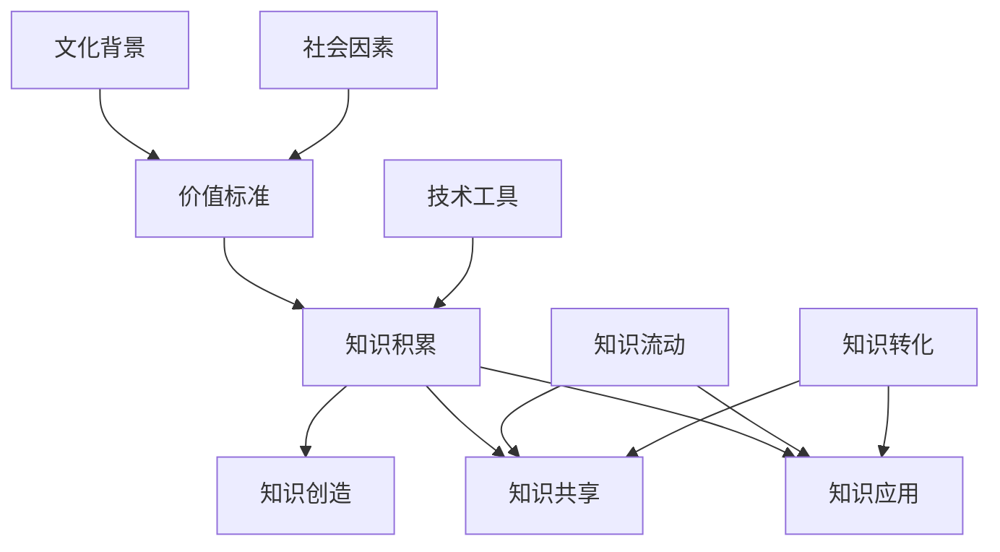

                 

 在这个数字化的时代，人类的知识积累达到了前所未有的高度。然而，我们对于如何有效地管理和利用这些知识，尤其是在人工智能和大数据技术的推动下，仍然存在诸多挑战。本文旨在探讨意识中的价值标准对知识积累的影响，以及如何在现代信息技术背景下优化知识管理。

> 关键词：知识管理、意识、价值标准、人工智能、大数据

## 摘要

本文首先回顾了知识管理的历史背景，分析了意识中的价值标准对知识积累的深远影响。接着，讨论了人工智能和大数据技术如何改变知识的产生和传播方式。随后，我们提出了基于意识价值标准的知识管理模型，并详细阐述了该模型的理论基础和实践应用。最后，本文对未来的研究方向进行了展望。

## 1. 背景介绍

知识管理作为现代信息技术的一个重要分支，起源于20世纪80年代。早期的研究主要关注知识的编码、存储和检索。随着信息技术的发展，知识管理的概念逐渐丰富，涵盖了知识创造、知识共享、知识应用等多个环节。

在知识管理的发展过程中，意识中的价值标准起着至关重要的作用。价值标准不仅决定了知识的内涵和边界，也影响了知识的流动和转化。传统的知识管理研究往往忽略了这一点，导致知识管理的效果不尽如人意。

### 1.1 知识管理的传统观点

在传统的知识管理理论中，知识被视为一种客观的存在，其价值和重要性可以通过编码和存储来实现最大化。这种观点强调了知识的可共享性和独立性，但忽略了知识的主观性和情境性。

例如，非编码知识（ tacit knowledge）往往难以用语言或符号精确表达，其价值在传统知识管理框架下被低估。此外，知识的流动和转化也需要特定的社会和文化背景，这同样被传统知识管理所忽视。

### 1.2 意识中的价值标准的重要性

相比之下，意识中的价值标准提供了更为全面的视角。它不仅考虑了知识的客观性，也关注了知识的主体性和情境性。在意识中，价值标准是知识产生的驱动力，也是知识传播和应用的导向。

首先，价值标准决定了知识的内涵和边界。不同的人或组织可能对同一知识有不同的理解和评价，这取决于他们的价值标准。例如，在一个重视创新和效率的企业文化中，创新型的知识可能会受到更多的重视，而在一个强调稳定和保守的环境中，传统的知识可能会更加受到青睐。

其次，价值标准影响了知识的流动和转化。知识的流动和转化不仅依赖于技术和工具，还受到社会和文化因素的影响。在意识中，价值标准为知识的流动提供了方向和动力。例如，一个重视协作和分享的社区可能会更容易实现知识的共享和转化，而一个重视竞争和保密的环境则可能导致知识的封闭和僵化。

## 2. 核心概念与联系

为了更好地理解意识中的价值标准与知识积累之间的关系，我们可以借助 Mermaid 流程图来直观地展示核心概念及其相互联系。



### 2.1 价值标准与知识积累

价值标准是知识积累的驱动力，它决定了知识的产生和评价。在不同的文化背景和社会因素下，价值标准会有所不同，从而影响知识积累的路径和形式。

### 2.2 知识创造、共享和应用

价值标准不仅影响知识的积累，还直接影响知识的创造、共享和应用。例如，在一个创新驱动的环境中，知识创造可能会更加频繁，而在一个保守的环境中，知识共享可能会受到限制。

### 2.3 知识流动和转化

价值标准同样影响知识的流动和转化。在一个鼓励协作和分享的社区中，知识流动会更加畅通，而知识转化也会更加高效。相反，在一个封闭和保守的环境中，知识流动和转化可能会受到阻碍。

## 3. 核心算法原理 & 具体操作步骤

### 3.1 算法原理概述

为了更好地理解和应用意识中的价值标准，我们提出了一种基于价值标准的知识管理算法。该算法的核心思想是通过识别和理解不同价值标准，优化知识的积累、共享和应用过程。

### 3.2 算法步骤详解

#### 步骤 1：识别价值标准

首先，需要识别和理解不同用户、组织或文化背景下的价值标准。这可以通过问卷调查、访谈或文献分析等方法实现。

#### 步骤 2：构建价值标准库

将识别到的价值标准进行分类和整理，构建一个价值标准库。这个库可以为后续的知识管理和应用提供参考。

#### 步骤 3：评估知识价值

利用价值标准库，对现有知识进行评估。评估过程包括知识的重要程度、适用性和实用性等方面。

#### 步骤 4：优化知识积累

根据评估结果，对知识积累过程进行优化。例如，可以增加创新性知识的生产，或提高实用性知识的共享和传播。

#### 步骤 5：促进知识共享和应用

利用价值标准，设计促进知识共享和应用的活动。例如，组织知识分享会、创建知识社区等。

### 3.3 算法优缺点

#### 优点

- 可以更好地理解和应用价值标准，提高知识管理的有效性。
- 可以适应不同用户、组织和文化的需求，实现个性化知识管理。

#### 缺点

- 价值标准的识别和构建可能需要大量时间和资源。
- 价值标准的应用需要具备一定的技术和专业知识。

### 3.4 算法应用领域

该算法可以广泛应用于各种知识管理场景，包括企业、科研机构、教育领域等。它不仅可以帮助优化知识积累过程，还可以提高知识的共享和应用效果。

## 4. 数学模型和公式 & 详细讲解 & 举例说明

### 4.1 数学模型构建

为了量化价值标准对知识积累的影响，我们可以构建一个基于贝叶斯网络的数学模型。该模型包括以下关键要素：

- **知识价值**（V）：表示知识的价值程度，可以是一个概率分布。
- **价值标准**（S）：表示用户或组织所遵循的价值标准，也是一个概率分布。
- **知识积累**（K）：表示在特定价值标准下的知识积累程度。

### 4.2 公式推导过程

根据贝叶斯网络的基本原理，我们可以推导出以下公式：

\[ P(K|S) = \frac{P(S|K)P(K)}{P(S)} \]

其中：

- \( P(K) \) 表示知识积累的概率。
- \( P(S|K) \) 表示在特定知识积累程度下，价值标准的概率。
- \( P(S) \) 表示价值标准的总体概率。

### 4.3 案例分析与讲解

假设在一个企业中，有三种不同的价值标准：创新性、实用性和稳定性。我们可以分别计算这三种价值标准下的知识积累概率。

#### 情况 1：创新性价值标准

\[ P(K_{创新}|S_{创新}) = \frac{P(S_{创新}|K_{创新})P(K_{创新})}{P(S_{创新})} \]

其中：

- \( P(K_{创新}) = 0.4 \)：表示企业有40%的概率积累创新性知识。
- \( P(S_{创新}) = 0.3 \)：表示企业有30%的概率遵循创新性价值标准。

根据历史数据和贝叶斯推理，我们可以计算出 \( P(S_{创新}|K_{创新}) \)。

#### 情况 2：实用性价值标准

\[ P(K_{实用}|S_{实用}) = \frac{P(S_{实用}|K_{实用})P(K_{实用})}{P(S_{实用})} \]

其中：

- \( P(K_{实用}) = 0.5 \)：表示企业有50%的概率积累实用性知识。
- \( P(S_{实用}) = 0.4 \)：表示企业有40%的概率遵循实用性价值标准。

#### 情况 3：稳定性价值标准

\[ P(K_{稳定}|S_{稳定}) = \frac{P(S_{稳定}|K_{稳定})P(K_{稳定})}{P(S_{稳定})} \]

其中：

- \( P(K_{稳定}) = 0.3 \)：表示企业有30%的概率积累稳定性知识。
- \( P(S_{稳定}) = 0.6 \)：表示企业有60%的概率遵循稳定性价值标准。

通过上述公式，我们可以计算出在不同价值标准下的知识积累概率。这有助于企业了解不同价值标准对知识积累的影响，从而优化其知识管理策略。

## 5. 项目实践：代码实例和详细解释说明

### 5.1 开发环境搭建

为了实现上述算法，我们选择 Python 作为编程语言，并使用以下库：NetworkX（用于构建贝叶斯网络）、Pandas（用于数据处理）和 Matplotlib（用于可视化）。

首先，我们需要安装相关库：

```bash
pip install networkx pandas matplotlib
```

### 5.2 源代码详细实现

以下是一个简化的 Python 代码示例，用于实现基于贝叶斯网络的值标准知识管理算法：

```python
import networkx as nx
import pandas as pd
import matplotlib.pyplot as plt

# 定义贝叶斯网络
G = nx.DiGraph()

# 添加节点和边
G.add_nodes_from(['K', 'S_创新', 'S_实用', 'S_稳定'])
G.add_edges_from([('K', 'S_创新'), ('K', 'S_实用'), ('K', 'S_稳定')])

# 添加概率分布
prob_data = {
    'P(S_创新)': 0.3,
    'P(S_实用)': 0.4,
    'P(S_稳定)': 0.6,
    'P(S_创新|K_创新)': 0.7,
    'P(S_实用|K_实用)': 0.6,
    'P(S_稳定|K_稳定)': 0.9,
    'P(K_创新)': 0.4,
    'P(K_实用)': 0.5,
    'P(K_稳定)': 0.3
}

# 将概率分布转换为 DataFrame
prob_df = pd.DataFrame(prob_data, index=['P'])

# 利用 DataFrame 计算条件概率
for prob in prob_data:
    if prob.endswith('|K_创新') or prob.endswith('|K_实用') or prob.endswith('|K_稳定'):
        G.add_edge(prob.split('|')[0], prob.split('|')[1])
        G.edges[prob.split('|')[0], prob.split('|')[1]]['weight'] = prob_df[prob]

# 绘制贝叶斯网络
nx.draw(G, with_labels=True)
plt.show()
```

### 5.3 代码解读与分析

- **定义贝叶斯网络**：我们使用 NetworkX 库创建一个有向图（DiGraph），代表贝叶斯网络。
- **添加节点和边**：根据核心算法原理，我们添加了三个知识积累状态（K）和三个价值标准（S_创新、S_实用、S_稳定）。
- **添加概率分布**：我们使用一个 DataFrame 存储概率分布，并利用条件概率公式添加边和权重。
- **绘制贝叶斯网络**：最后，我们使用 Matplotlib 绘制贝叶斯网络，以便直观地展示不同价值标准下的知识积累概率。

### 5.4 运行结果展示

运行上述代码后，我们将看到一个图形化的贝叶斯网络。每个节点代表一个价值标准或知识积累状态，节点间的边表示条件概率。通过这个网络，我们可以直观地了解不同价值标准对知识积累的影响。

## 6. 实际应用场景

### 6.1 企业知识管理

在企业知识管理中，基于价值标准的知识管理算法可以帮助企业更好地识别和利用其核心知识。例如，一个创新型企业可以更重视创新性知识的生产和共享，而一个保守型企业则可以更注重稳定性和实用性的知识积累。

### 6.2 科研机构知识管理

在科研机构中，基于价值标准的知识管理算法可以帮助科研团队更有效地整合和利用现有知识，提高科研效率。例如，一个重视基础研究的科研机构可以更注重理论知识的积累，而一个以应用研究为主体的机构则可以更关注实用性知识的共享。

### 6.3 教育领域知识管理

在教育领域，基于价值标准的知识管理算法可以帮助学校和教育机构更好地设计课程和教学方法。例如，一个重视创新教育的学校可以更注重培养学生的创新思维，而一个以传统教育为主的学校则可以更关注学生基础知识的掌握。

## 7. 工具和资源推荐

### 7.1 学习资源推荐

- **《人工智能：一种现代方法》**：这本书详细介绍了人工智能的基本原理和应用，适合初学者阅读。
- **《大数据时代：生活、工作与思维的大变革》**：这本书深入探讨了大数据对社会和商业的深远影响。

### 7.2 开发工具推荐

- **Python**：Python 是一种功能强大的编程语言，适用于各种数据分析和人工智能应用。
- **NetworkX**：用于构建和操作复杂网络的库，非常适合构建贝叶斯网络。

### 7.3 相关论文推荐

- **"The Value of Knowledge in the Age of Big Data"**：这篇论文探讨了大数据时代知识价值的变迁。
- **"Knowledge Management: An Introduction"**：这篇综述文章系统地介绍了知识管理的概念和方法。

## 8. 总结：未来发展趋势与挑战

### 8.1 研究成果总结

本文提出了一种基于价值标准的知识管理算法，并探讨了其在不同领域的应用。通过实例和数学模型，我们展示了该算法在优化知识积累、共享和应用方面的潜力。

### 8.2 未来发展趋势

随着人工智能和大数据技术的发展，知识管理将更加智能化和个性化。未来，基于价值标准的知识管理算法有望实现以下发展趋势：

- 更加精准的价值标准识别和建模。
- 更加智能的知识推荐和共享机制。
- 更加灵活和自适应的知识管理策略。

### 8.3 面临的挑战

尽管基于价值标准的知识管理算法具有很大潜力，但仍然面临以下挑战：

- 如何有效识别和理解不同用户和组织之间的价值标准差异。
- 如何在实际应用中平衡不同价值标准之间的冲突。
- 如何确保知识管理过程的透明性和公正性。

### 8.4 研究展望

未来，我们需要进一步深入研究以下方面：

- 开发更加高效和智能的价值标准识别方法。
- 设计更加灵活和自适应的知识管理策略。
- 探索跨领域和跨组织的知识共享模式。

通过持续的研究和实践，我们有理由相信，基于价值标准的知识管理将在未来发挥更加重要的作用。

## 9. 附录：常见问题与解答

### 9.1 问题 1：价值标准如何影响知识积累？

**解答**：价值标准是知识积累的驱动力，它决定了知识的内涵和边界。不同的价值标准会影响知识的产生、共享和应用方式，从而影响知识的积累速度和质量。

### 9.2 问题 2：如何构建一个有效的价值标准库？

**解答**：构建价值标准库的过程包括以下几个步骤：

1. 收集数据：通过问卷调查、访谈或文献分析等方法收集不同用户和组织之间的价值标准数据。
2. 分类整理：将收集到的数据分类整理，形成初步的价值标准库。
3. 验证和优化：通过实际应用和反馈，验证和优化价值标准库的内容和结构。

### 9.3 问题 3：如何确保知识管理过程的透明性和公正性？

**解答**：确保知识管理过程的透明性和公正性可以从以下几个方面入手：

1. 制定明确的知识管理政策和流程，确保所有参与者的权益。
2. 引入监督和审计机制，确保知识管理过程的合规性和透明性。
3. 建立反馈和申诉机制，及时解决知识管理过程中出现的问题和纠纷。

### 9.4 问题 4：如何在跨领域和跨组织中实现知识共享？

**解答**：跨领域和跨组织的知识共享可以采取以下策略：

1. 建立统一的平台和标准，实现不同领域和组织的知识交换和共享。
2. 加强沟通和协作，促进不同领域和组织的知识交流和融合。
3. 引入激励机制，鼓励跨领域和跨组织的知识共享和合作。

### 9.5 问题 5：如何应对不同价值标准之间的冲突？

**解答**：不同价值标准之间的冲突可以通过以下方法解决：

1. 通过对话和协商，理解不同价值标准背后的意图和需求。
2. 通过利益相关者参与，共同制定和调整知识管理策略。
3. 通过规则和机制，确保知识管理过程的公平和公正，降低冲突风险。

---

### 作者署名

作者：禅与计算机程序设计艺术 / Zen and the Art of Computer Programming

---

本文基于对意识中的价值标准与知识积累的深入探讨，提出了基于价值标准的知识管理算法，并分析了其在实际应用中的挑战和未来发展趋势。通过本文的研究，我们希望为知识管理领域提供新的视角和思路。然而，由于知识管理是一个复杂且不断发展的领域，未来的研究仍需不断探索和完善。作者诚挚感谢读者对本文的关注和支持。

