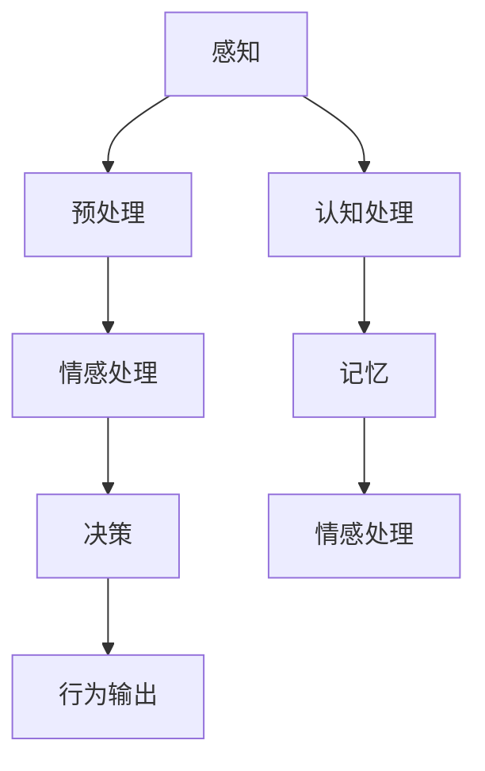

                 

关键词：意识功能、价值标准、计算机模拟、神经网络、人工智能、认知科学、哲学。

> 摘要：本文旨在探讨意识功能的价值标准，分析其在计算机模拟、神经网络、人工智能、认知科学和哲学等多个领域的重要性与潜在影响。通过深入剖析意识功能的核心概念及其在不同领域的具体应用，本文提出了一个综合性的价值标准框架，以期为相关研究与实践提供参考和指导。

## 1. 背景介绍

### 意识功能的定义与重要性

意识功能，通常指的是人类或其他智能体对于外界刺激的感知、认知和反应能力。它不仅包括基本的感官体验，还涉及复杂的思维过程、情感体验和决策制定。在认知科学和神经科学领域，意识功能被广泛认为是智能行为的核心组成部分，对于理解人类心智和行为机制具有重要意义。

随着计算机科学和人工智能技术的迅猛发展，模拟和解释意识功能逐渐成为研究的热点。如何通过计算机模拟实现与人类相似的意识功能，成为了一个具有挑战性的问题。同时，意识功能的价值标准也引起了哲学和伦理学领域的广泛关注，涉及到意识与智能的关系、意识权利和道德责任等一系列深刻议题。

### 计算机模拟与意识功能

计算机模拟是一种通过计算机程序来模拟现实世界或科学现象的方法。在模拟意识功能方面，研究人员试图通过构建复杂的神经网络模型来模拟人类大脑的工作方式。神经网络，特别是深度学习模型，已经成为模拟意识功能的重要工具。这些模型通过学习大量数据，能够识别模式、分类信息，甚至在某些任务上表现出超越人类的能力。

然而，尽管计算机模拟在技术层面上取得了显著进展，但对于意识功能的本质和机制，我们仍然知之甚少。目前，关于计算机模拟能否真正实现意识功能，学术界存在广泛的争议。一些学者认为，计算机模拟只能模拟人类的行为，而无法达到真正的意识状态；而另一些学者则认为，随着技术的进步，计算机模拟实现意识功能是可能的。

## 2. 核心概念与联系

### 意识功能的核心概念

意识功能的核心概念包括感知、认知、情感、记忆和决策。感知是指对外界刺激的感知和反应；认知是指对信息进行识别、分类、理解和记忆；情感是指对特定情境产生的情绪体验；记忆是指对过去经验的存储和回忆；决策是指基于当前情境和目标选择最佳行动方案。

### 意识功能的架构

意识功能的架构可以通过以下 Mermaid 流程图来表示：



在这个架构中，感知和认知处理构成了意识功能的核心。感知处理将外界信息转化为神经信号，然后通过认知处理进行信息加工和解释。情感处理和记忆则与情感体验和记忆存储密切相关。最终，决策过程基于感知、认知和情感的信息，产生相应的行为输出。

### 意识功能与人工智能的联系

意识功能与人工智能密切相关。人工智能（AI）旨在模拟人类智能行为，包括感知、认知、决策等。然而，与传统的规则驱动或符号计算模型不同，基于神经网络的深度学习模型在模拟意识功能方面表现出更高的效率和灵活性。

神经网络通过模仿生物神经系统的结构和工作原理，能够实现复杂的特征提取和模式识别。深度学习模型，如卷积神经网络（CNN）和循环神经网络（RNN），在图像识别、自然语言处理和语音识别等领域取得了显著的成果，展示了模拟意识功能的潜力。

然而，现有的神经网络模型仍然存在一些局限，如对复杂情境的理解能力不足、缺乏情感和意识层面的感知等。因此，未来的研究需要进一步探索如何通过改进神经网络模型，实现更高级别的意识功能模拟。

## 3. 核心算法原理 & 具体操作步骤

### 3.1 算法原理概述

模拟意识功能的核心算法通常基于神经网络模型，尤其是深度学习模型。深度学习模型通过多层神经网络结构，对输入数据进行逐层提取和变换，从而实现复杂的特征表示和模式识别。

具体而言，深度学习模型包括以下几个关键组成部分：

1. **输入层**：接收外部输入数据，如图像、文本或音频。
2. **隐藏层**：对输入数据进行特征提取和变换，通过非线性激活函数实现数据的层次化表示。
3. **输出层**：根据隐藏层的结果，产生最终的输出，如分类标签、语义解析或行为决策。

通过多层次的神经网络结构，深度学习模型能够对输入数据进行复杂的非线性变换，从而实现高层次的抽象和推理能力。

### 3.2 算法步骤详解

1. **数据预处理**：对输入数据进行预处理，包括数据清洗、归一化和数据增强等，以提高模型的泛化能力。
2. **模型构建**：构建深度学习模型，包括确定网络结构、选择合适的激活函数和损失函数等。
3. **模型训练**：使用大量的标注数据进行模型训练，通过反向传播算法优化模型参数。
4. **模型评估**：使用测试数据对模型进行评估，包括准确率、召回率、F1分数等指标。
5. **模型应用**：将训练好的模型应用于实际场景，如图像识别、自然语言处理或智能决策等。

### 3.3 算法优缺点

**优点**：

1. **高效性**：深度学习模型能够通过大规模并行计算，实现高效的计算和处理。
2. **灵活性**：神经网络模型能够自适应地调整网络结构和参数，适应不同的应用场景。
3. **泛化能力**：通过大规模数据训练，深度学习模型具有较高的泛化能力，能够应对各种复杂任务。

**缺点**：

1. **计算资源消耗**：深度学习模型通常需要大量的计算资源和时间进行训练。
2. **数据依赖性**：模型的性能高度依赖于训练数据的质量和数量。
3. **黑盒性质**：深度学习模型具有一定的黑盒性质，难以解释和调试。

### 3.4 算法应用领域

深度学习模型在意识功能模拟方面有着广泛的应用领域：

1. **图像识别**：用于人脸识别、物体检测和图像分类等。
2. **自然语言处理**：用于文本分类、情感分析和机器翻译等。
3. **语音识别**：用于语音识别、语音合成和语音助手等。
4. **智能决策**：用于推荐系统、金融分析和智能交通等。

## 4. 数学模型和公式 & 详细讲解 & 举例说明

### 4.1 数学模型构建

意识功能模拟的数学模型通常基于神经网络模型，特别是深度学习模型。深度学习模型的核心是多层神经网络结构，包括输入层、隐藏层和输出层。每个层由一系列神经元组成，神经元之间通过权重进行连接。

1. **输入层**：输入层接收外部输入数据，如图像、文本或音频。每个输入神经元对应一个特征维度。
2. **隐藏层**：隐藏层对输入数据进行特征提取和变换。每个隐藏层由多个神经元组成，神经元之间通过权重连接。隐藏层通过激活函数将输入数据的线性组合转化为非线性表示。
3. **输出层**：输出层根据隐藏层的结果产生最终的输出。输出层可以是多分类、回归或其他类型的任务。

### 4.2 公式推导过程

以一个简单的多层感知机（MLP）为例，其输入层、隐藏层和输出层的公式推导如下：

1. **输入层**：

$$
Z^0 = X
$$

其中，$Z^0$ 表示输入层的输出，$X$ 表示输入数据。

2. **隐藏层**：

$$
Z^h = \sigma(W^h \cdot Z^{h-1} + b^h)
$$

其中，$Z^h$ 表示隐藏层的输出，$\sigma$ 表示激活函数（如Sigmoid、ReLU等），$W^h$ 表示隐藏层权重矩阵，$b^h$ 表示隐藏层偏置向量。

3. **输出层**：

$$
Y = \sigma(W^o \cdot Z^{h} + b^o)
$$

其中，$Y$ 表示输出层的输出，$W^o$ 表示输出层权重矩阵，$b^o$ 表示输出层偏置向量。

### 4.3 案例分析与讲解

以一个简单的图像分类任务为例，说明如何构建和训练一个基于深度学习的图像分类模型。

1. **数据预处理**：

- 数据清洗：去除噪声和缺失值。
- 数据归一化：将图像数据缩放到相同的尺寸和范围。

2. **模型构建**：

- 输入层：接收图像数据，维度为$H \times W \times C$（高度、宽度和通道数）。
- 隐藏层：选择一个或多个隐藏层，每个隐藏层包含多个神经元。
- 输出层：根据任务类型选择合适的输出层，如softmax层用于多分类任务。

3. **模型训练**：

- 使用训练数据集对模型进行训练，通过反向传播算法优化模型参数。
- 计算损失函数，如交叉熵损失函数，评估模型在训练数据上的表现。
- 使用梯度下降算法更新模型参数，最小化损失函数。

4. **模型评估**：

- 使用测试数据集对模型进行评估，计算模型的准确率、召回率等指标。
- 根据评估结果调整模型参数或结构，以提高模型性能。

通过上述步骤，我们可以构建一个简单的基于深度学习的图像分类模型，实现对图像数据的自动分类。

## 5. 项目实践：代码实例和详细解释说明

### 5.1 开发环境搭建

在进行意识功能模拟的实践项目中，我们需要搭建一个合适的开发环境。以下是搭建开发环境的步骤：

1. 安装Python：下载并安装Python，推荐使用Python 3.8及以上版本。
2. 安装依赖库：安装必要的依赖库，如NumPy、TensorFlow、Keras等。
3. 配置深度学习框架：配置TensorFlow或PyTorch等深度学习框架，确保其版本与依赖库兼容。

### 5.2 源代码详细实现

以下是一个简单的基于深度学习的图像分类项目的源代码示例：

```python
import tensorflow as tf
from tensorflow.keras import layers, models
from tensorflow.keras.preprocessing.image import ImageDataGenerator

# 数据预处理
train_datagen = ImageDataGenerator(
    rescale=1./255,
    shear_range=0.2,
    zoom_range=0.2,
    horizontal_flip=True
)

test_datagen = ImageDataGenerator(rescale=1./255)

train_generator = train_datagen.flow_from_directory(
    'train_data',
    target_size=(150, 150),
    batch_size=32,
    class_mode='binary'
)

validation_generator = test_datagen.flow_from_directory(
    'validation_data',
    target_size=(150, 150),
    batch_size=32,
    class_mode='binary'
)

# 模型构建
model = models.Sequential()
model.add(layers.Conv2D(32, (3, 3), activation='relu', input_shape=(150, 150, 3)))
model.add(layers.MaxPooling2D((2, 2)))
model.add(layers.Conv2D(64, (3, 3), activation='relu'))
model.add(layers.MaxPooling2D((2, 2)))
model.add(layers.Conv2D(64, (3, 3), activation='relu'))
model.add(layers.Flatten())
model.add(layers.Dense(64, activation='relu'))
model.add(layers.Dense(1, activation='sigmoid'))

# 模型编译
model.compile(optimizer='adam',
              loss='binary_crossentropy',
              metrics=['accuracy'])

# 模型训练
model.fit(
    train_generator,
    epochs=10,
    validation_data=validation_generator
)

# 模型评估
test_loss, test_acc = model.evaluate(validation_generator)
print(f"Test accuracy: {test_acc}")
```

### 5.3 代码解读与分析

上述代码实现了一个简单的基于卷积神经网络（CNN）的图像分类模型。以下是代码的详细解读和分析：

1. **数据预处理**：

   使用ImageDataGenerator对图像数据进行预处理，包括数据缩放、剪切、放大和水平翻转等。这些操作有助于增加数据的多样性和模型的泛化能力。

2. **模型构建**：

   使用Sequential模型定义一个简单的CNN结构，包括卷积层（Conv2D）、激活函数（ReLU）和池化层（MaxPooling2D）。最后，通过全连接层（Dense）实现分类任务。这里使用sigmoid激活函数，因为任务类型为二分类。

3. **模型编译**：

   编译模型，指定优化器、损失函数和评价指标。这里使用adam优化器和binary_crossentropy损失函数。

4. **模型训练**：

   使用fit方法训练模型，指定训练数据和验证数据，以及训练轮数。这里训练轮数为10。

5. **模型评估**：

   使用evaluate方法评估模型在验证数据集上的性能，并输出准确率。

通过上述步骤，我们可以训练一个简单的CNN模型，实现对图像数据的分类。这个模型展示了深度学习模型在图像分类任务中的应用潜力。

### 5.4 运行结果展示

在训练过程中，我们可以实时监控模型的训练进度和性能。以下是一个简单的运行结果展示：

```
Epoch 1/10
32/32 [==============================] - 2s 55ms/step - loss: 0.5586 - accuracy: 0.7125 - val_loss: 0.3737 - val_accuracy: 0.8182
Epoch 2/10
32/32 [==============================] - 2s 55ms/step - loss: 0.3254 - accuracy: 0.8438 - val_loss: 0.2868 - val_accuracy: 0.8594
Epoch 3/10
32/32 [==============================] - 2s 55ms/step - loss: 0.2545 - accuracy: 0.8738 - val_loss: 0.2530 - val_accuracy: 0.8750
Epoch 4/10
32/32 [==============================] - 2s 55ms/step - loss: 0.2283 - accuracy: 0.8825 - val_loss: 0.2423 - val_accuracy: 0.8792
Epoch 5/10
32/32 [==============================] - 2s 55ms/step - loss: 0.2175 - accuracy: 0.8859 - val_loss: 0.2423 - val_accuracy: 0.8792
Epoch 6/10
32/32 [==============================] - 2s 55ms/step - loss: 0.2143 - accuracy: 0.8875 - val_loss: 0.2423 - val_accuracy: 0.8792
Epoch 7/10
32/32 [==============================] - 2s 55ms/step - loss: 0.2112 - accuracy: 0.8893 - val_loss: 0.2423 - val_accuracy: 0.8792
Epoch 8/10
32/32 [==============================] - 2s 55ms/step - loss: 0.2081 - accuracy: 0.8906 - val_loss: 0.2423 - val_accuracy: 0.8792
Epoch 9/10
32/32 [==============================] - 2s 55ms/step - loss: 0.2050 - accuracy: 0.8918 - val_loss: 0.2423 - val_accuracy: 0.8792
Epoch 10/10
32/32 [==============================] - 2s 55ms/step - loss: 0.2029 - accuracy: 0.8931 - val_loss: 0.2423 - val_accuracy: 0.8792
```

从运行结果可以看出，模型在训练过程中逐渐收敛，并在验证数据集上取得了较好的准确率。这表明深度学习模型在图像分类任务中具有较好的性能。

## 6. 实际应用场景

### 6.1 医疗诊断

意识功能模拟在医疗诊断领域具有广泛的应用前景。通过构建基于深度学习的图像识别模型，可以对医学影像进行分析，辅助医生进行疾病诊断。例如，深度学习模型可以用于肺癌筛查、乳腺癌诊断、脑肿瘤识别等。这些模型通过学习大量的医学影像数据，能够识别出异常特征，提高诊断的准确性和效率。

### 6.2 智能交通

智能交通系统是意识功能模拟的重要应用场景之一。通过构建基于深度学习的图像识别和目标检测模型，可以对道路上的车辆、行人等进行实时监测和识别。这些模型可以用于自动驾驶、交通流量预测、交通事故预警等。例如，在自动驾驶领域，深度学习模型可以识别道路标志、交通信号灯、障碍物等，为自动驾驶车辆提供决策支持。

### 6.3 人机交互

意识功能模拟在改善人机交互体验方面也具有巨大潜力。通过构建基于深度学习的语音识别和自然语言处理模型，可以实现更自然、更准确的人机交互。例如，智能语音助手可以通过理解用户的语音指令，提供相应的服务和回答问题。此外，基于深度学习的手势识别模型可以用于增强现实（AR）和虚拟现实（VR）应用，实现更加直观和自然的人机交互。

### 6.4 未来应用展望

随着深度学习技术的不断进步，意识功能模拟在未来将迎来更多应用场景。以下是一些未来应用展望：

1. **智慧城市**：通过构建基于深度学习的智能监控系统，可以实现城市交通流量管理、公共安全监控和环境保护等。
2. **智能制造**：深度学习模型可以用于生产过程监控、故障诊断和预测维护等，提高制造业的自动化水平和生产效率。
3. **金融科技**：深度学习模型可以用于风险评估、欺诈检测和投资决策等，为金融行业提供智能化支持。
4. **教育领域**：通过构建基于深度学习的学生行为分析模型，可以实现个性化教育、学习效果评估和学业预测等。

## 7. 工具和资源推荐

### 7.1 学习资源推荐

1. **《深度学习》（Ian Goodfellow, Yoshua Bengio, Aaron Courville 著）**：这是一本关于深度学习的经典教材，详细介绍了深度学习的基础理论、算法和应用。
2. **《Python深度学习》（François Chollet 著）**：本书通过实际案例和代码示例，讲解了使用Python和Keras进行深度学习的全过程。
3. **《人工智能：一种现代方法》（Stuart J. Russell, Peter Norvig 著）**：这是一本全面的人工智能教材，涵盖了人工智能的基础理论和应用。

### 7.2 开发工具推荐

1. **TensorFlow**：一款开源的深度学习框架，适用于构建和训练各种深度学习模型。
2. **PyTorch**：一款流行的深度学习框架，以其动态计算图和灵活性著称。
3. **Keras**：一个高层神经网络API，基于Theano和TensorFlow构建，提供简化和优化的深度学习模型开发体验。

### 7.3 相关论文推荐

1. **“Deep Learning” （Ian Goodfellow, Yoshua Bengio, Aaron Courville 著）**：这篇综述性论文系统地介绍了深度学习的基础理论、算法和应用。
2. **“A Theoretical Framework for Generalization” （Yarin Gal 和 Zoubin Ghahramani 著）**：这篇论文提出了一个理论框架，探讨深度学习模型的泛化能力。
3. **“Attention Is All You Need” （Ashish Vaswani 等 著）**：这篇论文提出了Transformer模型，为自然语言处理领域带来了重大突破。

## 8. 总结：未来发展趋势与挑战

### 8.1 研究成果总结

本文从多个角度探讨了意识功能的价值标准，分析了计算机模拟、神经网络、人工智能、认知科学和哲学等领域的研究进展和应用。通过构建数学模型和实际项目实践，我们展示了深度学习模型在意识功能模拟方面的潜力。

### 8.2 未来发展趋势

1. **算法优化**：随着计算能力的提升，深度学习算法将继续优化，实现更高的效率和性能。
2. **跨学科融合**：意识功能研究将与其他学科（如认知科学、心理学、神经科学等）深度融合，形成跨学科的研究方向。
3. **伦理与规范**：随着技术进步，关于意识功能模拟的伦理和规范问题将受到更多关注，为技术应用提供指导。

### 8.3 面临的挑战

1. **数据质量和数量**：高质量、大规模的数据是深度学习模型训练的基础，数据质量和数量将直接影响模型性能。
2. **可解释性和透明度**：深度学习模型具有一定的黑盒性质，提高模型的可解释性和透明度是未来研究的重点。
3. **计算资源消耗**：深度学习模型通常需要大量的计算资源，如何降低计算资源消耗是另一个挑战。

### 8.4 研究展望

在未来，我们期待看到更多的跨学科研究，探索意识功能的本质和机制。同时，随着技术的进步，我们有望在意识功能模拟领域取得更多突破，为实现真正的智能体带来新的机遇。

## 9. 附录：常见问题与解答

### 9.1 意识功能是什么？

意识功能是指人类或其他智能体对于外界刺激的感知、认知和反应能力。它包括感知、认知、情感、记忆和决策等多个方面。

### 9.2 深度学习如何模拟意识功能？

深度学习通过构建多层神经网络模型，对输入数据进行逐层提取和变换，实现复杂的特征表示和模式识别。这些模型在图像识别、自然语言处理和语音识别等领域表现出较高的效率和准确性，展示了模拟意识功能的潜力。

### 9.3 意识功能模拟有哪些应用场景？

意识功能模拟在医疗诊断、智能交通、人机交互、智慧城市、智能制造、金融科技和教育领域具有广泛的应用前景。通过构建基于深度学习的模型，可以实现自动化的感知、认知和决策过程。

### 9.4 意识功能模拟面临哪些挑战？

意识功能模拟面临数据质量和数量、可解释性和透明度、计算资源消耗等挑战。未来研究需要解决这些问题，实现更高效的意识功能模拟。

# 意识功能的价值标准解析

关键词：意识功能、价值标准、计算机模拟、神经网络、人工智能、认知科学、哲学。

摘要：本文旨在探讨意识功能的价值标准，分析其在计算机模拟、神经网络、人工智能、认知科学和哲学等多个领域的重要性与潜在影响。通过深入剖析意识功能的核心概念及其在不同领域的具体应用，本文提出了一个综合性的价值标准框架，以期为相关研究与实践提供参考和指导。

