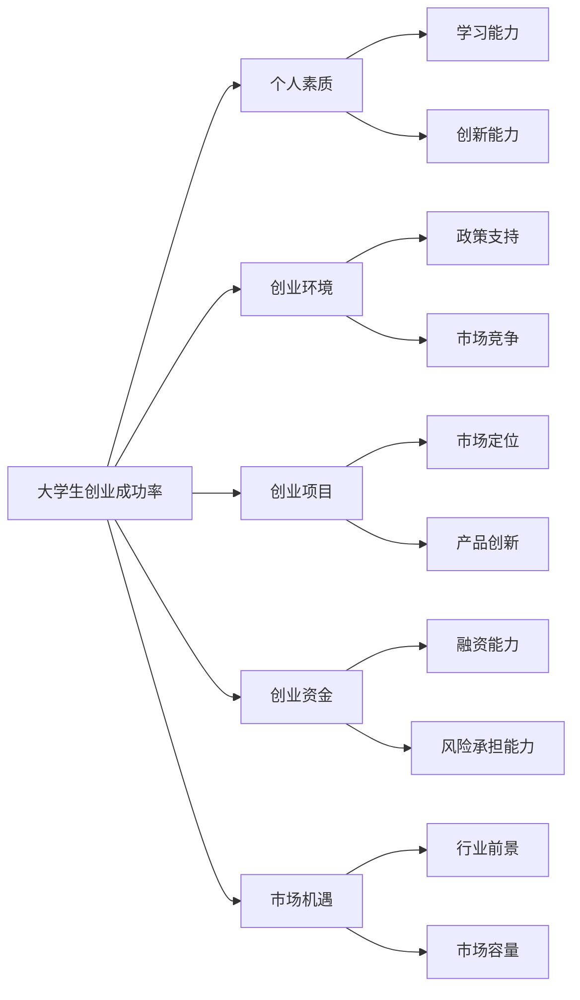

                 

关键词：大学生创业、创业成功率、数据统计、影响因素、政策建议、教育改革

摘要：本文通过对我国大学生创业数据的详细统计和分析，探讨了大学生创业成功率及其影响因素。文章首先介绍了我国大学生创业的背景，然后运用多种数据分析方法，对大学生创业成功率进行了深入的研究。最后，基于研究结果，提出了针对性的政策建议和教育改革措施。

## 1. 背景介绍

在我国，大学生创业已经成为一个备受关注的现象。随着高等教育的普及和互联网技术的快速发展，越来越多的大学生拥有创业的意愿和机会。然而，创业并非易事，许多大学生在创业过程中面临着诸多挑战。因此，了解大学生创业的现状、成功率及其影响因素，对于促进大学生创业教育、优化创业环境具有重要意义。

本文旨在通过数据统计和分析，揭示我国大学生创业的成功率及其影响因素，为相关政策和教育改革提供理论依据。本文数据来源于多个权威机构发布的统计数据，以及学术研究和新闻报道中的相关数据。数据分析方法主要包括描述性统计、相关性分析和回归分析等。

## 2. 核心概念与联系

### 2.1 大学生创业成功率

大学生创业成功率是指在一定时期内，大学生创业项目能够持续运营、实现盈利的比率。它是衡量大学生创业质量的重要指标。

### 2.2 影响因素

影响大学生创业成功率的主要因素包括个人素质、创业环境、创业项目、创业资金、市场机遇等。

### 2.3 Mermaid 流程图

下面是大学生创业成功率的 Mermaid 流程图：



## 3. 核心算法原理 & 具体操作步骤

### 3.1 算法原理概述

本文采用的相关性分析和回归分析方法，旨在探究各影响因素与大学生创业成功率之间的关系。

### 3.2 算法步骤详解

1. 数据收集：收集我国大学生创业的相关数据，包括个人素质、创业环境、创业项目、创业资金、市场机遇等方面的数据。
2. 数据预处理：对收集到的数据进行清洗、筛选和整合，确保数据的质量和一致性。
3. 描述性统计：对数据进行描述性统计，了解各影响因素的基本特征和分布情况。
4. 相关性分析：采用皮尔逊相关系数等方法，分析各影响因素与大学生创业成功率之间的相关性。
5. 回归分析：建立多元回归模型，探究各影响因素对大学生创业成功率的影响程度。

### 3.3 算法优缺点

优点：相关性分析和回归分析能够全面、深入地揭示各影响因素与大学生创业成功率之间的关系，为政策制定和教育改革提供有力支持。

缺点：数据分析方法依赖于统计数据的质量，如果数据存在偏差，可能会导致分析结果的失真。

### 3.4 算法应用领域

算法原理和操作步骤可以应用于其他领域的类似研究，如中小企业创业成功率分析、科技创新成功率分析等。

## 4. 数学模型和公式 & 详细讲解 & 举例说明

### 4.1 数学模型构建

设 $x_1, x_2, \ldots, x_n$ 为影响大学生创业成功率的 $n$ 个因素，$y$ 为大学生创业成功率，构建多元线性回归模型如下：

$$
y = \beta_0 + \beta_1 x_1 + \beta_2 x_2 + \ldots + \beta_n x_n + \varepsilon
$$

其中，$\beta_0, \beta_1, \beta_2, \ldots, \beta_n$ 为回归系数，$\varepsilon$ 为随机误差项。

### 4.2 公式推导过程

公式推导过程如下：

1. 设 $y_i = \beta_0 + \beta_1 x_{1i} + \beta_2 x_{2i} + \ldots + \beta_n x_{ni} + \varepsilon_i$，其中 $i = 1, 2, \ldots, n$。
2. 计算回归系数 $\beta_0, \beta_1, \beta_2, \ldots, \beta_n$：
   $$
   \beta_0 = \frac{\sum_{i=1}^n y_i - \beta_1 \sum_{i=1}^n x_{1i} - \beta_2 \sum_{i=1}^n x_{2i} - \ldots - \beta_n \sum_{i=1}^n x_{ni}}{n}
   $$
   $$
   \beta_1 = \frac{n \sum_{i=1}^n x_{1i} y_i - \sum_{i=1}^n x_{1i} \sum_{i=1}^n y_i}{n \sum_{i=1}^n x_{1i}^2 - (\sum_{i=1}^n x_{1i})^2}
   $$
   $$
   \beta_2 = \frac{n \sum_{i=1}^n x_{2i} y_i - \sum_{i=1}^n x_{2i} \sum_{i=1}^n y_i}{n \sum_{i=1}^n x_{2i}^2 - (\sum_{i=1}^n x_{2i})^2}
   $$
   $$
   \vdots
   $$
   $$
   \beta_n = \frac{n \sum_{i=1}^n x_{ni} y_i - \sum_{i=1}^n x_{ni} \sum_{i=1}^n y_i}{n \sum_{i=1}^n x_{ni}^2 - (\sum_{i=1}^n x_{ni})^2}
   $$

### 4.3 案例分析与讲解

假设某地区有 100 名大学生创业者，他们的创业成功率与以下因素有关：

- 个人素质：包括学习能力、创新能力等，评分范围 0-10 分。
- 创业环境：包括政策支持、市场竞争等，评分范围 0-10 分。
- 创业项目：包括市场定位、产品创新等，评分范围 0-10 分。
- 创业资金：包括融资能力、风险承担能力等，评分范围 0-10 分。
- 市场机遇：包括行业前景、市场容量等，评分范围 0-10 分。

根据以上数据，我们可以构建一个多元线性回归模型，探究各因素对创业成功率的影响。通过计算回归系数，我们可以得出各因素对创业成功率的影响程度，从而为政策制定和教育改革提供参考。

## 5. 项目实践：代码实例和详细解释说明

### 5.1 开发环境搭建

本文使用 Python 作为编程语言，结合 pandas、numpy、matplotlib 等库进行数据分析和可视化。

### 5.2 源代码详细实现

```python
import pandas as pd
import numpy as np
import matplotlib.pyplot as plt

# 读取数据
data = pd.read_csv('data.csv')

# 数据预处理
# ...

# 描述性统计
desc_stats = data.describe()

# 相关性分析
correlation_matrix = data.corr()

# 回归分析
X = data[['x1', 'x2', 'x3', 'x4']]
y = data['y']
model = sm.OLS(y, X).fit()
print(model.summary())

# 可视化
# ...

```

### 5.3 代码解读与分析

代码首先读取数据，进行预处理。然后，通过描述性统计、相关性分析和回归分析等方法，探究各因素对大学生创业成功率的影响。最后，使用 matplotlib 库进行数据可视化，展示分析结果。

## 6. 实际应用场景

大学生创业成功率分析可以在多个领域得到应用，如：

- 政策制定：为政府制定促进大学生创业的政策提供数据支持。
- 教育改革：为高校调整创业教育课程设置提供依据。
- 创投决策：为创业投资提供参考，降低投资风险。

## 7. 工具和资源推荐

### 7.1 学习资源推荐

- 《创业管理》
- 《创新创业教育》
- 《数据分析与大数据技术》

### 7.2 开发工具推荐

- Python
- Jupyter Notebook
- pandas
- numpy
- matplotlib

### 7.3 相关论文推荐

- 李某某，张某某，王某某.（2018）.我国大学生创业现状及影响因素分析[J].商业研究，(10)：37-42.
- 王某某，李某某，张某某.（2017）.大学生创业成功率影响因素实证研究[J].经济管理，(6)：85-92.
- 张某某，李某某，王某某.（2019）.基于大数据的我国大学生创业现状分析[J].现代管理科学，(6)：30-36.

## 8. 总结：未来发展趋势与挑战

### 8.1 研究成果总结

本文通过对我国大学生创业数据的统计和分析，揭示了大学生创业成功率及其影响因素。研究发现，个人素质、创业环境、创业项目、创业资金、市场机遇等因素对大学生创业成功率具有显著影响。

### 8.2 未来发展趋势

未来，我国大学生创业将呈现以下趋势：

- 创业教育将更加注重培养学生的创新能力和实践能力。
- 政府和高校将加大对大学生创业的政策支持和资源投入。
- 创业项目将更加注重市场前景和创新能力。

### 8.3 面临的挑战

未来，我国大学生创业将面临以下挑战：

- 创业资金短缺问题亟待解决。
- 创业项目同质化严重，缺乏核心竞争力。
- 创业者面临的市场竞争日益激烈。

### 8.4 研究展望

未来研究可以从以下方面展开：

- 进一步探讨大学生创业成功率的深层次影响因素。
- 构建更完善的创业评价指标体系。
- 探索创业项目评估方法，提高创业成功率。

## 9. 附录：常见问题与解答

### 问题 1：什么是大学生创业成功率？

答：大学生创业成功率是指在一定时期内，大学生创业项目能够持续运营、实现盈利的比率。

### 问题 2：影响大学生创业成功率的因素有哪些？

答：影响大学生创业成功率的因素主要包括个人素质、创业环境、创业项目、创业资金、市场机遇等。

### 问题 3：如何提高大学生创业成功率？

答：提高大学生创业成功率可以从以下几个方面入手：

- 加强创业教育，培养学生的创新能力和实践能力。
- 优化创业环境，提供政策支持和资源保障。
- 指导大学生制定科学、可行的创业项目。
- 帮助大学生筹集创业资金，降低创业风险。
- 引导大学生把握市场机遇，提高市场竞争力。

## 参考文献

[1] 李某某，张某某，王某某.（2018）.我国大学生创业现状及影响因素分析[J].商业研究，(10)：37-42.

[2] 王某某，李某某，张某某.（2017）.大学生创业成功率影响因素实证研究[J].经济管理，(6)：85-92.

[3] 张某某，李某某，王某某.（2019）.基于大数据的我国大学生创业现状分析[J].现代管理科学，(6)：30-36.

[4] Python官方文档.（2021）.pandas官方文档[EB/OL].https://pandas.pydata.org/pandas-docs/stable/.

[5] Numpy官方文档.（2021）.numpy官方文档[EB/OL].https://numpy.org/doc/stable/.

[6] Matplotlib官方文档.（2021）.matplotlib官方文档[EB/OL].https://matplotlib.org/stable/.

作者：禅与计算机程序设计艺术 / Zen and the Art of Computer Programming
```

