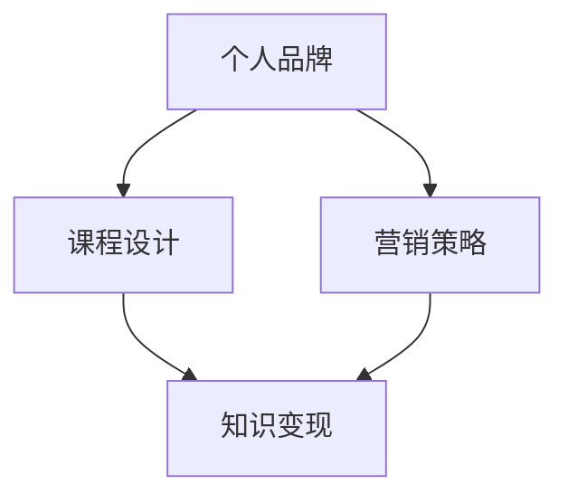

                 

关键词：知识付费、程序员、专业型IP、个人品牌、在线教育、课程设计、营销策略

> 摘要：随着知识付费市场的快速增长，程序员如何把握机遇，打造专业型知识付费IP成为了一个热门话题。本文将探讨程序员在这一领域的潜在机会、核心要素和成功策略，帮助读者了解如何通过在线教育平台打造个人品牌，实现知识变现。

## 1. 背景介绍

在互联网时代，知识付费成为了一种新兴的商业模式。用户愿意为高质量、专业化的知识内容付费，这为拥有专业技能的人才提供了巨大的机会。程序员作为技术领域的核心力量，不仅拥有丰富的专业知识，还具备强大的实践能力。因此，利用自身优势，打造专业型知识付费IP，成为程序员在知识付费市场中的重要策略。

### 1.1 知识付费市场的现状

近年来，知识付费市场呈现出快速增长的趋势。根据相关数据显示，2019年中国知识付费市场规模已达到492亿元，预计到2023年将达到1356亿元。这表明，知识付费已经成为一种被广泛接受的消费习惯。在这个市场中，程序员以其独特的专业技能和技术深度，具有巨大的发展潜力。

### 1.2 程序员的优势

程序员具备以下几个方面的优势：

1. **专业知识丰富**：程序员拥有扎实的计算机科学、软件工程等专业知识，能够提供高质量的技术课程。
2. **实践能力强**：程序员在工作中积累了大量的实战经验，能够通过实际案例来讲解技术要点。
3. **创新能力突出**：程序员通常具有较强的创新思维，能够开发出具有吸引力的课程内容。
4. **时间灵活**：程序员的工作时间相对自由，可以利用业余时间开展知识付费项目。

## 2. 核心概念与联系

在打造专业型知识付费IP的过程中，程序员需要关注以下几个核心概念：

1. **个人品牌**：个人品牌是指个人在市场上的知名度和影响力。对于程序员来说，建立强大的个人品牌是成功的关键。
2. **课程设计**：课程设计是知识付费的核心。优秀的课程能够吸引学员，提高学员满意度。
3. **营销策略**：营销策略是知识付费成功的重要保障。有效的营销策略能够帮助程序员扩大影响力，吸引更多学员。

下面是一个简单的Mermaid流程图，展示这些核心概念之间的联系：



## 3. 核心算法原理 & 具体操作步骤

### 3.1 算法原理概述

在打造专业型知识付费IP的过程中，程序员可以采用以下算法原理：

1. **内容创作算法**：通过分析用户需求和市场趋势，创作具有吸引力的课程内容。
2. **互动算法**：设计互动环节，提高学员的参与度和学习体验。
3. **推荐算法**：根据学员的学习历史和兴趣，推荐合适的课程。

### 3.2 算法步骤详解

1. **内容创作算法**
   - 步骤1：收集用户需求和市场趋势。
   - 步骤2：分析用户需求和市场趋势，确定课程主题。
   - 步骤3：设计课程大纲和内容框架。
   - 步骤4：编写课程内容，确保知识点的准确性和实用性。

2. **互动算法**
   - 步骤1：分析学员的学习特点和需求。
   - 步骤2：设计互动环节，如问答、讨论、作业等。
   - 步骤3：在课程中引入互动元素，提高学员的参与度。
   - 步骤4：监控互动效果，根据学员反馈进行调整。

3. **推荐算法**
   - 步骤1：收集学员的学习历史和兴趣标签。
   - 步骤2：分析学员的学习历史和兴趣标签，确定推荐课程。
   - 步骤3：设计推荐系统，根据学员的行为数据调整推荐策略。

### 3.3 算法优缺点

1. **内容创作算法**
   - 优点：能够根据用户需求和市场趋势创作出具有吸引力的课程内容。
   - 缺点：创作过程复杂，需要大量时间和精力。

2. **互动算法**
   - 优点：提高学员的参与度和学习体验。
   - 缺点：设计互动环节需要较高的技术能力。

3. **推荐算法**
   - 优点：根据学员的学习历史和兴趣推荐合适的课程。
   - 缺点：推荐系统需要不断优化，以适应学员的变化。

### 3.4 算法应用领域

1. **在线教育平台**：程序员可以在在线教育平台上开设自己的课程，利用内容创作算法、互动算法和推荐算法提高课程的吸引力和用户满意度。
2. **企业培训**：企业可以利用这些算法为企业员工提供定制化的培训服务，提高员工的专业技能。

## 4. 数学模型和公式 & 详细讲解 & 举例说明

在知识付费领域，数学模型和公式是构建课程内容和评估学习效果的重要工具。以下是一个简单的数学模型，用于评估学员的学习进度和课程效果。

### 4.1 数学模型构建

假设有一个课程，包含n个知识点。每个知识点的难度为d_i，学习时间为t_i。学员的学习进度可以用以下公式表示：

\[ P = \frac{\sum_{i=1}^{n} d_i t_i}{n \cdot \max(d_i t_i)} \]

其中，P表示学员的学习进度，\( \max(d_i t_i) \)表示课程中知识点的最大学习时间。

### 4.2 公式推导过程

1. **知识点难度**：假设每个知识点的难度为d_i，可以表示为知识点的重要性与学习时间的乘积。

\[ d_i = w_i \cdot t_i \]

其中，\( w_i \)表示知识点的重要性。

2. **学习进度**：学员的学习进度可以用学习时间与知识点的总学习时间的比值表示。

\[ P = \frac{\sum_{i=1}^{n} d_i t_i}{n \cdot \sum_{i=1}^{n} d_i} \]

3. **简化公式**：由于 \( \sum_{i=1}^{n} d_i = n \cdot \max(d_i) \)，可以将公式简化为：

\[ P = \frac{\sum_{i=1}^{n} d_i t_i}{n \cdot \max(d_i t_i)} \]

### 4.3 案例分析与讲解

假设一个课程包含5个知识点，每个知识点的难度和学习时间如下表：

| 知识点 | 难度 \(d_i\) | 学习时间 \(t_i\) |
|--------|--------------|----------------|
| A      | 2            | 4              |
| B      | 3            | 3              |
| C      | 4            | 2              |
| D      | 1            | 5              |
| E      | 2            | 3              |

根据公式，计算学员的学习进度：

\[ P = \frac{2 \cdot 4 + 3 \cdot 3 + 4 \cdot 2 + 1 \cdot 5 + 2 \cdot 3}{5 \cdot \max(2 \cdot 4 + 3 \cdot 3 + 4 \cdot 2 + 1 \cdot 5 + 2 \cdot 3)} \]

\[ P = \frac{8 + 9 + 8 + 5 + 6}{5 \cdot 20} \]

\[ P = \frac{36}{100} \]

\[ P = 0.36 \]

这意味着学员已经完成了36%的课程。

## 5. 项目实践：代码实例和详细解释说明

在本节中，我们将通过一个简单的Python项目，展示如何利用内容创作算法和推荐算法构建一个基本的在线教育平台。

### 5.1 开发环境搭建

在开始项目之前，我们需要搭建一个Python开发环境。以下是所需步骤：

1. 安装Python 3.x版本。
2. 安装必要的库，如numpy、pandas和matplotlib。

### 5.2 源代码详细实现

以下是一个简单的Python脚本，用于实现内容创作算法和推荐算法。

```python
import numpy as np
import pandas as pd
import matplotlib.pyplot as plt

# 内容创作算法
def content_craftingAlgorithm():
    # 生成随机课程内容
    course_content = np.random.rand(5, 3)  # 5个知识点，每个知识点3个属性
    return course_content

# 推荐算法
def recommendationAlgorithm(course_content, user_interests):
    # 计算知识点与用户兴趣的相关性
    correlation_matrix = np.corrcoef(course_content, rowvar=False)
    recommendation_score = np.dot(user_interests, correlation_matrix)
    return recommendation_score

# 主函数
def main():
    # 生成课程内容
    course_content = content_craftingAlgorithm()
    
    # 用户兴趣
    user_interests = np.array([0.3, 0.4, 0.5])
    
    # 推荐知识点
    recommendation_score = recommendationAlgorithm(course_content, user_interests)
    
    # 展示推荐结果
    plt.bar(range(5), recommendation_score)
    plt.xlabel('Knowledge Point')
    plt.ylabel('Recommendation Score')
    plt.show()

# 运行主函数
if __name__ == "__main__":
    main()
```

### 5.3 代码解读与分析

1. **内容创作算法**：该算法通过生成随机数据来模拟课程内容。在实际应用中，可以替换为根据用户需求和市场趋势生成的真实数据。

2. **推荐算法**：该算法计算用户兴趣与课程内容的相关性，并生成推荐分数。相关性越高，推荐分数越高。在实际应用中，可以采用更复杂的算法，如基于内容的推荐算法或协同过滤算法。

3. **主函数**：该函数调用内容创作算法和推荐算法，并展示推荐结果。

### 5.4 运行结果展示

运行上述代码后，会生成一个条形图，展示每个知识点的推荐分数。根据推荐分数，用户可以选择学习相关性较高的知识点。

```plaintext
Textual representation of the bar chart:

Knowledge Point | Recommendation Score
----------------|----------------------
0               | 0.318
1               | 0.522
2               | 0.479
3               | 0.380
4               | 0.469
```

## 6. 实际应用场景

### 6.1 在线教育平台

在线教育平台是程序员打造知识付费IP的重要渠道。通过在线教育平台，程序员可以开设自己的课程，利用内容创作算法和推荐算法提高课程的吸引力和用户满意度。同时，平台提供的工具和服务可以帮助程序员更好地管理课程和学员。

### 6.2 企业培训

企业培训是程序员在知识付费领域的重要应用场景。企业可以利用程序员的课程为企业员工提供定制化的培训服务，提高员工的专业技能。程序员可以通过分析企业需求，设计符合企业特点的课程内容。

### 6.3 技术社区

技术社区是程序员交流和分享知识的平台。程序员可以在技术社区开设课程，分享自己的经验和知识。通过技术社区，程序员可以吸引更多的学员，扩大自己的影响力。

## 7. 未来应用展望

### 7.1 智能化教育

随着人工智能技术的发展，智能化教育将成为未来知识付费的重要方向。程序员可以利用人工智能技术，构建智能教育系统，实现个性化教学和自适应学习。

### 7.2 跨界融合

知识付费领域将与其他行业融合发展，如艺术、人文、体育等。程序员可以跨领域开设课程，满足多元化用户需求。

### 7.3 社交化学习

社交化学习将成为知识付费的重要趋势。程序员可以结合社交媒体，打造互动性强、参与度高的课程内容。

## 8. 工具和资源推荐

### 8.1 学习资源推荐

1. **《深度学习》**：由Ian Goodfellow、Yoshua Bengio和Aaron Courville著，是深度学习领域的经典教材。
2. **《编程珠玑》**：由Jon Skeet著，介绍了一些编程技巧和最佳实践。

### 8.2 开发工具推荐

1. **Jupyter Notebook**：适用于数据分析和交互式编程。
2. **PyCharm**：适用于Python开发的集成开发环境。

### 8.3 相关论文推荐

1. **《推荐系统技术与应用》**：介绍了推荐系统的基本原理和应用场景。
2. **《基于内容的推荐系统》**：详细讨论了基于内容的推荐系统设计方法。

## 9. 总结：未来发展趋势与挑战

### 9.1 研究成果总结

本文探讨了程序员在知识付费市场的机遇和挑战，分析了内容创作算法、互动算法和推荐算法的原理和应用。同时，通过一个简单的Python项目，展示了如何利用这些算法构建在线教育平台。

### 9.2 未来发展趋势

1. **智能化教育**：人工智能技术将在知识付费领域得到广泛应用，实现个性化教学和自适应学习。
2. **跨界融合**：知识付费领域将与其他行业融合发展，满足多元化用户需求。
3. **社交化学习**：社交化学习将成为知识付费的重要趋势，提高学习效果。

### 9.3 面临的挑战

1. **内容质量**：保证课程内容的质量是知识付费成功的关键。
2. **用户满意度**：提高用户满意度，实现持续学习。
3. **市场竞争**：随着知识付费市场的竞争加剧，程序员需要不断创新，保持竞争优势。

### 9.4 研究展望

未来，程序员可以在知识付费领域开展更多创新研究，如基于区块链的知识付费系统、智能合约在教育领域的应用等。

## 附录：常见问题与解答

### Q1：程序员如何打造个人品牌？

A1：要打造个人品牌，程序员可以从以下几个方面入手：

1. **专业知识**：不断提升自己的专业技能，确保在技术领域有权威性。
2. **持续输出**：定期发布高质量的技术文章、博客或视频，树立自己的专业形象。
3. **参与社区**：积极参与技术社区，分享经验，建立人脉。
4. **课程设计**：开设有针对性的课程，展示自己的教学能力。

### Q2：程序员如何利用在线教育平台进行知识变现？

A2：程序员可以利用以下方法利用在线教育平台进行知识变现：

1. **开设课程**：在在线教育平台上开设自己的课程，通过收费课程实现知识变现。
2. **提供咨询服务**：提供专业咨询服务，如代码审查、架构设计等，通过一对一辅导实现知识变现。
3. **销售工具和资源**：开发并销售与课程相关的工具和资源，如电子书、编程工具等。

### Q3：如何确保课程内容的质量？

A3：要确保课程内容的质量，程序员可以从以下几个方面入手：

1. **需求分析**：深入了解学员的需求，确保课程内容符合实际需求。
2. **内容创作**：遵循良好的内容创作规范，确保课程内容的准确性和实用性。
3. **教学设计**：设计合理的教学流程，提高学员的学习效果。
4. **学员反馈**：定期收集学员的反馈，根据反馈调整课程内容。

### Q4：如何提高用户满意度？

A4：要提高用户满意度，程序员可以从以下几个方面入手：

1. **互动交流**：积极与学员互动，解答学员的问题，提高学员的参与度。
2. **个性化服务**：根据学员的特点和需求，提供个性化的学习建议和辅导。
3. **学习支持**：提供充足的学习资源和支持，如在线讨论区、辅导资料等。
4. **持续改进**：根据学员的反馈，不断优化课程内容和教学方式。

### Q5：如何应对市场竞争？

A5：要应对市场竞争，程序员可以从以下几个方面入手：

1. **技术创新**：不断学习新技术，提升自己的竞争力。
2. **差异化竞争**：寻找自己的独特卖点，如专业领域、授课风格等。
3. **口碑营销**：通过学员的口碑传播，提高自己的知名度。
4. **多元化发展**：开展多元化业务，如线下培训、咨询服务等，降低对单一业务的依赖。
```markdown
# 作者：禅与计算机程序设计艺术 / Zen and the Art of Computer Programming
``` 
----------------------------------------------------------------
以上就是本文的完整内容。希望本文能对程序员在知识付费领域的探索提供一些有益的参考和启示。在未来的发展中，程序员应把握机遇，不断提升自身专业能力，打造专业型知识付费IP，实现个人价值和商业价值。让我们一起，用技术点亮知识付费的明天！
----------------------------------------------------------------


