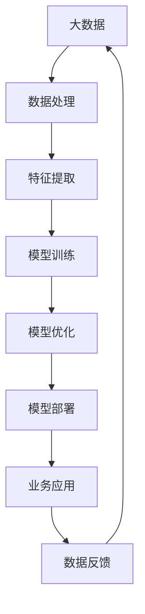

                 

关键词：大模型、场景、企业变现、技术、商业策略、市场定位

> 摘要：本文旨在探讨大模型企业在市场中的变现难题，指出找准应用场景是企业成功变现的关键一步。通过深入分析大模型的原理、算法、数学模型及实际应用案例，本文揭示了企业在选择应用场景时需要考虑的关键因素，以及如何借助工具和资源优化变现过程。

## 1. 背景介绍

近年来，人工智能领域的迅猛发展带动了大数据、云计算和深度学习等技术的广泛应用。大模型，作为人工智能领域的重要分支，凭借其强大的数据处理和预测能力，正逐渐成为企业提升竞争力和市场影响力的利器。然而，许多企业在将大模型技术应用于实际业务时，却面临着如何实现有效变现的困境。

大模型企业变现难题主要体现在以下几个方面：

- **技术瓶颈**：大模型技术复杂，涉及到大量的算法、数据预处理、模型训练和优化等环节，企业往往难以独立完成。
- **市场定位不清**：大模型应用广泛，但不同行业、不同场景的需求差异较大，企业需要在众多应用场景中找到最适合自己的一环。
- **商业模式模糊**：如何通过大模型技术为企业创造价值，实现商业变现，是企业需要深入思考的问题。

## 2. 核心概念与联系

为了更好地理解大模型企业变现的过程，我们需要先了解大模型的核心概念和基本原理。以下是一个简要的 Mermaid 流程图，展示了大模型的主要组成部分和相互关系：



### 2.1 大数据

大数据是大模型的基石。海量数据的获取和处理能力，决定了大模型的学习能力和预测精度。因此，数据的质量和多样性是影响大模型性能的关键因素。

### 2.2 数据处理

数据处理包括数据清洗、归一化、去噪等步骤。这些预处理步骤有助于提高数据的可靠性和一致性，为后续的特征提取和模型训练打下基础。

### 2.3 特征提取

特征提取是从原始数据中提取出对模型训练有用的特征。有效的特征提取能够提高模型的训练效率和学习效果。

### 2.4 模型训练

模型训练是使用大量数据对模型进行调整和优化，使其能够更好地适应特定任务。常见的模型训练方法包括监督学习、无监督学习和强化学习等。

### 2.5 模型优化

模型优化是通过调整模型的结构和参数，提高模型的性能和泛化能力。优化过程包括超参数调优、正则化、交叉验证等。

### 2.6 模型部署

模型部署是将训练好的模型应用到实际业务场景中，通过实时数据输入和预测结果输出，实现业务价值的转化。

### 2.7 业务应用

业务应用是将大模型技术应用于具体的业务场景，如金融风控、医疗诊断、智能制造等。业务应用的成功与否，直接关系到大模型企业的变现效果。

### 2.8 数据反馈

数据反馈是指将业务应用中的实时数据反馈到模型训练环节，以持续优化模型性能。数据反馈机制是闭环系统中的重要一环，有助于实现大模型的持续学习和优化。

## 3. 核心算法原理 & 具体操作步骤

### 3.1 算法原理概述

大模型的核心算法主要包括深度学习、神经网络、生成对抗网络（GAN）等。这些算法通过多层非线性变换，对输入数据进行处理和预测。

### 3.2 算法步骤详解

1. **数据准备**：收集和清洗数据，确保数据的质量和多样性。
2. **模型选择**：根据业务需求选择合适的模型，如卷积神经网络（CNN）、循环神经网络（RNN）、Transformer 等。
3. **模型训练**：使用训练数据对模型进行训练，优化模型参数。
4. **模型评估**：使用验证数据评估模型性能，调整模型结构和参数。
5. **模型部署**：将训练好的模型部署到生产环境中，进行实时预测和业务应用。
6. **数据反馈**：收集业务应用中的实时数据，反馈到模型训练环节，实现模型的持续学习和优化。

### 3.3 算法优缺点

- **优点**：大模型具有较强的学习能力和泛化能力，能够处理复杂的数据和处理多变的业务场景。
- **缺点**：大模型训练复杂，需要大量的计算资源和时间。同时，模型的选择和调优对技术要求较高。

### 3.4 算法应用领域

大模型算法在多个领域都有广泛应用，如：

- **金融**：用于风险控制、信用评估、投资决策等。
- **医疗**：用于疾病诊断、药物研发、健康管理等。
- **制造**：用于生产优化、质量控制、智能维护等。
- **交通**：用于交通预测、路线规划、自动驾驶等。

## 4. 数学模型和公式 & 详细讲解 & 举例说明

### 4.1 数学模型构建

大模型算法通常基于数学模型进行构建。以下是一个简单的神经网络模型示例：

$$
\begin{aligned}
\text{输出} &= \sigma(\text{权重} \cdot \text{输入} + \text{偏置}) \\
\text{权重} &= \text{参数} \\
\text{输入} &= \text{数据} \\
\text{偏置} &= \text{参数} \\
\text{σ} &= \text{激活函数，如Sigmoid、ReLU等} \\
\end{aligned}
$$

### 4.2 公式推导过程

神经网络的推导过程涉及到微积分、概率论和线性代数等数学知识。以下是一个简化的推导过程：

$$
\begin{aligned}
\text{损失函数} &= \frac{1}{2} \sum_{i=1}^{n} (\text{预测值} - \text{真实值})^2 \\
\text{梯度下降} &= \nabla_{\text{权重}} \text{损失函数} \\
\text{更新权重} &= \text{权重} - \alpha \nabla_{\text{权重}} \text{损失函数} \\
\text{其中，} \alpha &= \text{学习率} \\
\end{aligned}
$$

### 4.3 案例分析与讲解

以下是一个简单的房价预测案例：

1. **数据准备**：收集房屋特征数据，如面积、卧室数量、位置等。
2. **模型选择**：选择一个简单的线性回归模型。
3. **模型训练**：使用训练数据训练模型，得到权重和偏置。
4. **模型评估**：使用验证数据评估模型性能，调整模型参数。
5. **模型部署**：将训练好的模型应用到生产环境中，预测房屋价格。

通过以上步骤，我们可以实现一个简单的房价预测系统。实际应用中，可以根据需求选择更复杂的模型，如多层感知机（MLP）、卷积神经网络（CNN）等。

## 5. 项目实践：代码实例和详细解释说明

### 5.1 开发环境搭建

1. **硬件环境**：配置高性能的CPU和GPU，用于模型训练和推理。
2. **软件环境**：安装Python、TensorFlow或PyTorch等深度学习框架。
3. **数据集**：收集和下载适用于目标应用场景的数据集。

### 5.2 源代码详细实现

以下是一个简单的房价预测项目的示例代码：

```python
import tensorflow as tf
from tensorflow.keras import layers

# 定义模型
model = tf.keras.Sequential([
    layers.Dense(64, activation='relu', input_shape=(num_features,)),
    layers.Dense(64, activation='relu'),
    layers.Dense(1)
])

# 编译模型
model.compile(optimizer='adam',
              loss='mean_squared_error',
              metrics=['mean_absolute_error', 'mean_squared_error'])

# 训练模型
model.fit(x_train, y_train, batch_size=32, epochs=100, validation_split=0.2)

# 评估模型
model.evaluate(x_test, y_test, verbose=2)
```

### 5.3 代码解读与分析

1. **模型定义**：使用`Sequential`模型堆叠多层`Dense`层，实现一个简单的全连接神经网络。
2. **模型编译**：选择`adam`优化器和`mean_squared_error`损失函数，并设置评估指标。
3. **模型训练**：使用`fit`函数训练模型，设置批次大小、训练轮数和验证比例。
4. **模型评估**：使用`evaluate`函数评估模型在测试数据集上的性能。

### 5.4 运行结果展示

运行以上代码，可以得到模型在测试数据集上的评估结果，如损失函数值、均方误差等。根据评估结果，可以进一步调整模型结构和参数，提高预测性能。

## 6. 实际应用场景

### 6.1 金融领域

大模型在金融领域的应用非常广泛，如：

- **风险控制**：通过分析用户行为数据，预测信用风险，实现精准风控。
- **投资决策**：利用历史数据和市场趋势，预测股票价格和投资组合收益。
- **保险理赔**：通过分析理赔数据，预测理赔风险，优化理赔流程。

### 6.2 医疗领域

大模型在医疗领域的应用主要包括：

- **疾病诊断**：通过分析影像数据和临床数据，实现早期疾病诊断。
- **药物研发**：利用基因数据和分子数据，预测药物效果和副作用。
- **健康管理**：通过分析健康数据，预测疾病风险，提供个性化健康建议。

### 6.3 制造领域

大模型在制造领域的应用包括：

- **生产优化**：通过分析生产数据，预测生产过程中的瓶颈和优化方案。
- **质量控制**：通过分析产品质量数据，预测产品缺陷和优化质量控制流程。
- **智能维护**：通过分析设备数据，预测设备故障和提供维护建议。

### 6.4 交通领域

大模型在交通领域的应用包括：

- **交通预测**：通过分析交通数据，预测交通流量和交通事故，优化交通规划。
- **自动驾驶**：通过分析环境数据，实现自动驾驶车辆的感知、决策和行动。
- **路线规划**：通过分析交通数据和用户需求，提供最优的路线规划方案。

## 7. 工具和资源推荐

### 7.1 学习资源推荐

- **书籍**：《深度学习》（Ian Goodfellow等）、《Python深度学习》（Francesco Marinelli）
- **在线课程**：Coursera 上的“深度学习”、“神经网络与深度学习”等课程
- **技术博客**：Medium、知乎、CSDN 等技术博客平台

### 7.2 开发工具推荐

- **深度学习框架**：TensorFlow、PyTorch、Keras
- **数据处理工具**：Pandas、NumPy、Scikit-learn
- **编程语言**：Python

### 7.3 相关论文推荐

- **《深度学习：神经网络基础》**（Goodfellow et al., 2016）
- **《生成对抗网络》**（Generative Adversarial Networks, 2014）
- **《Transformer：注意力机制与序列模型》**（Attention Is All You Need, 2017）

## 8. 总结：未来发展趋势与挑战

### 8.1 研究成果总结

大模型技术在过去几年取得了显著的成果，如：

- **性能提升**：随着计算资源和算法的进步，大模型在图像识别、语音识别、自然语言处理等任务上取得了很高的准确率。
- **应用扩展**：大模型技术逐渐应用于金融、医疗、制造、交通等各个领域，为行业带来了巨大的变革。

### 8.2 未来发展趋势

大模型技术未来发展趋势包括：

- **多模态融合**：将图像、语音、文本等多种数据源融合到一起，实现更全面的信息理解和处理。
- **自动化训练**：通过自动化机器学习和强化学习，实现大模型的自动训练和优化。
- **隐私保护**：在大数据背景下，如何保护用户隐私成为一个重要议题，未来将出现更多隐私保护算法和工具。

### 8.3 面临的挑战

大模型技术未来面临的挑战包括：

- **计算资源消耗**：大模型训练需要大量的计算资源和时间，如何优化训练过程、减少计算成本是一个重要课题。
- **算法伦理**：大模型算法在应用过程中可能会出现歧视、偏见等问题，如何确保算法的公平性和透明性是一个挑战。
- **数据隐私**：在大数据背景下，如何保护用户隐私是一个重要问题，需要设计更安全、可靠的数据处理和存储方案。

### 8.4 研究展望

未来，大模型技术将在以下几个方面得到进一步发展：

- **更强大的模型**：通过优化算法和架构，开发出更高效、更强大的模型。
- **更广泛的应用**：将大模型技术应用于更多领域，如生物医学、教育、能源等。
- **更智能的交互**：结合自然语言处理和计算机视觉，实现更智能的人机交互。

## 9. 附录：常见问题与解答

### 9.1 大模型训练需要多少时间？

大模型训练所需时间取决于多种因素，如模型复杂度、数据量、硬件性能等。一般来说，小规模的模型可能在几个小时到几天内完成训练，而大规模的模型可能需要数天到数周的时间。

### 9.2 大模型是否会导致过拟合？

大模型确实存在过拟合的风险。过拟合是指模型在训练数据上表现良好，但在新数据上表现不佳。为了防止过拟合，可以采用正则化、dropout、数据增强等方法。

### 9.3 大模型训练需要多少数据？

大模型训练所需的数据量取决于模型复杂度和任务难度。一般来说，较大的模型需要更多的训练数据，但过度的数据量可能会导致训练时间过长。合理的做法是收集足够的训练数据，同时保证数据的质量和多样性。

### 9.4 大模型是否适用于所有领域？

大模型技术在很多领域都有很好的应用效果，但并不意味着它适用于所有领域。不同领域的需求和应用场景差异较大，需要根据实际情况选择合适的模型和算法。

## 参考文献

- Goodfellow, I., Bengio, Y., & Courville, A. (2016). *Deep Learning*. MIT Press.
- Marinelli, F. (2018). *Python Deep Learning*. Packt Publishing.
- Ian J. Goodfellow, Yaroslav Bulatov, Arthur Au, and David Lopez-Paz. (2014). *Generative Adversarial Nets*. Advances in Neural Information Processing Systems, 27.

## 作者署名

作者：禅与计算机程序设计艺术 / Zen and the Art of Computer Programming
----------------------------------------------------------------

以上为《找对场景是大模型企业变现重要一步》的完整文章内容。如需进一步修改或完善，请随时告诉我。

