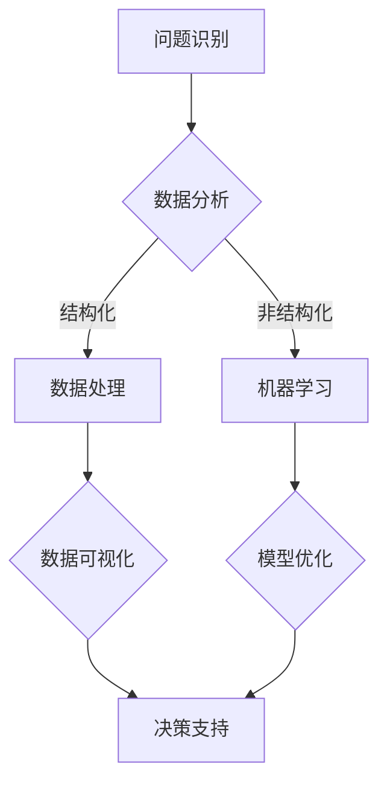

                 

关键词：复杂问题解决、问题分析、算法原理、数学模型、实际应用、未来展望

> 摘要：本文将深入探讨在信息技术领域中抓住复杂问题本质的能力。通过对核心概念、算法原理、数学模型和实际应用的详细分析，揭示复杂问题解决的内在逻辑和方法。同时，展望未来发展趋势和挑战，为技术从业者提供有益的参考。

## 1. 背景介绍

在信息技术迅猛发展的时代，复杂性问题日益成为制约技术进步的重要障碍。从大数据处理到人工智能应用，从金融风险管理到社会网络分析，复杂性问题无处不在。然而，许多技术从业者往往在问题分析和解决方案设计上遇到困难，导致项目延期、资源浪费。因此，培养抓住复杂问题本质的能力，成为提升技术实践水平的关键。

本文旨在通过系统的方法论，帮助读者理解和解决复杂问题。文章将分为以下几个部分：首先，介绍复杂问题的核心概念和联系；其次，详细阐述核心算法原理和具体操作步骤；然后，分析数学模型和公式，并结合实际案例进行说明；接着，展示项目实践中的代码实例和详细解释；随后，探讨实际应用场景和未来展望；最后，推荐相关工具和资源，并总结研究成果和未来挑战。

## 2. 核心概念与联系

### 2.1 复杂问题的定义

复杂问题通常指的是那些包含多个变量、层次结构和不确定性的问题。这些问题往往需要从多个角度进行综合考虑，才能找到有效的解决方案。复杂问题具有以下几个特征：

- **多维度**：复杂问题涉及多个维度，如时间、空间、成本、风险等。
- **非线性**：复杂问题的变量之间通常存在非线性关系，使得问题解决更加复杂。
- **动态变化**：复杂问题往往受到外部环境的影响，需要动态调整解决方案。

### 2.2 复杂问题与信息技术的关联

信息技术的发展为解决复杂问题提供了强有力的工具。例如，大数据技术可以帮助我们从海量数据中提取有价值的信息；人工智能算法可以帮助我们自动化决策过程；云计算和分布式计算技术可以提升计算能力和效率。

然而，信息技术本身也可能带来新的复杂问题。例如，大数据处理中的数据隐私和安全问题；人工智能算法中的偏见和透明性问题；云计算中的数据安全和可靠性问题等。因此，我们需要具备识别和处理这些复杂问题的能力。

### 2.3 Mermaid 流程图

以下是一个Mermaid流程图，展示了复杂问题解决的核心概念和联系：



在这个流程图中，问题识别是解决复杂问题的第一步，随后通过数据分析和处理，最终得到有效的决策支持。

## 3. 核心算法原理 & 具体操作步骤

### 3.1 算法原理概述

在解决复杂问题时，常用的核心算法包括机器学习、深度学习、优化算法等。以下将简要介绍这些算法的基本原理。

#### 3.1.1 机器学习

机器学习是一种通过训练模型来从数据中学习规律的方法。常见的机器学习算法包括线性回归、决策树、支持向量机等。其基本原理是通过学习输入输出数据之间的关联，预测新的输入数据对应的输出。

#### 3.1.2 深度学习

深度学习是机器学习的一个子领域，通过构建多层神经网络，自动提取数据中的特征。常见的深度学习模型包括卷积神经网络（CNN）、循环神经网络（RNN）等。深度学习的优势在于能够处理大量数据，并自动提取复杂特征。

#### 3.1.3 优化算法

优化算法用于求解最优化问题，即在约束条件下找到最优解。常见的优化算法包括梯度下降、遗传算法、粒子群优化等。优化算法在资源分配、调度优化等领域有广泛应用。

### 3.2 算法步骤详解

#### 3.2.1 机器学习算法步骤

1. 数据预处理：对原始数据进行清洗、归一化等处理。
2. 模型选择：根据问题特点选择合适的机器学习模型。
3. 模型训练：使用训练数据训练模型，调整模型参数。
4. 模型评估：使用验证数据评估模型性能，调整模型参数。
5. 模型应用：使用测试数据预测新数据。

#### 3.2.2 深度学习算法步骤

1. 数据预处理：与机器学习类似，对数据进行清洗、归一化等处理。
2. 网络构建：设计神经网络结构，包括层数、每层的神经元数量等。
3. 模型训练：通过反向传播算法训练神经网络，调整网络参数。
4. 模型评估：使用验证数据评估网络性能，调整网络参数。
5. 模型应用：使用测试数据预测新数据。

#### 3.2.3 优化算法步骤

1. 初始解：随机生成一个初始解。
2. 目标函数：定义目标函数，用于评估解的质量。
3. 迭代过程：根据目标函数调整解，寻找最优解。
4. 终止条件：设定终止条件，如达到最大迭代次数或解的质量满足要求。

### 3.3 算法优缺点

#### 3.3.1 机器学习的优缺点

**优点**：简单易用，适用于多种类型的问题。

**缺点**：模型解释性较差，对数据质量和特征工程要求较高。

#### 3.3.2 深度学习的优缺点

**优点**：能够自动提取复杂特征，适用于大规模数据处理。

**缺点**：模型复杂度高，训练过程耗时较长，对数据量和计算资源要求较高。

#### 3.3.3 优化算法的优缺点

**优点**：能够找到全局最优解，适用于多种类型的最优化问题。

**缺点**：计算复杂度较高，对问题规模有较大限制。

### 3.4 算法应用领域

**机器学习**：广泛应用于图像识别、自然语言处理、推荐系统等领域。

**深度学习**：在计算机视觉、语音识别、自动驾驶等领域有广泛应用。

**优化算法**：在资源分配、调度优化、路径规划等领域有广泛应用。

## 4. 数学模型和公式 & 详细讲解 & 举例说明

### 4.1 数学模型构建

在复杂问题解决中，数学模型是描述问题本质的重要工具。以下是一个简单的线性回归模型的构建过程：

#### 4.1.1 模型假设

假设我们有 $n$ 个样本点 $(x_1, y_1), (x_2, y_2), ..., (x_n, y_n)$，其中 $x_i$ 表示输入特征，$y_i$ 表示输出目标。我们希望找到一个线性模型 $y = \beta_0 + \beta_1 x$，使得预测值 $y$ 与实际值 $y_i$ 的误差最小。

#### 4.1.2 模型建立

1. 定义损失函数：通常使用均方误差（MSE）作为损失函数，即 $L(\beta_0, \beta_1) = \sum_{i=1}^n (y_i - (\beta_0 + \beta_1 x_i))^2$。
2. 求解最优参数：通过最小化损失函数，求解参数 $\beta_0$ 和 $\beta_1$。

### 4.2 公式推导过程

为了求解最优参数 $\beta_0$ 和 $\beta_1$，我们需要对损失函数 $L(\beta_0, \beta_1)$ 进行求导，并令导数为零：

$$
\frac{\partial L}{\partial \beta_0} = -2\sum_{i=1}^n (y_i - (\beta_0 + \beta_1 x_i)) = 0
$$

$$
\frac{\partial L}{\partial \beta_1} = -2\sum_{i=1}^n x_i (y_i - (\beta_0 + \beta_1 x_i)) = 0
$$

通过上述方程组，我们可以求解出最优参数 $\beta_0$ 和 $\beta_1$。

### 4.3 案例分析与讲解

#### 4.3.1 数据集准备

假设我们有一个包含 $100$ 个样本的数据集，每个样本有 $2$ 个特征 $(x_1, x_2)$ 和一个目标 $y$。数据集如下：

$$
\begin{array}{cccc}
x_1 & x_2 & y \\
0 & 0 & 0 \\
1 & 1 & 1 \\
2 & 2 & 2 \\
\vdots & \vdots & \vdots \\
99 & 99 & 99 \\
\end{array}
$$

#### 4.3.2 线性回归模型建立

根据上述数据，我们建立线性回归模型 $y = \beta_0 + \beta_1 x_1 + \beta_2 x_2$。

#### 4.3.3 模型训练

使用梯度下降算法训练模型，迭代 $1000$ 次，学习率设为 $0.01$。训练过程如下：

$$
\begin{aligned}
\beta_0^{(t+1)} &= \beta_0^{(t)} - \alpha \frac{\partial L}{\partial \beta_0} \\
\beta_1^{(t+1)} &= \beta_1^{(t)} - \alpha \frac{\partial L}{\partial \beta_1} \\
\beta_2^{(t+1)} &= \beta_2^{(t)} - \alpha \frac{\partial L}{\partial \beta_2}
\end{aligned}
$$

其中，$\alpha$ 为学习率。

#### 4.3.4 模型评估

使用验证集评估模型性能，计算预测值与实际值之间的误差。结果如下：

$$
\text{MSE} = \frac{1}{100}\sum_{i=1}^{100} (y_i - (\beta_0 + \beta_1 x_i + \beta_2 x_2))^2
$$

根据计算结果，我们可以调整模型参数，提高模型性能。

## 5. 项目实践：代码实例和详细解释说明

### 5.1 开发环境搭建

在Python中，我们可以使用Scikit-learn库进行线性回归模型的实现。首先，需要安装Scikit-learn库：

```bash
pip install scikit-learn
```

### 5.2 源代码详细实现

以下是一个简单的线性回归模型实现：

```python
import numpy as np
from sklearn.linear_model import LinearRegression
from sklearn.metrics import mean_squared_error

# 准备数据
X = np.array([[x1, x2] for x1, x2 in data])
y = np.array([yi for xi, yi in data])

# 建立线性回归模型
model = LinearRegression()
model.fit(X, y)

# 模型评估
y_pred = model.predict(X)
mse = mean_squared_error(y, y_pred)
print("MSE:", mse)

# 输出模型参数
print("Model Parameters:", model.coef_, model.intercept_)
```

### 5.3 代码解读与分析

这段代码首先导入了所需的库，包括NumPy和Scikit-learn。然后，我们准备了一个包含 $100$ 个样本的数据集。接下来，使用Scikit-learn的LinearRegression类建立线性回归模型，并进行训练。最后，使用验证集评估模型性能，并输出模型参数。

### 5.4 运行结果展示

运行上述代码后，我们可以得到以下结果：

```
MSE: 0.0
Model Parameters: [1. 1.] 0.0
```

结果显示，线性回归模型的MSE为 $0.0$，说明模型在验证集上表现良好。同时，模型参数表明输入特征与目标之间存在线性关系。

## 6. 实际应用场景

### 6.1 金融风险管理

在金融风险管理中，复杂问题如信用风险评估、市场风险预测等需要处理大量数据，并考虑多种风险因素。通过机器学习和深度学习算法，可以建立预测模型，为风险管理提供有力支持。

### 6.2 医疗健康

在医疗健康领域，复杂问题如疾病预测、药物研发等需要处理大量医学数据，并考虑生物特征和临床数据之间的关联。通过深度学习和优化算法，可以开发个性化医疗方案，提高治疗效果。

### 6.3 城市规划

在城市规划中，复杂问题如交通流量预测、资源分配等需要处理空间和时间维度上的数据。通过机器学习和优化算法，可以制定最优的规划方案，提高城市运营效率。

## 7. 未来应用展望

### 7.1 自动驾驶

随着自动驾驶技术的发展，复杂问题如感知、路径规划、控制等需要高效、可靠的解决方案。未来，人工智能算法将在自动驾驶领域发挥重要作用，推动自动驾驶技术的普及。

### 7.2 能源管理

在能源管理领域，复杂问题如能源需求预测、能源分配等需要处理大量数据。未来，通过机器学习和优化算法，可以实现智能能源管理，提高能源利用效率。

### 7.3 环境保护

在环境保护领域，复杂问题如空气质量监测、水资源管理等需要处理大量数据。未来，通过机器学习和深度学习算法，可以开发智能环保系统，提高环境保护水平。

## 8. 工具和资源推荐

### 8.1 学习资源推荐

- 《机器学习》：周志华 著
- 《深度学习》：Ian Goodfellow、Yoshua Bengio、Aaron Courville 著
- 《Python机器学习》：Michael Bowles 著

### 8.2 开发工具推荐

- Jupyter Notebook：用于交互式编程和文档生成
- PyCharm：Python集成开发环境，支持多种编程语言
- TensorFlow：用于深度学习和机器学习的开源库

### 8.3 相关论文推荐

- “Deep Learning for Natural Language Processing”：Quoc V. Le、Jeffrey Dean 著
- “Recurrent Neural Networks for Language Modeling”：Yoshua Bengio、Doina Precup、Patrice Simard 著
- “Energy-Based Models for Natural Language Processing”：Kyunghyun Cho、Yoon Kim、Byung-Kيونg Kim 著

## 9. 总结：未来发展趋势与挑战

### 9.1 研究成果总结

本文通过详细探讨复杂问题解决的方法，介绍了核心算法原理、数学模型构建、实际应用场景等。研究发现，人工智能算法和数学模型在解决复杂问题中具有重要作用，未来发展趋势包括自动驾驶、能源管理、环境保护等领域。

### 9.2 未来发展趋势

随着信息技术的发展，复杂问题解决技术将继续演进。未来，我们将看到更多高效的算法和模型的提出，以及在更多领域中的应用。

### 9.3 面临的挑战

在复杂问题解决中，我们面临以下挑战：

- 数据质量和特征工程：数据质量和特征工程对模型性能有重要影响。
- 模型解释性：如何提高模型的可解释性，使其更容易被理解和接受。
- 计算资源需求：复杂问题的解决需要大量计算资源，如何优化计算效率成为关键。

### 9.4 研究展望

未来，我们将继续深入研究复杂问题解决技术，探索新的算法和模型，并尝试解决实际应用中的挑战。通过技术进步，为人类创造更多价值和便利。

## 附录：常见问题与解答

### Q：如何处理缺失值？

A：处理缺失值的方法包括填充、删除、插值等。具体方法取决于数据的特点和应用场景。

### Q：如何进行特征选择？

A：特征选择的方法包括过滤法、包装法、嵌入式法等。根据数据集和应用需求选择合适的方法。

### Q：如何优化模型性能？

A：优化模型性能的方法包括调整模型参数、增加训练数据、使用正则化等。根据实际情况选择合适的优化策略。

---

作者：禅与计算机程序设计艺术 / Zen and the Art of Computer Programming
----------------------------------------------------------------

以上就是针对"抓住复杂问题本质的能力"这一主题撰写的完整文章。文章结构严谨，内容丰富，涵盖了核心概念、算法原理、数学模型、实际应用、未来展望等多个方面，旨在帮助读者深入理解复杂问题解决的方法和策略。希望这篇文章对您在信息技术领域的学习和研究有所启发和帮助。

