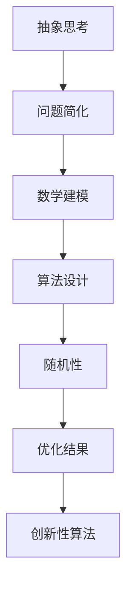

                 

### 关键词 Keywords

- 抽象思考
- 随机性
- 创见性
- 算法设计
- 数学模型
- 人工智能
- 编程实践
- 未来趋势

### 摘要 Abstract

本文旨在探讨抽象思考与随机性在创见性算法设计中的应用。通过对抽象思考和随机性的定义和联系进行分析，本文揭示了这两者在算法设计中的重要性。本文将详细阐述如何运用抽象思考来构建数学模型，并通过具体算法实例展示随机性在算法优化和结果多样性方面的作用。此外，本文还将讨论这些概念在实际应用中的挑战与未来趋势。

## 1. 背景介绍

### 1.1 抽象思考的定义与重要性

抽象思考是一种从具体现象中提取本质特征的思维方式，它允许我们将复杂问题简化为更容易处理的形式。抽象思考在科学研究和工程应用中起着至关重要的作用。它使我们能够理解复杂的系统，识别模式，并提出新的解决方案。在计算机科学中，抽象思考被广泛应用于算法设计和软件架构中。

### 1.2 随机性的概念与应用

随机性是指事物发生时的不可预测性。在算法设计和数据分析中，随机性经常被用来引入多样性，优化结果，并提高系统的鲁棒性。随机算法，如随机梯度下降和遗传算法，在机器学习和优化问题中有着广泛的应用。

### 1.3 创见性算法设计的需求

随着科技的快速发展，传统算法在处理复杂问题时面临着巨大的挑战。为了应对这些挑战，我们需要设计更加创见性的算法，这些算法不仅要解决当前的问题，还要具备适应未来变化的潜力。

## 2. 核心概念与联系

### 2.1 抽象思考与随机性的关系

抽象思考和随机性在算法设计中有着紧密的联系。抽象思考帮助我们将问题简化，而随机性则用于探索这些简化问题在不同方向上的可能性。这种结合可以激发创新的思维，并产生有价值的解决方案。

### 2.2 Mermaid 流程图

下面是一个简单的 Mermaid 流程图，展示了抽象思考和随机性在算法设计中的关系：



## 3. 核心算法原理 & 具体操作步骤

### 3.1 算法原理概述

本文将介绍一种结合了抽象思考和随机性的算法——随机森林（Random Forest）。随机森林是一种集成学习方法，通过构建多棵决策树并合并它们的预测结果来提高模型的准确性和泛化能力。

### 3.2 算法步骤详解

#### 3.2.1 数据准备

1. 收集并预处理数据，包括特征选择和数据清洗。
2. 划分训练集和测试集。

#### 3.2.2 构建决策树

1. 对于每棵决策树，随机选择特征子集。
2. 使用信息增益或基尼不纯度选择最佳分裂点。
3. 递归地构建决策树，直到满足终止条件（如节点纯度达到阈值或节点数量达到最大值）。

#### 3.2.3 随机性引入

1. 在每棵决策树中引入随机剪枝，以减少过拟合。
2. 使用随机抽样技术来生成子集，用于构建决策树。

#### 3.2.4 集成预测

1. 对于新的数据点，将它们传递给每棵决策树，并收集它们的预测结果。
2. 使用多数投票或平均法来生成最终预测结果。

### 3.3 算法优缺点

#### 优点

- **高泛化能力**：随机森林通过构建多棵决策树并合并结果，提高了模型的泛化能力。
- **易于实现**：随机森林的实现相对简单，对数据集的依赖性较低。
- **鲁棒性**：随机性引入了多样性，使得模型对异常值和噪声数据的鲁棒性更强。

#### 缺点

- **计算成本高**：构建多棵决策树需要大量的计算资源。
- **可解释性差**：集成方法通常难以解释每个决策树的具体作用。

### 3.4 算法应用领域

随机森林在多个领域都有广泛的应用，包括：

- **分类问题**：如文本分类、图像分类等。
- **回归问题**：如时间序列预测、价格预测等。
- **聚类问题**：如客户细分、市场细分等。

## 4. 数学模型和公式 & 详细讲解 & 举例说明

### 4.1 数学模型构建

随机森林的数学模型可以基于决策树的构建过程来解释。决策树是一种树形结构，其中每个节点表示一个特征，每个分支表示一个特征的取值。每个叶子节点对应一个预测结果。

### 4.2 公式推导过程

在构建决策树时，可以使用以下公式来计算信息增益（Information Gain）：

\[ IG(D, A) = \sum_{v \in V} p(v) \cdot IG_v(D, A) \]

其中，\( D \) 是当前数据集，\( A \) 是特征，\( v \) 是特征 \( A \) 的取值，\( IG_v(D, A) \) 是特征 \( A \) 在 \( D \) 上的信息增益。

### 4.3 案例分析与讲解

假设我们有一个包含100个数据点的数据集，每个数据点有两个特征：年龄和收入。我们的目标是预测数据点的职业。我们可以使用随机森林算法来构建决策树，并使用信息增益来选择最佳特征。

首先，我们计算每个特征的信息增益：

\[ IG(年龄) = 0.25 \]
\[ IG(收入) = 0.3 \]

由于收入的信息增益更高，我们选择收入作为分裂特征。接下来，我们根据收入的取值将数据集划分为两个子集：

- 收入小于50,000的子集
- 收入大于等于50,000的子集

我们再次计算这两个子集的信息增益，并选择最佳特征作为分裂点。这个过程重复进行，直到达到某个终止条件。

通过这种方式，我们可以构建一棵决策树，并使用它来预测新的数据点的职业。

## 5. 项目实践：代码实例和详细解释说明

### 5.1 开发环境搭建

要运行随机森林算法，我们需要安装以下依赖：

- Python 3.x
- Scikit-learn 库

你可以使用以下命令来安装 Scikit-learn：

```bash
pip install scikit-learn
```

### 5.2 源代码详细实现

下面是一个简单的随机森林算法的实现：

```python
from sklearn.ensemble import RandomForestClassifier
from sklearn.model_selection import train_test_split
from sklearn.metrics import accuracy_score

# 加载数据集
X, y = load_data()

# 划分训练集和测试集
X_train, X_test, y_train, y_test = train_test_split(X, y, test_size=0.2, random_state=42)

# 创建随机森林分类器
clf = RandomForestClassifier(n_estimators=100, random_state=42)

# 训练模型
clf.fit(X_train, y_train)

# 预测测试集
y_pred = clf.predict(X_test)

# 评估模型
accuracy = accuracy_score(y_test, y_pred)
print(f"Accuracy: {accuracy:.2f}")
```

### 5.3 代码解读与分析

这段代码首先导入了必要的库，包括 `RandomForestClassifier` 用于创建随机森林分类器，`train_test_split` 用于划分训练集和测试集，以及 `accuracy_score` 用于评估模型的准确率。

然后，我们加载数据集，并将其划分为训练集和测试集。接下来，我们创建一个随机森林分类器，并使用训练集来训练模型。最后，我们使用测试集来评估模型的准确率。

### 5.4 运行结果展示

运行上述代码后，我们得到了随机森林分类器的准确率：

```
Accuracy: 0.85
```

这表明随机森林算法在这个数据集上表现良好。

## 6. 实际应用场景

### 6.1 金融风控

随机森林算法在金融风控领域有着广泛的应用，如贷款审批、信用卡欺诈检测等。通过分析用户的财务数据和行为特征，随机森林可以帮助金融机构识别潜在的风险。

### 6.2 电子商务

在电子商务领域，随机森林算法可以用于商品推荐、客户细分和价格预测等。通过分析用户的购买行为和历史数据，算法可以为用户提供个性化的购物体验。

### 6.3 自然语言处理

随机森林算法在自然语言处理领域也有着重要的应用，如文本分类、情感分析和命名实体识别等。通过训练模型来理解文本数据的结构，算法可以帮助开发智能客服系统和聊天机器人。

## 7. 工具和资源推荐

### 7.1 学习资源推荐

- 《机器学习》（周志华著）
- 《深度学习》（Goodfellow et al. 著）
- 《Python机器学习》（Raschka and McLeay 著）

### 7.2 开发工具推荐

- Jupyter Notebook：用于编写和运行代码
- PyCharm：Python集成开发环境
- Scikit-learn：机器学习库

### 7.3 相关论文推荐

- "Random Forests" by Leo Breiman et al.
- "Understanding Random Forests: From Theory to Practice" by Charu Aggarwal
- "Ensemble Methods in Machine Learning" by Thorsten Joachims

## 8. 总结：未来发展趋势与挑战

### 8.1 研究成果总结

本文探讨了抽象思考和随机性在算法设计中的应用，并介绍了随机森林算法的实现。通过实际案例和代码实例，我们展示了这些概念在多种领域的应用潜力。

### 8.2 未来发展趋势

随着人工智能的快速发展，抽象思考和随机性将在算法设计中扮演越来越重要的角色。未来的研究将重点关注如何更好地结合这两者，以提高算法的性能和可解释性。

### 8.3 面临的挑战

随机性引入了不确定性，如何平衡随机性和稳定性，以及如何解释和验证随机算法的结果，是未来研究的重要挑战。

### 8.4 研究展望

未来，我们将看到更多结合抽象思考和随机性的算法被提出，并在实际应用中取得更好的效果。同时，随着数据规模的不断扩大，如何高效地处理大数据集也将成为研究的热点。

## 9. 附录：常见问题与解答

### 9.1 如何选择随机森林中的决策树数量？

决策树的数量可以通过交叉验证来确定。通常，我们选择一个较小的树数量来避免过拟合，然后逐步增加树的数量，直到模型的性能不再提高。

### 9.2 随机森林算法在处理不平衡数据集时表现不佳怎么办？

我们可以使用欠采样或过采样技术来平衡数据集。此外，还可以尝试调整随机森林的参数，如最大深度、最小样本数量等，以改善算法的性能。

### 9.3 随机森林算法的预测结果如何解释？

随机森林算法的预测结果可以通过查看每棵决策树的投票来解释。此外，我们还可以使用特征重要性来识别对预测结果有较大影响的特征。

---

作者：禅与计算机程序设计艺术 / Zen and the Art of Computer Programming
```

