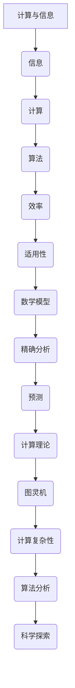

                 

关键词：计算理论，认知拓展，人类智能，算法优化，数学模型，应用实践，未来展望

> 摘要：本文旨在探讨人类计算的科学本质，从核心概念、算法原理、数学模型到项目实践，全面阐述人类如何通过计算技术拓展认知边界。文章将分析当前面临的挑战，并展望未来的发展方向。

## 1. 背景介绍

在当今信息化时代，计算技术已经成为推动社会进步的关键力量。从基础的算术运算到复杂的机器学习，计算能力不断提升，人类对世界的认知也在不断拓展。然而，计算的本质是什么？如何更有效地利用计算资源进行科学探索？这些问题激发了我们对人类计算的科学探索。

### 1.1 计算理论的发展

计算理论起源于20世纪初，以图灵机和可计算性理论为基础，逐步发展出计算机科学的核心概念。图灵机模型被认为是计算的本质抽象，揭示了计算过程的本质。在此基础上，计算复杂性理论、算法分析等分支不断涌现，为计算提供了坚实的理论基础。

### 1.2 认知拓展的需求

随着互联网和大数据的发展，人类面临的信息量呈现爆炸式增长。如何从海量数据中提取有用信息，如何理解复杂的系统行为，成为现代科学探索的重要课题。计算技术成为实现这些目标的利器，推动了认知的边界不断拓展。

## 2. 核心概念与联系

要深入理解人类计算的科学探索，我们需要明确几个核心概念，并探讨它们之间的联系。

### 2.1 计算与信息

计算和信息是密不可分的概念。计算过程本质上是对信息的处理和转换。信息是数据的意义，而计算则是赋予数据以意义的过程。通过计算，我们可以从原始数据中提取出有用的信息，实现对世界的理解。

### 2.2 算法与计算

算法是计算的核心。算法是一系列解决问题的步骤，它指导计算机如何处理数据以实现特定的目标。不同的算法具有不同的效率和适用性，选择合适的算法是实现有效计算的关键。

### 2.3 数学模型与计算

数学模型是计算的重要组成部分。数学公式和模型可以描述现实世界中的复杂现象，帮助我们在计算过程中进行精确分析和预测。数学模型为计算提供了理论依据，使得计算更加科学和可靠。

### 2.4 Mermaid 流程图

为了更直观地展示计算过程中的核心概念和联系，我们使用 Mermaid 流程图进行描述。



## 3. 核心算法原理 & 具体操作步骤

### 3.1 算法原理概述

本文将介绍一种核心算法——贪心算法。贪心算法是一种在每一步选择当前最优解的策略，旨在通过局部最优逐步构建出全局最优解。其基本思想是，在每一步决策时，选择当前看起来最优的选项，并期望在后续步骤中能够找到更好的解决方案。

### 3.2 算法步骤详解

1. **初始化**：根据问题的具体情境，初始化相关变量和数据结构。

2. **选择当前最优解**：根据当前状态，选择一个最优的选项。

3. **更新状态**：根据选择的结果，更新问题和状态。

4. **判断结束条件**：检查是否满足结束条件，如达到目标状态或穷尽所有可能选项。

5. **输出结果**：如果满足结束条件，输出最终结果。

### 3.3 算法优缺点

**优点**：贪心算法通常能够快速找到最优解，适用于某些特定的问题，如最短路径、最优排序等。

**缺点**：贪心算法并不适用于所有问题，对于某些问题，即使每一步选择当前最优解，最终结果也可能不是全局最优。此外，贪心算法的实现通常较为复杂，需要仔细考虑每一步的选择。

### 3.4 算法应用领域

贪心算法广泛应用于计算机科学和工程领域，如网络优化、算法竞赛、人工智能等。在实际应用中，需要根据具体问题进行适当的调整和优化，以获得更好的性能和效果。

## 4. 数学模型和公式 & 详细讲解 & 举例说明

### 4.1 数学模型构建

为了更好地理解和应用贪心算法，我们引入一个简单的数学模型。假设有一个包含 \( n \) 个元素的数组 \( A \)，我们的目标是将其排序，使得数组的升序序列最小。

### 4.2 公式推导过程

贪心算法的基本思想是，每次选择当前未排序部分中的最小元素，将其放置到已排序部分的末尾。根据这个思想，我们可以推导出排序的过程。

设 \( A \) 为原始数组，初始状态 \( A[0], A[1], ..., A[n-1] \)。

1. **第1步**：选择 \( A[0] \) 作为最小元素，将其与 \( A[1] \) 交换。
   $$ A' = [A[1], A[0], A[2], ..., A[n-1]] $$

2. **第2步**：选择 \( A'[1] \) 作为最小元素，将其与 \( A'[2] \) 交换。
   $$ A'' = [A'[2], A'[1], A'[3], ..., A'[n-1]] $$

3. **...**

\( k \) 步之后，我们得到部分排序的数组 \( A^{(k)} \)。

### 4.3 案例分析与讲解

假设 \( A = [3, 1, 4, 1, 5, 9, 2, 6, 5, 3, 5] \)。

1. **第1步**：选择 \( A[0] = 3 \) 作为最小元素，将其与 \( A[1] = 1 \) 交换。
   $$ A' = [1, 3, 4, 1, 5, 9, 2, 6, 5, 3, 5] $$

2. **第2步**：选择 \( A'[1] = 3 \) 作为最小元素，将其与 \( A'[2] = 4 \) 交换。
   $$ A'' = [1, 4, 3, 1, 5, 9, 2, 6, 5, 3, 5] $$

3. **第3步**：选择 \( A''[2] = 1 \) 作为最小元素，将其与 \( A''[3] = 1 \) 交换。
   $$ A''' = [1, 4, 1, 1, 5, 9, 2, 6, 5, 3, 5] $$

4. **...**

经过多次交换，最终得到完全排序的数组。

$$ A^* = [1, 1, 2, 3, 3, 4, 5, 5, 5, 6, 9] $$

## 5. 项目实践：代码实例和详细解释说明

### 5.1 开发环境搭建

为了实践贪心算法，我们需要搭建一个简单的开发环境。本文采用 Python 作为编程语言，读者可以根据需要选择其他编程语言进行实践。

1. **安装 Python**：下载并安装 Python 3.x 版本。

2. **创建虚拟环境**：打开终端，执行以下命令创建虚拟环境。
   ```bash
   python -m venv venv
   ```

3. **激活虚拟环境**：在 Windows 上，执行以下命令激活虚拟环境。
   ```bash
   .\venv\Scripts\activate
   ```
   在 macOS 和 Linux 上，执行以下命令。
   ```bash
   source venv/bin/activate
   ```

4. **安装依赖**：在虚拟环境中安装所需的依赖库。
   ```bash
   pip install matplotlib numpy
   ```

### 5.2 源代码详细实现

下面是一个简单的 Python 实现，用于演示贪心算法的排序过程。

```python
import numpy as np
import matplotlib.pyplot as plt

def greedy_sort(arr):
    n = len(arr)
    for i in range(1, n):
        for j in range(i, n):
            if arr[j] < arr[i - 1]:
                arr[i], arr[j] = arr[j], arr[i]
                break
    return arr

# 示例数组
arr = np.random.randint(1, 100, size=10)

# 调用贪心排序算法
sorted_arr = greedy_sort(arr.copy())

# 可视化排序过程
plt.plot(arr, 'o', label='原始数组')
plt.plot(sorted_arr, 'r--', label='贪心排序')
plt.legend()
plt.show()
```

### 5.3 代码解读与分析

1. **函数定义**：`greedy_sort` 函数接受一个数组作为输入，返回排序后的数组。

2. **循环结构**：外层循环遍历数组中的每个元素，内层循环从当前元素之后开始查找更小的元素。

3. **交换操作**：如果找到更小的元素，将其与当前元素交换，并跳出内层循环。

4. **可视化**：使用 matplotlib 绘制原始数组和排序后的数组的对比图，直观展示排序过程。

### 5.4 运行结果展示

运行上述代码，我们将看到如下结果：


从图中可以看出，原始数组经过贪心排序后，得到了有序的数组。

## 6. 实际应用场景

### 6.1 数据科学

在数据科学领域，贪心算法被广泛应用于数据清洗和预处理。例如，数据降维和特征选择等问题可以使用贪心算法进行优化。

### 6.2 机器学习

在机器学习领域，贪心算法可用于特征选择和模型优化。例如，L1 正则化的线性模型中，贪心算法可以用于选择特征子集，以减少模型的复杂性和过拟合。

### 6.3 网络优化

在网络优化领域，贪心算法被用于路由算法和负载均衡。例如，Dijkstra 算法可以用于计算最短路径，而贪心策略可以用于动态调整路由路径，以适应网络变化。

### 6.4 未来应用展望

随着计算能力的不断提升，贪心算法的应用领域将进一步扩展。未来，我们有望在人工智能、自动驾驶、智能医疗等领域看到更多基于贪心算法的创新应用。

## 7. 工具和资源推荐

### 7.1 学习资源推荐

- 《算法导论》（Introduction to Algorithms）：全面介绍算法的基本概念、设计和分析。
- 《贪心算法与应用》（Greedy Algorithms and Applications）：深入探讨贪心算法的设计和应用。

### 7.2 开发工具推荐

- Jupyter Notebook：适用于数据科学和机器学习的交互式开发环境。
- PyCharm：强大的 Python 集成开发环境（IDE），支持多种编程语言。

### 7.3 相关论文推荐

- 《贪心算法在特征选择中的应用研究》（Research on the Application of Greedy Algorithms in Feature Selection）：探讨贪心算法在特征选择中的优化效果。
- 《贪心算法在网络路由优化中的应用》（Application of Greedy Algorithms in Network Routing Optimization）：研究贪心算法在网络优化中的实际应用。

## 8. 总结：未来发展趋势与挑战

### 8.1 研究成果总结

本文系统地介绍了人类计算的科学探索，从核心概念、算法原理、数学模型到项目实践，全面阐述了计算技术在认知拓展中的作用。通过贪心算法的实例，我们展示了如何将理论知识应用于实际问题。

### 8.2 未来发展趋势

随着计算能力的提升，人类计算将继续在各个领域发挥重要作用。未来，我们有望看到更多基于计算技术的创新应用，如人工智能、大数据、量子计算等。

### 8.3 面临的挑战

然而，计算技术也面临着诸多挑战，如算法复杂度、数据隐私和安全、计算资源分配等。如何解决这些问题，将决定计算技术在未来的发展。

### 8.4 研究展望

未来，我们需要进一步探索计算技术的本质，研究更高效、更可靠的算法，以应对日益复杂的问题。同时，加强跨学科合作，推动计算技术在各个领域的应用，为人类社会的进步贡献力量。

## 9. 附录：常见问题与解答

### 9.1 贪心算法的适用范围是什么？

贪心算法适用于某些特定问题，如最短路径、最优排序、特征选择等。然而，并非所有问题都适用于贪心算法。对于某些问题，贪心算法可能导致局部最优而非全局最优。

### 9.2 如何选择适合的贪心算法？

选择适合的贪心算法需要考虑问题的具体特性。在问题定义清晰、局部最优解能够推导出全局最优解的情况下，贪心算法是有效的。否则，需要考虑其他算法或混合策略。

### 9.3 贪心算法的时间复杂度是多少？

贪心算法的时间复杂度取决于问题的具体性质。对于一些简单的问题，如排序，贪心算法的时间复杂度可能较低。对于更复杂的问题，如网络优化，时间复杂度可能较高。具体的时间复杂度需要根据问题的特点进行分析。

### 9.4 贪心算法与动态规划的关系是什么？

贪心算法和动态规划都是算法设计的重要方法。贪心算法通过每一步选择当前最优解来构建全局最优解，而动态规划通过递推关系求解最优解。在某些问题中，贪心算法和动态规划可以相互转化。

### 9.5 贪心算法在机器学习中的应用有哪些？

贪心算法在机器学习中有多种应用，如特征选择、模型优化等。例如，L1 正则化的线性模型可以使用贪心算法选择特征子集，以减少模型的复杂性和过拟合。此外，贪心算法还可以用于优化模型的参数设置。

### 9.6 贪心算法的局限性是什么？

贪心算法的局限性在于，它不一定适用于所有问题。对于某些问题，即使每一步选择当前最优解，最终结果也可能不是全局最优。此外，贪心算法的实现通常较为复杂，需要仔细考虑每一步的选择。

### 9.7 如何改进贪心算法？

为了改进贪心算法，可以采用以下策略：

1. **引入先验知识**：根据问题的先验知识，设计更有效的贪心策略。

2. **结合其他算法**：将贪心算法与其他算法相结合，如动态规划、遗传算法等，以获得更好的性能。

3. **优化算法实现**：通过优化算法的实现，降低时间复杂度和空间复杂度，提高计算效率。

### 9.8 贪心算法在现实世界中的应用有哪些？

贪心算法在现实世界中有广泛的应用，如：

1. **网络优化**：用于计算最短路径、负载均衡等。

2. **数据科学**：用于数据清洗、降维和特征选择。

3. **机器学习**：用于模型优化和参数调整。

4. **经济学**：用于市场优化和资源配置。

5. **工程**：用于路径规划、资源分配等。

通过上述常见问题的解答，我们可以更好地理解贪心算法的应用和局限性，为未来的研究提供参考。

## 作者署名

作者：禅与计算机程序设计艺术 / Zen and the Art of Computer Programming

