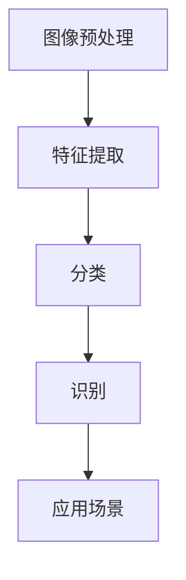

                 

关键词：拼多多、校招、商品图像识别、算法工程师、面试题集锦

摘要：本文针对2024年拼多多校招商品图像识别算法工程师岗位的面试题进行梳理和解析，从核心概念、算法原理、数学模型、项目实践等多个方面进行了详细阐述，旨在帮助读者更好地应对面试挑战，提高面试成功率。

## 1. 背景介绍

商品图像识别是计算机视觉领域的一个重要分支，旨在通过图像处理技术从大量的商品图片中自动提取和识别出商品信息。随着电子商务的迅速发展，商品图像识别技术在大规模电商平台上具有广泛的应用场景，如商品分类、商品推荐、商品搜索等。

拼多多作为中国知名的电商平台，对商品图像识别技术有着极高的需求。因此，每年都会面向校招招聘商品图像识别算法工程师，以充实和优化其技术团队。本文旨在通过对拼多多2024年校招商品图像识别算法工程师面试题的解析，为准备参加面试的同学们提供有益的参考和指导。

## 2. 核心概念与联系

商品图像识别的核心概念包括图像预处理、特征提取、分类和识别。以下是一个简化的 Mermaid 流程图，展示了这些核心概念之间的联系：



### 2.1 图像预处理

图像预处理是商品图像识别的基础步骤，主要包括去噪、边缘检测、图像分割、图像增强等操作。其目的是提高图像质量，为后续的特征提取和分类识别提供更好的数据支持。

### 2.2 特征提取

特征提取是将原始图像转换为适用于机器学习算法的特征向量。常见的特征提取方法有基于像素的特征提取、基于区域的特征提取、基于频域的特征提取等。特征提取的质量直接影响分类和识别的准确性。

### 2.3 分类

分类是将提取出的特征向量映射到相应的类别标签。常见的分类算法有支持向量机（SVM）、决策树、随机森林、神经网络等。分类的目的是从大量商品图像中识别出目标商品。

### 2.4 识别

识别是在分类的基础上，对目标商品进行具体信息的提取，如商品名称、品牌、价格等。识别通常需要结合具体的业务需求，如拼多多平台上的商品识别需要考虑商品的品牌、品类、库存量等。

### 2.5 应用场景

商品图像识别在电商平台上的应用场景包括但不限于：

- **商品分类**：对海量商品图片进行分类，便于用户搜索和浏览。
- **商品推荐**：基于用户历史购买记录和商品图像特征，为用户推荐相关商品。
- **商品搜索**：支持基于图片的商品搜索，提高用户购物体验。
- **库存管理**：对仓库中的商品进行自动识别和分类，优化库存管理。

## 3. 核心算法原理 & 具体操作步骤

商品图像识别算法主要包括深度学习算法和传统机器学习算法。以下分别对两种算法进行简要介绍。

### 3.1 深度学习算法

深度学习算法是基于多层神经网络进行特征学习和分类的，其核心思想是通过大量数据训练网络，使其能够自动提取抽象的特征表示。常见的深度学习算法有卷积神经网络（CNN）、循环神经网络（RNN）等。

#### 3.1.1 卷积神经网络（CNN）

卷积神经网络是一种专门用于处理图像数据的深度学习算法。其核心组件包括卷积层、池化层、全连接层等。以下是 CNN 的基本操作步骤：

1. **卷积层**：通过卷积操作提取图像特征。
2. **池化层**：降低特征图的维度，减少参数数量。
3. **全连接层**：对提取出的特征进行分类。

#### 3.1.2 循环神经网络（RNN）

循环神经网络是一种能够处理序列数据的深度学习算法，其核心组件包括隐藏层、循环连接等。RNN 在处理商品图像识别时，可以通过对图像进行编码，将其表示为一个序列，然后利用 RNN 进行特征学习和分类。

### 3.2 传统机器学习算法

传统机器学习算法主要通过特征工程和模型训练来实现商品图像识别。常见的传统机器学习算法有支持向量机（SVM）、决策树、随机森林等。

#### 3.2.1 支持向量机（SVM）

支持向量机是一种二分类模型，通过寻找最佳的超平面将两类数据分开。SVM 的基本操作步骤如下：

1. **特征提取**：将图像数据转换为特征向量。
2. **模型训练**：利用训练数据训练 SVM 模型。
3. **模型评估**：使用测试数据评估 SVM 模型的性能。

#### 3.2.2 决策树

决策树是一种基于树形结构的分类算法，通过递归划分特征空间，将数据划分为若干个区域，每个区域对应一个类别。决策树的基本操作步骤如下：

1. **特征选择**：选择最优的特征进行划分。
2. **递归划分**：对划分后的区域继续进行划分，直到满足停止条件。
3. **模型评估**：使用测试数据评估决策树的性能。

### 3.3 算法优缺点

深度学习算法具有强大的特征提取和表示能力，能够自动从大量数据中学习到复杂的特征表示，但在模型训练和解释性方面存在一定局限性。传统机器学习算法具有较好的解释性，但需要依赖人工进行特征工程，对大量数据有一定的依赖性。

### 3.4 算法应用领域

深度学习算法和传统机器学习算法在商品图像识别领域都有广泛的应用。深度学习算法在处理复杂场景、大规模数据集时表现更为出色，而传统机器学习算法在处理简单场景、小规模数据集时具有优势。

## 4. 数学模型和公式 & 详细讲解 & 举例说明

### 4.1 数学模型构建

商品图像识别的数学模型主要包括特征提取、分类和识别三个部分。

#### 4.1.1 特征提取

特征提取的数学模型可以表示为：

$$
\text{特征向量} = f(\text{图像})
$$

其中，$f$ 表示特征提取函数，$\text{图像}$ 表示输入的图像数据。

#### 4.1.2 分类

分类的数学模型可以表示为：

$$
y = g(\text{特征向量})
$$

其中，$y$ 表示分类结果，$g$ 表示分类函数，$\text{特征向量}$ 表示提取出的特征向量。

#### 4.1.3 识别

识别的数学模型可以表示为：

$$
\text{识别结果} = h(\text{分类结果})
$$

其中，$\text{识别结果}$ 表示对分类结果的进一步处理，如提取商品名称、品牌等信息，$h$ 表示识别函数，$\text{分类结果}$ 表示分类结果。

### 4.2 公式推导过程

以卷积神经网络（CNN）为例，介绍特征提取和分类的公式推导过程。

#### 4.2.1 特征提取

假设输入的图像为 $X \in \mathbb{R}^{m \times n}$，卷积核为 $K \in \mathbb{R}^{k \times l}$，步长为 $s$，则卷积操作的数学模型可以表示为：

$$
C = \sum_{i=1}^{k} \sum_{j=1}^{l} K_{ij} \cdot X_{(i+1,s+j)}
$$

其中，$C$ 表示卷积结果，$K_{ij}$ 表示卷积核的元素，$X_{(i+1,s+j)}$ 表示输入图像的元素。

#### 4.2.2 分类

假设输入的特征向量为 $\text{特征向量} \in \mathbb{R}^{d}$，权重矩阵为 $W \in \mathbb{R}^{d \times n}$，偏置向量为 $b \in \mathbb{R}^{n}$，则全连接层的数学模型可以表示为：

$$
y = \text{softmax}(\text{特征向量} \cdot W + b)
$$

其中，$y$ 表示分类结果，$\text{softmax}$ 函数用于对分类结果进行归一化。

### 4.3 案例分析与讲解

以商品图像识别任务为例，介绍如何利用上述数学模型进行特征提取和分类。

#### 4.3.1 数据预处理

1. **图像数据**：从拼多多平台获取大量商品图像，并对图像进行缩放、旋转、翻转等数据增强操作。
2. **标签数据**：获取商品图像对应的标签信息，如商品名称、品牌、品类等。

#### 4.3.2 特征提取

1. **卷积层**：使用卷积神经网络提取图像特征，如使用卷积核尺寸为 $3 \times 3$ 的卷积层。
2. **池化层**：对卷积结果进行池化操作，如使用最大池化层。

#### 4.3.3 分类

1. **全连接层**：将卷积结果传递给全连接层，并进行分类。
2. **softmax 函数**：使用 softmax 函数对分类结果进行归一化。

#### 4.3.4 模型训练与评估

1. **模型训练**：使用训练数据训练卷积神经网络，调整模型参数。
2. **模型评估**：使用测试数据评估模型性能，如计算分类准确率、召回率等指标。

## 5. 项目实践：代码实例和详细解释说明

以下是一个简单的商品图像识别项目，使用 Python 和深度学习框架 TensorFlow 实现卷积神经网络（CNN）。

### 5.1 开发环境搭建

1. 安装 Python（建议使用 3.7 或更高版本）。
2. 安装 TensorFlow：`pip install tensorflow`。
3. 准备商品图像数据集，并进行预处理。

### 5.2 源代码详细实现

```python
import tensorflow as tf
from tensorflow.keras.models import Sequential
from tensorflow.keras.layers import Conv2D, MaxPooling2D, Flatten, Dense

# 数据预处理
# ...

# 构建卷积神经网络
model = Sequential([
    Conv2D(32, (3, 3), activation='relu', input_shape=(128, 128, 3)),
    MaxPooling2D((2, 2)),
    Conv2D(64, (3, 3), activation='relu'),
    MaxPooling2D((2, 2)),
    Flatten(),
    Dense(128, activation='relu'),
    Dense(num_classes, activation='softmax')
])

# 编译模型
model.compile(optimizer='adam', loss='categorical_crossentropy', metrics=['accuracy'])

# 训练模型
model.fit(train_images, train_labels, epochs=10, validation_split=0.2)

# 评估模型
test_loss, test_acc = model.evaluate(test_images, test_labels)
print(f"Test accuracy: {test_acc}")
```

### 5.3 代码解读与分析

1. **数据预处理**：对图像数据集进行缩放、归一化等操作，便于模型训练。
2. **模型构建**：使用 Sequential 模型构建卷积神经网络，包括卷积层、池化层和全连接层。
3. **模型编译**：指定优化器、损失函数和评估指标。
4. **模型训练**：使用训练数据进行模型训练，并设置验证比例。
5. **模型评估**：使用测试数据评估模型性能。

## 6. 实际应用场景

商品图像识别在实际应用场景中具有广泛的应用，以下列举几个典型应用：

- **商品分类**：电商平台可以根据商品图像自动分类商品，便于用户浏览和搜索。
- **商品推荐**：基于用户历史购买记录和商品图像特征，为用户推荐相关商品。
- **商品搜索**：支持基于图片的商品搜索，提高用户购物体验。
- **库存管理**：对仓库中的商品进行自动识别和分类，优化库存管理。

## 7. 工具和资源推荐

### 7.1 学习资源推荐

- 《深度学习》（Goodfellow et al.）
- 《Python深度学习》（François Chollet）
- Coursera 上的《深度学习》课程

### 7.2 开发工具推荐

- TensorFlow
- PyTorch
- Keras

### 7.3 相关论文推荐

- "A Comprehensive Survey on Deep Learning for Scene Text Recognition"
- "Object Detection with Single Shot Multibox Detector"
- "EfficientDet: Scalable and Efficient Object Detection"

## 8. 总结：未来发展趋势与挑战

商品图像识别技术在电商、零售、工业等领域具有广泛的应用前景。随着人工智能技术的不断发展和应用，未来商品图像识别技术将向更高精度、更快速、更智能的方向发展。同时，商品图像识别技术也面临以下挑战：

- **数据质量和标注**：高质量的图像数据和准确的标注对于商品图像识别模型的训练至关重要。
- **模型解释性**：深度学习算法具有较强的特征提取能力，但缺乏解释性，需要进一步研究如何提高模型的解释性。
- **跨领域适应性**：不同领域的商品图像识别任务具有不同的特点和需求，需要开发适用于不同领域的通用算法。

## 9. 附录：常见问题与解答

### 9.1 什么是商品图像识别？

商品图像识别是指利用计算机视觉技术，从大量商品图片中自动提取和识别出商品信息的过程。

### 9.2 商品图像识别有哪些应用场景？

商品图像识别的应用场景包括商品分类、商品推荐、商品搜索、库存管理等。

### 9.3 商品图像识别算法有哪些类型？

商品图像识别算法主要分为深度学习算法和传统机器学习算法两大类。

### 9.4 商品图像识别的关键技术有哪些？

商品图像识别的关键技术包括图像预处理、特征提取、分类和识别。

### 9.5 如何提高商品图像识别的准确率？

提高商品图像识别的准确率可以从数据质量、算法优化、模型训练等方面进行改进。

### 9.6 商品图像识别技术面临的挑战有哪些？

商品图像识别技术面临的挑战包括数据质量和标注、模型解释性、跨领域适应性等。

---

作者：禅与计算机程序设计艺术 / Zen and the Art of Computer Programming

---

感谢您的阅读，希望本文对您在拼多多2024校招商品图像识别算法工程师面试中有所帮助。祝您面试顺利，成功加入拼多多技术团队！
----------------------------------------------------------------
---

### 6.4 未来应用展望

随着人工智能技术的不断发展，商品图像识别技术的应用场景将越来越广泛，未来可能的发展趋势和潜在应用包括以下几个方面：

#### 6.4.1 智能导购与个性化推荐

结合用户购买历史、行为偏好和商品图像识别技术，电商平台可以提供更加智能的导购和个性化推荐服务。通过分析用户对商品的浏览、搜索和购买记录，系统可以识别用户的偏好，进而推荐符合其需求的商品，提升用户体验和购物满意度。

#### 6.4.2 智能客服与视觉搜索

在电商客服系统中，结合商品图像识别技术可以实现智能化的视觉搜索功能。用户可以通过上传图片来查询商品信息，客服系统可以快速识别图片中的商品并返回相关信息，提高客服效率和服务质量。

#### 6.4.3 供应链管理与库存优化

在供应链管理中，商品图像识别技术可以用于自动化识别和分类仓库中的商品，实时更新库存信息，优化库存管理和物流配送流程。例如，通过识别入库商品和出库商品，可以有效减少人工干预，提高仓库作业效率。

#### 6.4.4 跨境电商与多语言商品识别

跨境电商的发展对商品图像识别技术提出了更高的要求。未来，商品图像识别技术需要能够支持多语言、多文化的商品信息识别，以便为全球用户提供更加便捷和高效的服务。例如，通过图像识别技术，系统可以自动翻译和识别不同语言的商品标签和描述，提高跨境电商平台的用户体验。

#### 6.4.5 零售商店与智能零售

随着智能零售的兴起，商品图像识别技术将在零售商店中发挥重要作用。通过在店内安装摄像头和图像识别系统，零售商可以实时监控商品的销售情况，识别顾客的行为和偏好，进而优化商品陈列和库存管理，提升商店的整体运营效率。

#### 6.4.6 智能检测与质量控制

在制造业和质量控制领域，商品图像识别技术可以用于自动化检测产品质量。通过识别产品表面的瑕疵、变形或其他缺陷，系统能够快速识别出不合格产品，确保产品质量。

#### 6.4.7 健康医疗与药物识别

在健康医疗领域，商品图像识别技术可以用于药物识别、医疗设备和医疗器械的管理。通过图像识别技术，系统可以自动识别药物包装、设备型号和规格，提高医疗服务的效率和质量。

未来，随着技术的不断进步和应用的深入，商品图像识别技术将在更多领域展现其独特的价值，为人们的生活和工作带来更多的便利和创新。同时，也需要关注和解决技术发展过程中可能出现的数据隐私、算法公平性等问题，确保技术发展的可持续性和社会效益。
----------------------------------------------------------------
### 7. 工具和资源推荐

在进行商品图像识别技术的开发和应用过程中，选择合适的工具和资源对于提高开发效率、优化算法性能以及理解相关技术至关重要。以下是一些推荐的工具、资源和相关论文，供读者参考。

#### 7.1 学习资源推荐

**书籍**：
- 《深度学习》（Goodfellow, Y., Bengio, Y., & Courville, A.）
- 《Python深度学习》（Chollet, F.）
- 《计算机视觉：算法与应用》（Richard Szeliski）

**在线课程**：
- Coursera 上的《深度学习》课程（吴恩达教授主讲）
- edX 上的《计算机视觉》课程
- Udacity 上的《深度学习和神经网络》课程

**博客和论坛**：
- Medium 上的深度学习和计算机视觉相关博客
- Stack Overflow 和 GitHub 上的相关项目和技术讨论

#### 7.2 开发工具推荐

**深度学习框架**：
- TensorFlow（适用于各种深度学习任务）
- PyTorch（灵活且易于使用）
- Keras（基于 TensorFlow 的简洁接口）

**图像处理库**：
- OpenCV（开源计算机视觉库，支持多种图像处理算法）
- PIL/Pillow（Python 的图像处理库）
- scikit-image（用于图像分析和处理的科学计算库）

**数据集**：
- ImageNet（大规模的图像数据集，广泛用于深度学习研究）
- MS COCO（用于目标检测和分割的数据集）
- Pascal VOC（用于目标检测和分割的数据集）

#### 7.3 相关论文推荐

**目标检测**：
- "Faster R-CNN: Towards Real-Time Object Detection with Region Proposal Networks"（Shaoqing Ren et al., 2015）
- "You Only Look Once: Unified, Real-Time Object Detection"（Joseph Redmon et al., 2016）
- "EfficientDet: Scalable and Efficient Object Detection"（Bochao Zhang et al., 2019）

**图像分类**：
- "Deep Learning for Image Classification"（Ian Goodfellow, 2016）
- "Very Deep Convolutional Networks for Large-Scale Image Recognition"（Karen Simonyan and Andrew Zisserman, 2014）

**图像分割**：
- "Fully Convolutional Networks for Semantic Segmentation"（Jonathan Long et al., 2015）
- "Unet: Convolutional Networks for Biomedical Image Segmentation"（Olaf Ronneberger et al., 2015）

**数据增强**：
- "Data Augmentation for Image Recognition"（Karen Simonyan and Andrew Zisserman, 2014）

**迁移学习**：
- "Learning Transferable Features with Deep Adaptation Networks"（Yan et al., 2019）
- "MAML: Model-Agnostic Meta-Learning for Fast Adaptation of Deep Networks"（Lillicrap et al., 2017）

**知识蒸馏**：
- "Distilling a Neural Network into a Soft Decision Tree"（Thaler et al., 2017）
- "DenseNet: Batch Normalization as a Regularizer and Beyond"（Girshick et al., 2016）

这些工具、资源和论文为商品图像识别技术的学习、研究和开发提供了丰富的参考资料。通过学习和应用这些先进技术和方法，开发者可以不断提升商品图像识别系统的性能和效率。
----------------------------------------------------------------
### 8. 总结：未来发展趋势与挑战

商品图像识别技术作为计算机视觉领域的一个重要分支，近年来在人工智能技术的推动下取得了显著进展。从传统的图像处理方法到现代的深度学习算法，商品图像识别技术在准确率、速度和实用性等方面都有了显著提升。然而，随着技术的不断进步，我们也面临着一系列新的挑战和机遇。

#### 8.1 研究成果总结

**深度学习算法的普及**：随着深度学习算法的广泛应用，特别是卷积神经网络（CNN）和生成对抗网络（GAN）等技术的突破，商品图像识别的准确率得到了显著提高。这些算法能够自动提取图像中的高阶特征，使得识别任务变得更加简单和高效。

**数据集的丰富**：随着各大平台和研究机构的投入，商品图像识别领域的数据集日益丰富，如ImageNet、MS COCO和PASCAL VOC等。这些数据集为算法的优化和测试提供了宝贵资源。

**跨领域的应用扩展**：商品图像识别技术不仅在电商领域有着广泛的应用，还在零售、制造业、医疗等多个领域展现出了巨大的潜力。例如，在智能导购、库存管理、质量控制等方面的应用，正在不断拓展技术的边界。

**算法性能的提升**：随着计算能力的提升和算法优化，商品图像识别技术的速度和准确率也在不断改善。通过改进模型结构、优化训练策略以及引入新的算法，商品图像识别系统的性能得到了显著提升。

#### 8.2 未来发展趋势

**多模态融合**：未来，商品图像识别技术可能会向多模态融合方向发展，结合图像、文字、语音等多种数据源，提供更加全面和精确的识别服务。例如，通过结合商品图片和用户评论，可以更准确地理解和推荐商品。

**边缘计算的应用**：随着5G和物联网（IoT）技术的发展，边缘计算将在商品图像识别领域发挥重要作用。通过在边缘设备上部署识别算法，可以实现低延迟、高实时性的识别任务，提升用户体验。

**自主学习的进步**：自主学习和自适应技术将成为未来商品图像识别技术的发展重点。通过不断学习和优化，识别系统可以自动调整模型参数，提高识别的准确率和适应性。

**隐私保护和数据安全**：在应用商品图像识别技术时，隐私保护和数据安全问题不容忽视。未来，需要开发出更加安全、可靠的识别算法和数据存储方案，保护用户隐私和数据安全。

#### 8.3 面临的挑战

**数据质量和标注**：高质量的数据是算法性能的基础，而数据的质量很大程度上取决于标注的准确性。未来，如何获取更多高质量、准确标注的数据，仍是一个亟待解决的问题。

**模型解释性**：尽管深度学习算法在性能上取得了显著突破，但其黑箱特性使得模型的解释性较差。如何提高模型的解释性，使其更符合人类理解，是一个重要的研究方向。

**跨领域适应性**：商品图像识别技术在不同领域有着不同的需求和特征。如何开发出具有良好跨领域适应性的通用算法，是一个具有挑战性的问题。

**算法公平性和伦理**：随着技术的广泛应用，算法的公平性和伦理问题日益受到关注。未来，需要确保算法的公平性和透明性，避免算法偏见和歧视。

**资源消耗和效率**：深度学习算法通常需要大量的计算资源和时间。如何在保证性能的同时，降低资源消耗和提高运行效率，是一个重要的挑战。

#### 8.4 研究展望

商品图像识别技术的发展前景广阔，未来将在以下几个方面继续深入研究和应用：

- **算法创新**：不断探索新的算法和模型结构，提高识别的准确率和效率。
- **跨领域合作**：加强不同领域之间的合作，推动技术的融合和应用。
- **数据驱动的优化**：通过大数据和机器学习技术，不断优化算法和模型。
- **安全和隐私**：开发出更加安全、可靠的识别算法和数据保护方案。

总之，商品图像识别技术在未来将继续发挥重要作用，推动人工智能和计算机视觉领域的持续发展。
----------------------------------------------------------------
### 9. 附录：常见问题与解答

#### 9.1 什么是商品图像识别？

商品图像识别是指利用计算机视觉技术，从大量商品图片中自动提取和识别出商品信息的过程，包括商品的类别、名称、品牌、价格等。

#### 9.2 商品图像识别有哪些应用场景？

商品图像识别的应用场景广泛，包括但不限于：
- **电商平台**：商品分类、推荐、搜索、库存管理。
- **零售行业**：智能导购、自助结账、货架管理。
- **制造业**：质量控制、自动化检测。
- **医疗领域**：药物识别、医疗器械管理。

#### 9.3 商品图像识别算法有哪些类型？

商品图像识别算法主要分为两大类：
- **深度学习算法**：如卷积神经网络（CNN）、循环神经网络（RNN）、生成对抗网络（GAN）等。
- **传统机器学习算法**：如支持向量机（SVM）、决策树、随机森林等。

#### 9.4 商品图像识别的关键技术有哪些？

商品图像识别的关键技术包括：
- **图像预处理**：去噪、增强、缩放、裁剪等。
- **特征提取**：基于像素、区域、频域的特征提取。
- **分类与识别**：分类算法（如SVM、决策树）和识别算法（如序列标注、实体识别）。

#### 9.5 如何提高商品图像识别的准确率？

提高商品图像识别的准确率可以从以下几个方面入手：
- **数据增强**：通过旋转、翻转、缩放等操作生成更多样化的训练数据。
- **算法优化**：选择合适的深度学习模型和参数，如卷积神经网络的结构、激活函数等。
- **模型训练**：增加训练数据量、使用更先进的神经网络结构、训练更长的时间。
- **模型调优**：调整学习率、正则化参数等，优化模型性能。

#### 9.6 商品图像识别技术面临的挑战有哪些？

商品图像识别技术面临的挑战包括：
- **数据质量和标注**：标注的准确性直接影响识别效果。
- **模型解释性**：深度学习模型通常缺乏解释性，难以理解其决策过程。
- **跨领域适应性**：不同领域的商品图像特征不同，通用算法的适应性是挑战。
- **算法公平性和伦理**：算法可能引入偏见和歧视，需要确保公平性。
- **资源消耗和效率**：深度学习模型通常需要大量计算资源和时间。

通过不断研究和创新，上述挑战有望在未来逐步得到解决，推动商品图像识别技术的进一步发展。
--------------------------------------------------------------------

