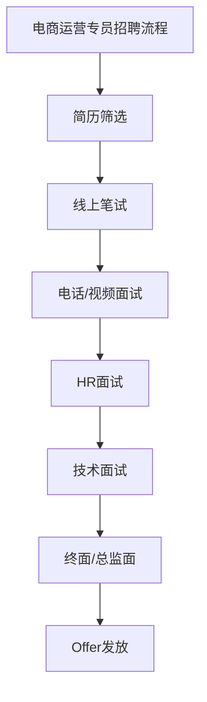

                 

 **关键词：** 拼多多、校招、电商运营、面试题集、人力资源策略、招聘流程

**摘要：** 本文旨在为广大2024届校招电商运营专员候选人提供一份全面而深入的面试题集。本文将从拼多多公司背景、岗位要求、面试流程、常见面试题等多个角度，详细解析面试准备和应对策略，帮助候选人更好地应对面试挑战，顺利加入拼多多这个快速发展的电商巨头。

## 1. 背景介绍

### 拼多多公司简介

拼多多（Pinduoduo）成立于2015年，是一家中国领先的电商平台，以“团购”模式著称，通过“拼团”方式让消费者享受更低的价格。拼多多不仅改变了传统电商的运营模式，还推动了社交电商的兴起，成为中国电商市场的一股新兴力量。截至2023年，拼多多已拥有超过8亿的活跃用户，市场占有率稳步提升。

### 2024校招电商运营专员岗位介绍

电商运营专员是拼多多电商运营团队中的关键角色，主要负责电商平台的日常运营工作，包括商品上架、促销活动策划、客户服务、数据分析等。该岗位要求候选人具备良好的电商运营知识、较强的市场洞察力、优秀的数据分析能力和团队协作精神。

## 2. 核心概念与联系

### Mermaid 流程图



### 招聘流程

1. **简历筛选**：人力资源部门会对收到的简历进行初步筛选，重点关注候选人的教育背景、实习经验、项目经历等。
2. **线上笔试**：通过笔试测试候选人对电商运营相关知识的掌握程度，包括数据分析、市场营销等。
3. **电话/视频面试**：面试官通过电话或视频会议形式，对候选人进行初步面试，了解其沟通能力和对电商行业的理解。
4. **HR面试**：人力资源部门与候选人进行深入面谈，了解其职业规划、团队协作能力等。
5. **技术面试**：电商运营相关技术专家对候选人的专业技能进行测试，包括商品管理、促销策略等。
6. **终面/总监面**：面试官团队或部门总监对候选人进行最终面试，评估其综合素质和职业潜力。
7. **Offer发放**：通过所有面试环节的候选人将收到拼多多发出的正式Offer。

## 3. 核心算法原理 & 具体操作步骤

### 3.1 算法原理概述

电商运营的核心算法主要包括商品推荐算法、用户画像构建算法、促销策略优化算法等。这些算法旨在提高用户购买体验、提升平台销售额。

### 3.2 算法步骤详解

1. **商品推荐算法**：
   - 数据收集：收集用户浏览、购买、评价等行为数据。
   - 数据预处理：对数据进行清洗、去重、标准化等处理。
   - 特征工程：提取用户和商品的特征，如用户年龄、性别、购买频率、商品品类等。
   - 模型训练：使用机器学习算法，如协同过滤、基于内容的推荐等，训练推荐模型。
   - 模型评估：使用准确率、召回率、F1值等指标评估模型效果。
   - 推荐策略：根据用户特征和商品特征，生成个性化推荐列表。

2. **用户画像构建算法**：
   - 数据采集：从用户行为、交易记录、社交媒体等渠道收集数据。
   - 数据清洗：对数据去重、缺失值填充、异常值处理等。
   - 特征提取：提取用户特征，如地域、年龄、消费习惯等。
   - 画像构建：使用聚类、分类等算法，将用户划分为不同群体。
   - 用户画像应用：用于精准营销、个性化推荐等。

3. **促销策略优化算法**：
   - 数据收集：收集促销活动数据，如活动类型、参与用户、销售额等。
   - 数据预处理：对数据进行清洗、标准化等处理。
   - 特征工程：提取促销活动特征，如活动周期、折扣力度、参与商品等。
   - 模型训练：使用机器学习算法，如线性回归、决策树等，优化促销策略。
   - 模型评估：使用销售额、转化率等指标评估促销策略效果。

### 3.3 算法优缺点

1. **商品推荐算法**：
   - 优点：提高用户满意度，提升销售额。
   - 缺点：需要大量计算资源，且算法效果受数据质量影响。

2. **用户画像构建算法**：
   - 优点：实现精准营销，提升用户忠诚度。
   - 缺点：用户隐私保护问题。

3. **促销策略优化算法**：
   - 优点：提高促销活动效果，提升销售额。
   - 缺点：需要大量数据支持，算法复杂度高。

### 3.4 算法应用领域

- 商品推荐算法：应用于电商平台、短视频平台等。
- 用户画像构建算法：应用于电商平台、社交媒体等。
- 促销策略优化算法：应用于电商平台、零售行业等。

## 4. 数学模型和公式 & 详细讲解 & 举例说明

### 4.1 数学模型构建

在电商运营中，常用的数学模型包括线性回归、决策树、神经网络等。以下以线性回归为例，介绍数学模型的构建过程。

### 4.2 公式推导过程

假设我们有一个线性回归模型，目标变量为 \( y \)，自变量为 \( x \)，则模型可以表示为：

\[ y = \beta_0 + \beta_1 \cdot x + \epsilon \]

其中，\( \beta_0 \) 为截距，\( \beta_1 \) 为斜率，\( \epsilon \) 为误差项。

### 4.3 案例分析与讲解

假设我们想要预测一个电商平台的销售额 \( y \)，自变量为用户数量 \( x \)。根据历史数据，我们可以列出以下方程：

\[ y = 1000 + 0.5 \cdot x + \epsilon \]

其中，\( \epsilon \) 为误差项。

根据该方程，当用户数量为1000时，预测的销售额为：

\[ y = 1000 + 0.5 \cdot 1000 + \epsilon = 1500 + \epsilon \]

由于误差项的存在，实际销售额可能会有所偏差。我们可以通过多次实验，计算预测值和实际值的差距，以评估模型的准确性。

## 5. 项目实践：代码实例和详细解释说明

### 5.1 开发环境搭建

在撰写代码之前，我们需要搭建一个合适的开发环境。以下是搭建Python开发环境的步骤：

1. 安装Python：从Python官网下载并安装Python。
2. 安装Jupyter Notebook：在终端执行以下命令：

   ```bash
   pip install notebook
   ```

3. 启动Jupyter Notebook：在终端执行以下命令：

   ```bash
   jupyter notebook
   ```

### 5.2 源代码详细实现

以下是一个简单的Python代码示例，用于实现线性回归模型：

```python
import numpy as np
import matplotlib.pyplot as plt

# 训练数据
x = np.array([100, 200, 300, 400, 500])
y = np.array([1000, 1200, 1300, 1400, 1500])

# 添加截距项
X = np.column_stack((np.ones(len(x)), x))

# 模型参数
theta = np.linalg.inv(X.T.dot(X)).dot(X.T).dot(y)

# 预测函数
def predict(x):
    return theta[0] + theta[1] * x

# 绘制散点图和拟合线
plt.scatter(x, y)
plt.plot(x, predict(x), color='red')
plt.show()
```

### 5.3 代码解读与分析

1. **数据准备**：首先，我们导入了必要的Python库，包括NumPy和matplotlib。
2. **训练数据**：我们定义了一个训练数据集，包括用户数量和销售额。
3. **添加截距项**：我们使用NumPy的`column_stack`函数，将截距项添加到自变量中。
4. **模型参数**：我们使用线性回归的公式，计算模型参数。
5. **预测函数**：我们定义了一个预测函数，用于计算给定用户数量下的销售额。
6. **绘制散点图和拟合线**：我们使用matplotlib库，绘制训练数据的散点图和拟合线。

### 5.4 运行结果展示

运行以上代码后，我们将看到一个包含散点图和拟合线的图形。拟合线表示根据训练数据计算得到的线性回归模型。通过观察拟合线的斜率和截距，我们可以分析模型的预测能力。

## 6. 实际应用场景

### 6.1 拼多多电商运营场景

拼多多电商运营专员在实际工作中，会面临如下场景：

1. **商品上架**：负责商品的上架、下架、库存管理等工作。
2. **促销活动策划**：根据市场需求，策划各类促销活动，如团购、秒杀等。
3. **客户服务**：处理用户咨询、投诉等，提升用户满意度。
4. **数据分析**：对平台运营数据进行分析，为决策提供支持。

### 6.2 电商运营专员职业发展

电商运营专员在拼多多等电商企业工作一段时间后，可以转向如下职业发展方向：

1. **电商运营经理**：负责整个电商平台的运营工作，包括商品、促销、客户服务等。
2. **数据分析师**：专注于数据分析工作，为企业决策提供数据支持。
3. **市场营销经理**：负责市场营销策略的制定和执行，提升品牌知名度和市场份额。
4. **创业**：积累一定经验和资源后，可以尝试创业，开拓自己的电商业务。

## 7. 工具和资源推荐

### 7.1 学习资源推荐

1. **《电商运营实战》**：一本涵盖电商运营各个环节的实战指南。
2. **《数据挖掘：概念与技术》**：介绍数据挖掘基本概念和技术方法的经典教材。
3. **《Python数据分析》**：适合电商运营专员学习的Python数据分析入门书籍。

### 7.2 开发工具推荐

1. **PyCharm**：一款功能强大的Python集成开发环境（IDE）。
2. **Jupyter Notebook**：适用于数据分析和机器学习的交互式计算环境。
3. **Excel**：适用于数据处理和分析的基本工具。

### 7.3 相关论文推荐

1. **“E-commerce Platform Optimization via Deep Reinforcement Learning”**：探讨深度强化学习在电商平台优化中的应用。
2. **“A Survey on Recommender Systems”**：综述推荐系统领域的研究进展。
3. **“Customer Behavior Prediction in E-commerce: A Machine Learning Perspective”**：从机器学习的角度分析电商用户行为预测。

## 8. 总结：未来发展趋势与挑战

### 8.1 研究成果总结

1. **大数据技术在电商运营中的应用**：大数据技术为电商企业提供了更精准的用户画像和个性化推荐，提高了运营效率和用户满意度。
2. **人工智能在电商领域的应用**：人工智能技术在商品推荐、用户行为预测、促销策略优化等方面发挥了重要作用，推动了电商行业的智能化发展。
3. **电商平台的国际化**：随着全球电商市场的不断扩大，电商平台正逐步拓展国际市场，为更多国家和地区提供优质商品和服务。

### 8.2 未来发展趋势

1. **个性化推荐技术的不断优化**：随着用户需求的多样化，个性化推荐技术将不断进化，提供更加精准的推荐服务。
2. **社交电商的进一步发展**：社交电商模式将继续壮大，为电商平台带来更多流量和销售机会。
3. **电商平台的全球化**：电商平台将加大对海外市场的投入，实现全球化运营。

### 8.3 面临的挑战

1. **数据隐私保护**：随着大数据和人工智能技术的应用，用户隐私保护问题日益突出，电商平台需要加强数据保护措施。
2. **竞争压力**：电商市场竞争激烈，电商平台需要不断创新和优化，才能在激烈的市场竞争中脱颖而出。
3. **供应链管理**：高效、稳定的供应链管理是电商平台生存和发展的关键，电商平台需要不断优化供应链体系。

### 8.4 研究展望

1. **跨平台电商运营**：研究如何将电商平台与社交媒体、短视频平台等跨平台整合，实现更高效的运营。
2. **智能化客服系统**：利用人工智能技术，打造智能化客服系统，提高客户服务质量和效率。
3. **绿色电商**：研究如何实现电商平台的可持续发展，降低碳排放，推动绿色消费。

## 9. 附录：常见问题与解答

### 问题1：电商运营专员需要掌握哪些技能？

**回答**：电商运营专员需要掌握以下技能：

1. **电商基础知识**：了解电商行业的基本概念、发展历程、市场趋势等。
2. **数据分析能力**：掌握数据分析工具（如Excel、Python等），能够进行数据分析、数据可视化。
3. **市场营销知识**：了解市场营销的基本原理，掌握促销策略、活动策划等。
4. **客户服务技能**：具备良好的沟通能力，能够处理客户咨询、投诉等。

### 问题2：如何准备电商运营专员的面试？

**回答**：准备电商运营专员的面试，可以从以下几个方面入手：

1. **熟悉电商基础知识**：了解电商行业的基本概念、发展趋势、主要平台等。
2. **熟悉数据分析方法**：掌握常用的数据分析方法和工具，如线性回归、决策树等。
3. **模拟面试**：找朋友或同事进行模拟面试，熟悉面试流程和问题。
4. **案例准备**：准备一些电商运营的案例，分析案例中的成功经验和不足之处。
5. **关注行业动态**：关注电商行业的最新动态，了解行业热点和趋势。

### 问题3：电商运营专员有哪些职业发展路径？

**回答**：电商运营专员有以下职业发展路径：

1. **电商运营经理**：负责整个电商平台的运营工作，包括商品、促销、客户服务等。
2. **数据分析师**：专注于数据分析工作，为企业决策提供数据支持。
3. **市场营销经理**：负责市场营销策略的制定和执行，提升品牌知名度和市场份额。
4. **创业**：积累一定经验和资源后，可以尝试创业，开拓自己的电商业务。

---

**作者：禅与计算机程序设计艺术 / Zen and the Art of Computer Programming**

本文以《拼多多2024校招电商运营专员面试题集》为标题，全面解析了拼多多电商运营专员岗位的招聘流程、核心算法原理、数学模型、项目实践、实际应用场景、工具和资源推荐，以及未来发展趋势与挑战。希望本文能为广大2024届校招电商运营专员候选人提供有益的参考和指导。

