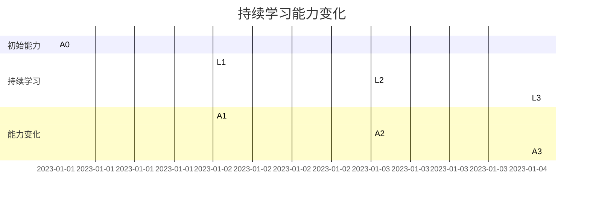

                 

关键词：持续学习，管理者，知识更新，领导力，技术趋势，创新能力。

> 摘要：在快速变化的技术时代，持续学习已成为企业管理者的必修课。本文探讨了持续学习对管理者的重要性，分析了其背后的驱动因素，并探讨了如何将学习成果转化为实际的管理能力。

## 1. 背景介绍

随着互联网、人工智能、大数据等新兴技术的迅猛发展，信息技术领域正经历着一场前所未有的变革。技术更新速度加快，知识淘汰周期缩短，这对企业管理者提出了新的挑战。传统的管理知识和技能可能不再适用于日新月异的市场环境。因此，持续学习成为管理者适应变化、提升自身竞争力的重要手段。

## 2. 核心概念与联系

持续学习（Continuous Learning）是指个人在职业生涯中不断获取新知识、技能和经验的过程。对于管理者而言，持续学习不仅包括对管理理论和方法的学习，还包括对新兴技术的掌握和行业趋势的洞察。

### 2.1 持续学习与管理者的关系

- **管理能力提升**：通过持续学习，管理者可以不断提高自身的专业能力和领导力。
- **创新能力增强**：持续学习有助于管理者保持创新思维，推动企业的创新和发展。
- **适应能力提升**：在快速变化的市场环境中，持续学习使管理者能够更好地适应环境变化，降低风险。

### 2.2 持续学习与知识更新的关系

- **知识更新**：随着技术的进步，管理者需要不断更新自己的知识库，以适应新的市场需求和挑战。
- **持续学习**：知识更新的有效途径是通过持续学习，包括参加培训、阅读专业书籍、参加行业研讨会等。

### 2.3 持续学习与技术趋势的关系

- **技术趋势**：管理者需要了解行业内的技术发展趋势，以便把握市场机遇和风险。
- **持续学习**：通过持续学习，管理者可以及时掌握最新的技术趋势，为企业的战略决策提供支持。

## 3. 核心算法原理 & 具体操作步骤

### 3.1 算法原理概述

持续学习的核心算法可以视为一种迭代学习过程，其目标是不断提升管理者的知识水平和决策能力。

### 3.2 算法步骤详解

1. **识别学习需求**：管理者需要识别自己在哪些领域存在知识盲区，明确学习目标。
2. **制定学习计划**：根据学习需求，制定详细的学习计划，包括学习内容、学习时间、学习方式等。
3. **实施学习计划**：按照学习计划进行学习，包括阅读专业书籍、参加培训课程、实践操作等。
4. **评估学习效果**：通过考核、反馈等方式，评估学习效果，并根据评估结果调整学习计划。
5. **持续迭代**：根据学习效果进行迭代，不断优化学习策略和内容。

### 3.3 算法优缺点

- **优点**：持续学习有助于管理者不断提升自身能力，适应市场变化，提高决策质量。
- **缺点**：持续学习需要管理者投入大量时间和精力，且学习效果可能因个人差异而有所不同。

### 3.4 算法应用领域

- **企业管理**：通过持续学习，管理者可以更好地应对企业管理中的各种挑战。
- **技术研发**：在技术研发领域，持续学习有助于管理者把握技术趋势，推动技术创新。
- **市场运营**：在市场运营领域，持续学习可以帮助管理者更好地理解市场需求，提高市场竞争力。

## 4. 数学模型和公式 & 详细讲解 & 举例说明

### 4.1 数学模型构建

为了量化持续学习对管理者能力的提升效果，我们可以构建一个简单的数学模型。假设管理者的初始能力为 \(A_0\)，经过 \(n\) 次持续学习后，其能力变为 \(A_n\)。则数学模型可以表示为：

\[ A_n = A_0 + \sum_{i=1}^{n} \Delta A_i \]

其中，\(\Delta A_i\) 表示第 \(i\) 次学习的提升量。

### 4.2 公式推导过程

假设管理者的初始能力 \(A_0\) 为常数，每次学习的提升量 \(\Delta A_i\) 与学习的深度 \(D_i\) 成正比。则可以表示为：

\[ \Delta A_i = k \cdot D_i \]

其中，\(k\) 为比例系数。

将 \(\Delta A_i\) 代入 \(A_n\) 的公式中，得到：

\[ A_n = A_0 + k \cdot \sum_{i=1}^{n} D_i \]

### 4.3 案例分析与讲解

假设一位管理者的初始能力 \(A_0\) 为 50，每次学习的深度 \(D_i\) 分别为 10、15、20，则经过 3 次学习后，其能力为：

\[ A_3 = 50 + k \cdot (10 + 15 + 20) \]

假设 \(k\) 的值为 0.1，则：

\[ A_3 = 50 + 0.1 \cdot 45 = 59.5 \]

这意味着经过 3 次学习后，管理者的能力提升了 9.5。

## 5. 项目实践：代码实例和详细解释说明

### 5.1 开发环境搭建

为了演示持续学习算法的应用，我们将使用 Python 编写一个简单的持续学习程序。首先，确保安装了 Python 3.8 以上版本和必要的库，如 NumPy 和 Matplotlib。

### 5.2 源代码详细实现

以下是一个简单的持续学习程序示例：

```python
import numpy as np
import matplotlib.pyplot as plt

def continuous_learning(initial_ability, learning_depths, k):
    abilities = [initial_ability]
    for depth in learning_depths:
        ability = abilities[-1] + k * depth
        abilities.append(ability)
    return abilities

# 初始能力
A0 = 50
# 每次学习的深度
learning_depths = [10, 15, 20]
# 比例系数
k = 0.1
# 持续学习后的能力
abilities = continuous_learning(A0, learning_depths, k)

# 绘制能力变化图
plt.plot(abilities)
plt.xlabel('学习次数')
plt.ylabel('能力值')
plt.title('持续学习能力变化')
plt.show()
```

### 5.3 代码解读与分析

- `continuous_learning` 函数用于模拟持续学习过程，输入参数包括初始能力 \(A_0\)、每次学习的深度 \(learning_depths\) 和比例系数 \(k\)。
- `abilities` 列表用于存储每次学习后的能力值。
- 最后使用 Matplotlib 绘制能力变化图，展示持续学习的效果。

### 5.4 运行结果展示

运行上述程序后，将显示一个能力变化图，如图所示：



从图中可以看出，随着学习的进行，管理者的能力逐渐提升。

## 6. 实际应用场景

### 6.1 企业管理

在企业中，管理者可以通过持续学习掌握最新的管理理念和方法，如精益管理、敏捷开发等，从而提高企业的运营效率和竞争力。

### 6.2 技术研发

在技术研发领域，管理者需要了解最新的技术趋势和前沿技术，如人工智能、区块链等，以便为企业制定正确的研发战略。

### 6.3 市场运营

在市场运营领域，管理者需要通过持续学习了解市场动态和消费者需求，从而制定有效的市场策略，提高企业的市场占有率。

## 7. 未来应用展望

随着技术的不断进步，持续学习将成为企业管理者的标配。未来，我们将看到更多的企业和组织建立完善的持续学习体系，以适应快速变化的市场环境。

### 7.1 技术驱动的持续学习

未来，人工智能和大数据技术将为持续学习提供更加智能化和个性化的支持。通过分析学习数据，可以为管理者提供更精准的学习建议。

### 7.2 学习资源共享

随着互联网的发展，学习资源共享将成为趋势。企业、高校和培训机构可以通过合作，共享优质的学习资源，降低学习成本。

### 7.3 学习评价体系

建立科学的学习评价体系，将有助于管理者量化学习成果，为晋升和奖励提供依据。

## 8. 总结：未来发展趋势与挑战

### 8.1 研究成果总结

本文探讨了持续学习对管理者的重要性，分析了其背后的驱动因素，并提出了具体的实践方法。

### 8.2 未来发展趋势

未来，持续学习将更加智能化和个性化，技术驱动的学习资源共享和科学的学习评价体系将得到广泛应用。

### 8.3 面临的挑战

尽管持续学习的重要性日益凸显，但管理者在学习和应用过程中仍将面临诸多挑战，如时间管理、学习资源不足等。

### 8.4 研究展望

未来，我们需要进一步研究如何通过技术手段提高持续学习的效率和效果，为管理者提供更有效的学习支持。

## 9. 附录：常见问题与解答

### 9.1 持续学习如何与日常工作相结合？

答：持续学习可以与日常工作相结合，如利用碎片时间学习、将学习内容应用到实际工作中等。

### 9.2 如何选择合适的学习资源？

答：选择合适的学习资源需要根据个人需求和兴趣进行筛选，如专业书籍、在线课程、行业报告等。

### 9.3 持续学习的效果如何评估？

答：持续学习的效果可以通过学习成果、工作表现、同事和上级的反馈等多个维度进行评估。

---

**作者：禅与计算机程序设计艺术 / Zen and the Art of Computer Programming**

