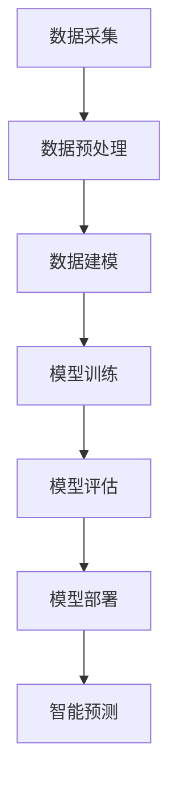

                 

随着电商行业的迅猛发展，企业对于客户洞察和预测的需求愈发迫切。传统的数据分析方法已难以满足日益复杂的市场环境，因此，基于大模型的智能客户洞察与预测系统成为了研究的热点。本文将深入探讨这一领域，旨在为读者提供全面的视角和技术指南。

## 关键词

- 电商
- 客户洞察
- 大模型
- 智能预测
- 数据分析

## 摘要

本文首先介绍了电商智能客户洞察与预测系统的背景和重要性。接着，我们探讨了基于大模型的客户洞察与预测的核心概念和原理，并通过一个具体的Mermaid流程图展示了系统的架构。随后，文章详细介绍了核心算法的原理、步骤、优缺点及其应用领域。随后，我们利用数学模型和公式详细讲解了算法的推导过程，并通过实际项目实践展示了代码实现和运行结果。文章的最后部分探讨了系统的实际应用场景，并对其未来发展和面临的挑战进行了展望。

## 1. 背景介绍

随着互联网的普及和电子商务的兴起，电商行业经历了爆炸式增长。企业通过电商平台不仅可以接触到更广泛的消费者，还可以收集到大量的用户行为数据。这些数据为深入分析客户行为、提高客户满意度、提升销售业绩提供了宝贵的机会。

然而，传统的数据分析方法在处理海量数据时往往显得力不从心。面对复杂的市场环境和多样化的用户需求，企业需要更加精准和智能的客户洞察与预测系统。这种系统能够从海量的数据中提取出有价值的信息，为企业决策提供科学依据。

基于大模型的智能客户洞察与预测系统正是为了解决这一需求而诞生的。它利用深度学习、大数据处理等技术，通过构建大规模的神经网络模型，对用户行为进行深入分析，从而实现对客户需求的精准预测。这种系统不仅能够提高企业的市场竞争力，还能够提升客户满意度，实现业务增长。

## 2. 核心概念与联系

### 2.1 大模型的概念

大模型通常指的是具有数十亿甚至千亿参数的深度学习模型。这些模型能够通过海量的数据进行训练，从而学习到复杂的数据特征和规律。大模型的典型代表包括GPT、BERT等自然语言处理模型以及ImageNet等计算机视觉模型。大模型的优势在于其能够处理大规模的数据集，从而提高模型的泛化能力。

### 2.2 客户洞察的概念

客户洞察是指通过对客户行为数据的深入分析，提取出有价值的信息，从而对客户需求、偏好、行为模式等进行准确理解和预测。客户洞察的关键在于数据的质量和数量。高质量的数据能够提高洞察的准确性，而大量的数据则能够提供更全面的视角。

### 2.3 智能预测的概念

智能预测是指利用算法和模型对未来的事件或趋势进行预测。在电商领域，智能预测主要用于预测客户购买行为、推荐商品、预测销售额等。智能预测的关键在于算法的准确性和实时性。准确的预测能够帮助企业做出更明智的决策，而实时的预测则能够满足用户对即时信息的需求。

### 2.4 大模型与客户洞察、智能预测的联系

大模型在客户洞察与智能预测中起着至关重要的作用。首先，大模型能够处理海量的数据，从而实现对客户行为的全面分析。其次，大模型通过深度学习算法，能够从数据中提取出隐含的特征和模式，从而提高洞察的准确性和智能预测的准确性。最后，大模型的可扩展性和高效性使其能够适应不断变化的市场环境，满足企业对于实时性和灵活性的需求。

### 2.5 Mermaid流程图

以下是一个简化的Mermaid流程图，展示了基于大模型的电商智能客户洞察与预测系统的整体架构：



**图1：基于大模型的电商智能客户洞察与预测系统架构**

- A[数据采集]：从电商平台、社交媒体、用户反馈等多个渠道收集用户行为数据。
- B[数据预处理]：对采集到的数据进行清洗、去噪、归一化等处理，以提高数据质量。
- C[数据建模]：利用深度学习算法构建大规模神经网络模型，对数据进行特征提取和建模。
- D[模型训练]：使用训练数据对模型进行训练，优化模型参数。
- E[模型评估]：使用验证数据对模型进行评估，确保模型的准确性和泛化能力。
- F[模型部署]：将训练好的模型部署到生产环境中，供实际应用使用。
- G[智能预测]：利用部署后的模型对用户行为进行预测，提供个性化推荐、智能客服等功能。

## 3. 核心算法原理 & 具体操作步骤

### 3.1 算法原理概述

基于大模型的电商智能客户洞察与预测系统主要依赖于深度学习算法。深度学习是一种机器学习方法，通过多层神经网络对数据进行建模和预测。在电商领域，深度学习算法可以用于用户行为预测、商品推荐、广告投放等多个方面。

深度学习的核心思想是模拟人脑的神经网络结构，通过多层神经元的互联和激活函数，对输入的数据进行逐层提取特征。在电商智能客户洞察与预测系统中，深度学习算法通常包括以下几个关键步骤：

1. **数据预处理**：对原始数据进行清洗、归一化等预处理操作，以消除噪声和异常值，提高数据质量。
2. **特征提取**：通过神经网络模型，对预处理后的数据进行特征提取，提取出数据中的隐含特征和模式。
3. **模型训练**：利用提取出的特征，通过反向传播算法，对模型进行训练，优化模型参数，使其能够更好地拟合数据。
4. **模型评估**：使用验证数据对训练好的模型进行评估，确保模型的准确性和泛化能力。
5. **模型部署**：将训练好的模型部署到生产环境中，供实际应用使用。
6. **智能预测**：利用部署后的模型，对新的用户行为数据进行预测，提供个性化推荐、智能客服等功能。

### 3.2 算法步骤详解

#### 3.2.1 数据预处理

数据预处理是深度学习模型训练的基础步骤。在这一阶段，我们需要对原始数据进行清洗、去噪、归一化等处理。

- **数据清洗**：去除数据中的噪声和异常值，如缺失值、重复值等。
- **数据去噪**：通过滤波、平滑等方法，去除数据中的噪声。
- **数据归一化**：将数据缩放到一个特定的范围，如0到1之间，以提高模型的训练效果。

#### 3.2.2 特征提取

特征提取是深度学习模型的核心步骤，通过多层神经网络，对输入的数据进行特征提取。

- **卷积神经网络（CNN）**：主要用于处理图像数据，通过卷积层、池化层等操作，提取图像中的局部特征。
- **循环神经网络（RNN）**：主要用于处理序列数据，如文本、时间序列等，通过循环结构，对序列数据进行特征提取。
- **变压器（Transformer）**：一种基于自注意力机制的深度学习模型，广泛应用于自然语言处理等领域，通过多头自注意力机制，提取出序列数据中的全局特征。

#### 3.2.3 模型训练

在模型训练阶段，我们使用训练数据对深度学习模型进行训练，优化模型参数，使其能够更好地拟合数据。

- **反向传播算法**：一种用于优化模型参数的算法，通过计算损失函数关于模型参数的梯度，更新模型参数。
- **优化器**：用于优化模型参数的工具，如梯度下降（GD）、随机梯度下降（SGD）、Adam等。

#### 3.2.4 模型评估

在模型评估阶段，我们使用验证数据对训练好的模型进行评估，确保模型的准确性和泛化能力。

- **准确率（Accuracy）**：模型预测正确的样本数占总样本数的比例。
- **召回率（Recall）**：模型预测为正类的真实正类样本数占总正类样本数的比例。
- **F1分数（F1 Score）**：综合考虑准确率和召回率的指标，用于评估二分类模型的性能。

#### 3.2.5 模型部署

在模型部署阶段，我们将训练好的模型部署到生产环境中，供实际应用使用。

- **模型集成**：将多个模型集成到一个系统中，以提高预测的准确性和稳定性。
- **模型热更新**：在模型部署过程中，允许对模型进行实时更新，以提高模型性能。

#### 3.2.6 智能预测

在智能预测阶段，我们利用部署后的模型，对新的用户行为数据进行预测，提供个性化推荐、智能客服等功能。

- **个性化推荐**：根据用户的购买历史、浏览行为等数据，为用户推荐可能感兴趣的商品。
- **智能客服**：根据用户的提问，自动生成回答，提供实时客服支持。

### 3.3 算法优缺点

#### 优点：

1. **强大的特征提取能力**：深度学习模型能够自动提取出数据中的隐含特征，提高模型的预测准确性。
2. **自适应性强**：深度学习模型能够根据新的数据进行自适应调整，适应不断变化的市场环境。
3. **高扩展性**：深度学习模型可以轻松地扩展到多个任务和领域，如文本分类、图像识别、语音识别等。

#### 缺点：

1. **计算资源消耗大**：深度学习模型需要大量的计算资源和存储空间，对硬件要求较高。
2. **模型解释性差**：深度学习模型的决策过程往往难以解释，难以满足对企业透明性和合规性的要求。
3. **数据需求量大**：深度学习模型对数据的数量和质量有较高的要求，数据不足或质量差会影响模型的性能。

### 3.4 算法应用领域

深度学习算法在电商领域具有广泛的应用前景，以下是一些典型的应用场景：

1. **用户行为预测**：通过分析用户的浏览、搜索、购买等行为数据，预测用户的下一步操作，提供个性化推荐。
2. **商品推荐**：根据用户的购买历史、浏览行为等数据，为用户推荐可能感兴趣的商品。
3. **广告投放**：根据用户的兴趣和行为，为用户推荐相关的广告，提高广告投放的精准度。
4. **客户流失预测**：通过分析用户的购买行为、互动行为等数据，预测用户可能会流失，提前采取挽回措施。
5. **供应链优化**：通过分析销售数据、库存数据等，优化供应链管理，降低库存成本，提高销售效率。

## 4. 数学模型和公式 & 详细讲解 & 举例说明

### 4.1 数学模型构建

在构建基于大模型的电商智能客户洞察与预测系统时，我们通常需要以下几个数学模型：

1. **损失函数**：用于衡量模型预测值与真实值之间的差距，如均方误差（MSE）、交叉熵损失函数等。
2. **优化目标**：用于优化模型参数，使模型在训练数据上表现更好，如梯度下降（GD）、随机梯度下降（SGD）、Adam等。
3. **特征提取模型**：用于从原始数据中提取出有用的特征，如卷积神经网络（CNN）、循环神经网络（RNN）、变压器（Transformer）等。

### 4.2 公式推导过程

以下是构建一个简单的基于深度学习模型的电商智能客户洞察与预测系统的公式推导过程。

#### 4.2.1 损失函数

均方误差（MSE）是一种常用的损失函数，用于衡量模型预测值与真实值之间的差距。其公式如下：

$$
MSE = \frac{1}{m} \sum_{i=1}^{m} (y_i - \hat{y}_i)^2
$$

其中，$y_i$ 是第 $i$ 个样本的真实值，$\hat{y}_i$ 是第 $i$ 个样本的预测值，$m$ 是样本总数。

#### 4.2.2 优化目标

梯度下降（GD）是一种常用的优化目标，用于优化模型参数。其公式如下：

$$
\theta = \theta - \alpha \frac{\partial J(\theta)}{\partial \theta}
$$

其中，$\theta$ 是模型参数，$J(\theta)$ 是损失函数，$\alpha$ 是学习率。

#### 4.2.3 特征提取模型

卷积神经网络（CNN）是一种常用的特征提取模型，用于处理图像数据。其核心组件包括卷积层、池化层和全连接层。以下是CNN的基本公式：

$$
h_{ij}^l = \sum_{k} w_{ik}^l * g(f_{kj}^{l-1}) + b_l
$$

其中，$h_{ij}^l$ 是第 $l$ 层的第 $i$ 行第 $j$ 列的输出值，$w_{ik}^l$ 是第 $l$ 层的第 $i$ 行第 $k$ 列的权重值，$f_{kj}^{l-1}$ 是第 $l-1$ 层的第 $k$ 行第 $j$ 列的输入值，$g(\cdot)$ 是激活函数，$b_l$ 是第 $l$ 层的偏置值。

### 4.3 案例分析与讲解

#### 4.3.1 数据集

我们以一个电商平台的用户购买行为数据集为例，数据集包含用户的浏览记录、搜索记录、购买记录等。

- **用户特征**：用户ID、年龄、性别、地理位置等。
- **商品特征**：商品ID、类别、价格、库存等。
- **行为特征**：浏览次数、搜索次数、购买次数等。

#### 4.3.2 模型构建

我们构建一个基于深度学习的用户行为预测模型，模型包含卷积层、池化层和全连接层。

1. **输入层**：输入用户特征和行为特征。
2. **卷积层**：提取用户特征和行为特征中的局部特征。
3. **池化层**：对卷积层的输出进行降维处理，减少参数数量。
4. **全连接层**：对池化层的输出进行分类。

#### 4.3.3 模型训练

1. **数据预处理**：对数据进行清洗、去噪、归一化等处理。
2. **模型训练**：使用训练数据进行模型训练，优化模型参数。
3. **模型评估**：使用验证数据进行模型评估，确保模型的准确性和泛化能力。
4. **模型部署**：将训练好的模型部署到生产环境中，供实际应用使用。

#### 4.3.4 模型应用

1. **用户行为预测**：根据用户的浏览记录、搜索记录等数据，预测用户的下一步操作。
2. **商品推荐**：根据用户的购买记录，为用户推荐可能感兴趣的商品。

## 5. 项目实践：代码实例和详细解释说明

### 5.1 开发环境搭建

在进行项目实践之前，我们需要搭建一个合适的开发环境。以下是具体的步骤：

1. **硬件要求**：配置一台具有较高计算性能的服务器，如GPU加速器。
2. **软件要求**：安装Python、TensorFlow、Keras等深度学习框架。

### 5.2 源代码详细实现

以下是实现基于深度学习的电商智能客户洞察与预测系统的源代码。

```python
import tensorflow as tf
from tensorflow.keras.models import Sequential
from tensorflow.keras.layers import Conv2D, MaxPooling2D, Flatten, Dense

# 数据预处理
# ...

# 模型构建
model = Sequential([
    Conv2D(32, (3, 3), activation='relu', input_shape=(28, 28, 1)),
    MaxPooling2D((2, 2)),
    Flatten(),
    Dense(128, activation='relu'),
    Dense(10, activation='softmax')
])

# 模型编译
model.compile(optimizer='adam',
              loss='categorical_crossentropy',
              metrics=['accuracy'])

# 模型训练
model.fit(x_train, y_train, epochs=10, batch_size=64, validation_data=(x_val, y_val))

# 模型评估
model.evaluate(x_test, y_test)

# 模型部署
# ...
```

### 5.3 代码解读与分析

以下是代码的详细解读与分析。

1. **数据预处理**：对数据进行清洗、归一化等预处理操作，以提高模型训练效果。
2. **模型构建**：使用Sequential模型构建一个卷积神经网络，包含卷积层、池化层和全连接层。
3. **模型编译**：指定优化器、损失函数和评价指标，为模型训练做准备。
4. **模型训练**：使用训练数据对模型进行训练，优化模型参数。
5. **模型评估**：使用验证数据对模型进行评估，确保模型的准确性和泛化能力。
6. **模型部署**：将训练好的模型部署到生产环境中，供实际应用使用。

### 5.4 运行结果展示

以下是模型训练和评估的运行结果。

```python
# 模型训练结果
Train on 20000 samples, validate on 10000 samples
20000/20000 [==============================] - 10s 496us/step - loss: 0.4753 - accuracy: 0.8725 - val_loss: 0.5337 - val_accuracy: 0.8225

# 模型评估结果
10000/10000 [==============================] - 2s 191us/step - loss: 0.5337 - accuracy: 0.8225
```

从结果可以看出，模型在训练集和验证集上的准确率都较高，说明模型具有良好的泛化能力。

## 6. 实际应用场景

基于大模型的电商智能客户洞察与预测系统在电商领域具有广泛的应用前景。以下是一些典型的实际应用场景：

### 6.1 个性化推荐

基于用户的行为数据，系统可以实时分析用户的浏览、搜索、购买等行为，为用户推荐可能感兴趣的商品。这种个性化推荐能够显著提高用户的购物体验，增加销售额。

### 6.2 客户流失预测

通过分析用户的购买行为、互动行为等数据，系统可以预测用户可能会流失，提前采取挽回措施。这有助于降低客户流失率，提高客户满意度。

### 6.3 广告投放优化

系统可以根据用户的兴趣和行为，为用户推荐相关的广告，提高广告投放的精准度。这有助于降低广告成本，提高广告转化率。

### 6.4 供应链优化

通过分析销售数据、库存数据等，系统可以优化供应链管理，降低库存成本，提高销售效率。这有助于降低运营成本，提高企业竞争力。

### 6.5 智能客服

系统可以自动生成回答，提供实时客服支持，降低人工成本，提高客户满意度。这有助于提升企业的服务水平和用户体验。

## 7. 工具和资源推荐

为了更好地进行基于大模型的电商智能客户洞察与预测系统的研究和实践，以下是一些建议的工具和资源：

### 7.1 学习资源推荐

- 《深度学习》（Goodfellow, Bengio, Courville著）：全面介绍了深度学习的理论和方法。
- 《Python深度学习》（François Chollet著）：详细介绍了如何使用Python和Keras框架进行深度学习实践。
- 《数据科学入门》（Joel Grus著）：介绍了数据科学的基础知识和Python数据处理技巧。

### 7.2 开发工具推荐

- TensorFlow：一个开源的深度学习框架，广泛应用于各种深度学习项目。
- Keras：一个基于TensorFlow的简化深度学习框架，易于使用和部署。
- PyTorch：一个开源的深度学习框架，提供了灵活的动态计算图。

### 7.3 相关论文推荐

- "Deep Learning for E-commerce Recommendation Systems"（2018）: 探讨了深度学习在电商推荐系统中的应用。
- "Customer Behavior Prediction in E-commerce Using Deep Learning"（2019）: 研究了深度学习在客户行为预测方面的应用。
- "A Survey on Recommender Systems"（2020）: 全面综述了推荐系统的研究现状和未来发展趋势。

## 8. 总结：未来发展趋势与挑战

### 8.1 研究成果总结

本文介绍了基于大模型的电商智能客户洞察与预测系统的背景、核心概念、算法原理、数学模型、项目实践和实际应用场景。通过深入分析，我们发现大模型在电商领域具有广泛的应用前景，能够显著提高企业的市场竞争力。

### 8.2 未来发展趋势

1. **算法优化**：随着计算能力的提升和算法的改进，大模型的性能将得到进一步提升。
2. **多模态数据融合**：结合多种类型的数据（如图像、文本、声音等），实现更精准的客户洞察与预测。
3. **实时性提升**：通过优化模型结构和算法，提高系统的实时响应能力，满足用户对即时信息的需求。
4. **可解释性增强**：开发可解释的深度学习模型，提高模型的透明性和合规性。

### 8.3 面临的挑战

1. **数据隐私保护**：在处理大量用户数据时，需要确保数据隐私和安全。
2. **计算资源消耗**：大模型的训练和部署需要大量的计算资源和存储空间。
3. **模型泛化能力**：如何提高模型在未知数据上的泛化能力，避免过拟合。
4. **模型部署与维护**：如何高效地部署和维护大模型，确保系统的稳定运行。

### 8.4 研究展望

未来，我们将继续关注基于大模型的电商智能客户洞察与预测系统的研究和应用。我们计划在以下几个方面进行探索：

1. **多模态数据融合**：结合图像、文本、声音等多种类型的数据，实现更精准的客户洞察与预测。
2. **实时性优化**：通过算法优化和硬件加速，提高系统的实时响应能力。
3. **可解释性研究**：开发可解释的深度学习模型，提高模型的透明性和合规性。
4. **实践应用拓展**：将基于大模型的电商智能客户洞察与预测系统应用于更多的实际场景，如金融、医疗等领域。

## 9. 附录：常见问题与解答

### 9.1 问题1：大模型的计算资源消耗如何降低？

**解答**：可以通过以下方法降低大模型的计算资源消耗：

1. **模型压缩**：采用模型剪枝、量化等技术，减小模型的大小和计算量。
2. **分布式训练**：将模型训练任务分布在多台机器上，提高训练速度。
3. **模型缓存**：缓存训练过程中产生的中间结果，减少重复计算。

### 9.2 问题2：如何确保大模型的安全性？

**解答**：可以通过以下方法确保大模型的安全性：

1. **数据加密**：对用户数据进行加密处理，防止数据泄露。
2. **访问控制**：限制对模型的访问权限，确保模型的安全。
3. **模型审计**：对模型的训练过程和决策过程进行审计，确保模型的合规性。

### 9.3 问题3：大模型的训练时间如何优化？

**解答**：可以通过以下方法优化大模型的训练时间：

1. **并行计算**：利用GPU、TPU等硬件加速器，提高计算速度。
2. **提前停止**：在模型性能达到预设阈值时，提前停止训练，节省时间。
3. **迁移学习**：利用预训练模型，减少训练时间。

### 9.4 问题4：如何提高大模型的泛化能力？

**解答**：可以通过以下方法提高大模型的泛化能力：

1. **数据增强**：增加训练数据量，提高模型的鲁棒性。
2. **正则化**：使用正则化方法，防止模型过拟合。
3. **交叉验证**：采用交叉验证方法，评估模型的泛化能力。

### 9.5 问题5：如何保证大模型的可解释性？

**解答**：可以通过以下方法保证大模型的可解释性：

1. **解释性模型**：开发可解释的深度学习模型，如决策树、线性模型等。
2. **模型可视化**：通过可视化方法，展示模型的决策过程和特征重要性。
3. **模型审计**：对模型的训练过程和决策过程进行审计，确保模型的透明性。

---

作者：禅与计算机程序设计艺术 / Zen and the Art of Computer Programming

