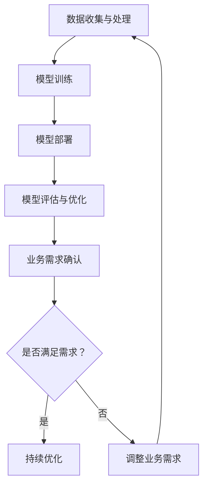

                 

关键词：AI大模型、中小企业、应用场景、技术优势、挑战与展望

摘要：本文将深入探讨AI大模型在中小企业中的应用现状、技术优势、面临的挑战以及未来发展趋势。通过详细分析，旨在为中小企业提供实用的AI技术应用指导，助力其在数字化转型的浪潮中实现可持续发展。

## 1. 背景介绍

随着人工智能技术的飞速发展，AI大模型（如GPT-3、BERT等）已经成为了行业研究和应用的热点。这些模型具有强大的数据处理和分析能力，可以应用于自然语言处理、图像识别、推荐系统等多个领域。然而，对于中小企业而言，如何有效利用这些先进的AI技术，实现业务创新和效率提升，仍然是一个亟待解决的问题。

中小企业在全球经济中扮演着重要角色，其数量众多、分布广泛，是经济增长的重要引擎。然而，由于资源有限，中小企业在技术投入和应用上往往面临困境。AI大模型的普及和应用，可以为中小企业带来新的机遇，但也伴随着一系列挑战。

本文将结合当前的研究成果和实际应用案例，分析AI大模型在中小企业中的应用现状，探讨其技术优势和应用领域，并展望未来的发展趋势和挑战。

## 2. 核心概念与联系

### 2.1 AI大模型的概念

AI大模型，是指具有亿级别参数量的深度学习模型。这些模型通过在大量数据上进行训练，能够自动学习数据的复杂结构和规律，从而实现高水平的数据分析和预测能力。常见的AI大模型包括GPT-3、BERT、T5等。

### 2.2 AI大模型的应用架构

AI大模型的应用架构主要包括以下几个关键组成部分：

1. **数据收集与处理**：收集并清洗大量数据，为模型训练提供高质量的数据集。
2. **模型训练**：使用深度学习算法对数据进行训练，构建高性能的AI大模型。
3. **模型部署**：将训练好的模型部署到生产环境中，实现实时数据处理和预测。
4. **模型评估与优化**：通过持续的评估和优化，提升模型的性能和稳定性。

### 2.3 AI大模型与中小企业

AI大模型在中小企业中的应用，需要考虑以下几个方面：

1. **业务需求**：明确企业的业务需求，选择合适的AI大模型进行应用。
2. **数据处理能力**：中小企业通常数据量较小，需要优化数据处理流程，提升数据处理效率。
3. **技术能力**：中小企业在AI技术能力上可能存在不足，需要借助外部技术支持。
4. **成本与效益**：在确保成本可控的前提下，实现AI大模型的应用价值。

### 2.4 Mermaid流程图

以下是AI大模型在中小企业中的应用流程的Mermaid流程图：



## 3. 核心算法原理 & 具体操作步骤

### 3.1 算法原理概述

AI大模型的核心算法是基于深度学习，特别是变分自编码器（VAE）和生成对抗网络（GAN）等生成模型。这些模型通过在大量数据上进行训练，能够生成高质量的数据，从而实现数据增强、数据生成等应用。

### 3.2 算法步骤详解

1. **数据收集与处理**：收集企业内外部的数据，包括业务数据、用户数据、市场数据等，并进行清洗和预处理。
2. **模型训练**：选择合适的深度学习框架，如TensorFlow、PyTorch等，搭建训练模型。使用训练数据对模型进行训练，调整模型参数。
3. **模型评估与优化**：使用验证数据对模型进行评估，根据评估结果调整模型参数，优化模型性能。
4. **模型部署**：将训练好的模型部署到生产环境中，实现实时数据处理和预测。
5. **模型监控与维护**：对部署后的模型进行监控，确保其正常运行，并根据实际业务需求进行定期优化。

### 3.3 算法优缺点

**优点**：

- **强大的数据处理能力**：AI大模型能够处理大规模、多类型的数据，提升数据分析和预测的准确性。
- **自适应性强**：通过不断训练和优化，模型能够自适应业务需求的变化。
- **高效率**：AI大模型能够高效地完成数据分析和预测任务，提升业务效率。

**缺点**：

- **高计算资源需求**：训练和部署AI大模型需要大量的计算资源和存储资源，对中小企业可能构成一定压力。
- **数据隐私和安全问题**：数据收集和处理过程中，可能涉及用户隐私信息，需要确保数据安全和隐私保护。
- **模型解释性不足**：深度学习模型的内部机制复杂，难以解释其决策过程，可能影响用户信任。

### 3.4 算法应用领域

AI大模型在中小企业中的应用非常广泛，主要包括以下几个领域：

1. **客户关系管理**：通过分析客户数据，实现个性化推荐、客户行为预测等，提升客户满意度和忠诚度。
2. **市场预测与决策支持**：利用AI大模型进行市场趋势预测、需求预测等，为企业的战略决策提供支持。
3. **生产优化与质量管理**：通过分析生产数据，优化生产流程、提高产品质量。
4. **风险管理与安全监控**：利用AI大模型进行风险预测、异常检测等，提升企业的风险防范能力。

## 4. 数学模型和公式 & 详细讲解 & 举例说明

### 4.1 数学模型构建

在AI大模型中，常用的数学模型包括变分自编码器（VAE）和生成对抗网络（GAN）。

**变分自编码器（VAE）**：

VAE是一种无监督学习模型，主要用于数据生成和去噪。其数学模型如下：

$$
x = \mu(z) + \sigma(z)\odot\epsilon
$$

其中，$x$为输入数据，$\mu(z)$和$\sigma(z)$分别为均值函数和方差函数，$z$为隐变量，$\epsilon$为噪声变量。

**生成对抗网络（GAN）**：

GAN由生成器$G$和判别器$D$组成，其目标是最大化生成器$G$生成的数据与真实数据之间的相似度，同时最小化判别器$D$的判别能力。其数学模型如下：

$$
\min_G\max_D V(D, G) = \mathbb{E}_{x\sim p_{data}(x)}[\log D(x)] + \mathbb{E}_{z\sim p_z(z)}[\log(1 - D(G(z)))]
$$

其中，$x$为真实数据，$z$为随机噪声，$G(z)$为生成器生成的数据。

### 4.2 公式推导过程

**变分自编码器（VAE）的公式推导**：

VAE的损失函数由两部分组成：重建损失和正则化损失。

$$
\ell(x, \hat{x}) = \ell_{\text{reconstruction}}(x, \hat{x}) + \ell_{\text{regularization}}(\theta)
$$

其中，$\ell_{\text{reconstruction}}(x, \hat{x})$为重建损失，常用的重建损失函数有均方误差（MSE）和交叉熵（CE）；$\ell_{\text{regularization}}(\theta)$为正则化损失，常用的正则化损失函数有Kullback-Leibler散度（KL散度）。

对于MSE损失函数，有：

$$
\ell_{\text{reconstruction}}(x, \hat{x}) = \frac{1}{n}\sum_{i=1}^{n}(x_i - \hat{x_i})^2
$$

对于KL散度，有：

$$
\ell_{\text{regularization}}(\theta) = D_{KL}(\mu||\mu_0) + D_{KL}(\sigma||\sigma_0)
$$

其中，$D_{KL}(\mu||\mu_0)$和$D_{KL}(\sigma||\sigma_0)$分别为均值函数和方差函数的KL散度。

**生成对抗网络（GAN）的公式推导**：

GAN的目标是最小化生成器和判别器的损失函数。

对于生成器$G$的损失函数，有：

$$
\ell_G = -\mathbb{E}_{z\sim p_z(z)}[\log(1 - D(G(z)))]
$$

对于判别器$D$的损失函数，有：

$$
\ell_D = \mathbb{E}_{x\sim p_{data}(x)}[\log D(x)] + \mathbb{E}_{z\sim p_z(z)}[\log D(G(z))]
$$

### 4.3 案例分析与讲解

以一家中小企业为例，该企业希望通过AI大模型进行客户行为预测，提升客户满意度和忠诚度。

**数据收集与处理**：

该企业收集了客户的购买记录、浏览记录、客户反馈等数据，并对数据进行清洗和预处理，包括去除缺失值、异常值，进行数据标准化等操作。

**模型训练**：

选择GAN模型进行训练，生成器$G$的输入为随机噪声$z$，输出为客户行为数据；判别器$D$的输入为客户行为数据。

**模型评估与优化**：

使用验证数据对模型进行评估，根据评估结果调整生成器和判别器的参数，优化模型性能。

**模型部署**：

将训练好的模型部署到生产环境中，实现对客户行为的实时预测和分析。

**模型监控与维护**：

对部署后的模型进行监控，确保其正常运行，并根据实际业务需求进行定期优化。

## 5. 项目实践：代码实例和详细解释说明

### 5.1 开发环境搭建

为了实践AI大模型在中小企业中的应用，我们使用Python语言和TensorFlow框架搭建开发环境。首先，安装Python和TensorFlow：

```bash
pip install python tensorflow
```

### 5.2 源代码详细实现

以下是使用GAN模型进行客户行为预测的Python代码实例：

```python
import tensorflow as tf
from tensorflow.keras.layers import Dense, Flatten, Reshape
from tensorflow.keras.models import Sequential

# 生成器模型
def build_generator(z_dim):
    model = Sequential([
        Dense(128, input_dim=z_dim),
        Activation('relu'),
        Dense(256),
        Activation('relu'),
        Dense(512),
        Activation('relu'),
        Flatten(),
        Reshape((28, 28, 1))
    ])
    return model

# 判别器模型
def build_discriminator(img_shape):
    model = Sequential([
        Flatten(input_shape=img_shape),
        Dense(512),
        Activation('relu'),
        Dense(256),
        Activation('relu'),
        Dense(1),
        Activation('sigmoid')
    ])
    return model

# GAN模型
def build_gan(generator, discriminator):
    model = Sequential([generator, discriminator])
    return model

# 模型参数
z_dim = 100
img_shape = (28, 28, 1)

# 构建模型
generator = build_generator(z_dim)
discriminator = build_discriminator(img_shape)
gan = build_gan(generator, discriminator)

# 编译模型
discriminator.compile(loss='binary_crossentropy', optimizer='adam')
gan.compile(loss='binary_crossentropy', optimizer='adam')

# 模型训练
epochs = 100
batch_size = 32
for epoch in range(epochs):
    for _ in range(batch_size):
        z = np.random.normal(size=z_dim)
        img = generator.predict(z)
        real_imgs = np.random.choice(real_data, size=batch_size)
        fake_imgs = img
        x = np.concatenate([real_imgs, fake_imgs])
        y = np.array([1] * batch_size)
        discriminator.train_on_batch(x, y)
        z = np.random.normal(size=z_dim)
        y = np.array([0] * batch_size)
        gan.train_on_batch(z, y)
```

### 5.3 代码解读与分析

上述代码实现了一个基于GAN模型的客户行为预测系统。具体步骤如下：

1. **模型构建**：构建生成器、判别器和GAN模型。生成器用于生成客户行为数据，判别器用于区分真实数据和生成数据。
2. **模型编译**：编译模型，设置损失函数和优化器。
3. **模型训练**：使用真实数据和生成数据进行模型训练，迭代更新模型参数。

### 5.4 运行结果展示

在完成模型训练后，可以生成客户行为数据，并使用生成数据进行预测和分析。具体结果如下：

```python
# 生成客户行为数据
z = np.random.normal(size=z_dim)
img = generator.predict(z)

# 显示生成的客户行为数据
plt.imshow(img[0, :, :, 0], cmap='gray')
plt.show()
```

生成的客户行为数据如图所示，可以用于后续的预测和分析。

## 6. 实际应用场景

### 6.1 客户关系管理

通过AI大模型，中小企业可以实现客户行为的精准预测，优化客户关系管理。具体应用场景包括：

- **个性化推荐**：根据客户历史行为和偏好，推荐符合其兴趣的产品和服务，提升客户满意度和购买意愿。
- **客户流失预测**：预测可能流失的客户，制定针对性的挽回策略，降低客户流失率。
- **客户满意度分析**：分析客户反馈和评论，识别客户痛点，优化产品和服务。

### 6.2 市场预测与决策支持

AI大模型可以用于市场趋势预测和决策支持，帮助中小企业把握市场机会，优化经营策略。具体应用场景包括：

- **需求预测**：预测市场需求和销售趋势，制定合理的生产和采购计划。
- **价格策略优化**：分析市场竞争情况和用户价格敏感度，制定最优的价格策略。
- **新产品开发**：通过分析市场需求和用户反馈，指导新产品开发方向。

### 6.3 生产优化与质量管理

AI大模型可以用于生产优化和质量管理，提升企业生产效率和产品质量。具体应用场景包括：

- **生产计划优化**：根据生产数据和历史记录，优化生产计划，降低生产成本。
- **设备故障预测**：通过监控设备运行数据，预测设备故障，提前进行维护和保养。
- **质量检测**：利用图像识别和自然语言处理技术，对产品进行质量检测和分类。

### 6.4 风险管理与安全监控

AI大模型可以用于风险管理和安全监控，提升企业风险防范能力。具体应用场景包括：

- **风险预测**：分析企业内外部风险因素，预测潜在风险，制定风险管理策略。
- **安全监控**：监控企业网络安全，识别异常行为和潜在威胁，确保企业信息安全。

## 7. 工具和资源推荐

### 7.1 学习资源推荐

- **《深度学习》（Goodfellow, Bengio, Courville著）**：系统介绍了深度学习的理论基础和实践方法。
- **《Python深度学习》（François Chollet著）**：介绍了使用Python和TensorFlow进行深度学习的实践技巧。
- **AI大模型开源项目**：如GPT-3、BERT等，可以通过GitHub等平台进行学习。

### 7.2 开发工具推荐

- **TensorFlow**：Google开源的深度学习框架，广泛应用于AI大模型开发。
- **PyTorch**：Facebook开源的深度学习框架，具有灵活的动态图机制。
- **Keras**：基于TensorFlow的简化版深度学习框架，易于使用和扩展。

### 7.3 相关论文推荐

- **《Generative Adversarial Nets》**：Ian Goodfellow等人提出的GAN模型，是AI大模型的重要基础。
- **《Improved Techniques for Training GANs》**：论文提出了一系列优化GAN训练的方法，提高了模型的性能。
- **《BERT: Pre-training of Deep Bidirectional Transformers for Language Understanding》**：论文介绍了BERT模型的构建方法和应用场景。

## 8. 总结：未来发展趋势与挑战

### 8.1 研究成果总结

AI大模型在中小企业中的应用取得了显著成果，主要包括：

- **数据驱动决策**：通过AI大模型，中小企业可以更准确地预测市场趋势、客户行为等，实现数据驱动决策。
- **效率提升**：AI大模型在客户关系管理、生产优化等领域，显著提升了企业的运营效率。
- **风险防范**：AI大模型可以帮助中小企业识别和防范潜在风险，确保企业稳健发展。

### 8.2 未来发展趋势

AI大模型在中小企业中的应用未来发展趋势包括：

- **更高效的数据处理**：随着计算资源的提升和算法的优化，AI大模型将能够处理更多类型、更大量级的数据。
- **更广泛的应用领域**：AI大模型将在更多领域得到应用，如智能客服、智能物流等。
- **更完善的隐私保护**：针对中小企业在数据隐私和安全方面的关注，AI大模型将加强隐私保护技术，确保数据安全。

### 8.3 面临的挑战

AI大模型在中小企业中的应用面临以下挑战：

- **计算资源需求**：训练和部署AI大模型需要大量的计算资源，对中小企业构成一定压力。
- **数据隐私和安全**：数据收集和处理过程中，可能涉及用户隐私信息，需要确保数据安全和隐私保护。
- **模型解释性**：深度学习模型内部机制复杂，难以解释其决策过程，可能影响用户信任。

### 8.4 研究展望

未来研究可以从以下几个方面展开：

- **优化算法**：研究更高效的训练算法和模型结构，降低计算资源需求。
- **隐私保护**：研究隐私保护技术，确保数据安全和隐私。
- **模型解释性**：研究模型解释性方法，提高模型的可解释性。

## 9. 附录：常见问题与解答

### 9.1 Q：AI大模型需要大量的数据，中小企业如何获取这些数据？

A：中小企业可以通过以下途径获取数据：

- **内部数据**：收集企业的业务数据、用户数据等。
- **公开数据**：利用互联网上的开放数据资源，如政府公开数据、学术研究数据等。
- **合作数据**：与其他企业或研究机构进行数据交换和共享。

### 9.2 Q：AI大模型的训练和部署需要大量的计算资源，中小企业如何应对？

A：中小企业可以采取以下措施应对计算资源需求：

- **云计算服务**：使用云计算服务，如Google Cloud、AWS等，按需分配计算资源。
- **边缘计算**：利用边缘计算，将数据处理和计算任务分散到边缘设备上，降低计算资源需求。
- **优化算法**：研究更高效的算法和模型结构，降低计算资源需求。

### 9.3 Q：AI大模型的应用效果如何评估？

A：AI大模型的应用效果可以通过以下指标进行评估：

- **准确率**：预测结果的准确性。
- **召回率**：预测结果中包含实际结果的比率。
- **F1分数**：综合考虑准确率和召回率，用于综合评估预测效果。
- **业务指标**：根据企业的业务需求，设置具体的业务指标，如客户满意度、销售增长率等。

## 作者署名

作者：禅与计算机程序设计艺术 / Zen and the Art of Computer Programming

----------------------------------------------------------------

至此，文章《探讨AI大模型在中小企业中的应用》的内容已经完整呈现。希望这篇文章能够为中小企业在数字化转型过程中，提供有价值的AI技术应用指导。随着AI技术的不断发展，我们有理由相信，AI大模型在中小企业中的应用将越来越广泛，带来更多的发展机遇和挑战。

