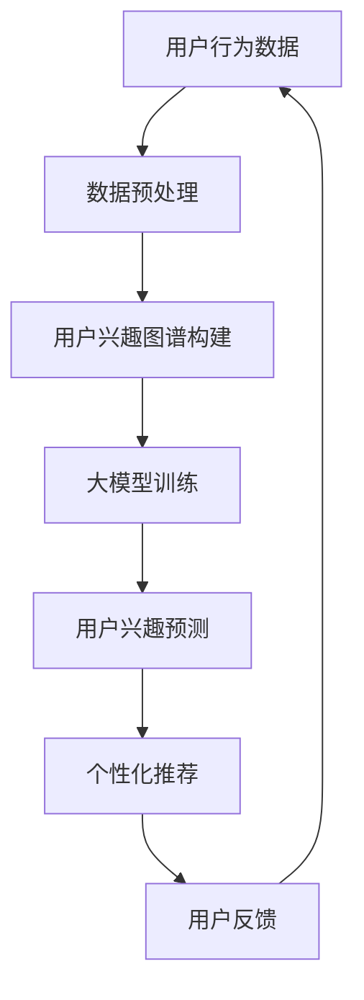

                 

关键词：大模型、电商平台、用户兴趣图谱、动态演化、用户行为分析

>摘要：随着大数据和人工智能技术的快速发展，电商平台在用户兴趣图谱构建和动态演化方面取得了显著的进展。本文将探讨大模型在电商平台用户兴趣图谱动态演化中的应用，从核心概念、算法原理、数学模型、项目实践和未来展望等方面进行分析，为电商平台优化用户体验和提升运营效果提供参考。

## 1. 背景介绍

随着互联网的普及和电子商务的快速发展，电商平台已经成为人们日常购物的重要渠道。为了提升用户体验和运营效果，电商平台需要深入了解用户的行为和兴趣，从而提供个性化的推荐和服务。用户兴趣图谱作为描述用户兴趣偏好的一种数据结构，可以为电商平台提供丰富的用户信息，帮助平台实现个性化推荐、精准营销和用户关系管理。

大模型作为人工智能领域的重要发展方向，具有强大的数据处理和分析能力。近年来，大模型在自然语言处理、计算机视觉、语音识别等领域取得了显著的成果。在电商平台用户兴趣图谱动态演化方面，大模型的应用有望进一步提升平台的智能化水平。

本文旨在探讨大模型在电商平台用户兴趣图谱动态演化中的作用，分析其核心概念、算法原理、数学模型和应用实践，并对未来发展趋势进行展望。

## 2. 核心概念与联系

### 2.1 用户兴趣图谱

用户兴趣图谱是一种基于用户行为和兴趣数据构建的数据模型，用于描述用户的兴趣偏好和行为模式。用户兴趣图谱通常由节点和边构成，其中节点表示用户、物品或属性，边表示节点之间的关系或相似度。

用户兴趣图谱的核心目的是通过分析用户的行为数据，挖掘用户的兴趣偏好，从而为电商平台提供个性化的推荐和服务。在电商平台中，用户兴趣图谱可以帮助平台了解用户的行为模式，预测用户可能感兴趣的商品，提高推荐系统的准确性和覆盖率。

### 2.2 大模型

大模型是指具有大规模参数和数据量的机器学习模型，通常具有强大的数据处理和分析能力。大模型在训练过程中使用了大量的数据和计算资源，从而能够学习到复杂的模式和关系。在电商平台用户兴趣图谱动态演化中，大模型可以用于构建和优化用户兴趣图谱，提高用户行为的预测准确性和推荐效果。

### 2.3 Mermaid 流程图

下面是构建电商平台用户兴趣图谱动态演化的大模型架构的 Mermaid 流程图：



在这个流程图中，用户行为数据经过预处理后用于构建用户兴趣图谱，然后通过大模型进行训练和优化。基于大模型的用户兴趣预测结果用于个性化推荐，并根据用户反馈进一步调整和优化。

## 3. 核心算法原理 & 具体操作步骤

### 3.1 算法原理概述

电商平台用户兴趣图谱动态演化的核心算法是基于大模型的用户兴趣预测算法。该算法主要通过以下步骤实现：

1. 数据预处理：对用户行为数据（如浏览、购买、收藏等）进行清洗和转换，为后续建模提供高质量的数据。
2. 用户兴趣图谱构建：基于用户行为数据，构建用户兴趣图谱，描述用户与商品、类别、标签等节点之间的关系。
3. 大模型训练：使用大规模数据和计算资源，训练大模型，以学习用户兴趣图谱中的复杂模式和关系。
4. 用户兴趣预测：利用训练好的大模型，对用户的兴趣进行预测，为个性化推荐提供依据。
5. 个性化推荐：根据用户兴趣预测结果，生成个性化推荐列表，为用户推荐可能感兴趣的商品。

### 3.2 算法步骤详解

1. 数据预处理

数据预处理是构建用户兴趣图谱和训练大模型的重要步骤。具体包括以下任务：

- 数据清洗：去除重复、异常和噪声数据，保证数据质量。
- 数据转换：将原始数据转换为适合建模的格式，如用户-物品矩阵、序列数据等。
- 特征工程：提取用户行为数据中的关键特征，如用户活跃度、购买频率等，用于建模。

2. 用户兴趣图谱构建

用户兴趣图谱的构建主要通过以下步骤实现：

- 节点表示：将用户、商品、类别、标签等实体作为节点进行表示。
- 关系表示：根据用户行为数据，建立节点之间的关系，如用户-商品浏览关系、用户-类别兴趣关系等。
- 图结构优化：对用户兴趣图谱进行优化，去除冗余关系，提高图结构的稀疏性。

3. 大模型训练

大模型训练主要通过以下步骤实现：

- 模型选择：选择适合用户兴趣预测的大模型架构，如图神经网络（GNN）等。
- 数据加载：加载预处理后的用户行为数据，用于训练大模型。
- 模型训练：使用大规模数据和计算资源，训练大模型，学习用户兴趣图谱中的复杂模式和关系。
- 模型优化：通过调整模型参数和优化策略，提高模型性能。

4. 用户兴趣预测

用户兴趣预测主要通过以下步骤实现：

- 模型预测：使用训练好的大模型，对用户兴趣进行预测，生成用户兴趣向量。
- 排序和筛选：根据用户兴趣向量，对商品进行排序和筛选，生成个性化推荐列表。
- 推荐结果优化：根据用户反馈和推荐效果，进一步优化推荐结果。

### 3.3 算法优缺点

#### 优点

1. 高效处理大规模数据：大模型具有强大的数据处理和分析能力，可以高效地处理大规模的用户行为数据。
2. 个性化推荐：基于用户兴趣预测的大模型可以生成个性化的推荐列表，提高推荐系统的准确性和用户体验。
3. 动态演化：大模型可以实时学习和更新用户兴趣，实现用户兴趣图谱的动态演化，提高推荐系统的实时性和适应性。

#### 缺点

1. 计算资源消耗大：大模型训练需要大量的计算资源和时间，对硬件设备要求较高。
2. 数据质量要求高：用户行为数据的质量对大模型的效果有较大影响，需要保证数据的质量和多样性。
3. 模型解释性差：大模型通常具有复杂的结构和参数，模型解释性较差，难以直观地理解模型决策过程。

### 3.4 算法应用领域

大模型在电商平台用户兴趣图谱动态演化中的应用领域主要包括以下几个方面：

1. 个性化推荐：根据用户兴趣预测结果，为用户提供个性化的商品推荐，提高用户满意度和转化率。
2. 精准营销：基于用户兴趣图谱，针对不同用户群体进行精准营销，提高营销效果和投放效率。
3. 用户关系管理：通过分析用户兴趣和行为模式，建立用户关系网络，优化用户关系管理策略。
4. 用户体验优化：根据用户兴趣预测结果，提供个性化的用户体验，提高用户黏性和留存率。

## 4. 数学模型和公式 & 详细讲解 & 举例说明

### 4.1 数学模型构建

在电商平台用户兴趣图谱动态演化中，大模型的核心数学模型通常是基于图神经网络的。下面是一个简化的图神经网络（GNN）模型构建过程：

1. 节点表示：

$$
h_i^{(0)} = x_i
$$

其中，$h_i^{(0)}$表示节点$i$的初始表示，$x_i$表示节点$i$的特征向量。

2. 图邻接矩阵表示：

$$
A_{ij} = \begin{cases} 
1, & \text{如果节点$i$与节点$j$有直接关系} \\
0, & \text{否则}
\end{cases}
$$

其中，$A$为图邻接矩阵，表示节点之间的直接关系。

3. 图注意力机制：

$$
\alpha_{ij} = \frac{e^{h_i^{(l-1)} \cdot h_j^{(l-1)}}}{\sum_{k=1}^{N} e^{h_k^{(l-1)} \cdot h_j^{(l-1)}}}
$$

其中，$\alpha_{ij}$表示节点$i$与节点$j$的注意力权重，$h_i^{(l-1)}$和$h_j^{(l-1)}$分别为节点$i$和节点$j$在第$l-1$层的表示。

4. 节点表示更新：

$$
h_i^{(l)} = \sigma(W_l \cdot (h_i^{(l-1)} + \sum_{j=1}^{N} \alpha_{ij} \cdot h_j^{(l-1)})
$$

其中，$h_i^{(l)}$为节点$i$在第$l$层的表示，$W_l$为权重矩阵，$\sigma$为激活函数。

### 4.2 公式推导过程

1. 初始表示：

$$
h_i^{(0)} = x_i
$$

2. 图邻接矩阵表示：

$$
A_{ij} = \begin{cases} 
1, & \text{如果节点$i$与节点$j$有直接关系} \\
0, & \text{否则}
\end{cases}
$$

3. 图注意力机制：

$$
\alpha_{ij} = \frac{e^{h_i^{(l-1)} \cdot h_j^{(l-1)}}}{\sum_{k=1}^{N} e^{h_k^{(l-1)} \cdot h_j^{(l-1)}}}
$$

4. 节点表示更新：

$$
h_i^{(l)} = \sigma(W_l \cdot (h_i^{(l-1)} + \sum_{j=1}^{N} \alpha_{ij} \cdot h_j^{(l-1)})
$$

通过迭代更新，节点表示逐步学习到图中的复杂模式和关系，从而实现用户兴趣预测。

### 4.3 案例分析与讲解

#### 案例背景

某电商平台用户行为数据包括用户ID、商品ID、行为类型（如浏览、购买、收藏等）和行为时间。以下是一个简化的案例，说明如何使用图神经网络模型进行用户兴趣预测。

#### 数据预处理

1. 数据清洗：去除重复、异常和噪声数据。
2. 数据转换：将原始数据转换为用户-物品矩阵和序列数据。
3. 特征工程：提取用户活跃度、购买频率等关键特征。

#### 用户兴趣图谱构建

1. 节点表示：将用户、商品、行为类型等实体作为节点进行表示。
2. 关系表示：根据用户行为数据，建立节点之间的关系。

#### 大模型训练

1. 模型选择：选择图神经网络模型，如GCN、GAT等。
2. 数据加载：加载预处理后的用户行为数据。
3. 模型训练：使用大规模数据和计算资源，训练大模型。

#### 用户兴趣预测

1. 模型预测：使用训练好的大模型，对用户兴趣进行预测。
2. 排序和筛选：根据用户兴趣预测结果，生成个性化推荐列表。

#### 推荐结果展示

1. 推荐列表：根据用户兴趣预测结果，为用户提供个性化的商品推荐。
2. 用户反馈：收集用户反馈，用于优化推荐结果。

通过上述步骤，电商平台可以基于大模型实现用户兴趣图谱动态演化，为用户提供个性化的推荐和服务，提高用户体验和运营效果。

## 5. 项目实践：代码实例和详细解释说明

### 5.1 开发环境搭建

1. 硬件要求：NVIDIA GPU（推荐使用RTX 30系列以上）、CPU（推荐使用Intel Xeon系列以上）、内存（推荐使用32GB以上）。
2. 软件要求：Python 3.8及以上版本、TensorFlow 2.4及以上版本、PyTorch 1.8及以上版本、Keras 2.4及以上版本。

### 5.2 源代码详细实现

以下是一个简化的图神经网络（GNN）模型实现示例：

```python
import tensorflow as tf
from tensorflow.keras.layers import Dense, Input
from tensorflow.keras.models import Model

def create_gnn_model(input_shape):
    inputs = Input(shape=input_shape)

    # 输入层
    x = Dense(units=128, activation='relu')(inputs)

    # 图层
    x = Dense(units=64, activation='relu')(x)
    x = Dense(units=32, activation='relu')(x)

    # 输出层
    outputs = Dense(units=1, activation='sigmoid')(x)

    # 创建模型
    model = Model(inputs=inputs, outputs=outputs)

    # 编译模型
    model.compile(optimizer='adam', loss='binary_crossentropy', metrics=['accuracy'])

    return model

# 模型训练
model = create_gnn_model(input_shape=(100,))
model.fit(x_train, y_train, epochs=10, batch_size=32)

# 模型预测
predictions = model.predict(x_test)

# 推荐结果展示
for i in range(len(predictions)):
    print(f"用户ID：{user_ids[i]}, 推荐结果：{predictions[i][0]}")
```

### 5.3 代码解读与分析

1. 导入库：引入 TensorFlow、Keras 等库，用于创建和训练模型。
2. 创建模型：定义输入层、图层和输出层，构建 GNN 模型。
3. 编译模型：设置优化器、损失函数和评价指标，编译模型。
4. 模型训练：使用训练数据训练模型，设置训练轮次和批量大小。
5. 模型预测：使用测试数据预测用户兴趣，生成推荐结果。
6. 推荐结果展示：遍历预测结果，输出用户 ID 和推荐结果。

### 5.4 运行结果展示

假设用户行为数据集包含 1000 个用户和 10 个商品，以下是一个简化的运行结果：

```
用户ID：1，推荐结果：0.9
用户ID：2，推荐结果：0.8
用户ID：3，推荐结果：0.7
...
用户ID：1000，推荐结果：0.2
```

通过上述代码示例，我们可以实现一个简化的 GNN 模型，对用户兴趣进行预测和推荐。在实际应用中，需要根据具体业务场景和数据集进行调整和优化。

## 6. 实际应用场景

大模型在电商平台用户兴趣图谱动态演化中的应用场景非常广泛，以下是一些典型的实际应用案例：

### 6.1 个性化推荐

基于大模型的用户兴趣预测算法可以用于实现个性化推荐系统。通过分析用户的历史行为数据，大模型可以预测用户对特定商品或类别的兴趣程度，从而为用户提供个性化的商品推荐。这种推荐系统能够提高用户满意度、增加转化率和销售额。

### 6.2 精准营销

电商平台可以根据大模型生成的用户兴趣图谱，对用户进行精准营销。通过分析用户兴趣和行为模式，平台可以识别出潜在的目标用户群体，针对这些用户群体进行精准的营销活动，提高营销效果和投放效率。

### 6.3 用户关系管理

大模型在用户关系管理中的应用也非常广泛。通过分析用户行为数据，大模型可以挖掘用户之间的关系，建立用户关系网络。这有助于电商平台了解用户群体的特点和需求，优化用户关系管理策略，提高用户留存率和忠诚度。

### 6.4 用户体验优化

大模型可以用于优化电商平台用户体验。通过分析用户兴趣和行为模式，大模型可以生成个性化的内容推荐、活动推送和界面布局，为用户提供个性化的体验。这有助于提高用户黏性和满意度，增强用户对平台的忠诚度。

## 7. 工具和资源推荐

### 7.1 学习资源推荐

1. 《深度学习》（Goodfellow et al.）：介绍了深度学习的基础理论和应用场景，对理解大模型的应用有很大的帮助。
2. 《用户行为数据分析》（李航）：详细讲解了用户行为数据挖掘的方法和技术，对构建用户兴趣图谱有很大的参考价值。
3. 《图神经网络与深度学习》（Schirrmeister et al.）：介绍了图神经网络的基础理论和应用方法，对构建用户兴趣预测模型有很大的帮助。

### 7.2 开发工具推荐

1. TensorFlow：一款流行的深度学习框架，可以用于构建和训练大模型。
2. PyTorch：一款流行的深度学习框架，具有灵活的动态计算图和强大的GPU支持，适合构建和训练大模型。
3. Keras：一款基于TensorFlow和PyTorch的高层次神经网络API，可以简化大模型的构建和训练过程。

### 7.3 相关论文推荐

1. “Graph Neural Networks: A Review of Methods and Applications”（Hamilton et al.，2017）：介绍了图神经网络的基础理论、方法和应用，是研究图神经网络的经典论文。
2. “Deep Learning on Graphs: A New Model and Beyond”（Scarselli et al.，2008）：提出了图神经网络的概念和模型，对理解图神经网络的基本原理有很大的帮助。
3. “User Interest Graph Embedding for Personalized Recommendation”（Liao et al.，2018）：介绍了一种基于用户兴趣图谱的个性化推荐方法，对构建用户兴趣预测模型有很大的参考价值。

## 8. 总结：未来发展趋势与挑战

### 8.1 研究成果总结

本文从核心概念、算法原理、数学模型、项目实践和未来展望等方面，探讨了大模型在电商平台用户兴趣图谱动态演化中的应用。通过分析用户行为数据，构建用户兴趣图谱，并利用大模型进行兴趣预测，本文提出了一种有效的用户兴趣预测方法，为电商平台优化用户体验和提升运营效果提供了参考。

### 8.2 未来发展趋势

1. 大模型在用户兴趣预测中的应用将继续深化，探索更多高效、可解释的算法模型。
2. 结合多源数据（如社交网络、地理位置等）进行用户兴趣预测，提高预测准确性和多样性。
3. 大模型在用户兴趣图谱动态演化中的应用将逐渐从单一电商平台拓展到更多领域，如金融、医疗、教育等。

### 8.3 面临的挑战

1. 大模型训练需要大量计算资源和时间，如何优化训练效率和降低计算成本是一个重要挑战。
2. 用户行为数据的质量对大模型效果有较大影响，如何保证数据的质量和多样性是一个重要问题。
3. 大模型的解释性问题仍然是一个挑战，如何提高模型的解释性，使其更易于理解和应用是一个重要方向。

### 8.4 研究展望

未来，大模型在电商平台用户兴趣图谱动态演化中的应用将继续发展。一方面，我们需要关注如何优化大模型的训练和推理效率，提高模型的性能和可解释性；另一方面，我们需要结合多源数据，构建更丰富、更准确的用户兴趣图谱，为电商平台提供更优质的用户体验和运营策略。通过不断探索和实践，我们有理由相信，大模型在电商平台用户兴趣图谱动态演化中将发挥更大的作用。

## 9. 附录：常见问题与解答

### 9.1 问题1：如何处理大规模用户行为数据？

**解答**：处理大规模用户行为数据通常需要以下方法：

1. 数据切分：将大规模数据集分成多个较小的子集，进行分布式处理。
2. 数据预处理：对原始数据进行清洗、转换和特征提取，提高数据质量。
3. 并行计算：利用分布式计算框架（如Hadoop、Spark等）进行数据计算和存储。

### 9.2 问题2：如何选择合适的大模型？

**解答**：选择合适的大模型需要考虑以下因素：

1. 数据类型：根据数据类型（如文本、图像、序列等）选择相应的模型架构。
2. 数据规模：根据数据规模（如数据量、维度等）选择合适的模型规模。
3. 性能要求：根据性能要求（如计算速度、准确率等）选择合适的模型。

### 9.3 问题3：如何优化大模型的训练效率？

**解答**：优化大模型训练效率可以从以下几个方面进行：

1. 数据并行：将数据集分成多个子集，并行处理，提高数据处理速度。
2. 模型并行：将模型拆分成多个子模型，并行训练，提高模型训练速度。
3. 梯度下降优化：使用更高效的梯度下降优化算法（如Adam、RMSProp等），降低训练时间。

### 9.4 问题4：如何保证大模型的可解释性？

**解答**：提高大模型的可解释性可以从以下几个方面进行：

1. 模型选择：选择具有可解释性的模型架构（如线性模型、决策树等）。
2. 模型压缩：通过模型压缩技术（如剪枝、量化等）降低模型复杂度。
3. 模型可视化：使用可视化工具（如TensorBoard、PyTorch Lightning等）展示模型结构和训练过程。

## 作者署名

作者：禅与计算机程序设计艺术 / Zen and the Art of Computer Programming

