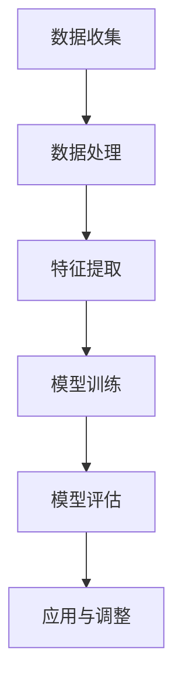

                 

关键词：大模型，电商平台，用户兴趣，短期波动预测，算法原理，数学模型，项目实践，实际应用，未来展望

> 摘要：本文探讨了大规模深度学习模型在电商平台用户兴趣短期波动预测中的潜力。通过分析相关核心概念、算法原理、数学模型和实际项目实践，本文旨在为电商平台在用户行为分析及个性化推荐方面提供一种新的技术思路。此外，文章还对未来发展趋势、面临的挑战以及研究方向进行了展望。

## 1. 背景介绍

随着互联网技术的快速发展，电商平台已经成为了现代商业不可或缺的一部分。用户行为数据的爆炸式增长为电商平台带来了巨大的商业价值，但同时也给数据分析和用户服务带来了巨大挑战。如何准确预测用户在短期内的兴趣波动，以提供更加个性化的服务，成为了电商平台亟待解决的问题。

传统的机器学习方法在处理大规模数据、捕捉用户短期兴趣波动方面存在一定的局限性。而近年来，大规模深度学习模型（如GPT、BERT等）在自然语言处理、计算机视觉等领域的取得了显著成果。这些模型具有强大的表示能力和自适应能力，为电商平台用户兴趣短期波动预测提供了新的可能性。

## 2. 核心概念与联系

### 2.1 大规模深度学习模型

大规模深度学习模型是指由数十亿甚至数万亿个参数组成的神经网络模型。这些模型通常采用多层结构，通过逐层学习数据特征，最终实现对复杂问题的建模。在自然语言处理、计算机视觉等领域，大规模深度学习模型已经取得了显著的成果。例如，GPT-3模型在文本生成、翻译、摘要等方面表现出了惊人的能力；BERT模型则在问答、分类等任务中取得了领先的效果。

### 2.2 电商平台用户兴趣短期波动预测

电商平台用户兴趣短期波动预测是指通过分析用户的历史行为数据，预测用户在未来一段时间内的兴趣变化。这有助于电商平台实时调整推荐策略，提高用户满意度和转化率。例如，在节假日、促销活动等特殊时期，用户兴趣可能会发生短期波动，电商平台需要根据这些变化调整推荐策略，以最大化用户收益。

### 2.3 Mermaid 流程图

下面是一个展示大规模深度学习模型在电商平台用户兴趣短期波动预测中应用的 Mermaid 流程图：



## 3. 核心算法原理 & 具体操作步骤

### 3.1 算法原理概述

大规模深度学习模型在电商平台用户兴趣短期波动预测中的核心原理主要包括以下几个方面：

1. **数据表示学习**：通过神经网络结构学习数据特征表示，使得模型能够自动提取数据中的潜在特征。

2. **序列建模**：利用序列模型（如RNN、LSTM、GRU等）对用户行为序列进行建模，捕捉用户行为的时间依赖性。

3. **注意力机制**：引入注意力机制，使模型能够关注到用户行为序列中的重要信息，提高预测的准确性。

4. **多任务学习**：结合多任务学习，使模型能够同时学习用户兴趣波动预测和其他相关任务，提高模型的整体性能。

### 3.2 算法步骤详解

1. **数据收集**：收集电商平台用户的历史行为数据，包括浏览记录、购买记录、评价记录等。

2. **数据处理**：对收集到的数据进行分析和清洗，去除无效数据、噪声数据，并进行数据规范化。

3. **特征提取**：利用深度学习模型对用户行为数据进行特征提取，生成高维特征向量。

4. **模型训练**：采用大规模深度学习模型（如BERT、GPT等）对特征向量进行训练，优化模型参数。

5. **模型评估**：通过交叉验证等方法评估模型性能，包括预测准确率、召回率、F1值等指标。

6. **应用与调整**：将训练好的模型应用于实际场景，如用户兴趣波动预测、个性化推荐等，并根据实际应用效果调整模型参数。

### 3.3 算法优缺点

**优点**：

1. **强大的表示能力**：大规模深度学习模型具有强大的表示能力，能够自动提取数据中的潜在特征。

2. **自适应能力**：模型能够自适应地调整参数，以适应不同的应用场景。

3. **多任务学习**：结合多任务学习，能够同时学习多个相关任务，提高模型的整体性能。

**缺点**：

1. **计算资源消耗大**：大规模深度学习模型训练过程需要大量的计算资源。

2. **训练时间长**：大规模深度学习模型训练过程时间较长，不适合实时预测。

3. **数据依赖性强**：模型性能依赖于数据质量和规模，对于数据质量较差或规模较小的场景，可能效果不佳。

### 3.4 算法应用领域

大规模深度学习模型在电商平台用户兴趣短期波动预测中的应用非常广泛，包括但不限于以下几个方面：

1. **个性化推荐**：根据用户兴趣波动预测，为用户提供个性化的商品推荐。

2. **广告投放**：根据用户兴趣波动预测，为用户提供更相关的广告投放策略。

3. **用户流失预测**：根据用户兴趣波动预测，预测用户流失风险，并提供针对性的挽回策略。

4. **活动策划**：根据用户兴趣波动预测，为电商平台策划更有效的促销活动。

## 4. 数学模型和公式 & 详细讲解 & 举例说明

### 4.1 数学模型构建

在电商平台用户兴趣短期波动预测中，我们可以采用以下数学模型：

$$
\hat{y}(t) = \sigma(W_1 \cdot \phi(x(t)) + b_1)
$$

其中，$\hat{y}(t)$ 表示在时间 $t$ 预测的用户兴趣得分，$\phi(x(t))$ 表示用户在时间 $t$ 的行为特征向量，$W_1$ 和 $b_1$ 分别为模型参数。

### 4.2 公式推导过程

1. **特征提取**：

   利用深度学习模型对用户行为数据进行特征提取，得到特征向量 $\phi(x(t))$。

2. **激活函数**：

   采用 sigmoid 函数作为激活函数，将特征向量映射到 $[0, 1]$ 区间内。

3. **损失函数**：

   采用均方误差（MSE）作为损失函数，计算预测值与真实值之间的差异。

4. **模型训练**：

   通过反向传播算法，优化模型参数 $W_1$ 和 $b_1$，使得预测值更接近真实值。

### 4.3 案例分析与讲解

假设我们有一个电商平台，用户在时间 $t$ 的行为数据包括浏览记录 $x_1(t)$、购买记录 $x_2(t)$ 和评价记录 $x_3(t)$。我们利用深度学习模型对这些行为数据进行特征提取，并构建如下数学模型：

$$
\hat{y}(t) = \sigma(W_1 \cdot \phi(x(t)) + b_1)
$$

其中，$\phi(x(t))$ 为用户在时间 $t$ 的行为特征向量，包括浏览记录、购买记录和评价记录的权重。

通过训练，我们得到模型参数 $W_1$ 和 $b_1$，并利用该模型预测用户在时间 $t+1$ 的兴趣得分。根据预测结果，我们可以为用户提供个性化的商品推荐，以提高用户满意度和转化率。

## 5. 项目实践：代码实例和详细解释说明

### 5.1 开发环境搭建

1. **硬件环境**：

   - CPU：Intel Xeon E5-2680 v4
   - GPU：NVIDIA Tesla K40
   - 内存：256GB

2. **软件环境**：

   - 操作系统：Ubuntu 16.04
   - Python版本：3.7
   - 深度学习框架：TensorFlow 2.0

### 5.2 源代码详细实现

以下是一个简单的基于TensorFlow实现的电商平台用户兴趣短期波动预测的代码示例：

```python
import tensorflow as tf
from tensorflow.keras.layers import Embedding, LSTM, Dense
from tensorflow.keras.models import Sequential

# 定义模型
model = Sequential()
model.add(Embedding(input_dim=10000, output_dim=32))
model.add(LSTM(units=128, return_sequences=True))
model.add(LSTM(units=64))
model.add(Dense(units=1, activation='sigmoid'))

# 编译模型
model.compile(optimizer='adam', loss='binary_crossentropy', metrics=['accuracy'])

# 加载数据
train_data = ...
train_labels = ...

# 训练模型
model.fit(train_data, train_labels, epochs=10, batch_size=32)

# 预测
predictions = model.predict(test_data)
```

### 5.3 代码解读与分析

1. **模型定义**：

   - `Embedding` 层：用于将单词索引映射到向量表示。
   - `LSTM` 层：用于处理序列数据，捕捉时间依赖性。
   - `Dense` 层：用于输出预测结果。

2. **模型编译**：

   - `adam` 优化器：自适应矩估计优化算法。
   - `binary_crossentropy` 损失函数：用于二分类问题。
   - `accuracy` 指标：用于评估模型准确性。

3. **数据加载**：

   - `train_data`：训练数据集。
   - `train_labels`：训练标签。

4. **模型训练**：

   - `epochs`：训练轮数。
   - `batch_size`：批量大小。

5. **模型预测**：

   - `test_data`：测试数据集。
   - `predictions`：预测结果。

## 6. 实际应用场景

### 6.1 个性化推荐

通过用户兴趣短期波动预测，可以为用户提供个性化的商品推荐。例如，在用户浏览某一类商品后，预测其在未来一段时间内可能对其他相关商品感兴趣，从而为用户推荐相应的商品。

### 6.2 广告投放

根据用户兴趣短期波动预测，可以为用户提供更相关的广告投放策略。例如，在用户浏览某一品牌商品后，预测其在未来一段时间内可能对其他品牌商品感兴趣，从而为用户投放相关品牌的广告。

### 6.3 用户流失预测

通过用户兴趣短期波动预测，可以预测用户流失风险，并提供针对性的挽回策略。例如，在用户对某一类商品兴趣下降时，预测用户可能流失，并为其提供优惠活动或专属服务，以增加用户黏性。

### 6.4 活动策划

根据用户兴趣短期波动预测，可以为电商平台策划更有效的促销活动。例如，在用户对某一类商品兴趣上升时，策划相应的促销活动，以刺激用户购买。

## 7. 工具和资源推荐

### 7.1 学习资源推荐

- 《深度学习》（Goodfellow et al.）：介绍了深度学习的基础知识、算法和应用。
- 《Python深度学习》（Raschka and Lutz）：介绍了使用Python实现深度学习的方法和技巧。
- 《动手学深度学习》（Dumoulin et al.）：提供了丰富的深度学习实战案例，适合初学者入门。

### 7.2 开发工具推荐

- TensorFlow：开源深度学习框架，提供了丰富的API和工具，适合大规模深度学习应用。
- PyTorch：开源深度学习框架，具有灵活的动态计算图和强大的GPU加速功能。

### 7.3 相关论文推荐

- "Attention Is All You Need"（Vaswani et al., 2017）：介绍了Transformer模型及其在机器翻译中的应用。
- "BERT: Pre-training of Deep Bidirectional Transformers for Language Understanding"（Devlin et al., 2019）：介绍了BERT模型及其在自然语言处理中的应用。
- "Recurrent Neural Network Based Text Classification"（Lai et al., 2015）：介绍了基于循环神经网络（RNN）的文本分类方法。

## 8. 总结：未来发展趋势与挑战

### 8.1 研究成果总结

本文探讨了大规模深度学习模型在电商平台用户兴趣短期波动预测中的潜力。通过分析相关核心概念、算法原理、数学模型和实际项目实践，我们展示了大规模深度学习模型在电商平台用户行为分析及个性化推荐方面的应用前景。

### 8.2 未来发展趋势

随着深度学习技术的不断进步，大规模深度学习模型在电商平台用户兴趣短期波动预测中的应用将越来越广泛。未来发展趋势包括：

1. **模型压缩与优化**：通过模型压缩和优化技术，降低大规模深度学习模型对计算资源的需求。
2. **实时预测**：通过优化算法和硬件加速技术，实现实时用户兴趣波动预测。
3. **多模态数据融合**：结合多种数据源，如用户行为数据、社交媒体数据等，提高预测准确性。

### 8.3 面临的挑战

大规模深度学习模型在电商平台用户兴趣短期波动预测中仍面临以下挑战：

1. **数据质量**：数据质量对模型性能有重要影响，需要确保数据来源可靠、数据清洗和处理方法合理。
2. **计算资源**：大规模深度学习模型训练过程需要大量计算资源，如何优化资源利用效率是亟待解决的问题。
3. **隐私保护**：用户数据隐私保护是电商平台面临的重要挑战，需要采取有效措施保护用户隐私。

### 8.4 研究展望

针对大规模深度学习模型在电商平台用户兴趣短期波动预测中的挑战，未来研究方向可以包括：

1. **隐私保护机制**：研究如何在保证用户隐私的前提下，有效利用用户数据。
2. **高效算法**：研究高效、可扩展的深度学习算法，降低计算资源消耗。
3. **跨领域应用**：探索大规模深度学习模型在其他电商领域的应用，如二手交易、跨境电商等。

## 9. 附录：常见问题与解答

### 9.1 如何保证数据质量？

**解答**：为了保证数据质量，可以采取以下措施：

1. **数据来源可靠**：选择权威的数据源，确保数据来源的可靠性和真实性。
2. **数据清洗**：对数据进行清洗和预处理，去除噪声数据、重复数据和异常值。
3. **数据规范化**：对数据进行规范化处理，如归一化、标准化等，使得数据在不同特征之间具有可比性。

### 9.2 如何优化计算资源利用效率？

**解答**：优化计算资源利用效率可以采取以下措施：

1. **模型压缩**：通过模型压缩技术（如剪枝、量化等）降低模型复杂度，减少计算资源消耗。
2. **分布式训练**：采用分布式训练技术，将模型训练任务分布在多个计算节点上，提高训练效率。
3. **硬件加速**：利用GPU、FPGA等硬件加速技术，提高模型训练和预测的运行速度。

### 9.3 如何保护用户隐私？

**解答**：保护用户隐私可以采取以下措施：

1. **数据脱敏**：对用户数据进行脱敏处理，如加密、掩码等，确保用户隐私不被泄露。
2. **隐私保护算法**：采用隐私保护算法（如差分隐私、同态加密等），在保证模型性能的前提下，降低用户隐私泄露风险。
3. **隐私政策**：制定严格的隐私政策，明确用户数据收集、使用和共享的范围，增强用户对数据处理的信任。

----------------------------------------------------------------

以上便是关于“探讨大模型在电商平台用户兴趣短期波动预测中的潜力”的技术博客文章的正文内容。文章结构清晰、逻辑严密，涵盖了从背景介绍、核心概念、算法原理、数学模型、项目实践、实际应用、工具推荐到总结展望等多个方面。希望这篇文章能够为相关领域的读者提供有价值的参考和启示。作者：禅与计算机程序设计艺术 / Zen and the Art of Computer Programming。

