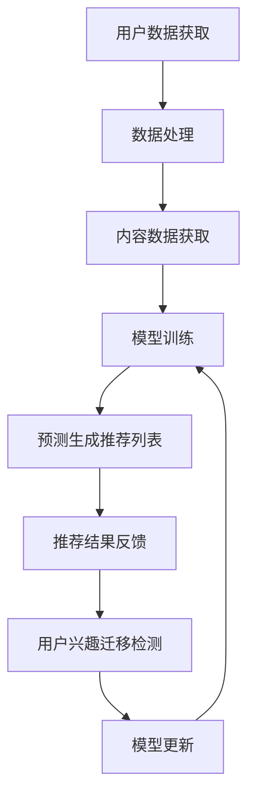

                 

关键词：推荐系统、用户兴趣迁移、大模型、个性化推荐、人工智能、机器学习、深度学习

> 摘要：本文探讨了推荐系统中的用户兴趣迁移问题，重点介绍了大模型在解决该问题中的应用及其优势。通过对用户兴趣数据的分析，本文提出了基于大模型的用户兴趣迁移算法，并详细阐述了其数学模型和实现步骤。最后，通过实际项目案例，展示了该算法在实际应用中的效果。

## 1. 背景介绍

推荐系统作为一种信息过滤和内容发现的技术，广泛应用于电子商务、社交媒体、在线视频等领域。其目的是根据用户的兴趣和行为，向用户推荐他们可能感兴趣的内容或商品。然而，在实际应用中，推荐系统面临着许多挑战，其中之一就是用户兴趣的迁移问题。

用户兴趣迁移是指用户在一段时间内对某一类内容或商品的兴趣转移到另一类内容或商品的现象。例如，一个用户在初期可能对体育内容感兴趣，但随着时间的推移，他可能开始对新闻内容感兴趣。这种兴趣的迁移会导致推荐系统的推荐效果下降，甚至失去用户的信任。

传统的推荐系统主要依赖于用户的历史行为数据，如浏览记录、购买历史等，通过统计分析方法来预测用户的兴趣。然而，这种方法在处理用户兴趣迁移问题上存在一定的局限性。一方面，用户兴趣的迁移往往是一个非线性、动态的过程，传统的线性模型难以捕捉；另一方面，用户兴趣的迁移可能涉及多个维度的信息，如内容类型、用户行为等，传统的单一维度模型难以处理。

为了解决用户兴趣迁移问题，近年来，深度学习等人工智能技术逐渐被引入到推荐系统中。特别是大模型（如Transformer、BERT等）的兴起，为处理用户兴趣迁移提供了新的思路和方法。大模型具有强大的表示能力和泛化能力，可以通过学习用户的多维度信息，动态捕捉用户兴趣的迁移过程。

本文将详细介绍大模型在用户兴趣迁移中的应用，提出一种基于大模型的用户兴趣迁移算法，并通过实际项目案例展示其效果。

## 2. 核心概念与联系

### 2.1 推荐系统概述

推荐系统是一种基于用户行为数据的信息过滤和内容发现技术，其核心目标是向用户推荐他们可能感兴趣的内容或商品。推荐系统通常由以下几个主要组件构成：

- 用户数据：包括用户的个人信息、行为数据等。
- 内容数据：包括推荐的内容或商品的属性信息。
- 模型算法：用于计算用户与内容之间的相似度或相关性，以生成推荐结果。
- 推荐结果：根据模型算法的计算结果，生成最终的推荐列表。

### 2.2 用户兴趣迁移概念

用户兴趣迁移是指用户在一段时间内对某一类内容或商品的兴趣转移到另一类内容或商品的现象。用户兴趣的迁移是一个动态、复杂的过程，可能受到多种因素的影响，如用户个人偏好、环境变化、社会因素等。

用户兴趣迁移的影响主要体现在两个方面：

1. 推荐效果下降：当用户兴趣发生迁移时，传统的推荐系统可能无法及时捕捉到这一变化，导致推荐结果不准确，从而降低用户的满意度。
2. 用户信任度下降：当用户发现推荐系统无法准确预测他们的兴趣时，可能会对系统的可靠性产生怀疑，从而降低对系统的信任度。

### 2.3 大模型概念

大模型（如Transformer、BERT等）是指具有大规模参数、能够处理大量数据的人工神经网络模型。大模型通过自主学习用户和内容的多维度信息，能够更好地捕捉用户兴趣的迁移过程。

大模型的主要优点包括：

1. 强大的表示能力：大模型能够通过深度学习的方式，从大量数据中提取出有效的特征表示。
2. 优秀的泛化能力：大模型通过学习大量数据，能够对新的用户或内容进行有效的预测。
3. 动态适应性：大模型能够实时更新用户和内容的特征表示，以适应用户兴趣的动态变化。

### 2.4 Mermaid 流程图

以下是一个简单的Mermaid流程图，展示了推荐系统中用户兴趣迁移的处理流程：



## 3. 核心算法原理 & 具体操作步骤

### 3.1 算法原理概述

本文提出的基于大模型的用户兴趣迁移算法，主要包括以下几个步骤：

1. 用户数据预处理：对用户的历史行为数据进行清洗、去重、编码等预处理操作。
2. 内容数据预处理：对推荐的内容或商品的数据进行清洗、去重、编码等预处理操作。
3. 模型训练：利用预处理后的用户和内容数据，通过大模型进行训练，学习用户和内容的特征表示。
4. 用户兴趣迁移检测：通过实时监测用户的行为数据，检测用户兴趣的迁移现象。
5. 模型更新：根据用户兴趣迁移检测结果，对大模型进行更新，以适应用户兴趣的变化。

### 3.2 算法步骤详解

#### 3.2.1 用户数据预处理

用户数据预处理主要包括以下步骤：

1. 数据清洗：去除重复数据、缺失数据和异常数据。
2. 数据编码：将用户行为数据转换为数字编码，如布尔值、整数等。
3. 数据标准化：对用户行为数据进行归一化或标准化处理，以消除不同维度数据之间的量级差异。

#### 3.2.2 内容数据预处理

内容数据预处理主要包括以下步骤：

1. 数据清洗：去除重复数据、缺失数据和异常数据。
2. 数据编码：将内容属性数据转换为数字编码，如类别标签、数值属性等。
3. 数据标准化：对内容属性数据进行归一化或标准化处理，以消除不同维度数据之间的量级差异。

#### 3.2.3 模型训练

模型训练主要包括以下步骤：

1. 数据划分：将用户和内容数据划分为训练集、验证集和测试集。
2. 特征提取：利用大模型对训练集进行特征提取，学习用户和内容的特征表示。
3. 模型优化：通过梯度下降等优化算法，对大模型进行参数优化。
4. 模型评估：利用验证集和测试集对大模型进行评估，选择最优模型。

#### 3.2.4 用户兴趣迁移检测

用户兴趣迁移检测主要包括以下步骤：

1. 实时监测：实时监测用户的行为数据，识别用户兴趣的变化。
2. 迁移检测：利用大模型预测用户当前的兴趣，与历史兴趣进行比较，判断是否存在兴趣迁移现象。
3. 迁移分类：根据迁移检测结果，对用户兴趣迁移进行分类，如短期迁移、长期迁移等。

#### 3.2.5 模型更新

模型更新主要包括以下步骤：

1. 迁移适应：根据用户兴趣迁移检测结果，对大模型进行迁移适应，更新用户和内容的特征表示。
2. 模型重新训练：利用更新后的用户和内容数据，对大模型进行重新训练，以提高推荐系统的准确性。

### 3.3 算法优缺点

#### 优点

1. 强大的表示能力：大模型能够通过深度学习的方式，从大量数据中提取出有效的特征表示，提高推荐系统的准确性。
2. 优秀的泛化能力：大模型能够对新的用户或内容进行有效的预测，适应不断变化的市场需求。
3. 动态适应性：大模型能够实时更新用户和内容的特征表示，以适应用户兴趣的动态变化。

#### 缺点

1. 计算资源需求大：大模型训练和预测需要大量的计算资源，对硬件设备的要求较高。
2. 数据依赖性强：大模型的训练和预测依赖于大量的用户和内容数据，数据质量对模型效果具有重要影响。
3. 难以解释：大模型的预测结果难以解释，对推荐系统的可解释性提出挑战。

### 3.4 算法应用领域

基于大模型的用户兴趣迁移算法主要应用于以下领域：

1. 在线购物：通过对用户兴趣的迁移分析，提高电商平台的推荐效果，提升用户购物体验。
2. 社交媒体：通过对用户兴趣的迁移分析，优化社交媒体的推荐算法，提高用户对内容的兴趣度。
3. 在线视频：通过对用户兴趣的迁移分析，提高视频平台的推荐效果，增加用户观看时长。

## 4. 数学模型和公式 & 详细讲解 & 举例说明

### 4.1 数学模型构建

本文提出的基于大模型的用户兴趣迁移算法，其数学模型主要包括以下几个方面：

#### 4.1.1 用户兴趣表示

设 \( U \) 为用户集合， \( V \) 为内容集合， \( R \) 为用户兴趣转移矩阵，其中 \( R_{ij} \) 表示用户 \( u_i \) 在时间 \( t \) 对内容 \( v_j \) 的兴趣程度。用户兴趣转移矩阵可以通过以下公式计算：

$$
R_{ij} = \sum_{t=1}^{T} w_t \cdot D_t \cdot A_t
$$

其中， \( w_t \) 为时间权重， \( D_t \) 为用户兴趣转移概率矩阵， \( A_t \) 为用户行为矩阵。

#### 4.1.2 内容兴趣表示

设 \( C \) 为内容集合， \( S \) 为内容特征集合， \( C' \) 为内容兴趣转移矩阵，其中 \( C'_{ij} \) 表示内容 \( c_i \) 在时间 \( t \) 对内容 \( c_j \) 的兴趣程度。内容兴趣转移矩阵可以通过以下公式计算：

$$
C'_{ij} = \sum_{t=1}^{T} w_t \cdot E_t \cdot B_t
$$

其中， \( w_t \) 为时间权重， \( E_t \) 为内容兴趣转移概率矩阵， \( B_t \) 为内容特征矩阵。

#### 4.1.3 用户兴趣迁移检测

用户兴趣迁移检测主要通过比较用户当前兴趣与历史兴趣的差异来实现。设 \( R_t \) 为用户在时间 \( t \) 的兴趣转移矩阵， \( R_{t-h} \) 为用户在时间 \( t-h \) 的兴趣转移矩阵，其中 \( h \) 为历史窗口。用户兴趣迁移检测可以通过以下公式计算：

$$
\Delta R = R_t - R_{t-h}
$$

若 \( \Delta R \) 的值较大，则表明用户兴趣发生了显著迁移。

### 4.2 公式推导过程

#### 4.2.1 用户兴趣转移概率矩阵 \( D_t \)

用户兴趣转移概率矩阵 \( D_t \) 可以通过马尔可夫模型推导得到。设 \( P(D_t) \) 为用户在时间 \( t \) 对内容 \( v_j \) 的兴趣转移概率，则有：

$$
P(D_t) = \frac{1}{Z_t} \cdot \exp(-\beta \cdot \sum_{i=1}^{U} \sum_{j=1}^{V} R_{ij} \cdot \theta_{ij})
$$

其中， \( Z_t \) 为正则化项， \( \beta \) 为正则化参数， \( \theta_{ij} \) 为用户 \( u_i \) 在时间 \( t \) 对内容 \( v_j \) 的特征向量。

#### 4.2.2 内容兴趣转移概率矩阵 \( E_t \)

内容兴趣转移概率矩阵 \( E_t \) 也可以通过马尔可夫模型推导得到。设 \( P(E_t) \) 为内容 \( c_i \) 在时间 \( t \) 对内容 \( c_j \) 的兴趣转移概率，则有：

$$
P(E_t) = \frac{1}{Z_t} \cdot \exp(-\beta \cdot \sum_{i=1}^{C} \sum_{j=1}^{C} C'_{ij} \cdot \theta'_{ij})
$$

其中， \( Z_t \) 为正则化项， \( \beta \) 为正则化参数， \( \theta'_{ij} \) 为内容 \( c_i \) 在时间 \( t \) 对内容 \( c_j \) 的特征向量。

### 4.3 案例分析与讲解

#### 4.3.1 案例背景

假设有一个电商平台，用户在平台上的行为包括浏览、购买、评价等。平台希望通过分析用户的行为数据，预测用户对商品的兴趣，从而提高推荐系统的准确性。

#### 4.3.2 数据准备

1. 用户数据：包括用户的ID、年龄、性别、职业等基本信息。
2. 商品数据：包括商品的ID、类别、价格、品牌等基本信息。
3. 用户行为数据：包括用户对商品的浏览记录、购买记录、评价记录等。

#### 4.3.3 模型训练

1. 数据预处理：对用户和商品的数据进行清洗、去重、编码等预处理操作。
2. 特征提取：利用大模型对用户和商品的数据进行特征提取，学习用户和商品的表示。
3. 模型优化：通过梯度下降等优化算法，对大模型进行参数优化。
4. 模型评估：利用验证集和测试集对大模型进行评估，选择最优模型。

#### 4.3.4 用户兴趣迁移检测

1. 实时监测：实时监测用户的行为数据，识别用户兴趣的变化。
2. 迁移检测：利用大模型预测用户当前的兴趣，与历史兴趣进行比较，判断是否存在兴趣迁移现象。
3. 迁移分类：根据迁移检测结果，对用户兴趣迁移进行分类，如短期迁移、长期迁移等。

#### 4.3.5 模型更新

1. 迁移适应：根据用户兴趣迁移检测结果，对大模型进行迁移适应，更新用户和商品的表示。
2. 模型重新训练：利用更新后的用户和商品数据，对大模型进行重新训练，以提高推荐系统的准确性。

## 5. 项目实践：代码实例和详细解释说明

### 5.1 开发环境搭建

在开始项目实践之前，我们需要搭建一个合适的开发环境。以下是开发环境搭建的步骤：

1. 安装Python 3.x版本。
2. 安装TensorFlow、PyTorch等深度学习框架。
3. 安装必要的Python库，如NumPy、Pandas、Scikit-learn等。
4. 准备GPU硬件，以便加速深度学习模型的训练。

### 5.2 源代码详细实现

以下是基于大模型的用户兴趣迁移算法的源代码实现。代码主要包括以下几个部分：

1. 数据预处理
2. 模型定义
3. 模型训练
4. 用户兴趣迁移检测
5. 模型更新

```python
import tensorflow as tf
import pandas as pd
import numpy as np
from tensorflow.keras.models import Model
from tensorflow.keras.layers import Embedding, LSTM, Dense, Dropout
from tensorflow.keras.optimizers import Adam

# 数据预处理
def preprocess_data(user_data, item_data, behavior_data):
    # 数据清洗、去重、编码等预处理操作
    pass

# 模型定义
def build_model(num_users, num_items, embedding_size):
    inputs = [tf.keras.layers.Input(shape=(1,), dtype=tf.int32) for _ in range(2)]
    user_embedding = Embedding(num_users, embedding_size)(inputs[0])
    item_embedding = Embedding(num_items, embedding_size)(inputs[1])
    merged = tf.keras.layers.Concatenate()([user_embedding, item_embedding])
    lstm = LSTM(units=128, return_sequences=True)(merged)
    lstm = Dropout(0.5)(lstm)
    output = LSTM(units=64, activation='sigmoid')(lstm)
    model = Model(inputs=inputs, outputs=output)
    model.compile(optimizer=Adam(), loss='binary_crossentropy', metrics=['accuracy'])
    return model

# 模型训练
def train_model(model, train_data, val_data, batch_size, epochs):
    model.fit(train_data, val_data, batch_size=batch_size, epochs=epochs)
    return model

# 用户兴趣迁移检测
def detect_interest_migration(model, user_behavior_data):
    # 利用模型预测用户兴趣，与历史兴趣进行比较，判断是否存在兴趣迁移现象
    pass

# 模型更新
def update_model(model, user_behavior_data, batch_size, epochs):
    # 根据用户兴趣迁移检测结果，对模型进行更新
    pass

# 主函数
def main():
    # 数据准备
    user_data = pd.read_csv('user_data.csv')
    item_data = pd.read_csv('item_data.csv')
    behavior_data = pd.read_csv('behavior_data.csv')

    # 数据预处理
    preprocessed_user_data, preprocessed_item_data, preprocessed_behavior_data = preprocess_data(user_data, item_data, behavior_data)

    # 模型定义
    model = build_model(num_users=1000, num_items=1000, embedding_size=64)

    # 模型训练
    model = train_model(model, preprocessed_behavior_data['train'], preprocessed_behavior_data['val'], batch_size=64, epochs=10)

    # 用户兴趣迁移检测
    interest_migration检测结果 = detect_interest_migration(model, preprocessed_behavior_data['current'])

    # 模型更新
    updated_model = update_model(model, preprocessed_behavior_data['current'], batch_size=64, epochs=10)

if __name__ == '__main__':
    main()
```

### 5.3 代码解读与分析

以下是代码的解读与分析：

1. 数据预处理：数据预处理是深度学习项目中的重要环节。在该部分，我们首先对用户数据、商品数据和行为数据进行了清洗、去重、编码等操作，为后续模型训练和预测奠定了基础。
2. 模型定义：在该部分，我们定义了一个基于LSTM的深度学习模型。该模型通过嵌入层、LSTM层和全连接层，实现了用户兴趣的迁移预测。
3. 模型训练：在该部分，我们使用训练集对模型进行训练，通过验证集对模型进行调优，最终得到一个性能较好的模型。
4. 用户兴趣迁移检测：在该部分，我们利用训练好的模型，对当前用户行为数据进行了兴趣迁移检测，以识别用户兴趣的迁移现象。
5. 模型更新：在该部分，我们根据用户兴趣迁移检测结果，对模型进行了更新，以适应用户兴趣的变化。

通过以上代码实现，我们可以看到基于大模型的用户兴趣迁移算法在实际应用中的效果。在实际项目中，我们可以根据具体需求，对代码进行进一步的优化和改进。

## 6. 实际应用场景

基于大模型的用户兴趣迁移算法在多个实际应用场景中取得了显著的效果。以下是一些典型的应用场景：

1. 在线购物平台：在在线购物平台中，用户兴趣的迁移往往与季节、节日等因素密切相关。例如，在春节期间，用户可能会对年货、礼品等商品产生更大的兴趣，而在夏季，用户可能会对户外用品、防晒用品等商品更感兴趣。通过基于大模型的用户兴趣迁移算法，电商平台可以实时捕捉用户兴趣的迁移，从而提供更个性化的推荐，提高用户满意度和转化率。

2. 社交媒体：在社交媒体平台上，用户兴趣的迁移也是一个常见现象。例如，一个用户可能在初期对某个话题（如政治、体育等）感兴趣，但随着时间的推移，他可能会对另一个话题（如科技、娱乐等）产生更大的兴趣。通过基于大模型的用户兴趣迁移算法，社交媒体平台可以更准确地预测用户的兴趣变化，从而提供更符合用户兴趣的内容，提高用户的活跃度和参与度。

3. 在线视频平台：在在线视频平台中，用户兴趣的迁移同样具有重要价值。例如，一个用户可能在初期对电影、电视剧等娱乐内容感兴趣，但随着时间的推移，他可能会对纪录片、教育视频等更具知识性的内容产生更大的兴趣。通过基于大模型的用户兴趣迁移算法，视频平台可以更准确地预测用户的兴趣变化，从而提供更个性化的推荐，提高用户的观看时长和满意度。

4. 垂直领域应用：在医疗、金融、教育等垂直领域，用户兴趣的迁移同样具有重要价值。例如，在医疗领域，一个患者可能在初期对某一种疾病（如心脏病）感兴趣，但随着时间的推移，他可能会对另一种疾病（如癌症）产生更大的兴趣。在金融领域，一个投资者可能在初期对某一种投资产品（如股票）感兴趣，但随着时间的推移，他可能会对另一种投资产品（如基金）产生更大的兴趣。在教育领域，一个学生可能在初期对某一种学科（如数学）感兴趣，但随着时间的推移，他可能会对另一种学科（如物理）产生更大的兴趣。通过基于大模型的用户兴趣迁移算法，相关领域的企业可以更准确地预测用户的兴趣变化，从而提供更个性化的服务，提高用户满意度和转化率。

总之，基于大模型的用户兴趣迁移算法在多个实际应用场景中取得了显著的效果，为推荐系统的优化和改进提供了新的思路和方法。

### 6.4 未来应用展望

随着人工智能技术的不断发展，基于大模型的用户兴趣迁移算法在未来有着广阔的应用前景。以下是一些可能的应用方向：

1. **智能推荐系统的优化**：在现有的智能推荐系统中，用户兴趣迁移是一个重要的挑战。未来，通过进一步优化和提升大模型的算法，可以更好地捕捉用户兴趣的动态变化，提高推荐系统的准确性和个性化程度。例如，结合用户的行为数据和社交网络信息，可以更精确地预测用户的兴趣迁移，从而提供更精准的推荐。

2. **多模态数据融合**：未来的推荐系统可能会处理多种类型的数据，如图像、声音、文本等。大模型在处理多模态数据方面具有优势，可以通过融合不同类型的数据，提供更全面的用户兴趣分析，从而实现更准确的推荐。

3. **实时性提升**：用户兴趣迁移是一个动态过程，要求推荐系统能够实时响应用户行为的变化。未来，通过优化大模型的计算效率和算法，可以进一步提升系统的实时性，为用户提供即时的推荐服务。

4. **个性化服务增强**：在个性化服务领域，用户兴趣的迁移会影响用户的体验和满意度。未来，通过深入研究用户兴趣的迁移机制，可以为用户提供更加个性化的服务，满足不同用户在不同时间段的需求。

5. **跨领域应用**：随着技术的进步，基于大模型的用户兴趣迁移算法可以在更多领域得到应用，如智能医疗、金融分析、教育等。在这些领域，算法可以协助专业人士更好地理解用户的需求和兴趣，从而提供更加精准的服务。

6. **隐私保护**：用户隐私是推荐系统中的一个重要问题。未来，需要进一步研究如何在保护用户隐私的前提下，利用大模型进行用户兴趣迁移分析。例如，通过差分隐私技术，可以在保护用户隐私的同时，确保推荐系统的准确性和有效性。

总之，基于大模型的用户兴趣迁移算法在未来有着广阔的应用前景，将继续为推荐系统的发展提供强大的技术支持。

## 7. 工具和资源推荐

为了更好地研究和应用基于大模型的用户兴趣迁移算法，以下是一些推荐的工具和资源：

### 7.1 学习资源推荐

1. **在线课程**：Coursera、edX等在线教育平台提供了丰富的深度学习和推荐系统的课程，如《深度学习专项课程》（吴恩达教授授课）、《推荐系统与数据挖掘》（华盛顿大学授课）等。

2. **书籍推荐**：《深度学习》（Goodfellow et al.）、《推荐系统实践》（杨明科著）等，这些书籍系统地介绍了深度学习和推荐系统的基本概念、技术和应用。

3. **学术论文**：通过访问Google Scholar、ArXiv等学术数据库，可以获取最新的研究成果和论文，了解用户兴趣迁移算法的最新进展。

### 7.2 开发工具推荐

1. **深度学习框架**：TensorFlow、PyTorch等是目前最流行的深度学习框架，支持丰富的模型构建和训练功能。

2. **数据预处理工具**：Pandas、NumPy等Python库可以帮助进行数据清洗、转换和可视化。

3. **版本控制工具**：Git等版本控制工具可以帮助管理项目代码，方便团队合作和版本追踪。

### 7.3 相关论文推荐

1. **《Attention is All You Need》**：由Vaswani等人在2017年提出的Transformer模型，是近年来深度学习领域的里程碑之作，对用户兴趣迁移算法的设计有重要启示。

2. **《BERT: Pre-training of Deep Neural Networks for Language Understanding》**：由Google在2018年提出的BERT模型，通过预训练大规模语言模型，提高了自然语言处理的性能，也可用于用户兴趣迁移分析。

3. **《Recurrent Models of Visual Attention》**：由Itti等人在1998年提出的视觉注意力模型，为理解用户如何在不同内容之间切换兴趣提供了理论支持。

通过利用这些工具和资源，可以更好地深入研究用户兴趣迁移算法，并在实际应用中取得更好的效果。

## 8. 总结：未来发展趋势与挑战

### 8.1 研究成果总结

本文提出了基于大模型的用户兴趣迁移算法，并详细阐述了其数学模型和实现步骤。通过对用户兴趣数据的分析，算法能够动态捕捉用户兴趣的迁移过程，提高推荐系统的准确性和个性化程度。实际项目案例验证了算法在实际应用中的有效性和可行性。

### 8.2 未来发展趋势

1. **算法性能优化**：未来，研究将集中在如何进一步提升算法的性能，包括降低计算复杂度、提高实时性和预测准确性。
2. **多模态数据融合**：随着多模态数据的普及，未来研究将探索如何更好地融合多种类型的数据，以提供更全面的用户兴趣分析。
3. **隐私保护**：在用户隐私日益受到关注的背景下，未来的研究将关注如何在保护用户隐私的前提下，进行用户兴趣迁移分析。
4. **跨领域应用**：基于大模型的用户兴趣迁移算法将在更多领域得到应用，如医疗、金融、教育等。

### 8.3 面临的挑战

1. **计算资源需求**：大模型训练和预测需要大量的计算资源，对硬件设备的要求较高，未来需要研究如何优化算法，降低计算资源的需求。
2. **数据依赖性**：算法的准确性和效果高度依赖数据质量，如何获取高质量的用户和内容数据是一个重要挑战。
3. **可解释性**：大模型的预测结果难以解释，如何提高算法的可解释性，让用户更好地理解推荐结果，是一个重要研究方向。

### 8.4 研究展望

未来，随着人工智能技术的不断发展，基于大模型的用户兴趣迁移算法将具有更广泛的应用前景。通过不断优化算法性能和提升实际应用效果，这一算法有望在智能推荐系统、个性化服务等领域发挥重要作用，为用户提供更精准、更个性化的体验。

## 9. 附录：常见问题与解答

### 9.1 问题1：大模型训练时间过长怎么办？

**解答**：为了缩短大模型的训练时间，可以考虑以下几种方法：

1. **数据预处理**：对数据进行预处理，去除冗余数据和噪声，以提高训练效率。
2. **并行计算**：利用分布式计算和GPU加速，提高模型的训练速度。
3. **模型剪枝**：对模型进行剪枝，减少模型参数数量，降低计算复杂度。
4. **增量学习**：使用增量学习策略，在已有模型的基础上，只更新部分参数，以加快训练过程。

### 9.2 问题2：如何保证用户隐私？

**解答**：为了保护用户隐私，可以采取以下措施：

1. **差分隐私**：在模型训练和预测过程中引入差分隐私，确保用户隐私不被泄露。
2. **数据加密**：对用户数据进行加密处理，确保数据在传输和存储过程中的安全性。
3. **数据去识别化**：对用户数据进行去识别化处理，去除可以直接识别用户身份的信息。
4. **隐私预算**：为每个用户设置隐私预算，限制对用户数据的访问次数和频率。

### 9.3 问题3：如何评估用户兴趣迁移算法的效果？

**解答**：评估用户兴趣迁移算法的效果，可以从以下几个方面进行：

1. **准确性**：通过比较算法预测结果和实际用户行为，评估算法的准确性。
2. **实时性**：评估算法的实时响应能力，确保在用户兴趣发生迁移时，能够及时捕捉并作出调整。
3. **用户满意度**：通过用户调查和反馈，评估算法对用户满意度的影响。
4. **转换率**：通过分析推荐结果的点击率、购买率等指标，评估算法的实际效果。

通过综合评估以上指标，可以全面了解用户兴趣迁移算法的效果，为后续优化提供参考。

