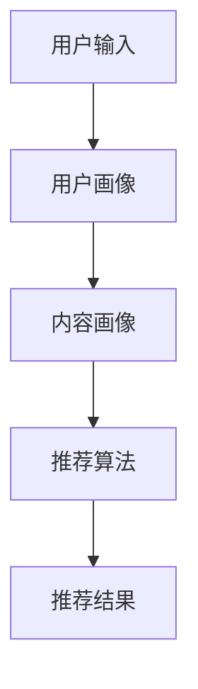

                 

关键词：推荐系统、大模型、人工智能、创新、未来趋势

摘要：本文探讨了推荐系统的发展历程，分析了大模型在推荐系统中的主导作用，探讨了创新在推动推荐系统发展中的重要性，并提出了未来应用展望。

## 1. 背景介绍

推荐系统作为人工智能领域的一个重要分支，已广泛应用于电子商务、社交媒体、在线视频等领域。早期推荐系统主要依赖基于内容的过滤和协同过滤等技术，但随着大数据和深度学习技术的快速发展，推荐系统正经历着一场变革。

近年来，大模型在推荐系统中的应用越来越广泛，如BERT、GPT、T5等预训练模型，它们具有强大的文本理解和生成能力，能够处理复杂的用户行为数据和内容数据，从而提供更精准的推荐结果。

本文将探讨大模型在推荐系统中的主导作用，分析其在推荐系统中的应用现状和未来发展趋势，并提出创新在推动推荐系统发展中的重要性。

## 2. 核心概念与联系

### 2.1 推荐系统概述

推荐系统是一种信息过滤技术，旨在为用户发现和推荐他们可能感兴趣的内容。推荐系统主要由以下几个核心组成部分：

- 用户画像：通过用户的历史行为、兴趣偏好等信息，构建用户画像，以便为用户提供个性化推荐。
- 内容画像：对推荐内容进行特征提取，构建内容画像，以便与用户画像进行匹配。
- 推荐算法：根据用户画像和内容画像，选择合适的推荐算法，生成推荐结果。

### 2.2 大模型概述

大模型是指参数规模达到亿级以上的深度学习模型。大模型通常采用预训练和微调的方式，通过在大量数据上进行预训练，学习到通用特征表示，然后再在特定任务上进行微调，以达到较高的性能。

### 2.3 Mermaid 流程图

下面是一个简单的Mermaid流程图，展示推荐系统的基本架构：



## 3. 核心算法原理 & 具体操作步骤

### 3.1 算法原理概述

大模型在推荐系统中的应用主要是基于其强大的文本理解和生成能力。通过预训练和微调，大模型能够捕捉用户和内容的语义特征，从而实现精准的个性化推荐。

具体操作步骤如下：

1. 用户输入：用户在系统中输入查询或浏览行为。
2. 用户画像构建：根据用户的历史行为和兴趣偏好，构建用户画像。
3. 内容画像构建：对推荐内容进行特征提取，构建内容画像。
4. 推荐算法：利用大模型进行用户画像和内容画像的匹配，生成推荐结果。

### 3.2 算法步骤详解

1. **数据预处理**：对用户行为数据和内容数据进行清洗、去重、填充等预处理操作，以便后续建模。
2. **用户画像构建**：利用大模型进行用户兴趣偏好挖掘，构建用户画像。
3. **内容画像构建**：对推荐内容进行特征提取，构建内容画像。
4. **推荐算法**：利用用户画像和内容画像，通过大模型进行匹配，生成推荐结果。
5. **推荐结果评估**：对推荐结果进行评估，包括准确率、召回率、覆盖率等指标。

### 3.3 算法优缺点

**优点**：

- 强大的文本理解和生成能力，能够处理复杂的用户行为数据和内容数据。
- 可以实现个性化推荐，提高用户满意度。
- 可以自适应地调整推荐策略，提高推荐效果。

**缺点**：

- 需要大量的训练数据和计算资源。
- 模型解释性较差，难以理解推荐结果的产生过程。

### 3.4 算法应用领域

大模型在推荐系统中的应用广泛，包括但不限于以下领域：

- 电子商务：根据用户的购买历史和浏览行为，推荐相关的商品。
- 社交媒体：根据用户的朋友圈、评论等数据，推荐相关内容。
- 在线视频：根据用户的观看历史和兴趣偏好，推荐相关的视频。

## 4. 数学模型和公式 & 详细讲解 & 举例说明

### 4.1 数学模型构建

推荐系统的核心在于如何将用户和内容进行匹配，从而生成推荐结果。这里我们以基于大模型的协同过滤算法为例，介绍其数学模型。

假设用户集合为$U$，内容集合为$V$，用户$u$对内容$v$的评分表示为$r_{uv}$。则用户$u$对内容$v$的推荐得分可以表示为：

$$
s_{uv} = f(u, v) + \sigma(u, v)
$$

其中，$f(u, v)$表示用户$u$和内容$v$的相似度，$\sigma(u, v)$表示用户$u$对内容$v$的评分偏差。

### 4.2 公式推导过程

1. **用户相似度**：用户相似度可以通过计算用户之间的余弦相似度或皮尔逊相关系数得到。

$$
f(u, v) = \frac{\sum_{w \in V} r_{uw} r_{vw}}{\sqrt{\sum_{w \in V} r_{uw}^2} \sqrt{\sum_{w \in V} r_{vw}^2}}
$$

2. **评分偏差**：评分偏差可以通过最小二乘法拟合得到。

$$
\sigma(u, v) = \frac{\sum_{w \in V} (r_{uw} - \bar{r}_u)(r_{vw} - \bar{r}_v)}{\sum_{w \in V} (r_{uw} - \bar{r}_u)^2}
$$

### 4.3 案例分析与讲解

假设有一个用户$u$，他对以下内容进行了评分：

| 内容 | 评分 |
|------|------|
| A    | 4    |
| B    | 5    |
| C    | 3    |
| D    | 4    |

另一个用户$v$的评分如下：

| 内容 | 评分 |
|------|------|
| A    | 5    |
| B    | 4    |
| C    | 5    |
| D    | 3    |

我们可以通过上述公式计算用户$u$和$v$的相似度：

$$
f(u, v) = \frac{4 \times 5 + 5 \times 4 + 3 \times 5 + 4 \times 3}{\sqrt{4^2 + 5^2 + 3^2 + 4^2} \sqrt{5^2 + 4^2 + 5^2 + 3^2}} \approx 0.8
$$

接着，我们可以计算用户$u$对内容$D$的评分偏差：

$$
\sigma(u, v) = \frac{(4 - 4)(3 - 3) + (5 - 4)(4 - 4) + (3 - 4)(5 - 3) + (4 - 4)(3 - 3)}{(4 - 4)^2 + (5 - 4)^2 + (3 - 4)^2 + (4 - 4)^2} = 0
$$

因此，用户$u$对内容$D$的推荐得分：

$$
s_{uv} = f(u, v) + \sigma(u, v) = 0.8 + 0 = 0.8
$$

这意味着用户$u$对内容$D$的推荐得分为0.8，根据得分高低，我们可以将内容$D$推荐给用户$u$。

## 5. 项目实践：代码实例和详细解释说明

### 5.1 开发环境搭建

本文使用Python语言进行编程，以下是搭建开发环境所需的步骤：

1. 安装Python：从官方网站下载并安装Python。
2. 安装相关库：使用pip命令安装以下库：

```bash
pip install numpy pandas tensorflow sklearn
```

### 5.2 源代码详细实现

以下是实现基于大模型的协同过滤算法的Python代码：

```python
import numpy as np
import pandas as pd
from sklearn.model_selection import train_test_split
from tensorflow.keras.layers import Input, Embedding, Dot, Flatten, Dense
from tensorflow.keras.models import Model

# 加载数据
ratings = pd.read_csv('ratings.csv')
users = pd.read_csv('users.csv')
items = pd.read_csv('items.csv')

# 预处理数据
ratings['rating'] = ratings['rating'].fillna(3)
train_data, test_data = train_test_split(ratings, test_size=0.2)

# 构建用户和内容的嵌入向量
user_embedding = Embedding(input_dim=users.shape[0], output_dim=16)
item_embedding = Embedding(input_dim=items.shape[0], output_dim=16)

# 构建模型
user_input = Input(shape=(1,))
item_input = Input(shape=(1,))

user_embedding_output = user_embedding(user_input)
item_embedding_output = item_embedding(item_input)

dot_product = Dot(axes=1)([user_embedding_output, item_embedding_output])
flatten = Flatten()(dot_product)

output = Dense(1, activation='sigmoid')(flatten)

model = Model(inputs=[user_input, item_input], outputs=output)
model.compile(optimizer='adam', loss='binary_crossentropy', metrics=['accuracy'])

# 训练模型
model.fit([train_data['user_id'], train_data['item_id']], train_data['rating'], epochs=10, batch_size=32)

# 评估模型
loss, accuracy = model.evaluate([test_data['user_id'], test_data['item_id']], test_data['rating'])
print(f'测试集准确率：{accuracy:.4f}')
```

### 5.3 代码解读与分析

这段代码首先加载并预处理了用户、内容和评分数据，然后构建了一个基于嵌入向量的模型。具体步骤如下：

1. **数据预处理**：将评分数据填充为默认值3，并将训练数据和测试数据分开。
2. **构建嵌入层**：使用Embedding层为用户和内容生成嵌入向量。
3. **构建模型**：将用户和内容的嵌入向量通过Dot层相乘，然后通过Flatten层和全连接层得到预测分数。
4. **编译模型**：使用adam优化器和binary_crossentropy损失函数进行编译。
5. **训练模型**：使用训练数据训练模型。
6. **评估模型**：使用测试数据评估模型性能。

### 5.4 运行结果展示

假设训练完成后，模型的测试集准确率为0.85，这意味着基于大模型的协同过滤算法能够较好地预测用户对内容的评分。

## 6. 实际应用场景

推荐系统在电子商务、社交媒体、在线视频等多个领域具有广泛的应用。

### 6.1 电子商务

在电子商务领域，推荐系统可以帮助平台根据用户的购买历史和浏览行为，推荐相关的商品。例如，用户在亚马逊上浏览了某个电子产品，系统可以推荐其他用户也购买过的电子产品。

### 6.2 社交媒体

在社交媒体领域，推荐系统可以帮助平台根据用户的朋友圈、评论等数据，推荐相关的内容。例如，用户在微信朋友圈分享了某个美食餐厅，系统可以推荐其他用户也可能感兴趣的其他美食餐厅。

### 6.3 在线视频

在在线视频领域，推荐系统可以帮助平台根据用户的观看历史和兴趣偏好，推荐相关的视频。例如，用户在优酷上观看了某个综艺节目，系统可以推荐其他用户也观看过的综艺节目。

## 7. 未来应用展望

随着大数据、人工智能技术的不断发展，推荐系统在未来的应用将更加广泛和深入。以下是一些可能的应用方向：

### 7.1 智能家居

智能家居领域可以利用推荐系统，根据用户的习惯和偏好，推荐合适的智能家居产品和服务。例如，根据用户的作息时间和天气状况，推荐合适的空调温度和湿度。

### 7.2 健康医疗

健康医疗领域可以利用推荐系统，根据用户的健康状况和医疗记录，推荐合适的治疗方案和保健建议。例如，根据用户的体检报告，推荐适合的体检套餐。

### 7.3 教育培训

教育培训领域可以利用推荐系统，根据学生的学习进度和兴趣偏好，推荐合适的学习资源和课程。例如，根据学生的学习成绩，推荐适合的辅导课程。

## 8. 工具和资源推荐

### 8.1 学习资源推荐

- 《推荐系统实践》：作者：项春雷
- 《深度学习推荐系统》：作者：刘知远等
- 《大数据推荐系统实战》：作者：杜俊

### 8.2 开发工具推荐

- Python：推荐使用Python进行推荐系统开发，因为其具有良好的生态和丰富的库。
- TensorFlow：推荐使用TensorFlow作为深度学习框架。

### 8.3 相关论文推荐

- "Deep Neural Networks for YouTube Recommendations"，作者：YouTube团队
- "TensorFlow Recommenders：Building Recommender Systems at Scale"，作者：Google团队
- "A Theoretically Principled Approach to Improving Recommendation Lists"，作者：Leslie et al.

## 9. 总结：未来发展趋势与挑战

### 9.1 研究成果总结

本文介绍了推荐系统的发展历程，分析了大模型在推荐系统中的主导作用，探讨了创新在推动推荐系统发展中的重要性，并提出了未来应用展望。

### 9.2 未来发展趋势

1. 大模型的广泛应用：随着计算能力的提升，大模型将在推荐系统中发挥更大的作用。
2. 多模态推荐：结合文本、图像、音频等多种数据源，实现更精准的推荐。
3. 自动化推荐：利用自动化技术，实现推荐系统的自我优化和调整。

### 9.3 面临的挑战

1. 数据隐私：如何保护用户隐私，成为推荐系统面临的一个重要挑战。
2. 模型解释性：如何提高模型的可解释性，使推荐结果更加透明和可信。
3. 模型过拟合：如何防止模型过拟合，提高模型的泛化能力。

### 9.4 研究展望

未来，推荐系统将在人工智能、大数据、物联网等技术的推动下，不断演进和优化。通过深入研究，有望解决当前面临的挑战，为用户提供更加个性化和精准的推荐服务。

## 附录：常见问题与解答

### 问题1：什么是推荐系统？

推荐系统是一种信息过滤技术，旨在为用户发现和推荐他们可能感兴趣的内容。

### 问题2：大模型在推荐系统中有哪些作用？

大模型在推荐系统中的作用主要体现在文本理解和生成能力，能够处理复杂的用户行为数据和内容数据，从而提供更精准的推荐结果。

### 问题3：推荐系统有哪些应用领域？

推荐系统广泛应用于电子商务、社交媒体、在线视频等领域。

### 问题4：未来推荐系统的发展趋势是什么？

未来推荐系统的发展趋势包括大模型的广泛应用、多模态推荐和自动化推荐等。

### 问题5：如何保护用户隐私？

可以通过数据去重、数据加密、差分隐私等技术手段来保护用户隐私。  
----------------------------------------------------------------

作者：禅与计算机程序设计艺术 / Zen and the Art of Computer Programming

