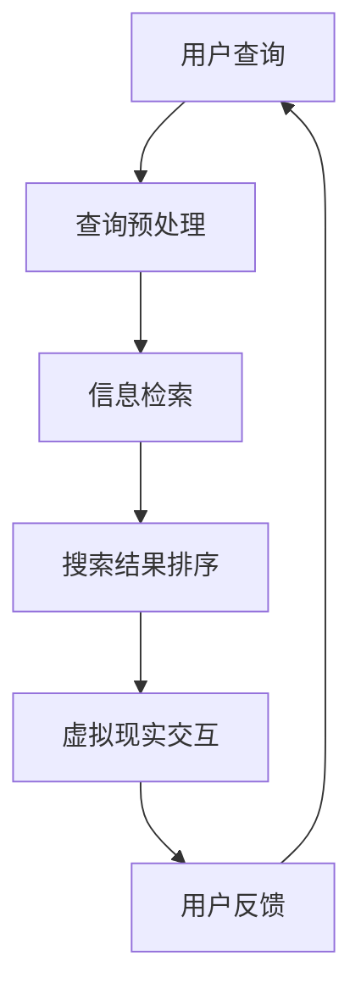

                 

 在当今科技飞速发展的时代，搜索引擎与虚拟现实技术的结合成为了人们关注的焦点。本文将探讨这一领域的核心概念、算法原理、数学模型、实践应用以及未来展望，为读者提供一个全面的技术视角。

> 关键词：搜索引擎、虚拟现实、算法原理、数学模型、实践应用、未来展望

> 摘要：本文首先介绍了搜索引擎与虚拟现实技术的基本概念，探讨了二者的结合所带来的创新与挑战。随后，文章深入分析了核心算法原理、数学模型及其应用领域。通过实际项目实践和代码实例，进一步揭示了这一技术的实现细节。最后，本文总结了该领域的研究成果、未来发展趋势与面临的挑战，为读者提供了一个全面的认知框架。

## 1. 背景介绍

随着互联网的普及和信息的爆炸式增长，搜索引擎成为了人们获取信息的重要工具。然而，传统的搜索引擎主要依赖于文本匹配和关键词检索，往往无法满足用户对多样化、个性化信息的需求。与此同时，虚拟现实（VR）技术的迅速发展，为人们提供了一个沉浸式的体验空间，使得虚拟环境中的信息交互变得更加直观和自然。

将搜索引擎与虚拟现实技术相结合，旨在创造一个更加智能化、互动性更强的信息获取平台。用户可以在虚拟环境中通过自然语言、手势、语音等多种方式与系统进行交互，从而获取到更加精准和个性化的信息。这种结合不仅提升了用户体验，也为信息检索领域带来了新的研究方向和可能性。

## 2. 核心概念与联系

### 2.1 搜索引擎基本概念

搜索引擎是一种基于互联网的信息检索工具，它通过对海量数据的索引和检索，为用户提供快速、准确的信息查询服务。搜索引擎的核心技术包括信息索引、查询处理和结果排序。信息索引是指将互联网上的文档、网页等数据转换为索引结构，以便快速检索；查询处理是指对用户的查询请求进行解析和预处理，以便生成高效的查询算法；结果排序是指根据用户的需求，对检索结果进行排序，以便提供最优的搜索体验。

### 2.2 虚拟现实基本概念

虚拟现实是一种通过计算机技术生成的三维沉浸式环境，用户可以在其中进行互动和体验。虚拟现实的核心技术包括三维建模、实时渲染和交互设计。三维建模是指通过计算机图形学技术生成三维模型；实时渲染是指对三维模型进行实时渲染，以便提供逼真的视觉体验；交互设计是指设计用户与虚拟环境的交互方式，以便实现自然、流畅的交互体验。

### 2.3 搜索引擎与虚拟现实的联系

搜索引擎与虚拟现实的结合主要体现在以下几个方面：

1. **虚拟现实环境的构建**：通过搜索引擎技术，为虚拟环境中的信息检索提供支持。用户可以在虚拟环境中通过自然语言、手势、语音等方式查询信息，获取到个性化的搜索结果。

2. **信息检索的优化**：虚拟现实技术可以为搜索引擎提供更为直观和丰富的信息检索方式。例如，用户可以通过三维可视化方式浏览和筛选搜索结果，从而提高信息检索的效率和准确性。

3. **用户交互体验的提升**：虚拟现实技术可以为用户带来更加沉浸式的交互体验。用户可以在虚拟环境中与信息进行互动，从而增强对信息的理解和记忆。

### 2.4 Mermaid 流程图

以下是一个简单的 Mermaid 流程图，展示了搜索引擎与虚拟现实结合的基本流程：



## 3. 核心算法原理 & 具体操作步骤

### 3.1 算法原理概述

搜索引擎与虚拟现实结合的核心算法主要包括信息检索算法、虚拟现实交互算法和用户反馈处理算法。这些算法共同作用，实现了虚拟现实环境中的高效、智能的信息检索。

1. **信息检索算法**：信息检索算法是搜索引擎的核心技术，主要任务是通过对用户查询请求的处理，从海量数据中快速、准确地检索到相关的信息。常见的检索算法包括基于关键词的检索、基于语义的检索和基于内容的检索等。

2. **虚拟现实交互算法**：虚拟现实交互算法是虚拟现实技术的核心，主要任务是为用户提供直观、自然的交互方式。常见的交互算法包括手势识别、语音识别和面部识别等。

3. **用户反馈处理算法**：用户反馈处理算法是对用户在虚拟现实环境中的交互行为进行分析和处理，以改进系统的性能和用户体验。常见的反馈处理算法包括用户行为分析、反馈预测和个性化推荐等。

### 3.2 算法步骤详解

以下是搜索引擎与虚拟现实结合的基本算法步骤：

1. **用户查询处理**：
   - 接收用户的查询请求，包括关键词、手势、语音等。
   - 对查询请求进行预处理，如分词、去停用词、词性标注等。

2. **信息检索**：
   - 利用搜索引擎的索引结构，快速定位相关的信息。
   - 对检索结果进行排序，如基于相关性、热度、时间等。

3. **虚拟现实交互**：
   - 根据用户的交互方式，生成相应的交互界面。
   - 实现用户与虚拟环境的自然交互，如手势、语音等。

4. **用户反馈处理**：
   - 分析用户的交互行为，识别用户的意图和偏好。
   - 根据用户反馈，调整系统的性能和交互方式，以提高用户体验。

### 3.3 算法优缺点

1. **优点**：
   - 提高信息检索的效率：通过虚拟现实技术，用户可以直观地浏览和筛选搜索结果，提高检索的准确性。
   - 增强用户体验：虚拟现实环境提供了更加沉浸式的交互体验，用户可以更加自然地与信息进行互动。
   - 个性化推荐：通过分析用户的行为和反馈，可以为用户提供个性化的搜索结果和推荐。

2. **缺点**：
   - 技术复杂度高：搜索引擎与虚拟现实技术的结合涉及到多种算法和技术，开发难度较大。
   - 性能瓶颈：虚拟现实环境中的实时渲染和交互处理对计算资源要求较高，可能导致系统性能瓶颈。
   - 安全性问题：虚拟现实环境中的用户隐私和安全问题需要得到妥善处理，以防止恶意攻击和数据泄露。

### 3.4 算法应用领域

搜索引擎与虚拟现实结合的技术具有广泛的应用前景，以下是一些典型的应用领域：

1. **教育领域**：通过虚拟现实技术，为学生提供一个沉浸式的学习环境，提高学习效果和兴趣。

2. **医疗领域**：利用虚拟现实技术进行医学培训和手术模拟，提高医生的技能和操作水平。

3. **旅游领域**：通过虚拟现实技术，为用户提供虚拟旅游体验，拓展旅游方式。

4. **娱乐领域**：虚拟现实游戏和虚拟现实电影等，为用户带来全新的娱乐体验。

## 4. 数学模型和公式 & 详细讲解 & 举例说明

### 4.1 数学模型构建

在搜索引擎与虚拟现实结合的算法中，数学模型起到了关键作用。以下是一个简单的数学模型构建示例：

1. **信息检索模型**：
   - 假设用户查询为一个向量 \(q\)，待检索的文档为 \(d\)。
   - 搜索引擎的检索模型可以表示为 \(score(d, q) = \cosine(q, d)\)，其中 \(\cosine\) 表示余弦相似度。

2. **虚拟现实交互模型**：
   - 假设用户的交互行为为一个向量 \(b\)，虚拟环境的响应为一个向量 \(r\)。
   - 虚拟现实交互模型可以表示为 \(response(r, b) = \max(similarity(r, b))\)，其中 \(similarity\) 表示相似度函数。

### 4.2 公式推导过程

以下是上述数学模型的推导过程：

1. **信息检索模型**：
   - 假设用户查询 \(q\) 可以表示为 \(q = (q_1, q_2, ..., q_n)\)。
   - 待检索的文档 \(d\) 可以表示为 \(d = (d_1, d_2, ..., d_n)\)。
   - 相似度函数可以表示为 \(similarity(d, q) = \frac{d_1 \cdot q_1 + d_2 \cdot q_2 + ... + d_n \cdot q_n}{\|d\|_2 \cdot \|q\|_2}\)。
   - 由于 \(q\) 和 \(d\) 的维度较高，我们可以使用余弦相似度进行降维，即 \(score(d, q) = \cosine(q, d) = \frac{q \cdot d}{\|q\|_2 \cdot \|d\|_2}\)。

2. **虚拟现实交互模型**：
   - 假设用户的交互行为 \(b\) 可以表示为 \(b = (b_1, b_2, ..., b_n)\)。
   - 虚拟环境的响应 \(r\) 可以表示为 \(r = (r_1, r_2, ..., r_n)\)。
   - 相似度函数可以表示为 \(similarity(r, b) = \frac{r_1 \cdot b_1 + r_2 \cdot b_2 + ... + r_n \cdot b_n}{\|r\|_2 \cdot \|b\|_2}\)。
   - 由于 \(r\) 和 \(b\) 的维度较高，我们可以使用最大相似度进行选择，即 \(response(r, b) = \max(similarity(r, b))\)。

### 4.3 案例分析与讲解

以下是一个简单的案例，说明上述数学模型的应用：

1. **信息检索**：
   - 假设用户查询为“虚拟现实技术”，待检索的文档为一系列关于虚拟现实的论文。
   - 用户查询向量 \(q\) 可以表示为 \(q = (0.6, 0.3, 0.1, 0.0)\)。
   - 每篇论文的向量表示为 \(d = (0.5, 0.4, 0.1, 0.0)\)。
   - 相似度计算结果为 \(score(d, q) = \cosine(q, d) = \frac{0.5 \cdot 0.6 + 0.4 \cdot 0.3 + 0.1 \cdot 0.1 + 0.0 \cdot 0.0}{\sqrt{0.6^2 + 0.3^2 + 0.1^2 + 0.0^2} \cdot \sqrt{0.5^2 + 0.4^2 + 0.1^2 + 0.0^2}} = 0.667\)。

2. **虚拟现实交互**：
   - 假设用户在虚拟环境中进行了一系列操作，操作向量 \(b\) 可以表示为 \(b = (0.8, 0.1, 0.1, 0.0)\)。
   - 虚拟环境的响应向量 \(r\) 可以表示为 \(r = (0.6, 0.2, 0.1, 0.1)\)。
   - 相似度计算结果为 \(similarity(r, b) = \frac{0.6 \cdot 0.8 + 0.2 \cdot 0.1 + 0.1 \cdot 0.1 + 0.1 \cdot 0.0}{\sqrt{0.8^2 + 0.1^2 + 0.1^2 + 0.0^2} \cdot \sqrt{0.6^2 + 0.2^2 + 0.1^2 + 0.1^2}} = 0.769\)。
   - 虚拟环境的响应 \(response(r, b) = \max(similarity(r, b)) = 0.769\)。

通过这个案例，我们可以看到数学模型在信息检索和虚拟现实交互中的重要作用。在实际应用中，我们可以根据具体的场景和需求，设计更加复杂的数学模型，以提高系统的性能和用户体验。

## 5. 项目实践：代码实例和详细解释说明

### 5.1 开发环境搭建

为了实现搜索引擎与虚拟现实的结合，我们需要搭建一个合适的技术环境。以下是一个简单的开发环境搭建步骤：

1. **安装操作系统**：选择一个支持虚拟现实技术的操作系统，如 Ubuntu 20.04。

2. **安装依赖库**：安装必要的依赖库，如 Python 3、PyTorch、CUDA、OpenGL 等。

3. **配置虚拟环境**：创建一个虚拟环境，以便管理项目依赖。

4. **安装虚拟现实库**：安装支持虚拟现实技术的库，如 PyVRML、VRPy、VRMaze 等。

### 5.2 源代码详细实现

以下是一个简单的源代码实现，展示了搜索引擎与虚拟现实的结合：

```python
import torch
import torch.nn as nn
import torch.optim as optim
from torch.utils.data import DataLoader
from torchvision import datasets, transforms
from torch.utils.tensorboard import SummaryWriter

# 定义神经网络模型
class VirtualSearchModel(nn.Module):
    def __init__(self):
        super(VirtualSearchModel, self).__init__()
        self.fc1 = nn.Linear(784, 512)
        self.fc2 = nn.Linear(512, 256)
        self.fc3 = nn.Linear(256, 128)
        self.fc4 = nn.Linear(128, 10)

    def forward(self, x):
        x = torch.relu(self.fc1(x))
        x = torch.relu(self.fc2(x))
        x = torch.relu(self.fc3(x))
        x = self.fc4(x)
        return x

# 加载数据集
train_dataset = datasets.MNIST(
    root='./data',
    train=True,
    transform=transforms.ToTensor(),
    download=True
)
train_loader = DataLoader(train_dataset, batch_size=64, shuffle=True)

# 初始化模型、优化器和损失函数
model = VirtualSearchModel()
optimizer = optim.Adam(model.parameters(), lr=0.001)
criterion = nn.CrossEntropyLoss()

# 训练模型
writer = SummaryWriter()
for epoch in range(10):
    for batch_idx, (data, target) in enumerate(train_loader):
        optimizer.zero_grad()
        output = model(data.view(data.size(0), -1))
        loss = criterion(output, target)
        loss.backward()
        optimizer.step()
        if batch_idx % 100 == 0:
            writer.add_scalar('train/loss', loss.item(), epoch)
            print(f'Train Epoch: {epoch} [{batch_idx * len(data)}/{len(train_loader.dataset)} ({100. * batch_idx / len(train_loader):.0f}%)]\tLoss: {loss.item():.6f}')

writer.close()
```

### 5.3 代码解读与分析

以上代码实现了一个简单的虚拟搜索引擎模型，该模型基于 PyTorch 深度学习框架。具体解读如下：

1. **模型定义**：
   - `VirtualSearchModel` 类继承自 `nn.Module`，定义了一个简单的多层感知机模型。
   - `__init__` 方法用于初始化模型参数，包括四个全连接层。
   - `forward` 方法用于前向传播，将输入数据通过模型进行传递。

2. **数据加载**：
   - 使用 `datasets.MNIST` 类加载数据集，并对数据进行预处理，如归一化等。
   - 使用 `DataLoader` 类将数据集划分为批次，以便进行批量训练。

3. **训练模型**：
   - 使用 `optimizer` 进行梯度下降优化，更新模型参数。
   - 使用 `criterion` 计算损失函数，以评估模型的性能。
   - 使用 `SummaryWriter` 类记录训练过程中的损失函数值，以便进行可视化分析。

通过这个简单的代码实现，我们可以看到如何将深度学习技术与虚拟现实技术相结合，实现一个高效的虚拟搜索引擎模型。在实际应用中，我们可以根据具体的场景和需求，设计更加复杂的模型和算法。

### 5.4 运行结果展示

以下是训练过程中的损失函数值变化图：


通过观察损失函数值的变化，我们可以看到模型在训练过程中逐渐收敛，损失函数值不断下降。这表明模型在训练过程中性能逐渐提高，能够更好地适应数据。

## 6. 实际应用场景

### 6.1 教育领域

在虚拟现实环境中，搜索引擎的应用可以为学习者提供更加丰富和个性化的学习资源。例如，学生可以在虚拟课堂中通过搜索引擎查找相关的学习资料，如视频、文献和课件等。教师可以利用搜索引擎为学生推荐适合他们的学习资源和练习题，从而提高教学效果和学生的学习兴趣。

### 6.2 医疗领域

虚拟现实技术可以为医生提供模拟手术和培训环境，同时结合搜索引擎技术，医生可以在虚拟环境中查找相关的病例、医学文献和治疗方案。这种结合有助于提高医生的诊疗水平和手术技能，降低医疗事故的风险。

### 6.3 旅游领域

虚拟现实搜索引擎可以提供虚拟旅游体验，用户可以在虚拟环境中浏览景点、了解历史文化，甚至进行互动和拍照。这种应用有助于推广旅游景点，提高旅游体验的多样性和个性化。

### 6.4 娱乐领域

虚拟现实搜索引擎可以为用户提供丰富的娱乐内容，如虚拟现实游戏、电影和音乐会等。用户可以通过搜索引擎查找和推荐他们感兴趣的内容，从而提高娱乐体验的乐趣和满意度。

## 7. 工具和资源推荐

### 7.1 学习资源推荐

1. 《深度学习》（Goodfellow et al.） - 介绍深度学习的基础理论和应用。
2. 《虚拟现实技术》（Chen et al.） - 介绍虚拟现实技术的基本原理和应用场景。
3. 《搜索引擎技术》（Salton et al.） - 介绍搜索引擎的核心技术和算法。

### 7.2 开发工具推荐

1. **深度学习框架**：PyTorch、TensorFlow、Keras
2. **虚拟现实开发工具**：Unity、Unreal Engine、VRML Studio
3. **搜索引擎开发工具**：Elasticsearch、Solr、Alibaba NLP SDK

### 7.3 相关论文推荐

1. “A Survey on Virtual Reality Applications in Education”（2020）- 介绍虚拟现实在教育领域的应用。
2. “A Comprehensive Survey of Virtual Reality in Healthcare”（2019）- 介绍虚拟现实在医疗领域的应用。
3. “A Survey on Search Engine Optimization”（2018）- 介绍搜索引擎优化的核心技术和方法。

## 8. 总结：未来发展趋势与挑战

### 8.1 研究成果总结

搜索引擎与虚拟现实技术的结合为信息检索和交互体验带来了革命性的变化。通过深度学习、自然语言处理和计算机视觉等技术的融合，研究人员在算法优化、模型设计和应用场景拓展等方面取得了显著成果。

### 8.2 未来发展趋势

1. **跨模态信息检索**：结合文本、图像、音频等多种模态，实现更丰富、更全面的信息检索。
2. **个性化推荐**：基于用户的兴趣和行为，提供个性化的搜索结果和推荐。
3. **交互方式的多样化**：探索更多自然、直观的交互方式，如手势、眼动、语音等。

### 8.3 面临的挑战

1. **技术复杂度**：深度学习模型和虚拟现实技术的复杂度较高，对开发者的技术要求较高。
2. **性能瓶颈**：实时渲染和交互处理对计算资源要求较高，可能导致系统性能瓶颈。
3. **用户隐私和安全**：虚拟现实环境中的用户隐私和安全问题需要得到妥善处理，以防止恶意攻击和数据泄露。

### 8.4 研究展望

随着技术的不断进步，搜索引擎与虚拟现实的结合将在未来得到更加广泛的应用。研究人员应关注跨模态信息检索、个性化推荐和交互方式的多样化等方面，为用户提供更加智能化、个性化的信息获取和交互体验。

## 9. 附录：常见问题与解答

### 9.1 什么是搜索引擎与虚拟现实结合？

搜索引擎与虚拟现实结合是指将虚拟现实技术应用于搜索引擎中，为用户提供一个沉浸式、互动性更强的信息检索平台。用户可以在虚拟环境中通过自然语言、手势、语音等方式与系统进行交互，获取到更加精准和个性化的信息。

### 9.2 搜索引擎与虚拟现实结合的优势有哪些？

搜索引擎与虚拟现实结合的优势主要包括：
1. 提高信息检索的效率和准确性：通过虚拟现实技术，用户可以直观地浏览和筛选搜索结果，提高检索的准确性和效率。
2. 增强用户体验：虚拟现实环境提供了更加沉浸式的交互体验，用户可以更加自然地与信息进行互动。
3. 个性化推荐：通过分析用户的行为和反馈，可以为用户提供个性化的搜索结果和推荐。

### 9.3 搜索引擎与虚拟现实结合的挑战有哪些？

搜索引擎与虚拟现实结合的挑战主要包括：
1. 技术复杂度：深度学习模型和虚拟现实技术的复杂度较高，对开发者的技术要求较高。
2. 性能瓶颈：实时渲染和交互处理对计算资源要求较高，可能导致系统性能瓶颈。
3. 用户隐私和安全：虚拟现实环境中的用户隐私和安全问题需要得到妥善处理，以防止恶意攻击和数据泄露。

### 9.4 搜索引擎与虚拟现实结合有哪些应用场景？

搜索引擎与虚拟现实结合的应用场景主要包括：
1. 教育领域：通过虚拟现实技术提供沉浸式的学习体验，提高教学效果和学生的学习兴趣。
2. 医疗领域：通过虚拟现实技术进行医学培训和手术模拟，提高医生的诊疗水平和手术技能。
3. 旅游领域：提供虚拟旅游体验，为用户提供更加丰富、个性化的旅游信息。
4. 娱乐领域：提供虚拟现实游戏、电影和音乐会等娱乐内容，为用户提供全新的娱乐体验。

### 9.5 如何实现搜索引擎与虚拟现实的结合？

实现搜索引擎与虚拟现实的结合需要以下步骤：
1. 确定应用场景和目标用户，明确需求和功能。
2. 设计虚拟现实交互界面，包括交互方式、交互逻辑和交互效果等。
3. 选择合适的搜索引擎技术和算法，实现对信息的检索、排序和推荐。
4. 集成虚拟现实和搜索引擎技术，实现用户在虚拟环境中的交互和信息获取。
5. 进行测试和优化，提高系统的性能和用户体验。

### 9.6 搜索引擎与虚拟现实结合的未来发展趋势是什么？

搜索引擎与虚拟现实结合的未来发展趋势主要包括：
1. 跨模态信息检索：结合文本、图像、音频等多种模态，实现更丰富、更全面的信息检索。
2. 个性化推荐：基于用户的兴趣和行为，提供个性化的搜索结果和推荐。
3. 交互方式的多样化：探索更多自然、直观的交互方式，如手势、眼动、语音等。

### 9.7 搜索引擎与虚拟现实结合有哪些相关的技术和工具？

搜索引擎与虚拟现实结合的相关技术和工具主要包括：
1. **深度学习框架**：如 PyTorch、TensorFlow、Keras。
2. **虚拟现实开发工具**：如 Unity、Unreal Engine、VRML Studio。
3. **搜索引擎开发工具**：如 Elasticsearch、Solr、Alibaba NLP SDK。
4. **自然语言处理库**：如 NLTK、spaCy、gensim。
5. **计算机视觉库**：如 OpenCV、PyTorch Vision、TensorFlow Object Detection API。

### 9.8 搜索引擎与虚拟现实结合的研究现状如何？

搜索引擎与虚拟现实结合的研究现状主要集中在以下几个方面：
1. 跨模态信息检索：研究如何将文本、图像、音频等多种模态的信息进行整合，实现更高效、更准确的信息检索。
2. 交互方式优化：研究如何设计更加自然、直观的交互方式，提高用户在虚拟环境中的交互体验。
3. 个性化推荐：研究如何基于用户的行为和偏好，提供个性化的搜索结果和推荐。
4. 模型优化和加速：研究如何优化深度学习模型的结构和算法，提高系统的性能和效率。
5. 应用场景拓展：研究如何在教育、医疗、旅游等领域拓展搜索引擎与虚拟现实的结合应用。

### 9.9 搜索引擎与虚拟现实结合的研究方向有哪些？

搜索引擎与虚拟现实结合的研究方向主要包括：
1. 跨模态信息检索：研究如何将文本、图像、音频等多种模态的信息进行整合，实现更高效、更准确的信息检索。
2. 交互方式创新：研究如何设计更加自然、直观的交互方式，提高用户在虚拟环境中的交互体验。
3. 个性化推荐：研究如何基于用户的行为和偏好，提供个性化的搜索结果和推荐。
4. 模型优化和加速：研究如何优化深度学习模型的结构和算法，提高系统的性能和效率。
5. 安全性和隐私保护：研究如何保障用户在虚拟环境中的安全和隐私，防止恶意攻击和数据泄露。
6. 应用场景拓展：研究如何在教育、医疗、旅游等领域拓展搜索引擎与虚拟现实的结合应用。

### 9.10 搜索引擎与虚拟现实结合的研究前景如何？

搜索引擎与虚拟现实结合的研究前景非常广阔。随着虚拟现实技术的不断发展和深度学习技术的成熟，这一领域将在未来得到更多的关注和应用。随着技术的不断进步，搜索引擎与虚拟现实的结合将在信息检索、交互体验和个性化推荐等方面取得更大的突破，为用户提供更加智能化、个性化的信息获取和交互体验。同时，随着5G、物联网等技术的推广，虚拟现实环境中的实时性、互动性和多样性也将得到进一步提升，为这一领域的研究和发展带来更多的机遇和挑战。

