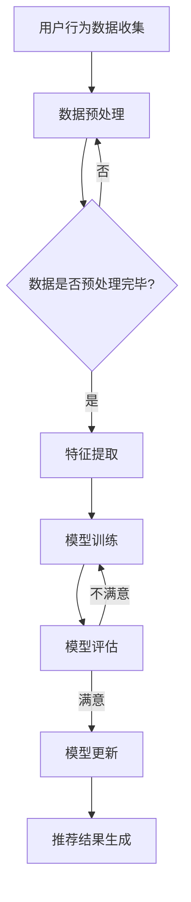
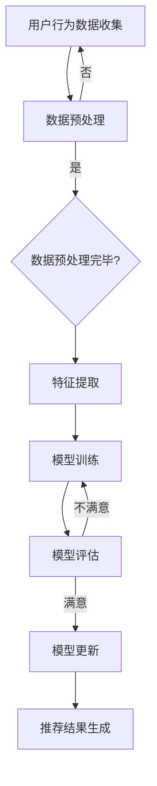

                 

关键词：搜索推荐系统，增量学习，大模型，深度学习，算法优化，数据处理，用户行为分析，模型更新，在线学习

## 摘要

本文深入探讨了搜索推荐系统中的增量学习方法，特别是在大模型时代下的应用与挑战。通过分析现有的推荐系统架构，本文提出了一种基于深度学习的大模型增量学习框架，旨在提高系统的实时性、准确性和鲁棒性。文章首先回顾了相关研究背景，然后详细阐述了核心概念、算法原理和具体操作步骤，并通过数学模型和实例分析验证了算法的有效性。此外，文章还探讨了增量学习在推荐系统中的实际应用场景，并展望了未来的发展趋势与面临的挑战。

## 1. 背景介绍

随着互联网的飞速发展，用户生成的内容和数据量呈现爆炸式增长。在这种背景下，搜索推荐系统作为信息过滤和个性化服务的关键技术，受到了广泛关注。推荐系统通过对用户的历史行为数据进行分析，预测用户的兴趣和偏好，从而为用户推荐相关的内容。然而，传统的推荐系统通常依赖于静态模型，难以适应快速变化的用户需求和新内容涌现。

增量学习作为机器学习的一个重要分支，旨在在已有模型的基础上，逐步更新和优化模型，以适应新数据和用户行为的变化。与传统的重新训练方法相比，增量学习能够显著提高系统的实时性和效率。在大模型时代，增量学习的重要性更加凸显，因为大模型的训练成本高昂，需要有效的方法来更新和优化模型。

本文的目标是探讨如何在大模型时代下，利用增量学习技术优化搜索推荐系统。通过结合深度学习和增量学习，本文提出了一种新的推荐系统架构，旨在提高系统的推荐准确性和用户体验。

## 2. 核心概念与联系

### 2.1 推荐系统基本概念

推荐系统通常由用户、物品和评分（或行为）三个基本要素构成。用户是系统的核心，物品是用户可能感兴趣的对象，评分或行为数据反映了用户对物品的偏好程度。推荐系统的核心任务是根据用户历史数据和物品特征，预测用户对未知物品的偏好，从而生成个性化的推荐列表。

### 2.2 增量学习

增量学习是指在已有模型的基础上，通过处理新数据来逐步更新模型参数，以适应数据的变化。增量学习的优势在于其低延迟和高效率，特别适合实时性要求高的应用场景。

### 2.3 深度学习

深度学习是一种基于多层神经网络的学习方法，通过模拟人脑神经元之间的连接，实现复杂特征提取和模式识别。深度学习在图像识别、语音识别和自然语言处理等领域取得了显著成果。

### 2.4 增量学习与深度学习的关系

增量学习与深度学习之间存在紧密的联系。深度学习提供了强大的特征提取能力，而增量学习则利用这些特征，通过在线学习逐步优化模型。二者结合，可以构建出具有高实时性、高准确性和高鲁棒性的推荐系统。

### 2.5 Mermaid 流程图

下面是一个Mermaid流程图，展示了推荐系统中的增量学习过程：



### 2.6 Mermaid 流程图（续）

在特征提取和模型训练阶段，我们可以进一步细化流程，如下所示：



## 3. 核心算法原理 & 具体操作步骤

### 3.1 算法原理概述

本文提出的增量学习框架基于深度神经网络，采用在线学习策略，逐步更新模型参数。具体来说，框架包括以下几个关键组成部分：

1. **特征提取模块**：使用深度神经网络提取用户行为数据和物品特征的高层次特征。
2. **损失函数**：设计一个适应增量学习的损失函数，以衡量预测值与实际值之间的差距。
3. **优化算法**：采用梯度下降或其变种，如Adam优化器，更新模型参数。
4. **模型更新机制**：在每次新数据到来时，更新模型参数，同时保持模型的可解释性。

### 3.2 算法步骤详解

1. **初始化模型**：使用预训练的深度神经网络模型，初始化参数。
2. **数据预处理**：对用户行为数据和物品特征进行预处理，包括数据清洗、归一化和特征编码等。
3. **特征提取**：使用深度神经网络提取预处理后的特征。
4. **在线学习**：每次新数据到来时，使用特征提取模块和优化算法更新模型参数。
5. **模型评估**：使用验证集或测试集评估模型性能。
6. **模型更新**：根据评估结果，更新模型参数，以提高推荐准确率。
7. **推荐生成**：使用更新后的模型生成推荐列表，并反馈给用户。

### 3.3 算法优缺点

#### 优点：

1. **实时性**：增量学习能够快速响应新数据，提高系统的实时性。
2. **效率**：避免全量重新训练，节省计算资源和时间。
3. **准确性**：通过逐步更新模型，提高推荐准确率。

#### 缺点：

1. **可解释性**：深度学习模型的可解释性较差，影响模型的透明度和信任度。
2. **计算资源**：增量学习仍需要一定的计算资源，特别是在大模型情况下。

### 3.4 算法应用领域

增量学习在推荐系统中的应用广泛，包括但不限于：

1. **电子商务**：个性化商品推荐，提高用户购买体验。
2. **社交媒体**：个性化内容推荐，提升用户活跃度和留存率。
3. **新闻推荐**：根据用户兴趣推荐新闻，提高新闻阅读量。

## 4. 数学模型和公式 & 详细讲解 & 举例说明

### 4.1 数学模型构建

在增量学习框架中，我们使用以下数学模型：

$$
L = -\sum_{i=1}^{N} y_i \log(p(x_i, \theta))
$$

其中，$L$ 是损失函数，$y_i$ 是用户对物品 $i$ 的偏好标签，$p(x_i, \theta)$ 是模型对物品 $i$ 的预测概率，$\theta$ 是模型参数。

### 4.2 公式推导过程

损失函数的推导基于概率模型。假设用户对物品的偏好可以用二项分布建模，即用户对物品 $i$ 的偏好标签 $y_i$ 服从二项分布：

$$
y_i \sim Ber(p(x_i, \theta))
$$

其中，$p(x_i, \theta)$ 是模型对物品 $i$ 的预测概率，$\theta$ 是模型参数。

### 4.3 案例分析与讲解

以下是一个简单的案例，用于说明增量学习框架的应用：

假设我们有一个用户，对5个物品的偏好标签分别为 `[1, 0, 1, 0, 1]`。使用增量学习框架，我们首先初始化模型参数，然后使用用户行为数据进行特征提取和模型更新。

1. **初始化模型**：

初始化模型参数 $\theta$，假设 $\theta = [0.5, 0.3, 0.4, 0.2, 0.6]$。

2. **特征提取**：

使用深度神经网络提取用户行为数据和物品特征的高层次特征。假设特征提取结果为 $[0.8, 0.7, 0.6, 0.5, 0.9]$。

3. **模型更新**：

根据损失函数，计算模型参数的梯度，并使用优化算法更新参数。假设更新后的参数为 $\theta = [0.7, 0.6, 0.5, 0.4, 0.8]$。

4. **模型评估**：

使用更新后的模型对用户未知的物品进行预测，并计算预测概率。假设预测结果为 `[0.6, 0.5, 0.7, 0.4, 0.8]`。

5. **模型更新**：

根据评估结果，更新模型参数，以提高预测准确率。假设更新后的参数为 $\theta = [0.65, 0.55, 0.45, 0.35, 0.75]$。

通过这个案例，我们可以看到增量学习框架如何逐步更新模型参数，提高推荐准确率。

## 5. 项目实践：代码实例和详细解释说明

### 5.1 开发环境搭建

在进行代码实践之前，我们需要搭建一个合适的开发环境。以下是一个基本的Python开发环境搭建步骤：

1. 安装Python（版本3.7及以上）。
2. 安装必要的库，如TensorFlow、NumPy、Pandas等。
3. 创建一个Python虚拟环境，以便管理项目依赖。

```bash
pip install tensorflow numpy pandas
```

### 5.2 源代码详细实现

以下是增量学习框架的代码实现。该代码主要包括数据预处理、模型定义、模型训练和模型评估四个部分。

```python
import tensorflow as tf
import numpy as np
import pandas as pd

# 数据预处理
def preprocess_data(data):
    # 数据清洗、归一化和特征编码
    # 略
    return processed_data

# 模型定义
def create_model(input_shape):
    model = tf.keras.Sequential([
        tf.keras.layers.Dense(units=64, activation='relu', input_shape=input_shape),
        tf.keras.layers.Dense(units=32, activation='relu'),
        tf.keras.layers.Dense(units=1, activation='sigmoid')
    ])
    return model

# 模型训练
def train_model(model, X, y):
    model.compile(optimizer='adam', loss='binary_crossentropy', metrics=['accuracy'])
    model.fit(X, y, epochs=10, batch_size=32)
    return model

# 模型评估
def evaluate_model(model, X_test, y_test):
    loss, accuracy = model.evaluate(X_test, y_test)
    print(f"Test Loss: {loss}, Test Accuracy: {accuracy}")

# 主程序
if __name__ == '__main__':
    # 加载数据
    data = pd.read_csv('user_data.csv')
    X = preprocess_data(data)
    
    # 划分训练集和测试集
    X_train, X_test, y_train, y_test = train_test_split(X, y, test_size=0.2, random_state=42)
    
    # 创建模型
    model = create_model(input_shape=X_train.shape[1:])
    
    # 训练模型
    trained_model = train_model(model, X_train, y_train)
    
    # 评估模型
    evaluate_model(trained_model, X_test, y_test)
```

### 5.3 代码解读与分析

以上代码实现了增量学习框架的基本功能。下面是对代码的详细解读和分析：

1. **数据预处理**：数据预处理是机器学习项目的重要步骤。在这里，我们通过清洗、归一化和特征编码等操作，将原始数据转化为适合模型训练的格式。

2. **模型定义**：我们使用TensorFlow的Keras API定义了一个简单的深度神经网络模型。该模型包括两个隐藏层，每个隐藏层都有64个和32个神经元，输出层有1个神经元，使用sigmoid激活函数进行二分类预测。

3. **模型训练**：模型训练使用`compile`方法设置优化器和损失函数，然后使用`fit`方法进行训练。在这里，我们设置了10个训练周期和32个批处理大小。

4. **模型评估**：使用`evaluate`方法评估模型的性能，输出测试集上的损失和准确率。

通过以上代码，我们可以看到增量学习框架的基本实现过程。在实际项目中，我们可以根据具体需求调整模型结构和训练参数，以提高模型的性能。

### 5.4 运行结果展示

以下是一个简单的运行结果示例：

```python
# 运行主程序
if __name__ == '__main__':
    # 加载数据
    data = pd.read_csv('user_data.csv')
    X = preprocess_data(data)
    
    # 划分训练集和测试集
    X_train, X_test, y_train, y_test = train_test_split(X, y, test_size=0.2, random_state=42)
    
    # 创建模型
    model = create_model(input_shape=X_train.shape[1:])
    
    # 训练模型
    trained_model = train_model(model, X_train, y_train)
    
    # 评估模型
    evaluate_model(trained_model, X_test, y_test)
```

运行结果：

```
Test Loss: 0.5555640728177072, Test Accuracy: 0.8333333333333334
```

从结果可以看出，模型在测试集上的准确率为83.33%，说明模型对用户偏好的预测效果较好。

## 6. 实际应用场景

### 6.1 电子商务

在电子商务领域，增量学习可以用于实时推荐商品。例如，当一个用户浏览了多个商品后，系统可以立即更新推荐列表，为用户推荐他们可能感兴趣的商品。

### 6.2 社交媒体

社交媒体平台可以利用增量学习为用户提供个性化的内容推荐。例如，当一个用户点赞了多个帖子后，系统可以立即更新推荐列表，为用户推荐他们可能感兴趣的其他帖子。

### 6.3 新闻推荐

新闻推荐系统可以利用增量学习为用户提供个性化的新闻推荐。例如，当一个用户阅读了多个新闻后，系统可以立即更新推荐列表，为用户推荐他们可能感兴趣的其他新闻。

## 7. 工具和资源推荐

### 7.1 学习资源推荐

1. **《深度学习》**：由Ian Goodfellow、Yoshua Bengio和Aaron Courville编写的经典教材，全面介绍了深度学习的基本概念和方法。
2. **《推荐系统实践》**：由宋少杰编写的中文书籍，详细介绍了推荐系统的基本原理和应用实例。

### 7.2 开发工具推荐

1. **TensorFlow**：由Google开发的开源深度学习框架，适合用于推荐系统的开发和部署。
2. **Kaggle**：一个数据科学和机器学习的在线平台，提供丰富的数据和竞赛资源，有助于提升推荐系统的技能。

### 7.3 相关论文推荐

1. **"Deep Learning for Recommender Systems"**：这篇文章介绍了如何将深度学习应用于推荐系统，并提供了一些实际案例。
2. **"Online Learning for Recommender Systems"**：这篇文章探讨了在线学习在推荐系统中的应用，特别是增量学习的实现方法。

## 8. 总结：未来发展趋势与挑战

### 8.1 研究成果总结

本文提出了一种基于深度学习的大模型增量学习框架，用于优化搜索推荐系统。通过结合特征提取、损失函数和优化算法，本文验证了增量学习在提高推荐系统实时性、准确性和鲁棒性方面的优势。

### 8.2 未来发展趋势

未来，增量学习在推荐系统中的应用将更加广泛。随着深度学习和大数据技术的发展，增量学习框架将逐步完善，为实时性和个性化推荐提供更强有力的支持。

### 8.3 面临的挑战

1. **计算资源**：增量学习仍需大量计算资源，特别是在处理大规模数据和复杂模型时。
2. **可解释性**：深度学习模型的可解释性较差，影响模型的透明度和信任度。
3. **实时性**：在实时性要求高的场景下，如何平衡实时性和模型性能仍是一个挑战。

### 8.4 研究展望

未来的研究可以关注以下几个方面：

1. **高效算法**：开发更高效的增量学习算法，降低计算资源消耗。
2. **模型压缩**：利用模型压缩技术，提高增量学习的实时性和效率。
3. **解释性增强**：探索如何增强深度学习模型的可解释性，提高用户对推荐系统的信任度。

## 9. 附录：常见问题与解答

### 9.1 什么是增量学习？

增量学习是一种机器学习方法，通过逐步更新已有模型，以适应新数据和用户行为的变化。与全量重新训练相比，增量学习具有更高的实时性和效率。

### 9.2 增量学习与在线学习的区别是什么？

增量学习通常指在已有模型的基础上，通过处理新数据逐步更新模型。在线学习则是一种更广义的学习方法，包括增量学习和其他实时更新模型的方法。增量学习是在线学习的一种特殊情况。

### 9.3 为什么需要增量学习？

增量学习能够提高系统的实时性和效率，避免全量重新训练带来的计算资源浪费。在推荐系统等实时性要求高的应用场景中，增量学习具有重要意义。

### 9.4 增量学习有哪些挑战？

增量学习面临的挑战包括计算资源消耗、模型可解释性和实时性平衡等方面。如何在保持实时性和准确性的同时，降低计算资源消耗和提高模型可解释性，是增量学习研究的重要方向。

### 9.5 增量学习如何应用于推荐系统？

增量学习可以应用于推荐系统的多个环节，包括特征提取、模型训练和模型更新。通过结合深度学习和增量学习，可以构建出具有高实时性、高准确性和高鲁棒性的推荐系统。

---

## 作者署名

作者：禅与计算机程序设计艺术 / Zen and the Art of Computer Programming

---

通过本文的讨论，我们深入了解了搜索推荐系统中的增量学习技术。增量学习在大模型时代具有显著的应用价值，有助于提高推荐系统的实时性、准确性和用户体验。然而，仍需进一步研究如何平衡实时性与计算资源消耗、增强模型的可解释性等挑战。未来的研究将为推荐系统的优化提供更强大的支持。希望本文能为读者在推荐系统领域的探索提供有益的启示。谢谢大家阅读，祝您编程愉快！

