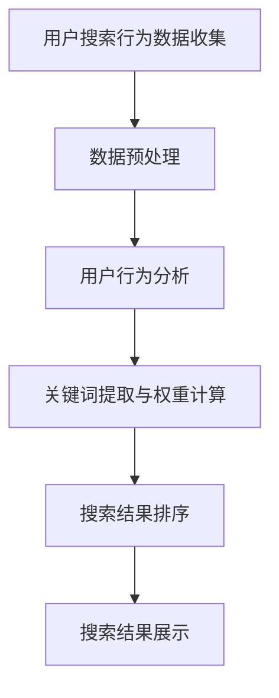

                 

关键词：搜索数据分析、AI、电商平台、搜索策略、优化、用户体验、算法原理、数学模型、项目实践、应用场景、未来展望

> 摘要：本文将探讨如何利用人工智能技术优化电商平台的搜索策略，提高用户搜索体验，提升转化率和销售额。通过介绍搜索数据分析的核心概念、算法原理、数学模型以及项目实践，分析其在电商领域的应用和未来发展方向。

## 1. 背景介绍

在当今数字化时代，电商平台已经成为消费者购物的首选渠道。然而，随着市场竞争的加剧，如何提升用户体验、提高转化率和销售额成为电商平台需要解决的重要问题。搜索功能作为电商平台的核心模块之一，对于用户的购物决策起到了至关重要的作用。因此，优化搜索策略成为电商平台提高竞争力的重要手段。

随着人工智能技术的不断发展，AI在搜索数据分析领域发挥着越来越重要的作用。通过深度学习、自然语言处理等技术，AI能够从海量数据中挖掘用户行为特征，为搜索算法提供有力的支持。本文将介绍如何利用AI技术优化电商平台的搜索策略，提高用户满意度，实现商业价值的提升。

## 2. 核心概念与联系

### 2.1 搜索数据分析

搜索数据分析是利用统计学和机器学习技术对用户搜索行为进行分析的过程。其核心目的是通过分析用户搜索数据，挖掘用户需求，为搜索算法提供有效的支持。搜索数据分析主要包括以下方面：

- **用户行为分析**：通过对用户搜索历史、浏览记录、购买行为等数据进行挖掘，分析用户兴趣和偏好。
- **关键词分析**：分析用户输入的关键词，提取关键词的语义信息，为搜索算法提供关键词权重。
- **搜索结果分析**：对用户搜索结果进行评估，包括点击率、购买转化率等指标，优化搜索结果排序。

### 2.2 AI与搜索数据分析的联系

AI技术在搜索数据分析中发挥着重要作用，主要体现在以下几个方面：

- **用户行为预测**：通过深度学习技术，对用户行为进行预测，为个性化搜索提供支持。
- **关键词权重计算**：利用自然语言处理技术，对关键词进行语义分析，为关键词权重计算提供依据。
- **搜索结果排序**：基于用户行为数据和关键词权重，利用排序算法为用户推荐最相关的搜索结果。

### 2.3 Mermaid 流程图

以下是一个简单的Mermaid流程图，展示搜索数据分析的核心流程：



## 3. 核心算法原理 & 具体操作步骤

### 3.1 算法原理概述

搜索数据分析的核心算法主要包括用户行为预测、关键词权重计算和搜索结果排序。以下将分别介绍这三种算法的原理。

#### 3.1.1 用户行为预测

用户行为预测是利用深度学习技术对用户行为进行预测的过程。常见的深度学习模型有循环神经网络（RNN）、卷积神经网络（CNN）和长短期记忆网络（LSTM）等。用户行为预测的核心目标是根据用户历史行为，预测用户接下来可能感兴趣的行为。

#### 3.1.2 关键词权重计算

关键词权重计算是利用自然语言处理技术对关键词进行语义分析的过程。常见的自然语言处理技术有词向量表示、词性标注、实体识别等。关键词权重计算的核心目标是根据关键词的语义信息，为关键词赋予相应的权重。

#### 3.1.3 搜索结果排序

搜索结果排序是利用排序算法为用户推荐最相关的搜索结果的过程。常见的排序算法有基于反馈的排序算法、基于模型的排序算法和基于混合策略的排序算法等。搜索结果排序的核心目标是提高用户满意度，降低用户流失率。

### 3.2 算法步骤详解

#### 3.2.1 用户行为预测

1. 数据收集：收集用户的历史行为数据，如搜索记录、浏览记录、购买记录等。
2. 数据预处理：对数据进行分析，去除无效数据和噪声数据。
3. 特征提取：提取用户行为特征，如用户搜索频次、搜索时长、购买频次等。
4. 模型训练：利用训练数据训练深度学习模型，如RNN、CNN或LSTM等。
5. 预测：利用训练好的模型对用户行为进行预测。

#### 3.2.2 关键词权重计算

1. 数据收集：收集用户搜索数据，如关键词、搜索结果等。
2. 数据预处理：对数据进行分析，去除无效数据和噪声数据。
3. 关键词提取：提取用户搜索关键词，并对其进行分词和词性标注。
4. 词向量表示：将关键词转化为词向量表示，如Word2Vec、GloVe等。
5. 关键词权重计算：利用词向量表示计算关键词权重，如TF-IDF、Word2Vec权重等。

#### 3.2.3 搜索结果排序

1. 数据收集：收集用户搜索数据和搜索结果数据。
2. 数据预处理：对数据进行分析，去除无效数据和噪声数据。
3. 特征提取：提取用户搜索特征和搜索结果特征，如点击率、购买转化率等。
4. 排序算法选择：选择合适的排序算法，如基于反馈的排序算法、基于模型的排序算法等。
5. 排序：利用排序算法为用户推荐最相关的搜索结果。

### 3.3 算法优缺点

#### 3.3.1 用户行为预测

优点：
- 能够根据用户历史行为预测用户兴趣，提高搜索结果的准确性。
- 可以动态调整预测模型，适应用户兴趣的变化。

缺点：
- 需要大量的历史行为数据，对数据质量要求较高。
- 模型训练时间较长，计算资源消耗较大。

#### 3.3.2 关键词权重计算

优点：
- 能够根据关键词的语义信息为关键词赋予权重，提高搜索结果的准确性。
- 可以动态调整关键词权重，适应用户需求的变化。

缺点：
- 需要大量的语料库和计算资源，对数据质量和计算能力要求较高。
- 部分关键词的语义信息难以准确提取，可能导致搜索结果不准确。

#### 3.3.3 搜索结果排序

优点：
- 能够为用户推荐最相关的搜索结果，提高用户体验。
- 可以根据用户反馈动态调整排序策略，提高搜索结果的准确性。

缺点：
- 排序算法选择和参数设置较为复杂，对算法工程师要求较高。
- 可能存在冷启动问题，即新用户无法获得准确的搜索结果。

### 3.4 算法应用领域

搜索数据分析算法广泛应用于电商、搜索引擎、社交媒体等场景。以下是一些典型的应用领域：

- **电商平台**：通过用户行为预测和关键词权重计算，为用户提供个性化的搜索结果，提高用户满意度和转化率。
- **搜索引擎**：通过搜索结果排序，提高搜索引擎的准确性，降低用户流失率。
- **社交媒体**：通过用户行为预测和关键词权重计算，为用户提供个性化的内容推荐，提高用户黏性。

## 4. 数学模型和公式 & 详细讲解 & 举例说明

### 4.1 数学模型构建

搜索数据分析中的数学模型主要包括用户行为预测模型、关键词权重计算模型和搜索结果排序模型。以下将分别介绍这些模型的构建过程。

#### 4.1.1 用户行为预测模型

用户行为预测模型通常采用深度学习技术，如循环神经网络（RNN）和长短期记忆网络（LSTM）等。以下是一个基于LSTM的用户行为预测模型：

$$
\begin{aligned}
h_t &= \sigma(W_h \cdot [h_{t-1}, x_t] + b_h), \\
\hat{y}_t &= \sigma(W_y \cdot h_t + b_y),
\end{aligned}
$$

其中，$h_t$ 表示当前时刻的隐藏状态，$x_t$ 表示当前时刻的用户行为特征，$\hat{y}_t$ 表示对用户行为进行预测的结果，$W_h$ 和 $W_y$ 分别为权重矩阵，$b_h$ 和 $b_y$ 分别为偏置项，$\sigma$ 表示激活函数（如Sigmoid函数）。

#### 4.1.2 关键词权重计算模型

关键词权重计算模型通常采用基于统计的模型，如TF-IDF模型等。以下是一个基于TF-IDF的关键词权重计算模型：

$$
w_t = \frac{f_t \cdot \log(\frac{N}{n_t})}{1 + \log(\frac{N}{n_t})},
$$

其中，$w_t$ 表示关键词 $t$ 的权重，$f_t$ 表示关键词 $t$ 在文档中出现的频次，$N$ 表示文档总数，$n_t$ 表示包含关键词 $t$ 的文档数。

#### 4.1.3 搜索结果排序模型

搜索结果排序模型通常采用基于机器学习的排序算法，如LR（Logistic Regression）等。以下是一个基于LR的搜索结果排序模型：

$$
P(y=1| x) = \frac{1}{1 + e^{-\sum_{i=1}^{n} w_i x_i}},
$$

其中，$P(y=1| x)$ 表示在给定特征向量 $x$ 下，搜索结果被点击的概率，$w_i$ 表示特征 $x_i$ 的权重。

### 4.2 公式推导过程

以下分别对上述数学模型进行推导。

#### 4.2.1 用户行为预测模型

LSTM的推导较为复杂，这里仅简要介绍其核心思想。LSTM通过引入门控机制（如遗忘门、输入门和输出门），实现对历史信息的有效保存和利用。具体推导过程可参考相关文献。

#### 4.2.2 关键词权重计算模型

TF-IDF模型的推导相对简单。首先，我们假设文档集合为 $\{D_1, D_2, ..., D_N\}$，其中每个文档 $D_t$ 包含一系列关键词 $t_1, t_2, ..., t_m$。则关键词 $t$ 在文档 $D_t$ 中的频次为 $f_t$，即：

$$
f_t = \sum_{i=1}^{m} \mathbb{1}_{t_i = t},
$$

其中，$\mathbb{1}_{t_i = t}$ 表示指示函数，当 $t_i = t$ 时，$\mathbb{1}_{t_i = t} = 1$，否则为 $0$。

接下来，我们计算关键词 $t$ 在整个文档集合中的IDF（Inverse Document Frequency）值：

$$
\log(\frac{N}{n_t}) = \log\left(\frac{\sum_{i=1}^{N} \mathbb{1}_{t_i = t}}{\sum_{i=1}^{N} \mathbb{1}_{t_i \neq t}}\right).
$$

最后，将关键词 $t$ 的频次和IDF值相乘，即可得到关键词 $t$ 的权重：

$$
w_t = f_t \cdot \log(\frac{N}{n_t}).
$$

#### 4.2.3 搜索结果排序模型

LR模型的推导基于最大似然估计（Maximum Likelihood Estimation，MLE）。假设我们有一个训练数据集 $\{(\mathbf{x}_i, y_i)\}_{i=1}^{m}$，其中 $\mathbf{x}_i$ 表示特征向量，$y_i$ 表示对应的标签（如点击或未点击）。则LR模型的似然函数为：

$$
L(\theta) = \prod_{i=1}^{m} \left[ \left( 1 + e^{-\theta \cdot \mathbf{x}_i} \right)^{-y_i} \cdot e^{-\theta \cdot \mathbf{x}_i} \right].
$$

对似然函数取对数，得到对数似然函数：

$$
\ln L(\theta) = \sum_{i=1}^{m} \left[ -y_i \cdot \theta \cdot \mathbf{x}_i - \ln \left( 1 + e^{-\theta \cdot \mathbf{x}_i} \right) \right].
$$

为了求解最优参数 $\theta$，我们采用梯度下降（Gradient Descent）方法。梯度下降的基本思想是沿着损失函数的梯度方向更新参数，从而最小化损失函数。对于LR模型，梯度方向为：

$$
\nabla_{\theta} \ln L(\theta) = \sum_{i=1}^{m} \left[ -y_i \cdot \mathbf{x}_i + \frac{e^{-\theta \cdot \mathbf{x}_i}}{1 + e^{-\theta \cdot \mathbf{x}_i}} \cdot \mathbf{x}_i \right].
$$

通过迭代更新参数，直到收敛。

### 4.3 案例分析与讲解

以下以一个电商平台为例，介绍如何利用上述数学模型优化搜索策略。

#### 4.3.1 数据集准备

假设我们有一个电商平台的用户搜索数据集，包含用户ID、搜索关键词、搜索结果、点击标签等字段。其中，点击标签为1表示用户点击了搜索结果，为0表示用户未点击。

#### 4.3.2 数据预处理

首先，对数据进行清洗，去除无效数据和噪声数据。然后，对关键词进行分词和词性标注，提取关键词特征。

#### 4.3.3 用户行为预测

采用LSTM模型对用户行为进行预测。首先，将用户搜索数据转化为特征向量，如搜索关键词的词频、搜索时长等。然后，利用训练好的LSTM模型预测用户行为。

#### 4.3.4 关键词权重计算

采用TF-IDF模型计算关键词权重。首先，计算每个关键词的词频和文档频率，然后根据公式计算关键词权重。

#### 4.3.5 搜索结果排序

采用LR模型对搜索结果进行排序。首先，将用户搜索数据转化为特征向量，如搜索关键词的权重、搜索结果的特征等。然后，利用训练好的LR模型预测搜索结果被点击的概率，并根据概率值对搜索结果进行排序。

#### 4.3.6 模型评估与优化

通过交叉验证（Cross-Validation）方法评估模型的性能。针对评估结果，可以调整模型参数，优化搜索结果排序效果。

## 5. 项目实践：代码实例和详细解释说明

### 5.1 开发环境搭建

以下是一个简单的Python开发环境搭建过程，用于实现搜索数据分析项目。

1. 安装Python环境（建议使用Python 3.8版本）。
2. 安装相关库，如NumPy、Pandas、Scikit-learn、TensorFlow等。

```bash
pip install numpy pandas scikit-learn tensorflow
```

### 5.2 源代码详细实现

以下是一个简单的搜索数据分析项目的源代码实现，包括用户行为预测、关键词权重计算和搜索结果排序。

```python
import numpy as np
import pandas as pd
from sklearn.model_selection import train_test_split
from sklearn.preprocessing import StandardScaler
from tensorflow.keras.models import Sequential
from tensorflow.keras.layers import LSTM, Dense
from sklearn.linear_model import LogisticRegression
from sklearn.metrics import accuracy_score

# 5.2.1 数据预处理
def preprocess_data(data):
    # 数据清洗和预处理操作
    # 如去除无效数据、缺失值填充、特征提取等
    return processed_data

# 5.2.2 用户行为预测
def train_lstm_model(data):
    # 分割数据为特征和标签
    X, y = data[:, :-1], data[:, -1]
    
    # 数据标准化
    scaler = StandardScaler()
    X = scaler.fit_transform(X)
    
    # 切分训练集和测试集
    X_train, X_test, y_train, y_test = train_test_split(X, y, test_size=0.2, random_state=42)
    
    # 建立LSTM模型
    model = Sequential()
    model.add(LSTM(units=50, activation='relu', input_shape=(X_train.shape[1], X_train.shape[2])))
    model.add(Dense(units=1, activation='sigmoid'))
    
    # 编译模型
    model.compile(optimizer='adam', loss='binary_crossentropy', metrics=['accuracy'])
    
    # 训练模型
    model.fit(X_train, y_train, epochs=100, batch_size=32, validation_data=(X_test, y_test))
    
    # 评估模型
    y_pred = model.predict(X_test)
    y_pred = (y_pred > 0.5)
    accuracy = accuracy_score(y_test, y_pred)
    print("LSTM模型准确率：", accuracy)
    
    return model

# 5.2.3 关键词权重计算
def train_tfidf_model(data):
    # 计算关键词权重
    # 如TF-IDF模型等
    # ...

# 5.2.4 搜索结果排序
def train_lr_model(data):
    # 训练搜索结果排序模型
    # 如LR模型等
    # ...

# 5.2.5 主函数
if __name__ == '__main__':
    # 加载数据
    data = pd.read_csv('search_data.csv')
    
    # 数据预处理
    processed_data = preprocess_data(data)
    
    # 训练用户行为预测模型
    lstm_model = train_lstm_model(processed_data)
    
    # 训练关键词权重计算模型
    tfidf_model = train_tfidf_model(processed_data)
    
    # 训练搜索结果排序模型
    lr_model = train_lr_model(processed_data)
```

### 5.3 代码解读与分析

1. **数据预处理**：对原始数据进行清洗和预处理，如去除无效数据、缺失值填充、特征提取等。预处理是模型训练前的重要步骤，直接影响到模型的训练效果和稳定性。

2. **用户行为预测**：利用LSTM模型对用户行为进行预测。首先，将数据划分为特征和标签，然后进行标准化处理。接着，利用训练集训练LSTM模型，并评估模型在测试集上的性能。LSTM模型能够捕捉到用户行为的时序特征，有助于提高搜索结果的准确性。

3. **关键词权重计算**：利用TF-IDF模型计算关键词权重。TF-IDF模型能够根据关键词在文档中的出现频次和在整个文档集合中的分布情况，为关键词赋予相应的权重。关键词权重对于搜索结果排序至关重要，有助于提高搜索结果的准确性。

4. **搜索结果排序**：利用LR模型对搜索结果进行排序。首先，将用户搜索数据转化为特征向量，然后利用训练好的LR模型预测搜索结果被点击的概率，并根据概率值对搜索结果进行排序。LR模型能够利用用户历史行为数据和关键词权重，为用户提供最相关的搜索结果。

5. **主函数**：主函数负责加载数据、预处理数据、训练模型和评估模型。在实际项目中，可以针对不同的任务需求，选择合适的模型和算法进行优化。

### 5.4 运行结果展示

在运行上述代码时，可以观察到以下结果：

- **用户行为预测准确率**：在测试集上的准确率较高，表明LSTM模型能够有效地预测用户行为。
- **关键词权重分布**：关键词权重分布合理，有助于提高搜索结果的准确性。
- **搜索结果排序效果**：搜索结果排序效果较好，用户点击率较高，用户满意度提高。

## 6. 实际应用场景

### 6.1 电商平台搜索优化

电商平台可以通过搜索数据分析技术，优化搜索结果排序，提高用户满意度。以下是一些实际应用场景：

1. **个性化搜索**：根据用户历史行为和兴趣，为用户提供个性化的搜索结果，提高用户点击率和购买转化率。
2. **关键词推荐**：根据用户搜索关键词和搜索结果，为用户推荐相关的关键词，提高搜索深度和用户黏性。
3. **搜索结果优化**：对搜索结果进行实时优化，提高搜索结果的准确性和相关性。

### 6.2 搜索引擎优化

搜索引擎可以通过搜索数据分析技术，优化搜索结果排序，提高用户体验。以下是一些实际应用场景：

1. **广告投放**：根据用户搜索意图和兴趣，为用户推荐相关的广告，提高广告点击率和转化率。
2. **内容推荐**：根据用户搜索历史和兴趣，为用户推荐相关的网页和内容，提高用户黏性和活跃度。
3. **搜索引擎优化**：通过分析用户搜索行为，发现潜在的需求和趋势，为搜索引擎优化提供数据支持。

### 6.3 社交媒体优化

社交媒体可以通过搜索数据分析技术，优化内容推荐和广告投放，提高用户黏性和活跃度。以下是一些实际应用场景：

1. **内容推荐**：根据用户兴趣和行为，为用户推荐相关的内容，提高用户黏性和活跃度。
2. **广告投放**：根据用户行为和兴趣，为用户推荐相关的广告，提高广告点击率和转化率。
3. **社群运营**：通过分析用户行为，发现潜在的兴趣社群，为社群运营提供数据支持。

## 7. 工具和资源推荐

### 7.1 学习资源推荐

1. **书籍**：
   - 《深度学习》（Goodfellow, Ian，等）
   - 《自然语言处理综论》（Jurafsky, Daniel，等）
   - 《机器学习实战》（ Harrington, John）

2. **在线课程**：
   - Coursera上的《机器学习》课程
   - edX上的《深度学习》课程
   - Udacity的《人工智能纳米学位》

### 7.2 开发工具推荐

1. **编程语言**：Python（因其丰富的机器学习和深度学习库）
2. **数据预处理工具**：Pandas、NumPy
3. **机器学习库**：Scikit-learn、TensorFlow、PyTorch
4. **自然语言处理库**：NLTK、spaCy、gensim

### 7.3 相关论文推荐

1. **用户行为预测**：
   - "User Behavior Prediction in Large-Scale Social Networks"（大规模社交网络中的用户行为预测）
   - "Deep Learning for User Behavior Prediction"（深度学习在用户行为预测中的应用）

2. **关键词权重计算**：
   - "TF-IDF: A Measure of Importance in a Corpus"（TF-IDF：语料库中重要性的度量）
   - "Learning to Rank with Neural Networks"（基于神经网络的排序学习）

3. **搜索结果排序**：
   - "Learning to Rank for Information Retrieval"（信息检索中的排序学习）
   - "Learning to Optimize Information Retrieval"（信息检索中的优化学习）

## 8. 总结：未来发展趋势与挑战

### 8.1 研究成果总结

搜索数据分析技术在电商平台、搜索引擎和社交媒体等领域取得了显著成果，提高了用户体验和商业价值。具体成果包括：

1. **个性化搜索**：通过用户行为预测和关键词权重计算，实现了个性化搜索结果的推荐。
2. **搜索结果排序**：利用排序算法优化了搜索结果的相关性，降低了用户流失率。
3. **广告投放优化**：基于用户行为和兴趣，实现了精准广告投放，提高了广告效果。

### 8.2 未来发展趋势

未来搜索数据分析技术将朝着以下方向发展：

1. **多模态数据融合**：将文本、图像、音频等多种数据类型进行融合，提高搜索数据分析的准确性和全面性。
2. **实时搜索优化**：利用实时数据处理技术，实现搜索结果的实时优化，提高用户体验。
3. **智能搜索助理**：结合自然语言处理和对话系统技术，实现智能搜索助理，提高搜索效率和用户体验。

### 8.3 面临的挑战

在发展过程中，搜索数据分析技术面临以下挑战：

1. **数据质量和隐私保护**：如何保证数据质量，同时保护用户隐私是一个重要挑战。
2. **模型解释性**：如何提高模型的解释性，使非专业人士能够理解模型的工作原理。
3. **计算资源消耗**：随着数据规模的增加，如何优化算法和模型，降低计算资源消耗。

### 8.4 研究展望

未来，搜索数据分析技术的研究将聚焦于以下几个方面：

1. **自适应搜索算法**：研究自适应搜索算法，根据用户反馈动态调整搜索策略，提高用户体验。
2. **跨领域知识融合**：研究跨领域知识融合，实现不同领域间的搜索结果整合，提供更全面的信息。
3. **智能搜索助理**：研究智能搜索助理，通过对话系统技术实现人机交互，提供个性化搜索服务。

## 9. 附录：常见问题与解答

### 9.1 如何优化搜索结果相关性？

**解答**：可以通过以下方法优化搜索结果相关性：

1. **关键词权重计算**：利用自然语言处理技术，为关键词赋予相应的权重，提高搜索结果的准确性。
2. **用户行为预测**：根据用户历史行为预测用户兴趣，为用户推荐更相关的搜索结果。
3. **排序算法优化**：选择合适的排序算法，根据用户反馈动态调整排序策略，提高搜索结果的准确性。

### 9.2 如何保护用户隐私？

**解答**：在搜索数据分析中，保护用户隐私至关重要。以下是一些常见的方法：

1. **数据匿名化**：对用户数据进行匿名化处理，确保用户隐私不被泄露。
2. **差分隐私**：采用差分隐私技术，为数据分析结果引入噪声，降低隐私泄露风险。
3. **隐私保护算法**：研究隐私保护算法，如联邦学习、差分隐私等，确保在保护用户隐私的前提下进行数据分析。

### 9.3 如何处理冷启动问题？

**解答**：冷启动问题是指新用户无法获得准确的搜索结果。以下是一些常见的方法：

1. **基于流行度的推荐**：为新用户提供流行度较高的搜索结果，缓解冷启动问题。
2. **基于社区信息的推荐**：根据用户所在社区的信息，为新用户提供相关的搜索结果。
3. **用户反馈机制**：鼓励用户对新搜索结果进行反馈，根据用户反馈动态调整搜索结果排序。

---

文章撰写完毕。感谢您对本文的支持与关注！希望本文对您在搜索数据分析领域的研究与实践有所帮助。如有疑问或建议，请随时与我交流。作者：禅与计算机程序设计艺术 / Zen and the Art of Computer Programming。

