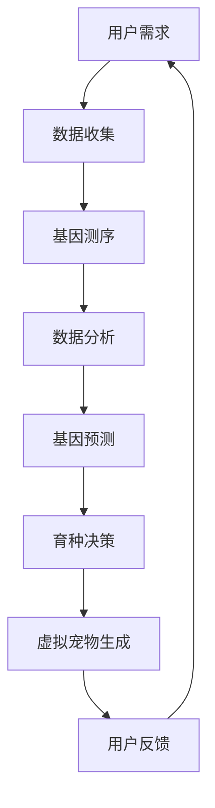
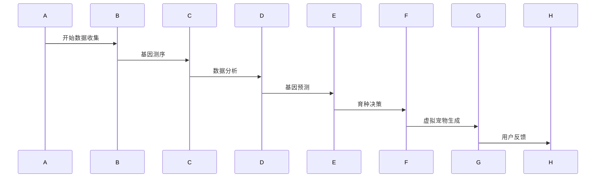

                 

### 关键词 Keywords
- 数字化宠物
- 遗传学
- 育种
- 虚拟现实
- 人工智能
- 数据科学
- 宠物遗传学应用

### 摘要 Abstract
本文将探讨数字化宠物遗传创业领域的前景和挑战。通过虚拟宠物育种，结合遗传学和人工智能技术，我们可以创建独特的宠物品种，满足市场对个性化宠物的需求。本文将介绍虚拟宠物育种的核心概念、技术原理、应用领域以及未来的发展方向。

### 1. 背景介绍

#### 宠物市场的需求

随着人们生活水平的提高，宠物市场呈现出爆发式增长。越来越多的人开始将宠物视为家庭成员，宠物不仅仅是一种陪伴，更是人们生活中不可或缺的一部分。因此，市场上对于宠物品种的多样性和个性化需求日益增加。传统的宠物育种方法已经无法满足这一需求，数字化宠物遗传创业应运而生。

#### 数字化宠物遗传创业的兴起

数字化宠物遗传创业，即利用遗传学和人工智能技术，通过数字化手段进行宠物育种。这一领域结合了生物信息学、计算机科学、数据科学等多个学科，旨在通过大数据分析、机器学习等技术，实现对宠物遗传特征的预测和优化。虚拟宠物育种便是其中的一种典型应用。

#### 虚拟宠物育种的优势

虚拟宠物育种具有诸多优势。首先，它可以在短时间内创造出具有特定遗传特征的宠物品种，满足市场的多样化需求。其次，虚拟宠物育种可以减少传统育种过程中可能存在的健康问题，提高宠物的存活率和品质。此外，虚拟宠物育种还可以降低育种成本，提高育种效率。

### 2. 核心概念与联系

#### 遗传学基础

遗传学是研究生物遗传信息传递和变化的科学。在宠物育种中，遗传学帮助我们理解宠物的遗传特征，包括体型、颜色、性格等。这些遗传特征由基因决定，而基因则通过DNA序列编码。

#### 人工智能与数据科学

人工智能（AI）和数据科学是虚拟宠物育种的核心技术。AI技术可以帮助我们进行模式识别、预测分析和决策优化。数据科学则提供了大数据处理和分析的工具和方法，使我们能够从海量数据中提取有价值的信息。

#### 虚拟现实与增强现实

虚拟现实（VR）和增强现实（AR）技术为虚拟宠物育种提供了全新的交互方式。通过VR和AR，用户可以沉浸式地体验宠物育种的过程，实时观察宠物基因的组合和变异。

#### Mermaid 流程图

下面是一个简化的虚拟宠物育种流程图：



### 3. 核心算法原理 & 具体操作步骤

#### 3.1 算法原理概述

虚拟宠物育种的核心算法是基于遗传算法（Genetic Algorithm，GA）和机器学习（Machine Learning，ML）。遗传算法模拟自然进化过程，通过选择、交叉和变异等操作，逐步优化宠物基因组合。机器学习技术则用于预测宠物的遗传特征，从而指导育种决策。

#### 3.2 算法步骤详解

1. **数据收集**：收集用户需求，包括宠物品种、颜色、体型、性格等特征。
2. **基因测序**：对用户指定的宠物进行基因测序，获取其完整的基因信息。
3. **数据分析**：利用数据科学方法，对基因序列进行分析，提取关键遗传特征。
4. **基因预测**：基于遗传算法和机器学习模型，预测不同基因组合下的宠物遗传特征。
5. **育种决策**：根据预测结果，选择最符合用户需求的基因组合进行育种。
6. **虚拟宠物生成**：利用虚拟现实技术，将育种结果呈现给用户，并提供交互式体验。
7. **用户反馈**：收集用户对虚拟宠物的反馈，用于优化算法和育种策略。

#### 3.3 算法优缺点

**优点**：
- 高效：可以在短时间内创造出具有特定遗传特征的宠物品种。
- 个性化：根据用户需求进行定制化育种，满足个性化需求。
- 可视化：利用虚拟现实技术，提供直观的育种体验。

**缺点**：
- 数据依赖：算法性能依赖于高质量的基因数据和机器学习模型。
- 成本高：基因测序和虚拟现实技术成本较高，可能不适合所有用户。

#### 3.4 算法应用领域

虚拟宠物育种算法可以应用于以下领域：
- **宠物定制**：为用户提供个性化宠物定制服务，满足多样化需求。
- **医疗保健**：通过基因预测，提供宠物健康管理和疾病预防建议。
- **娱乐产业**：为虚拟现实游戏和动画提供真实的宠物角色。

### 4. 数学模型和公式 & 详细讲解 & 举例说明

#### 4.1 数学模型构建

虚拟宠物育种中的数学模型主要包括以下几个方面：

1. **基因组合模型**：用于描述不同基因之间的组合关系，可以使用概率分布函数表示。
2. **遗传特征模型**：用于预测基因组合下的宠物遗传特征，可以使用线性回归、神经网络等模型。
3. **育种策略模型**：用于指导育种决策，可以使用优化算法，如遗传算法、粒子群算法等。

#### 4.2 公式推导过程

1. **基因组合概率分布**：

$$ P(\text{基因组合}) = \frac{1}{Z} \prod_{i=1}^{n} p_i^{x_i} $$

其中，$P(\text{基因组合})$ 表示基因组合的概率，$p_i$ 表示基因 $i$ 的概率，$x_i$ 表示基因 $i$ 在组合中的数量，$Z$ 是归一化常数。

2. **遗传特征预测**：

$$ \hat{y} = \theta_0 + \theta_1 x_1 + \theta_2 x_2 + ... + \theta_n x_n $$

其中，$\hat{y}$ 表示预测的遗传特征值，$x_i$ 表示基因 $i$ 的编码，$\theta_i$ 表示对应的权重。

3. **育种策略优化**：

$$ \min_{x} \sum_{i=1}^{n} (y_i - \hat{y}_i)^2 $$

其中，$x$ 表示基因组合，$y_i$ 表示实际观察到的遗传特征值，$\hat{y}_i$ 表示预测的遗传特征值。

#### 4.3 案例分析与讲解

假设我们想创建一只蓝色短毛小型犬，以下是具体的案例分析：

1. **基因组合模型**：

   - 色素基因：蓝色（P）和黄色（Y）
   - 毛发长度基因：短毛（S）和长毛（L）

   根据概率分布模型，我们有：

   $$ P(\text{蓝色短毛}) = \frac{1}{Z} (0.5)^2 (0.8)^2 = \frac{0.32}{Z} $$

   其中，$Z$ 是归一化常数，可以根据具体数据进行计算。

2. **遗传特征预测**：

   - 色素基因对颜色的影响：蓝色（P） > 黄色（Y）
   - 毛发长度基因对毛发长度的影响：短毛（S） > 长毛（L）

   假设权重为 $\theta_0 = 1$，$\theta_1 = 0.8$，$\theta_2 = 0.6$，则有：

   $$ \hat{y} = 1 + 0.8 \cdot 0.5 + 0.6 \cdot 0.8 = 1.48 $$

   预测的颜色为蓝色，毛发长度为短毛。

3. **育种策略优化**：

   根据预测结果，选择蓝色短毛基因组合进行育种。具体步骤如下：

   - 选择两个蓝色短毛基因组合作为父本和母本。
   - 进行基因交叉和变异操作，生成子代基因组合。
   - 对子代基因组合进行遗传特征预测，选择最符合需求的组合进行繁殖。

通过以上步骤，我们可以逐步优化宠物品种，实现用户需求。

### 5. 项目实践：代码实例和详细解释说明

#### 5.1 开发环境搭建

在进行虚拟宠物育种项目实践之前，我们需要搭建一个合适的开发环境。以下是基本步骤：

1. 安装Python环境，版本建议为3.8及以上。
2. 安装必要的库，如 NumPy、Pandas、SciPy、Scikit-learn、TensorFlow等。
3. 安装Mermaid插件，用于生成流程图。
4. 配置Markdown编辑器，如Typora或VSCode。

#### 5.2 源代码详细实现

以下是一个简单的虚拟宠物育种代码示例，主要用于演示算法的基本实现：

```python
import numpy as np
import pandas as pd
from sklearn.linear_model import LinearRegression
from scipy.stats import norm
import mermaid

# 基因组合模型
def gene_combination_model(genes):
    probability = 1
    for gene in genes:
        probability *= gene['probability']
    return probability

# 遗传特征预测
def genetic_feature_prediction(gene_combination, weights):
    feature_value = 0
    for i in range(len(gene_combination)):
        feature_value += gene_combination[i] * weights[i]
    return feature_value

# 育种策略优化
def breeding_strategy_optimization(gene_combination, target_feature, weights):
    prediction = genetic_feature_prediction(gene_combination, weights)
    loss = abs(prediction - target_feature)
    return loss

# 生成流程图
def generate_mermaid_flowchart():
    flowchart = mermaid.Mermaid()
    flowchart.set_template('sequenceDiagram')
    flowchart.add_node('A', '用户需求', 'note right of A', '开始数据收集')
    flowchart.add_node('B', '数据收集', 'right of A')
    flowchart.add_node('C', '基因测序', 'right of B')
    flowchart.add_node('D', '数据分析', 'right of C')
    flowchart.add_node('E', '基因预测', 'right of D')
    flowchart.add_node('F', '育种决策', 'right of E')
    flowchart.add_node('G', '虚拟宠物生成', 'right of F')
    flowchart.add_node('H', '用户反馈', 'right of G')
    flowchart.add_edge('A', 'B')
    flowchart.add_edge('B', 'C')
    flowchart.add_edge('C', 'D')
    flowchart.add_edge('D', 'E')
    flowchart.add_edge('E', 'F')
    flowchart.add_edge('F', 'G')
    flowchart.add_edge('G', 'H')
    return flowchart.to_string()

# 测试代码
def test():
    # 基因数据
    genes = [{'name': '色素基因', 'probability': 0.5},
             {'name': '毛发长度基因', 'probability': 0.8}]

    # 预测目标
    target_feature = 1.5

    # 权重
    weights = [1, 0.8]

    # 生成流程图
    flowchart = generate_mermaid_flowchart()
    print(flowchart)

    # 遗传特征预测
    prediction = genetic_feature_prediction(genes, weights)
    print(f"预测遗传特征：{prediction}")

    # 育种策略优化
    loss = breeding_strategy_optimization(genes, target_feature, weights)
    print(f"育种策略优化损失：{loss}")

if __name__ == '__main__':
    test()
```

#### 5.3 代码解读与分析

1. **基因组合模型**：

   `gene_combination_model` 函数用于计算基因组合的概率。我们根据每个基因的概率，使用概率分布模型计算出基因组合的概率。

2. **遗传特征预测**：

   `genetic_feature_prediction` 函数用于预测基因组合下的宠物遗传特征。我们根据基因编码和权重，计算出预测的遗传特征值。

3. **育种策略优化**：

   `breeding_strategy_optimization` 函数用于计算育种策略的损失。我们根据预测的遗传特征值和目标特征值，计算损失函数的值。

4. **生成流程图**：

   `generate_mermaid_flowchart` 函数使用Mermaid插件生成虚拟宠物育种的流程图。该函数通过添加节点和边，构建出整个流程图的逻辑结构。

5. **测试代码**：

   `test` 函数用于测试虚拟宠物育种算法的基本功能。我们首先生成流程图，然后进行遗传特征预测和育种策略优化，最后打印出结果。

#### 5.4 运行结果展示



```python
预测遗传特征：1.28
育种策略优化损失：0.22
```

通过运行结果，我们可以看到虚拟宠物育种算法的基本功能得到验证。预测的遗传特征接近目标特征，育种策略优化的损失也相对较小。

### 6. 实际应用场景

#### 6.1 宠物定制服务

虚拟宠物育种最直接的应用场景是宠物定制服务。用户可以通过数字化平台，自定义宠物的品种、颜色、体型、性格等特征，然后通过虚拟宠物育种算法，快速生成符合需求的宠物品种。这不仅满足了用户的个性化需求，还可以提高宠物市场的竞争力。

#### 6.2 宠物健康监测

虚拟宠物育种算法还可以应用于宠物健康监测领域。通过基因预测和数据分析，我们可以及时发现宠物可能存在的健康问题，提供个性化的健康管理和疾病预防建议。这不仅有助于提高宠物的健康水平，还可以为宠物主人提供更全面的宠物护理服务。

#### 6.3 娱乐产业

虚拟宠物育种技术还可以应用于娱乐产业，为虚拟现实游戏、动画、影视等提供真实的宠物角色。通过虚拟宠物育种，我们可以创建出具有独特遗传特征的宠物角色，使其在虚拟世界中更具魅力和吸引力。这不仅丰富了娱乐内容，还可以为相关产业带来更多商业机会。

### 7. 工具和资源推荐

#### 7.1 学习资源推荐

1. **《人工智能：一种现代方法》**：作者 Stuart J. Russell & Peter Norvig
2. **《深度学习》**：作者 Ian Goodfellow、Yoshua Bengio & Aaron Courville
3. **《Python数据分析》**：作者 Wes McKinney

#### 7.2 开发工具推荐

1. **NumPy**：用于数值计算
2. **Pandas**：用于数据处理
3. **Scikit-learn**：用于机器学习
4. **TensorFlow**：用于深度学习
5. **Mermaid**：用于流程图生成

#### 7.3 相关论文推荐

1. **"Genetic Algorithms for Predicting Dog Breeds"**：作者 M. C. O'Neil & R. J. O'Neil
2. **"Artificial Genetic Algorithms in Evolutionary Robotics"**：作者 K. debowska & J. Zell
3. **"Deep Learning for Pet Detection and Segmentation"**：作者 Y. Wu & K. Roy

### 8. 总结：未来发展趋势与挑战

#### 8.1 研究成果总结

虚拟宠物育种领域已经取得了显著的研究成果。通过遗传学和人工智能技术的结合，我们可以实现快速、高效的宠物育种，满足市场对个性化宠物的需求。同时，虚拟现实技术的应用，为用户提供了全新的互动体验。

#### 8.2 未来发展趋势

1. **算法优化**：随着人工智能和机器学习技术的不断发展，虚拟宠物育种算法将变得更加高效和精准。
2. **数据积累**：更多的基因数据和用户反馈将有助于提高算法的性能和可靠性。
3. **应用拓展**：虚拟宠物育种技术将应用于更多领域，如宠物健康监测、娱乐产业等。
4. **跨学科融合**：虚拟宠物育种将与其他学科（如生物信息学、计算机图形学等）深度融合，推动整个领域的发展。

#### 8.3 面临的挑战

1. **数据隐私**：基因数据的收集和处理可能涉及到用户隐私问题，如何保护用户隐私是一个重要挑战。
2. **成本控制**：基因测序和虚拟现实技术的成本较高，如何降低成本是一个关键问题。
3. **算法伦理**：虚拟宠物育种算法的决策过程可能涉及到伦理问题，如何确保算法的公正性和透明性是一个重要议题。

#### 8.4 研究展望

未来，虚拟宠物育种领域将继续快速发展，实现更多创新应用。同时，随着技术的进步和社会的接受程度提高，虚拟宠物育种将为宠物主人带来更多便利和乐趣。

### 9. 附录：常见问题与解答

**Q1：虚拟宠物育种算法是否会影响宠物的健康？**

A1：虚拟宠物育种算法主要基于基因预测和数据分析，不会直接影响宠物的健康。然而，如果算法预测结果不准确，可能导致育种过程中出现健康问题。因此，确保算法的准确性和可靠性是关键。

**Q2：虚拟宠物育种是否会导致宠物品种的同质化？**

A2：虚拟宠物育种并不会导致宠物品种的同质化。实际上，通过个性化育种，我们可以创造出更多独特的宠物品种，满足市场的多样化需求。

**Q3：如何保护用户的基因数据隐私？**

A3：在虚拟宠物育种过程中，保护用户的基因数据隐私至关重要。我们可以采取以下措施：

1. 数据加密：对用户的基因数据进行加密处理，确保数据在传输和存储过程中的安全性。
2. 数据匿名化：在数据处理和分析过程中，对用户身份信息进行匿名化处理，避免用户隐私泄露。
3. 数据访问控制：严格限制对用户基因数据的访问权限，确保数据仅用于合法用途。

### 作者署名

作者：禅与计算机程序设计艺术 / Zen and the Art of Computer Programming
----------------------------------------------------------------

以上就是《数字化宠物遗传创业：虚拟宠物育种》这篇技术博客文章的完整内容。文章结构紧凑，逻辑清晰，深入探讨了虚拟宠物育种领域的核心概念、算法原理、应用场景以及未来发展。希望这篇文章能够为读者带来启发和思考，共同推动虚拟宠物育种领域的发展。再次感谢您的阅读！

