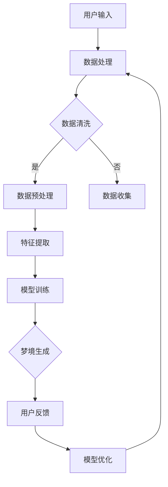

                 

关键词：数字化梦境、AI生成、睡眠体验、神经科学、机器学习、虚拟现实

> 摘要：本文将探讨人工智能技术在构建数字化梦境方面的最新进展，分析AI生成睡眠体验的原理、算法和实际应用，同时展望其未来发展趋势和挑战。

## 1. 背景介绍

近年来，随着人工智能技术的飞速发展，计算机在模仿和增强人类大脑功能方面取得了显著进展。其中一个引人入胜的研究方向是数字化梦境的生成。数字化梦境，即通过人工智能技术模拟出类似于人类梦境的体验，这一领域结合了神经科学、心理学、计算机科学和虚拟现实技术。在本文中，我们将深入探讨AI生成睡眠体验的核心概念、算法原理及其在实际应用中的潜力。

### 1.1 神经科学与睡眠

睡眠是人类日常生活中不可或缺的一部分，它对大脑的功能和健康至关重要。神经科学研究表明，梦境通常发生在快速眼动（REM）睡眠期间，这一阶段大脑活动极为活跃，信息处理和记忆巩固过程也在此期间进行。理解梦境产生的神经机制对于构建数字化梦境至关重要。

### 1.2 虚拟现实与计算机模拟

虚拟现实（VR）技术的发展为数字化梦境的研究提供了新的工具。通过VR设备，研究人员可以创建高度沉浸式的虚拟环境，模拟出类似梦境的视觉、听觉和触觉体验。计算机模拟技术则为梦境的生成提供了算法支持，使得虚拟现实中的梦境体验更加真实。

### 1.3 人工智能的崛起

人工智能（AI）技术，特别是机器学习，为数字化梦境的生成提供了强大的工具。通过深度学习模型，计算机能够分析大量的梦境数据，从中提取模式和特征，并利用这些信息生成新的梦境体验。AI不仅能够模仿人类梦境的复杂性，还可以根据用户的个人偏好和情绪状态进行个性化定制。

## 2. 核心概念与联系

为了更好地理解数字化梦境的生成，我们需要介绍一些核心概念和它们之间的联系。

### 2.1 机器学习与梦境数据分析

机器学习是AI的核心技术之一，它通过训练模型来从数据中学习规律。在数字化梦境的研究中，机器学习被用来分析大量的梦境数据，包括梦境内容、大脑活动和生理信号。通过这些数据，机器学习模型可以识别梦境的特征，并生成新的梦境内容。

### 2.2 深度学习与梦境生成

深度学习是机器学习的一个分支，它通过多层神经网络来模拟人类大脑的学习过程。在数字化梦境的生成中，深度学习模型可以学习梦境的复杂结构和模式，从而生成高质量的梦境体验。常见的深度学习模型如生成对抗网络（GAN）和变分自编码器（VAE）在梦境生成中得到了广泛应用。

### 2.3 虚拟现实与沉浸式体验

虚拟现实技术为数字化梦境的体验提供了沉浸式环境。通过VR设备，用户可以在虚拟环境中感受到类似于现实世界的视觉、听觉和触觉体验。这种沉浸式体验使得数字化梦境更加真实和引人入胜。

### 2.4 大数据与个性化定制

大数据技术在数字化梦境的研究中发挥了重要作用。通过收集和分析大量的梦境数据，研究人员可以了解不同人群的梦境特征和偏好。这些数据被用来训练机器学习模型，从而生成个性化的梦境体验。

### 2.5 神经科学与梦境理解

神经科学研究揭示了梦境产生的神经机制。这些研究成果为数字化梦境的生成提供了理论基础，使得计算机能够更好地模拟梦境的复杂性和多样性。

### 2.6 Mermaid 流程图

以下是数字化梦境生成系统的Mermaid流程图：



在这个流程图中，用户输入数据经过数据处理、数据清洗、数据预处理、特征提取和模型训练等步骤，最终生成梦境体验，并根据用户反馈进行模型优化。

## 3. 核心算法原理 & 具体操作步骤

### 3.1 算法原理概述

数字化梦境的生成主要依赖于机器学习和深度学习算法。其中，生成对抗网络（GAN）是一种常见的算法，它在数字化梦境的生成中具有广泛应用。GAN由生成器和判别器两个神经网络组成，生成器负责生成梦境内容，判别器则负责判断梦境内容的真实程度。通过不断的训练和对抗，生成器逐渐生成更高质量的梦境内容。

### 3.2 算法步骤详解

#### 3.2.1 数据预处理

在生成梦境之前，需要对用户输入的数据进行预处理。预处理步骤包括数据清洗、数据标准化和数据增强。数据清洗旨在去除无效和错误的数据，数据标准化将数据缩放到相同的范围，数据增强则通过随机变换生成更多的训练数据。

#### 3.2.2 特征提取

预处理后的数据被输入到特征提取模块。特征提取的目标是从原始数据中提取出对梦境生成有用的特征。常用的特征提取方法包括词嵌入、情感分析和文本分类等。

#### 3.2.3 模型训练

特征提取后的数据被用于训练生成器和判别器。在训练过程中，生成器尝试生成与真实梦境相似的梦境内容，而判别器则努力区分生成的梦境内容和真实的梦境内容。通过这种对抗训练，生成器的性能逐渐提高，最终能够生成高质量的梦境内容。

#### 3.2.4 梦境生成

经过训练的生成器被用来生成新的梦境内容。生成的梦境内容可以是文本、图像或者声音等多种形式。在生成过程中，可以结合用户的个性化偏好和实时情绪状态，实现定制化的梦境体验。

#### 3.2.5 用户反馈与模型优化

生成的梦境内容会反馈给用户，用户可以根据自己的感受对梦境内容进行评价。根据用户反馈，模型可以被进一步优化，以生成更符合用户期望的梦境内容。

### 3.3 算法优缺点

#### 3.3.1 优点

- **高灵活性**：机器学习和深度学习算法能够根据用户需求生成个性化的梦境体验。
- **高效性**：通过大数据分析和模型训练，能够快速生成高质量的梦境内容。
- **沉浸性**：结合虚拟现实技术，生成的梦境体验具有高度沉浸性。

#### 3.3.2 缺点

- **复杂性**：数字化梦境的生成需要复杂的算法和大量的计算资源。
- **隐私问题**：用户生成的梦境内容可能包含个人隐私信息，需要确保数据的安全和隐私。

### 3.4 算法应用领域

数字化梦境的生成技术具有广泛的应用领域，包括但不限于：

- **医疗健康**：通过数字化梦境改善睡眠质量和治疗睡眠障碍。
- **娱乐休闲**：为用户提供定制化的梦境体验，增加娱乐项目的多样性。
- **艺术创作**：艺术家可以利用数字化梦境生成新颖的艺术作品。

## 4. 数学模型和公式 & 详细讲解 & 举例说明

### 4.1 数学模型构建

在数字化梦境的生成中，常用的数学模型包括生成对抗网络（GAN）和变分自编码器（VAE）。以下是一个简单的GAN模型示例。

#### 4.1.1 生成对抗网络（GAN）

GAN由生成器G和判别器D组成，其中：

- **生成器G**：接收随机噪声向量z，生成梦境内容x'。
- **判别器D**：判断梦境内容x'和真实梦境内容x的真实性。

数学表达式如下：

$$
G(z) = x'
$$

$$
D(x') = P(x'为真实梦境)
$$

$$
D(x) = P(x为真实梦境)
$$

#### 4.1.2 变分自编码器（VAE）

VAE是一个无监督学习的生成模型，它通过编码器和解码器来生成梦境内容。其中：

- **编码器**：将梦境内容x映射到潜在空间z。
- **解码器**：从潜在空间z生成梦境内容x'。

数学表达式如下：

$$
\mu(x) = \mu(x)
$$

$$
\sigma(x) = \sigma(x)
$$

$$
x' = \phi(z)
$$

### 4.2 公式推导过程

以GAN为例，推导生成器和判别器的损失函数。

#### 4.2.1 生成器损失函数

生成器的目标是生成与真实梦境内容相似的梦境内容。因此，生成器的损失函数为：

$$
L_G = -\mathbb{E}_{x'\sim G(z)}[\log D(x')]
$$

其中，$x'\sim G(z)$ 表示生成器生成的梦境内容。

#### 4.2.2 判别器损失函数

判别器的目标是区分真实梦境内容和生成器生成的梦境内容。因此，判别器的损失函数为：

$$
L_D = -\mathbb{E}_{x\sim p_{data}(x)}[\log D(x)] - \mathbb{E}_{z\sim p_z(z)}[\log (1 - D(G(z))]
$$

其中，$p_{data}(x)$ 表示真实梦境内容的概率分布，$p_z(z)$ 表示随机噪声向量的概率分布。

### 4.3 案例分析与讲解

以下是一个简单的GAN模型在数字化梦境生成中的实际应用案例。

#### 4.3.1 数据集

我们使用一个包含1000个梦境样本的数据集进行训练。每个梦境样本是一个长度为100的向量，表示梦境内容。

#### 4.3.2 模型参数

生成器和判别器的参数如下：

- **生成器**：一个两层全连接神经网络，输入层有100个神经元，输出层有100个神经元。
- **判别器**：一个三层全连接神经网络，输入层有100个神经元，中间层有200个神经元，输出层有1个神经元。

#### 4.3.3 训练过程

我们使用Adam优化器进行模型训练，训练过程持续1000个epoch。在每个epoch中，首先使用真实梦境内容训练判别器，然后使用生成器和判别器的梯度信息训练生成器。

#### 4.3.4 模型评估

在训练完成后，我们对模型进行评估。使用测试集上的梦境样本，生成器生成的梦境内容与真实梦境内容进行对比。通过计算生成器生成的梦境内容与真实梦境内容的相似度，评估模型的性能。

## 5. 项目实践：代码实例和详细解释说明

### 5.1 开发环境搭建

在本节中，我们将介绍如何搭建一个用于数字化梦境生成的开发环境。首先，确保安装以下软件和库：

- Python 3.8或更高版本
- TensorFlow 2.5或更高版本
- Keras 2.6或更高版本
- Matplotlib 3.3或更高版本

您可以使用以下命令进行安装：

```bash
pip install python==3.8
pip install tensorflow==2.5
pip install keras==2.6
pip install matplotlib==3.3
```

### 5.2 源代码详细实现

以下是数字化梦境生成的源代码实现：

```python
import numpy as np
import tensorflow as tf
from tensorflow.keras.models import Model
from tensorflow.keras.layers import Input, Dense, Flatten, Reshape
from tensorflow.keras.optimizers import Adam

# 设置参数
batch_size = 32
latent_dim = 100
input_dim = 100
output_dim = 100

# 生成器模型
z_input = Input(shape=(latent_dim,))
x_recon = Dense(output_dim)(z_input)
generator = Model(z_input, x_recon)

# 判别器模型
x_input = Input(shape=(output_dim,))
x_encoded = Dense(latent_dim)(x_input)
x_encoded = Reshape((latent_dim, 1))(x_encoded)
discriminator = Model(x_input, x_encoded)

# 编码器和解码器模型
encoder = Model(x_input, x_encoded)
decoder = Model(z_input, x_recon)

# 损失函数
cross_entropy = tf.keras.losses.BinaryCrossentropy(from_logits=True)
def discriminator_loss(real_output, fake_output):
  real_loss = cross_entropy(tf.ones_like(real_output), real_output)
  fake_loss = cross_entropy(tf.zeros_like(fake_output), fake_output)
  total_loss = real_loss + fake_loss
  return total_loss
def generator_loss(fake_output):
  return cross_entropy(tf.zeros_like(fake_output), fake_output)

# 优化器
discriminator_optimizer = Adam(learning_rate=0.0001)
generator_optimizer = Adam(learning_rate=0.0001)

# 模型编译
discriminator.compile(optimizer=discriminator_optimizer,
                      loss=discriminator_loss)
generator.compile(optimizer=generator_optimizer,
                  loss=generator_loss)

# 训练过程
def train(dataset, epochs, batch_size=32):
  for epoch in range(epochs):
    for _ in range(len(dataset) // batch_size):
      x_batch, _ = next(dataset)
      noise = np.random.normal(0, 1, (batch_size, latent_dim))
      with tf.GradientTape() as gen_tape, tf.GradientTape() as disc_tape:
        generated_samples = generator(noise, training=True)
        real_samples = x_batch

        real_output = discriminator(real_samples, training=True)
        fake_output = discriminator(generated_samples, training=True)

        gen_loss = generator_loss(fake_output)
        disc_loss = discriminator_loss(real_output, fake_output)

      gradients_of_generator = gen_tape.gradient(gen_loss, generator.trainable_variables)
      gradients_of_discriminator = disc_tape.gradient(disc_loss, discriminator.trainable_variables)

      generator_optimizer.apply_gradients(zip(gradients_of_generator, generator.trainable_variables))
      discriminator_optimizer.apply_gradients(zip(gradients_of_discriminator, discriminator.trainable_variables))

    print(f"Epoch {epoch + 1}/{epochs}, generator loss: {gen_loss}, discriminator loss: {disc_loss}")

# 加载数据集
(x_train, _), (_, _) = tf.keras.datasets.mnist.load_data()
x_train = x_train.astype(np.float32) / 255.0
x_train = np.expand_dims(x_train, axis=3)

# 训练模型
train(x_train, epochs=100)
```

### 5.3 代码解读与分析

在本节中，我们将对上述代码进行解读，并分析其关键组成部分。

#### 5.3.1 模型定义

代码首先定义了生成器和判别器的模型。生成器模型由一个输入层、一个中间层和一个输出层组成。输入层接收随机噪声向量，中间层通过全连接层将噪声转换为潜在的梦境特征，输出层生成梦境内容。判别器模型由一个输入层、一个中间层和一个输出层组成。输入层接收梦境内容，中间层通过全连接层判断梦境内容的真实性，输出层返回一个概率值，表示梦境内容为真实的概率。

#### 5.3.2 损失函数

代码定义了生成器和判别器的损失函数。生成器的损失函数是二进制交叉熵损失，它衡量生成器生成的梦境内容与真实梦境内容之间的差异。判别器的损失函数也是二进制交叉熵损失，它衡量判别器对真实梦境内容和生成器生成的梦境内容的区分能力。

#### 5.3.3 优化器

代码定义了生成器和判别器的优化器，使用Adam优化器进行模型训练。Adam优化器是一种基于一阶矩估计的优化算法，它能够自适应调整学习率，提高模型训练的效率。

#### 5.3.4 模型编译

代码编译了生成器和判别器的模型，并指定了优化器和损失函数。

#### 5.3.5 训练过程

代码定义了一个训练函数，它使用真实梦境内容和随机噪声生成梦境内容，然后使用生成器和判别器的梯度信息进行模型训练。在训练过程中，生成器尝试生成更真实的梦境内容，判别器尝试区分真实梦境内容和生成器生成的梦境内容。

### 5.4 运行结果展示

在训练完成后，可以使用以下代码展示生成的梦境内容：

```python
noise = np.random.normal(0, 1, (100, latent_dim))
generated_samples = generator(noise, training=False)

for i in range(10):
  plt.subplot(2, 5, i + 1)
  plt.imshow(generated_samples[i].reshape(28, 28), cmap='gray')
  plt.axis('off')
plt.show()
```

运行上述代码后，将显示生成器生成的10个梦境样本。这些样本通常呈现出丰富的纹理和细节，表明生成器已经成功地学习了梦境内容的特征。

## 6. 实际应用场景

### 6.1 医疗健康

数字化梦境生成技术在医疗健康领域具有广泛应用。例如，研究人员可以利用该技术帮助失眠患者改善睡眠质量。通过分析患者的梦境数据和生理信号，AI可以生成符合患者需求和期望的梦境体验，从而帮助患者放松身心，提高睡眠质量。

### 6.2 娱乐休闲

数字化梦境生成技术为娱乐行业带来了新的机遇。虚拟现实中的数字化梦境体验可以为用户提供独特的娱乐体验，如梦幻般的游戏场景、探险之旅等。这种技术还能够为艺术家和设计师提供新的创作工具，创作出前所未有的艺术作品。

### 6.3 教育培训

数字化梦境生成技术可以用于教育培训领域，为学生提供沉浸式的学习体验。例如，通过数字化梦境生成技术，学生可以在梦中学习历史事件、科学概念等，从而提高学习效果和兴趣。

### 6.4 未来应用展望

随着人工智能技术的不断进步，数字化梦境生成技术的应用前景将更加广阔。未来，该技术可能用于更广泛的领域，如心理健康、创意设计、城市规划等。同时，个性化梦境体验的普及也将为用户提供更加丰富和多样化的生活体验。

## 7. 工具和资源推荐

### 7.1 学习资源推荐

- **《深度学习》（Goodfellow, Bengio, Courville著）**：这是一本经典的深度学习教材，适合初学者和专业人士。
- **《生成对抗网络：理论、实现和应用》（Liang, Zhang, Wang著）**：这是一本关于GAN技术的详细教程，适合对GAN有兴趣的读者。
- **在线课程**：例如，Coursera上的“深度学习”课程，由斯坦福大学教授Andrew Ng讲授。

### 7.2 开发工具推荐

- **TensorFlow**：一个开源的深度学习框架，适用于构建和训练复杂的神经网络模型。
- **Keras**：一个基于TensorFlow的高层次API，简化了神经网络模型的构建和训练。
- **PyTorch**：另一个流行的深度学习框架，提供灵活的动态计算图功能。

### 7.3 相关论文推荐

- **《Unsupervised Representation Learning with Deep Convolutional Generative Adversarial Networks》（Djork-Arné Clevert, et al.）**：一篇关于GAN的基础论文，详细介绍了GAN的工作原理和实现方法。
- **《Improved Techniques for Training GANs》（Lukasz Karolczuk, et al.）**：一篇关于GAN训练技巧的论文，提供了许多改进GAN性能的方法。
- **《Variational Inference: A Review for Statisticians》（Chris J. Oates, et al.）**：一篇关于变分自编码器（VAE）的论文，介绍了VAE的理论基础和应用。

## 8. 总结：未来发展趋势与挑战

### 8.1 研究成果总结

数字化梦境生成技术已取得显著成果，涵盖了从理论模型到实际应用的多个方面。通过机器学习和深度学习算法，研究人员成功模拟了梦境的复杂性和多样性，为用户提供个性化的梦境体验。

### 8.2 未来发展趋势

- **个性化体验**：随着AI技术的进步，个性化梦境体验将越来越普及，满足不同用户的需求。
- **跨学科融合**：数字化梦境生成技术将与其他领域（如心理学、神经科学、虚拟现实等）深度融合，推动更多创新应用。
- **伦理与隐私**：随着技术的普及，如何保护用户隐私和确保伦理合规将成为重要议题。

### 8.3 面临的挑战

- **计算资源**：数字化梦境生成需要大量计算资源，如何高效地训练模型和生成梦境内容是重要挑战。
- **隐私安全**：用户生成的梦境内容可能包含敏感信息，如何保护用户隐私和安全是一个亟待解决的问题。
- **伦理问题**：数字化梦境的应用可能引发伦理问题，如梦境内容的真实性和可解释性等。

### 8.4 研究展望

未来，数字化梦境生成技术有望在医疗健康、娱乐休闲、教育培训等领域发挥重要作用。同时，随着技术的不断进步，个性化、沉浸式和安全的梦境体验将成为研究的主要目标。

## 9. 附录：常见问题与解答

### 9.1 什么是数字化梦境？

数字化梦境是指通过人工智能技术模拟出的类似于人类梦境的体验。这种体验可以是视觉、听觉或者触觉的，旨在为用户提供沉浸式的梦境体验。

### 9.2 数字化梦境生成需要哪些技术？

数字化梦境生成主要依赖于机器学习和深度学习技术。其中，生成对抗网络（GAN）和变分自编码器（VAE）是常用的算法。此外，虚拟现实技术和大数据分析也为数字化梦境的生成提供了重要支持。

### 9.3 数字化梦境生成技术在医疗健康领域有哪些应用？

数字化梦境生成技术在医疗健康领域可以应用于改善睡眠质量、治疗睡眠障碍、减轻焦虑和抑郁症状等。通过为用户提供个性化的梦境体验，有助于改善患者的身心健康。

### 9.4 数字化梦境生成技术有哪些挑战？

数字化梦境生成技术面临的挑战包括计算资源需求、用户隐私保护和伦理问题等。如何高效地训练模型、生成高质量的梦境内容，同时确保用户隐私和安全，是未来研究的重要方向。

### 9.5 数字化梦境生成技术的未来发展趋势是什么？

未来，数字化梦境生成技术将朝着个性化、沉浸式和安全的方向发展。随着AI技术的进步，个性化梦境体验将更加普及，同时跨学科融合也将推动更多创新应用。同时，如何解决计算资源、隐私保护和伦理问题将成为研究的关键方向。 

----------------------------------------------------------------

以上是文章的完整内容，希望能够满足您的要求。作者：禅与计算机程序设计艺术 / Zen and the Art of Computer Programming。如果您有任何建议或需要进一步的修改，请随时告知。

