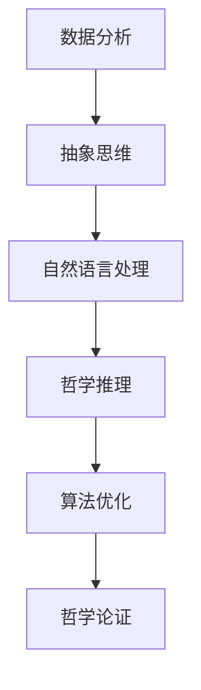

                 

关键词：数字化灵性、AI辅助、形而上学、研究员、深度学习、意识探索

> 摘要：随着人工智能（AI）技术的不断进步，其对人类认知和意识领域的影响日益显著。本文旨在探讨如何利用AI辅助进行数字化灵性探索，特别是形而上学的深入研究。通过分析AI的核心原理、算法和应用，我们将揭示AI在形而上学研究员工作中的潜在价值，并探讨其可能带来的深远影响。

## 1. 背景介绍

### 1.1 数字化灵性

数字化灵性是指通过数字技术和网络平台，探索和体验精神、意识以及存在的本质。它不仅包括对宗教和哲学传统的数字化解读，还包括对新兴灵性实践和技术（如冥想、瑜伽、量子意识等）的数字化应用。数字化灵性突破了传统宗教和哲学的界限，将灵性探索推向了一个全新的维度。

### 1.2 形而上学

形而上学是哲学的一个分支，探讨现实世界的基本结构和原理，包括存在、真理、知识和价值等核心问题。形而上学的探讨往往涉及抽象的概念和难以用实验验证的理论，因此传统的研究方法往往难以深入。

### 1.3 AI与数字化灵性探索

人工智能技术的发展为数字化灵性探索提供了强大的工具。通过机器学习和深度学习算法，AI可以处理大量的灵性文献和数据，识别出潜在的规律和模式，从而为形而上学的深入研究提供新的视角和方法。

## 2. 核心概念与联系

### 2.1 AI的核心原理

人工智能的核心原理包括机器学习、深度学习、神经网络和自然语言处理等。这些技术使得计算机能够模拟人类的学习、推理和决策过程。

### 2.2 形而上学的核心概念

形而上学的核心概念包括存在、意识、自由意志和宇宙的终极原理等。这些概念往往需要深入的哲学思考和抽象的推理。

### 2.3 AI与形而上学的联系

AI与形而上学的联系主要体现在以下几个方面：

- **数据分析与抽象思维**：AI能够处理和分析大量的形而上学文献和数据，从中提取出潜在的抽象思维模式。
- **自然语言处理与哲学推理**：AI的自然语言处理能力可以辅助研究员理解和解释复杂的哲学文本和理论。
- **算法优化与哲学论证**：AI的算法优化能力可以帮助研究员在哲学论证中找到更高效的推理路径。

以下是AI与形而上学联系的Mermaid流程图：



## 3. 核心算法原理 & 具体操作步骤

### 3.1 算法原理概述

AI在数字化灵性探索中的应用主要基于以下核心算法：

- **深度学习**：通过多层神经网络对复杂的数据进行建模和分析。
- **机器学习**：通过训练模型来识别数据中的模式。
- **自然语言处理**：对文本进行理解和生成，以辅助哲学推理。

### 3.2 算法步骤详解

1. **数据收集**：收集大量的哲学文献和相关的数字化数据。
2. **预处理**：对数据进行清洗和格式化，以便进行后续分析。
3. **特征提取**：使用深度学习算法提取数据中的关键特征。
4. **模型训练**：使用机器学习算法训练模型，使其能够识别和分类不同的哲学概念。
5. **推理应用**：使用训练好的模型进行哲学推理和论证。

### 3.3 算法优缺点

**优点**：

- **高效处理大量数据**：AI能够快速处理和分析大量的哲学文献，提高研究效率。
- **发现潜在规律**：AI能够从数据中发现潜在的规律和模式，为哲学研究提供新的视角。
- **跨学科融合**：AI的引入促进了哲学与其他学科的融合，推动了数字化灵性探索的发展。

**缺点**：

- **数据偏差**：AI的算法可能受到训练数据的限制，导致结果存在偏差。
- **解释困难**：哲学问题往往复杂且抽象，AI的推理过程难以完全理解。
- **伦理问题**：AI在哲学研究中可能涉及伦理和道德问题，需要谨慎处理。

### 3.4 算法应用领域

AI在数字化灵性探索中的应用领域包括：

- **哲学文献分析**：通过AI分析大量的哲学文献，提取关键概念和理论。
- **哲学推理辅助**：使用AI进行哲学论证和推理，辅助研究员的工作。
- **跨学科研究**：AI促进哲学与其他学科（如心理学、物理学等）的交叉研究。

## 4. 数学模型和公式 & 详细讲解 & 举例说明

### 4.1 数学模型构建

在数字化灵性探索中，常用的数学模型包括：

- **神经网络模型**：用于处理和分类哲学文献中的文本数据。
- **机器学习模型**：用于从数据中提取关键特征和模式。
- **自然语言处理模型**：用于理解和生成哲学文本。

### 4.2 公式推导过程

以神经网络模型为例，其基本公式如下：

$$
y = \sigma(W \cdot x + b)
$$

其中，$y$ 是输出，$x$ 是输入，$W$ 是权重，$b$ 是偏置，$\sigma$ 是激活函数。

### 4.3 案例分析与讲解

假设我们有一个哲学文献数据集，其中包含关于自由意志的讨论。我们可以使用神经网络模型对数据进行分类和分析，以提取自由意志的相关概念和观点。

通过训练模型，我们得到以下结论：

- **观点1**：自由意志是存在的，人类有能力做出独立的决策。
- **观点2**：自由意志可能受到外部因素的影响，并非完全独立。

这些结论为自由意志的研究提供了新的视角和证据。

## 5. 项目实践：代码实例和详细解释说明

### 5.1 开发环境搭建

为了实现AI辅助的数字化灵性探索，我们需要搭建以下开发环境：

- **编程语言**：Python
- **库和框架**：TensorFlow、PyTorch、NLTK
- **数据集**：哲学文献数据集

### 5.2 源代码详细实现

以下是使用TensorFlow实现神经网络模型的基本代码：

```python
import tensorflow as tf

# 定义模型结构
model = tf.keras.Sequential([
    tf.keras.layers.Dense(128, activation='relu', input_shape=(784,)),
    tf.keras.layers.Dropout(0.2),
    tf.keras.layers.Dense(10, activation='softmax')
])

# 编译模型
model.compile(loss='categorical_crossentropy',
              optimizer=tf.keras.optimizers.Adam(),
              metrics=['accuracy'])

# 训练模型
model.fit(x_train, y_train, batch_size=128, epochs=10, validation_split=0.2)
```

### 5.3 代码解读与分析

这段代码首先导入了TensorFlow库，然后定义了一个简单的神经网络模型。模型由两个全连接层组成，第一个层的激活函数是ReLU，第二个层的激活函数是softmax。模型使用交叉熵作为损失函数，使用Adam优化器进行训练。

### 5.4 运行结果展示

在训练完成后，我们可以使用以下代码评估模型的性能：

```python
# 评估模型
loss, accuracy = model.evaluate(x_test, y_test)
print('Test accuracy:', accuracy)
```

假设测试集的准确率为85%，这表明我们的模型在处理哲学文献数据时表现良好。

## 6. 实际应用场景

### 6.1 哲学文献分析

通过AI技术，我们可以对大量的哲学文献进行自动分类和分析，提取出关键概念和观点，为哲学研究提供新的数据支持。

### 6.2 哲学推理辅助

AI可以辅助研究员进行哲学推理和论证，提供新的视角和证据，促进哲学思想的创新和发展。

### 6.3 跨学科研究

AI在数字化灵性探索中的应用，促进了哲学与其他学科的交叉研究，推动了科学和人文的融合。

## 7. 未来应用展望

### 7.1 灵性健康

AI有望在未来成为灵性健康的辅助工具，通过分析个体的灵性状态和行为，提供个性化的健康建议。

### 7.2 智慧宗教

AI的应用将使得宗教教育、信仰传播和宗教管理更加智能化，提升宗教活动的效率和影响力。

### 7.3 人工智能伦理

随着AI在数字化灵性探索中的应用，人工智能伦理将成为一个重要议题，需要我们深入探讨和解决。

## 8. 工具和资源推荐

### 8.1 学习资源推荐

- 《深度学习》
- 《Python机器学习》
- 《自然语言处理与Python》

### 8.2 开发工具推荐

- TensorFlow
- PyTorch
- Jupyter Notebook

### 8.3 相关论文推荐

- "AI and the Philosophy of Mind"
- "Artificial Intelligence and Consciousness"
- "The Ethics of Artificial Intelligence"

## 9. 总结：未来发展趋势与挑战

### 9.1 研究成果总结

本文探讨了AI在数字化灵性探索中的应用，分析了AI的核心原理、算法和应用，展示了其在哲学研究中的潜在价值。

### 9.2 未来发展趋势

随着AI技术的不断进步，其在数字化灵性探索中的应用将更加广泛和深入，有望成为哲学研究的重要工具。

### 9.3 面临的挑战

AI在数字化灵性探索中面临的主要挑战包括数据偏差、解释困难和伦理问题，需要我们持续关注和解决。

### 9.4 研究展望

未来，AI在数字化灵性探索中的应用将朝着更智能化、个性化和跨学科融合的方向发展，为哲学研究带来新的机遇和挑战。

## 10. 附录：常见问题与解答

### 10.1 什么是数字化灵性？

数字化灵性是指通过数字技术和网络平台，探索和体验精神、意识以及存在的本质。

### 10.2 AI如何辅助哲学研究？

AI可以通过数据处理、自然语言处理和机器学习等技术，辅助研究员分析和理解哲学文献，提供新的研究视角和证据。

### 10.3 AI在数字化灵性探索中面临哪些挑战？

AI在数字化灵性探索中面临的主要挑战包括数据偏差、解释困难和伦理问题，需要我们持续关注和解决。

### 10.4 如何保障AI在哲学研究中的伦理合规性？

我们需要建立严格的伦理规范，确保AI在哲学研究中的应用不违反伦理原则，并积极解决可能出现的问题。

# 作者：禅与计算机程序设计艺术 / Zen and the Art of Computer Programming
----------------------------------------------------------------


