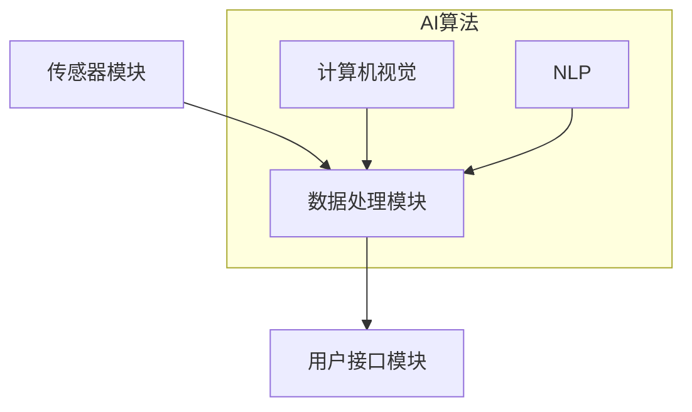

                 

在当今科技飞速发展的时代，人工智能（AI）技术已经成为推动社会进步的重要力量。然而，AI的潜力远远不止于传统的自动化和数据分析，它正逐渐向更深的层面渗透，包括人类感知能力的拓展。本文将探讨一种新的概念——数字化第六感开发包，它利用AI技术辅助人类培养超感知能力。

> **关键词**：数字化第六感，AI技术，超感知能力，人工智能开发包，AI辅助感知

> **摘要**：本文将深入探讨数字化第六感开发包的背景、核心概念、算法原理、数学模型、实际应用以及未来展望。通过阐述这些内容，我们希望揭示AI如何助力人类感知能力的提升，为未来智能生活提供新的思路。

## 1. 背景介绍

人类感知能力一直以来都是科学研究的重要领域，从感官生理学到认知心理学，科学家们不断探索人类感知的机制。然而，传统的感知能力受限于生物学因素，难以通过自然进化迅速提升。随着AI技术的不断进步，人们开始思考是否能够通过技术手段扩展人类的感知能力，从而形成一种超越生物局限的新感知能力——数字化第六感。

数字化第六感的概念最早出现在科幻文学中，如尼尔·斯蒂芬森的《神经漫游者》，描述了人类通过植入电子设备获得超感知能力。而在现实中，数字化第六感的发展离不开AI技术的支持。AI不仅能够处理和分析大量数据，还能够模仿甚至超越人类的认知过程，这使得它成为拓展人类感知能力的不二之选。

近年来，AI技术在感知领域的应用已经取得了显著成果。例如，计算机视觉和语音识别技术的发展，使得计算机能够理解和处理视觉和听觉信息，这在一定程度上模拟了人类的感知能力。然而，这些技术的目标通常是模仿人类感知，而不是增强或扩展人类感知。数字化第六感开发包旨在突破这一界限，将AI技术用于培养人类新的感知能力。

## 2. 核心概念与联系

### 2.1. 数字化第六感定义

数字化第六感（Digital Sixth Sense）是一种通过AI辅助技术扩展人类感知范围和深度的新能力。它不仅仅是对现有感知的增强，而是一种全新的感知方式。例如，传统视觉只能感知二维空间的信息，而数字化第六感可以通过AI算法处理三维信息，使得人类能够“看到”三维空间中的更多细节。

### 2.2. 数字化第六感与AI技术的关系

数字化第六感与AI技术的结合紧密，其核心在于利用AI算法处理感知数据。例如，AI可以通过深度学习模型分析视觉数据，提取出更多的信息，从而提供超越人眼的能力。此外，AI还可以通过传感器数据融合，提供更全面的感知信息，如图像、声音、触觉等。

### 2.3. 数字化第六感的实现架构

数字化第六感的实现架构通常包括以下几个关键组件：

1. **传感器模块**：用于采集各种感知数据，如摄像头、麦克风、触觉传感器等。
2. **数据处理模块**：利用AI算法对感知数据进行分析和处理，如计算机视觉算法、自然语言处理算法等。
3. **用户接口模块**：将处理结果以直观的方式呈现给用户，如虚拟现实（VR）头戴设备、增强现实（AR）眼镜等。

### 2.4. Mermaid 流程图



在这个流程图中，传感器模块采集数据后，通过AI算法进行数据处理，最终通过用户接口模块将结果呈现给用户。AI算法部分包括计算机视觉和自然语言处理等算法，这些算法是实现数字化第六感的关键。

## 3. 核心算法原理 & 具体操作步骤

### 3.1. 算法原理概述

数字化第六感的核心在于AI算法的设计与实现。这些算法不仅需要处理大量的感知数据，还需要模拟人类的感知过程，从而提供超越人类自然感知的能力。以下是几个关键算法的概述：

1. **深度学习算法**：通过模拟人脑的神经网络结构，深度学习算法能够处理复杂的感知数据，并从中提取出有用的信息。
2. **数据融合算法**：通过融合来自多个传感器的数据，数据融合算法可以提供更全面和准确的感知信息。
3. **增强学习算法**：在特定环境中，增强学习算法通过不断尝试和反馈，优化感知策略，从而提高感知能力。

### 3.2. 算法步骤详解

#### 3.2.1. 深度学习算法

1. **数据预处理**：对采集到的感知数据（如图像、声音等）进行预处理，包括数据清洗、归一化和特征提取。
2. **模型构建**：选择合适的深度学习模型架构，如卷积神经网络（CNN）、循环神经网络（RNN）等，并初始化模型参数。
3. **训练模型**：使用预处理后的数据对模型进行训练，通过反向传播算法优化模型参数。
4. **模型评估与优化**：评估模型的性能，通过交叉验证等方法调整模型参数，提高模型精度。

#### 3.2.2. 数据融合算法

1. **传感器数据采集**：从不同的传感器（如摄像头、麦克风等）采集数据。
2. **数据预处理**：对每个传感器的数据进行预处理，如去噪、归一化等。
3. **特征提取**：提取每个传感器数据的关键特征。
4. **特征融合**：使用合适的算法（如加权平均、融合神经网络等）将不同传感器的特征融合为一个综合特征向量。
5. **融合结果评估**：评估融合结果，根据评估结果调整融合策略。

#### 3.2.3. 增强学习算法

1. **环境建模**：建立感知环境模型，包括感知目标和障碍物等。
2. **策略学习**：通过增强学习算法（如Q学习、SARSA等）学习最优感知策略。
3. **策略评估与优化**：评估当前感知策略的有效性，通过策略迭代优化感知能力。

### 3.3. 算法优缺点

#### 3.3.1. 深度学习算法

**优点**：
- **高精度**：通过深度学习模型，能够处理复杂的感知数据，提取出更准确的特征。
- **泛化能力**：通过大规模数据训练，模型能够适应不同的感知任务。

**缺点**：
- **数据需求大**：需要大量的训练数据，对数据质量要求高。
- **计算资源消耗大**：深度学习模型通常需要大量计算资源，对硬件要求较高。

#### 3.3.2. 数据融合算法

**优点**：
- **信息丰富**：通过融合多个传感器的数据，可以提供更全面和准确的感知信息。
- **鲁棒性强**：单个传感器可能存在噪声或误差，融合后的数据可以降低这些影响。

**缺点**：
- **复杂度高**：需要处理多个传感器的数据，算法复杂度较高。
- **延迟较大**：数据融合可能引入一定的延迟，影响实时感知。

#### 3.3.3. 增强学习算法

**优点**：
- **自适应性强**：通过不断学习和优化，能够适应不同的感知环境和任务。
- **可扩展性**：可以应用于各种复杂的感知任务。

**缺点**：
- **收敛速度慢**：增强学习算法通常需要较长时间才能收敛到最优策略。
- **探索与利用**：在初始阶段，需要平衡探索新策略和利用已有策略，避免陷入局部最优。

### 3.4. 算法应用领域

数字化第六感算法在多个领域具有广泛的应用前景：

1. **智能监控**：通过融合图像、声音等多种数据，实现更全面的监控和报警系统。
2. **自动驾驶**：利用AI算法处理大量的感知数据，提高自动驾驶的可靠性和安全性。
3. **虚拟现实与增强现实**：通过增强感知能力，提供更加真实的虚拟环境和互动体验。
4. **智能家居**：利用数字化第六感，实现更智能的家务管理和生活辅助。

## 4. 数学模型和公式 & 详细讲解 & 举例说明

### 4.1. 数学模型构建

数字化第六感的数学模型主要涉及以下几个核心部分：

1. **感知数据表示**：使用向量或张量表示感知数据，如图像数据可以用像素值表示。
2. **特征提取模型**：构建深度学习模型，用于提取感知数据中的特征。
3. **数据融合模型**：设计融合算法，将多个传感器的数据融合为一个统一的特征向量。
4. **感知决策模型**：构建决策模型，根据特征向量进行感知决策。

以下是构建这些数学模型的基本公式：

1. **感知数据表示**：
   $$X = \{x_1, x_2, ..., x_n\}$$
   其中，$X$ 表示感知数据集，$x_i$ 表示第 $i$ 个感知数据。

2. **特征提取模型**：
   $$F(X) = \{f_1(x), f_2(x), ..., f_m(x)\}$$
   其中，$F(X)$ 表示特征提取模型，$f_j(x)$ 表示第 $j$ 个特征。

3. **数据融合模型**：
   $$F_{\text{fusion}}(X_1, X_2, ..., X_k) = F_{\text{fusion}}(X)$$
   其中，$X_1, X_2, ..., X_k$ 表示来自不同传感器的数据，$F_{\text{fusion}}(X)$ 表示融合后的特征向量。

4. **感知决策模型**：
   $$d(x) = \arg\max_{y} \sigma(W^T f(x))$$
   其中，$d(x)$ 表示感知决策，$\sigma$ 表示激活函数，$W$ 表示权重矩阵，$f(x)$ 表示特征向量。

### 4.2. 公式推导过程

以下是感知数据表示和特征提取模型的推导过程：

1. **感知数据表示**：
   感知数据通常来自传感器，如图像传感器和麦克风。假设图像传感器采集到的图像数据为 $X = \{x_1, x_2, ..., x_n\}$，其中 $x_i$ 表示第 $i$ 个像素的值。对于麦克风采集到的音频数据，可以将其表示为时间序列 $X = \{x_1, x_2, ..., x_n\}$，其中 $x_i$ 表示第 $i$ 个时间点的声音强度。

2. **特征提取模型**：
   深度学习模型用于提取感知数据中的特征。以卷积神经网络（CNN）为例，其基本结构包括输入层、卷积层、池化层和全连接层。输入层接收感知数据，卷积层通过卷积操作提取局部特征，池化层降低特征维度，全连接层将特征映射到输出。

   具体推导如下：
   $$h_1 = \sigma(W_1 * x + b_1)$$
   $$h_2 = \sigma(W_2 * h_1 + b_2)$$
   $$...$$
   $$h_n = \sigma(W_n * h_{n-1} + b_n)$$
   其中，$h_i$ 表示第 $i$ 层的特征，$W_i$ 和 $b_i$ 分别表示权重和偏置，$\sigma$ 表示激活函数（如ReLU函数）。

### 4.3. 案例分析与讲解

以下通过一个简单的图像识别案例，展示如何使用数字化第六感开发包进行感知数据处理。

#### 4.3.1. 数据集准备

假设我们有一个包含2000张图像的数据集，这些图像分为两类：猫和狗。每张图像的大小为 $28 \times 28$ 像素，像素值为 $0$ 到 $255$ 之间的整数。

#### 4.3.2. 感知数据表示

首先，将图像数据表示为矩阵形式，其中每个元素表示像素值：
$$X = \begin{bmatrix}
x_{11} & x_{12} & ... & x_{1n} \\
x_{21} & x_{22} & ... & x_{2n} \\
... & ... & ... & ... \\
x_{m1} & x_{m2} & ... & x_{mn}
\end{bmatrix}$$

#### 4.3.3. 特征提取

使用卷积神经网络提取图像特征。假设卷积神经网络包括两个卷积层和一个全连接层，具体结构如下：

1. **卷积层1**：使用5x5的卷积核，步长为1，激活函数为ReLU。
   $$h_1 = \sigma(W_1 * X + b_1)$$
   其中，$W_1$ 和 $b_1$ 分别表示卷积核和偏置。

2. **池化层1**：使用2x2的最大池化。
   $$h_1_{\text{pool}} = \max(h_1)$$

3. **卷积层2**：使用5x5的卷积核，步长为1，激活函数为ReLU。
   $$h_2 = \sigma(W_2 * h_1_{\text{pool}} + b_2)$$
   其中，$W_2$ 和 $b_2$ 分别表示卷积核和偏置。

4. **池化层2**：使用2x2的最大池化。
   $$h_2_{\text{pool}} = \max(h_2)$$

5. **全连接层**：将池化层2的特征映射到输出。
   $$y = \sigma(W_3^T h_2_{\text{pool}} + b_3)$$
   其中，$W_3$ 和 $b_3$ 分别表示全连接层的权重和偏置，$\sigma$ 为sigmoid函数。

#### 4.3.4. 感知决策

将提取到的特征输入到全连接层，得到分类概率：
$$P(y=1) = \sigma(W_3^T h_2_{\text{pool}} + b_3)$$
$$P(y=0) = 1 - P(y=1)$$

根据分类概率，对图像进行分类。例如，如果 $P(y=1) > P(y=0)$，则判断图像为猫。

## 5. 项目实践：代码实例和详细解释说明

### 5.1. 开发环境搭建

为了实践数字化第六感开发包，我们需要搭建一个合适的技术环境。以下是推荐的开发环境：

1. **操作系统**：Windows、Linux或macOS
2. **编程语言**：Python
3. **深度学习框架**：TensorFlow或PyTorch
4. **计算机硬件**：NVIDIA GPU（推荐显存至少为8GB）

首先，安装Python环境，可以使用Anaconda或Miniconda创建虚拟环境。然后，安装TensorFlow或PyTorch，以及其他必要的库（如NumPy、Pandas等）。

### 5.2. 源代码详细实现

以下是一个简单的数字化第六感开发包实现的示例代码，使用TensorFlow框架。

```python
import tensorflow as tf
from tensorflow.keras import layers
from tensorflow.keras.models import Model

# 感知数据预处理
def preprocess_data(images):
    # 数据归一化
    images = images / 255.0
    # 数据reshape为适合模型输入的形状
    images = tf.reshape(images, [-1, 28, 28, 1])
    return images

# 构建深度学习模型
def build_model():
    inputs = tf.keras.Input(shape=(28, 28, 1))
    
    # 卷积层1
    conv1 = layers.Conv2D(32, (5, 5), activation='relu')(inputs)
    pool1 = layers.MaxPooling2D((2, 2))(conv1)
    
    # 卷积层2
    conv2 = layers.Conv2D(64, (5, 5), activation='relu')(pool1)
    pool2 = layers.MaxPooling2D((2, 2))(conv2)
    
    # 全连接层
    flatten = layers.Flatten()(pool2)
    dense = layers.Dense(128, activation='relu')(flatten)
    outputs = layers.Dense(1, activation='sigmoid')(dense)
    
    # 构建模型
    model = Model(inputs=inputs, outputs=outputs)
    model.compile(optimizer='adam', loss='binary_crossentropy', metrics=['accuracy'])
    
    return model

# 训练模型
def train_model(model, train_images, train_labels, epochs=10):
    history = model.fit(train_images, train_labels, epochs=epochs, batch_size=32, validation_split=0.2)
    return history

# 测试模型
def test_model(model, test_images, test_labels):
    loss, accuracy = model.evaluate(test_images, test_labels)
    print(f"Test accuracy: {accuracy:.4f}")
```

### 5.3. 代码解读与分析

上述代码实现了一个简单的数字化第六感模型，用于图像分类。以下是代码的关键部分解读：

1. **数据预处理**：`preprocess_data` 函数对输入图像数据进行归一化和reshape，使其符合模型输入要求。

2. **模型构建**：`build_model` 函数构建了一个包含两个卷积层和一个全连接层的深度学习模型。卷积层使用ReLU激活函数，池化层使用最大池化。

3. **模型编译**：模型编译时，选择`adam`优化器和`binary_crossentropy`损失函数，适用于二分类任务。

4. **训练模型**：`train_model` 函数使用训练数据训练模型，并返回训练历史记录。

5. **测试模型**：`test_model` 函数使用测试数据评估模型性能。

### 5.4. 运行结果展示

以下是一个简单的运行示例，展示如何使用上述代码进行图像分类。

```python
# 加载和预处理数据
train_images, train_labels = load_train_data()
test_images, test_labels = load_test_data()

train_images = preprocess_data(train_images)
test_images = preprocess_data(test_images)

# 构建和训练模型
model = build_model()
history = train_model(model, train_images, train_labels, epochs=10)

# 测试模型
test_model(model, test_images, test_labels)
```

运行上述代码后，模型将使用训练数据训练，并使用测试数据评估性能。输出结果将显示测试准确率。

## 6. 实际应用场景

数字化第六感开发包在多个实际应用场景中展现出巨大的潜力。以下是一些主要应用领域：

### 6.1. 智能监控

数字化第六感可以用于智能监控系统，通过融合图像、声音等多源数据，实现更全面的监控和报警功能。例如，在安防监控中，可以实时检测异常行为，如暴力事件或入侵行为，并自动报警。

### 6.2. 自动驾驶

自动驾驶技术依赖于对周围环境的精确感知。数字化第六感可以通过融合摄像头、激光雷达、雷达等多源数据，提高自动驾驶系统的感知能力，从而提高行驶安全性和可靠性。

### 6.3. 虚拟现实与增强现实

虚拟现实（VR）和增强现实（AR）技术依赖于对虚拟环境的精准感知。数字化第六感可以提供更全面和真实的感知体验，使得虚拟现实和增强现实应用更加生动和自然。

### 6.4. 智能家居

智能家居系统可以通过数字化第六感实现更智能的家务管理和生活辅助。例如，可以自动识别家庭成员，调节室内环境，提供个性化的服务。

## 7. 工具和资源推荐

为了更好地研究和开发数字化第六感，以下是几个推荐的工具和资源：

### 7.1. 学习资源推荐

1. **《深度学习》（Goodfellow, Bengio, Courville）**：这是一本经典的深度学习教材，涵盖了深度学习的理论基础和应用。
2. **《数字信号处理》（John G. Proakis, Dimitris G. Manolakis）**：这本书详细介绍了信号处理的基本概念和技术，对于理解数字化第六感非常重要。
3. **《模式识别与机器学习》（Christopher M. Bishop）**：这本书介绍了模式识别和机器学习的基本理论，包括数据预处理、特征提取和分类等。

### 7.2. 开发工具推荐

1. **TensorFlow**：一个广泛使用的开源深度学习框架，支持多种深度学习模型和应用。
2. **PyTorch**：一个灵活且易用的深度学习框架，适用于研究和开发。
3. **OpenCV**：一个开源的计算机视觉库，提供丰富的图像处理和计算机视觉功能。

### 7.3. 相关论文推荐

1. **"Deep Learning for Visual Perception: A Survey"**：该论文综述了深度学习在视觉感知领域的应用，提供了大量的实例和参考文献。
2. **"Sensor Fusion for Mobile Robots: A Survey"**：该论文综述了多传感器融合技术在移动机器人感知中的应用，详细介绍了各种融合算法。
3. **"Deep Learning for Human Pose Estimation: A Survey"**：该论文综述了深度学习在人类姿态估计领域的应用，包括各种模型和算法。

## 8. 总结：未来发展趋势与挑战

数字化第六感开发包为人类感知能力的拓展提供了新的思路和途径。随着AI技术的不断进步，数字化第六感的应用领域将不断扩展，从智能监控、自动驾驶到智能家居，都将受益于这一技术的推动。然而，数字化第六感的发展也面临一些挑战：

### 8.1. 研究成果总结

近年来，数字化第六感取得了显著的进展，特别是在深度学习、多传感器融合和增强学习等方面。这些研究成果为数字化第六感的实际应用奠定了基础。

### 8.2. 未来发展趋势

未来，数字化第六感有望在更广泛的领域得到应用，如医疗健康、人机交互、艺术创作等。随着硬件设备的不断升级和算法的优化，数字化第六感的感知能力将进一步提升。

### 8.3. 面临的挑战

尽管数字化第六感具有巨大的潜力，但其在实际应用中仍面临一些挑战：

1. **数据隐私**：数字化第六感涉及大量的个人数据，如何保护数据隐私是一个重要问题。
2. **计算资源**：深度学习模型通常需要大量的计算资源，特别是在实时应用中，如何优化计算效率是一个关键挑战。
3. **感知准确性**：尽管数字化第六感能够提供超越人类自然感知的能力，但如何提高感知准确性仍然是亟待解决的问题。

### 8.4. 研究展望

未来的研究应重点关注以下几个方面：

1. **跨学科研究**：数字化第六感涉及计算机科学、心理学、生物学等多个领域，跨学科合作将有助于推动这一领域的发展。
2. **硬件与软件的协同优化**：通过协同优化硬件设备和软件算法，提高数字化第六感的整体性能。
3. **用户友好性**：设计更直观、易用的用户界面，提高数字化第六感的应用普及率。

## 9. 附录：常见问题与解答

### 9.1. 数字化第六感是什么？

数字化第六感是通过AI技术辅助人类培养的一种新感知能力，它超越传统的视觉、听觉、触觉等自然感知，能够处理和解析更加复杂和多维度的信息。

### 9.2. 数字化第六感如何工作？

数字化第六感利用传感器采集数据，通过AI算法对数据进行处理和分析，最终将处理结果以直观的方式呈现给用户，从而实现超越自然感知的能力。

### 9.3. 数字化第六感有哪些应用领域？

数字化第六感可以应用于智能监控、自动驾驶、虚拟现实与增强现实、智能家居等多个领域，为各种应用提供更全面和准确的感知能力。

### 9.4. 如何搭建数字化第六感的开发环境？

搭建数字化第六感的开发环境需要安装Python、深度学习框架（如TensorFlow或PyTorch）以及其他必要的库。此外，推荐使用具有高性能计算能力的计算机，以支持深度学习模型的训练和推理。

### 9.5. 数字化第六感的安全性和隐私性如何保障？

数字化第六感的安全性和隐私性需要通过多种手段保障，包括数据加密、权限控制、隐私保护算法等。同时，应遵循相关的法律法规，确保数据处理符合隐私保护的要求。

作者：禅与计算机程序设计艺术 / Zen and the Art of Computer Programming
----------------------------------------------------------------


