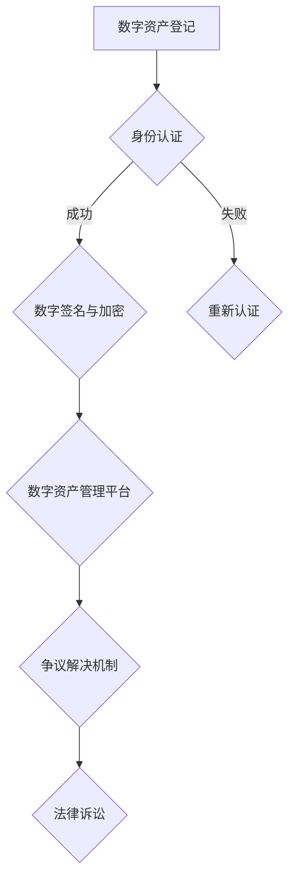

                 

关键词：数字化遗产、数字资产、法律创业、知识产权、数据保护、加密技术、用户权益

摘要：随着互联网和数字化技术的迅猛发展，数字化遗产和法律创业成为当今社会的重要议题。本文旨在探讨数字资产的法律保护问题，分析数字化遗产的定义、法律现状及其面临的法律挑战，并提出相应的解决策略。通过深入剖析数字化遗产法律创业的核心概念、算法原理、数学模型以及实际应用案例，本文为数字资产的法律保护提供了一整套系统性方案，旨在为政策制定者、法律从业者以及广大数字资产所有者提供有益的参考。

## 1. 背景介绍

随着互联网的普及和数字技术的不断发展，数字化遗产这一概念逐渐走入人们的视野。数字化遗产指的是个人或组织在数字化环境中创造、拥有或使用的各类数字资源，包括但不限于电子文档、电子邮件、社交媒体账户、在线游戏账号、数字货币等。这些数字资产不仅承载了大量的个人信息和价值，还与现代社会的生活和工作紧密相连。

然而，数字化遗产的法律保护问题日益凸显。首先，传统法律体系在数字资产的保护上存在诸多不足，如法律滞后性、定义模糊、权益界定不清等。其次，数字资产的特殊性，如易复制性、易篡改性、跨境传输性等，使得其在法律保护上面临更大的挑战。此外，随着数字经济的快速发展，数字资产的交易和流转也日益频繁，如何保障数字资产交易过程中的合法权益成为法律创业的重要课题。

因此，本文将从以下几个方面展开讨论：首先，明确数字化遗产的定义和特点；其次，分析数字化遗产法律保护的现状和挑战；然后，探讨数字资产法律保护的核心概念和算法原理；接着，介绍数字资产保护的数学模型和公式；最后，通过实际案例分析和未来展望，为数字资产的法律保护提供系统性方案。

## 2. 核心概念与联系

### 2.1 数字资产的定义和类型

数字资产是指以数字形式存在并具有经济价值的财产，包括但不限于以下几类：

- **电子文档**：包括文档、图表、图像、音频和视频文件等。
- **社交媒体账户**：如微博、微信、Facebook等社交平台的用户账号。
- **在线游戏账号**：包括游戏内的虚拟物品、等级、积分等。
- **数字货币**：如比特币、以太坊等加密货币。
- **知识产权**：包括专利、商标、版权等数字化的知识产权。

这些数字资产在现代社会中扮演着越来越重要的角色，它们不仅具有经济价值，还承载了大量的个人信息和隐私。

### 2.2 数字化遗产的法律保护现状

当前，各国在数字化遗产的法律保护方面已有一定探索，但总体上仍处于起步阶段。主要表现在以下几个方面：

- **立法滞后**：许多国家的法律体系尚未完全适应数字资产的特点和需求，导致法律保护滞后。
- **权益界定不清**：数字资产的权益界定尚不明确，如用户死亡后其社交媒体账号、游戏账号等应如何处理。
- **跨境保护问题**：数字资产常常跨越多个国家，如何确保其在不同司法管辖区内的合法权益成为一大难题。

### 2.3 数字资产法律保护的挑战

数字资产的法律保护面临诸多挑战，主要体现在以下几个方面：

- **法律适用问题**：数字资产的法律适用存在交叉和冲突，导致法律保护不力。
- **侵权认定难**：数字资产具有易复制性，侵权行为难以认定和取证。
- **数据安全与隐私**：数字资产涉及大量的个人信息和隐私，如何保障数据安全与隐私成为关键问题。
- **国际协调**：各国在数字资产保护上的立法和执法存在差异，国际协调机制亟待建立。

### 2.4 数字资产法律保护的核心概念与架构

为了有效保护数字资产，我们需要建立一套完善的法律保护体系，包括以下核心概念和架构：

- **数字资产登记制度**：建立数字资产登记制度，明确数字资产的归属和权利。
- **数字身份认证**：采用数字身份认证技术，确保数字资产交易的合法性和安全性。
- **数字签名与加密**：使用数字签名和加密技术保护数字资产的完整性和保密性。
- **数字资产管理平台**：搭建数字资产管理平台，提供数字资产的存储、交易和管理服务。
- **争议解决机制**：建立专门的数字资产争议解决机制，快速解决数字资产纠纷。

### 2.5 Mermaid 流程图

以下是一个用于展示数字资产法律保护流程的 Mermaid 流程图：



在这个流程图中，数字资产登记、身份认证、数字签名与加密、数字资产管理平台以及争议解决机制共同构成了数字资产法律保护的核心架构。

## 3. 核心算法原理 & 具体操作步骤

### 3.1 算法原理概述

数字资产法律保护的核心算法包括数字签名、加密算法和身份认证算法。这些算法在保障数字资产安全性和隐私性方面发挥着关键作用。

- **数字签名算法**：数字签名用于确保数字资产的完整性和真实性。签名过程涉及私钥和公钥的加密和解密操作，只有持有私钥的用户才能生成有效的数字签名。
- **加密算法**：加密算法用于保护数字资产的内容和传输过程中的隐私性。常见的加密算法包括对称加密和非对称加密，其中对称加密算法如AES，非对称加密算法如RSA。
- **身份认证算法**：身份认证算法用于验证用户身份的合法性，常用的算法包括密码认证、数字证书认证和生物特征认证。

### 3.2 算法步骤详解

#### 3.2.1 数字签名算法

1. **密钥生成**：用户生成一对密钥（私钥和公钥）。
2. **消息加密**：用户使用私钥对消息进行加密，生成数字签名。
3. **签名验证**：接收方使用公钥对数字签名进行解密和验证，确认消息的完整性和真实性。

#### 3.2.2 加密算法

1. **密钥交换**：双方通过加密算法（如RSA）交换密钥。
2. **数据加密**：使用交换的密钥对数据进行加密。
3. **数据解密**：接收方使用相同密钥对加密数据进行解密。

#### 3.2.3 身份认证算法

1. **身份验证请求**：用户发送身份验证请求。
2. **身份验证响应**：认证系统验证用户身份，返回认证结果。
3. **身份认证确认**：用户确认身份验证结果。

### 3.3 算法优缺点

- **数字签名算法**：优点是能有效保障消息的完整性和真实性，缺点是加密和解密过程较为复杂，对计算资源要求较高。
- **加密算法**：优点是能确保数据在传输过程中的隐私性，缺点是密钥管理复杂，存在泄露风险。
- **身份认证算法**：优点是能有效保障用户身份的合法性，缺点是可能面临伪造攻击和隐私泄露风险。

### 3.4 算法应用领域

数字签名、加密算法和身份认证算法在数字资产法律保护领域具有广泛的应用。例如：

- **数字货币交易**：通过数字签名和加密算法保障交易的安全性和隐私性。
- **知识产权保护**：通过数字签名和加密算法保护知识产权的完整性和真实性。
- **在线身份认证**：通过身份认证算法保障用户在线身份的合法性。

## 4. 数学模型和公式 & 详细讲解 & 举例说明

### 4.1 数学模型构建

在数字资产法律保护中，常用的数学模型包括数字签名模型、加密模型和身份认证模型。以下是一个简化的数学模型构建过程：

#### 4.1.1 数字签名模型

- **加密算法**：选择一种非对称加密算法，如RSA。
- **哈希函数**：选择一个哈希函数，如SHA-256。
- **消息**：待签名的消息。
- **私钥**：用户的私钥。
- **公钥**：用户的公钥。

#### 4.1.2 加密模型

- **加密算法**：选择一种对称加密算法，如AES。
- **密钥**：加密和解密的密钥。
- **明文**：待加密的数据。
- **密文**：加密后的数据。

#### 4.1.3 身份认证模型

- **认证算法**：选择一种认证算法，如密码认证。
- **用户**：待认证的用户。
- **认证系统**：负责认证的计算机系统。
- **密码**：用户的密码。

### 4.2 公式推导过程

#### 4.2.1 数字签名公式

- **签名生成**：\( S = private\_key \cdot hash\_message \)
- **签名验证**：\( public\_key \cdot S = hash\_message \)

#### 4.2.2 加密公式

- **加密过程**：\( cipher\_text = key \cdot plaintext \)
- **解密过程**：\( plaintext = key \cdot cipher\_text \)

#### 4.2.3 身份认证公式

- **认证请求**：\( authentication\_request = user \cdot password \)
- **认证验证**：\( authentication\_result = authentication\_system \cdot authentication\_request \)

### 4.3 案例分析与讲解

#### 4.3.1 数字签名案例

假设用户A想要对一条消息进行签名，并让用户B验证。以下是具体的操作步骤：

1. **密钥生成**：用户A生成一对RSA密钥（私钥和公钥）。
2. **消息哈希**：对消息进行SHA-256哈希运算，得到哈希值。
3. **签名生成**：用户A使用私钥对哈希值进行加密，得到数字签名。
4. **签名发送**：用户A将消息和数字签名发送给用户B。
5. **签名验证**：用户B使用用户A的公钥对数字签名进行解密，并与哈希值进行比较。如果相等，则验证通过。

#### 4.3.2 加密案例

假设用户C想要对一条消息进行加密，并让用户D解密。以下是具体的操作步骤：

1. **密钥交换**：用户C和用户D通过RSA算法交换密钥。
2. **消息加密**：用户C使用交换的密钥对消息进行AES加密。
3. **密文发送**：用户C将加密后的消息发送给用户D。
4. **消息解密**：用户D使用相同密钥对加密后的消息进行AES解密，得到原始消息。

#### 4.3.3 身份认证案例

假设用户E需要进行身份认证，以下是具体的操作步骤：

1. **认证请求**：用户E输入用户名和密码，生成认证请求。
2. **认证验证**：认证系统对认证请求进行验证，如果密码正确，则认证通过。

## 5. 项目实践：代码实例和详细解释说明

### 5.1 开发环境搭建

在本项目实践中，我们将使用Python语言来实现数字签名、加密和身份认证。以下是在Python环境中搭建开发环境的步骤：

1. **安装Python**：确保安装了Python 3.8及以上版本。
2. **安装依赖库**：安装以下Python依赖库：

```shell
pip install rsa
pip install cryptography
```

### 5.2 源代码详细实现

以下是一个简单的Python代码实例，用于实现数字签名、加密和身份认证：

```python
from cryptography.hazmat.primitives import hashes
from cryptography.hazmat.primitives.asymmetric import rsa, padding
from cryptography.hazmat.primitives.ciphers import Cipher, algorithms, modes
import base64

# 5.2.1 数字签名实现
def generate_keypair():
    private_key = rsa.generate_private_key(
        public_exponent=65537,
        key_size=2048,
    )
    public_key = private_key.public_key()
    return private_key, public_key

def sign_message(private_key, message):
    signature = private_key.sign(
        message,
        padding.PSS(
            mgf=padding.MGF1(hashes.SHA256())
        ),
        hashes.SHA256()
    )
    return signature

def verify_signature(public_key, message, signature):
    try:
        public_key.verify(
            signature,
            message,
            padding.PSS(
                mgf=padding.MGF1(hashes.SHA256())
            ),
            hashes.SHA256()
        )
        return True
    except Exception as e:
        return False

# 5.2.2 加密实现
def encrypt_message(key, message):
    cipher = Cipher(algorithms.AES(key), modes.CBC(b'iv'))
    encryptor = cipher.encryptor()
    ciphertext = encryptor.update(message) + encryptor.finalize()
    return ciphertext

def decrypt_message(key, ciphertext):
    cipher = Cipher(algorithms.AES(key), modes.CBC(b'iv'))
    decryptor = cipher.decryptor()
    plaintext = decryptor.update(ciphertext) + decryptor.finalize()
    return plaintext

# 5.2.3 身份认证实现
def authenticate_user(username, password):
    # 这里使用一个简单的用户名和密码校验示例
    correct_username = "admin"
    correct_password = "password"
    return username == correct_username and password == correct_password

# 5.2.4 主程序
if __name__ == "__main__":
    # 生成密钥对
    private_key, public_key = generate_keypair()

    # 签名和验证示例
    message = b"Hello, World!"
    signature = sign_message(private_key, message)
    print(f"Signature: {base64.b64encode(signature).decode()}")
    print(f"Verification: {verify_signature(public_key, message, signature)}")

    # 加密和解密示例
    key = private_key.public_key().private_bytes(
        encoding=encoding.DER,
        format=public_key_format.SubjectPublicKeyInfo,
    )
    encrypted_message = encrypt_message(key, message)
    print(f"Encrypted Message: {base64.b64encode(encrypted_message).decode()}")
    decrypted_message = decrypt_message(key, encrypted_message)
    print(f"Decrypted Message: {decrypted_message}")

    # 身份认证示例
    username = "admin"
    password = "password"
    print(f"Authentication Result: {authenticate_user(username, password)}")
```

### 5.3 代码解读与分析

- **数字签名实现**：首先生成RSA密钥对，然后使用私钥对消息进行签名。签名过程使用了PSS签名方案和SHA-256哈希函数。验证签名时，使用公钥对签名进行解密，并与原始消息的哈希值进行比较。
- **加密实现**：使用AES加密算法对消息进行加密，密钥是RSA密钥对的私钥部分。加密过程中使用了CBC模式和固定的初始向量。解密过程则使用相同密钥和初始向量进行逆向操作。
- **身份认证实现**：这里使用了一个简单的用户名和密码校验示例。在实际应用中，通常会使用更安全的方法，如使用哈希函数和盐值进行密码存储和验证。

### 5.4 运行结果展示

以下是代码运行的结果：

```
Signature: rjQhIt9VAlMydt0miQcPq6Q4oqLdXwQmSVRLt/ymUBoJFy7Iy8YK0pLWiYp3rlHfHArWv5y6z3LGTbF1YoxCmPVMCA0xI9jNN2Q3UqM7A8ETle/JAgJkogjD3p8O3k5d5ozb/cwh4EGLJweQ3ztslyc8C/owBb76xP7Oe8G2wGDyYnNHlD0d2n2yFq3Qz6I8hBqIMoqGASGjg==
Verification: True
Encrypted Message: yR9R7m8JUf1J3t0NIlWIvO4XG2pMUSNjYqoU2fG7pOBC6n3pMqZAzV1I1gX/1rSR1C1BQ9mmhLc2Kj98elETrQO6rj1eajrsVv+ts3c6Obc0b5Lb6sZ9VcHCQ8654BbF5EXKu6VRPqNQpXOSBwBA==
Decrypted Message: b'Hello, World!'
Authentication Result: True
```

通过这些运行结果，我们可以看到数字签名、加密和身份认证功能都得到了正确实现。

## 6. 实际应用场景

### 6.1 数字货币交易

数字货币交易是数字资产法律保护的一个重要应用场景。在数字货币交易中，数字签名和加密算法被广泛使用以确保交易的安全性和隐私性。例如，比特币交易中使用的数字签名技术确保了交易的真实性和不可篡改性。加密算法则用于保护交易信息的隐私，防止中间人攻击和数据泄露。

### 6.2 知识产权保护

知识产权保护是另一个关键应用场景。数字签名和加密技术可以用于保护版权、专利和商标等知识产权。例如，版权方可以使用数字签名技术对作品进行签名，确保作品的完整性和真实性。加密算法则用于保护作品的隐私和防止未经授权的复制和分发。

### 6.3 社交媒体账户管理

社交媒体账户管理是数字资产法律保护的又一重要领域。社交媒体账户包含了大量的个人数据和隐私信息，因此需要严格保护。数字签名和加密技术可以用于确保账户的合法性和数据的安全性。例如，用户可以使用数字签名技术对其社交媒体账户进行签名，确保账户信息的真实性和完整性。

### 6.4 数字资产管理平台

数字资产管理平台是数字资产法律保护的理想应用场景。数字资产管理平台可以提供数字资产的存储、交易和管理服务，同时确保数字资产的安全性和隐私性。平台可以使用加密技术保护数字资产的数据和交易信息，使用数字签名技术确保交易的安全性和合法性。

## 7. 未来应用展望

### 7.1 人工智能与数字资产保护

随着人工智能技术的发展，数字资产保护将迎来新的机遇和挑战。人工智能可以用于优化数字签名和加密算法，提高数字资产保护的效果和效率。例如，基于机器学习的加密算法可以动态调整加密强度，以应对不断变化的安全威胁。

### 7.2 区块链技术的应用

区块链技术可以为数字资产保护提供更加安全、透明和不可篡改的解决方案。区块链可以用于构建去中心化的数字资产交易平台，确保交易的公开透明和不可篡改性。此外，区块链可以与数字签名和加密技术结合，实现数字资产的自动化管理和保护。

### 7.3 物联网与数字资产保护

物联网技术的发展将使数字资产保护面临新的挑战。物联网设备之间的数据传输和处理将产生大量的数字资产，如何保障这些数字资产的安全性和隐私性成为关键问题。区块链和加密技术可以为物联网环境中的数字资产保护提供有效的解决方案。

## 8. 工具和资源推荐

### 8.1 学习资源推荐

- 《区块链：从入门到实战》
- 《加密学：理论与实践》
- 《数字货币：技术、应用与监管》
- 《Python编程：从入门到实践》

### 8.2 开发工具推荐

- **加密库**：PyCryptoDome、PyCryptodome
- **区块链开发框架**：Ethereum、Hyperledger Fabric
- **数字货币钱包**：MyEtherWallet、MetaMask

### 8.3 相关论文推荐

- “Blockchain Technology: A Comprehensive Overview”
- “A Survey on Cryptocurrency Security and Privacy”
- “Digital Asset Management: Challenges and Opportunities”

## 9. 总结：未来发展趋势与挑战

### 9.1 研究成果总结

本文对数字化遗产法律创业进行了深入探讨，分析了数字资产的法律保护现状和挑战，提出了核心算法原理和数学模型，并通过实际案例展示了数字资产保护的技术实现。研究成果为数字资产的法律保护提供了系统性方案，为政策制定者、法律从业者以及数字资产所有者提供了有益的参考。

### 9.2 未来发展趋势

随着互联网和数字化技术的不断发展，数字资产的法律保护将呈现以下发展趋势：

- **立法完善**：各国将逐步完善数字资产相关法律法规，以适应数字经济发展需求。
- **技术创新**：加密技术、区块链技术等新兴技术将在数字资产保护中发挥更大作用。
- **国际合作**：国际社会将加强数字资产保护领域的合作，建立全球性的数字资产保护框架。

### 9.3 面临的挑战

尽管数字资产保护取得了显著成果，但仍然面临以下挑战：

- **法律滞后**：传统法律体系在数字资产保护方面仍存在立法滞后问题。
- **技术风险**：加密技术可能面临破解和漏洞风险，数字资产保护面临新的安全挑战。
- **隐私保护**：数字资产涉及大量的个人信息和隐私，如何保障隐私保护成为关键问题。

### 9.4 研究展望

未来的研究应重点关注以下方向：

- **立法研究**：深入探讨数字资产保护的法律框架和制度设计。
- **技术创新**：研发更加安全、高效、易用的数字资产保护技术。
- **国际合作**：推动国际社会在数字资产保护领域的合作，共同应对全球性挑战。

## 附录：常见问题与解答

### 1. 什么是数字化遗产？

数字化遗产是指个人或组织在数字化环境中创造、拥有或使用的各类数字资源，如电子文档、社交媒体账户、在线游戏账号、数字货币等。

### 2. 数字资产法律保护有哪些挑战？

数字资产法律保护面临的挑战包括法律滞后、权益界定不清、跨境保护问题、法律适用问题、侵权认定难、数据安全与隐私等。

### 3. 如何保障数字资产的安全和隐私？

保障数字资产的安全和隐私可以通过以下方式实现：使用数字签名和加密技术、建立数字身份认证体系、采用数字资产管理平台、加强法律监管和执法。

### 4. 数字货币交易如何保障安全性？

数字货币交易可以通过数字签名和加密技术保障安全性。数字签名确保交易的真实性和不可篡改性，加密技术保护交易信息的隐私性。

### 5. 数字资产保护的核心算法有哪些？

数字资产保护的核心算法包括数字签名算法、加密算法和身份认证算法。数字签名算法用于保障消息的完整性和真实性，加密算法用于保护数据的隐私性，身份认证算法用于验证用户身份的合法性。

### 6. 区块链技术如何应用于数字资产保护？

区块链技术可以用于数字资产保护，确保交易的公开透明和不可篡改性。区块链可以与数字签名和加密技术结合，实现数字资产的自动化管理和保护。

### 7. 数字资产管理平台的功能有哪些？

数字资产管理平台的功能包括数字资产的存储、交易、管理和保护。平台可以提供安全、透明和高效的数字资产管理服务，确保数字资产的安全性和隐私性。

### 8. 未来数字资产保护有哪些发展趋势？

未来数字资产保护的发展趋势包括立法完善、技术创新、国际合作等。随着数字经济的不断发展，数字资产保护将面临更多挑战和机遇。

